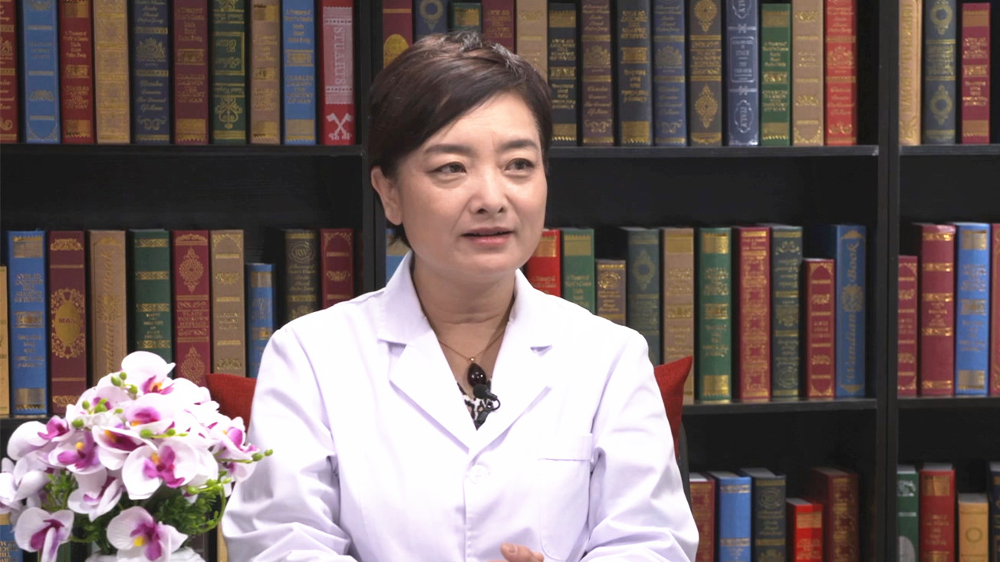

瘢痕妊娠
========

段华 主任医师
-------------

   1678288383371

首都医科大学附属北京妇产医院妇科微创中心主任 主任医师 教授
博士生导师；中华预防医学会生殖健康分会副主任委员；中国医师协会内镜医师分会副会长；中国整形美容协会科技创新与器官整复分会会长；北京医学会妇科内镜学分会主任委员；北京医学会妇产科学分会副主任委员。

**主要成就：**
国务院政府特殊津贴专家、首届国之名医•卓越建树专家、中央保健会诊专家、第七届首都十大健康卫士；主持多项国家级、省部级课题，研究成果获国家科技进步奖二等奖、北京医学科技奖一等奖、中华医学科技奖二等奖等。

**专业特长：**
擅长妇科常见病与疑难病症，如异常子宫出血、子宫肌瘤、子宫腺肌病、宫腔粘连、子宫畸形、子宫内膜异位症、卵巢肿瘤、盆腔器官脱垂与尿失禁等。尤其对各类子宫疾病、保留生育功能的微创治疗有深入研究。

什么是瘢痕妊娠？瘢痕妊娠会有哪些风险？
--------------------------------------

（采访）受精卵有可能会长在上一次剖宫产切口的部位，是不是我们平常说的瘢痕妊娠呢？

对，是的，瘢痕妊娠就是有过剖宫产手术史的。这次怀孕，胚胎刚好不偏不正地跑到这个地方来着床了，在这植入了，因为这个地方是一个缺陷，非常薄，所以在这植入带来的风险，第一个是胎盘植入，因为要获得血供，所以就会往肌层组织里边深入，这个地方内膜很薄，不像在正常子宫腔里有很肥厚的内膜，胎盘和内膜之间的接触，进行母体的血液交换，相当于着床在瘢痕部位了，随着孕囊的增大，有大出血的风险，还有破裂的风险，瘢痕妊娠一经发现必须要尽早终止，尽可能不要让它长，一旦长大，将来后续的并发症是很多的，甚至都是要命的。

（采访）有没有这样的可能，就是受精卵着床在切口的部位，但是观察观察它又长上去了？

有，有些病人不听话，瘢痕妊娠医生已经告知妊娠要终止，但是病人觉得孩子太珍贵了一定要，临床上真有这样的病人。因为瘢痕妊娠的诊断只限于12周之内，也就是在怀孕12周之内是在瘢痕上，如果12周之内受精卵，也就是胚胎能够在这个地方生长，能够着床，12周以后就会随着子宫的增大往上走，往子宫腔里头走，但是胎盘的着床就在这着床，就着在下段，就会形成胎盘的附着点很低，就是前置胎盘，甚至有可能完全覆盖到创面上。

胎盘是母体和孩子之间血液交换的中转站，或者是供应站，像一个大血池子一样，所有的营养和能量是要通过胎盘，通过脐带进入到胎儿体内，是要进行营养的交换，血供是非常丰富的。如果已经过了这个点，到孕中期甚至孕晚期，剖宫产手术的时候都会是非常高危的孕妇，随时都有可能前置胎盘大出血，一旦胎盘剥离，出血像水龙头一样哗哗的，很快会要命的。另外在手术当中胎盘植入，这个地方内膜很薄，或者没有内膜，就要深入到肌肉里，到肌肉里才能获得血供，胎盘植入以后跟子宫就没有边界了。正常生完孩子，胎盘就会自己剥脱，因为胎盘和子宫之间是有界限的，中间是衬着内膜的，这些胎盘的血供完全长到肌肉里，不会剥脱，胎盘植入以后非常严重的子宫不收缩、大出血，这个时候在分娩过程当中是要命的，最后不得已可能就要做子宫切除了，因为实在止不住血，再不切子宫很快就没命了，后续的风险是非常高的。

说到这儿还是想提醒孕妈妈们，特别是有过剖宫产史的，医生的评估、建议不能不听，不能去逆着常规和原则，一定要逆着去做，是要承担风险的，而且孕期特别是二胎政策放开以后，最近这两年孕产妇并发症、大出血，包括死亡的风险增加了很多。可能有些人觉得没发生到自己头上，不知道，作为医生是非常清楚的，这个并发症最近两年，孕期出血，包括子宫切除甚至死亡的风险，已经明显的比以前增加了、增高了，为了原本可以避免的死亡，一定要铤而走险，一定要去冒这个风险，后果是非常严重的，在这里也是提醒孕妈妈一定要好好去慎重考虑，好好听大夫的建议。

（采访）所以其实瘢痕妊娠它是风险很大的，一般都会建议终止妊娠？

对，如果是要诊断，一般在早孕期都建议终止。

瘢痕妊娠早期有症状吗？发现瘢痕妊娠后应怎么办？
----------------------------------------------

（采访）瘢痕妊娠，会不会早期有一些症状能够发现？

这是大家很关注的话题，虽然宫颈、子宫是不同的部分，对老百姓来说都叫子宫腔。怀孕了以后大部分的瘢痕妊娠，早期是没有特别明显的症状，有一些病人可能会有类似流产先兆的症状，比如会有点出血，淡淡的粉粉的，会有肚子下坠的感觉，通常早期症状都是不会特别明显。当出现大出血的时候，比如是流产，或者就是瘢痕妊娠，处理起来就非常被动，因为胎盘附着在子宫的瘢痕部位，瘢痕是结缔组织，包括宫颈也是纤维结缔组织，不是平滑肌组织，这个地方一旦大出血，对用药比如缩宫素，也就是催产素，让子宫收缩的药物，很多在这个地方不敏感，在子宫上一打子宫就收缩了，血窦就关闭了，但是在这个地方可能血窦不关闭，不关闭可能就一直会出血，所以这种出血是很凶险的。

以前做过剖宫产手术这次又怀孕了，建议尽早的去医院查一下受孕的部位是不是在比较靠下，是不是在瘢痕切口处，就不要觉得没有症状，有症状的时候再去发现是瘢痕部位，处理起来就比较被动。如果尽早知道，医生会采取很多提前的预案和措施，不让发展到这一步，来终止妊娠。

（采访）是不是按时定期的产检，也有助于发现是不是瘢痕妊娠？

产检已经到后期了，再去发现瘢痕妊娠就太晚了，因为瘢痕妊娠也就是12周之内是要处理掉的，50天之后知道怀孕，以前又做过剖宫产，特别是做过两次剖宫产的，最好是要到医院查一下，看看这次受孕的部位，也就是胚胎种植在哪，提前能够让自己和医生心里都有一个数，不要等到孕期中晚期了才去定期检查，孕期定期检查已经不是查瘢痕部位的妊娠了，查的是胎儿发育的情况跟你的孕周是不是相符合，查的重点就不一样了，到那个时候再去查时间就已经过了，剖宫产以后瘢痕妊娠没有处理，一直到了中期，就是非常高危的对象，大夫都得把病人列为高危对象去做定期的监控，因为随时都有可能出现很致命的并发症。

发生瘢痕妊娠后，终止妊娠的方法有哪些？
--------------------------------------

（采访）瘢痕妊娠一般建议终止妊娠的话，那是怎么办，怎么做呢？

终止妊娠要看胎盘附着的部位、来就诊的时间、孕囊大小。终止的方法有很多种，目前在临床中可以用药，也可以直接吸宫，做血管栓塞甚至宫腹联合手术，这个是病人自己决定不了的，是要看了医生以后，医生根据病人的病变，比如受精卵的大小、血流的情况、前次剖宫产局部瘢痕的情况，做全面的治疗策略。而不是所有人都去做刮宫，都去吃药，不能够以这样的方式去告诉大家，只能去医院，听医生根据病人情况去做治疗的决策。

瘢痕妊娠能预防吗？
------------------

（采访）主任，有剖宫产史的这种女性，她有没有什么办法可以预防避免发生瘢痕妊娠？

妊娠的发生是没有办法预防的，剖宫产瘢痕也是一个特殊部位的异位妊娠，最常见的异位妊娠在输卵管，就像怎么预防才能不发生宫外孕，剖宫产瘢痕不叫宫外孕，算是宫内的孕，但是也算是异位妊娠，因为不是正常部位的妊娠，对于这种预防，医生是束手无策的，没有办法预防，但是能够做的就是减少引起妊娠的因素，对于剖宫产切口的妊娠，没有明确指征就尽量不做剖宫产手术，就不会发生这个病了，因为这个病是手术造成的，不做手术就不存在了。

对于宫外孕也是一样的，之所以宫外孕是因为输卵管堵了，或者通畅度受影响了，为什么受影响？因为盆腔有炎症、有感染了。炎症也是女性特别常见、多发的，因为外来的病原菌突破了门户，进入到盆腹腔了，会在盆腹腔里边形成感染、破坏，造成粘连、扭曲，输卵管不通或者通而不畅，这都是带来的后续影响，为了解决后续的影响，只能从源头上去处理，对于剖宫产瘢痕妊娠，不做剖宫产就没有并发症，都没有做过剖宫产手术，就永远不用担心会出现这种情况，不可能的。

瘢痕妊娠终止妊娠后，多久可以再怀孕？
------------------------------------

（采访）对于瘢痕妊娠的这样的妈妈，她可能就是想要二胎。这次瘢痕妊娠终止了妊娠，多久还可以再怀孕？

瘢痕终止了以后，还是要评估瘢痕的范围、大小，如果瘢痕很大，有可能还要做修复，这种修复通常需要把大瘢痕都切了，重新缝上，重新长，过程至少一年以上下边重新缝合的创面才能够长好。是不是能够完全长好，之前还要和孕妇说清楚，手术是不能够保证百分之百的，如果能够顺利长好，至少要一年以后才能再考虑怀孕的事。

孕中期才发现是瘢痕妊娠，风险大吗？
----------------------------------

（采访）主任，如果孕妇在孕早期没有发现，等到孕中期了，她去做检查才发现它瘢痕妊娠了，这是不是就风险很大了？

剖宫产瘢痕妊娠是有过剖宫产手术病史的孕妈妈们当中非常应该关注的问题，因为之前已经做过剖宫产，子宫上是有瘢痕的，再次妊娠的时候是不可以掉以轻心的，剖宫产瘢痕妊娠的风险可能会发生在有剖宫产手术史的每个人身上。

所以在孕早期的时候，一定要及早去查一下，看看受精卵植入，也就是胎盘长的这个地方，很多剖宫产瘢痕妊娠早期是没有症状的，有些人就觉得瘢痕妊娠怎么会发生在自己身上，可能就不会去关注。比如不尽早检查，后面怀孕四五个月了想起来去检查，这个时候处理起来就非常棘手。因为胎盘已经都完全形成了，所有跟子宫相衔接的地方已经都植进去了，这个时候就不像早孕，比如也可能动脉栓塞，加上吸宫或者是用药杀死胚胎再吸宫，可能就能处理，这个时候胎儿也大了，处理起来就很麻烦，等于和到足月或者发生了并发症处理差不多一样的，甚至会大出血，还得要切子宫。

所以有剖宫产手术史的孕妈妈，不要掉以轻心，早孕的时候一定要及时到医院去做检查，让大夫先明确受孕精卵种植的部位，对自己、对大夫和今后整个孕期过程，至少有一个安全的前提，不要等到所有的事都拖到最后才想起来去补救，补救本身就是一种伤害，虽然是在抢救，挽回伤害，那只是程度轻重而已，后果是需要孕妇承担的。
