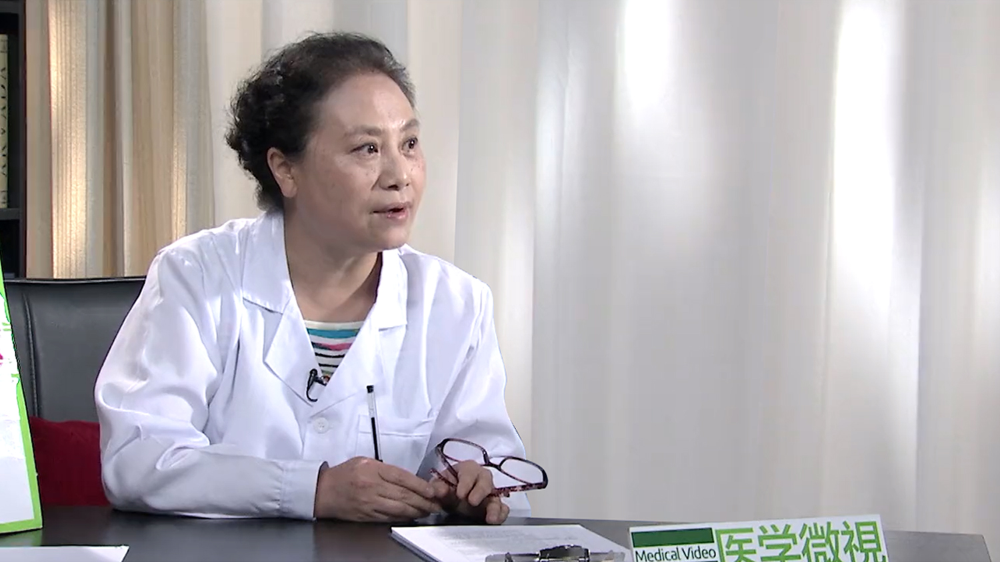

产后避孕
========

李坚 主任医师
-------------

   1678354443687

首都医科大学附属北京妇产医院妇产科专业主任医师 妇产科学教授
博士生导师；中华医学会计划生育学分会第七届主任委员
第九届委员会常委；北京医学会计划生育学分会主任委员；首都医科大学宣武医院妇产科客座教授；全国妇联执委会执委。

**主要成就：**
获北京市卫生局1996年度科技成果二等奖；获2009年国家科技部-华夏高科技产业创新奖（医药类）特别创新奖；获2013年国家科学技术进步奖二等奖；主编主译《围产医学-最佳证据》《避孕节育手册》《Family
health guide(家庭健康指南)》《米非司酮临床应用》。

**专业特长：**
擅长子宫肌瘤、卵巢囊肿，子宫内膜异位症、子宫肌腺症，月经失调、异位妊娠和剖宫产瘢痕妊娠、生育调节、优生优育和不孕不育咨询指导和诊治；擅长各种避孕节育方法咨询指导和手术，相关并发症诊治；擅长输卵管整形，绝育术后输卵管吻合等复通手术，妇科宫、腹腔镜手术。

产后多久来月经？多久需要避孕？
------------------------------

（采访）正常来说产后多久会排卵？多久又会来月经？

其实你问了特好的一个问题，因为我觉得可能多数人大家都是有点糊涂，我们先说产后避孕的事儿，因为这个目前从我们临床服务来讲，现在是个薄弱的环节，而又是我们必须要面对的一个特别严峻的挑战。

产后应该说月经和排卵的时间两个不是同步的，多数情况下应该是说月经恢复不恢复，跟排卵之间没有必然的一个联系。很多人应该是在第一次月经恢复前就恢复了排卵。

所以我在这里面想跟大家澄清一件事情，无论是避孕的问题也好，或者是说到我们是不是产后恢复了排卵，一定要知道不是说来了月经了我们才需要避孕，来了月经了我们才有排卵，所以我们需要避孕。而是说在这之前，只要生完孩子，我们就应该采取避孕。

比方说多数的人月经的恢复状态大概应该是在20-120天，平均应该是一个半月到两个月这个期间。排卵就不一定了，有的人排卵很快就恢复了。所以因为排卵和月经的恢复两个不同步，所以更应该引起我们的注意。

很多人以为我来了月经了，我才是排卵了，所以我才开始避孕。因此等于是自己陷进的一个陷阱。实际上在临床上很多人产后没有来月经，她也会怀孕，为什么？就是因为她产后排卵会在月经前。

在这里边我们要强调的，希望大家要知道，就是说如果我们喂奶的妈妈一般的情况下可能是要在43天左右。从月经的恢复来讲，应该说大部分人在产后四个月左右怎么也应该恢复月经了，多数人是这样子的。如果要是说不喂奶的妈妈，可能月经会恢复的更早一些。

（采访）您刚才说到的排卵和月经来它并不是同时的？

你说的特对。

（采访）不代表说我们月经没来就没排卵？

没错，我就想说明这个事情，因为过去的时候大家可能老是觉得我来月经了才排卵，然后就是证明排卵恢复了，可能我这时候要考虑避孕问题。所以我们说就是说不管你来不来月经，排卵很多人都会恢复了。

再有一个就是我们不应该以月经作为排卵的标志，也不能说我们产后避孕是以月经为依据，就来不来月经为依据，那么从产后就应该开始避孕了。

产后多久可以进行性生活？
------------------------

（采访）产后多久可以进行性生活？

关于产后性生活的问题，我们没有一概的定论说你什么时候就开始性生活，但是我们生殖器官的恢复需要6-8周的时间，所以在你生殖器官没有完全恢复正常的时候，你不应该开始有性生活。

我们实际上一般讲产后应该是42天，我们叫产后结束了，大家知道我们产后42天要做产后的复诊或者产后复查。主要是根据因为你的生殖器官在6-8周恢复正常了，我们医生检查完了就说围产期已经结束了，产后这件事结束了。这跟我们产后避孕又是另外一个概念。我们说产后42天来复查了，说明我们的妊娠的这件事已经结束了，后面你可以有正常的性生活。

当然在我们国家可能也做过相应的一些统计，比方说大概产后有性生活的人，可能城里边的人倒稍微的晚一点，大概3个月多一些，农村的一些人可能会要稍微早一点，可能在2个多月的时候，有个别人可能就有性生活了。大概平均下来应该是3.5个月，可能有些人就开始有性生活了。

（采访）所以一般还是建议6-8周之后，等到性器官恢复了之后再进行性生活。

对，就是说你应该是产褥期结束了可以有性生活。如果这时候你没有恢复正常，也不建议你有性生活。

产后多久可以再次怀孕？两次怀孕间隔时间较近会有什么危害？
--------------------------------------------------------

（采访）建议产后多久可以再次怀孕？

其实有过相关调查，比方说我们调查到了产后这些妇女，问她产后这两年有没有意愿再怀孕，其实百分之八九十的人都觉得我在产后两年之内，都不想有妊娠。但是确实有些人由于避孕的问题造成的生育规划里边的漏洞，所以有些人就怀孕了。

现在世界卫生组织在讲，全球范围内大家达成共识，应该是这次妊娠和下次妊娠之间隔两年比较好，这是比较合理的一个妊娠的规划。

因为有一些相关的研究，比方说妊娠太近了，这个就会对妈妈造成影响，同时也会使不良的妊娠结局增加，同时也会增加产时的一些风险，包括如果你要做人工流产，也会增加人工流产过程中的一些风险。

先不说人工流产的问题，比方说有过剖宫产的人，小于12个月的这种人，如果你怀孕，子宫破裂几率就明显的增加。如果你要是两年以上再怀孕，那么你的发生子宫破裂的几率就比在12个月内怀孕的人要低三倍，也就是说我们在12个月内剖宫产术后的人，如果12个月内再次怀孕，子宫发生破裂这几率明显的高于两年以上的人。

同时还给你一个信息，曾经在国际上做了一个大概10年43个国家，许许多多的这些妇女的一个调查研究，发现如果是在两年以后怀孕的人，大大降低了孕产妇死亡率。因为现在国际上包括我们国家，大家对于孕产妇死亡率非常的关注，是一个国家的公共卫生的监测非常重要的一个指标，所以我们说现在全球范围内大家公认的就是两次妊娠之间应该隔两年比较合适。

为什么产后一年内一定要避孕？
----------------------------

（采访）为什么建议产后一定要进行避孕？

产后有一些风险，首先你生殖器官是不是恢复了，妈妈的身体是不是恢复了，还有很多的理由来支持我们为什么强调产后避孕的问题。

我先说产后避孕到底指的什么？产褥期是42天，为什么是42天？因为在这个时候，42天之前我们还在围产保健期里边，
42天以后就恢复到了非孕期的这种状态了。

但是产后避孕指的是什么时间？就是产后从孩子出生，不管你是剖宫产还是自然分娩，一直到产后一年这个期间，我们叫产后管理范围。原因在于什么？因为大家知道产后会有很多很多的保健工作，比方说42天的复查，孩子的免疫注射等等，产妇会特别频繁地接触这些公共卫生的服务提供者，还有临床的这些医生。她会接受到特别多的关于公共卫生的一些服务，所以我们说产后避孕我们定义在产后一年之内，因为她有更频繁的机会能够接受到这些服务。

我们说产后避孕为什么这么重要？原因在于还是在说孕产妇死亡的问题，如果能够把生育间隔拉长到两年以上，同时适当的控制我们的这种生育的数量，孕产妇死亡率会降低30%，这是一个非常可观的数据。

还有一个原因，妈妈的死亡可以造成五岁以下孩子的死亡率增加，大家知道我们现在还有一个关注就是，新生儿的死亡率。还有什么？还有一个五岁以下的儿童的死亡率，妈妈死亡会造成这两个比例的数据的增加。我们说那是比较宏观的，大家可能也许感受不到，因为觉得我们周围生孩子不都挺好的吗？

我们再说说，如果你产后怀孕了，会有很多的人产后认为，我产后两年之内不想再怀孕了，但是你知道有多少人真的去避孕了，实际上才占到了30%，就是说很多人还是没避孕。那么这里边还有一个数据，虽然有30%的人能够避孕，但是她采取的方法都是那种低效的，或者没有常规做避孕。

这就带来一个问题，如果产后近期怀孕了，你刚才问产后干嘛要避孕？那么你不避孕，有那么多人很快就恢复排卵了，如果你不避孕，你是生育年龄妇女，毕竟要带来一个问题就是妊娠的问题。

我们说产后妊娠，我们叫非意愿妊娠的人占了一大部分人，这些妊娠的人你去问她，你是不是真的想要这孩子，或者你是不是就计划要这个孩子，然后你会发现有大概70%多的人会认为根本就不想要这孩子，就说叫非意愿妊娠或者叫非计划妊娠。

非计划妊娠带来的一个问题，可能会有很多人，因为你没有计划，你不是想要这孩子，你可能就要终止妊娠。所以我们说产后妊娠以后，我们说叫意外妊娠，特别是这些意外的妊娠，带来两个结局，要不然我们就去做人流终止妊娠，要不然我们就去生孩子。

就是说我虽然是非意愿妊娠了，但是我可能会要去走向计划性分娩了，但是两者都会带来很大的风险。如果剖宫产术后你近期妊娠了，子宫破例几率增加了。再有一个很重要的一点，就是我们说不良妊娠结局，太近了怀孕会出现什么？比方说低体重儿的问题，胎儿发育迟缓的问题，自然流产的几率，胎停育的几率，这些几率都会增加。

还有什么？早产的几率增加了，再有胎盘着床异常的几率增加了，比方说前置胎盘的问题、胎盘植入的问题、低置胎盘的问题，还有胎盘粘连的问题等等，它就会造成什么？就是说你在产褥期会带来这么多对妈妈和胎儿的影响，你可能说我不愿意冒那些风险，我可以去人工终止妊娠。

你会发现人工终止妊娠在产后近期怀孕的人会出现什么？残留的几率的增加，出血的几率增加，终止妊娠的过程中还有什么子宫损伤的几率增加。特别是哺乳期的妈妈，剖宫产术后的那些妈妈，子宫损伤的几率增加，感染的几率增加了等等。

实际上我们就是说产后近期非意愿妊娠了以后，你是生孩子还是做人工流产，对妈妈、对胎儿都会有很大的影响，因此我们说产后一定要避孕。

我们有三个理由在这：一，你产后两年之后怀孕是比较好的，合理生育间隔。再一个，产后妊娠了，如果你去分娩，会有不良妊娠结局，你做人工流产，并发症几率会明显的增加，所以给我们非常充分理由，产后应该避孕。

（采访）我们产后避孕不仅是对妈妈的身体是有保障，对可能再次怀孕的胎儿或者是五岁以下，就是已经出生的孩子都是非常有保障的？

对，妈妈是一个家庭的支柱。

为什么剖宫产后更要特别注意产后避孕？
------------------------------------

（采访）主任，为什么剖宫产的妇女要更注意产后避孕呢？

如果你继续妊娠子宫破裂几率增加了，你做人工流产损伤的几率增加了。还有很重要的问题，剖宫产术后近期怀孕，剖宫产切口妊娠的几率增加了，我不知道大家现在有没有这个概念，实际上剖宫产切口妊娠已经是我们国家现在叫新发的常见疾病了。

因为我们国家过去剖宫产率比较高，大家的剖宫产术后避孕的这种意识又很淡薄，所以在我们国家现在剖宫产切口妊娠的发生率非常高。如果你剖宫产产后不能够很好的避孕，就加剧了剖宫产切口妊娠发生的这种机会。

剖宫产切口妊娠会在临床上造成很大的一个风险，就是不可抑制的大出血，甚至妈妈的生命都会因为这个而造成影响，同时还有一个问题就是剖宫产术后如果出现了剖宫产切口妊娠，那么子宫切除的几率也会大大的增加。

所以我们说实际上剖宫产术后，为什么强调剖宫产术后的人更需要避孕，就是因为它明显的增加了剖宫产切口妊娠的发生几率，在我们临床的诊治过程中造成了很大的困难。

（采访）如果剖宫产之后没有及时避孕，在近期又妊娠了，然后会非常大的增加剖宫产切口妊娠的风险？

没错，在临床处理起来很困难，比方说残留的问题、大出血，甚至因为她切子宫更严重，造成妈妈生命的丢失。

（采访）就是严重会危及生命，所以还是要建议剖宫产以后一定要及时的避孕？

是的。

产后避孕有哪些方法？哺乳和不哺乳的妈妈应用激素避孕有何不同？
------------------------------------------------------------

（采访）主任，我们知道产后避孕非常的重要，那产后应该如何避孕？

这是一个特别现实的问题，一个非常实际问题，产后避孕非常的重要，也非常的必要，我们产后怎么去避孕？我们应该说现在产后避孕是我们围产保健或产后保健里面非常重要的内容，在国际上已经把它纳入到我们产后服务的必备的内容之一。

产后避孕的问题我们讲一个是时机的问题，一个是避孕方法选择的问题，我们在产后避孕可能大家更多的关注就是比方说妈妈身体是不是恢复正常了，避孕过程中会不会对孩子有影响，特别是激素避孕等等。

产后避孕从孩子一出生这一刻开始就应该避孕了，不管是你自然分娩还是剖宫产手术分娩，那么从这一刻就开始，比方说最直接的我们在手术过程中，在分娩以后，在胎盘娩出以后，我们最直接可以落实的就是什么？宫内的避孕系统。

宫内的节育避孕系统在产后48小时之内我们可以应用，如果要说我错过了48小时，那么就应该在产后的4周开始应用，这是一个时段。

还有就是在产后即时可以落实的，就是女性的绝育，女性绝育可以在产后72小时之内，如果超过72小时了，她感染几率增加了，我们就不做。那什么时候开始做？产后6周以后就又可以开始做了，因为宫内节育避孕系统，包括含铜宫内节育器，包括含激素的左炔诺孕酮，我们叫宫内缓释避孕系统，在产后都可以即时应用。这些都对孩子没有影响，包括绝育。

我们下面要谈的一些方法，有可能大家会想到，比方说可能有些人关注我产后避孕方法选择的时候会不会影响孩子的发育等等，实际上关注的是什么？我们还有一类的方法，叫激素避孕，激素避孕这里面除了刚才我们说的宫内的缓释的避孕系统，因为它只在子宫局部作用。还有一些方法，比方说皮埋的问题，肌肉注射，三个月注射一次的这种注射针剂。还有口服的避孕药具，这类的都属于激素避孕方法。

什么时候开始使用？我们要把产妇分成两部分人，一部分就是喂奶的妈妈，还一部分就是不喂奶的妈妈，因为某种因素她不去喂奶了，喂奶的妈妈和不喂奶妈妈在应用激素避孕的时候也不一样。

激素避孕是什么？激素避孕就是一个是雌激素，一个是孕激素。我们的避孕药具里边，比方说注射针剂、皮埋剂，还有宫内缓释避孕系统，这些都属于单孕激素避孕。你可能说既然有单孕激素，可能还会有不是单孕激素的，因为刚才说了，这个甾体激素有雌激素和孕激素两种组成了避孕药具，复方的激素避孕药具就是我们说的同时含雌激素和孕激素。

对于那些不喂奶的妈妈，如果你要想采取激素避孕的话，产后立即就可以采取了。如果要说因为单孕激素避孕有的时候会带来一些出血模式的改变，所谓出血模式改变，就是我们一个月经周期里边，从第一次月经到下次月经中间我们有多长时间会出血。

常规情况下是5-7天，这属于正常的。单孕激素避孕，有些人可能出血模式就不只是7天了，可能会有其他的一些变化，当然这些变化对身体都没有什么更严重的影响。

有些人说我想还是维持原来的那种月经周期，还是要维持原来的那些出血状况，那么我可以不可以采取复方的，就是我们说的含雌孕激素的这种避孕药具，我们临床多见的是口服避孕药，叫复方短效口服避孕药，那么可以不可以？可以。不喂奶的妈妈可以在产后3周以后可以使用。

其实我们现在临床上还是更多的建议大家如果想要服用复方的短效口服避孕药还是建议她你可以在42天以后，也就是说我们说在产褥期以后，为什么要强调这个？因为我们在产后避孕的时候，我们还有一个问题要考虑的就是会不会增加了血栓发生的几率。

因为可能大家知道我们在怀孕期间，血栓的发生几率比我们没有怀孕的时候要高得多，特别是在产褥期时间，血栓的发生几率比非孕期的时候要高得多。为了防止这种发生，我们说如果你要想使用这个激素避孕，我们一般还是建议她在42天以后，因为42天以后你就恢复到了非孕期的这种生理状况了，所以就可以大大的减少。

虽然整体的血栓发生几率在我们亚洲人群里边发生几率非常的低，但是还是如果我们有条件能够选择的话，我们可以错过她的风险期，所以我们可以42天以后。当然我们说从世界卫生组织给大家建议就是，如果你要想采取激素避孕，就像我刚才说的，如果你不喂奶，那么产后立即可以使用；如果你要使用复方的，含雌孕激素的，那么产后3周以后你可以使用。

对于喂奶的妈妈，可能除了关心血栓的问题，还要关心对孩子的影响，所以我们说如果你要想采用单孕激素避孕，那么应该是在产后6周就42天以后；如果你要是想采用复方的，就是含有雌孕激素的，我们还是建议大家应该是在产后6个月以后。

这就是关于产后哺乳到底哺乳到什么时候更合适，实际上是有界限的，我们还是建议大家哺乳到6个月，因为6个月以后我们会有很多其他的公共卫生保健的一些事情要我们去关注了。

如果说在产时我们没有落实比方说宫内的避孕系统，没有落实绝育术，然后你出院了也没有想采取比方说我们说的激素的避孕，比方说皮埋也好，口服避孕药也好等等，肌肉注射的避孕针剂也好，你一定要采取屏障避孕，屏障避孕是什么？男女避孕套。

而且从大量的研究的结果，无论是临床研究，还是经验的总结，那么都提示男用避孕套它的避孕效果在产后会比女用避孕套更高一些，所以还是建议大家使用男用的避孕套。我们希望能够避孕有效，同时也安全。

皮下埋植避孕是怎么回事？产后多久可以埋植？
------------------------------------------

（采访）皮下埋植是怎么回事？

皮下埋植是这样的，应该是说在20世纪90年代初期的时候，国际上就在推皮下埋植，那么它实际上是一个小的硅橡胶的这种胶囊也好，或者是胶棒也好，它把避孕的甾体激素放到了胶囊里边，或者是放在胶棒里边。埋在我们上臂的内侧的皮下，它有一个非常好的好处，就是它埋植以后24小时以后就可以产生避孕作用了。

随着这两年的研究的结果，现在世界卫生组织主导的是要推单根型的皮埋剂，因为过去的时候我们是两根型和六根型的，一个是埋植起来操作要多一些，那么单根型的比较方便，就是一根埋进去，而且它的避孕的时限比较的适宜，它避孕的有效率是3年。过去两根型的和六根型是避孕5年。

比较好的生育间隔是两年，单根型的更适宜中长期的一个避孕的方法，它是单纯的孕激素避孕，单孕激素避孕，通过释放到体内，然后它多环节的一个作用起到一个高效的避孕作用。对于那些产后的妈妈如果不愿意做宫腔操作或者因为某种原因不适合放置宫内的避孕节育系统，就可以采取这种避孕方法。

它也属于单孕激素避孕里面就是刚才我们说的，比方说宫内缓释避孕系统是单孕激素，皮埋是单孕激素，还有肌肉注射的，我们说3个月一重复的这种避孕针剂，都可以使用非常好的一个方法。

其实我觉得避孕方法多了，大家选择余地也大了，对于我们服务提供者服务的时候，我们手头会有更多的工具来满足更多人的一个需求。因为大家知道我们说全球范围内每年会有上亿的人，没有满足她的避孕需求，这里边产妇占了很大的一个比例，所以是非常值得我们去关注的。

（采访）您提到皮埋它是可以维持3年，如果这3年之内想要停止避孕，可以取出来吗？

对，取出来以后就可以怀孕了，就说我们所有的激素避孕，特别是我们现在用的宫内缓释避孕系统和皮埋剂，包括我们口服避孕药，只要把这个药物停了，来过一次月经，我们就可以怀孕。

对于口服避孕药它还有它的优势，就是我们说口服避孕药在临床上也经常会用在妇科的调节月经，帮助那些月经不调的人去怀孕等等，那么万一一旦发生怀孕，你把口服药停止就OK了。

（采访）主任，产后多久可以埋植皮下避孕剂？

它是属于单孕激素避孕，按照我们常规把产妇分成两部分，非哺乳的和哺乳的，皮下埋置剂如果要是不喂奶的妈妈，产后立即就可以使用了；如果要是喂奶的妈妈，6周以后再开始使用。

实际上目前的研究证明就是皮埋剂它对哺乳是没有影响的，无论是它的量，还是它对胎儿的影响。

（采访）就是这个风险度是没有增加的，妈妈也不必太担心说雌孕激素会影响到她哺乳的孩子？

对，因为是这样，如果要是雌孕激素，复方的这种避孕药具，哺乳的妈妈一定要在产后的6个月以后再开始使用。如果能够产后近期使用的，哺乳的妈妈是6周以后开始使用那种单孕激素避孕的，就是比方说肌注的，还有皮埋等等这些。如果要是不哺乳的妈妈，我们产后立即就可以使用这种单孕激素的方法避孕了。

产后多久可以放置宫内节育器？需要注意哪些事情？
----------------------------------------------

（采访）产后放置宫内节育器需要注意哪些事情？

产后放置宫内节育器，因为在不同时期可能并发症或者是风险也不太一样，那么世界卫生组织主张产后可以立即放置，但是要根据不同国家的状况，比方说在我们国家产后立即放置，产科大夫常常不怎么做，放置宫内节育器，所以他的经验也不足。

因此在我们国家常规里面，一般我们建议产后42天以后再放置。其中还一个原因我们要关注的就是我们说产后立即放置是可以，但是它的脱落率会偏高，因为子宫比较大，而且子宫从一个妊娠的子宫变成一个非孕期的子宫，那么它在收缩的过程中，在整个的生殖器官恢复的过程中，有一些人宫内节育器会下移，甚至会脱落。

所以针对这一点，一个是产科大夫的经验资质的问题，还有一个就是宫内节育器它自身的一个特点，在这个时间段放置过程。所以在我们的2017版的计划生育的临床的常规里边，我们是建议大家在产后42天放置，因为42天以后已经恢复到了非孕期的状况，那么绝大多数人的生殖器官恢复正常了，我们这时候放置，她可能发生的一些副反应，就跟我们在非孕期时其他的人是一样的了。

所以要注意什么？其实主要是从我们提供的时机的角度来讲，你什么时机更合适，什么时机更安全一些，我们从这个角度来考虑，我们建议42天以后放置，

（采访）您刚才提到可能会有并发症，那可能会有哪些并发症？

比方说我们在产后大子宫过程中可能这个位置放置的不合适，那么还有就是子宫损伤的问题，生完孩子子宫非常软，宫壁也非常薄。我不知道你们知道不知道，咱们还有一种叫吉妮环的，吉妮环它叫固定式的宫内节育器，所以有些人如果说我必须在产时，就是我生完孩子以后马上放置，也可以去尝试放置固定式宫内节育器。

固定式宫内节育器解决了一个什么问题，就是你这环下移的问题，因为它是可以钉到宫壁上。但是反过来还有另外一个问题，就是因为它是一个有创操作，它要钉在宫壁上，刚才我们说了在产后宫壁非常软，而且也比较薄，所以有的时候比非固定式的宫内节育器容易造成子宫的损伤。所以一定要权衡利弊。

因此我们说实际上，在产后不同时期采取不同避孕方法，针对每一个产妇来讲，我们要权衡利弊，实际上是我们就说原则就是要安全、要有效。

（采访）在产后42天之后放置宫内节育器需不需要避开经期？

那当然了，产后42天以后，跟我们非孕期放置宫内节育器一样了。分两种，如果放含铜宫内节育器，在月经干净以后，
3-7天别同房来放置；如果要是放置含激素的宫内缓释避孕系统，们应该在月经的高峰期过去。因为我们月经通常人是5-7天，但是你会有一两天比较多，一般人可能都是在前三天，比方说1-3天或者2-3天的时候月经比较多，避开月经比较多的时候，然后我们再放置。

同时在产后42天放置时候还有一个特殊要求，就是我们需要注意她子宫是不是真的恢复正常了。因为我们说生殖器官的恢复要6-8周，不是每个人真的严格地按照我们这个去走，我们只是说大部分人是这样。

我们要一个是看她生殖器官是不是真的恢复正常了，再一个你有没有侧切伤口，侧切伤口是不是长好了，自然分娩的，阴道分娩的。你做剖宫产的人，剖宫产切口是不是长好了，腹壁的伤口是不是恢复正常了，这些情况都是我们所要说的，就是强调在特殊的时段她需要注意的事情。

同时我们在常规上还提出了，因为产后42天我们放置，需要那些临床上有经验的大夫去进行操作，而不是一个刚毕业的大夫去操作，毕竟在这个时段它有它特殊的一些风险存在着，因为我们说产后42天有些妈妈还在哺乳，那么哺乳子宫很容易容易产生子宫的损伤等等这些问题。

（采访）所以一般来说还是要建议产妇在产后42天之后恢复到非孕期的状态下再放置这个？

我们国家是这样，就是说世界卫生组织说从我们的研究和临床实验确实产时立即可以放置，比方说我们国家在80年代末，90年代初的时候，我们国家做了一个大规模的研究，不同含铜量的宫内节育器，还有就是固定式和非固定式的，产后妇女放置，那么当时就结果研究出来以后，我们就制订了我们2005年当时的一个临床指南，在指南上我们就说应该是剖宫产术后半年再放置宫内节育器，产后三个月再放置宫内节育器。

原因在于什么？就是说我们在产时即时这个时候是可行的，但是我们要权衡利弊，安全性，一个是安全性，一个有效性，有效性实现了，安全性怎么样？在那个时候我们说脱落率偏高，造成子宫损伤的几率增高，那么我们还是应该建议在后面。

那么为什么你说我们到2017年，我们又开始把放置的时机又往前提，就结合我们现在的这种严峻的挑战，产后不避孕造成那么多的高危妊娠的出现。还有大家避孕意识的问题，以及这么多年研究的结果，42天，我们又把这个时间段提前到了42天。所以就是说你要权衡利弊，我们前面讲的在很多的时期都可以实施，那么哪个时期实施更合适，要针对不同产后妇女。

产后避孕可以选择口服避孕药吗？可以应用紧急避孕药吗？
----------------------------------------------------

（采访）对于避孕药应该怎么样选择？

避孕药比方说如果你说我不用放置宫内的避孕系统，我又不愿意做皮埋，我更不可能去做绝育，我只愿意用避孕药。比方说叫不哺乳的妈妈，如果你要愿意使用，产后立即可以使用的是单孕激素避孕。如果要是复方的，我们就应该产后要延迟一段时间。

哺乳的妈妈如果你用单孕激素，一定要在产后6周以后，如果使用复方一定要在产后6个月以后。我们为什么要说这个，因为这些激素避孕它是有一个时限限制，如果你能够更好的，实际上我们提出叫及时落实避孕措施，你产后6个月，那这6个月避孕怎么管理？可能对于她来讲工作的压力，孩子的压力等等，她可能就忽略避孕的问题。

所以我们说产后的长效避孕措施，如果她没有禁忌证，她能够接受是一个非常好的一个方法。

（采访）产后可以服用紧急避孕药吗？

很多做人流的人，不管是产后的，还是一般情况时意外怀孕来做人流，很多人是在使用紧急避孕药避孕。并其实我们说紧急避孕药避孕确实是一个挺不错的一个方法，有效的方法，但是它从理论失败值就是25%的失败率。

再有一个，紧急避孕药使用起来，首先一个它是激素避孕，我们国家可能还有米非司酮，因为只有我们国家和我们国家周边的一些国家在使用米非司酮的紧急避孕药。国际上公认的紧急避孕药，就是大家通用的紧急避孕药是含左炔诺孕酮的紧急避孕药。

我们说紧急避孕药它有效，但是无保护性性生活，比方说强暴，或者这次突然的有了性生活了，你没有采取避孕措施，那么这些人偶尔使用，或者是有些人我今天使用避孕套了，突然滑落了，没注意，怎么补救？或者我这安全期算错了，然后我赶快拿一个紧急避孕药来补救，这只能叫偶尔应用，不能作为常规的。

还一个问题需要指出的就是紧急避孕药反复应用，它的有效性会有所降低，但它相应而来的就是它的副反应出现的几率会增加，所以我们不建议大家用，特别是产后，我不建议大家用紧急避孕药避孕，而应该用常规的避孕方法去避孕。这里包括了长效的和短效的。

还有一个问题需要提醒大家注意的，就是紧急避孕药之所以它能够临时的起作用，这里面要提出就说明它的含药量，它的剂量要更高的多，它可能对你身体产生影响，特别是那种反复使用的对身体产生影响，以及可能带来的并发症发生几率，那就会要高和多。所以一定不建议她用紧急避孕药。产后两次妊娠之间应该间隔两年，所以你在考虑这个时间段应该选用那些更可靠的，依从性更高的避孕方法更合适。

利用哺乳期避孕可行吗？
----------------------

（采访）有些妈妈就会觉得我在哺乳期哺乳，然后就不会怀孕，甚至有些人会利用延长哺乳期来达到避孕这样的效果，这样是正确的吗？

是这样，应该说是不正确的，利用哺乳期避孕，我们叫哺乳期哺乳闭经方法避孕，也是一种避孕方法，但是它有一个非常严格苛刻的要求，什么要求？首先一个，必须纯母乳喂养；再一个，你每天的哺乳的频率，要10-15次，我不知道妈妈是不是能行；还有一个，就是每次在吸吮这个时间一定要在15分钟以上，所以对妈妈来说是一个非常重体力劳动，我相信不是每一个妈妈都能够做到，所有的妈妈大概不能做到这一点。

所以我们说我们不应该用哺乳期的，我们叫哺乳期闭经这种方法，除非是说我真的没有其他的方法可用了。我有很多比方说其他的疾病，或者的生理条件不允许等等，我没有其他的方法，这不是作为我们首推的避孕方法，是我们实在没有别的方法，你来用这个方法。因为它有严格的一个要求。

再有一个，我们说哺乳，我们现在一般的情况还是建议半年之内哺乳，半年之后很多妈妈要上班了，很难满足我刚才说的条件，即便说我们就是半年之内在休产假，我相信没有妈妈能够满足这么苛刻的一个条件，所以既然你满足不了这个条件，你就不能用这个方法避孕。

（采访）所以用哺乳来避孕这个要求也是非常的高，所以也不建议使用？

不安全
