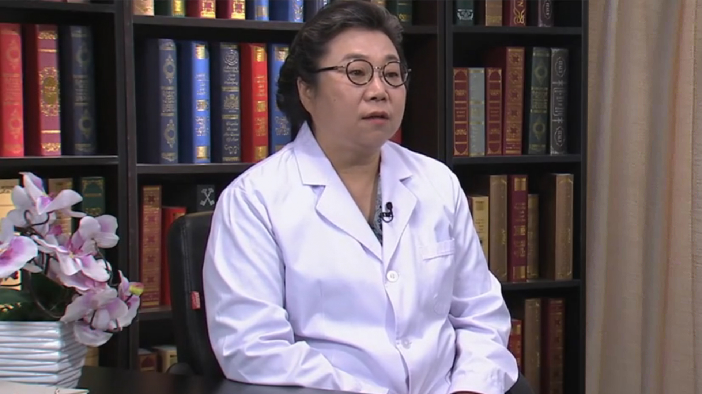

# 产前检查

## 陈倩 主任医师

北京大学第一医院妇产科主任医师  医学博士；

中华医学会围产医学分会常务委员兼副秘书长；中华围产医学会北京分会前任主任委员；中国优生科学协会预防出生缺陷委员会副主任委员；中国优生科学协会常务理事；北京医学会常务理事；妇幼健康研究会生育调控学专业委员会副主任委员；中国妇幼保健协会高危妊娠管理专业委员会副主任委员；中国女医师协会第二届妇产科专业委员会委员；北京大学生物医学伦理委员会委员；中华医学会围产医学分会第八届委员会新生儿复苏学组委员。

**主要成就：** 获得过国家自然基金项目，并参加过国家“十一五”科技攻关课题、北京大学“985”课题等项目，发表文章80余篇；《发育医学杂志》主编，《中华围产医学杂志》《中华妇产科杂志》《中国妇产科临床杂志》等编委，《中华医学杂志英文版》同行评议专家等。

**专业特长：** 从事妇产科临床工作30年，胜任妇产科常见疾病诊治及手术。擅长围产保健、产前诊断及超声诊断工作，胜任各种妊娠合并症及并发症的处治。

## 产前检查主要筛查胎儿的哪些问题？

（采访）产前检查能筛查出哪些疾病？

我觉得你这问题提得非常好。产前筛查过程当中，我们目前来讲主要是针对胎儿疾病的一个筛查，当然从整体的产前检查的过程当中，我们要兼顾母体。

对于胎儿的这个筛查来讲，有几个方面：

一个就是胎儿从一个细胞一直要长成一个个体，所以我们最主要的、也是希望了解的就是胎儿结构的发育是不是正常，所以这些我们主要是通过影像学检查，大家可能比较清楚的比如说在整个妊娠期系列性的一个超声的检查，我们在不同的时期可能要对于胎儿主要的脏器和器官进行一个动态的评估，这是一个产前筛查的主要内容，也是特别直观性的一个结果，因为我们宝宝生出来以后有可能有明显的出生的缺陷或者是发育的异常。

此外产前筛查主要针对的是一些常见染色体的异常，在我们国家目前来讲，产前筛查更多的是针对唐氏综合征的筛查。

唐氏综合征俗称先天愚型，它是这个染色体的核心发生了一些病理性的改变，比如说这个21-三体，就是21号染色体变成了3个单体的情况，这种情况下胎儿存在一个严重智障的问题，包括大家知道的特殊的一些面容，比如说双眼上吊、眼距比较宽、出现颈蹼、通贯掌，这些孩子往往也会出现一些先天性的结构异常，比如说像先天性心脏病，肢体的短小等等这些问题。

为什么要去筛查？是因为很多一些严重的染色体异常的疾病，它可能会伴随更多胎儿结构性的异常，所以在系列的检查过程中容易被发现。

此外来讲，很多严重的染色体异常的孩子，在很多的情况下就是胎死宫内了，唐氏综合征从发病率来讲也比较高，在活产里面大约是在1/800-1000，所以这样相对比较高的发生率，而且超声的检查也有一定的局限性，所以我们国家这二三十年坚持的是建立一个血清学的筛查，血清学是通过母亲体内的一些指标来去推断这个子宫里面的宝宝发生唐氏综合征的风险。

血清学筛查有很多的方法，比如说在中期有一些不同血清学的一个指标的组合，比如说二联法、三联法、四联法。再有现在也可以做一些无创DNA的一些检测，这基本上是在12-26周之间完成的。

这些方法无论是血清学的筛查和胎儿的无创DNA的一个检测，它是一个筛查的方法，而不是一个诊断的方法，它只是估算胎儿发生21-三体综合征（唐氏综合征）这样的一个几率，所以当这些结果出现了一些高危的结果，比如说它是提示高风险，宝宝可能患病的几率比较高的情况下，我们要进一步的进行有创性的产前诊断，包括脐血穿刺、羊水穿刺、绒毛膜穿刺等等。

如果是低危的或者是较低风险的情况下，我们一般会纳入常规保险的范畴，但是会存在着一定的假阴性，在这样的一个人群当中可能会出现一些漏检的情况。

产前筛查来讲，其实除了影像学的筛查是针对所有的人群以外，血清学的筛查或者胎儿的无创DNA就是针对21-三体综合征（唐氏综合征）的这样的一个筛查，一般这两个筛查我们是针对低危人群的，但是如果说他本身就是高危人群，比如说妈妈的分娩年龄在35岁以上，或者说是生育过这样染色体异常的孩子等等的这些高危的情况，她应该直接去做有创性产前诊断的。

## 孕期孕妇体重增加多少合适？

以单胎为例，我们绝大多数是怀孕一个宝宝，就是单胎的妊娠，这时候整个孕期的体重增加，我们会建议是在25斤就是12.5公斤，大家可以算一算怀孕一共有40周的时间，40周的时间如果25斤的话，怎么算都不可能一周长一斤，而且在妊娠的不同的时期，在早期、中期、晚期，其实他的生长速度也不一样。

尤其是在早期的情况下，我们知道早期胚胎，小的胎儿都非常的小，所以妈妈的体重可以没有什么变化，长个一斤两斤是允许的。

到了中期以后，由于胎儿生长的发育，还有母亲血容量的增加，包括她水分的一些潴留或者是脂肪的一些储备，包括她的子宫和乳腺器官进一步的一个体重的增加、容量的增加，这些才会真正地带来体重增加的一个多因素的组合。

所以对于单胎来讲，我们考虑到这么多的因素，其实最终希望她能够增加25斤。所以在整个的孕期的管理过程中，尤其是早期我们应该像孕妇去宣教这样一个体重管理的理念，给她定一个目标，这个目标就是12.5公斤，25斤是一个常规体重，就是我们说的正常体重指数的这样一个人群。

如果说是本身她基础体重就比较重或者是超重的、或者是肥胖的这样一个女性，那她孕期的体重的增长，你觉得是应该是多呀还是应该少呀？

（采访）少。

对，你回答非常对，所以如果是真正一个肥胖的女性妊娠的时候，我们可能有的时候才会让她长10斤、12斤这样的范畴。

但是如果是一个体重过低的营养状态不好的女性，我们为了保证母体生理状态和胎儿的需求，孕期可能会让她多长一点，所以在这样一个过程中，我们要告诉她一个总体的标准，而且各个时期的一个体重的管理理念。

但是目前唯一遗憾的就是我们国家并没有一个针对中国人群的孕期体重增长的具体性建议，我们现在所说的这个12.5公斤或者说是孕期到中晚期每周长大约七八两这样的一个范畴之内，都是参考世界卫生组织的一些相关的一些指数，但是我认为也是可以参考的，因为我们的人种其实差不太多，我们主要是一个管理理念的问题，所以孕期的一个体重管理我认为是非常非常重要的。

（采访）可能大部分的孕妇现在还是只要往上增，吃得好就行。

是的，这是一个特别普遍的现象，因为是单胎，所以她认为怀一个孩子就要吃两个人的饭，如果她怀了双胞胎的话，就会觉得吃三个人的饭，其实这是不一定的。

而且在这样的过程当中，还要注意一些运动，因为我们不可能每天都是论斤论两那么苛刻的去管理我们的食物，这也不太符合我们对于食物的这种需求或者喜好，所以我们只是一个大体的宏观的一个理念，也需要我们能够有一些消耗，如果说你真正吃的比较多的情况下要有一些运动量的增加，每周有2-3次一些中等强度的运动来消耗我们的一个体能，在这样一个过程当中，才能够达到一个合理的增长范围。

这里还有一个误区，有人说我可以运动来消耗过多的能量，但是我们要想明白这一点，首先还是要管住我们的嘴，如果你摄入了过多的能量或者是过多的营养素，这些是要靠母亲体内代谢的，你消耗只是代谢以后的一个后续过程。

因为在妊娠的过程当中，对于母体来讲已经是一个非常非常大的负担，因为人体生长的需求是为我们个体服务的，妊娠其实是对于女性的一个额外的考验，所以她的各个器官系统都是一个超负荷的状态，所以希望能够保护我们的身体，能够顺利地经过一个妊娠和分娩的过程，而不使我们的这个机体或者某一个器官系统因为妊娠所导致一些损害。

因为现在国家也有生育二胎的一个政策，所以很多的家庭也希望能有第二个孩子，而且我们更长远的还是考虑到女性长久的身体健康，所以我觉得还是在吃和活动之间达到一个合理的平衡。

## 尿检怀孕后，需要监测血HCG和孕酮吗？

（采访）孕早期的时候验孕试纸查出怀孕了，为什么还要做血HCG和B超的检查？

我们说尿酶免的检查，其实查的就是人绒毛膜促性腺激素，就是HCG英文的一个缩写，它只是一个定性的检查，其实大家在药店去买的和在医院使用的试纸原理是一样的，它只要是出现了色泽上的一些差异，我们说阳性的话一般两条线都是一个同样加深的现象，如果是一条杠加深，一条杠不加深的情况下，还是处于一个需要复查的状态。

但是我个人认为一般从妊娠的角度来讲，绝大多数还是宫内妊娠的可能性比较大，因为异位妊娠的发生率大约是1/800，所以从一个顺理的角度来讲，其实我们不特别去建议大家去测量HCG和孕酮，这个也是去强调的。

不是说一怀孕了尿妊免阳性，我们就要去监测HCG和孕酮，一般的话只是出现一些问题，比如说她的月经不是特别规律，或者说她有出血的一些现象，或者说她以往有过一些比如说自然流产的历史或者胎停育的历史，这个时候我们早期关注一些HCG的一些变化，可能对于一些鉴别诊断可能有一些帮助，比如说异位妊娠的鉴别或者早期胚胎发育的鉴别，但是我认为她不应该常规的去进行HCG和孕酮的检测。

超声检测来讲，因为超声现在几乎可以是一个无创性的检测范畴，所以在怀孕6-7周的时候做一个B超，我们起码能够知道这个妊娠的部位，绝大多数都是宫内孕，而且我们可以知道胚胎的数目、可以知道胚胎胎芽的大小是不是和平均的月份相符、有没有胎心，这其实是一个妊娠最直接的证据。

## 孕期的不同阶段，针对孕妈妈的检查重点在哪里？

女性妊娠的过程中，她的器官系统都会发生一些变化，她这个负荷能不能承担，需要医生来进一步的观察。

在早期检查的过程当中，其实我们更关注妈妈在怀孕以前有没有什么样的慢性疾病，因为任何的人都会得病，任何人都会得急性疾病或得慢性疾病，所以在早期的情况下我们会建议她要进行一个妊娠合并症的检查，就要通过病史的一个询问，比如说有没有高血压，有没有糖尿病，有没有肾脏的疾病，有没有甲状腺疾病等等，如果是有这样的情况的时候，我们要进行评估，现有的疾病的情况下，她是不是适合妊娠。

再有她适合妊娠的情况下，她这个疾病需要不需要治疗，如果是需要治疗的情况下，她治疗的这些方法对于母亲和孩子是不是安全的，这些都是合并症的一个评估。

妊娠的并发症，一般的都会出现在妊娠的中晚期，比如说妊娠高血压疾病、妊娠期糖尿病等等的这些问题，所以都是要通过系列的一些检查和一些化验来完善的，比如说我们每一次为什么都要去量血压、称体重，为什么要去测尿蛋白，其实我们就会在妊娠中晚期的病人当中，发现是不是有妊娠高血压疾病的这样的一个可能。

还有大家可能会知道在24-28周的时候，我们可能会建议服用一定的葡萄糖来检测我们胰岛功能的应激反应，来判断她是不是有妊娠期的糖尿病，这些其实都是对于母体疾病的这样的一些检查。

## 产前检查中，会做几次超声检查？每次的目的是什么？

对于胎儿主要是包括结构性的检查，一般的话我们孕期可能会做4-5次的超声，一次可能是在妊娠的早期，6-7周的时候，可能做一个确诊性的超声。

第二次超声，大约是在11周到13+6周这段时间，通过它头臀长的大小，去判断他和孕周是不是符合，还可以测定胎儿颈后透明带的厚度，来推测他跟唐氏综合征的一些风险。

再有就是一个筛查的超声，大约是20-24周做一个全身性的体检。

所以我经常说我们人生的体检可能并不是在我们入学或者是在我们工作的时候，当我们才20多周的时候，可能就做了一个相对比较全面的体检。

到后期在30周左右或者是足月以后，我们还会有超声来去动态地观察胎儿生长发育的速度是不是和她停经的周数相符，此外来讲，还可以进一步的排查胎儿有没有结构性的一些异常。

但是作为影像学的检查来讲，超声肯定是一个最主要的方法，在发现一些异常的情况下，我们可能还会为做胎儿超声心动，还可以做胎儿的磁共振的检查，现在来讲都有一些补充性的检查和诊断意义，但是影像学检查无论是超声、磁共振等等也有局限性，它不可能筛出所有的这些畸形。

## 怀孕后为什么要做甲状腺激素检查？

甲状腺激素的检查是我们建议进行检查的一个内容，为什么？

因为我们知道甲状腺的疾病，无论是甲状腺功能的减退或者是我们说的甲状腺功能的亢进，它在青壮年都是高发的，女性的发生率多于男性，生育年龄的女性，正好和她的甲状腺疾病发生的高峰时段也是重合的，所以现在来讲，我们是建议去做甲状腺激素检查。

如果是怀孕前的咨询，我们也会建议她去查一下促甲状腺激素，就是TSH以及这些甲状腺功能，比如说甲状腺素这样的一些相关的测定。

如果怀孕了，我们会建议在八周之内，也进行这样一些检查来去判断她有没有甲亢或者甲减，但是其实甲减的发生率会更高一些。

为什么去做这样的一个检查？因为我们说甲状腺是一个分泌的器官，它会影响到母亲整体的一个代谢水平，也有研究提示得出来的结果，无论是甲亢或者甲减，其实它也会造成一些胎儿的风险，比如说早产或者说是神经智力的一些发育，可能都会有一些影响的因素，所以如果发现了要及时的进行治疗、进行干预，不光是对于母亲疾病治愈的管理的一个好处，此外来讲，对于胎儿或者新生儿或者是子代的后来生长的发育都会起到一个很好促进作用。

## 如何推算预产期？

预产期其实是一个大体数据的推算，如果是自然受孕的来讲，其实我们很难去证明她哪次性生活受孕的，我们经常也跟孕妇说现在算得最清楚就是所谓的生殖辅助技术，这个形成的妊娠有明确的受孕时间，但是自然受孕来讲，它只是一个大致时间的推算，所以国际、国内的算法都一样，我们人类妊娠的时期大约有几种算法。

一个就是40周算法，这是最通用的，但是这个40周的算法，她是从末次月经第一天开始算起的，它的基础主要是女性的月经周期，大约是一个月一次，就是28天到30天，四周一次，这样的一个情况。

如果是月经周期不规律的，就不能这么算了，所以她就是月份减3，日子加7，或者如果是她是1月2月3月的，她就是月份加九，日子加7的这样的一个算法。

这个算法来讲，实际上大家如果仔细算算，可能都会有一些小小的误差，是因为每个月的时间也不一样，它只是一个大致的范畴，实际上大家去想想，如果末次月经的第一天开始算起的情况下，其实她并没有还没有怀孕，即使是28天来一次月经，她实际的孕周如果说是按40周算的时候是280天，实际上按受孕的时间她是38周266天。

但是有一个共同的规则就是大家不能说我按受孕的时间去判断，这个很难推算，所以大家都是从末次月经的第一天开始算起的，如果她的月经周期不准，或者说她忘记了末次月经的时间，出现这样一个情况的时候，我们可能会建议做一个早期的超声，她可以通过头臀长的大小、胎芽的大小去判断实际的孕周情况，那我们在临床当中就可能会出现所谓的核对孕周的这样一个情况。

## 什么是孕酮？孕期体内孕酮低是不是说明宝宝不好？

孕酮这个问题，其实现在孕妇特别关心这件事情，出门诊的时候，经常说大夫你给我查查孕酮吧，孕酮的作用是维持妊娠的，在整个妊娠过程中，前三个月孕酮主要是来源于卵巢排卵以后，在局部形成一个黄体，黄体分泌了孕酮，它对于早期的妊娠、前三个月的妊娠起到了一个非常维护的作用，而且这个孕酮可以刺激胚胎滋养层细胞分泌血HCG，这是一个非常简要的作用。

大家还知道妊娠不是靠着黄体能够维持到底的，还有一个很重要的一个器官胎盘，胎盘也是一个营养传输很重要的器官，它也有分泌的功能，它也可以分泌孕酮，这两个黄体和胎盘分泌孕酮之间的交接大约是在10-11周，黄体到后期萎缩就变成白体了，后期妊娠的维持主要是靠胎盘来维持。

所以其实我们说去查孕酮，很多人去说我的孕酮高或者是低，是不是宝宝就不好，其实这个是需要一个动态的评估，在一天的过程中，经过研究发现孕酮并不是持续释放的，不是按照匀速释放的，它是波动性释放的，就是有点像脉冲式那样的释放，所以可能你抽血的点，正好赶上是这个脉冲式的峰，等再抽的时候就赶上脉冲式的底，所以这个时候不是非常的准确。

其实我个人来讲，比如说有这种先兆流产的症状，或者说早期以前有胎停育的历史，或者说是有其他一些自然流产的历史，我们可以在8周以前去测定HCG，它的预测价值我觉得比孕酮好，当然我不是说所有的人都是要去做这样的HCG、孕酮的检查。

有人说为什么会八周以前，是因为这个HCG的分泌是一怀孕开始它就开始增加，达到高峰的时间是在大约8-10周左右，到了这个高峰以后就开始回落，在孕期维持一个相对比较低的水平，对于每个人来讲，也不知道8周是达到高峰，或者是10周达到高峰，或者11周达到高峰，什么时候它的一个拐点，我们每个人是不知道的，但是一般的来讲在八周以前，它是持续上升的一个阶段，而且它相对有一个规律，就是说HCG就是两天之间，48小时之间的、它有类似的一个翻倍现象，起码它增加的幅度要达到65%以上，宫内孕的可能性就比较大。

当然如果是有超声已经看到这个具体的胚胎，有胎芽、有胎心了，那我觉得这个激素测定的评估价值就会更弱化一些，所以刚才提到了这个孕酮的作用是早期和晚期都是对于妊娠的维持，但是我们不建议常规的进行孕酮的一个检测，但是如果说它是真正需要补充孕酮的人，也是一些黄体功能不足这样的一些人，她有一些明确的既往病史，因为黄体功能不足，她月经周期肯定是非常短的，或者是一些有明确的先兆流产的病人，她可能才会需要去测定孕酮，或者说补充孕酮的这样一个情况。

（采访）检查孕酮的时候是否要空腹？

它跟饮食没有关系，比如说大家在体检当中，经常空腹去检查的比如说有肝功、血糖，它是要求一个恒定的指标来判断，但是它的分泌跟进食是没有关系的，所以不需要空腹。

## 孕早期阴道出血一定是先兆流产吗？

（采访）孕早期阴道出血是怎么回事？

其实阴道属于下生殖道，下生殖道包括一些宫颈、阴道、外阴，因为阴道是一个通路，所以我们看到的就统称为阴道出血，所以这个时候，它可能会来自于下生殖道，就是宫颈、阴道、外阴，也可能会来自于上生殖道，就是所谓的来自于宫腔，所以阴道出血只是一个现象。

怀孕的过程当中，尤其早期怀孕的过程当中，大家知道它会跟先兆流产的可能性比较相关，它由于胚胎自身的问题或者激素水平的问题，它可能会和这个宫壁有分离，所以它可能会有些出血，顺着宫颈，顺着阴道就流出来了，这个是比较常见的一个原因。

但是我需要提醒的，其实大家不要仅仅想到它是先兆流产，其实它可以来自于上生殖道，也可以来自下生殖道，比如说宫颈的一些出血，宫颈出血来自于比如说炎症或者甚至宫颈癌的出血，都是有可能的，它来自于阴道本身的出血，比如说是一些炎症，严重的阴道炎症也会有一些渗出和出血的现象，包括外阴的一些炎症，所以在这样的一个早孕期出血的情况下，我们要进行一个必要的排查，所以很多女性都特别怕做这个妇科检查。

其实比较常规的妇科检查不会增加流产的一些风险，但是我们可以判断所谓的阴道出血到底是来自于哪里，是从宫腔里流出来的，还是宫颈上面的，还是阴道自身的或者是外阴的一些情况，所以要再加以判断，或者是在一些特殊的情况，我们可能做一些辅助的检查，比如说超声的检查来了解一下宫腔的情况，可以做一些宫颈的刮片来了解一下是不是有异常，而且还可以做一些阴道分泌物的检查来排查一些炎症。

## 孕期筛查唐氏综合征的检出率高吗？

唐氏综合征俗称先天愚型，它是这个染色体的核心发生了一些病理性的改变，就是21号染色体变成了3个单体的情况，这种情况下胎儿存在严重的一个智障，包括大家所知道的一些特殊的面容，比如说双眼上吊、眼距比较宽、出现颈蹼、通贯掌，这些孩子往往也会出现一些先天性的结构异常，比如说像先天性心脏病，肢体的短小等等这些问题，为什么要去筛查？是因为很多的一些严重的染色体异常的疾病，可能会伴随更多胎儿结构性的异常，所以在系列的检查过程中容易被发现。

大约就是在15-20周的时候做一些血清学的筛查，就是母血当中的一些指标，比如说血HCG和这个胎甲球和游离的雌三醇等等，还有其他一些指标的不同组合，但是不同的组合，组合项目越多，它的检出率越高，漏检率低，但是实际上你项目越多，其实它的这个费用也会越多，所以一般的话我们现在可能是两个指标或者三个指标的一个联合性的筛查。

但是一个血清学的筛查来讲，它对于唐氏综合征的检出率大约是60-70%，它会有30%的一个漏检。比如说早期的就是NT，胎儿颈横透明带这样的一个测量的厚度，加上早期血清学筛查的影像学加上血清学联合的这样的一个筛查方式，检出率可以高达90%。

如果是做胎儿无创DNA的检测，它对唐氏综合征的检出率可以高达98%-99%。

所以它不同的筛查方法、不同的组合，它的检出率是不一样的，但是总体上来讲再高到98%、99%，它依然是个筛查，而且它给出的结果就是这个胎儿发生21-三体是高风险还是低风险，它不会告诉你这个孩子是唐氏儿或者不是唐氏儿，如果是在高风险的情况下，我们会建议做有创的产前诊断，中期可能就用羊水来做这个胎儿染色体核型的一个分析，来进行一个明确的确诊。

## 羊水穿刺检查的风险大吗？

羊水穿刺其实从操作来讲比较简单，它针的直径比咱们肌肉注射针的直径稍微粗一点，经过腹壁来穿透到宫腔里面，到羊膜腔里面来抽取羊水的这样一个过程。

一般是在超声引导下来穿刺的，所以我们要躲开胎盘，尽量躲开胎儿，而且在20周左右的时候羊水比较多，所以这时候成功率是非常高的。

如果是穿刺比较顺利的情况下，其实它比较安全。但是它毕竟是一个介入性的、有创的产前诊断，所以它总体发生不良的事件大约概率是千分之几，当然可能会有一些比如穿刺点出血，或者感染，或者胎儿的损伤或者是导致流产，所以这个几率虽然比较小，但是它是存在的。

所以我们建议做这种有创性产前诊断的时候，我们希望能够得到这个孕妇的知情同意，并且要进行书面的一个签署意见来进行一个充分的告知。

但是从医生的角度来讲，我们肯定是会非常尽心尽责的、非常轻柔地来做这样的一些检查，但是它毕竟是一个操作，所以它存在着一定的风险，但是从它所获得的效益来讲，任何的检查，包括我们的手术都是有风险的，但是如果评估它的益处大于它的风险的情况下，它就是值得的，只是说我们要通过合理的一个规范化的操作、合理的这种适应症的人群的选择来将不良的事件的发生降到最低。

## 什么是胎儿神经管畸形？该如何筛查？

（采访）什么是胎儿神经管畸形？应该如何检查？

因为神经系统大家知道在哪，中枢神经系统主要是在头颅里面，还有在脊髓里面、在椎管里面，所以神经管畸形主要是指在脊柱的一些畸形，主要是指神经管，包括一些头颅的。

在这样一个检查的过程当中，其实我们主要靠影像学就可以检查出来，比如说有没有无脑儿、有没有开放性的脊柱裂，当然如果说他脊柱裂很细小，那我们可能也看不见，包括一些比如说脑膨出等等的这些情况。

超声的检查都是可以去最大程度的发现，因为在目前来讲我觉得超声的检查对于严重开放性脊柱裂的诊断一般的话可以达到97%，98%这样的一个检出率，无脑儿其实更容易检出，因为我们说胎儿骨骼、骨化的形成大约是在妊娠十周以后，是两个半月以后胎儿的骨骼的骨化就可以形成了，所以他的这个超声就可以做一些骨性的这样指标的测量，如果说这小孩就是无脑儿的情况下，他根本就看不到这个头颅的光环，那就很容易能够检查了。

## 产前检查中的二维、三维和四维超声有什么不同？

超声的检查有几种，大家可能知道二维的超声是我们常规用的，还有就是所谓的这种立体型超声，包括三维的超声、四维的超声，其实四维超声就是一个实时的三维超声，三维超声来讲就是因为它也是通过探头收集了这样的一个体表的信息，来经过计算机这样的一个系统软件的成像来完成的，现在随着技术的研发，它使成像的时间越来越缩短。

我们大家知道，以前我们打国际长途传输都会有滞后，它的这个成像来讲也会有滞后，但是现在大家比如拿手机、拿座机打国际长途，大家没觉得会有声音传输的一些滞后的现象，其实它是一个技术的改进。

这个三维的超声，当然它对于体表来讲它的成像是最好的。

但是我们知道胎儿是团抱式的，因为妈妈的子宫是一个椭圆形的腔，所以我们的孩子都是抱在一起、屈膝在一起的，所以他还有一部分会被遮挡，从我们自己的经验来讲，其实严格的比较细致的二维的超声，也基本上能解决一些问题，当然有一些比较严重的体表畸形，比如唇腭裂或者是严重的开放脊柱裂等等，我们用三维超声可以作为一个辅助性的检查。

但是由于三维超声或者是四维超声都是立体超声，它的这种功率还是比较大的，所以相对辐射程度的量也比较大，所以它并没有纳入到我们常规检查的一个范畴之内，所以只是像北京市的这种产前筛查和产前诊断的这个管理办法里也提到，即使没有特殊的医学指征，我们也不建议去做三维或者是四维的一个超声，也是考虑到对于胎儿的这种安全性。

当然从孕妇的角度来讲，她特别希望获取一个颜面的一个图像，所谓的什么胎儿写真什么的，那些我觉得只是一个服务性的内容，但是我们从医学的角度来讲，希望我们获取的这个平面，能够对我们发现胎儿的一些结构性的异常会更有帮助，随着医学的进展、超声的技术成像的进展，我们可能慢慢的会对心脏这种腔室性的脏器，能够三维的立体成像，其实它的价值比体表的畸形可能会更大一些。

## 妊娠糖尿病对胎儿来说有哪些风险？

妊娠期糖尿病是一个大的概念，它包括有妊娠合并糖尿病和妊娠期糖尿病。

妊娠合并糖尿病就是她怀孕前就是糖尿病。

妊娠期糖尿病，就是说她的胰岛功能随着妊娠的进展，不能够满足体内的代谢水平，出现了胰岛功能不足，所以慢慢的血糖就增高了，所以我们称之为妊娠期的糖尿病。

但是妊娠期无论是妊娠合并糖尿病或者妊娠期糖尿病，由于血糖的增高，母亲也会增加一些风险，比如说高血压的风险、早产的风险。

对于胎儿来讲，如果是妊娠合并糖尿病，早期是一个高血糖的状态，酮体持续阳性，它可能会增加胎儿畸形的风险。

如果妈妈血糖控制得不好，血糖增高，我们知道糖尿病总体是血糖高的，这个血糖是可以按照浓度的差异无原则的通过胎盘到胎儿的体内，所以胎儿的血糖也会增高，它会影响胎儿胰岛功能的一些分泌。

而且糖多，它的营养就是营养能量多，所以孩子也比较大，会增加胎儿体重过大的风险、增加难产的风险、增加手术产的风险等等这些问题。

所以妊娠期糖尿病，其实在现有的标准来讲，它的发生率还是挺高的，大约在孕妇人群可能发生在人群是百分之十几，但是这一部分人群来讲，由于这个诊断标准的一些变化，我们就说似乎好像会有百分之十几的人都会有妊娠期糖尿病，但是它的治疗也是非常有限，真正能够用到药物治疗，比如说胰岛素的治疗是非常非常少，不超过5%，更多的是通过一个比如说合理的生活方式、合理饮食的摄入、合理的运动，都可以将这个血糖控制在一个合理的范围，但是我觉得这样一个标准的改进，其实更好的是把这个健康的管理扩大了，也不需要用药物的处理，其实对于病人来讲，可能没有过多的一些负担。

## 哪些人容易得妊娠期糖尿病？

体重过重的人，她内分泌的代谢就会有一些问题。

再有一个就是她的这个家族当中可能有糖尿病的历史，比如说妈妈、爸爸糖尿病，或者是怎么样，她就是一个潜在糖尿病的易感人群。

还有就是可能女性经历过许多次的妊娠，我们经常会看到，如果第一胎她有妊娠期糖尿病，第二胎发生妊娠期糖尿病的几率也会增加，因为妊娠期糖尿病是和妊娠相关的，绝大多数来讲，随着妊娠的结束、分娩的结束它就好了，但是她的胰岛功能、代偿能力的减退是持续存在的，所以她再次妊娠的情况下，依然会出现这样的一些问题。

所以比如说她的基础体重比较重的，或者说有家族糖尿病的，或者说她以前有过妊娠期糖尿病的这样的一个人群，都是妊娠期糖尿病的一个高发的人群。

## 为什么妊娠期还要测量血压？如何正确测量？

（采访）为什么妊娠期还要测血压？

血压其实是一个生理的指标，每个人都有血压，没有血压的话，我们的血液就不会有流动，就是它要有一个心脏泵的功能，所以它对于血管床有一个压力，就是我们说的血压。

为什么要去测血压？在妊娠期间，尤其在20周以后容易出现子痫前期或者是单纯的妊娠高血压，它都是表现在血压的一个增高，而血压的测量也非常的容易，它也是一个无创性的，所以在这样的过程中，及时发现血压的一些变化，来进行一个合理的管理，它可以减少这些疾病所带来的一些不良的预后。

但是血压的测量，我们觉得还是有一些要求的，因为大家知道我们国家人口比较多，其实生育的年龄的人比较多，各个助产机构产前这个检查的门诊都是人满为患，大家心情都比较焦急，来了以后就去测血压，其实我们希望起码能够静坐5-10分钟，让自己的心情平复一下，因为我们知道人在紧张的情绪下，或者活动以后血压还是有一些变化，一般可能会有一些增高。

所以这个时候静坐5-10分钟以后去测量，一般的话我们都是测右上肢，这个袖带绑缚的位置要和心脏一个水平去测定，如果说在妊娠期间可能会出现一些血压的偏高，但是它是不是就是病理性的，一般我们要看它4-6小时以后是不是血压还高，如果是4到6小时以后血压还高，它是一个病理性的，那没准休息以后她就是正常了，那她就是一过性的。

但是我们在整个的妊娠期间，对于血压的监测，我觉得是非常非常重要。

（采访）孕妇正常的血压值和正常人一样吗？

对，是一样的，就是我们异常的血压值或者正常血压值都是按照这个高血压学会所这个去定义的，就是收缩压≥140mmHg，舒张压≥90mmHg这样的一个情况，来作为一个正常血压和异常血压的界定。

## 有高血压的孕妇在什么情况下需要用药治疗？

你这个问题其实提的挺好的，作为慢性高血压的病人，如果怀孕前就有高血压，什么时候用药？

一般的话是收缩压大于150mmHg，收缩压大于105mmHg以上，持续的情况下我们可以考虑用药。

如果说是单纯的妊娠期高血压的情况下，按照“指南”来讲，就是说收缩压大于160mmHg，舒张压大于110mmHg，才会建议使用降压药。

但是这个不是一个严格的限制，因为有的时候一个正常年轻的女性，她可能血压平时就很正常，就比如说90/60mmHg或者110/70mmHg，120/80mmHg等等这些情况，当升到160/110mmHg的时候，她可能会有一些不舒服的症状，比如说头疼、头晕、恶心这些症状，这个时候医生适当的根据病人的情况，用一些降压药也是可以的。

但是这个降压幅度和降压的目标是要有要求的，因为我们说它一定要保证一个有效的灌注，所以我们说高血压的病人就是在妊娠期间，我们希望血压下降的这样的一个目标值是正常的一个高线，也就是说130/80mmHg，140/90mmHg就好了，不能给她一直降到90/60mmHg、100/60mmHg，那她灌注就会下降，所以这个医生会根据情况来加以指导，而且每个人一天当中24小时血压的这个情况的波动也是不一样的，有人白天高，有人夜里高，所以他的用药的次数和每次用药的剂量，也是需要严格根据每个病人的具体的情况来制定。

## 孕妈妈如何数胎动？

（采访）如何数胎动，多少次才算正常？

这个胎动，其实宝宝如果是做超声的情况下，你看他两个多月，他就动，他就有一些小的胎儿的这种蠕动的现象，大家所理解的胎动是他自己感觉到的胎动，就是我们说宝宝是在羊水池里面，子宫壁就相当于游泳池池壁，什么时候妈妈才会感觉到胎动，其实宝宝一直都在动，只是说宝宝他的肢体或者是躯体碰到了子宫壁，而且有一定力度的时候，妈妈才会感觉到。

所以一般可能会在五个月左右才会感觉到，所以经常第一次妈妈感觉到胎动都特别的兴奋，实际上好像是宝宝主动的跟妈妈在打招呼，其实宝宝早就动了，只是妈妈没有感觉出来。

这种一般的话，她每天都会感觉到宝宝这种触碰到子宫壁的胎动，其实宝宝有可能在这个水池中央游泳，妈妈也感觉不到，而且随着胎儿的进一步的增大，大约是在八个月左右的时候，胎儿神经系统的发育就日趋成熟了，所以胎动也会相对有一些规律性，所以这个时候我们可能才会建议去数胎动。

数胎动其实有很多的方法，但是我总是跟孕妇是这么说，其实数胎动是要评价你宝宝胎动的规律，而不是强行的说你每一次、每分钟、每小时要动多少次是吧，也有人说比如说每小时3-5次以上就是正常的，但是有可能自己的宝宝每个小时这个活动大约可能是20次，他减少了，我们说他这个增减幅度最好不要超过50%，如果增减幅度超过50%的情况下，他可能会提示一些不确定的因素，但是我们知道如果说这个宝宝每个小时动20次，他减少50%是十次，就是说3-5次以上是正常的，这个对于这个宝宝来讲，可能就不正常。

所以我经常会说你每天找相对固定的时间、固定的时长，比如说吃完饭以后，大家可能相对都会休息一段时间，你饭后就开始计数胎动，早中晚同一个时间，同一个时长来去观察这样的一个总数，每天差不多就可以了，只要增减幅度超过50%就可以了。

那就是说数起来也挺费劲的，三小时或者是几个小时，那有很多简便的方法现在科技也发展了，很多APP就可以，你动一下按一下就行，你不用1、2、3、4、5，还有进行累加。

还有简单的方法拿两个小碗或者是两个小碟子，一个里头搁上豆子，家里头都有什么黄豆、绿豆、红豆，动一次往那个碗里头搁一个，最后你数，这样其实是很简单的方法。

其实最主要的还是要去寻找你宝宝的规律，因为胎动它是一个很敏感的指标，其实我们说数胎动的过程，是评价胎儿在宫内的一个安全状态的指标，其实还有一个层面是培养这个母亲的一个责任感，孕妇很多人都觉得宝宝出来才是妈妈，其实你一旦怀孕了，你就是母亲，所以你对于胎儿的这样一个监测，不能仅靠在医院的医生的这个检查，更多的还是要自我监测的一个方法，所以自主胎动是非常非常重要，也是非常可行的，对胎儿评估的这样一个方法。

（采访）没问您之前，我还觉得我不了解，我还觉得这个好像只是根据父母个人的兴趣可数可不数，原来是很重要。

是非常重要，尤其在妊娠的晚期还是比较重要，我们都会建议她每天去数胎动。

## 孕晚期，分娩评估要考虑哪四个因素？

妊娠晚期一般我们说28周以后一直到分娩这段时间，在这个时候如果没有什么合并症的情况下，它就容易出现并发症，比如说高血压的问题、糖尿病问题，这个是对于母亲的。

对于孩子来讲，这个时候因为临近分娩了，所以我们可能除了动态的去观察他生长发育的大小、他的结构有没有异常以外，其实我们要对于分娩的评估就会加强。

我们知道分娩大约有四大因素，产力、产道、胎儿和心理因素。

产力在真正分娩以前，我们是没有办法评估的，我们没有预见性说这个人宫缩好还是不好，只能临产以后才能判断。

产道是可以评估的，但是绝大多数人的产道都是正常的。

第三个就是胎儿的情况，主要是对于胎儿体重的一个管理，因为他毕竟要经过产道，而且并产道不是一个直筒，它还是有一定的曲度，还有一定狭窄的一些区域，所以我们就说胎儿和骨盆之间是要有一个复合性，经常我们会说头盆是不是相称的，骨盆是没有办法改变的，所以那你的这个孩子的体重就是很重要的了，通过母亲的体重管理，其实间接的也是能够很好的管理胎儿的体重。

再有就是心理因素，我们知道心理因素很重要，尤其是初产妇她比较焦虑，所以这个心理因素通过我们医生的保健解释，包括一些孕妇学校课、小班的一些教学或者一些模拟，包括一些呼吸法等等这些都可以去减少她们的紧张的情绪，有条件的情况下家人或者导乐的陪产这些都可以。

所以主要是对于这些因素的评估，比如说骨盆的一些检查、胎儿大小的一些检查、胎盘位置的一些测定、羊水量的一些测定，来判断她什么时候该生？她怎么生？可能是这个妊娠晚期的一个很重要的问题，尤其是在近足月的时候要进行一个常规的评判过程。

## 什么样的胎位适合顺产？

我们知道所谓的胎位正就是95%左右的头位，还有就是这个胎儿的长轴和母体长轴有一些关系，纵产式就是胎儿的长轴和母亲的长轴是一致的，95%是头，3%-5%是臀。

还有就是他这个长轴垂直是横位，就是胎儿横在妈妈的子宫里面，这个肯定是不能生的。

还有就是斜位，就是他形成一定的角度，但是斜位来讲一般是一个不确定的胎位，所以他可能会变成横或者是变成纵。

胎位不正的情况下，当然我们说横位那肯定是不能生，斜位，胎儿的身体部位没有进入骨盆，她也生不了。

在纵产式的过程中，可能就会存在着臀位和头位的这样的一个问题，头位，只要没有头盆不称的情况下都是可以生的。

臀位来讲一般的话在3500克以下是可以生的，但是一般他存在着就是后出头的这样一个风险，因为我们知道宝宝头的径线是最大的，头出来以后，躯体没有其他的一些问题的话都是能出来。

但是臀部虽然说好像显得挺大，但是它主要是一些肌肉、脂肪组织形成的，所以它的变形性比较大，所以它虽然把宫口扩张一定程度，但是它真正能够达到这个骨质的扩张的程度、头扩张的程度可能还会有一些区别，所以它可能会存在一定风险，后出头的一些困难。

所以一般的话，（胎儿）体重比较重的或者是初产妇，一般臀位可能还是建议剖宫产，终止妊娠可能会更安全，但是也有情况就是在评价比如说胎儿的这个大小比较适中、羊水比较适中的情况下，也可以再尝试，如果是臀位的话，在37周左右可以再进行所谓的外倒转术，将这个胎儿的头从上转到下面来变成头位。

但是这个是有风险的，比如说有些脐带缠绕的问题，胎盘早剥的问题，诱发胎膜破裂的问题，所以这个我们要跟孕妇进行很好的沟通，因为现在大家有很多生育的机会了，所以如果是第一胎剖腹产的情况下，如果第二胎可能这个分娩方式就会有很多的局限性，所以我们会希望第一胎能够顺利地生下来，对于她下次妊娠也是会好的，所以这个是因人而异，医生会具体的去进行处理。

## 为什么孕晚期判断羊水量很重要？

羊水其实它是保证子宫张力的一个很重要的物质，因为它必须得把这个子宫撑起来，所以宝宝才能够在这个自由的空间里面，自由的生长。

一般到妊娠晚期，近足月的时候羊水大约是800-1000ml，但是我们没有办法去精准的测量这个数，但是可以通过超声对于羊水池的测定来进行估算。

这里面有两种方法，一个是所谓的羊水指数，就是把这个羊膜腔以这个肚脐为中心分成四个象限，每个象限里最大的羊水池的深度加起来，四个象限夹起来≥8以上，就是正常的，如果小于8-5之间，可能就羊水偏少一些，小于5之间就是羊水少。

还有一种就是我们说在整个的羊膜腔里面，我们找到最大的叶池，只要这个叶池的径线大于2cm以上就是正常的，如果大于7cm以上就是羊水多，如果是小于2cm以上就是羊水少，它只是一个相对的测定。

为什么说到晚期我们观察羊水量少，因为我们说羊水到妊娠中晚期以后，它70%是来自于胎儿的尿液，他是不断地喝、不断的排，不断地喝、不断地排，其实胎儿的尿液跟这个体液的循环是有关系的。

所以在胎盘功能不好的情况下，可能血液会有重新分布，他的肾的血流量就会减少。因为在胎儿缺氧，无论是急性和慢性缺氧的情况下，它是要把血液供给胎儿的脑、心脏和肾上腺，肾脏是一个缺血样的器官，它比较敏感，所以肾脏的血液减少，尿量就会减少，所以羊水就会少。

所以这个是我们在晚期要去警惕的问题，羊水少来讲还要去除外的一个因素是不是胎膜有破裂，如果胎膜破了，它流出来了，自然是少的，所以我们说胎盘功能这样的异常，可能是在胎膜没有破裂的情况下的一个情况。

羊水多也是有风险，羊水多的情况下，它在比如说破水或者是临产的情况下，一旦破水，水比较多，在这种流出的过程中，宫口开的情况下，它可能会造成比如说脐带的脱垂，尤其是因为羊水过多的情况下，可能胎儿的入盆就会有困难，所以他就飘在里面，就会有一些风险。

所以在妊娠晚期的时候对于羊水的判定来讲是很重要的，它也是一个很重要的指标之一，但不能作为一个唯一的指标。
