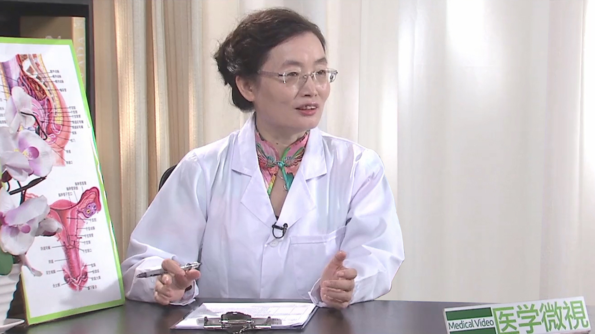

多囊卵巢综合征
==============

阮祥燕 主任医师
---------------

   1678358386728

首都医科大学附属北京妇产医院内分泌科主任 主任医师 ；

首都医科大学妇产科学系副主任 博士生导师；

中华医学会妇产科分会绝经学组委员
妇科内分泌学组委员；国际妇科内分泌学会中国妇科内分泌学分会主席
；国际妇科内分泌学会执行委员会委员
；德-中妇产科学会（中方）副主席；《Gynecological
Endocrinology》副主编及中文版主编。

**主要成就：**
主持国家自然科学基金等科研项目40余项，发表论文论著200余篇，SCI
50余篇，累积影响因子近100分；致力于激素与乳腺癌的基础与临床研究，PCOS、POI的临床研究、卵巢组织冻存与移植的研究等；系列研究获得两次全国妇幼健康科学技术奖，中国女医师协会五洲女子科技奖临床医学科研创新奖等，并多次在国际大会上荣获最佳壁报奖、科学创新奖等。

**专业特长：**
擅长于多囊卵巢综合征、早发性卵巢功能不全、更年期综合征以及异常子宫出血等疾病的诊断与治疗。在女性生育力保护方面开展了卵巢组织冻存移植等技术。

多囊卵巢综合征是怎么回事？
--------------------------

谈到这个多囊卵巢综合征，也是目前我们门诊就诊最多的疾病之一。多囊卵巢综合征它实际上就是内分泌代谢紊乱的一个症候群。具体的表现就是，女性表现的多毛、肥胖和不孕，当然还有很多人表现在月经的稀发或者是闭经，这是主要临床表现。

这个病一般发生在育龄期，我们一般是把15岁到49岁都叫育龄期。这个疾病的发生率占10%-15%，这个国际上、国内都基本上是这个样子，但是真正的我们全国的流行病学的数据还不够。所以说关于这个多囊卵巢综合征，它具体的确切的发生率有多少，目前没有数据，就是说目前估计有10%-15%的女性患多囊卵巢综合征。

确诊多囊卵巢综合征有哪些必须条件？
----------------------------------

多囊卵巢综合征它是一系列症候群，具体要诊断这个多囊卵巢综合征，它是有一些表现，一些诊断标准。

第一个就是月经的稀发或者是无排卵，什么叫稀发？如果说月经的周期超过了35天以上，这叫月经的稀发；不排卵，连续两三个月都不来月经，那很可能就是不排卵，这个是中国诊断多囊卵巢综合征的必须条件。

另外还有两个就是患者还会出现雄激素高的一些表现，叫高雄激素血症，这个高雄激素血症有什么表现呢？很多会脸上反复出现痤疮。还有就是毛发比较重，在不该出现比较粗的汗毛的地方出现汗毛。

比如说女孩子的嘴唇、下颌，出现比较长、黑的体毛。还有的就是脐耻之间，脐耻之间女孩子不应该有体毛的，这类患者脐耻之间会出现长黑的体毛。还有乳房的周围会出现，哪怕是一根、几根这种长黑体毛，都是雄激素高的表现。

还有的出现脖子是黑的，我们叫黑棘皮征，就是因为色素的沉着，所有的皮褶的地方都比较黑，这就是雄激素高的一些特征。那还有就是有些人抽血检查里面，她查的总睾酮或者是游离睾酮，明显高于当地的实验室的标准，那这也是雄激素高。

另外还有一个条件，就是我们要做B超，B超上要看到卵巢有多囊样的改变，什么叫多囊样的改变？就是在B超扫描的时候，最大切面上如果有2-9毫米的小卵泡的数量，如果超过了12个，这就叫卵巢的多囊改变，不管是单侧还是双侧。

有的她总数可能没有这么多，但是如果这个卵巢的体积很大，如果说至少有一侧卵巢的体积超过了10毫升，这个时候我们也认为卵巢是多囊改变。

这三个条件里面，刚才说月经的稀发或者是不排卵，这有一个条件必须具备，同时要具备了卵巢的多囊改变或者是雄激素高的这些表现中的两条中至少具备了一条，就可以诊断为多囊卵巢综合征。

但是多囊卵巢综合征，它也是一个排除性的诊断，你就是符合了这两条，或者是这三条都符合了，同时你必须也排除其他的内分泌疾病引起的异常。比如说你要排除来源于甲状腺的疾病的问题，你要排除来源于肾上腺的相关的疾病，你还要排除来源于卵巢本身的一些性激素的肿瘤。

在排除了这些相关疾病之后，具备了刚才说的那三条中的至少两条，我们就可以诊断为多囊卵巢综合征，所以对于多囊卵巢综合征的诊断，目前我们很多地方不规范，要么就是过度的诊断，要么人家确实是多囊卵巢综合征的病，看来看去就给她下不了诊断，诊断不清。

我也希望通过今天我说的这个，能够给我们的患者提供准确信息，您自己可以来判断一下，是否可能是多囊卵巢综合征。自己诊断之后，不要自己给自己开药，还是到医院，怀疑患病了以后，到医院进行检查，确定诊断。

多囊卵巢综合征患者的卵巢有哪些改变？
------------------------------------

一般来说正常的卵巢一个月只有一个卵泡发育成熟，它可以从很小，逐渐一步一步的发育成熟，到排出，排出之后形成一个黄体。

多囊卵巢的问题就是它有一包的小卵泡，但是它每一个都长得这么大，就是2-9毫米，长这么大都停止在这里了，它不再长大，所以B超一看都是这种小卵泡，没有一个大的，这种情况下我们叫卵巢的多囊改变。

有很多小囊泡，实际这小囊泡都是小的卵泡，这些小的卵泡有很多可能是空的，没有什么功能，所以多囊卵巢卵泡的质量不好，导致它的胚胎质量也不好，她卵泡长不成熟。所以这些女性她容易不排卵，不仅影响到月经，它也影响到怀孕，没有卵就不能怀孕，就相当于没有鸡蛋，怎么可能抱出来小鸡。

首先就是卵巢的多囊改变，跟多囊卵巢综合征不是一回事，它是多囊卵巢综合征诊断的一个条件之一。这个部位切开之后，切面上可能看到很多的这种小的泡泡，B超下看都是一些小的低回声，圆形的、椭圆形的，小的低回声，这个就是卵巢的多囊改变。至少有一侧横切面，最大切面上有12个以上的这种小的卵泡，我们才可以诊断她为卵巢的多囊改变。

多囊卵巢综合征都有哪些症状？
----------------------------

如果说我们的患者能够对多囊卵巢综合征相关的症状有一个意识，能够意识到这个疾病，她本人就能够提早去发现，提早去就医，对将来这个疾病的治疗以及预后，应该是有非常大的帮助。

那首先我们的广大女性怎么样来判断自己是不是有可能是多囊卵巢综合征呢？

首先月经不正常，怎么个不正常法？正常的月经周期21-35天，如果说你这个月经经常错后，错到30-40天来一次，就是说你35天以后才来一次月经。

甚至有一些人，她两三个月不来一次月经，还有的病人一年都不来一次月经，这种情况她也不管，她直到想要孩子的时候，才走到医院看不孕症。所以一旦出现月经的稀发或者是闭经，一定要去看医生。

当然也有少数表现不是稀发的，她可能会出现的是月经的频发，就是一个月来两次或者是沥沥拉拉总是不干净，这也是不排卵的表现。因为不排卵也可以引起月经不规律，所以也要去看医生。因为出血有很多原因，也可能有恶性的肿瘤，也可能有血液系统的问题，所以都应该是去查的。这是一个判断。

第二个的判断，有的女性她可能月经表现得也比较规律，她认为她自己就很正常，比如说别人28天到30天来一次，她可能是40天来一次，50天来一次。但这种情况下，你可以判断有没有排卵，可以测基础体温。

就是说你清晨一醒，体温计可以放口腔，也可以放腋下，但是要统一标准，放腋下全部放腋下，放口腔的测温比较准确，也可以一直都是放口腔的。从上一个月经的周期到下一个月经周期来测，这叫一个周期。如果体温都是一个直线，说明确实没排卵。

那还有一个判断，就是说有些小姑娘们特别爱美，可是就偏偏脸上老是起疙瘩，反反复复的起痤疮，这种情况下很可能也是雄激素高的一个表现，也是多囊卵巢综合征的症状之一，要警惕。

还有一些孩子她表现头发油性特大，因为这个油性大，可能一天不洗澡，这头发没法见人，这也是雄激素高，皮脂分泌旺盛导致的。

还有些孩子脱发，她脱发掉得很厉害，甚至有一些学生头发脱发脱得不敢去上学，会影响到她的自信，我们门诊有这样的病人，是因为雄激素高，毛囊皮脂腺分泌得多，容易导致毛囊炎，引起脱发。遇到这种情况下，也要去怀疑有没有可能多囊卵巢综合征。

还有就是脖子黑，因为雄激素高、胰岛素高，这是多囊卵巢综合征最主要的生物化学的改变，它这种水平高导致的恶性循环会表现在皮肤上。看见这个孩子脖子都是黑的，我第一反应就是这个孩子可能是多囊卵巢综合征。

色素的沉着，一看这个脖子的颜色，有的是从后面看，她皮肤变得有一些粗糙，有的像天鹅绒那种感觉。有些家长就说，这孩子怎么老是脖子洗不干净，她不是洗不干净，她是色素沉着。这个高度怀疑有可能是多囊卵巢综合征。

还有个判断就是毛发的分布方面，我们知道小女孩不应该有胡须的，如果出现这种小胡须，在上嘴唇或者是下颌出现几根比较长黑的体毛，有些孩子她觉得不好看，她还拿剃刀去剃剃。

还有就是乳房周围，乳房周围不应该有那种长黑体毛，如果出现哪怕有一根，那也是雄激素高的表现。还有脐耻之间，脐耻之间有些人有几十根那种长黑体毛，就像男性体毛的形态分布，这也是属于雄激素高的表现。

还有些孩子她外阴阴毛特别浓密，是一个菱形分布，男性的阴毛是菱形分布的，女性应该是个倒三角形的。如果说大腿的内侧，也出现很多的那种很粗的长毛，也是雄激素高的表现。

还有一些孩子她可能觉得毛也不太重，但是她的毛囊特别粗，你看脸上她毛孔也很粗，那这种也可能是雄激素高的一个表现。所以遇到这些情况，不管从美观角度，还是从治病角度，都应该来看一下妇科内分泌医生，排除或者是确定一下，多囊卵巢综合征的这个诊断。

哪些原因会引起多囊卵巢综合征？
------------------------------

非常多的患者来就诊之后，当我们诊断是多囊卵巢综合征的时候，所有的人都问，是什么原因导致的这个病，那这个问题到目前为止，我还不能回答，什么原因呢？目前病因不清楚。

它是有遗传的倾向，比如妈妈也是比较胖，以前月经不正常，生孩子不容易，那这个孩子她患多囊卵巢综合征的风险就很高，它有一定的遗传倾向。现在调查发现，如果说有姐姐妹妹得多囊卵巢综合征的，那你本身患多囊卵巢综合征的风险也是很高的，这是遗传的因素。

再一个是环境的因素，比如说你饮食特别不规律，特别爱吃一些甜的，身材比较胖，这种也会加重多囊卵巢综合征的疾病的问题。

还有一些基因的问题，现在也都是在研究之中，最早发现这个疾病的时候，有两位国外科学家发现怎么女性长了满脸的胡子，像男的，当时就发现几个症状，叫闭经、多毛、肥胖、不孕这几个症状，当时有两位科学家发现的，以他的名字命名就叫Stein-Leventhal综合征，我们老教科书里就叫Stein-Leventhal综合征。

到了2003年，在国际上鹿特丹生殖医学专家们开了一个国际共识的会议，才对这个多囊卵巢综合征有了一个国际的共识指南和诊断标准出来。

所以刚才我说的诊断标准是我们中国卫生部的行业标准，2011年中国有了我们自己的多囊卵巢综合征的诊断标准，当然这个条件和2003年这个国际的鹿特丹的标准，大条件是一样的，只是说必须条件做了一个限定。

必须条件就是这个稀发排卵或者不排卵作为了多囊卵巢综合征的一个必须条件，因为80%多的人会出现这种稀发排卵或者是不排卵，我们也进行了一个患者流行病学的调查和门诊患者的调查。发现高雄激素血症的患者的发生率，我的门诊调查数据是87.5%，有流行病学调查的数据是85%。

所以总的来说这个病的根源还是一个雄激素高为主的引起的，雄激素高，再一个是胰岛素抵抗，这个引起来一系列的问题。

哪些人容易得多囊卵巢综合征？
----------------------------

什么样的人容易患多囊卵巢综合征，目前这个问题还真是不好回答，因为我们只能说，你看见什么样的体态，怀疑她可能是多囊卵巢综合征，只要我们看见那些比较肥胖，脸上很多痤疮或者是毛多、头发很油这样的人，我们一判断就怀疑她可能是多囊卵巢综合征。

所以像妇科内分泌医生就有一个职业病，走到外面一看见这种情况，说这个人可能是多囊卵巢综合征。因为这个病可以导致你容易发胖，因为雄激素高。这种胖还是向心性的胖，像男性的胖都是腰首先变粗。这种多囊卵巢综合征的肥胖，脂肪容易向腹部堆积，内脏脂肪增多，像男性那样的肥胖趋势发展。

肥胖的女性更容易得多囊卵巢综合征吗？
------------------------------------

因为肥胖有非常多的原因，是不是肥胖的女性容易患这个病，目前没有这个数据，瘦的也可以得多囊卵巢综合征，所以不是说我很瘦，我就不是多囊卵巢综合征。

如果你的诊断符合稀发排卵或者是不排卵，就是月经不正常，同时你的脸上疙瘩比较多，反复出现痤疮。有些小胡须，或者B超一看卵巢有多囊改变，只要这三个条件中有两个条件符合，至少有两个符合，排除了其他的内分泌的问题，都可以诊断多囊卵巢综合征。

多囊卵巢综合征的诊断，是以这三个条件中的两条为主，这里面都没有说你的体重是胖，还是瘦，所以肥胖不肥胖不是多囊卵巢综合征是否易患人群的判断标准，只能说多囊卵巢综合征让这个患者容易发胖。

多囊卵巢综合征是一种肿瘤吗？
----------------------------

多囊卵巢综合征它是一个病，它本身不是肿瘤，很多人容易混淆的，一说她是多囊卵巢，她会说那我是不是卵巢囊肿，就是卵巢肿瘤吗？这个是大家非常容易混淆的。

卵巢的多囊改变就是说她卵巢上在同一个时期，有很多同一个起跑线上的小卵泡，一大批长起来，但是谁都长不好，谁都成熟不了，所以她这个引起不孕，但她本身不是肿瘤，它就是卵泡，比较多的卵泡长起来。

正常的人一批当中只有一个长起来，这一个它能保证集中优势兵力，它能长起来，它能够排出，它能够出现一个很优质的卵，能够出现一个优质的胚胎。多囊就是它太多一起长，所以也都长不起来，不是肿瘤，所以要区分这个概念。

多囊卵巢它也不等于多囊卵巢综合征，这是两个概念，很多的医生也好，病人也好，很容易混淆这两个概念。如果B超下一看，有的B超大夫可能说，您卵巢多囊。

多囊就给人一个印象，说我是多囊卵巢综合征。单凭这一个标准，这个人她什么表现都没有，只是说她卵巢一个面上有超过12个小卵泡，你看的时候，你不能诊断她为多囊卵巢综合征。所以卵巢的多囊改变，不等于多囊卵巢综合征。

如果你的诊断符合，稀发排卵或者是不排卵，就是月经不正常；同时你的脸上疙瘩比较多，反复出现痤疮，有些小胡须；或者B超一看卵巢有多囊改变，只有她具备了三个标准中的至少两条，才可以诊断多囊卵巢综合征。

也有一些病人，她卵巢看起来多囊改变，但是人家还是排卵规律的，她可以排卵，她可以生孩子，不受影响，所以疾病的诊断是有条件的。

多囊卵巢综合征会导致癌变吗？
----------------------------

很多人一说多囊卵巢综合征就特别恐惧，多囊卵巢综合征它首先不是癌症，不是恶性肿瘤，不是不治之症。所以大家听到我这三个不是之后，可能突然就放心了很多。它本身也不会因为这个多囊癌变成一个卵巢癌，目前还没有这样的数据。

但是多囊卵巢综合征的患者，确实是子宫内膜癌的风险明显的高，这个高的原因是因为它长期的容易反复的出现不排卵。虽然不排卵，她又有这么多的小的卵泡存在，它还是能够分泌一定的剂量的雌激素的，这雌激素一直对子宫内膜进行刺激，所以这个内膜就过度的生长，长得很厚。

什么叫癌症，如果这个细胞无限制的生长就是癌症，所以如果一直让它长，长的时间长了就内膜癌了。这个孕激素起什么样的作用？我们用孕激素就是抑制子宫内膜的生长，排卵之后，因为体内会自然分泌孕激素，来抑制子宫内膜的生长，那抑制它就脱落，所以它不会长得很厚，这样内膜癌的风险就避免了。

所以这个多囊卵巢综合征，如果说不管它的话，它不会导致卵巢癌，它可以导致子宫内膜癌。所以一定要治疗。因为很多家长说，那你既然说它也不是癌症，它也不是不治之症，那我就不管它了，我现在孩子还小，我现在也不想要孩子，等到想要孩子的时候再说吧。不行，一定要处理，一定要进行治疗，就是还要减少它对子宫内膜的影响。

多囊卵巢综合征会对女性造成哪些危害？
------------------------------------

每天我们妇科内分泌的门诊量有400-500人，这些病人里面50%以上的是来自全国各地的多囊卵巢综合征患者，为什么？因为大家比较集中，因为对这个病确实非常恐惧，希望能够得到一个正确的诊断和规范的处理。

当然这都还是意识觉悟比较高的，认知度比较好的人，她才走到这里进行规范的治疗。还有很多人来了之后，我们发现她来到这里是干什么？是看不孕症的，是因为她不孕了她才看来。

你回过头问她，你月经怎么样，她说我两年都没来月经了，我们一看B超，子宫内膜就很厚，两个公分，那个增生一看就非常危险。我们就说那你不看不孕，你就不来看病吗？她们没有这个意识。

多囊卵巢综合征就是在不想要孩子的时候也应重视。第一，比如说近期会有什么危害，它引起不排卵或者稀发排卵，月经就不规律，月经不规律有的表现是稀发或者是闭经，她长期闭经，也许内膜很薄，也许内膜很厚，会导致内膜癌。

再一个，有的孩子她长期内膜很厚，她要么不出血，要么就大出血，甚至导致休克，那现在我们的技术还是比较发达。在以前，因为这个大出血，止不了血，为了救命切子宫的也很常见。一个小孩还没有结婚，还没有孩子，子宫切了，挽救了她的这个生命，但是她的生命可能只挽救了一半。

所以近期的困扰，包括月经的问题，出血的问题，出血性休克的问题，会危及到生命的，子宫内膜癌的问题，这个是要进行处理的。

还有就是这孩子满脸的痤疮，反复的痤疮，从美观上来讲，从她不舒服的程度来讲，发炎、感染，有的出现脓包，她也痒，也影响美观，影响皮肤，这也是应该治疗的。因为雄激素高会有这些副作用。

还有的孩子她脱发，脱发严重影响她的心理，一个小女孩漂漂亮亮的，头发没了或者是谢顶，这个时候也是应该进行规范的治疗的。如果你不管她，她就会出现代谢越来越紊乱。

除了月经不正常，还出现代谢的紊乱，血脂高、血糖高。我们医院很多次报危急值，血糖到十几个mmol/L，报的都是我的多囊卵巢综合征的病人，这么年轻的患者，所以她们意识不到。

实际上这个多囊卵巢综合征，它可以引起胰岛素抵抗，她血糖会很高，引起糖尿病，再一个，她血脂高，不好的脂蛋白都高，好的脂蛋白低，这样将来她冠心病的风险也是很高的。

所以她冠心病、糖尿病的风险、子宫内膜的风险，这些都是应该进行规范的治疗，才可以预防的。那再往后想要孩子的时候，那就是影响到生育了，不排卵怎么怀孕，所以要进行规范的处理以后，再进行促排卵治疗。

也不是说多囊卵巢综合征的人，她一定怀不了孕，她也可以怀，因为她偶尔也会排卵，这个卵的质量一般不会太好，她的体内环境不好，因为她雄激素高，胰岛素高的这个不好的环境，很多人是很肥胖的。

高血脂的环境、血糖高的环境不纠正的话，这时候怀孕，一个是不容易怀，一个是怀上容易流产，即使不流产，勉强怀起来，生下来，早产儿的发生率、孕期糖尿病的发生率、妊高症的发生率也是明显的增高的。

所以说这个多囊卵巢综合征对女性她的近期的危害，远期的危害，以及它对于生育的危害都是很大的，所以必须要重视，要规范的诊断和规范的治疗。

多囊卵巢综合征患者要做哪些检查项目？
------------------------------------

关于这个多囊卵巢综合征，检查的目的还是为了诊断她的疾病，对多囊卵巢综合征进行诊断，它还是个排除性的诊断，只有排除了其他的疾病之后，你才可能诊断多囊卵巢综合征。

首先肯定激素的水平要测定，就是性激素的水平，她到底雄激素高不高，她其他的指标高不高，泌乳素是否高。同时还要排除甲状腺的问题，比如她甲状腺功能有没有问题，所以甲功要测。

如果说有肾上腺肿瘤的问题，皮质醇偏高的话，也可以引起雄激素高，也可以出现多毛、痤疮。怎么排除呢？是哪来源的呢？所以我们要查皮质醇。

还有她现在的多囊是否影响到全身的代谢呢？我要不要在治疗的过程中除了降雄激素、调月经之外，还要不要加其他的药物呢？所以要查她的血生化全项，她的肝功、肾功、血脂、血糖，这些都要查的。

因为很多孩子胖，转氨酶不正常，转氨酶不正常的时候，你在用药的时候要考虑，用药有可能用什么样的药物来处理她目前的问题，怎么样对肝肾负担最小。她如果有血糖高的时候，胰岛素抵抗的时候，我们加不加胰岛素的增敏剂，降糖的药物，这都要考虑。

多囊卵巢综合征的诊断，还有一个是卵巢有没有多囊改变，所以我们要做B超，肯定要做个盆腔B超，已经结婚的我们常常是做阴道B超，这个看得比较清，对卵巢看的很清，内膜很清楚。如果说没有结婚的，现在我们只有做肛门B超，也能看得很清楚，所以这个妇科的B超是必须要做的。

对于诊断多囊卵巢综合征来说，病史的询问，加上这些检查，基本上就可以诊断。如果说你在考虑到将来对她的指导，像我们还可以做营养的测定，很多家长也问，将来这个孩子饮食方面怎么注意，运动方面怎么注意，我们会给她测定身体成分。

这个孩子一般都比较胖，脂肪会超标，那同样身高体重的人，如果说她的脂肪比例不一样，她所需要的营养也是不一样的，甚至她的血型不一样，她消化蛋白的能力也不一样。所以给饮食指导，并不是说我都去吃水果、蔬菜、粗粮，对有些人，她可能吃这个消化不了，她不喜欢。

那我们就根据病人所有的情况，她饮食习惯，她运动习惯，包括她的血型，来对她进行一个营养方面，身体成分的分析，根据中国营养学推荐的标准，制订这种个体化的营养指导。通过测定三大营养物质，你在摄入方面哪个多了，哪个少了，各种维生素微量元素是否够了，多了、少了。

如果多了，或者是少了，哪种食物里面含的这些东西多，我们有个几十页的饮食指导报告，每个人都可以去看，不管是多囊的，还是很瘦的人，还是更年期的，我们都有这么一个营养指导报告。

这是目前最科学的一个定量营养指导，是根据每个人的情况测出来的，而不是根据公共卫生学的标准，说中国人平均应该有多少。每个人饮食习惯完全是不一样的，一定要个体化的进行这种营养的指导。

所以说我们的测定，基本上就是这些项目，就是血生化的全项测定，性激素的测定，甲状腺、皮质醇功能的测定，再一个，B超的检查，再加上这个营养的评价。将来通过诊断之后，根据病人的情况来选择不同的治疗方案。

多囊卵巢综合征应该如何治疗？
----------------------------

多囊卵巢综合征，现在还是有不同的治疗方式，有些小孩她开始多囊卵巢综合征，她来的时候表现就是月经非常的不规律为主，这个时候还是以调月经为主。

如果说她的毛发表现的不是特别明显，雄激素高的表现不明显，比如说她没有明显的痤疮，也没有明显的多毛，那我们以调月经为主。调月经这个时候，她缺的主要是孕激素，我们可以周期的给她孕激素。当然选择天然的孕激素比较好。

如果是这个孩子来的时候，她通过全面检查诊断了多囊卵巢综合征，她来的时候，她说我觉得我脸上痘痘太难看了，太影响我的美观了，这个时候，我们会给她进行降雄激素的治疗。

那降雄激素的治疗呢，现在我们用的口服避孕药是比较多的。再就是我们也发现一些中成药，它也可以有一定的协作的、辅助的降低雄激素，对于血脂有调节的这些作用，我们也可以添加这些相关的治疗，这是降雄激素。

如果说你测定胰岛素也高，或者血糖也高，我们一般要加上这个降糖的药，或者是叫胰岛素增敏剂，二甲双胍用的比较多。二甲双胍有一些副作用，有一些人吃着会恶心、拉肚子，这种情况下你就可以把量要减少。这种治疗最好就是长期的应用，当然安全性检查是必要的，在用之前一定要全面检查，半年到一年，一定也要再做一下全面的检查。

如果说到想要孩子的时候，这个降雄的药、降胰岛素的药一停就可以立即用促排卵的药。不需要等待半年，停药一个月就可以促排卵。也有一部分人停药之后，她月经都恢复正常了，她能够自己怀孕了。绝大部分人一停药以后，她月经还是不正常，但你还是要治疗。

所以多囊卵巢综合征，它的治疗是长期的，反复治疗，需要生孩子的时候促排卵，促排卵都能够达到非常好的效果，如果是单纯多囊卵巢综合征引起的不排卵性的不孕，促排卵的效果还是非常好的。

多囊卵巢综合征能根治吗？
------------------------

多囊卵巢综合征是不是能够根治，有很多的患者，也有一些医生在问能不能根治。少数人她可能在用药一段时间之后，三个月到半年，也许这个病自限了，就是说自己好了。比如说你体脂控制得很好就有可能。如果这个人很胖，它会恶化这个病的，肯定她的排卵就受影响。

如果体重能够减少，比如胖子，她体重能够减少，哪怕减少5%的话，很多人她都能够恢复自身的排卵，她一旦排卵正常了，我们说也可能叫临床的治愈。

但是如果时间长你不管，体重又增加了，这个雄激素的产生又多了，它又会引起恶性循环，她症状又会再回去，月经又开始不正常了，又开始不排卵了，所以还是需要进行继续的治疗。

所以对于多囊卵巢综合征，生活方式的干预非常的重要，控制一个理想的体重，合理的饮食，规律的生活非常的重要。能否自限，非常小的一部分有这种可能，绝大部分都需要长期反复的治疗。

多囊卵巢综合征需要做手术吗？
----------------------------

有很多的人，说这个多囊卵巢综合征的治疗，我吃药就来月经，不吃药就不来，有没有根治的办法呢？能不能手术一下给她治好呢？我可以明确的说，国际、国内目前没有通过手术根治的。

所谓的手术，只是说把卵巢上打几个孔，这个手术也和医生的经验有很大关系，也许技术非常好的医生打孔之后，也许卵巢能够排卵，能够恢复一段时间，很多人也就是一两个月以后月经来了，正常了，能够排卵了，但是很快又恢复到不正常，不排卵了。所以不能反复去开腹手术。

如果说这个打孔手术打得太多，会破坏到很多的卵巢组织，这样就会耗竭这个卵巢里面的卵泡。卵泡数是一定的，当你卵泡耗竭，影响到很大的时候，就反而容易引起卵巢功能的早衰。

同时这个腹腔镜的手术，它也是需要开腹的，虽然在表面看着那个口很小，里面的操作是一样的。所以说也可能因为手术导致了盆腔的粘连，导致了将来的不孕。

那个手术还要麻醉，一般腹腔镜需要在全麻下进行，虽然说麻醉意外很少，也有麻醉意外出现死人的。所以这个风险，如果说我们能够用非手术的方法促出来卵，能够治疗，还是应该选择这种保守的治疗，手术可以明确的说不能根治。

多囊卵巢综合征能预防吗？
------------------------

多囊卵巢综合征怎么预防呢？其实它的保健还是很重要的，因为这个多囊卵巢综合征我们现在不知道它具体的发病机制，它有一定的遗传倾向，当然也有外在环境的因素，比如说饮食，体型很胖，这也可能是很重要的影响因素。如果说生活很规律，饮食很科学，保持身体的状况很好，体型也不肥胖，这可能就是一个很好的预防。

但是你说具体采取什么样的措施，不发生多囊卵巢综合征呢，目前国际、国内都没有，还没有这样的标准的方案出来。只能说现在都是在发现了这个疾病后再诊断。如果说疾病能够出现在可预防阶段，是最好的。

多囊卵巢综合征和卵巢囊肿是一回事吗？
------------------------------------

多囊卵巢综合征和卵巢囊肿完全不是一回事，多囊卵巢综合征实际上就是卵巢的多囊改变，多囊改变就是说一个卵巢上有很多的小的卵泡存在。如果卵巢囊肿，就是在卵巢上有一个大肿瘤，这个囊肿可以是良性的，也可以是恶性的。

良性的囊肿，比如说这一个月或这几个月她没排卵，一看B超有个大的液性暗区，这可能就是一个囊肿。有的人排卵之后，像这样形成黄体，有的它这个这么小，有的时候一破，排卵后卵巢上是要有一个破口的，这个卵才能排到腹腔。这个破口如果在血管丰富的地方，它就会出血。

所以有时候排卵之后，卵巢有时变得很大，可能达到四五个公分这么大，形成一个黄体的囊肿，这个叫良性的，这个叫功能性的囊肿。它一般在两三个月之后，或者是一般在三个月之内会吸收，它很快就消失了，没了。

但是如果是一个卵巢肿瘤性质的这种囊肿，比如说卵巢的浆液性囊肿、黏液性囊肿，它也是肿瘤，这种囊肿不会缩小的，它只可能越长越大。良性的长得比较缓慢，如果是恶性的它就长得很快。

所以这个囊肿和多囊卵巢综合征，完全不是一回事，多囊只是说卵巢有很多小的卵泡，卵泡都是好的，只是说它很多没长起来而已。

囊肿是出现了质的问题了，这就叫肿瘤了，除了功能性的囊肿之外，再有卵巢上的肿瘤，还有畸胎瘤，也叫皮样囊肿，但是它是属于肿瘤类的，有良性、恶性之分。

多囊卵巢综合征会遗传吗？
------------------------

多囊卵巢综合征确实是和遗传有很大的关系，就是说有遗传这个因素。如果说妈妈也是月经不正常，怀她也很难，比较肥胖，这种孩子多囊卵巢综合征的可能性是比较大。

现在我们门诊经常妈妈陪孩子来看病非常多，包括甚至有一些患者三十多岁了，还要妈妈陪着她来，一看前面我们的患者很胖，一看后面她妈也很胖，就觉得她妈有可能也是个多囊卵巢综合征患者。你再追问一下，她说我妈年轻的时候月经也不正常，就是说这个是有遗传倾向的。

多囊卵巢综合征为什么会导致不孕？
--------------------------------

多囊卵巢综合征的很多患者在发病的时候意识不到，就是只有到最后，结婚了好几年，想要孩子的时候，也怀不上的时候，才到医院去检查，发现诊断为多囊卵巢综合征。这个多囊卵巢综合征，它为什么会引起生育的问题？为什么会引起不孕？

像正常的卵巢，它一个月有一个卵泡，从卵泡池里逐渐发育，长大、成熟、排出，排出之后，卵巢上会有一破口排到腹腔，输卵管伞会给它招到这儿，一般在壶腹部和精子相遇，精子要从阴道、子宫上来，精卵在这里相遇。受精之后再移植到宫腔。

多囊卵巢综合征的患者，多半是因为卵泡特别多，都长不起来，没有一个能够长到成熟，所谓成熟，一般到1.8公分以上的才叫成熟，它长不起来，都停止在这个水平。

因为她卵巢分泌雄激素的水平太高，因为负反馈的抑制作用，它抑制了促卵泡素的水平，FSH水平比较低，它出现不了这个性激素的峰值，所以它很难促进这个卵泡发育成熟，这是不孕最重要的原因。没有卵怎么怀孕。

再一个，它即使勉强排卵，有的几个月可能长起来一个，长成熟了，排出之后，这个卵的质量也不太好，因为它内外环境因素的影响，比如雄激素高、胰岛素抵抗，还有其他的一些因子的影响，导致这个卵的质量往往不太好。

所以它排出来之后，即使种植在内膜上，它的黄体功能不好，也导致胎停育的发生率很高，就是流产了，我们叫胎停了，很多次胎停发生导致这种情况。所以这个多囊卵巢综合征，鉴于卵子的质量受影响，胚胎质量受影响，导致不孕的发生率非常高。

多囊卵巢综合征患者饮食上需要注意什么？
--------------------------------------

女性不管是胖的，还是瘦的，都可能发生多囊卵巢综合征，但是还是肥胖的比较多。因为肥胖很多人都伴随有代谢的问题，比如血脂高、血糖高，发生率非常高，所以在饮食方面一定要非常的科学。

不管是多囊卵巢综合征患者，还是所有的女性，准备怀孕前至少三个月，都应该进行营养的准备，因为一个卵子的形成，它从一个很小的卵子长到最后成熟，至少需要85天的时间，也就是需要三个月的时间，所以你的营养是一样重要的。

如果说你节食不吃饭，那你的血液供应丰富吗？这个卵子能健康吗？所以说饮食要非常合理，怎么个合理？就是你进行一个测定个体的评价，你的代谢水平，细胞器官，它所需要的能量消耗是多少？你的脂肪的比例是否超标？

如果是体重很重的时候，这个时候怀孕，外界环境不够好，所以一定要把体重减下去，减下去又不能靠不吃，不吃饭饿下去那又不行，所以必须合理的吃饭，精良的来吃饭，加强运动，然后能够营造一个好的身体的环境。卵巢卵泡需要一个好的营养环境，在这种情况下再怀孕，胚胎就是比较健康。

所以基本上每个多囊卵巢综合征的病人，都要进行营养学的评价，从饮食上怎么样来控制她，怎么样让她减下体重。我们二百多斤的人大有人在，所以说怎么样控制体重，怎么样来运动，这一点非常重要。不是随便吃。

现在人都认为我准备怀孕前了，我好好补吧，没有一个科学补的这种理念，就是瞎吃。或者有一些人很偏食，那你所需要的维生素、微量元素、营养物质就肯定就不均衡。

还有就是说怀孕前很多人去补叶酸，叶酸的确是很多人缺或摄入不够，但是不是人人都缺，你通过测定评估，缺了你当然是要补，不缺也不一定需要补。你摄入的食物里面含的丰富，也不是说我必须一定要去补。这个个体化、定量科学的补充和营养的指导是非常的重要的。

多囊卵巢综合征会影响性生活吗？
------------------------------

多囊卵巢综合征对性功能的影响我们确实在做这方面的调查，因为目前在国际、国内，还没有科学的结论，多囊卵巢综合征是否对性生活有影响，对性功能有影响。我们现在正在做这方面的一些研究，这个结论要等那些科学的数据出来之后，将来有机会我们可以在网上再发布，至少目前没有明确的结论说，多囊卵巢综合征的人一定影响到性生活。

但是多囊卵巢综合征的患者，如果说她长期不排卵，也许雌激素的水平很低，可能会有阴道干涩的问题，也可能会受影响，这一点可能性是会有的，但是目前对于总体这个疾病来说没有定论。
