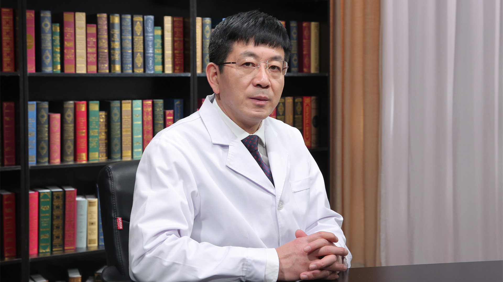

分娩镇痛
========

徐铭军 主任医师
---------------

   1678365365476

首都医科大学附属北京妇产医院麻醉科主任 主任医师 硕士生导师；

首都医科大学附属北京妇产医院怀柔妇幼保健院院长；中华医学会麻醉学分会产科麻醉学组副组长；世界疼痛医师协会中国分会分娩镇痛专业委员会主任委员；中国心胸血管麻醉学会非心脏手术麻醉分会候任主任委员；中国妇幼保健协会麻醉专业委员会主任委员；北京医师协会麻醉专科医师分会副会长；北京医学会麻醉学分会副主任委员；首都医科大学麻醉学系副主任；《中华麻醉学杂志》《临床麻醉学杂志》《国际麻醉学与复苏杂志》《中华麻醉大查房》等编委。

**主要成就：**\ 近五年专业核心期刊发表文章100余篇，SCI发表文章10余篇，获得国家专利4项；主编出版了《妇产科麻醉学》《短效肌肉松弛药的应用进展》《让妈妈不再有受难日–与准妈妈聊无痛分娩》；主译《ATLAS
OF Regional
Anesthesia》《危重症孕产妇多学科监护治疗》；副主译《Obstetric Anesthesia
Principles and Practice》；2018年将主编出版书籍两部，参编书籍若干部。

**专业特长：擅长**\ 高危产科麻醉、分娩镇痛、门诊无痛技术、妇科腔镜手术的麻醉。
