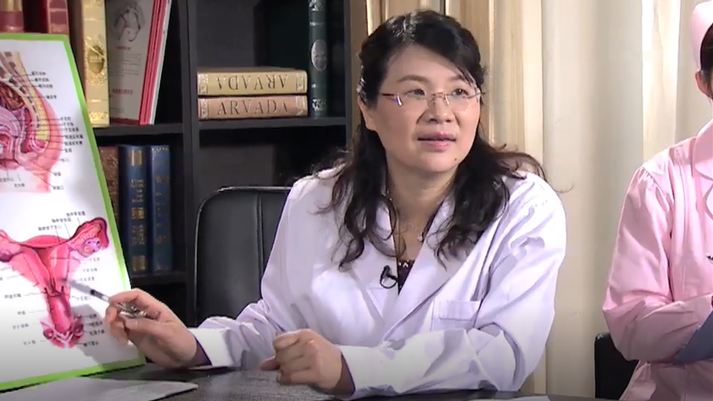

# 附件炎

## 余立群 主任医师

中国医科大学航空总医院妇科主任 主任医师 医学博士 硕士生导师；

北京妇产学会外阴阴道疾病分会常务委员；中华医学会妇科肿瘤学分会委员；中国研究型医院学会妇产科学专业委员会委员；中国老年学和老年医学学会妇科分会常务委员兼总干事。

**主要成就：** 致力于妇科疾病的基础与临床研究；主持各类科研课题11项，通过成果鉴定1项，发明专利1项；发表专业论文30余篇。

**专业擅长：** 擅长妇科内分泌及妇科肿瘤的规范化诊治，精通妇科腹腔镜、宫腔镜、经阴道手术等微创技术，对月经不调、不孕不育、围绝经期疾病及妇科炎症的诊治具有丰富的经验。

---

## 附件炎是怎么回事？

首先我们要了解一下什么是附件。像女性的话，主要的生殖器官，就是包含了子宫和所谓的双侧附件，子宫的两边就是叫附件，一个叫输卵管，一个叫卵巢，左右各一，都位于在大概是腰带以下。所谓的附件炎，就输卵管和卵巢统称为附件，它发生的炎症，就叫附件炎。

附件炎的话一般来讲，就是由于这个病原微生物侵入了，它才会导致炎症，因为输卵管的旁边，就是叫宫旁组织，它是一些结缔组织，或者一些盆腔的腹膜，它往往是连在一块的，所以有时候很难区分，这个旁边的结缔组织炎和盆腔的腹膜炎，有时候也会划归里面，为什么？附件炎它跟盆腔炎关系比较密切，我们所谓的盆腔，就是整个子宫和两侧的附件，加上宫旁的一些组织，盆腔腹膜就统称为盆腔炎，我们讲的附件炎，就是指附件的炎症，一般子宫是没炎症的，但是往往有时候也很难完全区分开，像盆腔炎就一定有附件炎，附件炎不一定叫整个盆腔炎，我们着重讲的是指输卵管和卵巢的炎症，这是我们今天要讲的内容。

原则上，因为卵巢相对来讲，它不太通宫腔，因为我们宫腔就逆行，阴道这个首先感染，首先就容易导致输卵管炎是最常见的，附件炎里面输卵管炎是最常见的，输卵管的伞端，它是跟卵巢是相通的，所以说一些伞端的炎症蔓延过来，就会引起卵巢的炎症，这就是所谓的附件炎。

如果有附件炎的话，它是妇科非常常见的一个病，经常会表现为说肚子一边痛，有的人可能是持续性的，也可以是间歇性的，有时候痛，有时候不痛，就是那种牵拉的最痛的感觉，有的时候还合并一些盆腔肌底的她会有肛门的坠胀感，整体来讲就是附件炎主要的表现，就是会肚子疼，一侧痛，也可能两边都同时痛，附件炎的话相对来讲，如果有炎症的话，它就会影响它的功能，输卵管它主要是一个非常重要的连接子宫的通道，就像我们卵子排卵以后，经过子宫要通过输卵管，来这个地方受精，所以说它跟生育非常有关系，如果有附件炎的病，引起输卵管的阻塞，精子和卵子碰不到一块，就会导致不孕。

同样的这个卵巢，它是我们女性非常重要的一个器官，卵巢它是有内分泌功能，分泌雌激素，还有少量的雄激素，还有一些孕激素，我们女性体内最有用的就是雌激素，雌激素相对来讲，它保持一些女性的生殖第二性征，比如乳房比较丰满，皮肤比较好等等，这个都跟这个雌激素有关系，如果这个卵巢的功能有炎症的话，肯定会导致她的排卵功能障碍，或者影响她的功能，最主要表现就女性第二性征不太好，才会影响到排卵，也会导致不孕，如果是引起的输卵管的阻塞，也会导致不孕，所以说这个附件炎是一个非常常见的病，但是又能够跟女性的生育，跟她的一般的身体状态是密切相关的，所以我们一定要引起重视。

## 附件炎都有哪些症状？

附件炎主要表现的症状就是肚子痛，还有一些体温会增高，就发热，再就是一些白带增多，主要的话这是三大类症状，这是最常见的，一些病人的话，可能还会出现慢性的盆腔痛，就是一个疼，一个发热，是最常见的症状，再就白带多，这三大症状是最常见的。

附件炎的话相对来讲，又分了急性和慢性两种，我们一般经常急诊来看病的，往往是急性的附件炎，因为急性附件炎，她会比较疼痛，或者又发热，症状比较明显，也比较厉害，就是说可以表现为一侧肚子非常的疼痛，坠胀，那种牵拉的感觉，反正就是刺痛等等，还有那个体温有时候会增高，有些病人的话，如果说引起了有脓液，脓肿，可能还会刺激到盆腔的腹膜，甚至是上腹部会有恶心呕吐这些感觉，还有再就是说肛门的坠胀感等等，这是主要的症状。

同时伴行的就是白带特别多，脓性的，那种有异味，有臭味，就是这种改变，再就是我们检查，她体温也增高，发热，38度以上，甚至有的是高热，慢性附件炎往往都是急性附件炎转化过来的，往往她都会有过病史，可能有过急性期的症状，治疗的话没有特别彻底，就是没有完全治好，表现为是什么呢？我们讲附件炎最主要的就是容易肚子痛，还有腰骶部酸胀，白带多，我们做妇科检查的话，可能一侧附件，或者双侧附件比较摸到一个增厚，比较增厚，或者条索状增粗等等，那摸上去它也有触痛，这就是证明还有附件炎。

所谓的慢性跟急性主要的区别，一个就是说症状没有那么典型，没有说肚子痛得那么厉害，同时也不发热，也没有体温高等等

慢性附件炎急性发作的也有，就是说平时也一直有点闷闷的疼，突然一天又发热了，或者摸起来特别压痛了，这个就叫急性发作，所以说慢性附件炎的话，它治疗的时间可能就比较长一点，症状没有那么厉害，但是还是有症状，有肚子疼，腰酸，肚子胀这种感觉还是会存在。

我们知道附件炎的话，还有时候可能会影响到卵巢的功能，还会导致一些不同程度的月经失调的变化，比如月经量多、少都有可能，或者时间长了都有可能会引起这些现象。

## 附件炎要与哪些病区分开？

我们讲急性附件炎，就是来的症状比较厉害，表现的非常的疼痛，它就主要的话，就区分开几个重要的病。

最常见的就是一个什么呢？急性阑尾炎，因为阑尾是在下腹部，右边，特别是右侧这个附件炎的话，因为它的邻近器官就是阑尾，阑尾的脓肿、有炎症，也可能会引起附件炎，一般来讲都是阑尾引起附件炎的多，附件引起阑尾炎的少，相对来讲所以说主要的话就是跟这个阑尾炎相鉴别。

还有第二个就是，我们讲的异位妊娠，就是我们通常说的宫外孕，宫外孕就是指输卵管妊娠，正常妊娠是在宫腔，输卵管妊娠如果破裂或者流产，它也会引起这种疼痛，就是一侧下腹突然撕裂一样的疼痛，这是第二个。

第三个病的话，最常见的就是一个卵巢囊肿的蒂扭转，本身就是一个卵巢有囊肿的话，如果受一个外力的作用，或者说有的人在什么，就是说做自由体操，什么翻双杠的时候，那个体位发生了明显的改变，它会使那个卵巢的囊肿的蒂部，有个根部它产生了扭转，扭转也会引起一个急性的腹痛，表现的也是相对来讲比较厉害的，就是蒂扭转，这是第三个。

第四个病还有一些是急性的肾盂肾炎，肾盂肾炎的话就是说，我们肾脏也是在这个中腹部一点，那么如果它有炎症的话，也会导致这个疼痛的，所以这是肾盂的问题，再一个急性的主要的话，主要是这几个病相鉴别。

对慢性的附件炎的话，主要的要鉴别的就是一种叫子宫内膜异位症，所谓的子宫内膜异位症，就是指子宫的内膜异位到盆腔的其它的器官，那个地方每个月也受月经的影响，相当于也会来月经，也会来一点血，又排不出来，就会引起什么？疼痛，久而久之也是慢性的盆腔痛。第二个就是说一些陈旧性的宫外孕，我刚刚讲的跟急性鉴别是一个急性的输卵管的妊娠破裂，一些病人如果说输卵管妊娠，她当时的话不是太明显，这个病灶慢慢的在吸收什么的，就转为成慢性的，转为陈旧性的宫外孕，她也会有肚子痛的表现，整体来讲主要是这几个病。

我们主要的就是跟阑尾炎的鉴别，是很重要的，我们经常一些病人，因为附件炎把它说为阑尾炎了，或者阑尾炎误诊为是附件炎了，这种非常一个重要的区别，因为阑尾炎的原则上治疗是手术为主，而我们附件炎的治疗原则是什么呢，是药物治疗为主的，因为阑尾它是开始是，就是说上腹部不舒服，然后慢慢的转移到脐周，然后固定在右下腹疼痛，这是一个非常重要的特点，开始是上腹部痛为主，我们讲转移性的右下腹痛，最后就右边的下腹部疼痛明显，并且有脐周的痛为主，这是一个最典型的鉴别点，我们的附件炎一般来讲，就是一边疼痛为主，她们没有说明显的上腹部症状，也没有脐周痛的这种感觉，我们做妇科检查的时候也可以发现，我们通过双合诊，所谓的妇科检查查体，子宫附件我们可以摸到手上，有疼痛的地方，肯定有压痛，所以就很容易诊断，特别是一般有附件炎的病人，连到子宫体，她往往有宫颈的举痛等等，阑尾炎是没有的，阑尾是相对来讲在盆腔上面一点，跟子宫附件相对来讲，有一定的距离，所以说它整个查盆腔，我们摸得到的子宫和附件，原则上是什么，是没有疼痛的，所以这很容易鉴别。

第二个的话就是说因为妊娠的，也是要鉴别的，特别是急性的输卵管妊娠流产，或者破裂，它会导致这个盆腔，就是说腹部出血，甚至厉害的话就有生命危险，所以这个是一定要注意鉴别的，最主要的危害就是肚子里出血，出血就会引起休克，就是有生命危险，这个鉴别也很好鉴别，就是往往这种病人的话，往往阴道会少量的出血，可能有一些停经，我们有个尿检，就是查她怀孕了，再做个B超就能够确诊这个输卵管上有个怀孕的东西，就相对来讲比较好鉴别。

我们在临床上，确实也有一些病人，比较不太典型的异位妊娠，会误诊为附件炎来治疗，首先判断她是否怀孕，这一点就可以排除了，我们查个血，尿hcg，就知道是否怀孕了，再做一下B超，基本上就能体现了。

如果说尿阴性的病人，有的时候会误诊为附件炎的，必要的时候我们会查血的，血的话相对来讲比尿灵敏性更高，也就知道了，第二点就是说，B超我们可以提示，输卵管上是否有妊娠的包块，就妊娠囊，或者腹腔里面有没有积血，有时候我们可以通过辅助检查，就是从后穹窿穿刺，后穹窿就是肚子最顶端，通过阴道的后穹窿，把那个注射器穿刺一下，如果抽出血来了，就证明肚子里有内出血，最常见的就是异位妊娠的表现。

我们还有一个病鉴别的，就是一个黄体破裂，所谓的黄体就是卵巢排卵以后，大概在22天左右，黄体到了高峰期，就是到一定的过程它会破裂，破裂到了血管，也就是说卵巢上会出血，刚刚讲的异位妊娠是输卵管妊娠的出血，那我们通常说的黄体破裂，也是比较常见的，那个原因往往在月经周期大概第22天左右，排卵后七天左右，黄体是个高峰期，它可能会出现出血的现象，一出血肚子里有刺激痛，也就会表现出疼痛，这种病人往往，首先是发生在这个期，我们刚刚说的异位妊娠和黄体破裂，它往往不会发热，所以说这个也是一个鉴别点。

## 附件炎会有哪些严重后果？

附件炎是我们妇科非常重视的一个病，尤其对于这个年轻的女性，没生育的，就是说最怕的就是什么呢，导致不孕症，我们讲不孕症里面，很多很多就是一部分原因就是输卵管的原因，因为附件炎的话，导致输卵管黏膜充血，有的时候脓性分泌物导致这个黏膜粘在一起，最后导致的结果是什么？阻塞或者是积水等等，就导致这个输卵管堵到了。

我们讲输卵管，它是卵巢和子宫的连接的通道，精子必须是运行到输卵管的壶腹部，等待受精，卵子排卵以后停留在壶腹部这个地方受精，受精以后再逐步的运回到宫腔来着床，所以说这个有附件炎的病人，首先如果说输卵管阻塞了，可能就会导致不孕，这是一点。

第二点的话，如果这个输卵管功能不好的话，它即使是通的，怀孕我们讲着床的位置在壶腹部，它要通过六到七天的过程，再慢慢运回到宫腔来，运回到宫腔才能发育正常，如果它在输卵管的某一段停下来了，就会导致什么，输卵管妊娠，也就是通常说的异位妊娠，也就是有生命危险了，所以说一个是不孕，再就是异位妊娠，这是两个最常见的并发症。

如果是卵巢的炎症的话，它也会通过影响卵巢的功能，排卵障碍也会导致不孕，第二个就是说影响卵巢的功能，分泌雌激素，我们讲雌激素、孕激素、少量的雄激素，都是卵巢分泌的，它有炎症可能会影响它的功能，也就会使女性导致月经失调等等。

## 哪些人容易得附件炎？

附件炎的话，所谓的炎症一般原则上都有两个条件，一个就是可能有细菌的入侵，就是有细菌才有炎症。

第二个就是说，身体的抵抗力要好，能够消灭那个细菌，也就不会导致炎症，所以说整体来讲，容易患附件炎的病人，往往见于一些近期做过人工流产，加强了细菌入侵的机会，或者说我们讲的孕产妇，孕产妇身体抵抗力往往不是太好。

再就是性生活不干净，就是说不洁的女性，同时一些在经期不注意卫生的，就身体免疫力又低下的妇女，她就容易导致附件炎。

为什么这些人会引起附件炎，就比如说我们最常见的分娩或者流产后，抵抗力本身就在下降，同时的话我们讲正常宫颈，它是一个屏障，它会分泌黏液栓，会阻止阴道的细菌逆行到宫腔引起感染，我们讲的附件炎往往都是很多的生殖道的细菌，通过逆行的感染，通过子宫到输卵管、卵巢，发生炎症的，如果产后或者流产后，这宫颈是扩张的，相对来讲尽管是比较松弛的状态，细菌很容易逆行上行，引起感染。

第二个就是说，一些放了宫内节育器的妇女，如果放环的过程中消毒不严，或者说个人卫生掌握得不好，有过宫腔手术，引起这个细菌的逆行感染，再加上这些抵抗力，身体的抵抗力不是太好的话，就容易导致这个炎症。再就是说一些不注意经期卫生，月经期性交等等。

第五点的话就是说，身体的其它的部位，比如说一些结核性的病，它是通过血行传染的，如果没有及时治疗的话，就会通过血行，通过血运，把那个细菌运行到输卵管卵巢，导致附件的炎症。

再一个就是一些附近的像卵巢，阑尾周围的那个炎症波及过来的，也容易导致附件炎，还有一些就是说，我们讲性传播疾病的淋病，淋病感染以后也会通过黏膜上行，导致这个附件的炎症。

## 未婚女性也会得附件炎吗？

未婚女性因为她没有性生活，原则上是不太容易得附件炎的，但也不是说绝对不会得附件炎，因为我们讲的附件炎的致病菌，有些是通过非性生活的途径，来进入生殖器的，比如说通过非侵入性的操作，比如说你在不洁的浴缸里泡澡，这个细菌它也是会容易（导致感染），坐便盆洗浴等等，就是说引起感染。

第二个就是说，除了这个性器官的这个直接的逆行的感染，还有一个是血行的途径，就像我们讲的结核，它是通过有肺结核，或者说盆腔这些结核菌的话，它会通过血行播散到生殖器官，播散到输卵管和卵巢，会导致炎症。

还有一些肠道的炎症，肠炎的患者会通过淋巴管的途径，也会传播扩散到生殖器。

再一个我们就是说的直接侵犯，就比如说有阑尾炎的，它直接播散到附件，就导致炎症。

所以说一般来讲，我们讲的临床上碰到的很多的附件炎，大部分是已婚的妇女，通过性生殖道，逆行上行感染的多，就比如说有宫腔操作、人流、上环、或者分娩这个操作，有这个宫壁的接触史，这个操作的，往往会容易引起炎症的多，所以说一般来讲未婚女性，不容易得附件炎，但是也不是说绝对不得，就是这个原因。

## 哪些原因会引发附件炎？

我们首先要知道附件炎，首先就是说几条途径容易导致附件炎，一个就是说通过阴道黏膜逆行的细菌，通过宫腔逆行的感染会导致。第二个是可以通过血行会导致，比如结核菌。再有就是说通过肠道的，肠炎等等，通过淋巴管来的。第四个就是通过直接蔓延，比如阑尾直接来的，这四大原因，最常见的一个原因，就是通过生殖道的细菌感染，逆行感染引起的，这种可能性是最大的，所以说这种人就往往是多见于流产，或者分娩以后，这个抵抗力下降，病原体上行感染会导致。

第二个就是说，通过这个接触这个宫腔的操作，我们讲的做人流、上环、或者一些消毒不严等等，也会导致这个炎症。

再就是说一些不注意月经期的卫生，也会导致细菌的感染，经期的话因为她有出血，宫颈管也是松弛的，加上有血行的原因，更加的跟外界相通的话，如果月经期又不注意换卫生巾，血也是一个非常好的一个细菌培养基，所以说月经期不注意卫生，也是容易患的。

其它的就是说的结核病，没有积极治疗，或者阑尾炎没有积极治疗，就导致伴行的感染。

还有一些就是导致附件炎比较厉害的细菌，就是一个淋球菌的感染，我们通常讲的性病，其实指淋病是最常见的，它可以沿着黏膜的上行，把这个细菌运行到这个输卵管和卵巢，导致炎症。

## 附件炎要做哪些检查项目？

附件炎的话一般来讲，通过她的这个肚子痛，发热，我们做一下妇科检查，能够摸到这个子宫体，宫颈特别触痛，特别是一侧附件可能会增厚，又压痛比较明显，基本上我们就可以诊断，如果有脓肿的，可能这个附件有脓肿，或者卵巢有脓肿的话，我们就会摸到包块，那个包块是比较固定的，相对来讲轮廓也是不太清楚的，基本上就可以通过这个症状，我们讲的肚子痛，刚刚讲的体征，发热加这个局部的压痛，甚至摸到包块，就基本上能够确诊。有时候也借助一些B超的检查，B超检查主要是看什么呢？一个就是看附件有没有形成脓肿，还有盆腔是否有积液，比较多的积液，主要查这些。

化验的话，有附件炎的病人，往往白带多，脓性的，也是一样的，能查到一些白细胞比较多，基本上就能诊断了。个别情况下需要用腹腔镜的检查来探查，如果说诊断附件炎的话，是很少用腹腔镜的检查的，所以说检查主要的话就是分泌物，就是查白带，是否白带里面有很多的白细胞，再就是说借助一下B超的检查，在化验里面，当然还查个血常规，血常规明显的白细胞比较高，有一万以上，也就基本上能确诊了。

## 附件炎该怎么治疗？

附件炎的话，主要的治疗方法的话，我们也是分急性和慢性的，所谓急性附件炎，我们就包含了保守性的治疗和手术治疗，大部分病人，附件炎都是可以通过保守治疗来治疗的，保守治疗主要就是用药物来治疗，我们讲附件炎它都是因为有细菌感染才导致的，所以说也是做细菌的培养，细菌分泌物的培养，看是哪种细菌，对哪种药物过敏、敏感，我们来选用合适的抗生素来做治疗。

如果症状轻的可以选择口服抗生素，如果症状比较厉害，又发热比较明显的，局部压痛比较厉害的，我们就会选择静脉输液抗炎治疗。主要的选择药物，就能够控制。

我们一定是强调比较早期治疗，并且要联合用药，用药的方案一定要到半个月左右，这点是很强调的，就是说要足量、要及时、规范、足量、全程，就是说做到这几项，大部分附件炎都能治好，都能得到根治，但是一些病人，比如细菌感染的力量比较毒，抵抗力又比较差的病人，可能药物得不到控制，有一些病人就会选择什么？选择做手术治疗，什么情况下需要做手术呢？大体的就见于四种现象。

第一个就是说附件炎，我们讲急性的，她有卵巢和输卵管的积脓，包括包块也比较大，我们积极的用药物治疗，三天之内，就是72小时一个标准，如果症状不缓解的，这一点可能就得做手术了。

第二点就是说慢性的附件炎，如果是久治不愈，就是治了很长时间，还有输卵管的积水，或者卵巢的囊肿，就选择手术。

第三种就是说，我们说附件炎会导致输卵管阻塞，导致不孕，不孕怎么办？可以通过手术做输卵管的整复，就是说把它疏通来，做这个手术。

第四点就是，患者这个年龄比较大，又是慢性的附件炎，反复的急性发作，药物治疗非常的不理想，这四种情况，我们就会给她做手术治疗。

整体来讲的话就是说，药物治疗无效，表现为体温持续不降，中毒的症状比较明显，我们讲的中毒就是指，一般来讲很多人发热，恶心呕吐，整体的这个状态加重，再就是脓肿持续存在，老不消掉，还有一个就是说，脓肿破裂的时候，那是一种急性的，因为我讲脓肿破裂了，整个脓液都散在盆腔、腹腔，它就会容易通过腹膜的吸收，会导致全身的中毒的症状比较明显，所以一些炎症的病人，如果没有处理好的话，附件炎有时候也会导致败血症，脓毒血症，会导致生命的危险，所以说经过了积极的药物治疗，不行的话必要的时候是一定要选择手术治疗，手术治疗的好处，就是直接进去了，用负压吸引器把它脓肿吸收掉，局部肚子里放点消炎药，直接帮助杀菌，还有就是没有生育要求的，有脓肿的，我们把输卵管卵巢一起切掉的都有，就是把病灶去除掉了，达到快速的扭转，否则的话一些病人如果迁延不愈，或者你没有引起重视，会有生命危险的，我们在医学上就是说感染，它是会死人的，感染会导致全身的中毒症状明显，整个机体的话，导致不可逆的损害，就容易导致生命危险。

## 附件炎如何预防？

我们讲导致这个附件炎的原因，一个就是细菌感染，一个就是什么？抵抗力下降，所以说从这两方面来讲，首先就是说排除这个，就是做好细菌的防护，就是说在这几个关键期，女性的经期、孕期，还有产褥期，这个时候也是抵抗力比较差的时候，所以一定要做好卫生方面的注意。

第二点就是说，要严格掌握这个产科的和妇科的手术指征，就是做好术前准备，注意好无菌的操作，这是作为医生的，同时作为你们病人来讲，就要选择到正规的医院做人流，做一些手术，就是消毒一定要比较合格，术后也做好护理，预防感染。

第三个方面就是说，治疗盆腔炎的时候一定要知道，我们讲很多的急性炎症，它是可以治愈的，要知道什么能治愈，就是一定要及时的治疗，彻底的治愈，防止转为慢性的，这是一个非常重要的。

第四点的话就是说，注意性卫生，性生活要注意清洁，减少性传播的疾病，特别在月经期，一定不能有性生活，这四大点是非常重要的。

## 附件炎会影响怀孕吗？

附件炎的话可以说最大的危害，就是引起不孕，卵巢的炎症，它就会影响排卵，出现月经失调，白带增多，引起不孕，这是卵巢。第二点就是输卵管的方面，输卵管如果阻塞了，输卵管的功能就受损了，输卵管它有几种功能，有连接了卵巢和子宫的通道，精子和卵子相遇，这是必须要通畅。第二个还必须功能正常，如果功能不好，它就会导致什么，即使是通的，我们讲（受精）以后六七天，是一定要运到宫腔的，如果没到宫腔的话，就怎么样？就在输卵管上怀孕，怀孕的话就叫我们讲的异位妊娠。

为什么说输卵管妊娠会一定破，因为输卵管，它是一个非常薄的一个通道，到一定的程度它就会破裂，不像子宫，子宫只有五毫升，真正到了怀孕，可以到一千倍，就到五千毫升，真正的怀孕，一个那么大的小孩，它是不会破的，所以说在输卵管，小孩是长不大的，到了一定的程度，很早期就会破裂，导致不孕。

所以说相对来讲附件炎最容易的这个危害，就是会导致不孕，会影响怀孕，所以一定要引起重视。附件炎因为炎症会累及卵巢和输卵管，有可能造成不孕。

## 得了附件炎必须要注意哪些事？

附件炎因为它会导致不孕，对于未生育的女性，肯定是非常一个大的并发症，对于已婚已生育的女性的话，因为它如果转为慢性的，老是会慢性的疼痛，也会影响工作生活，并且又是个非常常见的病，所以我们得了附件炎的话，我们除了听医生的指导，要积极治疗以外，我们要注意一些饮食，用药，生理卫生，日常护理等等方面，要注意一些问题，来帮助治疗这个炎症。

首先在用药上，我们讲附件炎急性期，完全治好了，它就不会转成慢性的，而如果到了慢性的话，输卵管功能都已经纤维化了，畸化了，再回头的话就会很难治了。

所以说我们在用药上面，就是一定要听从医生的指导，要做到比较规范的治疗，时间要到位，因为盆腔比较，作为人体来讲，它是比较低的器官，它用药的时间，就比一般的要延长很多天，所以说它的剂量都是指14天左右，当然不是说输液一定要输14天，比如说她前面有发热的时候，她就用静脉输液，后面如果不发热，体温正常了，就改成口服用药，但是一定要注意一个14天的一个疗程，这个一定要知道。

还有一些，就是强调联合用药，因为盆腔的细菌是好多种的，多种细菌综合感染的结果，你单用一样可能效果不好，一般来讲都是常规用联合两种用药，两种抗生素的应用，这是一个比较规范的。

再就是说转为病情控制以后，可能也再补充一些中成药的治疗，来促进这个炎症的吸收，就是说可以是中西药一起用，强调这个联合用药，强调一个治疗的足量用药，要14天的时间，这点是很重要的。

再就是说在一些经期卫生各方面，也都要注意护理，注意清洗外阴部，做好卫生工作。再就是说在月经期，其实千万不能有性生活，这样也会加重病情。

我们讲在饮食方面的话，也是说注意一些吃一些容易消化的，清淡一点的饮食，不要吃太多的辛辣刺激的东西，引起抵抗力下降等等。整体来讲是这些。

附件炎导致不孕或者转成慢性，都会对女性的生活和工作造成很大影响，因此，治疗期间必须要注意以下事项。

## 附件炎能根治吗？

附件炎的话是这样的，在急性期经过恰当的抗生素的治疗，它是可以得到根治的，在急性期如果75%以上的脓肿，如果是用药得当的话，治疗及时也是可以得到控制的，就比如我们讲，炎症发展到最严重的阶段，就是出现脓肿等等，那我们只要在早期，75%的病人都还是能够得到这个控制，得到治疗的，也就是说绝大部分的急性附件炎，可以得到彻底的治愈，但是如果在急性期，没有很好的控制，到了慢性期，再来治好的话，就比较困难的，到了慢性期，原则上就采用综合治疗，就是说通过一些局部的理疗，抗生素就显得的不是太重要了，因为一些到了慢性期，输卵管纤维化了，就粘连包裹了，这些等等形成了以后，就很难彻底治愈了，在早期，或者说是急性期治疗得理，是很容易根治的。

## 附件炎会导致流产吗？

附件炎的话应该说也会导致流产，因为附件炎有炎症的病人，她这个输卵管也可能会出现一些炎症性的积水，会倒流到宫腔，引起这子宫胚胎的发育异常，就是炎症性的渗出液体，这是最主要的一方面。

还有就是说，因为有卵巢，它会分泌雌激素孕激素，如果它有炎症的话，它会导致卵巢的功能受损，支撑怀孕的一个重要的激素，就是孕激素是通过卵巢来分泌的，在早期的话，是黄体分泌孕激素，不够的话也会导致流产，主要是这两个方面引起的。

## 附件炎患者哪些东西不能吃？

在附件炎的患者的话，就是帮助她治愈的，就是说我们要提高自身的抵抗力，饮食是一个非常关键的一方面，所以我们要尽量避免吃那个辛辣的刺激性的东西，比如说过多的辣椒，因为这些辛辣的食物的话，从中医上来讲会加重炎症的症状，就是说使病情不好控制。

第二个就是避免吃那些比较生冷的，比较寒的东西，这个饮食方面，我们讲可以说都是说通过中医的原理来预防的，所以说尽量避免辛辣，避免生冷寒凉的东西，还要避免吃这些过量的咖啡、茶，可乐、巧克力等等，咖啡因使神经紧张，也会造成情绪不好，某种程度上间接的使抵抗力下降，同时肯定是不能喝酒的，多服用一些矿物质，就是说多种维生素等等，可能也会好一些。

## 附件炎的患者能过性生活吗？

原则上在急性期是不能过性生活的，因为急性期的话，她本来身体就比较痛苦，因为肚子疼，一些病人还会引起宫颈的触痛，所以说这个急性期原则上是不能有性生活，等到急性控制了，肚子不疼了，白带也比较正常了，那个时候可以有性生活。慢性期的话原则上也减少性生活。

## 附件炎治疗后多久可以怀孕？

对于这个怀孕的过程的话，首先我们要知道这附件炎是否完全治好了，完全治好的标准，就是首先是肚子不疼了，白带也正常了，月经各方面都跟原来差不多恢复了，也不发热，体温也正常，就可以提示正常了，一般来讲的话，我们对于这个附件炎的用药，各方面可能两到三个月就足够了，原则上就是这个月月经周期没有用药，只要怀上对小孩也没有影响，因为我们讲得过附件炎了，我们要恢复输卵管的功能，卵巢的功能状态它可能恢复有个过程，所以一般来讲，建议两到三个月比较合适，就是间隔两到三个月再怀孕比较好。

## 附件炎吃什么药效果好？

附件炎这个药的话相对来讲，也是针对急性和慢性期。一般来讲的话，也是根据病人的不同的程度来的，原则上就是在急性期，我们是强调两种以上的抗生素治疗，就是两种左右，必要的时候三种抗生素也是可以的，因为我们附件炎的话，它是多种细菌，有喜氧菌、厌氧菌，就是综合类的细菌感染为主的，所以我们要选择联合用药，又叫广谱用药。

还有一些病人的话，往往有的时候会通过做细菌培养来选择用药，但是往往这个病人痛着来了，又发热了，你必须马上要用上次抗生素，所以说原则上我们还是选用比较广谱的抗生素先用上去，如果症状没有得到改善，再细菌培养一般两到三天出结果，再来根据细菌培养的对哪种药过敏，再来调整，如果用的好就没必要再换抗生素了，整体来讲所以说，一般是两种以上的抗生素联合治疗就可以了，疗程强调半个月。

还有一些病人就可以配合一些中药，因为中药治疗附件炎，还是比较有效的，因为中药它有一些活血去瘀，清热解毒的药，有一些中药也是可以治的。

对慢性期的话，抗生素的治疗可能就不是主要的，我们会强调吃一些中药，中成药治疗，然后再强调一些局部的理疗，比如说热敷，带有一些中药的敷肚子，通过理疗的方法，或者说通过中药外敷的方法，促进局部的炎症的消退，因为慢性就形成了纤维化了，就通过这种综合治疗的方式，来促进这个炎症的愈合。

## 附件炎会影响月经吗？

附件炎的患者的话，原则上30%的病人，会出现月经的问题，这个附件就包含了一个是输卵管，一个是卵巢，卵巢是月经主要的来源，月经就是因为卵巢有雌激素，是周期性的变化，使子宫内膜在受这个卵巢激素的影响，子宫内膜发生增生分泌，再脱落，那也就是月经来潮，所以说整体来讲，就是只要影响了卵巢的功能，它就一定会影响月经，所以说有30%的患者会出现月经的问题，可能就表现为月经量可能比较少，或者说时间比较长等等，或者甚至影响排卵，引起月经不调等等，如果影响排卵的话，有的人还会引起月经过多，就是她没有分泌孕激素，有的时候就排卵，就是无排卵性的月经过多的现象也会出现，整体来讲就是可能出现月经不调，月经不调就分了很多种，月经量多和少这都属于，或者经期延长，这都属于这个月经不调的表现。

---
