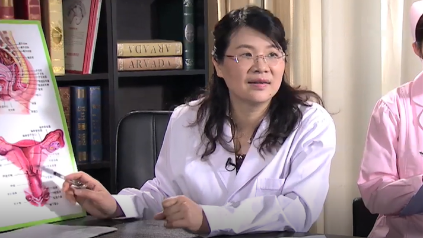

附件炎
======

余立群 主任医师
---------------

   1678365506307

中国医科大学航空总医院妇科主任 主任医师 医学博士 硕士生导师；

北京妇产学会外阴阴道疾病分会常务委员；中华医学会妇科肿瘤学分会委员；中国研究型医院学会妇产科学专业委员会委员；中国老年学和老年医学学会妇科分会常务委员兼总干事。

**主要成就：**
致力于妇科疾病的基础与临床研究；主持各类科研课题11项，通过成果鉴定1项，发明专利1项；发表专业论文30余篇。

**专业擅长：**
擅长妇科内分泌及妇科肿瘤的规范化诊治，精通妇科腹腔镜、宫腔镜、经阴道手术等微创技术，对月经不调、不孕不育、围绝经期疾病及妇科炎症的诊治具有丰富的经验。
