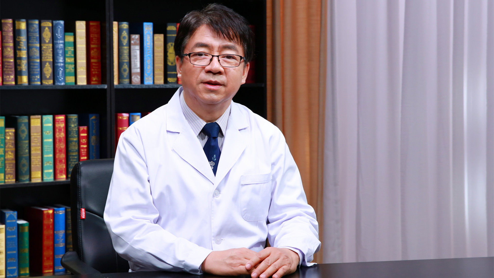

宫颈癌//吴鸣教授
================

吴鸣 主任医师
-------------

   1678366129860

北京协和医院妇产科 主任医师；

卫生部内镜专业委员会副主任委员；卫生部内镜监察委员会副总干事；中国抗癌协会腹腔镜与机器人分会副主任委员；中国抗癌协会家族遗传性肿瘤专业委员会副主任委员；北京妇科内镜协会副主任委员；美国妇科肿瘤协会会员；美国妇科腹腔镜协会会员。

**主要成就：**
核心刊物发表文章上百篇；担任多本杂志编委和多个医学院校客座教授。

**专业特长：** 擅长各种妇科肿瘤的手术，尤其擅长腹腔镜手术。
