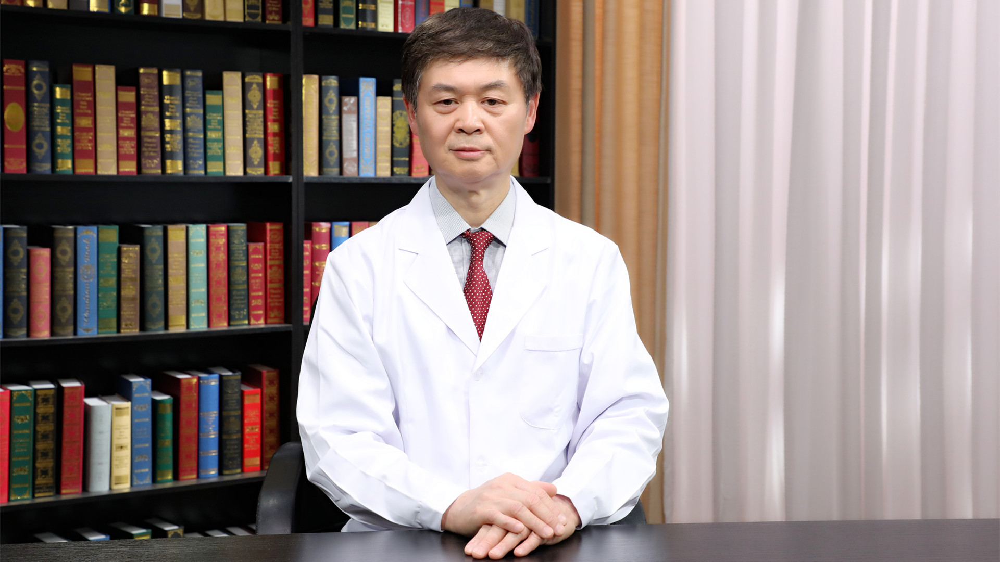

宫颈癌及癌前病变的相关病理诊断
==============================

刘东戈 主任医师
---------------

   1678366280659

北京医院国家老年医学中心病理科主任 主任医师教授；

中华医学会病理学分会候任主任委员；中国研究型医院学会超微与分子病理学专业委员会执行主任委员；中国医师协会病理科医师分会常务委员；北京医学会病理学分会主任委员；北京医师协会病理专科医师分会副主任委员；北京市病理质量控制与改进中心副主任委员。

**主要成就：**
先后在国内外专业杂志发表学术论文90余篇；主编、主译或参编专著10余部；承担省部级以上科研课题5项；获省部级科技进步奖2项，获2019年国际细胞病理学会George
L Wied终身成就奖，获2020年“国之名医•卓越建树”奖等荣誉。

**专业特长：**
从事病理诊断工作近40年，临床病理诊断经验丰富、全面；擅长细胞病理、神经病理、头颈、呼吸和消化等多系统疾病的临床病理诊断。研究工作的重点是神经病理和细胞病理学。
