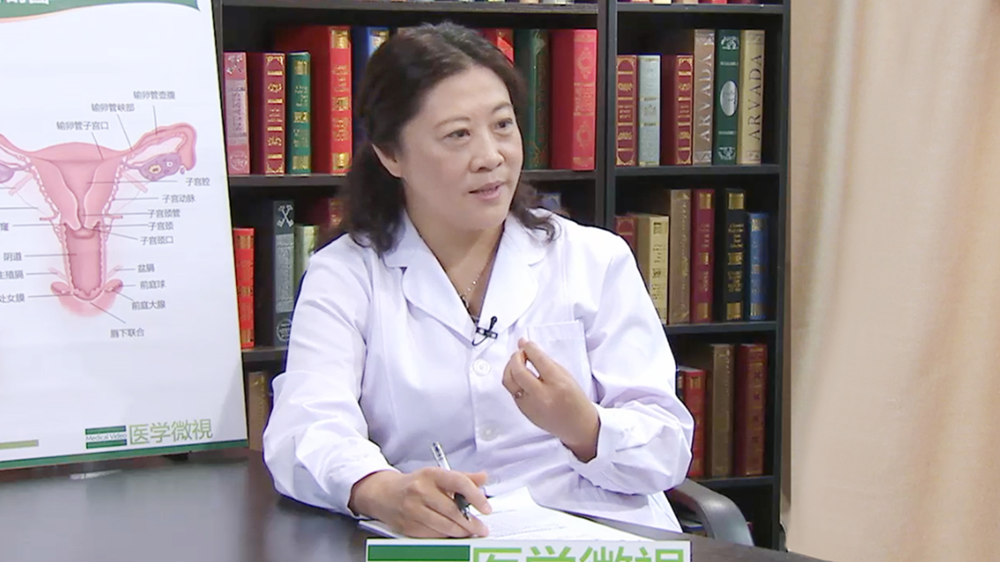

# 宫颈癌前病变

---

## 陈春玲 主任医师

中国医促会妇产科分会主任委员；

璞至医疗专家委员会主席；亚洲妇科肿瘤学会中国唯一常务理事；北京善尔医院院长；北京红松仁和医院院长。

**主要成就：** 中英文论文40余篇，其中英文9篇，中华妇产科4篇，参与编辑专业著作10余部，其中主编主译两部，副主编两部。

**专业特长：** 擅长微创手术（宫腹腔镜手术、阴式手术）、各种妇科肿瘤手术、盆底手术、各种疑难妇产科手术、妇科肿瘤的腹腔镜手术、单孔腹腔镜手术、保留生育功能的宫颈癌根治手术、保留神经功能的宫颈癌手术。

---

## 宫颈癌前病变和宫颈上皮内瘤变是一回事吗？

这是一个概念，宫颈上皮内瘤变是宫颈癌前病变的一个另一个说法，（宫颈）上皮内瘤变，我们叫CIN，就是cervicalintraepithelialneoplasias。

所以一般来说，宫颈癌前病变我们都诊断说是CIN，过去我们就叫癌前期病变，现在我们把它分为低度的癌前期病变就是Lsil，还有一个就是高度的癌前期病变就是Hsil，Lsil我们诊断CIN1，就是轻度的上皮内瘤变，Hsil又包括CIN2和CIN3，就是中度的上皮内瘤变和高度的上皮内瘤变，它是宫颈癌发展过程中必经的一个系列的过程，在宫颈癌发生前有大概5-15年的一个癌前期病变的阶段。

在这个期间如果能够及早地诊断发现，宫颈癌就阻断在摇篮之中了，这就是我们为什么要做筛查，这个必要性，这个话题是非常好的。

当然宫颈癌前病变不是癌，它是癌前的一种过度，尤其是广大的女性朋友们一定要注意，因为癌症是已经发生了细胞行为的非常大的变化，已经是无法控制的一个过程了，癌前期还是一个可控阶段。

所以如果是在癌症发生过渡阶段，我们很好地发现，就是诊断了CIN，无论是CIN1、CIN2还是CIN3，都是可以治疗和治愈的。

---

## 宫颈癌前病变是怎么引起的？

宫颈癌前期病变跟宫颈癌是一个原因，都是大家熟知的，叫HPV病毒的这样一个病毒（感染）造成的，HPV是叫做人乳头瘤病毒，这个病毒跟我们的宫颈癌发生是密切相关的，由于这个病毒导致了宫颈癌，也导致了宫颈癌前期的这些一系列的改变，什么会导致这个HPV感染呢？

一般HPV感染都是通过性传播的，在性传播过程中有可能会导致（HPV感染），尤其是一些生活比较不规律的或者性伴多的。

或者是一些有其它的感染因素存在的，像有艾滋病的病人，他同时可能就很容易发生这个病毒感染，因为他免疫功能低下。

还有些爱吸烟的、喝酒的病人，这些病人免疫功能低下，也容易让HPV入侵。

感染宫颈造成癌前期病变，当然也有一些其它的病毒感染，像疱疹病毒感染，对于这些人群它的HPV感染的概率也相对比较多。

还有一些报导说，分娩次数比较多的，或者手术次数比较多的，（造成）宫颈的一些损伤，HPV也容易乘虚而入，在这个过程中，也是导致HPV感染的一个原因。

---

## 宫颈癌前病变都有哪些类型？

宫颈癌前期病变有低度病变叫Lsil，也叫做CIN1，上皮内瘤变1，轻度的上皮内瘤变。

还有一个叫Hsil，就是高度的病变，又叫做CIN2，或者伴有CIN3，这个是中度的上皮内瘤变和高度的上皮内瘤变。

一般来讲是分为1、2、3，或者是低度病变，高度病变，高度病变是更容易发生癌变，对于有高度病变的患者，一定要积极的治疗，这个过程是非常重要的，如果是低度病变，可以在一定的程度上听医生的指导，来进行规范化的治疗。

---

## 宫颈癌前病变发展成宫颈癌一般需要多久？

女孩子有性生活之后，很多人都有可能有感染，女人一生中感染HPV的概率可能在70%。

所以说不要谈到HPV就很害怕，这么高的概率，尤其是在20岁到24岁，是一个非常高发的感染期，这时候可能大概有20%到25%的女孩子会有HPV感染，往往这时候是一过性的，经过自身免疫的调节之后它就消失了。

如果反反复复感染的话，持续性的感染，这时候才会经过5-15年发生癌前期病变，最后导致宫颈癌。

所以一般来讲癌前期病变是在25岁到35岁之间是最高发的，之后像宫颈癌的发生是35岁到39岁，是一个高发年龄段，正好给HPV感染10-15年左右的时间，发展成癌症。

可以看到HPV感染，癌前期病变最后到癌症，是有一个渐进的过程。大多数是这样逐渐地从癌前期，轻度到高度，最后到癌症。

---

## 女性HPV感染时性伴侣也需要做HPV筛查吗？

HPV感染不光是对我们的宫颈是有伤害的，HPV感染之后，其实很多相关的像临床上皮覆盖的区域，像外阴、阴道这些（部位）癌症，也都跟HPV有关系的。

所以一方面我们在检查宫颈的时候，也还要关注其它部位的跟HPV相关的这些部位的一些改变，其实很多有宫颈癌前期病变的患者，可能同时有外阴或者阴道的癌前期病变，这个病毒是对于鳞状上皮是有非常强的这种破坏力，就是说HPV可以导致宫颈癌，同时也可以导致下生殖道的相关的很多的肿瘤。

HPV不光是可以导致女性的癌前期病变，实际上在女性有癌前期病变，尤其是像有重度的CIN3的时候，她的性伴侣大概将近有三分之一，30%左右的人可能会有一些，他们阴茎（也有）相关的这种癌前期病变，所以这个也是同时女性跟性伴都要做筛查和检查的原因。

---

## 为什么宫颈癌筛查首先要进行HPV筛查？

实际上要说女性来讲，是要进行妇科的检查，常规来讲一年要做一次妇科检查，对于宫颈癌筛查国际上是从21岁开始要做宫颈癌的筛查。

就是癌前期病变的检查，传统上是采用细胞学的检查，我们又叫做TCT，21岁开始要做TCT，一般来讲是三年做一次，之后到30岁以后常规就是把TCT改成是TCT+HPV联合筛查，这个是过去的观点，联合筛查如果两项都阴性，每一年做一次检查。

但是从14年底15年初，国际上有了新变化，关于HPV筛查和TCT筛查谁为先，最近的研究认为HPV筛查，可以作为第一筛查，首要筛查的手段。

（采访）为什么呢？

这个问题讲起来，因为HPV筛查更能够筛查出CIN3，就是高度的癌前期病变，因为CIN3是在短期内有可能会发生癌症，在这个（时候）如果没有筛查到，她这些人经过半年、一年，或者是三年之内，大概将近有20%到30%的人，会转变为癌症。

CIN2大概转成癌症的时间，一个是会比较长，另外一个比例可能相对就比较小，大概也就5%左右的，CIN1大概也就1%左右。

所以（从）这个概率就可以看出，要筛查CIN3是最关键的，它是阻断筛查出最重的病例，然后把她能够筛查出来（的患者）给予治疗，就阻断了癌症。

HPV在整个筛查中起到了最重要的作用，所以现在的观点是在21岁以后还是要做细胞学的检查，因为年轻的女性HPV感染率比较高，刚刚感染还不足以导致癌症，在这个过程中，还是看细胞学的变化。

25岁以后可以建议做HPV的首要筛查，HPV筛查如果是阳性，尤其是高危型的16、18阳性，这时候要做进一步的诊断，那就（有）很多的方法，包括要做阴道镜，要做活检，要做病理，确定诊断之后，还有很多的治疗的方法，可能我们都知道像锥切，利普，或者激光，或者一些物理治疗等等。

---

## 宫颈癌前病变B超能检查出来吗？

大家老是觉得B超是妇科的重要的检查方法，B超是一个影像学的改变（检查），一般来讲是可以看到我们的子宫、宫颈，但是它看不到细胞里边的变化。

癌前期病变是细胞内的一系列的改变，它是细胞内的细胞层增生，然后异常的这种增大的细胞核，异常的改变我们肉眼看不到，然后B超也是看不到的，只有通过我们说的这种病毒检查，细胞学的检查看到细胞的变化，甚至通过病理最终的检查，来诊断细胞学的变化。

---

## 宫颈炎、宫颈糜烂也是宫颈癌前病变吗？

宫颈癌前病变，这个有时候大家老是说什么宫颈炎、宫颈糜烂，或者一些宫颈口有时候有天生的外翻，或者是宫颈上长了一些小的肌瘤、息肉，这些都是炎症的改变，这些不是宫颈癌前期病变，这些有可能因为有炎症，因为有一些其它的改变，发生癌前期病变的概率相对高一些。

但是癌前期病变，一定是细胞内部发生了改变，通过细胞学和HPV的检查，才能够去筛查到，通过病理诊断才能诊断到，不是说表象上看到有宫颈的炎性的改变，或者有子宫里边的改变，会跟它混淆，这只是一个概念的混淆，实际上是不太容易混淆的。

---

## 宫颈癌前病变和早期宫颈癌是怎么区分的？

这个也是病理学的诊断了，因为从宫颈癌前期病变的诊断，我们以前说三阶梯的诊断，细胞学、病毒（检查），我们要做阴道镜检查，我们要做病理，活检病理确诊。

在这个宫颈癌诊断的时候，从临床表现上可能会比癌前期病变会多一些，因为它会有宫颈已经长出能够肉眼可见的癌的这种表现了，可能会有出血，肿瘤更多的不适感，另外从细胞学上可以看到有癌细胞了。

（从）这个病毒上一般来讲，HPV一般都是高危型的，16、18是最常见的，还有就是在做活检，做诊断的时候，能看到不光是癌前期病变，细胞基底层上的这种异常的增生，宫颈癌的时候会看到基底层的整个破坏，穿透一层重要的保护，到了基底层以下，这时候就有了早期的浸润，这时候我们就诊断（为）早期的浸润癌。

根据这个浸润的深度和宽度，我们又分为早期浸润癌和浸润癌，早期浸润癌浸润的深度是五毫米，宽度是七毫米，超过这个范围了就叫做浸润癌了，就不是早期浸润癌了。

所以这个诊断不是靠医生肉眼来看的，肉眼是可以看得到，妇科检查可以来检查，另外一个对早期浸润癌一定是镜下的病理诊断非常清晰，当然宫颈癌的诊断是一个临床诊断，临床病理诊断，医生的这个妇科检查是很重要的。

还包括有没有宫颈以外的浸润，宫旁的浸润，阴道的浸润，或者是盆壁的浸润，或者是盆腔以外的这种肿瘤转移，宫颈癌这块分一二三四期，在这个过程中，还有很多的鉴别诊断，对于宫颈早期浸润癌和癌前期病变，一定是病理上能看到一个最重要的基底层的突破，这个只要突破了最基底层的保护膜之后，这个就是癌症了，而不是癌前期病变。

---

## 出现了宫颈癌前病变该怎么办？

宫颈癌前病变的治疗，实际上是要看是哪种类型的。

轻度的癌前期病变，如果是CIN1，一般来讲CIN1它是有大概40%到60%，可以自动的转归为正常的，还有一部分可能持续不变，大概有1%左右可能往上进展成癌症，有10%以上可能是往上进展为CIN2和CIN3。

所以这个对于大多数来讲，如果年轻女孩子没有生过宝宝，同时HPV也不是16、18高危阳性，这时候可以采取一些保守性的治疗，比方说采取一些物理治疗，就不用这种手术性的治疗，这时候相对来讲是比较安全的。

 CIN2里边一部分是轻度的，一部分是重度的，有时候CIN的处理非常困难，到底是要去积极处理，还是说可以保守（治疗），这时候就有很多的问题。

现在有一个国际上叫Last，就是这样一个计划，他们是病理联合来做的，对于CIN2，不光是宫颈的CIN2，中度的癌前期病变，包括下生殖道的所有的中度的癌前期病变，又有一个病理的再分，就是通过一个病理的P16的染色，如果P16染色是强阳性，就把它划分为高度病变，如果在这个CIN2里边，它的P16染色是阴性，就把它划分为CIN1里边，这样的话医生诊断就比较清晰了。

凡是高度病变，我们就要采取积极的方法，一方面积极治疗，积极手术，然后非常严格的随访。

如果是CIN1我们可以给予一定的保守观察、物理治疗。

如果是CIN2和CIN3这些患者，因为他们发展成癌症的概率相对就高了，可能从5%到30%了，往上进展成更高级的概率也增高，持续逆转的概率，逆转成正常细胞的概率相对来讲就小了，我们说CIN可能有40%到60%的可以逆转成正常的，CIN2大概也就百分之三四十，CIN3可能也就极少部分了，百分之二三十了。

（采访）所以说还是要及时治疗。

对，那么在早期发现是第一重要的，第二个发现了之后及时阻断，所以对于CIN2和CIN3高度病变来讲，一般我们是采取手术治疗，其实除了手术方法还有一些方法，物理治疗的方法，尤其是在国外，就算是CIN2、CIN3也有一些会选择物理治疗。

物理治疗包括冷冻、激光、微波、消融这些，都可以作为诊断治疗的方法，但是一般来讲对于CIN1，我们建议可以选用物理治疗，但是如果是高度病变，我们还是首选做手术治疗，因为手术治疗能够把这个组织切下来，切下来之后还有一个再去诊断的这样一个过程。

切下来的所有组织我们还要再去做非常细致的，每一个点每一个点的诊断，从一点到十二点，我们会环形的，每一个点去做诊断，这时候可能原来诊断是CIN1，最后切除的这个锥切可能就是CIN2或者CIN3，所以这个概率还是存在的。

所以这个锥切一方面是作为治疗，其实更重要的一方面是作为诊断，这时候我们就不会漏过一个有可能是癌的，或者是更高度的癌前期病变的，初始诊断如果是CIN1，最后有可能经过锥切之后是一个CIN3，这时候这些是能够彻底切除病灶，同时更精确地来诊断患者，所以我们觉得如果是高度的癌前期病变，我们还是首选做手术治疗。

---

## 治疗宫颈癌前病变的手术方法都有哪些？

手术又分几种，第一种是大家可能熟知的一种叫利普刀，这个是可以把宫颈通过电圈做一个环形的切除，大概一般来讲切除的面积是宽度是2到2.5个厘米，高度是1到1.5个公分，这个时候是一个锥形的把宫颈癌前期病变做切除，但是这个一定要根据宫颈的大小，病变的范围，一般来讲我们是希望切除的外沿是离着病变至少有一个毫米以上，这时候将来复发的概率小，而且切除会比较彻底。

但是有两种选择了，年轻女孩子25岁到35岁，发生癌前期病变了，可能这时候她们还是将来要再生育，尤其是二胎放开之后，可能生过一个宝宝之后她还想再生二胎，这时候我们要权衡既要切得干净，又希望将来对再次怀孕损伤最小，所以我们这个切除的范围要因人而异。

第二种方法我们叫冷刀切除，这个是传统的一种切除的方法，冷刀就是我们所说的就是传统的手术刀，同样范围的切除同时要做一定的缝合，或者是出血止血什么的，但是这个就是因为它相对来讲可能损伤大一点，出血多一些，但是有些专家认为冷刀切除可能会更彻底，这个就是两派说法了，但实际上现在全世界基本上采用利普刀切除的是最多的，因为已经是非常成熟的方法了。

利普刀是用电切割的方法，所以非常快速，基本上按照范围大小，我们一圈一下，用不了一分钟就可以切掉了，切除之后再用电凝球一点一点把那个出血点给它做凝结就行了，这种创伤比较小，恢复的也比较快，相对出血比较少。

有些人认为利普刀切除可能破坏了切缘，因为有电组织在那儿走过之后，切缘到底是不是切干净了，可能这个就是认为切缘不干净，因为你电烧了之后，你病理诊断就不是那么清晰。

所以为什么有些人一直采用传统的冷刀切除，冷刀虽然创伤比较大，但是是刀片切的，在这个过程中，不破坏细胞本身的形态，到底切缘有没有残余的癌前期病变和肿瘤，这个就比较清晰，所以这个是两派，但是利普刀已经采用了十多年，实际上在全世界还是被公认的。

第三种方法还有是激光，激光可以做这种锥形切除，这个现在在国内可能用的比较少，在美国很多的癌症中心是采用激光进行切除，这也是一个非常好的方法。

---

## 宫颈癌前病变手术安全吗？

宫颈锥切无论是利普刀，还是冷刀，还是激光，都是非常安全的，因为本身这些手术是比较小的，而且宫颈上也不是很痛，出血也是可控的，而且也没有太多的其他部位的损伤，总的来讲是比较安全的，所以宫颈无论采取哪种方式都不用太担心，医生都是非常安全的来操作。

当然这个安全性是两方面，一个手术当时的安全性，我们这个安全就考虑一个是出血的问题，一个是损伤的问题，一个是感染的问题，这是近期的，所以这些如果都能够防范到，那就没有大的问题，当然还有一个远期的安全问题。

（采访）这个手术会不会留下后遗症？这个就是远期的问题。

远期的安全问题会不会造成一个后遗症，后遗症有几方面，一方面就是我们切完之后宫颈管狭窄了，因为有瘢痕，瘢痕挛缩最后宫颈管狭窄了，狭窄可能会造成有些人可能不容易怀孕，可能出现一些不舒服的感觉。

第二个就是宫颈口，因为我们的宫颈一般来讲是3-4厘米，锥切切除了你想1.5个公分长度，锥形的大概还留了很大的一部分，但是确实切除了一小部分宫颈，有些人可能就会造成宫颈的一个松弛，这个松弛就会担心什么呢？怀孕的时候会有一个宫颈的机能不全，可能流产了、早产了这些问题，这是第二个担心。

第三个担心就是复发的问题，虽然有些人说我做了锥切，会不会百分之百就治愈了呢？确实因为宫颈锥切只是切除了一部分，并不是把所有的宫颈的整个都拿掉了，其他的部位还有没有可能再发生癌前期病变，或者还有一些没有发现的癌前期病变残留在那儿了，这个也就是我们关心的复发的问题。

所以这个就算做了锥切，做了治疗，之后还要定期的来随访，防止这个复发的出现。

---

## 宫颈癌前病变能根治吗？

宫颈癌前期病变，实际上我们所有的努力是希望能够根治，从最早的筛查到后期的这些一系列的干预手段，到规范性的治疗和随访，所以得了宫颈癌前期病变，我们讲只要能够很好地治疗和随访，然后提高自己的各方面的免疫力、免疫功能、改变自己的生活习惯，然后去做很好的心理准备，即便是得了宫颈癌前期病变，还是可以控制的，可以治愈的。

（采访）你是说百分之百可以治愈吗？

对于医生来讲，从来不说百分之百这个数字的，医学是说几乎是这样，几乎是我们在早期发现，没有到癌症，我们经过了规范治疗，是可以90%以上，甚至95%以上，甚至更高的比例（是可以治愈的），当然了一定是规范的治疗，才可以说是这样的。

有些如果（治疗）不规范，诊断不规范，随访不规范，或者初始的CIN1，你没有非常严格的排查，她实际上是一个CIN3没有去做治疗，没有去做很好地随诊，那将来也是会漏掉一些可能癌症的这种患者。

所以在非常标准的这种医疗体系，去做诊断、处理、随访，这样对我们的癌症，最后防治是起到了关键的作用。

---

## 宫颈癌前病变患者术后必须要注意哪些事？

这个手术其实是一个比较简单的手术，大多数门诊可以做，我在香港大学工作的时候，我们这种所有锥切手术都是在门诊做，病人基本上是在局麻下就可以来完成的。

当然了我们现在很多患者都比较怕疼，比较担心，也可以采用一些静脉的这种全麻，这时候就是手术一方面是一个麻醉的恢复，第二个就是手术之后，可能会有一个伤口的愈合，一般这样的伤口需要一到三个月来进行愈合。

这个期间会有一些阴道的排液，甚至一些血性的少量的出血，这时候一定要注意卫生，注意不能够去游泳，不能去洗盆浴，一定要避免性生活，要听医生的这种安排，定期的来随诊，一方面是预防感染，另外一方面也看伤口的愈合，所以一般来讲三个月以后，伤口基本愈合好了，所有的生活都正常的了。

总体来讲这个手术不大，不用特别的害怕，只是按照疾病的恢复过程，她的愈合过程来积极配合，其他的像生活上别太运动量大了，因为你刚做了一个手术，有些人可能是门诊的手术，有些人可能住院留观一天，这时候你别到时候做完之后去跳绳去了，跳操去了。

我有一个病人就是跟她讲过了，不许这不许那，我们交代得非常清楚，告诉她签了字，但是患者回家之后，陪她女儿跳绳来着，这个没跟她交代，只能告诉她不能剧烈运动，不能游泳，不能洗盆浴，结果她回去之后跳绳，之后一蹦出血了，一定要知道剧烈运动包括哪些，跑步、跳绳，所以这些我都要跟病人交代，这些是你要注意的。

对于手术来讲因为不大，你这个饮食上不需要吃流食，半流食，但是从健康的角度上来讲，无论做手术还是不做手术，都是应该选择这种更健康的饮食，可能我们刚刚手术之后，太辛辣的可能稍微避讳一点，至于其他的可能还是以多蔬菜、高蛋白，优质蛋白这些为主。

其实最重要的一点要提升自己的免疫力，这是重要的，对未来来讲你的手术做完了，并不意味着HPV就可以清除了，手术虽然把癌前期病变清除了，你身体里的HPV一大部分随着癌前期病变是清除掉了，但是还有一些可能在你的这些细胞里还有，这时候还是要靠你自身的免疫力来清除。

这时候我们说如果是HPV病毒的清除，一定是跟自身免疫相关的，所以这时候除了你的饮食、营养、运动，还有保持很好的心情，这是很重要的，有些病人过于焦虑，本来是很小的一个病，就可以造成她后续一系列的不好的结局，有些人可能是一个比较严重的病，但是她心理非常的好，她很好的去应对，提高自己的免疫力，最后它是一个非常好的转归。

这时候医生除了告诉她疾病的危害，另外还要告诉她，她自己对这个疾病是有非常强的控制力的，所以自我表现，对病人来讲是很重要的。
不光是说癌前期病变，甚至癌症，甚至很多其他的疾病都是这样，我们现在人类真的是很多的亚健康，都是跟我们现在的各方面的原因有关系的，一大块就是心理压抑、抑郁。

---

## 宫颈癌前病变是遗传的还是传染的？

非常高兴的说它是不遗传的，因为这个病毒感染是后天感染的，而不是遗传的。

像卵巢癌、内膜癌、乳腺癌、肠癌，有一部分年轻人得病是有遗传的，因为它是有基因的改变，是携带了父母的一条有异常的有突变的基因。

而这个宫颈癌前期病变和宫颈癌都是后天的，都是因为女孩子性生活之后感染了HPV，所以它是后天的，它是不会传递给下一代的，所以不会遗传的，但是它有可能会传递给她的爱人或者是性伴侣的，所以这个来讲，还是一定要注意的。

（采访）它不遗传，但它可能会传染。

对，是这样的，女孩子有些人非常的洁身自好，非常的爱干净，讲究卫生，而且非常注意自己的行为，但是有的时候，对于性伴的管理，也是我们健康里边很重要的一条，一方面如果女性得了HPV感染，尤其是高危的HPV感染，有可能会传播给男性，男性如果作为HPV感染的携带者，他也可能会传递给女孩子。

不光她自己要做到，她还要管理好她的性伴，或者她的男朋友或者她的老公，这个就是说因为这是双方的，所以这个HPV感染是可以在性伴之间传播的，这个传播一方面要注意自我的保护，另外一方面要对自己教育和男友的教育也很关键的。

---

## HPV阳性就一定会得宫颈癌吗？

好多人做体检发现了HPV阳性，或者是发现了细胞学有一些异常，这时候听到这样的结果，或者看到这个报告之后，就已经是非常恐惧了，而且在医生面前就已经哭得稀里哗啦的了，就认为自己得了癌症，就认为自己得了不治之症，HPV感染和细胞学刚刚有一点异常，一定不是等同于癌前期病变，一定不是等同于是得了癌症。

（采访）所以说报告呈阳性，并不代表她就是有了宫颈癌？

对，报告如果说是发现了HPV高危型阳性，我们说16、18阳性，我们一定要做阴道镜，要去做细胞的活检，然后做诊断，才能告诉她可能是什么，但是有时候这个诊断出来之后我们可能需要再做锥切，进一步明确到底她的诊断是什么。

如果不是癌症，只是癌前期病变，锥切就算治疗结束，诊断加治疗，但如果要是说只是HPV其他的高危型阳性，或者是只是有一些细胞学的轻度的改变，那一定是按照规矩来进行我们的诊断过程，最后才能判断出哪些是癌前期病变，哪些只是有感染，哪些只是有一点小的细胞的变化，而不是真正的癌前期病变，这时候你认为自己就得了癌症非常抑郁，哭哭啼啼地去过日子，也许你就会促进这个癌症转变。

如果说你这个得了病毒感染，你经过医生的严格判断，只是一个一过性的，没有那么大的问题，进行随访让医生来帮你做观察之后，你自己调节之后，它很快地清除掉了，实际上不管是宫颈癌，甚至连宫颈癌前期病变，离你都还有一段距离。

任何疾病尤其是肿瘤，心理因素是很重要的，医生能做的是把肿瘤切除掉，医生能做的是把肿瘤通过化学药物，通过放射治疗把它杀死，但是医生做不到的是让你自身，把你自身的各种对抗肿瘤的这种机制能够调动起来，自我去调节你的杀伤细胞，你的这种肿瘤的免疫细胞，去防范它，只有靠自我去调节，让自己能够清除掉这些肿瘤，其实自己是占了一大半的重要的责任，所以有时候你的治疗好坏，不能光说是医生没有帮你治好。

另外我觉得医生的责任还是一定要跟病人非常好的去交流，而且让她非常清楚整个疾病的发生，病变的过程，然后的治疗方法，之后的随访、预后告诉她，我们女孩子20到24岁将近20%多可能感染HPV，但是经过自己的调节，大部分都是一过性感染，就清除掉了，可能到25岁到35岁之间，容易因为持续感染会发生癌前期病变，35岁之后如果还是没有清除掉，发生癌症的概率就进一步地增加了，这时候就要更加去注意这种检查、治疗，非常重要，所以医生对患者的这种非常清晰的去宣教，而且去指导，对于患者来讲我觉得也很重要的。

---

## 怀孕期间得了宫颈癌前病变该怎么办？

对孕妇来讲实际上我们一般是在怀孕前，最好在她孕前检查的时候能够做HPV和TCT的筛查，希望是在她怀孕之前，就除外了这些因素的存在，这是我们希望所有的病人在怀孕前，孕检的时候要做这个排查。

但是确实有些人意外先怀孕了，或者是没有做筛查她怀孕了，这时候如果发生了病毒阳性或者是细胞学异常，其实这个时候也不用太恐惧，大多数来讲我们除非是有高度的癌前期病变，我们会积极的去做阴道镜，去做活检，采取一些干预的手段，因为要除外有癌症。

如果对于一个低度的病变，实际上可以随访，到她生完孩子六周以后再来做检查，大多数如果是在怀孕期间，如果是CIN1或者是CIN2或（CIN）3，怀孕六周以后再来检查的时候，往往大多数病人是比原来的病变都会轻的。

所以总体来讲不用太担心，虽然怀孕我们的宫颈的血供会增加，我们会担心会不会有扩散，有什么其它的问题，但是怀孕期间人体的免疫力是提升的。

对于怀孕期间有出血，有一些有异常的还要做宫颈细胞学的检查和HPV的检查，在孕期对于宫颈癌要诊断的，要治疗的，但是对于癌前期病变是可以观察的，可以随访的，等到她生完之后再来进一步的处理。

癌症大多数来讲，还是希望给予治疗，当然也有人是一直到生完之后再来治疗，这个就是看你发现癌症和真正的生还有多远，这个就是要跟患者来决定。

有些人是非常期待要这个孩子，马上就要到分娩了，这时候我们是可以让她保留到孩子到足月，然后分娩，这时候我们最好是不采取这种阴道分娩，采取剖腹产，当然癌前期病变就无所谓了，可以采取不同的方式，不用像癌症那么紧张，不用太担心。

---

## 宫颈癌前病变患者可以要小孩吗？

如果是在怀孕前检查发现了癌前期病变，要去规范的治疗，治疗之后再考虑怀孕生孩子。

当然如果是两三年前发现的癌前期病变，也进行了锥切，也进行了治疗，之后是可以要孩子的，不用担心，这时候一定要在要孩子之前，做一个全面的检查，再除外一下现在有没有再复发，或者有没有高危的病毒感染，这时候如果都没有问题的话，还可以考虑要孩子。

但是这时候一定要注意自己不要运动过大，因为你的宫颈可能会比正常人会有一点缩小，这时候一定要注意自己的这种怀孕期间的这种安全，因为最担心的是什么？宫颈机能不全，流产或者早产，但是如果确实是有这种可能性的话，我们也还有其它的一些方法。

包括我们可以做宫颈的环扎，或者一些补救的措施，来帮助这些做过锥切但是又渴望生孩子，又发生了宫颈机能不全，甚至在前面可能已经有过二十六七周就早产的，或者是更早的时候就早产的或者是流产的，晚期28周不到还可以算作流产，这时候我们可以在孕中期，给她做一个宫颈环扎，这样的话会防止她这一次妊娠出现流产，或者早产的这种可能性。

## 宫颈癌前病变如何预防？

癌前期病变的原因是因为HPV感染（引起的），所以想要预防宫颈癌前期病变和宫颈癌的发生，实际上是怎么样阻断HPV对我们的伤害。

现在全世界已经都开始用了，宫颈癌的预防性疫苗，一般来讲是从小女生，还没有性生活的时候就开始打这个疫苗，实际上就是阻断HPV对我们人体的伤害，一般来讲从9岁到17岁，就是还没有性生活的小女孩，打疫苗这是第一个最好的方法。

第二个就是HPV能不能阻断，通过性传播来传播的这样一个途径，一般来讲就是一定要注意所有在这个过程中，我们要知道，对于自己的理念，性方面的理念，还有对于性伴的一些管理，所以对于这种比较复杂的性伴关系，或者自己没有防范的这样一些问题，都要做足防范，阻断HPV对自己的侵害。

第三个就是要预防一些其他的感染因素，包括因为HPV感染，像其他的一些炎症，像疱疹病毒或者其他的一些病毒感染，会增加HPV感染的这种概率。

第四个是要提升自己的免疫力，像哪些东西可以造成免疫力低下，吸烟了，吸毒了，或者一些其他的这种免疫力低下的一些患者，不良的生活，你熬夜了，你自己不规律地生活，过度疲劳等等这些，可能都是会降低自己免疫力，心情不好，所以在提高免疫力方面，要自己做足准备。

还有一些就是多次损伤，生孩子生的太多的，或者其他的手术操作过多的，这时候HPV是容易侵入到我们的宫颈上皮的，这时候也是一种方式。

所以在生活中我们要防范宫颈癌，是方方面面都要考虑全的，不光是说我打了疫苗了，可能就没有了（HPV），就算打疫苗也不是99%，它还是有一定的可能不同的因素，就算是打疫苗，也不是说所有的疫苗（都管用），因为宫颈癌发生是有很多的病毒，HPV有150多种病毒，高危型的病毒里面还有很多种，疫苗只是阻断了其中的一大部分，但是还有一些没有阻断的，也还是有可能有乘虚而入的时候。

最后一个就是非常重要，要爱自己，一定要去非常正规的医疗机构去体检，所以对于年轻女孩子，21岁以后要做TCT的筛查，之后要做HPV的首选筛查，甚至做HPV和TCT联合筛查，这样的话让自己能够保持非常宫颈癌和宫颈癌前期病变的正规筛查，你才可以让自己远离宫颈癌，远离癌前期病变，这个非常重要。

大家知道实际上自从有了细胞学的筛查，全世界宫颈癌已经非常大幅度地下降，这就是说筛查的作用是非常大的，像这种癌前期病变，它的发生率在女性中是非常高的，所以在所有的女性的检查中，细胞学的检查，现在说HPV的筛查作为首要筛查手段是非常重要的，一定要注重，在你做查体的时候查HPV。

---

## 宫颈糜烂是病还是正常生理现象？

其实宫颈糜烂这个词，真的是有点翻译得不太好，你听起来这个名字好像很恐怖，好像你哪儿伤口出现了糜烂，出现了什么，但是这个词我觉得是翻译的误区。

（宫颈糜烂）它不是一个真正意义的病，正常的女性，我们说看着宫颈这块，我们的宫颈是在子宫的下段，大概长3-4厘米，它的宫颈表面是被覆了鳞状上皮，复层鳞状上皮，这个是跟我们的阴道什么的，都是复层鳞状上皮，宫颈还有一部分就是柱状上皮，宫颈管里边的是柱状上皮。

在小女生的时候还没有来月经，雌激素比较低的时候，它的柱状上皮是在往里边缩的，它的鳞柱交界是在里面的，随着女性雌激素的产生，女性的生理期的出现，它的柱状上皮是会往外走的，所以鳞状上皮也是，鳞柱交界就从内往外延，在这个过程中会有一些柱状上皮的外翻，那这时候看起来就像是糜烂似的，这个时候实际上是鳞柱上皮的一个交替过程。

有些人可能她的激素水平不一样，有些人可能她的结构不一样，看起来就像是我们说的所谓的宫颈糜烂，实际上只是一个生理的改变，随着我们绝经以后，雌激素已经下降了，没有了，这时候鳞柱上皮又回到了原始状态，又缩到里边，这时候就没有我们在年轻女孩子看到的所谓的糜烂了。

宫颈癌往往是发生在鳞状上皮和柱状上皮交界的地方，就是从鳞柱交界，从里边的这个口，最早期的时候鳞柱交界这个带，到外边这个带，我们叫作移行带，transitionalzone，这个移行带是因为它受自己体内激素的改变，它有一个外延和内移的这样一个过程，这个地方是最容易导致HPV感染，最容易发生癌症的地方。

所以我们的所有的宫颈癌的筛查，就是做这个细胞区域的这样的一个（筛查），无论是病毒的检查，还是细胞学的检查，都是来查这儿的，所以这个看似像是有一些宫颈管里边的外翻，这样一个过程，或者有一些炎症修复过程中，看起来像是所谓的糜烂，这个我们原则上讲，不作为一个治疗的标准。

一定是说有癌前期病变了，或者有其他的炎症，像有息肉或者有些其他的感染，这时候我们可以作为治疗宫颈炎、宫颈息肉，或者宫颈癌前期病变，而作为这样一个生理性的宫颈糜烂，叫cervicalerosion，相对来讲是一个生理性改变的过程，不是作为我们诊断治疗的这样一个疾病，这个一定要让女性朋友来认清这点。

（采访）它并不是病。

没错，所以不要把宫颈糜烂一定要治疗，但是有些人可能因为她的宫颈管柱状上皮往外翻得比较厉害，可能有些人会有一些分泌物，或者有些接触性出血，一碰就出血，同房以后出血等等，这个时候可以给予一定的治疗，因为她有症状给予一定的治疗，也可以采取一些物理治疗，但不是所有的人，只是有一点小的轻度的这种往出外延，就一定要去做有创性的治疗，一定是让正规的医生来做正规的诊断和治疗的。

---
