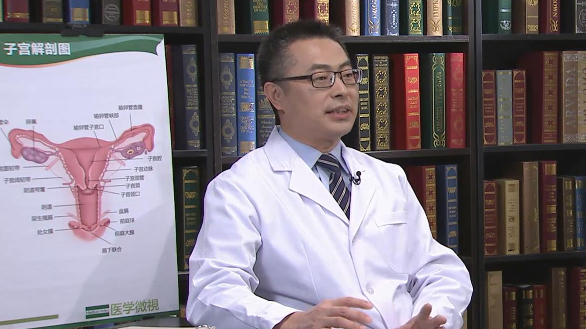

宫颈癌前病变的治疗
==================

王建东 主任医师
---------------

   1678366463119

首都医科大学附属北京妇产医院副院长 主任医师 硕士生导师；

中国妇幼保健协会青年工作委员会主任委员；中国妇幼保健协会妇女病防治专业委员会副主任委员；中国医院协会妇产医院管理分会秘书长常委；中国优生协会阴道镜与宫颈病理分会（CSCCP）常委;中国医促会妇产科分会常委；中华健康管理杂志编委;实用妇科与产科杂志编委。

**主要成就：**
主持及参加国家级和省市级科研课题10余项，发表学术论文50余篇。

**专业特长：**
从事妇科肿瘤诊治工作20余年，掌握妇科恶性肿瘤的手术、化疗、和放疗方法。擅长宫颈癌的早期诊断和治疗。
