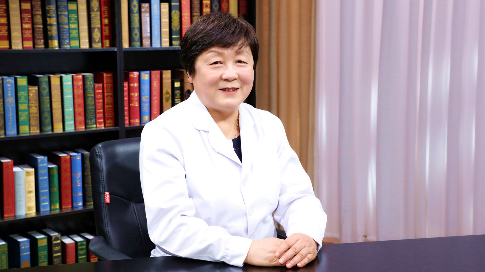

# 1.41 宫颈炎//廖秦平教授

---

## 廖秦平 主任医师

清华大学附属北京清华长庚医院妇儿部部长兼妇产科主任 主任医师 医学博士后 博士生导师；

中国医师协会妇产科医师分会副会长；中华医学会妇产科学分会感染疾病协作组组长；妇幼健康研究会生殖道感染专业委员会主任委员；中国医疗保健国际交流促进会生殖感染与微生态分会主任委员；北京女医师协会妇产科专业委员会主任委员；中华医学会妇科肿瘤学分会委员；中华预防医学会微生态学分会常委兼妇产科学组组长；《中国实用妇科与产科杂志》 常务编委；《实用妇产科杂志》常务编委；《中国微创外科杂志》 编委。

**主要成就：** 曾获北京市科学技术三等奖、教育部科技进步奖二等奖、全国妇幼健康科学技术奖科技成果奖二等奖，以及第五届“妇产科好医生·林巧稚杯”、德艺双馨“人民好医生”等荣誉，享受国务院政府特殊津贴；主持承担国家自然基金、科技部重大专项、卫生部行业基金重点项目等科研项目20余项；拥有国家发明专利4项；目前已指导毕业博士生80余名、硕士生多名、博士后出站人员3名，并指导多名研修生；近年来共发表SCI文章30余篇，中文文章300余篇。

**专业特长：** 擅长各种良恶性肿瘤诊治，牵头制定多项妇产科感染性疾病诊治指南。三十七来一直从事妇产科临床、教学及科研工作，在长期的临床工作中掌握了扎实的妇产科临床理论基础知识并且积累了丰富的临床经验。

---

## 肚子疼、下腹坠胀，会是宫颈炎吗？

（采访）首先请您给我们介绍一下，宫颈炎是怎么回事？

要知道宫颈炎，首先你了解一下我们女性的盆腔的解剖。这是子宫，子宫下面这一部分叫宫颈。宫颈是下生殖道和上生殖道中间必走的一个咽喉要道。如果宫颈发生炎症，它会把下生殖道好多不好的致病菌可以带到盆腔里，造成比较严重的盆腔感染。

宫颈炎一般来讲我们很重视的是急性的宫颈炎。急性宫颈炎的症状比如说肚子疼，下腹坠、胀，甚至有的时候还会有一些小便的各种不适、疼痛，会造成泌尿系的感染。

另外最有特点的是流出脓性的分泌物。阴道有脓性分泌物的时候，我们一般来讲就主张病人赶快到医院去检查。

这时候妇产科大夫打开窥阴器一看，炎症的时候，宫颈就会水肿，发红，大量的脓性分泌物就会在阴道里聚集。

我们知道白带，为什么叫白带，一般来讲是无色的，或者是淡淡的白颜色，没有味，或者有点微微的酸味，因为阴道是个偏酸的环境，它的pH值在3.8-4.5之间。

一到了急性宫颈炎的时候，这个时候局部都是黄色，甚至绿色的，各种各样颜色的脓性的，稀脓的，有的是稠的这种白带。

以往我们还有一些慢性宫颈炎的概念，慢性宫颈炎像宫颈息肉，宫颈糜烂，另外还有宫颈纳囊等等这些。但是近些年来，教科书发生了很大的变化，因为慢性宫颈炎的这种概念现在慢慢在淡化。

比如说宫颈糜烂，宫颈糜烂其实在国外已经很多年都没有，取消了这样一个诊断了。我们国家近些年来教科书上也彻底把它消除掉了。因为这种所谓的宫颈糜烂，它不是一个真性的糜烂，它是个假的，我们叫假糜烂。看起来红红的，上面一层像是充血的，像是糜烂，实际上它被覆有一层柱状上皮，柱状上皮比较薄，所以柱状上皮下面那层血管能看得很清楚，所以看着红红的像糜烂。

柱状上皮受体内雌激素的影响。比如说像老年人，她常常雌激素很少，宫颈管的柱状上皮就缩回去了。

年轻人的话，尤其是怀孕期间，她的柱状上皮可以向外移，所以现在大家看到已经不再有宫颈糜烂的概念，而改成宫颈的柱状上皮外移，所以我们这些概念慢慢都要知道了。

宫颈息肉当然肯定是一个炎症，大部分是炎症造成的，诊断宫颈息肉就完了，还有纳囊，就诊断纳氏腺囊肿（又名纳博特囊肿）。

（采访）所以宫颈其实就是阴道到子宫中间的这一小块的地方？

对。

（采访）相当于它是一个关卡在这，如果一旦宫颈发生了炎症，一些有毒的病菌，就有可能通过阴道进入到我们子宫里面，然后发生更严重的后果？

对。所以宫颈是很重要的一个保护女性不感染的重要器官。

阴道里面的分泌物正常的时候是酸性的，所以有喜欢酸的细菌在里面可以生长，但是宫颈这里面有一个黏液栓，像个塞子一样把宫颈塞住了。

所以女性的盆腔我们老说从物理上来讲，它跟外界是相通的，阴道、宫颈，子宫，输卵管，然后就进了盆腔了，物理上是通的。但实际上，它平时都属于一道道关口的闭合状态。

比如黏液栓就有阻拦的作用，它是个碱性的。现在还没有一种致病菌又嗜酸又嗜碱，但是我们人的话就是底下阴道环境是酸性的，宫颈环境是碱性的，就是你喜欢酸的，到了碱性环境你活不了。所以黏液栓作为宫颈的一个防卫机制也是很重要的。

---

## 宫颈炎和免疫力低有关系吗？

（采访）造成宫颈炎的原因都有哪些？

一般来讲造成炎症有三个机制，一个是致病微生物，如果这个菌，这个微生物它的致病性很强，很容易造成炎症。

第二是致病微生物在这个区域它的数量够不够多。也就是说这个区域里面好人多，进来一个、两个的菌没关系，它不会致病。尤其是致病性不是很强的，我们所谓叫条件致病菌，像这种它毒力很弱，它不太容易致病。

第三个因素就是人的这种免疫力，我们叫抵抗力，她的这些细胞免疫、体液免疫等等这些足不足够强大，如果足够强大，这两个任你怎么样，我给你吃掉。

这三个因素是互为因果的。如果细菌毒力很强，那它很容易致病，进来很少，敌人很少，但是它的致病性很强，也容易得病。还有这个菌虽然它毒力不强，但是它数量很多，坏人太多了，也会兴风作浪，闹事。再有就是人的抵抗力太弱，这个时候不管进来什么都容易得病。

就像有的人会说，别人不感冒，我特别容易感冒，一屋子十个人，可能有一个感冒的，大概也就两三个可能感冒，为什么？他抵抗力不行，所以这三个因素互为因果。

---

## 增加宫颈炎风险的常见行为有什么？

（采访）平时有没有什么自己的行为导致了可能说我们得了宫颈炎？

其实一个人要是有很健康的生活的话，注意卫生，保持健康的体魄，一般来讲不会得这些炎症的。

常常是由于我们在生活当中不太注意卫生，因为我们讲的是性器官，最直接的就是你与有性传播感染的人一起性交，他会把他体内的致病微生物传染到你的体内，这时候你就容易得病了。

2008年的时候，我们当时在全国做过一个流行病学调查，当时我们想看整个的盆腔炎症的情况，我们做了一下全国大概有49家医院，一共好几百人的这样一个检查。

多中心的一个研究发现，从宫颈取样以后的话，因为它也代表着上生殖道的分泌物情况，大概得有1/3是由于淋菌和衣原体感染造成的，这就是一个典型的性传播疾病。

还有淋菌，大家都觉得好像淋病很少见了，但实际上淋病潜伏的这种状态还是很多的。淋病在男性常常症状很严重，比如说尿疼或者是阴茎的肿胀等等这些，流脓。

但是对女性来讲的话，比较轻的时候，她不会有这些表现，所以有的女性经常都不知道，偶然检查的时候才发现她还带有淋菌。

宫颈的黏液栓是很重要的一个防卫机制，阴道里面的分泌物正常的时候是酸性的，所以有喜欢酸的细菌在里面可以生长，但是宫颈这里面有一个黏液栓，像个塞子一样把宫颈塞住了。

所以女性的盆腔从物理上来讲它跟外界是相通的，阴道-宫颈-子宫-输卵管，然后就进了盆腔了，物理上是通的。但实际上，它平时都属于一道道关口的闭合状态，比如黏液栓就有阻拦的作用，它是个碱性的。大家不要随便地把它破坏掉。

但是有的时候不得已，比如说我们在医院里面要做手术的时候，比如说要刮宫，要上环、取环、做宫腔镜等等这些操作的时候，一定会消毒等等，操作的过程当中要穿过宫颈去进行宫腔操作，这个时候如果我们消毒不太好，也会造成宫颈的炎症，甚至上生殖道的炎症。

---

## 急性宫颈炎会有什么症状表现？自己治行吗？

（采访）我们得了宫颈炎之后都会有哪些症状表现？

急性宫颈炎的时候，她会有一些脓性的白带，病人会有下腹的坠胀，疼痛等等，甚至有的时候还会有一些小便的各种不适，疼痛，会造成泌尿系的感染。这些症状出现的时候，其实应该赶快到医院去就诊了。

现在有一些病人自己治，个别的自己上点药会好了，碰对了。大部分都是治治，治不好，又跑到医院来，有时候把急性期治疗错过去了，迁延不愈，造成了长时间的痛苦，也不好治了。

而且瞎用药，用到后来，最后对好多药都耐药了，所以也治不好。所以还是想办法，发现了不舒服的，应该到医院去看看大夫，让大夫帮助你去治疗。

---

## 诊断宫颈炎，需要做什么检查？

（采访）我们到了医院要想诊断是宫颈炎的话，都需要做哪些检查呢？

到医院去大夫首先会给你做盆腔检查，打开窥阴器的时候一看，就会看到什么？正常宫颈是个圆的，中间是个口，这个是宫颈口，我们就会看到宫颈口周围都红红的，水肿，还有从宫颈口往外溢脓性的这种分泌物，这个时候一看我们知道她就是宫颈的炎症。

当然有的时候比如阴道炎，就底下的这部分，阴道炎症的时候，大家看它很近，阴道有炎症的时候，在宫颈的阴道部它距离很近，它会受到感染，受到侵犯，所以也会造成宫颈的一些炎症。所以下生殖道的感染，阴道和宫颈是互相通的。

我们刚才讲到宫颈炎的病人到医院以后，首先医生会打开窥阴器看，看宫颈有没有水肿、充血、有没有脓性分泌物。同时也要看阴道里的白带，是不是也有这样的一个改变。

一般在炎症诊断方面，医生会取一部分的阴道或者宫颈分泌物，看诊断什么？用下生殖道的分泌物做抹片。

然后我们会看里面有些什么微生物存在，比如说里头有些要都是很好很大的乳酸杆菌，那么她基本是正常的。有的人会有滴虫，有的还会有白色念珠菌的菌丝出现，就会诊断她的炎症。

其实现在还有大家很重视的宫颈的取样，要注意HPV的感染，就是人乳头瘤病毒的感染。因为这个人乳头瘤病毒的话，常常它的高危型的持续感染，会造成宫颈的癌前病变，或者是宫颈癌的发生。

（采访）我们怀疑宫颈炎的患者，她在做检查之前都需要注意一些什么事情？

一般来讲到医院来检查的时候，最好在头一天，起码24-48h不要同房。还有不要用药，因为这些都会干扰你的检查结果。还有就是上病床以前排尿，这样便于盆腔检查能够更准确一些。

---

## 宫颈炎患者需要做TCT检查吗？

（采访）宫颈炎需不需要做TCT检查（宫颈液基细胞学检查）？

宫颈炎一般来讲，TCT检查不是必备的。什么情况下应该做TCT？按规则来说的话，一般她要连续检查都是正常的，三年做一次就行了。

但是有的时候HPV（人乳头瘤病毒）的高危型阳性，尤其是HPV16和HPV18型的阳性，我们有时候连宫颈液基细胞学检查（TCT）都不做，直接做阴道镜了。

但是有的时候其他类型的HPV阳性，我们用宫颈液基细胞学检查（TCT）也可以做一下分流，这个时候要做。

再有就是你知道她已经是HPV感染了，我们要追踪的时候，你要做TCT。就是你筛查或者追踪，我们一般都用它，要做TCT的。

（采访）TCT主要是作为一个癌前筛查来用的，但是并不是说所有的宫颈炎患者就一定要做TCT？

不是，不是这样的，它主要是筛查宫颈癌和癌前病变的一种手段。

（采访）您能简单跟我们说一说TCT是怎么做的吗？

一般来讲，你要是没有做过防癌的这种筛查，病人上床以后，大夫打开窥阴器，用一个小刷子，这刷子前头是突出的，两边是这样一个形状。

刷子在她的宫颈口连转5-10圈，然后放在一个细胞保存液的小瓶子里面，上机器，然后制片，做出来以后就看它的细胞有没有变化。这就是TCT的一个取样，制片，然后出报告的过程。

---

## 宫颈炎患者什么情况下需要做阴道镜检查？

（采访）宫颈炎患者需不需要做阴道镜检查？

宫颈炎的病人一般来讲，不是因为宫颈炎来做阴道镜检查，常常是因为在细胞学检查（TCT）或者HPV（人乳头瘤病毒）检查当中出现问题了。那么要做阴道镜检查是干什么？

阴道镜是个放大镜，在这个放大镜下就会看到这个病人她宫颈上的上皮细胞，有没有什么异常的地方。

还有就是看看血管有没有异常的地方，像这种情况下，我们在异常的地方取活体组织，做病理，来判断她是炎症，还是癌前病变，还是已经到了浸润癌。阴道镜主要是为了这个，它是帮助我们进行进一步诊断的一个工具。

（采访）宫颈炎的患者，她做了那些HPV或者是分泌物的检查之后，发现有问题了，可能会进一步地做一个阴道镜检查？

对。

---

## 确诊宫颈炎后，患者的性伴需要做检查吗？

（采访）如果女性患有宫颈炎的话，她的丈夫或性伴侣需不需要也去做一个检查？

普通的宫颈炎，一般细菌感染都不需要性伴检查。

但是一旦要是诊断她是一个性传播感染的宫颈的炎症，比如说淋菌，那就说明她的性伴起码是个淋菌的携带者，她传染上了，那么这个时候她已经发病的话，她的性伴应该去检查。

还有一个就是衣原体。衣原体也是个传染性很强的性传播疾病，很多女性衣原体感染以后，她自己不知道，因为会有一个慢性的过程。她的疾病会迁延到上生殖道，衣原体感染也会顺着子宫一直到输卵管，造成输卵管的狭窄和闭塞，都是衣原体起了很大的作用。

一个是淋菌，一个是衣原体，还有一个是支原体。我们近几年来特别关注的是支原体中的生殖支原体。生殖支原体对于输卵管上生殖道的破坏力也是很强，跟衣原体一样。

所以在这几种性传播感染的时候，她的丈夫或性伴侣起码应该同时治疗或者检查。

## 诊断宫颈是否感染衣原体、支原体或淋球菌，可以做什么检查？

（采访）女性做了什么检查，我们能知道是不是这些衣原体、支原体或者淋菌感染？

淋菌感染一般来讲的话，它经过革兰染色在显微镜下能看到，在白细胞内会有6对以上的革兰氏阳性的双球菌在里面。这时候的话我们就能够诊断。当然涂片的话，没有培养它的阳性率高，最准确是要做菌的培养。

但是衣原体我们以前一直都用的是抗原抗体的方法，这种方法它阳性率不那么高，所以近年来的话仪器都出来了，现在大部分都是用分子生物学的这种核酸检测的方法，有的地方是用DNA，有的地方更好的是用RNA来检测。

还有生殖支原体也一样，它也是核酸的方法最好，以往都没有办法查它，因为它是支原体里最小的一个微生物，但是在分子生物学的这种检测方法下，它跑不掉。

衣原体和支原体的两个治疗的药物和方法基本都是一样的。淋菌治疗的话是另外的，有专门覆盖淋菌的一些药物。

（采访）我们怀疑宫颈炎的患者，她在做检查之前都需要注意一些什么事情？

一般来讲到医院来检查的时候，最好在头一天，起码24-48h不要同房。还有不要用药，因为这些都会干扰你的检查结果。

还有就是上病床以前你排尿，这样便于盆腔检查能够更准确一些。

## 宫颈炎和宫颈癌、癌前病变有什么区别？

（采访）对于宫颈炎、宫颈癌以及宫颈癌前病变，这三个我们要怎么样去区分？

宫颈炎的话，一般来讲它是一个炎性的反应，如果宫颈发生炎症，它会把下生殖道好多不好的致病菌可以带到盆腔里，造成比较严重的盆腔的感染。

所以宫颈炎的话一般来讲我们很重视的是急性宫颈炎。急性宫颈炎的症状比如说肚子疼，下腹坠、胀。

另外最有特点的是流出脓性的分泌物。

另外宫颈有发红，有肿胀，有些病人还会跟你主诉，她会有尿痛，而且还有性交痛等等，这都有可能。

另外你检查的时候没有特意的一些其他的东西，比如像你要是癌前病变和宫颈癌常常都伴有一些HPV（人乳头瘤病毒）的感染。宫颈炎常常没有。

当然有些宫颈炎很厉害的时候，特别像像宫颈癌，我们接过几个从外地转过来的，一看烂糟糟的，我们搞了这么多年肿瘤，一看，第一感觉这人是个宫颈癌，但是查起来就觉得不太像在哪，宫颈癌是硬的，它是软的，而且充血特别明显。

所以第一个要是考虑是宫颈炎，首先要排除是癌前病变和宫颈癌的问题。要是想知道有没有癌前病变和宫颈癌，其实最简单的就是细胞学（TCT）和HPV（人乳头瘤病毒）的检测。

因为HPV的敏感性特别好，细胞学的就是TCT的特异性好，这两个加在一起来检查应该是最好的。就能除外她到底是宫颈癌还是癌前病变，这些都能筛出来。

（采访）宫颈癌和癌前病变是肯定有HPV的感染？

百分之八九十。

（采访）但是宫颈炎不一定有？

宫颈炎也可以有，但是它没有细胞学、组织学的变化。其实HPV感染也是宫颈炎的一种，病毒感染的一种。

（采访）宫颈炎会不会发展成宫颈癌？

如果单纯的HPV感染，常常它会有很长一段时间，病毒就在那潜伏着，它不致病，不至于造成你的癌前病变和宫颈癌的发生。

但是HPV感染以后，如果再伴有阴道和宫颈炎症的时候，使得它局部的免疫力发生了变化，抵抗力下降了，这个时候就会促进它HPV感染的病毒活力增强。

因为这个人乳头瘤病毒的话，常常它的高危型的持续感染会造成宫颈的癌前病变，或者是宫颈癌的发生。

以往的宫颈癌，我们国家在六七十年代、七八十年代那时候宫颈癌的高危因素，大家都会讲到炎症，多产、多育，另外还有卫生条件不好等等这些。这些其实是跟感染都是有关系的。

---

## 宫颈炎怎么治疗？

（采访）宫颈炎要怎么去治疗？

宫颈炎的治疗，应该说是对因治疗，你得弄清楚到底是什么感染，是细菌感染，还是病毒感染，还是衣原体和支原体的非特异性感染，还是淋菌等等这些性传播感染，到底是哪种感染搞清楚以后，就会有不同的药。

一般的比如说细菌感染，我们有需氧菌，有厌氧菌，你治疗起来的话：需氧菌的话，你肯定得用覆盖需氧菌的这种抗菌素，比如头孢类、阿奇类、喹诺酮类的，可以用这些来进行治疗。

但是厌氧菌的话你应该用甲硝唑这一类的药物治疗，这是细菌。

但是如果要是滴虫，那你肯定得按滴虫来治疗了，滴虫是个全身性的感染。所以最好是口服，全身用药比较好。

如果要是病毒，到现在为止，应该说没有特效的对于病毒治疗很好的药物，但是也有一些辅助增强局部免疫力的这样的药物和一些中药来对她进行治疗。

还有性传播感染就得积极地用抗性传播感染的这种抗菌药物来进行治疗了。

淋病的话有很多，你看她的严重程度，如果很厉害的话，我们可以用静脉点滴的方式，如果要是一般的就是一个淋菌感染，我们用口服药，比如我们临床用的比较多的就是口服的阿奇霉素一类的，还有四代喹诺酮。

（采访）沙眼衣原体感染的宫颈炎，我们一般是怎么治疗？

沙眼衣原体也是个性传播感染，我们一般也是用阿奇霉素类的就行了。沙眼衣原体、生殖支原体都是用这样的方法。

（采访）霉菌感染的宫颈炎，我们怎么去治疗？

实际上我们现在不叫霉菌感染，我们叫做念珠菌感染，就是白色念珠菌。在我们国家，女性的这种所谓叫做霉菌性阴道炎占到80%-90%，抗念珠菌的药物有口服的，有大剂量，有中剂量，有小剂量的都可以用。

白色念珠菌感染它有评分的，一共是15分，如果你是轻中度的，偶发的，一个疗程就够了，甚至一片药就能解决问题。

但如果是比较重的，应该用两个疗程的药物，很多人反复发作，反复发作你要找找原因，因为现在药物滥用的太多了，好多病人觉得不舒服了，就跑到药店里去买一片药。

人家也没查，也不知道你是什么感染，但是推荐你这个好用，这个用完就不痒了。结果她就买这个，她老用这个最后就耐药了，你真得病的时候就没用了。

所以我们还是让病人痒了以后直接到医院去，通过医院的检查化验，能看到真是念珠菌病，看到它的菌丝，芽生孢子，你就能诊断，然后用相应的药物来治疗。

（采访）宫颈炎除了药物治疗还有别的治疗方式吗？需要动手术吗？

不需要。很少为了宫颈炎来做手术的。

当然极少见的情况就是宫颈有的时候由于不断感染，它的纤维组织增生，变得又大又硬，除外了有癌前病变和癌以外，它的形状发生很大变化以后，宫颈口老是张着的状态，这时候我们可能要相当于把它中间增生的部分给去掉。

除此以外，一般炎症你只要消炎就好了，不需要再做特殊的手术。

---

## 宫颈假性糜烂、纳氏腺囊肿需要治疗吗？

宫颈糜烂以前把它列在宫颈慢性炎症里面，我们国家近些年来教科书上也彻底地把它消除掉了。

因为这种所谓的宫颈糜烂，它不是一个真性的糜烂，它是个假的，我们叫假糜烂，看起来红红的，上面一层像是充血的，像是糜烂，实际上它被覆有一层柱状上皮，年轻的时候，她激素水平很旺盛，这时候宫颈里面的柱状上皮就向外翻。

向外翻你看起来像是糜烂的，实际上它是有一层柱状上皮在包裹的，这些人什么症状都没有，但看起来好像是有点轻度或者甚至中度糜烂，都没有什么问题，像这种不需要治疗。

另外还有以前我们讲的纳氏腺囊肿，纳氏腺囊肿是怎么形成的？就是宫颈上有很多的纳氏腺，这些小小的腺体在性交的时候，它会分泌一些黏液出来，来起到一个润滑作用。

在各种炎症的情况下，它可能一时把腺管的口给堵上了。堵上以后，腺体里面的黏液分泌不出来，就形成一个小小的囊肿，很小，零点几公分，一公分就很大了。随着她年龄的增加，慢慢绝经以后自然就吸收了。

我们好多地方不太规范，说你这有囊肿了，所以就给刺破了，然后也没有什么太特殊的治疗，刺破了不是囊就没了吗？但是实际上增加了感染的机会。

因为阴道里面是菌非常多的一个环境。它本身是完整的，是一个有屏障的，你把这个屏障打破了，它就容易感染了。

---

## 宫颈炎治疗期间能同房吗？治疗后多久复查一次？

（采访）宫颈炎患者在治疗期间以及治疗之后都有哪些注意的事情？

宫颈炎在治疗期间我们一般都嘱咐病人不要同房。这段时间的话，因为同房的话加重了它的感染，刺激它，如果是性传播感染的话，还容易传染给她的性伴。这是治疗期间。

治疗之后的话，一定是要回来复查一下，看好了没有，尤其是性传播感染的，一定要把她性伴叫到医院去进行检查，或者是同时进行治疗。

（采访）我们怎么看宫颈炎到底好了没有，是症状消失了就好了吗？

对，症状消失，病人会有这种感觉，一个是症状消失，白带明显好了，没有味儿，性状好了。

再有一个，病人明显的这种坠、胀、痛的感觉消失了。

（采访）宫颈炎治疗之后一般多久复查一次？

一般我们是一个疗程。宫颈和阴道炎症的一个疗程大约都是7-10天。

治完了以后的话，我们一般嘱咐病人，来一次月经，干净了以后回来复查。这样的话一个是疗程结束，再就是一个月经周期后看看她有没有复发等等这些。

（采访）我们回来复查的时候，一般都做哪些检查？

盆腔检查，打开窥阴器，然后检查她的分泌物。看宫颈有没有水肿、充血、有没有脓性分泌物。

同时也要看阴道里的白带，我们知道白带一般来讲是无色的，或者是淡淡的白颜色，没有味，或者有点微微的酸味，因为阴道是个偏酸的环境，它的pH值在3.8-4.5之间。

一到了急性宫颈炎的时候，这个时候局部都是黄色，甚至绿色的，各种各样颜色的脓性的，有稀脓的，有的是稠的这种白带。

---

## 宫颈炎影响怀孕吗？

（采访）宫颈炎会影响怀孕吗？

会的。如果宫颈在急性炎症的时候，我们会告诉病人这时候争取避孕。为什么？

第一个，宫颈炎的时候本身你很难受，这个时候白带都是脓性的，你同房就不舒服，所以这时候要避免。

第二个就是炎症的时候你同房，即使你怀孕了，由于底下的致病微生物也很多，而且很强，要不怎么会得宫颈炎，这时候也容易造成早期的流产。

再有的话就是宫颈炎的时候病人也不太容易怀孕，为什么？

因为在炎症的时候，体内还有大量的炎性细胞，这些炎细胞会对精子有影响，它会杀精子的。所以急性炎症的时候，我们一般不太主张这时候去怀孕。

---
