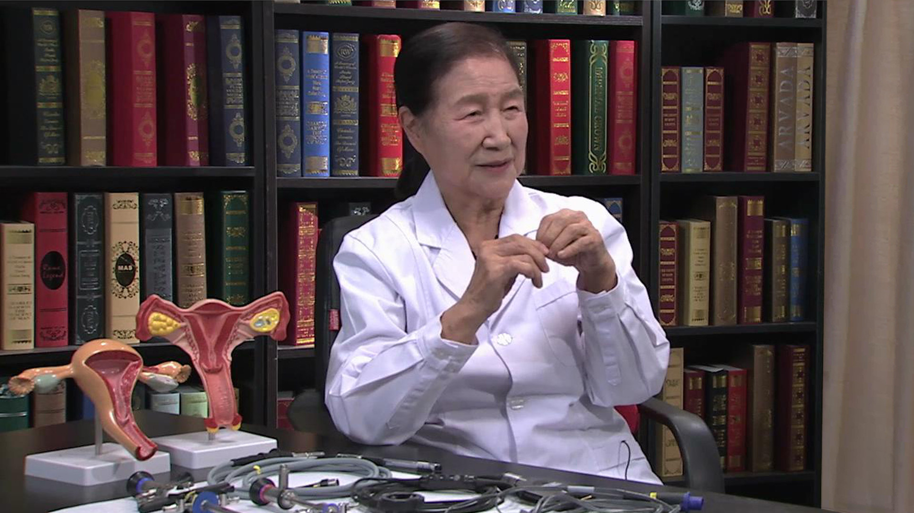

宫腔镜
======

夏恩兰 主任医师
---------------

   1678366732888

首都医科大学附属复兴医院宫腔镜中心主任；

首都医科大学妇产科教授
硕士研究生导师；国家卫生部四级妇科内镜技术培训基地主任；国际宫腔镜培训中心亚洲分中心主任；亚太地区妇科内镜学会(APAGE)理事；《中国内镜杂志》编委。

**主要兼职**\ 国际生殖与输卵管手术学会理事；国际妇产科学杂志副主编；Gynecological
Endoscopy 编委；Gynecology and Minimally Invasive Therapy 编委。

**主要成就及论文编著**\ 主持临床科研获各级科技进步奖30项，《宫腔镜的临床应用与基础研究》获2004年国家科技进步二等奖；发表论著249篇，主编妇科内镜参考书4部，主译五部。

**专业特长**\ 作为妇产科资深专家和我国宫腔镜诊治医学的奠基人与开拓者，熟练掌握本专业常见病、多发病诊治新进展。宫腔镜和腹腔镜诊治技术极为娴熟，宫腔镜电切术达国际先进水平。畸形子宫矫形术和极简式腹腔镜宫颈环扎术享誉国内外。
