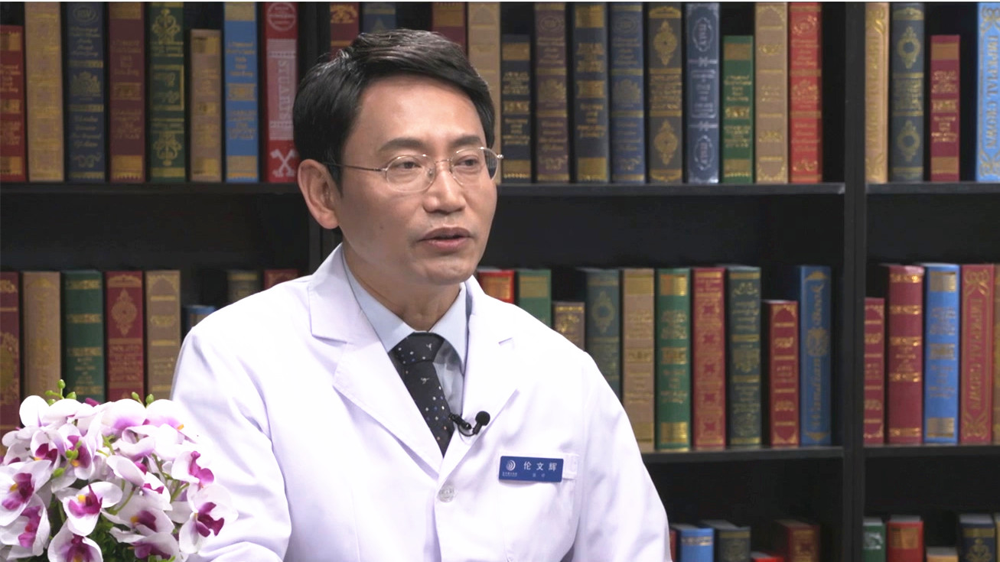

HPV疫苗
=======

伦文辉 主任医师
---------------

   1678366869545

首都医科大学附属北京地坛医院（国家感染病临床中心）皮肤性病科主任
主任医师 教授 博士生导师；

首都医科大学和北京大学医学部研究生导师；中华医学会热带病与寄生虫学分会皮肤病性病学组副组长；中华预防医学会生殖健康分会委员会委员；中国医疗保健国际交流促进会皮肤分会委员；中国中药协会皮肤病药物研究专业委员会常务委员；中国性病艾滋病防治协会学术委员会委员；中国性学会理事。

**主要成就：**
带领团队一直致力于皮肤病、性传播疾病以及皮肤美容的临床和科研工作，先后在日本国立感染症研究所和英国牛津大学做博士后研究和访问学者；获得教育部留学回国人员科研启动基金、国家“十一五”
“十二五”重大科技攻关项目资助；共同主持《生殖道沙眼衣原体感染诊断》国家诊断标准的制定。

**专业特长：**
擅长HPV感染相关寻常疣、扁平疣、尖锐湿疣，以及女性宫颈HPV持续感染，梅毒及神经梅毒，痤疮和玫瑰痤疮，泌尿生殖道感染，各种面部色斑、毛细血管扩张及痤疮瘢痕的激光治疗，肉毒素及玻尿酸的注射治疗等。
