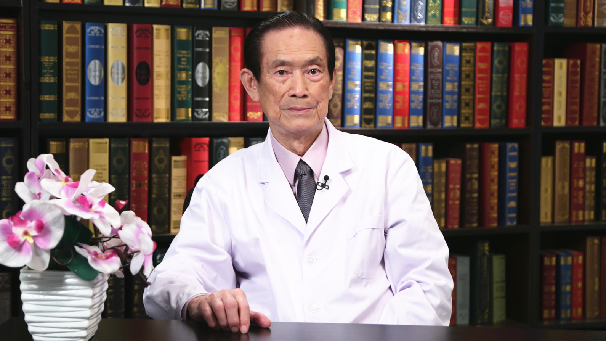

# 1.46 浆细胞性乳腺炎

---

## 黄汉源 主任医师

原北京协和医院乳腺外科专家 主任医师；享受国务院特殊津贴；北京乳腺防治学会专家顾问委员会委员。

**主要成就：** 完成过上万例乳腺癌手术，正确诊断率达到98%，曾在50分钟之内完成乳腺癌根治手术；1986年，在澳大利亚西澳大学医学院进修，获“荣誉研究员”称号；1993年起，因在乳腺外科的杰出成就，开始享受“国务院特殊津贴”；2016年，荣获“北京协和医院杰出贡献奖”。

**专业特长：** 特别擅长乳腺癌、浆细胞性乳腺炎、肉芽肿性乳腺炎、乳腺导管瘘、各种乳腺疑难杂症的诊断与治疗。

---

## 浆细胞性乳腺炎是怎么回事儿？

（采访）我们知道浆细胞性乳腺炎又被称为不死的癌症，虽然它是一个良性疾病，但对它的治疗难度并不亚于乳腺癌，您能给我们具体的讲讲浆细胞性乳腺炎到底是怎么回事吗？

所谓浆细胞性乳腺炎指的是非哺乳期的妇女所得的乳腺慢性炎症，它本身发病率不是很高，大概是占门诊乳腺病病例不到4%，比例不高，但是对于中国来说，咱们人口基数很大，妇女那么多，所以还是算很常见的一个病。但是从总体来说，它发病率不是很高。

另外一个就是说这个病发生大多数是青壮年妇女，老人基本没有。

（采访）您刚才所说浆细胞性乳腺炎，它是乳腺疾病中比较常见的一种，但是发病率并不是很高，好发年龄一般都是在一般青壮年？

一般青壮年多，二十几岁，在45岁以下，45岁以上很少见。

（采访）浆细胞性乳腺炎分为哪几种类型？

浆细胞性乳腺炎这个名词是个老名词，一九二几年的时候，一个外国人他发现这种慢性炎症，因为它有浆细胞的浸润，所以把它称为浆细胞性乳腺炎。现在这个名词用的少了，在国内的一些文献，一些文章还继续引用浆细胞性乳腺炎这个名字。

它实际上涵盖三种疾病，一个就是大导管周围炎，一个是导管扩张症，一个是特发性肉芽肿乳腺炎，包括这三种病。但实际上导管扩张症和特发性肉芽肿是类似的一个病。但是大导管周围炎应该是另外一种病，它大多数以导管瘘的形式出现。

（采访）在上个世纪，20世纪20年代才第一次发现浆细胞性乳腺炎？

对。

（采访）我们现在称的浆细胞性乳腺炎，它一般多指哪一个类型的？

咱们现在临床所见的实际上属于第三种，就是肉芽肿性乳腺炎。

---

## 浆细胞性乳腺炎有哪些特点？

（采访）浆细胞性乳腺炎，它在临床上有哪些特点？

这个病一个特点就是它起病经常很急，看不到特殊的一些因素发病，它一旦发病的话，它以什么为表现？乳腺出现包块，乳腺出现一个肿块，它可以在一晚上突然发现一个包块。

当然有些外因有时候比较明显，就是说乳腺碰撞、压迫，有时候小孩踢了一脚，撞了一下，完了第二天起个包。一般临床起初表现就是一个包块。但是一旦发展下去以后，接着病变扩散，炎症越来越厉害，甚至发生溃破、烂掉，表面的溃烂可以发展到这样的程度。

所以从局部外形来看，这个病很可怕的。最严重就是脓肿破了，而且是这样，此起彼落，就这个地方脓肿好转，旁边又鼓了起来，反复到处出现，开始症状不多，因为它跟一般炎症不一样，它不发烧，也不太痛，所以有些人不太注意，一忽视，一拖下去，病情就发展。

（采访）从包块到发展成情况比较严重，比如说出现破损，这个阶段一般需要多久？

一般一两个月内就可以发展的很严重。

（采访）一般是一侧乳房得浆细胞性乳腺炎，还是双侧都可能会得？

双侧同时出现很少，但是一侧治好以后对侧又长了，不少见。

（采访）如果说一侧已经被确诊是浆细胞性乳腺炎了，我们再对她另一侧会不会有一些预防的办法？

预防到现在还谈不上。

（采访）只能是她出现了去治疗？

是，去治疗。

（采访）浆细胞性乳腺炎会不会慢慢发展成乳腺癌？如果情况越来越恶劣的话？

不会。

（采访）是两个完全不一样的疾病？

对，两个完全不一样的病，但是浆细胞性乳腺炎带给人身心的痛苦是非常严重，它不威胁生命，但是病情的迁延和一些症状的出现，给人带来痛苦大了。它破了，流脓淌水，好多病人来一身脏，一身都没有一块干净的地方。

（采访）哪怕不治疗浆细胞性乳腺炎，它都破了，但是它也不会致死？

不会死，不会要人命。

（采访）就是严重影响患者的生活质量？

是。

---

## 引起浆细胞性乳腺炎的因素有哪些？

（采访）现在有没有明确的病因导致浆细胞性乳腺炎？

浆细胞性乳腺炎在全世界大家都在关注这个病，各国的学者都提了这个问题，外国很多文献里面提到，它说跟抽烟可能有关，跟酗酒可能有关，但是中国的国情，我们见过大量病例来看，实际上中国妇女很少抽烟，所以我觉得抽烟不是很重要。

但是最近几年大多数学者比较同意的看法，它是一种自身免疫性疾病，她经常同时乳腺有疾病，同时下肢两个腿上出现红斑，叫结节红斑，出现很多硬疙瘩，同时腿疼，所以大家认为比较统一的看法是自身免疫性疾病。

（采访）您从医这么多年，也接触了大量的患者，在这么多的患者当中，她们有没有一些共性的地方？

这个病比较容易发生在边远的地区，相对经济条件差的环境下更多一些，像北京市这种大城市，上海市这种大城市发病率相对少一点，但是也不尽然，就是说咱们所来的病例，比如我们在北京现在所见的病例，内蒙来的多，山西来的多，还有甘肃这些地方偏多一些。

所以这里面到底怎么样，最主要的因素大家认为还是免疫性疾病，但是跟经济环境可能有关系，为什么大城市少，可能卫生条件也有一定的影响。

---

## 确诊浆细胞性乳腺炎需要做哪些检查？

（采访）如果说我们要想确诊是浆细胞性乳腺炎，需要做哪些检查？

浆细胞性乳腺炎这个病在诊断上并不是很困难，比较有经验的医生靠手基本大多数就能诊断。好多基层医生做了很多检查，像钼靶、彩超，甚至核磁共振都用上，但实际上我的病人找我来看，我觉得80%靠手就管用了。另外靠视觉来看，它局部有特殊的特点。

（采访）如果说想要百分之百的确诊，需不需要做活检，做穿刺？

现在真正需要做活检的是那类只有包块，没有形成明显炎症表现，有硬块但是没有红，没有肿，这样的话有时候个别需要穿刺，做病理。大多数在B超底下看到它除了一个包块以外，里面有很多窦道，像老鼠洞一样，另外有很多小脓肿，所以一般大多数靠B超，或者是做钼靶像基本可以确定。

---

## 浆细胞性乳腺炎和乳腺癌有什么不同？

（采访）浆细胞性乳腺炎，它被误诊的情况是不是不是很高？

现在浆细胞性乳腺炎容易误诊，需要进行鉴别的只有一个病，就是乳腺癌。因为乳腺癌是个包块，浆细胞性乳腺炎也是个包块，早期的浆细胞性乳腺炎只有包块，B超没看到明显的窦道，没有看到脓肿，在这种情况下容易跟乳腺癌混淆。

（采访）那我们怎么鉴别？

就是靠这些图像，医疗上的影像的分析，影像分析很有意思，比如这个人是癌症，但是跟浆细胞性乳腺炎差不多，是一个包块，但是比如做一个核磁共振，浆细胞性乳腺炎很少有大的血管引流，一个癌症的包块，同时影像看到有很多大的血管分支出来。

另外一个就是靠感觉，手摸的一些感觉。乳腺癌它有一个很大特点，它有肿块存在，它因为牵涉到韧带的侵犯，所以乳腺癌可以局部皮肤下陷，浆细胞性乳腺炎没有这个。所以临床分析就可以解决大部分的问题。

（采访）找您看病的患者中，有没有这个患者她以前是被确诊为乳腺癌，但是到您这一看发现她只是浆细胞性乳腺炎的？

有，不多。

（采访）那是什么原因导致在基层医生看的时候会把它确诊为乳腺癌？

因为乳腺癌是包块，浆细胞性乳腺炎也是个包块，光一个包块到底能定什么性，一个是靠各种检查，一个是靠经验。

（采访）如果说要想确诊是不是乳腺癌的话，它是不是也需要做一个活检穿刺，是不是应该会发现有癌细胞？

一般搞不清就做穿刺，细胞学检查。

---

## 浆细胞性乳腺炎有哪些治疗方法？

（采访）教授，现在目前对浆细胞性乳腺炎总的治疗方法是怎样的呢？

浆细胞性乳腺炎这个病，它属于一个慢性炎性的病变，在治疗上花样很多，主要有两方面，一个叫保守治疗，一个就是手术治疗。

保守治疗花样特别多，包括用药，用药里面有很多药，另外可以用中医中药，用药里面很多人因为考虑她是个慢性炎症，说是炎症，给她用抗菌素，消炎药，但是实际上这个病跟一般的炎症不一样，用消炎药取得效果非常微小，好多病人来了都几个月不断地在输液、打针，用药没效，基本没效。

（采访）为什么，不都是炎症吗？

这个属于一种无菌性炎症，没有细菌，你把烂的病灶去培养，大多数培养不出细菌来，所以一般用抗菌素可以说基本没效。

另外一个治疗就是用激素治疗，因为考虑是免疫性疾病，所以用激素治疗，激素治疗是一个很大的方面。另外一个中医方面治疗，但在各方面有治好的，但是我自己经验看到保守治疗好的，比例比较少，早期的可以，早期发现可能有些保守治疗能控制病情。

但实际上保守治疗不太容易解决问题，而且保守治疗经常治疗周期很长，可以吃半年、一年药的都有，但是有时候治疗效果很差。因为我是外科医生，到我这里来的病人都是经过保守治疗无效的病人，来找我们外科治疗。

外科治疗最传统的是治疗什么，是对炎症的治疗，乳腺炎症，你乳腺有炎症，一个脓包，一般哺乳期出现，大多数切个口，麻醉，把脓放了，换换药就长上。但是这个病，有些人这边一个切口，治了好转，旁边又起了一个包，所以此起彼落。

像这么一个病例，你看千疮百孔，它不是一个包，所以你怎么样都处理不好，经过手术切这么大范围，挖掉这么大范围。所以传统的外科技术效果差，国内的一些文献通过统计，大概传统外科治疗复发率达到30%，基本1/3都复发了，有些病人做完手术还没有出院就复发了，就是这个病很大的麻烦的特点。所以现在列为乳腺外科难题之一。

由于手术技术的发展，我自己经过多少年的治疗探索，我发现并不是它容易复发，最主要的就是说你如何把它切除干净，但就这点不容易，你切除不干净一定复发，你把它切除干净就不复发了。

但切除干净有什么问题？你看这样，我给她切除干净了，这边病变我给她切除了这么大范围，怎么缝？乳腺给它挖掉1/3，甚至挖掉一半，伤口没法处理，所以一般外科大夫都怯步，就不敢去碰它，怎么办？挖的这么大，缝不住。

所以在我手上是这样，最后我们考虑到说近年来，包括国外也考虑，给她挖了做整形，就给她做整形，我就给她做整形，这么大伤口都给修理上了。

（采访）整形跟您做手术是同时进行的吗？

同时进行。

（采访）目前我们对于治疗浆细胞性乳腺炎主要分为两大步骤，第一步骤就是保守治疗，有一些药物治疗，像激素、抗菌素，还有中医中药。还有一种就是手术治疗，但手术治疗也分为两种，第一种就是传统的开刀手术，但是它的一个劣势就是复发率高，就是这个治好了，可能旁边又出现了一个？

对，因为所谓传统，它就可以等于切一个包块下来，给它缝上，但是你一切多，缝不住了，所以有好多医生不敢做了，你给她切大了，又不会缝，所以这点必须利用整形技术来处理。

（采访）您做的手术就是能把所有的炎症、小肉肿都给切干净是吗？

切干净，我们做的都做的很大，像这个病，这种病人你看，两面整个范围这么大，整个乳腺基本一半都坏掉了，两面全给她挖光，最后给她做整形，基本保持乳腺的外形。

（采访）就跟正常的一样？

不可能完全正常，但是外形还是可以，而不是把整个乳房都摘了。

（采访）她留的疤痕大吗？

疤痕那是看每个人的体质了，有些有疤痕体质，可能疤痕大点，但你有疤痕比把乳房摘掉还是要好得很多。

---

## 手术治疗浆细胞性乳腺炎时，乳房整形是怎么做的？

我们的基本整形技术叫做腺皮瓣转移，什么叫腺皮瓣转移呢？我切掉了这部分病变，完了把旁边这个腺体做个辅助的切口，把皮和腺体拽过来给盖上。

这个病人就是这样，你看切了这么大范围，这黑线的范围，切这么大，最后把这部分东西对在一起，另外把奶头整个重新种了，经过这么大的切口，最后就把旁边这些好的地方拽过去给她缝上，所以叫腺皮瓣转移。这个技术目前用的人不是很多，因为我们这个技术的利用，我们在美国《探索》杂志还登过文章。

（采访）皮瓣是从患者本身提取吗？

自己本身，就乳腺周围，伤口周围给她移过来。

（采访）在乳房上移过去？

对，就在乳房上操作，你看切掉这么一块，我旁边这块给她拽过去。

（采访）移的地方它会不会凹进去？

不会，所以这技术难就难在这。

（采访）就是移的地方也不会凹进去？

不会，所以她基本上没有太大的凹陷外形，有些人年头多，我们有好多病例做完以后，经过半年、一年来，基本都看不出病灶。

---

## 浆细胞性乳腺炎手术过程中，如何确保把病灶全部切除干净？

（采访）我们知道浆细胞性乳腺炎它比较难治的地方，就是它的复发率高，您如何确保就是说能把病灶全部切除干净？

这一点就是一个经验，最基本的是我们确保把病切除，第一，在开刀以前做手术的医生亲自用B超机器看它病变有多大范围，所以我们都看了，像这个病例，我们亲自看，黑线这个范围是有病了，所以我把它用黑线给它标出来，所以做手术的时候，在这个范围内东西一定切除干净，这是第一点。就是说B超先定好位。

第二，在手术中探查，我把大块的病切掉以后，边缘一点点去摸，摸到有可疑的地方都摘掉，所以这里面就是能够确保手术成功。

第三点很重要，浆细胞性乳腺炎是炎症，过去医学一般的常规的原则，在炎性情况下，在流脓淌水情况下，是不许做整形，因为炎症容易扩散，在炎症情况下，谁都不敢做整形，一做完整形，可能炎症扩散更严重。但是我们经过我们自己的探讨，浆细胞性乳腺炎它是炎症，细菌培养基本培养不出来，它没有太多感染的细菌。

第二，手术中采取一些重要的措施，就是我把病变切掉了，病切了以后，我经过消毒的药，像咱们现在这种碘伏的消毒药冲洗，用盐水冲洗，完了这皮肤重新消毒，甚至做手术的医生手套都换，重新换手套，器械都换，完了给她缝上，所以这样能确保在感染情况下做手术又不感染。我们就是说一期愈合达到98%，我做上千例很少说伤口感染。

（采访）其实就是说是不是把这些病灶完全切除干净，没有说通过什么仪器能发现，还是要看主刀医生的临床经验来判断了？

对。

（采访）教授，一期愈合是怎么回事？

手术伤口的愈合情况分一期愈合、延期愈合。所谓一期愈合我给她病治好了，伤口用缝线缝上了，隔一个礼拜线拆了，好好的，这叫一期愈合。

所谓延期愈合，我拆线边边角角有毛病，要经过多次换药，可能说再经过几次换药才能长好，这个就是延期愈合。

---

## 选择了手术治疗浆细胞性乳腺炎，还可以保住乳房吗？

（采访）对于需要做全乳房切除的浆细胞性乳腺炎患者，还能保留乳房吗？

现在是这样，就是说各地的水平不一样，各个医生经验不一样，在我看的病人里面，不管她多严重，我基本能把乳房给保留，做很复杂的整形技术，就是不轻易地切掉。但是从过去一般的报告，像东北，好多文章的报告，大概要切除乳房，这个病人得疾病，要全乳房切掉的病例占20%。

但是我在最近八年里面我做了一千例，还没有切掉过乳房，所有乳房还都在，当然切的东西多了，体积小了，但是起码她保住乳腺还在。

你看我们大量的病人做手术，最后外形看都可以。像这病人切掉你看，最后还是一个完整的乳腺存在。

浆细胞性乳腺炎来经常很严重，里面很大脓肿，但是有一点就是浆细胞性乳腺炎做手术，一定要确保奶头能保住，妇女乳房奶头都摘掉了，就不像乳房了，所以这一点一定要确保能把乳头、乳晕保住。但是有时候来脓肿很大的情况下，奶头保不住，怎么办？就叫术前的准备，准备切开引流。

所谓切开就是在麻醉下切个口，把坏的病灶用手都给挖掉，全挖，病灶挖掉，脓都放掉，经过换药大概半个月伤口好转，奶头作为健康组织，保证整形能成功，所以这就是手术前的一些准备。有相当一半需要这么做。

（采访）一大部分的患者，她找到您的时候，可能说如果要接受这个手术她的乳头可能是保不住的，所以在术前的时候我们就需要进行一系列的工作，确保她乳头可以保住，我们才进行手术？

所以我们叫分期手术，分两期手术。我们这里面好多是这样的病例，像这个病人，她来的时候，这里面炎症很严重，先切个小口，把病灶给整光了，完了再换药让炎症好转，完了再做手术。

（采访）如果对于那些她的乳头很正常，不需要这个步骤，一般的话我们是直接进行手术，还是比如说前期做一些准备工作，把她的炎症控制到最低，这时候我们再进行手术？

我一般就直接做，因为你想控制，目前还没有太好的药物可控制。

（采访）手术还是首选？

对。

---

## 浆细胞性乳腺炎手术后需要注意些什么？

（采访）教授，我们做浆细胞性乳腺炎，做这个手术一般需要在医院待几天？

一般的要分期做手术，大概得快一个月，如果一次就做了，两个礼拜，就从做到出院两个礼拜就行了，全好。

（采访）在医院还有回到家里的时候，患者该如何护理她的伤口？

一般出院好了就没有什么太多了，局部没有什么太多处理。

（采访）我们做完浆细胞性乳腺炎术后，患者在饮食上有哪些需要特别注意的？

对乳腺有一定影响的饮食，大多数脂肪性太大的东西，油性太大的东西不能吃，容易出毛病。另外一个刺激性的，太辣的这些东西需要减少，大多数荤腥的东西就是少吃，尤其所谓海鲜，蛤蜊、螃蟹，这些蛋白质量都不是很高的，所以现在可能跟这有点关系。现在沿海的地区像大连在海边，青岛这种病人多。

（采访）我们出院之后一般建议多久来医院复查一次？

一般三个月查一次，查到一年没事基本不会有事。

（采访）我们复查的时候需要做哪些检查？

复查主要临床检查加上彩超。

（采访）浆细胞性乳腺炎能不能彻底的根治？

能根治，我们治好了二三十年都没事了，也不会复发了，但是有一些病人就是左侧做，右边又长，这个还不少。但治好了疾病，一旦好了，一年以上没有复发了。

（采访）如果说针对那些复发了的病人，还可不可以进行二次手术？

可以。

---

## 浆细胞性乳腺炎可以用微创手术治疗吗？

（采访）教授，我们知道对于浆细胞性乳腺炎，我们一般是采用开刀，有没有微创的手术方法？

这个病不能做微创，微创手术好多人有点误解，以为什么东西都用微创手术能治。所谓微创手术就是乳腺这边有个瘤，有个病，我通过一个微创的针刀进去，把这个东西取出来，它并不是完整切除病灶。

微创是用一个针刀进去，跟刮萝卜丝一样，一条一条刮出来。这个病变它并没有固定一个圈，不是局限在哪个地方，广泛的，没有边界的，微创做不了。

（采访）就是说微创手术它不能完全的清除这些病灶？

因为这个病灶大多数很广泛了，最轻的都占1/4，整个乳房1/4坏了，所以用微创不可能做到。

（采访）还是得做开刀手术？

开刀手术。

---

## 浆细胞性乳腺炎手术治疗后，还会复发吗？

像好多病人就这样，不敢做，认为做完还复发，因为她不了解现在技术的发展，所以在了解了以后，复发率还是很低的。现在我们医院里头，两组医生做手术都是复发率很低的。

过去大家以为这病本身容易复发，实际上我们经过长期的观察，它并不是病本身容易复发，是你没有技术能把它切干净，你一旦切干净就不复发。

（采访）就是说如果把病灶全部切除干净了，其实复发率是很低的？

很低很低。

---

## 浆细胞性乳腺炎可以保守治疗（非手术）吗？

（采访）有些患者一提到手术她还都比较恐慌，她可能想接受一些保守治疗，如果保守治疗实在不行的话再进行手术治疗，这样会不会延误最佳的手术时机？

延误了，我们好多病人，我说我给你做手术她不信，到处跑，这个医院看看，那个医院看看，中医看看，西医看看，药用到走投无路了，最后又跑回来做手术，到那时候做手术都很严重，我们这种病例都是这样，很严重的病例。所以一旦发现了就果断的做手术，预后更好一些。

因为保守治疗有说用了很长时间，比如有个别医院的我所知道，用中医中药治疗，中药治疗并不是光吃药能够治好，中医中药还是用药让它腐烂，让它烂，让它往下掉。

所以这一点是有时候很残忍的，一个病治了要花一年时间，它慢慢腐烂，慢慢掉，慢慢长，所以周期特别长，代价非常大。

所以一般来说中医不能说不能治病，但是在对这病来看，我个人看中医能治好的比例不大。

（采访）还是手术治疗？

对。

---

## 浆细胞性乳腺炎“消炎”治疗管用吗？

（采访）浆细胞性乳腺炎，大家一想到有炎症，那就消炎，这个消炎会不会管用？

消炎药没效，一般不管多好的抗菌素，多贵的药用上，没效。

（采访）就是浆细胞性乳腺炎的“炎”跟我们平常所说的炎症是不一样的？

因为它是一种免疫性的疾病，是一种无菌的疾病，基本上没有什么细菌存在，你把烂的病灶去培养，大多数培养不出细菌来，所以用消炎药物基本没有好处了。

---

## 黄汉源教授：我是如何认识癌症的？

（采访）咱们单从乳腺来说，乳腺癌我们目前对它的认识是怎样的？因为大家一说癌还是比较恐惧的，认为说得了这个癌可能就要离死不久了？

是癌症都是属于致命的病，是可以夺取生命的病，但是关键在于癌症怎么早期发现？你早期发现治了没事，照样治好。包括我自己本人，我都有癌症。我原来不是这么一个人，我很胖的，我得了胃癌，我把胃做手术切了，切了以后，现在十年都没事，我一直在工作。所以癌症不是很可怕的，尤其乳腺癌，我给人家治乳腺癌40年活好好的还有。

有个病人乳腺癌，她是当老师，30多岁，她儿子才五岁，最近她儿子带老太太来复查，儿子头发都白了，你看多少年了，40多年了还活好好的。所以癌症不是可怕，主要你一定要能做到早期发现，早期发现靠什么？靠医生、靠设备。

（采访）靠大家要有一个健康意识？

健康意识现在还存在很大问题，尤其乳腺病，有些老百姓对健康意识很差，尤其乳腺，为什么乳腺癌早期出现一个疙瘩，不痛不痒，也没有疼，也没什么不舒服，但你摸有一块东西，她不在乎。甚至长个大块，就在北京这种条件下都发展到不能治的病都有。

前几天看病人，30多岁，乳腺长这么大块，三年了都没看，到来没得治了，已经失去了治疗机会。卫生知识的普及很重要，现在卫生知识普及不够，没有卫生知识，病人对治疗很恐惧。

另外一个，她不在乎，现在病在患者来说两个极端，有一种患者胆特别小，特别小心，天天抱着大把的病例，他到处看病，查来查去，说他有这不好那不舒服，这是一种。

另一种，病都很重了，都没看，有的他是不在乎，觉得没事，等他知道有事再来已经不能治了。

---

## 黄汉源教授：为什么我要当医生？

（采访）今年（2018年）的8月19号是第一届的中国医师节，您从医这么多年，作为一名医生，您有哪些看法呢？

因为我从事医疗工作到明年这时候，整整60年，我这手术刀都已经拿了60年，作为一个医生的职责就是救死扶伤，治病救人，一个医生，一个好医生，因为你的存在，可能很多人生命得到挽救，尤其是一些特殊环境下，我都可以讲一些故事。

我有一次到陕北很穷的地方出差，现在不穷，神木县，神木很穷，到那个地方去，连一个电灯都没有，但是到那突然有病人急诊严重，后来用打气灯，我给他做手术抢救，活了。因为那边交通不方便，如果我不在，这病人转到远处去，路上就没命。所以我连着在那边待一个礼拜，我救了三个人。所以做一个医生，在这个时候看到医生的作用，在特殊情况下，因为你的存在，那个人就能活，你不存在那个人就没有。

我现在这么多年，光乳腺癌一个病，我都做了一万多个了，所以我们救了很多病人，甚至很多病人都成了一辈子的朋友。

（采访）因为患者他得这个病，不管是什么样的疾病，他都是比较绝望的，所以说可以说是您给了他第二次生命。

是这样的情况，现在好多病，因为我们给他发现了以后，他得救了，尤其紧急情况下，有些急的病人，你不在，他肯定死，你在，你给做他就活，差别就在这。

（采访）教授，其实您刚才说您其实已经从医了60年了，您当初为什么选择医生这个职业？

为什么我要当医生？因为我小时候多病，很难考虑到说今天我活80多岁还能工作，小时候多病去看医生，我是在国外长大的，那个洋医生特别傲慢，你多问几句，他都不回答的。后来我小时候立志，我说长大我一定当医生，一定会超过他，是真的。另外就懂了治病救人重要性。

但其实当医生是相当困难的职业，第一，尤其外科医生有很大风险，我非常庆幸我做了60年手术，没有因为我的失误给病人造成问题，这是非常庆幸。因为风险很大，容易出事，尤其大手术。

（采访）其实在我们日常工作中，如果说完成了一件工作，我们可能就会觉得很有满足感，但您的工作是救死扶伤，您每次就是说救了一个人的生命，会不会有一些满足感？

救了以后就非常高兴，像这些图一翻你看一个个的，我都给存起来，这种大本的的图像我已经存了十本了。

（采访）您没事的时候会不会也翻一下这些图像？

就需要的时候翻图象，另外一个，医生是学无止境，你一辈子都在学，不能说跟不上，尤其时代的发展，医疗器械的发展，药物的发展，你只要不学习就落后了。

但是现在现实里面，最近情况好一些，尤其比较艰苦的人带了很多医生，就很少去进行钻研，进行学习了，所以这是医生一辈子痛苦了，一辈子很苦的工作，昨天一下午手术，两台乳腺癌做下来天都黑了，所以医生是比较辛苦的职业，但是比较崇高的职业，确实是救了人。

---
