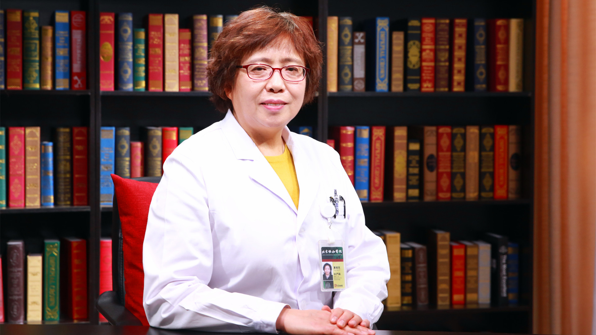

# 1.49 卵巢癌//潘凌亚教授

## 潘凌亚 主任医师

北京协和医院妇产科主任医师 博士生导师；

中国女医师协会妇产科专业委员会副主任委员；中国医师协会妇产科分会妇科肿瘤专业委员会委员；《英国医学杂志中文版》编委；《生殖医学杂志》编委；《中国妇产科临床杂志》编委；国家自然科学基金委员会通讯评审专家。

**主要成就：** 作为项目负责人先后承担国家自然科学基金七项，国家卫生部基金一项，北京市自然科学基金一项，北京协和医院重点基金一项；作为子课题负责人承担国家科技部慢病项目一项；获得国家知识产权局颁发的专利两项；作为第一或通讯作者在国内外期刊发表文章和专著百余篇。

**专业特长：** 长期从事妇产科临床工作，特别是在妇科恶性肿瘤和妇科良性疾病方面具有丰富的临床经验和熟练的手术技巧；致力于妇科恶性肿瘤的规范化、个体化、人性化、微创化治疗，以及基础研究。

---

## 卵巢癌是怎么回事？

（采访）您能简单介绍一下卵巢癌是怎么回事吗？

这是一个女性生殖器官的解剖图，女性生殖器官是位于女性腹腔里最低的部位，所以叫做盆腔，躺在这可以摸到特别硬的一块骨头，叫耻骨联合，全部的盆腔器官其实都在耻骨联合的后方。

大家能够看到的，比较大的、正中央的，像倒置的梨形的器官就是子宫。子宫分成两部分，一部分是子宫体，一部分是在临床上可以看到的子宫颈。

子宫的主要生理功能一个是孕育胎儿，第二个就是来月经。子宫两侧的管状的结构，特别是它的末端有一个像伞或者像手一样的结构，叫输卵管伞，女性实际上就是通过输卵管，把盆腔和外界连接起来。

实际上输卵管最重要的作用，还是在受孕的时候，精子是通过输卵管，然后到达输卵管的伞端，在卵巢的表面和成熟的卵子结合，然后形成受精卵，再通过输卵管经过它的蠕动，然后把它运送到宫腔里，完成受孕的过程。

所以输卵管，对于一个女性正常生育功能的维持是特别重要的，在临床见到的不孕的病人当中，输卵管不通是最主要的因素之一。

大家可以看到在输卵管伞段下方的这两个椭圆形白色的结构，就是卵巢，卵巢大家都知道，平面看好像是在子宫的两侧，实际上它是在子宫偏后的地方或者是叫后方。

所以卵巢主要的功能是两个，第一个就是排卵，完成生育。第二个就是内分泌功能，它可以对一个生育期的妇女，周期的分泌雌激素、孕激素，来维持女性正常的生理环境，维持机体的平衡，对于一个女性健康的维持是非常重要的。

卵巢如果生了病之后，有良性肿瘤，叫卵巢囊肿，还有恶性的肿瘤，叫卵巢癌。

卵巢癌实际上有不同的组织学类型，常见的卵巢癌是指来源于卵巢上皮的一种，叫卵巢上皮性肿瘤，也叫卵巢癌。卵巢癌现在总体来看，发病率在国内是第三位的，大概在2015年，全球有超过23万的新发病例，有超过15万的死亡病例。

我昨天看了一个材料就是2016年，全国的卵巢癌新发病例超过了大概5万例。就是说卵巢癌最重要的意义在于，它的死亡率在所有女性生殖系统肿瘤当中是居第一位的。

---

## 导致卵巢癌的原因是什么？

（采访）是什么原因导致卵巢癌如此高发？

卵巢癌病因和全身大多数的恶性肿瘤是一样的，其实它的病因是不清楚的。

现在对于病因，多数还是根据病因学说来推测的，所以现在有一个叫不间断排卵学说，认为好像卵巢是因为不停的排卵，然后排卵孔不停的修复，在修复的过程当中上皮发生了恶变，所以最终就变成了卵巢癌，这是目前比较经典的一个说法。

基于这么多说法，所以开展了很多，包括人群的，包括医院为背景的流行病调查，现在可能目前比较肯定的，还是和生育是相关的。

现在认为，多生育对卵巢癌发生有降低作用的，特别是生育三胎以上的，现在国外做出来的，包括国内也有这样的流行病学资料，我们医院就曾经有研究生做这样的课题，就是如果有连续的三个以上的足月分娩，对于卵巢癌就有降低作用，而不生育或者少生育可能是发生卵巢上皮癌的一个危险因素，这是第一点。

人群上来看，最近几年通过遗传学的研究发现，在卵巢上皮癌当中由于遗传因素造成卵巢癌是不少的，在全身的恶性肿瘤当中，它占的比例是比较高的，其中由于遗传得的卵巢癌，大概在所有卵巢癌病人当中占到15%，所以现在认为实际上遗传因素与卵巢癌的相关性是不可忽视的。

（采访）对于卵巢癌的原因，有很多的看法，但是目前主要认为可能跟遗传因素有关，还有如果生育的多，可能会降低卵巢癌的发生率。

对。

---

## 什么是遗传性卵巢癌？亲属中有卵巢癌患者，需要做基因检查吗？

首先家庭当中，有这样的患病亲属，因为遗传性卵巢癌、乳腺癌，这两个病是同一个基因突变引起的，所以如果家属当中，有两个一级亲属有乳腺癌或者卵巢癌的家族史，或者在二级亲属当中，有三个这样的病史，一级亲属加二级亲属当中，有三个卵巢癌的成员，就定义为遗传性卵巢癌。

如果是一个遗传性的乳腺癌、卵巢癌的家族成员，那就是高危人群，像美国就会推荐去做基因检测，看看有没有突变基因、患病的风险，如果有这个基因突变，发生卵巢癌的患病风险是超过50%的，是很高的，建议在35-40岁，做预防性的输卵管和卵巢切除。

---

## 卵巢癌的类型有哪些？各有什么不同？

（采访）卵巢癌都有哪些类型？

卵巢癌临床根据组织学类型，主要分为三类：

第一类，临床俗称的卵巢癌，是一个上皮性来源的，叫卵巢的上皮性肿瘤。

第二类是来自于生殖细胞的，就是卵细胞以及它的一些附属组织，这类组织叫卵巢的生殖细胞肿瘤。

还有一类就来源于卵巢间质的，包括颗粒细胞这样一部分的组织，叫做性索间质肿瘤。

在这三类肿瘤当中，发生率是不一样的，卵巢上皮性肿瘤的发生率最高，大概临床见到的卵巢癌当中，有差不多70-80%都是卵巢上皮性肿瘤，而卵巢生殖细胞肿瘤大概是占15%左右，卵巢的性索间质肿瘤是比较少见的，大概是占2-5%。

（采访）卵巢癌为什么会分为这三种类型？它不都是由于癌细胞造成的吗？

分成这三个肿瘤，一个是治疗的办法不一样。

再一个，主要的发病人群的年龄是完全不一样的，像国外统计上皮性肿瘤，平均的发病年龄是60-65岁，大概国内资料，包括我们医院的资料，总体来说平均的发病年龄大概56岁左右。

生殖细胞肿瘤完全是青少年，或者很年轻的人的疾病，像我们医院，最小的才出生几个月，最大的也很少超过40岁，所以大概平均的发病年龄是21岁，甚至还有婴幼儿，这样的一个少女发生的肿瘤，多数都是生殖细胞肿瘤。

而性索间质肿瘤的发病年龄就比较宽泛，从小小孩到老老人都可能。但是这类肿瘤主要是有内分泌的功能，所以经常会有小孩表现为性早熟，老人表现绝经后出血，所以它是一种功能性的肿瘤。

分成三种肿瘤，治疗策略是完全不一样，发病年龄也具有明显的临床特征。

（采访）虽然都是卵巢癌，但是不同的人群或不同的年纪，所得的卵巢癌类型是不一样？

对。

---

## 卵巢癌Ⅰ期、Ⅱ期、Ⅲ期、Ⅳ期是指什么？

（采访）卵巢癌是如何分期的？

卵巢癌分期是比较明确的。

一般如果病变是局限在卵巢的，就分作是Ⅰ期；

如果病变累及了子宫、输卵管，包括盆腔器官，包括膀胱，包括直肠，但是病变是局限在盆腔的，就分为Ⅱ期；

如果病变累及了上腹腔，就分作是Ⅲ期；

如果病变有远处的转移，或者是盆腔的实质脏器有转移，比方说有肝实质转移、脾实质转移，包括肠道的实质转移，像这样的病人分期，就定义为Ⅳ期。

总体来说在临床上把Ⅰ期和Ⅱ期称作是早期病人，Ⅲ期、Ⅳ期称作是晚期病人。对卵巢癌来说，真正意义的早期病人就是Ⅰ期。Ⅱ期的病人，实际上已经称作局部晚期了，它的复发几率比Ⅰ期高很多。

---

## 卵巢癌有早期信号吗？为什么多数人一发现已经是晚期了？

（采访）一些报道说确诊为卵巢癌的患者，发现的时候60%的人已经是晚期了，为什么发现卵巢癌会如此之晚？

其实是不止60%，大概超过70%的人是临床晚期。

总是说卵巢是一个沉默的杀手，往往在被发现的时候，绝大多数已经进入晚期，这个和它的解剖学位置是有关系的。

实际上女性生殖系统恶性肿瘤是比较容易早发现的，因为最主要是像宫颈、像子宫，都是和外界相通的，比方说有宫颈癌会出血，病人去看医生通常比较早，子宫内膜癌也是这个问题，一定会有不正常的月经，或者绝经后阴道出血一系列症状，所以她就诊的时候，病人都是因为症状去就诊的。

卵巢癌的病人，往往是在完全不知不觉的过程中进展的，出现了腹水才想起去看医生，这个时候就比较晚了。

现在卵巢癌，是不是真正早期的时候完全没有症状，通过很多的临床流行病学调查，其实已经发现了卵巢癌是有一些早期症状的，只是不为病人所重视，也不为大众熟知，所以被大家忽略了，才造成了目前的情况，就医特别晚，看病的时候，疾病都已经晚期了。

（采访）一般卵巢癌早期的症状都有哪些？

卵巢癌早期症状和其他的妇科病相比，并没有特别的特征，但是它是有定义的，比方说生殖系统的一些症状，肚子不舒服，下腹痛、下腹胀，然后包括有泌尿系的症状，尿频、尿急。这些症状偶尔出现一次是不要紧的。

总体来说如果在一个月的时间当中，腹痛、腹部不适、腹胀、尿频、尿急这些症状，出现超过12天，就要特别的注意了。

（采访）有一些症状，可能没有对日常生活造成什么影响，可能忍忍就过去了，所以大家才忽视了它。

但是现在“指南”上已经说了，如果在一个月当中有超过1/3的时间都反复的有这个症状，是非常需要去医院就诊的。

---

## 妇科B超和肿瘤标记物CA125检查能早期发现卵巢癌吗？

（采访）女性每年做的妇科检查，能不能及早的发现卵巢癌？

在国外做了很多人群调查，也是希望能够通过人群的普查，早期发现疾病。目前早期发现卵巢癌的检查办法，主要是有两个：

第一个就是经阴道的B超，因为经阴道看卵巢观察的比较清楚。

第二个就是结合卵巢癌的肿瘤标记物，临床最敏感的就是CA125。

把这两点结合起来，对于50岁以后的妇女每年做一次，筛查卵巢癌，特别是早期的病变。

但是目前用这两个办法，筛查那些没有遗传的散发的人群，总体看主要是阳性预测值比较低，所以目前这个筛查策略不成功。在英国有一个全民的研究已经筛查了超过11年，并没有降低卵巢癌的死亡率，所以人群筛查目前来说是不成熟，也是不成功的。

但是现在对于有遗传背景的，比如家里有这个的基因突变，对这些病人，一般的是推荐大概每3-4个月要做一次经阴道的B超，然后还要结合CA125的检查，现在对明确自己有基因突变的这部分病人，推荐的预防措施远远不止这个，还建议在35-40岁时候，要做预防性的输卵管和卵巢切除。

---

## 肿瘤标记物CA125升高，一定是卵巢癌吗？

（采访）如果CA125的指标高，是不是就一定是卵巢癌？

不是，CA125作为卵巢癌的标记物，有一个很重要的特点，它的敏感性是高的，但特异性不强，特别是在诊断的时候。

如果有卵巢癌，超过80%的病人，这个值都会有升高，但是并不是有CA125的升高，就一定是卵巢癌，因为有很多的良性疾病，也都会有CA125的轻度升高：包括比方说最常见的子宫内膜异位症、子宫肌腺症，包括盆腔的炎症，包括生理期。

比如有病人说他的CA125高，是不是得卵巢癌了？我第一句话就会问她，你是不是在月经期。因为月经期特别容易CA125升高，她马上就说对，我是月经第二天。有人告诉我昨天月经刚结束，我就说你就踏踏实实的，等到下一次月经前一个星期再查这个值，一定下降，所以临床上是特别怕这种情况的。

也就是CA125的轻度升高是不必着急的。临床上，什么情况下要高度考虑是不是恶性病变？就是CA125的值大于500U/mL，是非常警觉的一个界限，但是也有一些良性病是很高的。

所以单纯CA125升高只是诊断卵巢癌，或者考虑诊断卵巢癌的一个参考因素，还要结合影像学，还有病人的全部病史来做出卵巢癌的诊断。

---

## 如何确诊卵巢癌？

（采访）有没有诊断的金标准？通过哪些检查数据能够确诊卵巢癌？

主要是靠病理学。如果病人有症状，比方说腹胀、腹水、盆腔包块，然后再加上肿瘤标记物CA125的升高，临床上在考虑诊断卵巢癌的时候，通常有几个办法来获得它的病理诊断。

一个就是如果病人的腹水很多，可以通过很简单的腹腔穿刺，把病人的腹水放出来，从腹水当中找瘤细胞，特别是看有没有腺癌细胞，如果找到腺癌细胞，再经过鉴别诊断，除外全身其他的肿瘤，那么就可以考虑卵巢癌的诊断。

还有一种情况就是获得病理学诊断，一个是单次细针穿刺。有活检的器械，从腹壁上穿到肿瘤的瘤体，然后取出来再做病理，是可以做诊断的。

第三种办法就是通过诊断性腹腔镜，做一个比较小的微创手术，然后直接看到腹腔，然后找到包块、取到活检，同时腹腔镜和其他相比，能够比较准确地评价病变的范围。

因为卵巢癌最大特点是，出现就是晚期，从盆腔到腹腔，到处都是种植性病变，这个时候通过腹腔镜，不仅能够观察到这个疾病到底是不是卵巢癌，同时还可以看看，病变的范围怎么样，也就是早期，还是晚期。

---

## 什么是Ⅰ型卵巢癌？什么是Ⅱ型卵巢癌？

（采访）如果经阴道的B超，还有CA125都在正常的范围之内，是不是就不用再考虑卵巢癌了?

差不太多。

因为卵巢癌有一个特别大的问题，就是卵巢癌有两种类型：

一种叫Ⅰ型，就是CA125正常，然后B超检查卵巢正常，基本认为不是Ⅰ型卵巢癌的这类卵巢癌，就像老百姓理解的卵巢癌那样，一定是从良性到恶性的，病变是一步一步来的，临床能看到这个过程，通常是比较慢的。

但还有一类病，就是要不就没有，来了就会发展特别快，好多病人在一年的时候，甚至半年的时候，甚至三个月的时候，检查都还是正常的，再来的时候突然就到了晚期，所以这就是临床常见的恶性程度特别高的Ⅱ型卵巢癌，像这一类的肿瘤，有时候通过一次的B超和一次CA125的检查是不能保证被检者一年都安全的。

所以还是要告诫大家，一旦有妇科不舒服，这些症状老出现，就要及时的去看医生，不能说一年一次检查、一年一劳永逸，这是不行的。

---

## 卵巢癌转移有什么特点？

（采访）卵巢癌最容易转移到哪个部位？

卵巢癌转移，是它最重要的生物学特性，叫种植性转移。就像撒种子一样，我们能够见到的特别典型的卵巢癌，就是整个腹膜的表面都是大的、粟粒样的转移，种的到处都是，非常的弥漫。

卵巢癌有一些比较常见的转移部位，比方说盆腔的器官，向前侵犯膀胱的浆膜面，向后侵犯直肠。

2018年12月的一个周五，我给一个病人做手术，她就是出现了便血的症状，通过肠镜诊断，结果是卵巢原发的肿瘤，比较容易发生转移部位还有大网膜，最常见的就是网膜饼，也是腹水形成的原因之一。

还有一个比较容易发生的就是阑尾的系膜，还有双侧的结肠侧沟的腹膜，包括膈肌表面，都是非常容易发生转移的。

所以有一种手术叫分期手术，就是即使它没有发生转移，依然要把网膜，还有阑尾这些容易发生转移部分做活检。因为这种分期手术，除了把子宫、卵巢切掉之外，还要把最容易发生转移的部位，包括一些组织也切除掉。

---

## 卵巢癌的首选治疗方法就是手术吗？

（采访）是不是所有的卵巢癌患者都可以采用手术去治疗？

手术治疗是卵巢癌最主要的治疗办法。就是手术治疗为主，化疗为辅，手术和化疗并重。

（采访）不管是早期、中期还是晚期的卵巢癌，首选的都是手术吗？

对。手术切干净是卵巢癌存活率，或者生存率最主要的决定因素。

但好多卵巢癌，由于种植性转移，病变范围太广泛了，直接去切，切不干净，所以也有晚期的病人，要采用先打化疗的新辅助化疗方法，让病变缩小、腹水控制，再去做中间型的减瘤术。

但总的来说最主要的治疗办法，还是要手术切干净。

---

## 早期和晚期卵巢癌，手术治疗上有什么不同？需要放化疗吗？

（采访）卵巢癌都有哪些手术方法？

主要有两种办法，根据早晚期的不同：

早期的主要就是指Ⅰ期的病人，病变仅仅局限在卵巢，病人往往都是在偶尔的检查当中发现的，所以这类病人，病变比较局限，摘掉卵巢，瘤子就拿掉了。

但是基于病人肿瘤的恶性程度高，好多情况下，虽然看它是在卵巢上，实际上在镜下它已经转移到盆腔或者腹腔以外了，所以要做一个全面的分期手术。

分期手术就是根据FIGO分期，国际妇产科联盟对于卵巢癌分期的要求，做一个手术，除了切掉原发部位之外，还要对那些卵巢最容易发生转移的部位，包括网膜、阑尾、子宫、对侧的卵巢都要切掉，另外还要在肿瘤最容易发生转移的部位，做多点的活检。

第二种手术就是卵巢癌已经发生了转移，包括盆腔转移、腹腔转移、腹腔实质脏器的转移，对这种病人要做减瘤术，就是尽可能的把肿瘤切除干净。

能不能切干净是有定义的，一种叫R0手术，就是最好全部肿瘤都切干净，再一种手术就是切的比较好，或者叫比较理想，就是理想减瘤术，残存瘤的直径小于1厘米。

所以现在特别强调，卵巢癌生存率的改善主要还是取决于手术能不能切干净，或者是残存瘤很小很小，然后在这种情况下再做化疗，才能争取最好的预后。

（采访）手术只是第一步，接下来可能还要借助放疗、化疗同步进行吗？

放射治疗很少用在卵巢癌，因为这类肿瘤对放疗不敏感，现在的主要的治疗办法是化疗，在2018年又相继批准了靶向药物，对于治疗遗传性卵巢癌效果也不错。

（采访）化疗对于卵巢癌的治疗起到什么样的作用？

化疗是非常重要的，和手术是并重的。

因为在最近几年，卵巢癌的化疗已经非常规范了，在做理想减瘤手术，或者切的很干净的手术的基础上，要辅助铂类为主的化疗，主要是铂类加紫杉醇类的化疗。

化疗的疗程数，在早期主要是Ⅰ期的病人，可以打3-6个疗程，晚期的病人最新的建议是打6个疗程。一次化疗时间只需要一天，然后每三周打1个疗程，1个疗程只打1次，总共的疗程数是6个，所以一共18周，全部的化疗都能够完成。

---

## 卵巢癌患者还能生育吗？

虽然卵巢上皮性肿瘤是一个老年疾病，但是现在年轻的病人发病还是不少的，特别是那些没有完成生育的病人，主要是发生Ⅰ型卵巢癌。

生殖细胞肿瘤完全是年轻病人，这些情况是不同的，首先生殖细胞肿瘤，因为都是很小的小朋友得这个病，是一定能保留生育功能的，像这种病人的治疗原则是，只要把瘤子切掉了，再辅助化疗就可以了。生殖细胞肿瘤化疗方案和上皮性肿瘤是完全不一样的，它有专门的化疗方案。

如果是卵巢上皮性肿瘤，在保留生育功能的时候是非常谨慎的，因为它的恶性程度特别的高，所以它在“指南”上，要求是很严格的。

第一个，病人要有生育要求，根本不想生的，就不用谈生育的问题。

第二个就是一定是临床早期的，第三个就是要经过全面的分期术，做一种保留生育功能的分期手术，证明她确确实实是一个Ⅰ期的病人。

另外如果是不良组织学类型的，也不能保留，所以它对肿瘤的组织学类型也是有要求的。

相比较宫颈癌、子宫内膜癌，在卵巢癌保留生育功能的病人，是相对来说比较少的，因为它的恶性程度太高。

---

## 口服避孕药能预防卵巢癌吗？

现在唯一提出能预防的，就是所谓有15%的遗传性卵巢癌的这种病人，在2015年NCCN（美国国立综合癌症网络）“指南”上，对于有明确的BRCA基因突变这部分病人，推荐大概在35-45岁期间，做预防性的输卵管和卵巢的切除，这大概是最确实的一个预防卵巢癌的措施。

另外一个比较靠谱的办法，比较有循证医学证据的就是长期口服避孕药，因为可以抑制排卵，可能可以减少卵巢表皮的不断修复，现在认为是可以减降低卵巢癌发生率的，特别是随着服药时间的延长，保护作用更加明显，包括基因突变的病人，如果没有完成生育，近期又没有生育计划，也是推荐口服避孕药来预防卵巢癌的。

（采访）长期口服避孕药，对于卵巢癌的预防，是有帮助的，但是长期吃会不会对身体的其他部位造成影响？

这就是口服避孕药的副作用。避孕药的非避孕用途，现在全世界每年都召开大会，避孕药发明的初衷，是为了让女性避孕，结果现在发现长期口服避孕药可以预防很多的妇科疾病，甚至是除宫颈癌之外的，包括子宫内膜癌，包括卵巢癌，都有不同程度的预防作用，甚至有治疗作用。

所以现在在临床的应用上，甚至它的治疗作用，超出了它真正的避孕用途，但是中国愿意用避孕药的人，和放环相比还是少的，不像欧洲，避孕药在西方国家是主流的避孕方式。

是不是所有人都可以用避孕药？首先就是年龄，现在比较肯定的就是避孕药，特别是对于45岁以上的妇女，用避孕药是要很谨慎的，主要是为了防止血栓性疾病的发生。

因为避孕药现在都叫做孕激素复合的避孕药，在每一个避孕药里，其实为了让她不出血，都是复合了少量的雌激素的，是有增加血栓性疾病风险的可能性的。

所以现在为了防止这个问题要怎么办？第一个就是在雌激素的用量上，每一片在逐渐的减少。另外一种情况就是对于临床上45岁以上的妇女，就不再推荐口服避孕药了，主要是怕她增加血栓性的风险，这是第一个问题。

第二个问题就是乳腺癌的问题，因为现在口服的避孕药叫孕激素复方制剂的口服避孕药，孕激素对于乳腺癌是有负性作用的，甚至是有微风险的，所以现在对于口服避孕药是不是能够增加乳腺癌的风险，至少是不确定的。

所以首先乳腺癌的病人不建议吃口服避孕药，乳癌风险很高的这些，比如有遗传家族史这样的病人，也不推荐长期口服避孕药。

（采访）口服避孕药是长效的，还是短效的？

都是短效的，通常是每天服一次的，在国内剂型通常是两种，一种就是21天，一个月服21天，7天是空的，现在最新一代的口服避孕药，通常就是都是28天，吃上就不停了，实际上大概有24片是有药的，另外还有4片是空白片，这是新上市的，然后只要吃上就一天都不停，还有就是紧急避孕药是没有预防作用的。

---

## 卵巢癌的治疗效果好吗？复发率高吗？

（采访）卵巢癌的患者经过手术，还有化疗之后，总体的预后是如何的？

取决于病人的临床分期，如果早期的病人，比如是Ⅰ期的，做了很好的手术，做了很规范的化疗，生存率就是不错的，五年生存率至少80%以上。

但是如果是特别晚期的病人，就是Ⅲ期和Ⅳ期的病人，现在国外大概的报道的，认为晚期卵巢癌的五年生存率是30-40%，而在我们国家，大概始终徘徊在30%左右。

（采访）卵巢癌的复发率又是如何的？

复发率很高！所有卵巢上皮性肿瘤，特别是晚期的病人，在初次治疗环节以后，大概超过70%的病人都在2-3年内复发。

如果复发之后还可不可以继续手术治疗？就要看病人的条件，如果停止化疗已经超过了半年，特别是超过一年的病人，如果在复发的过程当中，还有新的、可切除的病变，我们还是赞成先手术切干净，然后再继续化疗的。

---

## 为什么卵巢癌患者手术后要按医嘱坚持化疗？

（采访）有一个问题，就是病人今年60岁了，发现卵巢癌的时候已经转移了，之后去做了一次手术，手术之后又去做了化疗，但是承受不了，不太舒服，所以就没有坚持了。对于她现在的情况，您觉得有什么好的治疗办法？

我还是建议她一定要去化疗，因为卵巢癌是手术治疗为主，化疗为辅，手术、化疗并重。因为卵巢癌很重要的生物学特性，叫做腹膜下的或是叫腹腔内的种植性转移，就是医生是给你切掉了那些看得到的瘤，但是还有很多是在不停的转移途中的，有很多根本肉眼看不到的显微镜下的病变。

这些看不到的病变都是靠化疗来解决的，化疗对于这些非常小的病变是很敏感的，而且卵巢癌现在的化疗方案是非常成熟的，现在用的铂类，通常都是用卡铂加紫杉醇的化疗药，它的副反应是不太重的，是可以耐受的。

这个病人打了一个疗程化疗，因为放化疗反应特别重，不愿意去是两方面的原因决定的。第一个，就是病人刚刚接受完手术，在体质上没有恢复，病人体力还比较差。第二种情况可能是医生在打化疗的过程当中，对于化疗的副反应管理的不好，比方说止吐，管理的不好，所以让病人的反应成倍的增加。

所以我觉得，如果化疗管理好了，6个疗程的化疗对于病人来说，是非常容易耐受的，卵巢癌的化疗和其他的全身化疗相比，简单太多了，因为一次化疗时间只需要一天，每三周打1个疗程，1个疗程只打1次，总共的疗程数是6个，所以一共18周，全部的化疗就都能够完成。

我们还是建议病人，一定要积极化疗，争取最好的预后。

---
