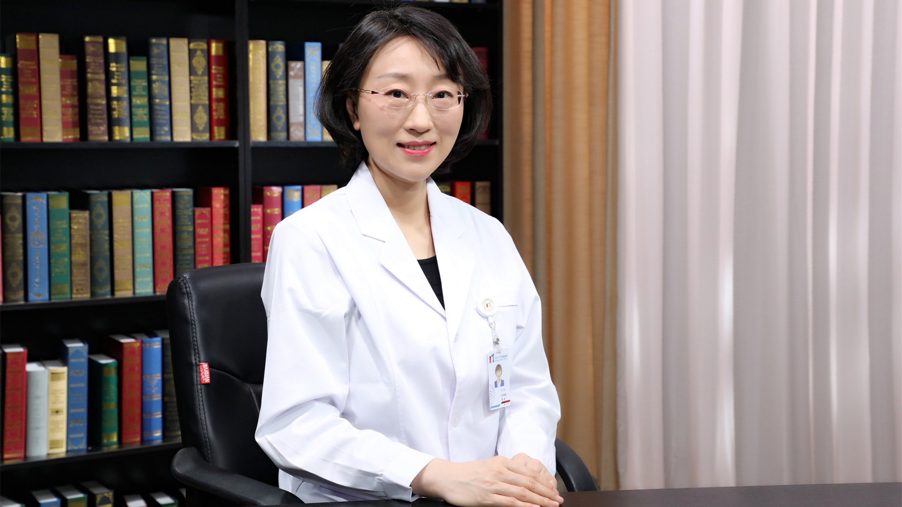

# 1.52 卵巢上皮癌

## 郑虹 主任医师

北京大学肿瘤医院妇科行政副主任 主任医师 副教授；

中华医学会妇科肿瘤分会青年委员；北京医学奖励基金会妇科肿瘤疾病专家委员会副主任委员；北京医学会妇科肿瘤学分会委员；中国抗癌协会妇科肿瘤专业委员会委员；中国临床肿瘤学会妇科肿瘤专家委员会委员；中国优生优育协会妇科肿瘤防治专业委员会常务委员；中国医疗保健国际交流促进会妇产科专业委员会委员。

**主要成就：** 承担、参与国家和北京市多项科研课题，作为主要研究者主持或参与多项国际和国内多中心临床研究；在国内外重要学术期刊发表研究论著30余篇。

**专业擅长：** 擅长妇科恶性肿瘤，包括卵巢癌、宫颈癌、内膜癌和外阴癌等诊断，以及手术和放疗、化疗的综合治疗。

---

## 卵巢上皮癌是怎么回事？

（采访）主任，什么是卵巢上皮癌？

卵巢是一个组织类型很复杂的器官，从卵巢而衍生的肿瘤类型也特别复杂，病理类型多样，卵巢上皮癌其实是卵巢恶性肿瘤当中占的比例最高的一类肿瘤，可能占到百分之八九十，上皮癌的意思就是来源于卵巢表面所覆盖的上皮，其他还有一些来源，比如来源于原始的生殖细胞，我们就称为生殖细胞肿瘤，如果来源于支持、间质的细胞，就叫支持-间质细胞肿瘤，所以它的类型特别复杂。

老百姓可能平时说卵巢癌，一般指的就是上皮癌，因为就像我刚才说的，它的发生比例特别高，在整个卵巢恶性肿瘤当中占到85%-90%这样一个很高的比例。

（采访）卵巢上皮癌都好发于哪些人群？

卵巢上皮癌的病因其实不清楚，就跟大部分肿瘤一样，病因是不明确的，但是确实有一部分卵巢癌是由遗传因素决定的，也就是这个患者的上一辈，父母，有一些容易导致卵巢癌的基因遗传到了她身上，这些人在这一生当中不一定会得肿瘤，但是发生恶性肿瘤，比如卵巢癌和乳腺癌的概率会比正常人群高很多。

这个基因现在很多人也都熟知了，就是BRCA基因，它跟患卵巢癌和乳腺癌都有关系，并不是携带这个基因一定会发病，只是发病的概率会增高，比如正常人这一生中患卵巢癌的风险可能是1.3%，但如果携带了BRCA基因突变，这是从上一代带下来的，如果携带了这个突变的基因，这一生患卵巢癌的风险会增加到45%，增加了40多倍，所以这类人群其实是我们应该去严密监测，甚至是要采取一些预防措施的人群。

（采访）也就是不管年龄大小，只要家族有卵巢癌的基因史，就可能有几率会得卵巢上皮癌？

如果携带这个突变的基因，发病概率也是随着年龄增长而增加的，其实正常人群也是如此，从大约40岁开始，发生的比例，卵巢癌的比例就逐渐升高，可能到60岁左右是一个高峰。

其实也就是这些卵巢上皮癌，尤其是常见的高级别浆液性癌，这个类型在普通人群当中发病的中位年龄是60岁左右，就是绝经后妇女高发的一个癌种，但是对于携带BRCA基因突变或其他有一些相关基因突变的，发病年龄可能会相对早一点，但是依然是随着年龄增长，发病的概率越来越高。

（采访）主任，您刚才提到了浆液性癌是什么意思？

即使是卵巢癌，我们知道上皮癌可能发病几率是最高的，百分之八九十都是从上皮来源的一种恶性肿瘤叫上皮癌，在上皮癌里面也有很多类型，这都是从病理科角度，也就是细胞形态来把它进行的分类，最常见的一类就是浆液性上皮癌，可能占到一半以上，甚至有的报道显示到3/4，就是75%左右。

另外，其实还有一些比如黏液性癌、透明细胞癌、子宫内膜样癌，起了很多名字，当然起这些名字是有意义的，因为这些不同类型的卵巢上皮癌，特点不太一样，也就是发现的时候，期别可能不太一样，恶性程度不太一样，发生转移的概率不太一样，所以有不同的类型，但其实比较常见的，还是占一半以上的高级别浆液性癌。

---

## 卵巢上皮癌的发病原因是什么？和遗传有关系吗？

卵巢癌的发病原因不是特别清楚，可能跟我们想的饮食，还有外界的环境刺激，关系都不是特别明确，就是没有一个明确的因素，比如吸烟和肺癌的关系，可能没有这么明确，但是确实有一部分卵巢癌是由遗传因素决定的，也就是这个患者的上一辈，父母，有一些容易导致卵巢癌的基因遗传到了她身上，这些人在这一生当中不一定会得肿瘤，但是发生恶性肿瘤，比如卵巢癌和乳腺癌的概率会比正常人群高很多。

这个基因现在很多人也都熟知了，就是BRCA基因，它跟患卵巢癌和乳腺癌都有关系，并不是携带这个基因一定会发病，只是发病的概率会增高，比如正常人这一生中患卵巢癌的风险可能是1.3%，但如果携带了BRCA基因的突变，这是从上一代带下来的，如果携带了这个突变的基因，这一生患卵巢癌的风险会增加到45%，增加了40多倍。

所以这类人群其实是我们应该去严密监测，甚至是要采取一些预防措施的人群，因为确实有明确的数据表示，她们患卵巢癌的概率会明显增加。

---

## 卵巢上皮癌能在早期发现吗？

（采访）主任，卵巢上皮癌能不能在早期发现？

在上皮癌里面也有很多类型，这都是从病理科角度，也就是细胞形态来把它进行的分类，最常见的一类就是浆液性上皮癌，可能占到一半以上，甚至有的报道显示到3/4，就是75%左右，如果卵巢上皮癌，指的是常见的高级别浆液性癌，确实很难在早期发现。

早期发现的意思就是患者就诊的时候，可能这个肿瘤还在卵巢局部生长，并没有扩散到卵巢以外的地方，比如盆腔、腹腔、肠管这些地方，其实对于高级别浆液性癌来说，可能只有大约10%左右，能在这样一个状态下被发现。

大部分的是什么状态？百分之七八十，甚90%都有扩散、转移，这个跟它本身的生物学行为有关系。就是这类肿瘤一旦发生，很快就会从卵巢上脱离，就像播散种子一样在盆腔、腹腔去种植性转移，可以播散到腹膜，播散到肠管，甚至通过血液转移到肝脏、肺，都有可能。

（采访）所以自己在早期也是不能摸到包块的？

是很难的，有些上皮癌，比较少见的，比如黏液性癌，名字跟浆液性癌不太一样，黏液性癌发生的概率很低，但是这种黏液性癌的特点就是，生长基本上都会局限在卵巢，所以在早期能发现的比例就比较高，也就是它会慢慢在卵巢局部长，而且会长得比较大，长大了，有的患者就会摸到这个肿瘤，但是就像刚才说的高级别浆液性癌，这类常见的，它能还没长多大，稍微增大了一点点，就扩散出去了。

患者来就诊时主要的主诉，和她说的症状，其实就不会是摸到了包块，因为并没有那么大，可能就三四厘米，很小，但是卵巢外的这些转移灶给她造成的困扰就多了，比如出现腹水了，她会觉得腹胀，或者是转移到了肠管表面，肿块压迫了肠管可能会有肠梗阻的表现，依然是吃完东西胃不舒服，腹胀或者不排气这些症状。

因为引起重视的这些症状，是已经播散转移造成了一些别的症状，所以这个时候再去就诊，大部分都是晚期，确实是有些患者，比如半年前刚做过体检，盆腔、腹腔的B超没有明显异常，但是可能半年后就会有这种广泛种植性转移的症状，所以很难早期发现就是这个意思，它生长了以后会很快出现卵巢之外的这些部位的播散转移，所以很多患者去就诊，其实也是首诊在消化科，因为她的症状让她以为自己消化不良，胃不舒服。

---

## 卵巢上皮癌有什么表现？会出现腹胀、胃疼吗？

在上皮癌里面也有很多类型，这都是从病理科角度，也就是细胞形态来把它进行的分类。最常见的一类就是浆液性上皮癌，可能占到一半以上，甚至有的报道显示到3/4，就是75%左右，这类常见的，它可能还没长多大，稍微增大了一点点，就扩散出去了。

患者来就诊时主要的主诉，和她说的症状，其实就不会是摸到了包块，因为并没有那么大，可能就三四厘米，很小，但是卵巢外的这些转移灶给她造成的困扰就多了，比如出现腹水了，她会觉得腹胀，或者是转移到了肠管表面，肿块压迫了肠管可能会有肠梗阻的表现，依然是吃完东西胃不舒服，腹胀或者不排气这些症状。

（采访）主任，卵巢上皮癌患者还会不会出现胃口差的表现？

胃口差的大部分原因还是因为进食以后腹胀，也就是确实可能吃了一些东西，比如肠梗阻，因为腹水的压迫，吃下去以后就胃胀、胃疼，患者可能就觉得不想吃，大部分还是因为这个原因。

（采访）主任，卵巢上皮癌引起的食欲缺乏和正常人没有胃口的食欲缺乏相比，有没有什么不同？

我觉得对于卵巢上皮癌来说，如果出现了症状，是无法从症状来诊断这个病的，可能大部分的肿瘤都不能，只能通过症状告诉你要去哪些科室就诊，比如高级别的浆液性癌，一旦到出现症状想去看病，百分之七八十都是晚期，晚期就是从卵巢长出去，播散到了腹腔，甚至胸腔都有可能，这个时候一定会有症状，这样的症状是无法判断怀疑得了卵巢癌的。

就像这些患者可能通常就会去看消化科，消化科大夫也会去除外他们自身科室相关的一些问题，比如胃肠功能紊乱了，是不是有胃的一些不适，有的会去做胃镜，做肠镜，都有可能，所以这些症状非常不特异，这也是卵巢癌不容易早期发现的原因，它是没有特异性的症状，除非这个包块特别大，摸到了。

其他的确实没有，一直到晚期这些症状都不特异，因为很多疾病都可以出现消化不良，吃完东西胃胀、腹围增加，即使一些良性的感染性疾病，比如结核，也有可能会出现腹胀、腹围增加，所以这时候进一步检查就特别重要。

（采访）就是我们无法通过这种单一的症状来确定它。

对，症状非常不特异。

---

## 卵巢上皮癌怎么诊断？要做什么检查？

（采访）主任，卵巢上皮癌应该怎么诊断，需要做哪些检查？

我觉得对于卵巢上皮癌来说，如果出现了症状，是无法从症状来诊断这个病的，可能大部分的肿瘤都不能，只能通过症状告诉你要去哪些科室就诊，如果出现了不舒服，其实比较容易告诉我们怀疑卵巢癌的就是腹部发现了包块，这个女性如果下腹部发现了可触及的包块，她一般还是会主动来看妇科，这样影像学检查就很重要，B超、CT或者磁共振这些都称为影像学检查，可以让我们知道一些腹腔内发生的变化。

在上皮癌里面也有很多类型，这都是从病理科角度，也就是细胞形态来把它进行的分类，最常见的一类就是浆液性上皮癌，可能占到一半以上，甚至有的报道显示到3/4，就是75%左右，这类常见的，它可能还没长多大，稍微增大了一点点，就扩散出去了。

患者来就诊时主要的主诉，和她说的症状，其实就不会是摸到了包块，因为并没有那么大，可能就三四厘米，很小，但是卵巢外的这些转移灶给她造成的困扰就多了，比如出现腹水了，她会觉得腹胀，或者是转移到了肠管表面，肿块压迫了肠管可能会有肠梗阻的表现，依然是吃完东西胃不舒服，腹胀或者不排气这些症状。

她们可能会去消化科就诊，有的人还会有胸水，首先去胸部肿瘤科就诊，以为是跟肺癌相关的一些问题，这些患者可能诊断起来就不是那么容易，可能我们会做影像学检查，这些影像学检查通常会提示一些广泛种植性转移的表现，比如盆腔、腹腔的结节、胸膜结节、胸水、腹水这些，这些也不足以诊断卵巢癌。

所以一旦出现了特别广泛种植性转移，原发灶的诊断可能基本上还是要通过病理活检，只有通过把肿瘤组织取出来，进行显微镜下的一个判断，才能来明确到底首先，是不是恶性肿瘤；第二，肿瘤的来源到底是来源于胃肠道，还是来源于乳腺，还是来源于卵巢，这样才会有进一步的明确诊断和下一步的治疗。

---

## 病理检查是卵巢上皮癌的金标准吗？取活检用做手术吗？

（采访）主任，卵巢上皮癌的诊断是所有患者都需要做病理检查吗？

那一定是，因为恶性肿瘤的诊断，金标准就是病理诊断，只有有了病理诊断，才能够进行下一步的化疗或者放疗这些治疗，必须有病理诊断，因为化疗、放疗对身体的损伤，可能都不用我解释，大家都知道，所以既然要进行这些像双刃剑一样的治疗，就是有好处，有坏处，我们就一定得知道患者真的是恶性肿瘤，她真的能从这些化疗、放疗的治疗当中获益才行。

（采访）取活检的时候是通过腹腔镜检查直接取出来吗？

腹腔镜是一个手术，通常我们是希望通过一些创伤比较小的手段，比如可以通过超声引导下的穿刺活检，包括CT引导下穿刺活检，这些可能都比去做腹腔镜活检创伤要稍微小一点，结果可能会出来的快一点，不用做全身麻醉，不用做手术的准备，当然，这种穿刺活检也有一定的前提，就是这些能穿刺的部位确实是能成功进行穿刺活检。

因为有些包块可能会在血管周围，可能被肠管包绕，这样可能在做经皮穿刺的时候就有一定风险，如果有这些风险，我们还是不建议做，因为会有出血、损伤这些问题，但是如果能穿刺，这些方式可能创伤就会小一点，穿到了足够的组织就可以进行诊断，还有的时候可能超声或者CT引导下进行了穿刺，没有取到，或者是不能够取到足够的肿瘤组织，还是不能够做诊断。

可能下一步就要做腹腔镜活检，腹腔镜活检肯定比开腹去进行活检损伤要小，因为腹腔镜一般是通过1-2厘米的小孔进行操作，通过镜子看到整个盆腔、腹腔的情况，这样其实对了解盆腔、腹腔转移的状况是有一个很大的帮助，比影像学肯定是看得更清楚，判断得更明确，我们通过腹腔镜也可以肯定取到足够的组织来进行病理检查，不会失手，要有个病理检查。

就像我跟病人说的，没有这个诊断，我们下一步什么也干不了，因为有些患者很难受，腹胀、吃不了东西，消瘦，特别想马上就用一些治疗，但是我们没有诊断的时候，确实不能够做治疗，因为所有肿瘤的治疗是必须依据病理的，因为化疗、放疗对身体的损害很大，而且我们不知道肿瘤来源，就随便制订一个方案也是不合理的，可能对治疗不敏感，我们用消化道肿瘤的方案治疗卵巢癌，一定是不合适的，所以这个诊断非常重要。

（采访）只有拿到确切的病理诊断，我们才能有下一步的治疗。

对，有确切的病理诊断，我们就可以马上开始下一步治疗。

---

## 卵巢上皮癌怎么分期？

（采访）主任，卵巢上皮癌是怎么分期的？

卵巢癌的分期其实是来描述它到底转移到了哪些部位，我们分为4期，Ⅰ期、Ⅱ期、Ⅲ期、Ⅳ期，越往后的数字越大，期别越晚。

早期也就是Ⅰ期的意思，其实就是肿瘤还长在卵巢局部，因为叫卵巢癌，它还在原发脏器的位置上，并没有向其他部位扩散；Ⅱ期可能就是从卵巢上扩散出去了，但是仍然还局限在盆腔，大致在肚脐以下的区域；Ⅲ期的意思就是已经从盆腔进一步往上播散到了腹腔，腹腔的意思就是肚脐以上这样一个位置。

到Ⅳ期也就是最晚期的患者，就意味着可能最严重，最严重就意味着转移到了其他远处脏器，比如到肝脏内，到脾脏内，转移到了肺，转移到这些远处的脏器，我们就称为Ⅳ期，如果也出现了胸水，胸水里面也有肿瘤细胞，我们也称为Ⅳ期，总之就是有远处转移，就是一个Ⅳ期的患者，应该就是预后最差的。

（采访）主任，胸水是只有在Ⅳ期才会出现的吗？

如果胸水里有肿瘤细胞，我们是诊断Ⅳ期，因为胸腔本身跟腹腔也是分隔的，不是在一个空间里面，所以如果长了胸水，说明胸膜有种植性转移，它就是一个远处的脏器转移，我们就称为Ⅳ期。

---

## 卵巢上皮癌容易转移、扩散吗？

（采访）主任，卵巢上皮癌容易转移、扩散吗？

在上皮癌里面也有很多类型，这都是从病理科角度，也就是细胞形态来把它进行的分类，最常见的一类就是浆液性上皮癌，可能占到一半以上，甚至有的报道显示到3/4，就是75%左右，卵巢上皮癌如果是指常见的高级别浆液性癌，它是一个特别容易转移、扩散的恶性肿瘤，也就是这个肿瘤可能在卵巢上没有长多大，卵巢的体积并没有扩大多少，但是它就已经穿透了卵巢的表面，播散到了盆腔、腹腔。

它最常见的，也是比较有特点的一个转移方式，就是腹腔的播散转移，也就是这个肿瘤细胞就像撒种子一样，播散到盆腔、腹腔的各个角落，所以从影像上看，经常可以观察到腹水，这是转移出去的肿瘤细胞造成的，非常容易有腹膜的增厚，整个肠管表面的增厚，包括大网膜增厚，或者甚至呈饼状，非常厚，非常硬，看上去质地非常实，所以这些其实都是腹腔内播散转移的特点。

比较少见的，比如黏液性癌，名字跟浆液性癌不太一样，黏液性癌发生的概率很低，但是这种黏液性癌的特点就是，生长基本上都会局限在卵巢，所以在早期能发现的比例就比较高，也就是它会慢慢在卵巢局部长，而且会长得比较大，长大了，有的患者就会摸到这个肿瘤。

---

## 卵巢上皮癌患者是先做手术，还是先化疗？

在上皮癌里面也有很多类型，这都是从病理科角度，也就是细胞形态来把它进行的分类，最常见的一类就是浆液性上皮癌，可能占到一半以上，甚至有的报道显示到3/4，就是75%左右，如果早期，患者就诊的时候，可能这个肿瘤还在卵巢局部生长，并没有扩散到卵巢以外的地方，比如盆腔、腹腔、肠管这些地方，其实对于高级别浆液性癌来说，可能只有大约10%左右，能在这样一个状态下被发现。

真的是特别幸运的一些病人在早期发现了，这样的患者其实靠手术切除为主，因为我们也需要把包块切干净，然后送检病理科，最终确定是卵巢上皮癌，因为确实在非常少见的情况下，送到病理科检验后跟我们想的不一样，它不是卵巢上皮癌，也有可能是其他肿瘤转移到卵巢，这种可能也是有的。

或者是检查进到腹腔内一看，这个肿瘤不是来源于卵巢，是来源于其他的一些器官，比如肠系膜的一些肿物，可能位置上正好在卵巢这个部位上，在术前的影像上其实有时候还是真的很难判断，所以手术治疗是局部通过影像判断确实可以切除，并且切除干净的一个治疗方式。

如果到了晚期，也就是这些肿瘤细胞有非常广泛的扩散，有大量腹水、腹膜增厚，甚至有些远处脏器转移，比如肝脏实质的转移，脾脏实质的转移，或者是胸水，这样的患者一般来说情况都不太好，因为影响到了进食，影响到了呼吸，体重也会下降，体内的蛋白也会丢失得很厉害，因为有腹水、胸水。

所以她们耐受手术，第一，非常困难；第二，像高级别浆液性癌，高发年龄是绝经后的女性，60岁左右，本身好多人就有糖尿病、高血压、冠心病等等，所以一个是营养状态很差、年龄又大、合并症多，肿瘤又播散得非常广泛，很难把每一处转移出去的肿瘤切干净，不能切净，手术意义就不大，因为我们做一次开腹的手术，只是切除一部分肿瘤，还不如不做。

所以像这样一些晚期的，营养状态差、合并症很多、耐受不了大手术的患者，我们可能会考虑先做一个病理检查，也就是取到足够的组织做诊断，一般来说可以考虑超声引导下穿刺活检，实在是不能够成功的，可能会做腹腔镜探查取到足够的，转移的或者是原发部位的癌组织进行病理诊断，确定了是卵巢癌，我们会采取先化疗的方式，我们称为新辅助化疗。

化疗的目的主要是为了让肿瘤体积，整个瘤负荷缩小一些，腹水减少，让手术切净成为一个可能，紧接着几个疗程之后的化疗，再做手术，能够把这些所有的转移灶切干净；第二个目的，对于一些身体状况本身就不太好的患者，低蛋白、消瘦得明显，这些患者通过化疗如果起效了，身体状况会有非常显著的改善，有时候患者第一次来可能是平车推着进来的，或轮椅推着进来的，打过一次化疗，如果有效，第二次可能患者的体重就有显著增加，能够健步如飞地走到病房里。

因为卵巢上皮癌的高级别浆液性癌，化疗的敏感性非常好，百分之八九十的患者都会有效，所以新辅助化疗就是一个比较合理的治疗手段，让患者改善一般情况，让肿瘤成为可切除的肿瘤，而且目前的这些临床研究也显示，新辅助化疗可能不太会影响到患者的预后。

就是没有第一时间做手术，而是先采取了化疗，化疗以后再考虑手术的方式，患者的生存也是不错的，所以这个方式还是目前临床上对于晚期的，不能手术或者身体不能耐受手术的患者的一个首选方式。

（采访）主任，卵巢上皮癌患者可不可以不做手术？

对于卵巢癌来说，手术治疗是最主要的一个治疗方式。早期，如果我们判断能够做一个完整的、全部的切除，一定是手术；如果是晚期，其实也是为了手术创造条件才进行化疗，最终我们的目标也是想把这些原发灶，还有转移灶，都切干净，所以如果不进行手术，可能很难达到很好的治疗效果。

---

## 卵巢上皮癌发生扩散、转移，还能手术切除吗？

如果到了晚期，也就是这些肿瘤细胞有非常广泛的扩散，有大量腹水、腹膜增厚，甚至有些远处脏器转移，比如肝脏实质的转移，脾脏实质的转移，或者是胸水，这样的患者一般来说情况都不太好，因为影响到了进食，影响到了呼吸，体重也会下降，体内的蛋白也会丢失得很厉害，因为有腹水、胸水。

所以她们耐受手术，第一，非常困难；第二，像高级别浆液性癌，高发年龄是绝经后的女性，60岁左右，本身好多人就有糖尿病、高血压、冠心病等等。所以一个是营养状态很差、年龄又大、合并症多，肿瘤又播散得非常广泛，很难把每一处转移出去的肿瘤切干净，不能切净，手术意义就不大，因为我们做一次开腹的手术，只是切除一部分肿瘤，还不如不做。

所以像这样一些晚期的，营养状态差、合并症很多、耐受不了大手术的患者，我们可能会考虑先做一个病理检查，也就是取到足够的组织做诊断，一般来说可以考虑超声引导下穿刺活检，实在是不能够成功的，可能会做腹腔镜探查取到足够的，转移的或者是原发部位的癌组织进行病理诊断，确定了是卵巢癌，我们会采取先化疗的方式，我们称为新辅助化疗。

化疗的目的主要是为了让肿瘤体积，整个瘤负荷缩小一些，腹水减少，让手术切净成为一个可能，紧接着几个疗程之后的化疗，再做手术，能够把这些所有的转移灶切干净；第二个目的，对于一些身体状况本身就不太好的患者，低蛋白、消瘦得明显，这些患者通过化疗如果起效了，身体状况会有非常显著的改善，有时候患者第一次来可能是平车推着进来的，或轮椅推着进来的，打过一次化疗，如果有效，第二次可能患者的体重就有显著增加，能够健步如飞地走到病房里。

因为卵巢上皮癌的高级别浆液性癌，化疗的敏感性非常好，百分之八九十的患者都会有效，所以新辅助化疗就是一个比较合理的治疗手段，让患者改善一般情况，让肿瘤成为可切除的肿瘤，而且目前的这些临床研究也显示，新辅助化疗可能不太会影响到患者的预后，就是没有第一时间做手术，而是先采取了化疗，化疗以后再考虑手术的方式，患者的生存也是不错的，所以这个方式还是目前临床上对于晚期的，不能手术或者身体不能耐受手术的患者的一个首选方式。

---

## 手术治疗卵巢上皮癌，要切除子宫和卵巢吗？

（采访）主任，如果是用手术治疗卵巢上皮癌，要把子宫和双侧卵巢都切掉吗？

只有非常少的一部分卵巢上皮癌患者是可以保留子宫的，因为人有两个卵巢，保留子宫和对侧的，起码外观看是基本正常的卵巢，这个只能在非常少的一部分年轻患者当中实现，什么样的患者？首先，根据病理类型，可能黏液性癌因为早期发现得多，而且它生长得比较缓慢，也就是我们说的不那么恶，所以可能可以考虑在非常早期的患者中进行保留生育功能，就是保留子宫和另外一侧看着比较正常的卵巢。

另外就是比较早期的，肿物还局限在卵巢的低级别浆液性癌，它能够保留的原因也是因为它的生物学行为没有那么恶，相对来说是比较善良的恶性肿瘤，这样可能保留起来才会对患者的生存没有造成太大影响，因为肿瘤治疗的第一原则，第一个目标，还是要延长生存，所以就是这么看来，因为低级别的浆液性癌在整个浆液性癌当中也就是5%-10%这样一个比例，很低。

所以可能只有低级别浆液性癌才能比较放心的在早期患者当中去考虑，保留住子宫和对侧起码肉眼外观看比较正常的卵巢，条件特别多，病理类型，还有期别得特别早，还局限在卵巢，如果已经扩散、转移了，肯定不适合保留，因为很快，可能留下的卵巢就会发生新的问题。

---

## 卵巢高级别浆液性癌和低级别浆液性癌有什么区别？

即使是卵巢癌，我们知道上皮癌可能发病的几率是最高的，百分之八九十都是从上皮来源的一种恶性肿瘤叫上皮癌，在上皮癌里面也有很多类型，这都是从病理科角度，也就是细胞形态来把它进行的分类，最常见的一类就是浆液性上皮癌，可能占到一半以上，甚至有的报道显示到3/4，就是75%左右。

低级别浆液性癌，占整个浆液性恶性肿瘤的很少一部分，小于10%，这部分肿瘤生物学行为相对没有那么恶，所以早期发现的比例会比较高，可能有一半就会在I期（早期），就是肿瘤局限在卵巢的时候被发现，还没有往外扩散，这样看上去挺好。

但是这一批肿瘤是对化疗不敏感的，对化疗的敏感性可能只有20%-30%，但如果是高级别浆液性癌，它是一个恶性程度很高的肿瘤，很容易发生扩散、转移，所以百分之七八十的患者发现的时候是晚期，就出现了腹水，种植性转移特别多，早期的真的很少，这样的患者虽然治疗起来很困难，但是对化疗很敏感，可能化疗的敏感性达到百分之八九十，所以它们两个生物学行为相差还是挺明显的。

（采访）主任，我们该怎么判断是低级别的浆液性癌，还是高级别的浆液性癌？

只有病理能确定，就是一定要取到足够的肿瘤组织去送检病理科，病理科也会通过形态，第一，判断；第二，也会做一些特殊的染色进行鉴别。所以我们是一定要让病理科给我们一个确定答案的，不能模模糊糊地说它是一个卵巢上皮癌，这对于临床医生，对于搞肿瘤的临床医生远远不够，因为它决定患者的治疗和预后。

---

## 治疗卵巢上皮癌，全面分期手术和肿瘤细胞减灭术是怎么回事？

（采访）主任，治疗卵巢上皮癌，全面分期手术和肿瘤细胞减灭术有什么区别？

这是两个特别专业的卵巢癌手术名称，对于分期手术来说，通常指的是在影像上看，相对比较早期的这些患者，因为影像学检查对于我们来决策卵巢癌的手术非常重要，比如CT、磁共振这些，我们会看一下转移的范围，转移到了哪儿，能不能切干净，对于相对早期，可能就是肿物还局限在卵巢，或者还在盆腔内，上腹部其实没看到特别的异常，这些患者通常去做的手术就叫全面分期手术。

意思就是虽然我们在上腹部，比如大网膜，比如上腹部的腹膜，就是肚脐眼以上区域的腹膜，还有包括淋巴结，并没有在影像上看到有转移，或者有可疑的转移，但是我们依然要切除这些部位，目的就是为了切除之后送检病理科，让病理科医生在显微镜下再次去确认，这些地方有没有微小的，就是影像不能判断的转移，判断以后才能知道它是不是真正的早期。

影像判断可能就是一个临床的早期，我觉得是，但其实可能病理科检验后看了这些切除的部位，发现有转移，那它的分期就会变化，我们会给出一个术后的叫手术病理分期。

说到肿瘤细胞减灭术，减灭听着就是要切干净的意思，这个手术其实我们通常是用在晚期的这些患者，也就是从影像上看，已经广泛种植性转移了，甚至可能还有胸腔内的、心膈角的淋巴结增大，当然这些都是影像提示，到底是转移，不是转移，可能还是要病理确认，起码影像上看已经有一些上腹部的包块，胸腔里的一些肿大的淋巴结，这些我们就希望能通过手术把它切干净，所有可疑的地方都切净，这个就叫肿瘤细胞减灭术。

---

## 卵巢上皮癌患者切除卵巢后，什么情况下需要使用激素？

（采访）主任，卵巢上皮癌患者切除卵巢之后，需要服用激素吗？

卵巢上皮癌中比较常见的，高级别浆液性癌，平均发病年龄是60岁左右，就是绝经后妇女高发的一个癌种，所以如果对于这些绝经后的女性，切了双侧的卵巢，应该就绝对不会需要用激素替代来缓解更年期症状，因为可能真的是没有什么症状，但是确实有一些卵巢上皮癌会发生在年轻的女性，就是绝经前的女性，对于这些女性来说，我们选择或者是建议她们用激素替代治疗。

首先，需要的是有这方面的症状，因为更年期症状不是每个人都有，或者不是每个人都重到必须要用激素替代，有一些人可能真的在比如40多岁，切除了双侧卵巢，她也是会有一个轻微潮热，没有特别影响生活，所以这样的其实不是必须要用激素替代，因为本身对于健康人群来说，激素替代也是有一定前提的，不是每一个围绝经期的女性都需要用激素替代治疗，它是有一些前提在，比如有骨质疏松的问题等等。

对于肿瘤病人就会更谨慎，如果没有太多的这种需求，症状不重，可以观察，如果有症状，确实更年期的症状非常重，因为有一些30多岁，甚至20多岁的女性把双侧的卵巢切掉以后，可能因为一下子激素水平下降，可能引起潮热、失眠、烦躁，这些都会，这样如果影响了生活质量，我觉得还是有必要建议进行一个激素替代治疗。

对于这些女性能不能做激素替代治疗，也要取决于第二个因素，就是肿瘤的类型，有一些肿瘤是跟雌激素有关系的，比如低级别浆液性癌，我们认为它的生长可能会受到雌激素的影响，雌激素的补充治疗可能会导致它复发，就不建议用激素替代来治疗，可能用其他的一些方法去对症缓解更年期症状，比如失眠，我们就采取一些失眠的药物，去缓解她的这些不适，所以对低级别浆液性癌我们不是特别赞成去盲目的上激素替代。

但对于其他的比较常见的高级别浆液性癌，可能跟激素的相关性确实没有特别明确的数据支持，这些患者我们觉得还是可以给予一个替代治疗，来改善生活质量。当然，是要在妇科肿瘤医生的严密监测下去用药，因为我们也知道激素替代也会有它的问题，比如要监测乳腺，长期服用要监测乳腺的问题，是不是有乳腺肿瘤发生的可能性，所以还是要谨慎用药。

---

## 卵巢上皮癌手术治疗后，怎么判断肿瘤有没有清除干净？

（采访）主任，卵巢上皮癌患者在手术治疗之后，怎么判断肿瘤有没有清除干净？

一般来说，就是手术的时候，我们肯定会用肉眼来先做判断，所有眼睛能看到的部位，包括用手触摸的这些部位，没有残留，这应该是最客观的，最准确的，这个比影像学检查应该更准确，术后也会进行一些影像学检查，来判断有没有残余病灶，比如拍CT、磁共振，并且在整个后续治疗过程中，定期进行影像的动态观察，来看看变化。

因为做完手术之后，可能做CT检查就会有一些术后的改变，这个很常见，比如原来有子宫的部位切除掉了，这个地方会有缝合，瘢痕样的东西，可能会一个地方稍微有点增厚，这个增厚一定是肿瘤吗？真的不一定是，所以我们一般的做法就是，开始术后的辅助化疗之前，会进行CT检查作为基线，以后会进一步定期做CT来进行比较。

如果这个地方有一个进行性变化，进行性增厚，变成肿块了，考虑还是一个肿瘤的进展，如果总是这样，可能就是一个术后改变。所以，大家总是期待影像科大夫给出一个明确诊断，这个地方是复发病灶，这个地方不是，其实真的很难，对于肿瘤的病人，所以动态监测非常重要。

（采访）所以有这个影像学检查就足够了？

目前是这样，因为现在影像的进展还是很快的，比如北京大学肿瘤医院的影像科大夫他们来看，重点非常明确，准确性也比较高，而且就像我说的动态监测非常重要，如果只是给他看一张片子，上面有一些变化，他真的很难判断，这是我在临床上，在门诊经常碰到的问题，就是从别的医院治疗结束，给一张片子，上面确实有一些变化。

哪儿增厚了，这个地方有少量的包裹性积液，是不是哪儿转移了？是不是复发？特别难判断，因为真的就是一个动态观察，是对术后影像学变化很好的解释，除非这个肿瘤非常大，可能连自己都能看出来，这地方有明显的包块，那也不用影像学来判断，我们所有的人都能看出来它是一个转移病灶，对于微小的变化是需要动态观察的。

---

## 卵巢上皮癌患者术后做化疗，多久需要做一次CT或磁共振检查？

如果是做完手术，术后会进行一些影像学检查，来判断有没有残余病灶，比如拍CT、磁共振，并且在整个后续治疗过程中，定期进行影像的动态观察，来看看变化，因为绝大多数患者都是需要术后辅助化疗的，做化疗也是为了减少以后复发的机会，去进一步杀死肉眼不可见的那些转移肿瘤，在化疗之前我们建议要做一个影像学检查作为基线，它的原因是因为会有一些术后改变，造成解剖位置，包括这个地方的瘢痕增厚，微量的积液等等。

之后在术后的辅助化疗期间，我们可能在3个疗程之后，还会进行一次检查，主要目的是为了看看辅助化疗是不是有效，因为可能在术后做辅助化疗的时候，有的病人，肿瘤就进展了，这也是有可能的，虽然发生率不那么高，因为化疗基本敏感，那也有人会进展。

因为敏感的意思也是80%左右的有效率，还是会有一小部分，虽然切干净了，但是在化疗期间逐渐又长大了，这时候可能就要考虑是复发了，要更改化疗方案，所以3个疗程左右，我们要进行一次影像判断，看看是不是治疗有效，需不需要换化疗方案。

一般来说如果有效，术后的化疗疗程是6个疗程，可能在6个疗程的时候还会做，这次做的意义就在于如果有效，6个月的时候做影像学检查没有任何残余病灶，或者几乎没有，可能就终止了化疗，患者可以进入到随访期，或者开始目前推荐的维持治疗阶段，化疗起码是可以停掉了，所以影像的检查其实在整个初治的过程大约就是这几个时间点。

---

## 卵巢上皮癌的生存率高吗？

我相信所有恶性肿瘤的生存率可能都跟肿瘤期别有关，无论如何，这个肿瘤没有扩散，还是容易治一些，预后好一些，卵巢上皮癌也是这样，如果是早期的卵巢上皮癌，如果是浆液性癌，5年生存率可能达到90%以上，也就是到5年的时候，100个人里只有10个人可能不在了，这个对于肿瘤的治疗效果来还是很不错的，因为总是有肿瘤患者或者家属来问能活多久？这个问题其实很难具体回答。

我们一般会拿5年生存率，甚至有些预后比较好的肿瘤，会拿10年生存率来反映这个肿瘤，它是不是恶性程度很高，因为确实不知道个体，某一个人会怎么样，因为每个人的身体情况不一样，年龄不一样，对药物的反应也不一样，实在是无法判断，我们给出的5年生存率是对于一个大群体，就是大部分这样的Ⅰ期或早期患者，5年生存率90%以上，相当不错。

但如果是晚期，也就是肿瘤已经突破了卵巢，转移到了盆腔、腹腔，甚至扩散去了胸腔，这样的肿瘤预后真的是不太好，5年生存率可能30%左右，一下就差很多，也就是到5年的时候可能只有30%的人还在，另外的患者会因为肿瘤而去世。

---

## 卵巢上皮癌手术后复发或转移，能二次手术吗？

（采访）主任，卵巢上皮癌如果复发或者转移了，需要进行二次手术吗？

这个问题非常专业，因为二次手术一直也是我们学术界的争论焦点，为什么？因为二次手术很难做，第一次的手术就很大，大家也听过肿瘤的手术都是大手术，什么叫大？就是切除的范围广泛，腹部切口长，所以整个盆腔、腹腔结构变化也会大，而且做过手术，盆腔、腹腔一定会有粘连，每个人都会发生，不是大夫技术好坏的问题，这是肯定会发生的，就跟瘢痕会形成是一样的。

所以第二次再进腹，会是一个难度比较高的手术，而且这些转移灶，有可能长的位置也很刁钻，比如在肠壁内，就需要切肠管，比如在肝脏内，就需要切一部分的肝脏，转移到脾，可能要把脾脏，包括一部分胰尾也要切掉，所以会牺牲一些脏器，手术又困难，所以决定做，还是不做，我们的原则一定是对患者有益，再去考虑做二次手术。

目前（截止到2021年）经过这么多年，有人去做临床研究，涉及这些课题就是为了看什么样的人能获益，目前我们的观点就是有一定前提，什么样的前提？就是肿瘤复发的时间，要距离上一次结束化疗最好超过1年，6个月以上也还好，为什么会界定一个时间？就说明这次复发，患者对药物还是敏感的，这么长时间才复发，要是很短期就复发，说明对化疗不太敏感，所以才会在两三个月就复发，这样的人是不适合做二次手术的。

因为即使是在二次切干净以后，仍然要做化疗，因为肿瘤既然已经转移了，就说明即使切了，也有肉眼不可见的转移病灶，是需要化疗去巩固的，不然切除肿瘤费了半天劲没有得到巩固，还不如不做二次手术，肿瘤很快又长大，长出来，所以一定要对化疗很敏感的人，也就是我们会界定一个时间，怎么判断？目前拿时间判断相对简单，距离上一次的化疗至少要1年以上才复发的，会好一点；第二，没有腹水，因为有腹水就说明腹膜上有一些种植的东西，才会渗出这些腹水。

这种为什么不做二次手术？因为很难切干净，像撒了一把米在肚子里一样，怎么切？这很难切净，所以一般来说，我们选择的病人肚子里应该是什么样的病灶？是孤立的，可切除的、可切净的，不是必须是1个，当然也可以是2个、3个，但相对孤立，可切除，比如有些部位，涉及很多重要的血管、神经，切除以后对生命有影响，那依然不能切。

所以总的原则是，复发的时间距离上一次要远一些，说明对药物还敏感，没有腹水，肿瘤是可切除的，相对孤立的病灶，而且患者的身体要足够好，能耐受手术，这样的人是有可能切干净，完全切干净，对她的生存期延长是有帮助的。

二次手术真的一定要谨慎，不然可能会造成很大的损伤，其实对生存并没有太大的帮助，可能还不如去直接化疗或者用一些药物。所以一定要谨慎判断，而且要选合适的医生和团队去做这个手术，因为确实有点难度，比第一次手术要难很多。

（采访）所以针对这种复发或者转移的患者，二次手术并不是最好的选择。

只是其中的一个选择，患者一定要符合一些条件，这些条件不是医生拍拍脑袋想出来的，肯定是做了很多研究发现的，所以一定要尊重这些数据。

---

## 卵巢上皮癌患者治疗结束后多久复查一次？怎么复查？

（采访）主任，卵巢上皮癌患者治好之后，应该多久来医院复查一次？

所有恶性肿瘤可能都有一个复查问题，因为都得警惕它再长、复发，所以对于卵巢上皮癌来说，我们一般是手术后辅助化疗结束之后，一开始的3年内可能都建议3个月左右来查一次，一般患者也问查什么？其实我们就是想看看你的一般情况，有什么症状，影像学检查非常重要，看到腹腔内、盆腔内、胸腔内有什么特别的异常，因为有时候患者没感觉，比如长了包块，感觉不到，也摸不到，看看有什么异常，发现异常及早处理。

另外就是血液有一些肿瘤标志物，其实这个不是万能的，但是因为最简单，患者也能看懂，所以最爱做这个，但这个其实并不是特别能准确地反应复发，但是我们在随访的时候也会做，因为它有辅助诊断的价值。

比如真的发现了盆腔内有点异常，腹膜这一片有增厚，有结节，再结合肿瘤标志物的数值，发现这个也升高了，这样看可能进一步证实复发的可能性又增加了，我们要做一些举措来帮助患者治疗了，这是辅助诊断的方式，就是血中肿瘤标志物的检测，3年之后如果很稳定，就可以半年来一次，到5年以后可以考虑1年来一次。

---

## 卵巢上皮癌患者治疗结束后，紧张、焦虑的情绪怎么缓解？

卵巢癌本身跟吃东西，跟生活环境和一些特殊嗜好，关系不是特别大，它的原因并不太清楚，所以跟其他恶性肿瘤手术辅助化疗后的患者一样，情绪要放松，因为有的人即使治完了，仍然沉浸在可能会某一天复发的焦虑情绪当中，这个其实挺常见的，可能反复劝导患者，她也缓解不了这种压力。

可以适当去求助一些心理医生，比如北京大学肿瘤医院就有康复科，有专门搞心理学的这些医生来帮助患者做一些放松，还有小的这种团队，大家互相交流和帮助，也会让患者放松一些，因为这种紧张的、焦虑的情绪甚至睡不着觉，都会导致免疫力的破坏，可能对疾病并没有太大帮助，但是有些患者不能够控制自己，就特别焦虑，所以我觉得可能情绪调整其实是最重要的。

---

## 预防卵巢上皮癌，有BRCA基因突变的人需要切除卵巢吗？

（采访）主任，卵巢上皮癌可不可以预防？

我们说一个疾病的预防，尤其肿瘤的预防，要搞清楚病因才有下手的可能性，对于卵巢癌的病因是不清楚的，跟吃什么或者有什么特殊的嗜好，比如跟吸烟、喝酒的关系都不太大，跟什么有关？这些卵巢上皮癌，尤其常见的高级别浆液性癌，这个类型在普通人群当中发病的中位年龄是60岁左右，可能大约有20%的人会携带基因突变。

这个基因突变是父母给的，在这些有基因突变的人群当中，她可能患卵巢癌的风险就会比正常人群会高，这是我们目前（截止到2021年）可能算是唯一得知的一个确定的高危人群，因为这些人患卵巢癌的风险可能比正常人群高40倍，确实是一个的高风险人群，患乳腺癌的风险也非常高，所以对这部分携带基因突变，BRCA1或者BRCA2突变的人群来说，可能还是需要采取一些预防措施。

什么样的预防措施？首先，我们希望能通过一个密集的筛查来发现它，就比如我们做胃镜，可以发现一些早期胃癌的表现，对于卵巢来说，它长在盆腔深处，我们可能没有特别好的办法能够早期看见它的外观，因为不能总是做手术，剖开肚子去看，所以现在的影像学检查，就是现在体检里常规包括的项目B超，尤其是经阴道超声，可能会有一定的帮助，还有包括血中的一个肿瘤指标，我们叫CA125（癌抗原125）。

其实这个指标对于医生来说又爱又恨，为什么爱它？它确实会给我们一定帮助，但是恨它是因为这个指标其实对于患者的诊断来说，特异性特别差，可能只有50%左右，50%的意思是什么？一半一半。就是把这个数测出来，发现它高了，是不是卵巢癌？一半一半。有什么意义？一个数值，对半的一个可能性。

所以这个指标在很多情况下会增高，比如妇科的一些良性病，有子宫内膜异位症，CA125会高，有盆腔炎CA125会高，有盆腔的结核CA125也会高，在月经期CA125也会高，所以CA125一旦高，患者就焦虑得不行，一定要查自己有没有卵巢癌，但其实它真的没有那么强的特异性，而且敏感性也不强。

什么意思？就是即使有卵巢癌，但如果是早期的，就是在卵巢局部生长的，只有一半的患者CA125会高，又是一半，它又不敏感，又不特异，所以用这个数值来进行卵巢癌的筛查，绝对不是非常好的选择，目前（截止到2021年），就是全世界范围，大家都希望能找出一个卵巢癌筛查的手段，就像宫颈癌，我们做TCT检查，做宫颈的脱落细胞学检查，这是一个特别好的办法，为什么？因为宫颈能暴露出来，我们都能看到它，能够取到它的脱落细胞，卵巢做不到，所以我们能用的方法，目前可能就只有CA125，还有经阴道B超。

但是现在的数据，有三四项大型的临床数据都显示，对于普通人群没有任何作用，不能减少卵巢癌的发生率，就是通过这两项的结合检查，并没有降低人群当中卵巢癌的死亡率，所以它作为一个筛查手段，并没有受到推荐，怎么办？可能筛查并不是很好的方式，对于这些有基因突变的人群是可以考虑预防性切除的，这个我相信可能大家也听说过，因为携带BRCA基因，患病风险随着年龄是逐渐增加的，包括乳腺癌，包括卵巢癌。

对于卵巢癌患者来说，如果携带BRCA1致病的突变基因，35-40岁完成了生育，但这个时候一般人都没绝经，35-40岁是可以考虑去进行预防性的双侧卵巢、输卵管的切除，目的是把病灶的原发部位都给切了，卵巢癌的患病风险、死亡率一定会降低，当然不会100%除外卵巢癌的发病，因为还有原发腹膜癌也会因为这个基因突变形成，但是发病风险会降低很多。

如果是BRCA2的基因突变，因为它患卵巢癌的风险比BRCA1要小一些，而且发病年龄也会靠后一些，可以考虑40-45岁去进行预防性的双侧卵巢、输卵管的切除，所以这个虽然听起来有点残忍，切除的其实很有可能是一个正常的卵巢，但是主要是为了避免以后得这种可怕的，一旦发现就是晚期的这种卵巢癌。

---

## 为什么建议卵巢癌患者做基因检测？

基因检测，我们的推荐一般是患病的这个人一定要做，为什么？首先，如果查出来有基因突变，通常是血液中的基因检测，来提示她有BRCA1或者BRCA2的突变，它跟患卵巢癌和乳腺癌都有关系，还得防止自己得第二种原发肿瘤，可能得了卵巢癌得想着去好好查乳腺，乳腺癌有一些很好的早期筛查手段，大家都听过乳腺钼靶、磁共振，有基因突变的人得去预防，因为比别人容易得，得好好查，查的间隔可能要密，这是一种方法，所以这对自己绝对不是坏事。

对于自己查出来BRCA基因了，可能还要去提醒家里人，因为女性的直系亲属，就是你的孩子，你的姐妹也是高危人群，她们因为有基因突变，也得去做一些，比如可以做预防性切除，确实也有人去做，还有筛查，虽然卵巢癌没有好的办法筛查，有人真的是频繁地去做B超，频繁地去查这些肿瘤指标，总是觉得能筛出多少是多少，所以对于自己和对于家人做这个基因检测绝对是有帮助的。

而且目前针对这个突变，还有药物，这就是更大的一个作用，如果通过检测发现了有BRCA1或者BRCA2的突变，我们现在有针对突变的药物来治疗卵巢癌，所以基因检测起到的意义就更大。

---

## 得过乳腺癌的人，更容易得卵巢上皮癌吗？

（采访）主任，得过乳腺癌的人，更容易得卵巢上皮癌吗？

如果患者在之前得过乳腺癌，也做过基因检测，通常是血液中的基因检测来提示她有BRCA1或者BRCA2的突变，因为这个基因突变不仅容易好发乳腺癌，使乳腺癌的发病风险有20倍以上的增高，可能正常人群是13%左右，她可能会提升到百分之六七十。

所以乳腺癌的风险会增加，此外卵巢癌的患病风险也会增加，所以这些患者在诊断了乳腺癌，并且也知道有BRCA基因突变以后，一定要警惕卵巢癌的发生，因为卵巢癌的发生在这些有基因突变的携带患者当中，也会有明显提高，提高到40倍左右，所以也是一个高危人群。

（采访）所以如果这个患者得过乳腺癌，一定要尽早进行卵巢癌筛查。

如果得过乳腺癌，我们建议进行基因检测，她要对自己的身体有所了解，来警惕第二个原发肿瘤的发生，对于这些先得了卵巢癌的患者，也要进行基因检测，我们要推荐她把基因的问题搞清楚，因为她也有可能会发生之后的乳腺癌，她也要对乳腺癌的发生进行一定的警惕。

---
