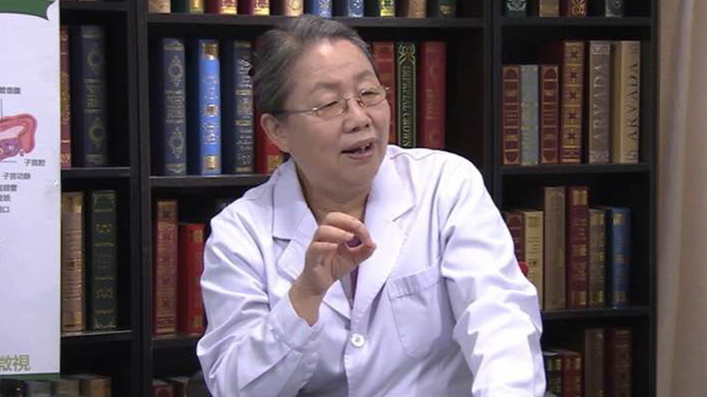

卵巢早衰
========

何方方 主任医师
---------------

   1678424381905

北京协和医院生殖中心创始人 主任医师 硕士研究生导师；

新加坡国立大学临床胚胎学硕士；曾任中华医学会生殖医学分会第二 三
四届常委；中华医学会生殖医学分会临床学组第一届常务副组长；北京医学会生殖医学分会第一届副主任委员。

**主要成就：**
筹建了协和医院辅助生育中心并获协和医院首例试管婴儿妊娠成功，填补了协和医院在辅助生育领域的空白。

**专业特长：**
擅长妇科内分泌相关疾病的诊治，如异常子宫出血、闭经、高泌乳素血症、多囊卵巢综合征、绝经期综合征及相关疾病等，尤其对于不孕症的诊断处理及促排卵治疗、辅助生殖技术(试管婴儿)积累了丰富的临床经验。
