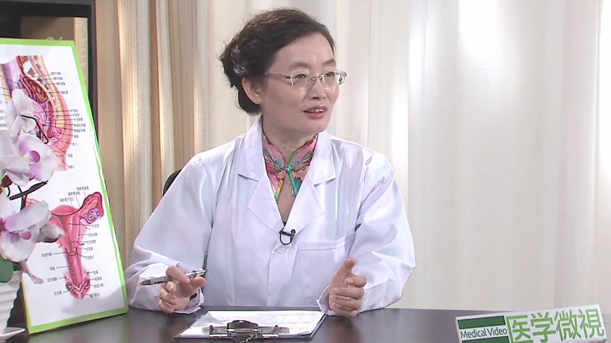

# 1.56 卵巢组织冻存移植技术

## 阮祥燕 主任医师

首都医科大学附属北京妇产医院内分泌科主任 主任医师 ；

首都医科大学妇产科学系副主任 博士生导师；中华医学会妇产科分会绝经学组委员 妇科内分泌学组委员；国际妇科内分泌学会中国妇科内分泌学分会主席 ；国际妇科内分泌学会执行委员会委员 ；德-中妇产科学会（中方）副主席；《Gynecological Endocrinology》副主编及中文版主编。

**主要成就：** 主持国家自然科学基金等科研项目40余项，发表论文论著200余篇，SCI 50余篇，累积影响因子近100分；致力于激素与乳腺癌的基础与临床研究，PCOS、POI的临床研究、卵巢组织冻存与移植的研究等；系列研究获得两次全国妇幼健康科学技术奖，中国女医师协会五洲女子科技奖临床医学科研创新奖等，并多次在国际大会上荣获最佳壁报奖、科学创新奖等。

**专业特长：** 擅长于多囊卵巢综合征、早发性卵巢功能不全、更年期综合征以及异常子宫出血等疾病的诊断与治疗。在女性生育力保护方面开展了卵巢组织冻存移植等技术。

---

## 卵巢组织冻存移植技术是怎么回事？

（采访）卵巢组织冻存与移植技术是怎么回事？

目前卵巢组织冻存移植技术，在全世界都是非常热点的一个话题，最主要的人群就是任何青春期前的孩子，或者是育龄期的女性患者，如果各种疾病所需要的治疗，手术、放疗或者是化疗，预计要对卵巢功能造成不可逆的损伤，在这种损伤之前，我们先取出一部分卵巢组织冻存起来，保护起来。

等对她卵巢功能有损害的各种治疗结束之后，癌症临床痊愈之后，我们再把这个冻存的，保护起来的卵巢组织再移回自体，继续发挥卵巢功能的正常作用。既可以恢复患者的生育能力，也可以恢复卵巢的内分泌功能，这个技术就叫卵巢组织的冻存移植技术。

（采访）我们卵巢组织冻存移植技术，在国内和国外现在已经发展到一个什么样的程度了？

这个卵巢组织冻存和移植技术，首先是在国外发起，在2004年利用卵巢组织冻存移植技术诞生了第一个孩子，这可以说是生殖力保护领域的一个里程碑。

中国起步比较晚，2010年我在德国学习的时候，发现了他们这个卵巢组织冻存移植技术，当时我们国内也是空白，我发现之后，我认为这个技术在中国有大量的人群非常需要，特别是我们中国传统的一个国家，还是非常重视传宗接代的。

很多的放疗和化疗在挽救癌症患者生命的同时，导致了卵巢功能永久的彻底的衰退，患者人活着，但是再也没有生育孩子的这种机会，如果说把这项技术移回来，那样也可以使我们中国的患者享受到国际医疗的服务。

在2010年我在德国学习的时候，他们已经是对癌症患者生育力保护有一个常规，但是中国没有，所以在这种情况下，我也是历经了7-8年的努力，把这项技术移到中国。

2012年我们在首都医科大学附属北京妇产医院，建立了中国首个卵巢组织冻存库，建库也是非常的艰难曲折，因为当时中国没有人知道卵巢组织冻存库怎么样来建。

2015年也是非常感谢我们北京市外国专家局请到了国际专家，在他们的帮助下，我们建立了中国的卵巢组织冻存库，在2015年我们进行了首例卵巢组织冻存。

2016年9月份我们才进行了中国首例冻存卵巢组织的移植，而且这个移植是成功的。

（采访）现在国外卵巢组织冻存移植技术成功了多少例？

目前在国际上利用这个技术已经有130多个孩子诞生，这个技术叫“冷的启动，变得越来越热”，现在随着全球癌症治疗效果的提高，五年存活率也明显的增高，所以对生育力保护的需求，可以说全球都是急剧增加的。

---

## 卵子冻存和卵巢组织冻存有什么区别？

（采访）冷冻卵子与冷冻卵巢到底是怎么回事？它们有什么区别？

卵巢是包含有非常多的卵子，我们叫卵细胞，女性她在妈妈怀孕20周的时候，她的所有的卵细胞，也就是说卵子数是一定的，大概六七百万个，在一生中99%的卵细胞都闭锁，凋亡，我们用老百姓能够懂的话，就是说99%的都死亡了，只有大概不到1%的生长，发育，成熟和排出，发挥着孕育后代的功能，在卵子的发育成熟过程中，会产生雌激素，营养着女性，维持着各种生理功能，还能防护各种慢性病的及早发生。

卵子的冻存只是说通过大剂量的促排卵的药物，促出一部分卵细胞，让它一批成熟几个，甚至十几个，这是比较多的，把这个卵子冻存。

卵巢组织冻存是切除一部分卵巢皮质，它里面包含了成百上千，甚至上万的卵细胞，把它冻存。

卵子冻存和卵巢组织冻存的生殖储备能力是不一样的，卵子的冻存可能只有几个，好的有十几个，但是卵巢组织冻存，冻这一块卵巢组织，可能有成百上万的卵细胞储存在那里，所以生殖潜能，内分泌功能，和卵子冻存相比都是非常巨大的。

---

## 胚胎冻存和卵子冻存有什么区别？

胚胎冻存就是卵子相当于种子，那这个种子是来自于女性，精子也相当于种子，那这个种子是来自于男性，精卵结合之后才可以孕育一个孩子，孩子的最前身就是胚胎。精卵结合之后，一般培养两三天或者四五天的时间，然后把它冻起来，将来在适合的时候再移回去。

胚胎冻存和卵子冻存有相似之处，就是说都需要经过两周左右的促排卵，让很多的卵细胞再同时成熟，发育，能够取出来，这样精卵结合。

胚胎冻存是必须有男性伴侣，或者是有丈夫，或者是有男性的同伴。胚胎冻存在中国适合于不孕不育的夫妇，就是说的确是不孕不育了，如果在一批刺激促排卵的过程中，有很多卵细胞，然后配成了很多的胚胎，根据年龄不同，可能一次移植一个，两个，三个，剩余的胚胎冻在那里，如果这一次不成功，将来再移植。

卵子的冻存就是只要是育龄期的女性，都可以做卵子的冻存，但是在中国，我们是有一些医学方面的适应要求。卵子冻存只是说那些做试管婴儿的人，就是不孕不育的患者有三证齐全，在取卵的这一天，刚好男方的精子取不出来，这个时候会把卵子冻起来，等到取出来精子再进行受精。这是冻卵子和冻胚胎。

---

## 卵巢组织冻存、卵子冻存和胚胎冻存，分别适用于哪些人？

（采访）卵子冻存，胚胎冻存和卵巢组织冻存，这三种保护生育力的方式，现在主要是应用于哪些人群？

各种冻存都有适应人群，像卵巢组织冻存更适合于那些癌症的患者，后面比如说要进行放疗、化疗，这种放疗、化疗不可避免的要影响到她的卵巢功能，这些是可以考虑卵巢组织冻存。

当然如果这种化疗和放疗不是特别紧急，不是说两周内我必须启动，那也可以考虑进行卵子的冻存。这个就是首先进行药物促排卵，促排卵一般需要14天左右的时间，在促排卵的过程中，卵子如果能够长起来，取出卵子进行冻存。

当然也有两种方法结合的，像这样的病人，冻了卵子，也可以同时冻卵巢组织，这样将来有孩子的机会，卵巢功能恢复的机会可能是更高一些。

胚胎冻存的选择就是她是有性伴侣，至少在国外是有性伴侣，在我们中国必须是不孕症的患者，但是对于癌症病人要求更加人性，就是说她只要是有性伴侣就可以。卵子取出来之后，可以跟精子在体外受精，然后胚胎冻存在那里，等她将来疾病治疗结束之后再移回来。

另外卵子冻存和胚胎冻存，如果说这个病人她是激素依赖性的肿瘤，在刺激促排卵的时候要产生大量的雌激素，这种雌激素可以导致激素依赖性肿瘤，比如说乳腺癌、子宫内膜癌，癌细胞的快速增殖，这种情况下如果是冻卵子、冻胚胎，都有促进肿瘤快速增长的风险，所以这种情况下，国际上还是主张以冻存卵巢组织更加安全。

（采访）所以就是如果有一些风险性的话，可能冻存卵巢组织更加安全一些，如果其他没有风险的，可以选择其他两个方式，有时候是合起来用的。

对。

（采访）我们说的胚胎冻存、卵巢组织冻存，还有卵子冻存，这三种方式哪一种最常用？

其实最常用是胚胎冻存，它是一个临床常规的技术，就是我们做试管婴儿的人都是这个胚胎移不完，一般都要冻起来的，这是最成熟，全世界最常规的技术。

再一个就是卵子冻存是2012年才开始用到临床的，根据某些实验室的条件不同，复苏后这个卵子的成活率还不是特别高，还是有一定限制的，当然有些实验室可能复苏后，卵子的成活率高一些，有些还达不到很高的水平。所以我在欧洲学习的时候，老实说如果说第二天手术是一个卵子冻存的女性，我就睡不好觉，因为压力很大，这个卵子比较娇脆，哪一步有问题它都活不了，但是这是一次性的。

（采访）是，所以胚胎冻存还是比较常用的。

胚胎冻存是个常规技术了，不是新技术，卵子冻存相对新一些，但是它有适应范围，卵巢组织冻存是一个最新的生育力保护的技术，也是国际上认为非常有潜力的一个技术。

---

## 哪些人可以做卵巢组织冻存移植？

（采访）什么样的女性她就可以选择卵巢组织冻存移植技术，来保护生育力？

第一个是恶性肿瘤或者是恶性疾病，后面需要进行放疗、化疗，或者是要进行其他的对卵巢功能有损害的这些治疗的时候，可以选择进行生育力保护。

这些疾病包括很多种，像白血病，特别是霍奇金淋巴瘤、非霍奇金淋巴瘤，她们一旦确诊需要很快进行化疗，这些人是属于不能等待的，急症的病人是最适合进行卵巢组织冻存的。

还有一类就是乳腺癌的病人，乳腺癌和雌激素有关系，雌孕激素受体是阳性的，雌激素、孕激素它本身没有致癌作用，如果说有癌细胞存在，它是可以促进癌细胞的快速增殖的，所以这个时候如果说要冻卵子或者是冻胚胎，都需要进行两周左右的促排卵，这个促排卵促少了，卵子少，促的越多，产生的雌激素越多，大剂量的雌激素就对乳腺癌有很大的风险。

所以乳腺癌患者最好就是冻卵巢组织，不需要进行促排卵，就做两天准备就可以了，就是腹腔镜下取一侧或两侧卵巢组织，可以取一半以上，如果说将来放化疗，对残存的卵巢没有影响，它可以继续发挥作用，如果有影响了，没有功能了，我们再移回来，这个能够很好地保护生育能力。

还有就是青春期前的孩子，这个技术在儿科广泛的不被人知道，但是等这孩子长大之后，得了癌症之后要进行放疗、化疗，等放化疗结束之后，等到成人，比如十三四岁还不来月经的时候，这个时候到医院一判断说卵巢功能早衰，全家都会在那哭，但是这个时候后悔已经晚了。

所以最需要做卵巢组织冻存的就是这些孩子，因为这些孩子她的下丘脑-垂体-卵巢轴系是不成熟的，这个时候青春期还没有发动，没有办法给她促排卵，没法冻卵子，更不可能冻胚胎，唯一保护生育能力的方法就是冻卵巢组织。全世界最小的冻卵巢组织的孩子只有半岁，我们北京妇产医院卵巢组织冻存库冻存的最小孩子也是四岁。

（采访）孩子的卵巢没有完全发育成熟，能冻存吗？

卵巢没有发育成熟，是因为青春期发动没成熟，但是卵巢已经在那长着了，就是说这个孩子卵巢比较小，但是卵细胞已经在卵巢里面了，大概每个人最高峰的时候有六七百万个的，它该有多少，定数已经在那里了，只是说体积小，但是密度非常高，所以就切一块组织能包含很多的卵细胞，所以她们没有任何其他选择，卵巢组织冻存是唯一的选择。

还有一些良性疾病也可以考虑冻存卵巢组织，像良性肿瘤进行止血的时候，我们说的通俗一些也会把那些卵细胞给“烧死”，影响到卵细胞，所以在处理的时候，可以切一块卵巢组织，把它冻在那，她真的卵巢功能衰退了，我们再移回去，这也是适用的人群。

还有就是高龄，比如说现在很多事业尚未成功的人，这些人她可能年龄很大了，还没对象，可能要孩子还是很多年后的事情，这时候卵巢功能已经不好了，那么她可以考虑选择卵巢组织冻存，也可以选择卵子的冻存，但是卵子冻存在国内不允许。

另外还有一些遗传病的，像Turner综合征，这样的孩子她肯定会绝经早，而且她如果还比较小，离她结婚，生孩子还有很长时间，因为残存在卵巢内的卵细胞，每个月如果说有一个卵细胞成熟的话，它会有一批卵细胞跟着凋亡，所以这个时候可以把卵巢冻存一部分，等到这孩子卵巢功能衰退了再移回去。

这是目前国际上的这几大适用的人群，就是有这种情况，可以考虑选择冻存卵巢组织。

（采访）就是像您说的这些情况有没有一个筛选的标准？

第一个就是一定要年轻，如果已经绝经了，再冻存的价值也不是特别大，我们国际上有一个限制说，最好是35岁以下的，遇到这种情况可以考虑冻存。

另外我们冻存是为了移植，移植要有安全性，这个癌症没有转移到卵巢，这是非常重要的选择，当然我们在冻存之前，要做各种的检查和判断，还要做病理。

还有就是说这个疾病预后比较好，如果说短期存活不长时间了，也没有必要去做冻存，所以这个是最基本的三大条件。

---

## 为什么卵巢组织冻存移植技术，是唯一适合青春期前患者保存生育能力的方法？

（采访）为什么说卵巢组织冻存移植是唯一的青春期前的患者需要考虑的这样一个技术？

所谓青春期前就是说青春还没有发动，没有雌激素的产生，卵泡还没长，要青春期之后，在促卵泡素的刺激下，卵泡每个月从小到大，叫生长，发育，成熟和排出，产生雌激素，第二性征也发育了，个也长高了，人也漂亮了，另外这个时候如果有性生活，不避孕的话可以怀孕。

青春期前，下丘脑和垂体产生促卵泡素非常非常的低，它不能诱发这个卵细胞的生长和发育，打促排卵的针也长不起来，这个时候也不能打针，所以要保护她只能冻卵巢，把这个卵细胞冻起来，等她到了青春期，比如说十三四岁，这时候再把卵巢组织移回去，移回去之后，乳房会发育，第二性征会发育，发育之后会恢复月经，月经恢复之后，等她将来结婚了照样可以孕育孩子。

---

## 卵巢组织冻存移植技术是要取出整个卵巢吗？会导致患者激素分泌异常或提前绝经吗？

（采访）卵巢组织冻存移植技术是要把整个卵巢都取出来吗？

卵巢组织冻存和移植它也是很个体化的，理论上讲为什么要做这个技术？就是因为患者后续的治疗会严重地影响她的卵巢功能，甚至完全破坏卵巢功能，卵巢组织取出来越多，对她的保护就越强，将来移回去成功率就越大。

现在说的是我们至少取一侧卵巢的1/2，就是取出来1/2，它有一定的组织，将来我们移回去成功把握大一些，这是起码的。

如果说能取出来整个卵巢，那当然更好，因为可以保护的卵巢组织就更多，当然如果预计到后面的治疗，对她卵巢功能可能造成百分之百的损害，那可以把两侧都取出来，我认为这都是可以的。

当然如果病人有心理作用说给我卵巢都取了，心里感觉到好像不太好接受，那我们就取一部分。所以这个根据病人的情况，根据疾病治疗，对卵巢的危害，医生会尽量给患者建议，让患者自己来选择。

（采访）取出卵巢会不会影响卵巢的雌激素分泌？

对，这也是大家非常关心的问题，也是很好的问题。在《新英格兰医学杂志》上有一篇综述，它是对很多的普通正常人临床手术做了一个观察性的研究，没有发现从一侧卵巢上取多块卵巢组织会影响卵巢的激素分泌。

第二个就是切除一侧卵巢，绝经的时间也只能提前1-2年，就是说可能提前1-2年，就是说切了一侧卵巢可能影响也不大，这是正常的人。

我们要做的这些患者，她都是要进行放疗和化疗的，我想取的这一部分卵巢组织对她是没有影响的，更多的是保护。

（采访）所以就是不会像大家比较担心的那样，会影响到雌激素分泌，只是会提前绝经1-2年而已。

提前绝经1-2年是指正常的人，对于这些患者如果完全不取卵巢组织，提前绝经也不止1-2年，可能放化疗后立即绝经了，所以对患者是保护。

---

## 卵巢组织冻存移植技术是如何取卵巢组织的？最佳时机是什么时候？

（采访）取卵巢组织手术是怎么做的？是要开刀，还是微创？

一般情况下如果说单纯就是为了给患者进行冻存，微创就可以，微创相当于一个附件手术，就是说比较小的一个手术，有的也可以切一侧卵巢，也可以两侧卵巢各取1/2或者1/2以上，这个是比较简单的一个手术，创伤也比较小。

当然还有一些病人刚好就是癌症病人，她要再做大手术，癌症本身可能这样治疗，更好暴露，更好手术，这样她还可以开腹手术。这个开腹手术主要目标不是为了冻卵巢，冻卵巢组织是顺带的，在做手术的同时，就把卵巢取出来一部分，顺便的来进行冻存，冻存没有额外的导致这个病人单做一次手术，所以这种就更值得去做。

（采访）这个手术是选择全麻，还是局麻呢？

手术一般都是要全麻的，因为不管是腹腔镜手术，还是开腹手术，至少是中等手术或者大手术，因为是癌症病人，所以是需要全麻，局麻也不舒服。

（采访）什么时机取卵巢组织最好？

像很多癌症病人，比如说后面很快要准备放疗或者是化疗，这个时候癌症一旦确定诊断，医生应该尽可能早的告诉病人，有哪些生育力保护的方法，那病人一旦确定了选择，我们就尽可能早的给她安排手术，尽量地不耽误她后面的这些放疗和化疗。

所以这个时机是根据病人的情况决定，但是最好是避开月经期，如果正来月经，妇科手术不是特别方便，其他的没有额外特别的限制。

（采访）取卵巢组织手术的风险大吗？

像任何的手术一样，就是切个皮下的一个囊肿或者是一个脓肿也有风险，所以任何情况下，我们都不能说没有风险，手术可能的意外，麻醉意外，其他的相关的一些可能的风险，都会跟病人谈到。

但是这个风险常规情况下的都是非常低的，我们冻存了160多例患者的卵巢组织，单纯的冻存手术，目前还没有一例发生任何意外。

---

## 卵巢组织冻存移植技术：在取卵巢组织前需要做哪些准备？

（采访）取卵巢组织之前，需要做哪些评估或者是检查？

取卵巢组织它本身也是一个手术，所以常规的手术检查是要做的，对特别的卵巢组织冻存，我们是要评估进行冻存前的卵巢功能怎么样，我们要测一下激素的水平，还有卵巢储备功能，还有一个评价指标叫抗苗勒氏管激素，这两项我们是必须要查的。

（采访）这个检查出来结果怎样就可以做这个手术？

如果说检查出来还没有绝经，没有达到绝经水平，又没有孩子，或者对生育有很大的渴望，年龄在35岁以下，当然也根据病人的情况，有的人虽然超过了35岁，卵巢功能还可以，我们也可以适当的延长这个年龄，如果说这样的情况下，我们可以考虑给她冻存卵巢组织。

（采访）患者在这个手术之前需要做什么准备吗？

患者做的准备，我认为最重要的是信任医生，信任是非常重要的，我们做这项工作就是对病人非常有利的，非常好的，但是毕竟很多医生知识面不一样，有的地方可能听都没听说过这个技术，然后患者可能就会打电话东问问，西问问，有的大夫告诉她先保命，再说生育力保护的问题，所谓先保命就是先去进行放疗和化疗，把癌细胞杀灭完了再说。

癌细胞杀灭完了，卵细胞也杀灭完了，这个时候让我来保存，我已经无能为力了，所以这种时机非常重要，这个是病人应该准备的，最应该准备的就是信任一个就在这个方面很有经验的医生，很重要。

（采访）因为可能大家对这个技术还不是特别的了解，就可能会东问西问，但是在放化疗之前，其实最重要的是先把保护生育力做好。

对，这一点一定要特别强调，一定要把先保命，再说生殖的这个概念彻底转变过来，因为保命和保生育能力的这个问题是可以同时进行的，生育力保护应该放在前面，然后命同样要保得更好。

---

## 卵巢组织冻存移植技术：取出的卵巢组织该如何保存？

（采访）取出的卵巢组织它是如何进行保存的呢？

在取卵巢组织之前，我们要跟病人进行非常好的沟通，同时我们还要和手术医生进行非常好的沟通。

在卵巢组织取出来之后，我们有一个特别的转运装置，里面放着特别的转移液，这个组织取出来之后，要立即放在转移液里面，我们要保持在4-8度这个恒温下，快速运到卵巢组织冻存库进行处理，如果说任何一个环节脱节，这个卵巢的卵细胞可能都会死亡一部分，所以都不能保持卵细胞很好的活性。

另外就是我们取出来之后，一般我们在手术之前至少一两天，要进行卵巢组织冻存库的准备，充分的消毒，各种物料的准备，组织来了之后，我们要进行这种特别的处理。这个处理不是说把卵巢完整的冻在那，放在一个冰箱里，或者是放在一个液氮罐里，一定要非常精细地进行各种的处理，把它处理成一个一个的小的组织片，每一片放一个管子里面，我们叫冻存管，这个管里面也都是特别的冻存液，然后再通过这种冷冻的程序保存。

这个程序也是很复杂的，这个程序方面有一个温度出现问题，将来卵巢组织移植后就不会活，卵细胞都是死的。冷冻完之后，储存在冻存管里面，这是整个过程。所以每一个过程，每一个环节都有非常严格的质量控制。

（采访）这个冻存非常的不容易，非常的复杂，而且一旦一个不小心卵细胞可能就不会活。

对的，所以说这个核心技术就是冻存库。

（采访）冻存卵巢组织可以保存多久？

冻存卵巢组织，在国外人家有开始冻存，到移植，到成功都是需要很多年的，目前他们冻存的卵巢组织有20年的，我们从2015年开始到现在有3年了，但是像我们移植的这几例，在复苏的时候发现卵巢组织的活性，卵细胞的活性都是百分之百，就是和冻存前是一样的，说明我们这个冻存技术达到了国际一流水平。

---

## 卵巢组织冻存后，什么时候可以移植回体内？

（采访）我们冻存的卵巢组织，什么时候就可以移植回去？

我们现在冻存了160多例，现在移植了4例，为什么只移植了4例？移植是要有时机的，特别是癌症病人，我们要等待她的癌症治疗完全结束，至少结束后三个月，半年以上才考虑移植，还要我们肿瘤的专家来评估，肿瘤算是临床治愈了，不再进行治疗了。

第二个还要观察，前面的肿瘤的治疗已经导致残留的卵巢功能彻底衰退了，这个时候我们才可以移植。

（采访）也就是说第一个就是这个癌症患者或者是病人，她先把自己的病治好。

肿瘤的治疗结束至少3-6个月之后再考虑移植，而且目前要测定残存的卵巢功能已经彻底衰退，我们才会移植。

（采访）如果她卵巢功能还有一定的功能就不移。

对，等待。

（采访）绝经以后是不是就不能移植了？

我们移植的时机就是病人的卵巢功能衰退，所谓的卵巢功能衰退就是绝经，只是说她的绝经年龄不是自然绝经年龄，比如说今年才20岁，20岁就绝经了，正常的绝经年龄是49岁，绝经后我们才可以移植的。移植之后，如果说卵巢是20岁的时候冻存的，可能在40岁或者是35岁之后才开始移植，移植的时候卵巢还是20岁，比如说我们冻存最小的这孩子4岁，她如果到十三四岁移植的时候，她的卵巢还是4岁。

所以说冻在这，这个卵巢的年龄就定在这了，人的年龄还在继续往前。如果说这个卵巢一直放在体内，到了35岁，卵巢也是老到了35岁，到了45岁，卵巢老到了45岁，就是说这个时候可能已经没卵了，在体内的37度体温下的卵子可能都跟着凋亡了，但是冻在这里，就是保存得比较完好。

目前我们来看，我们的复苏之后几乎没有损耗，就是几乎百分之百的卵细胞是存活的。

（采访）就是几岁冻的这个卵巢，到时候还是几岁的卵巢。

对的。

---

## 冷冻卵巢组织移植前后需要辅助用药吗？

（采访）在卵巢组织移植前或者是移植之后，需要辅助用药吗？

在移植之前，因为从卵巢的放化疗结束之后，到移植之前还是有一段时间的，很多人是放化疗结束，卵巢功能立即衰退了，有很多更年期症状出来，特别难受，这个时候我们还是要考虑干预。

干预就要分析可以不可以进行激素替代治疗，比如说乳腺癌的病人，她如果雌孕激素受体是阳性的，她就不能，只能看可以用哪些中成药，我们可以不可以加一些中成药，植物药，给她缓解一下症状。在移植之前，有的能用激素治疗的，我们加激素，能用中药治疗的，我们加一些中成药，可能降低卵巢凋亡的速度，这样是个保护。

另外移植之后，我们有时候也建议她加一些中药或者中成药，可能能够减缓移植回的卵细胞的凋亡，我们也希望将来中药方面有更好的潜力，能够在保护卵巢功能方面进行探索，现在实际上我们也在做很多这方面的研究。

（采访）除了药物还需要做哪些工作吗？

除了药物，移植之后一般一个月，两个月，三个月会定期让患者回来监测，监测移植之后卵巢功能到底什么时候能够恢复正常？所以我们要来评估，看看她的症状，激素水平，还有我们也要做B超，像激素提示卵巢功能恢复正常的时候，我们开始做B超监测，看看有没有长卵细胞，如果有子宫的话，再观察她月经有没有恢复。

（采访）就是观察她的卵巢的一个恢复情况。

对。

---

## 冷冻卵巢组织是如何被移植回体内的？

（采访）卵巢组织的移植过程大概是怎样的呢？

冷冻卵巢组织的移植，这是一个非常关键的步骤。

一般卵巢组织在-196度的液氮里保存，复苏移植前，我们有一块研究方面用的组织，先检测这块组织活性怎么样，如果说这块组织检测的活性，跟冻存前比是基本上一样的，或者很好，那我们第二天就可以进行移植。

卵巢组织移植一般是微创，也是要全麻的，跟它冻存取材的时候是一样的，手术本身不大，也是属于比较小的手术。移植包括原位移植和异位移植，现在在全球出生的130多个孩子，一般都是原位移植，只有一个是异位移植，盆腔的移植叫原位，或者是移植到原来残留卵巢的位置，或者是移植对应卵巢的腹膜这个位置，把腹膜造一个口，把卵巢复苏后的这种皮质的片贴在那，连续缝合一下腹膜就可以了，这个不复杂，但是还是技术要求很高。

移植时候要把这组织复苏，复苏之后一般我们是在非常快的时间内，现在国际上没有说到底是多长时间，我们现在就是在20分钟之内，把这组织移植到患者的体内，这样才能够保证卵巢组织，卵细胞的活性，几乎没有什么影响。

（采访）就是取出卵巢组织，包括移植回去的时候，都是需要争分夺秒的。

对的，所以说在上一周，我在我们全院交班会上报告我们医院的卵巢组织冻存移植的进展的时候，我说我们目前已经冻存了160多例，已经成功移植了4例，这4例的成功是归功于我们全院每一位的工作人员，包括我们现在有东院，西院，南院，也包括我们的电梯工，因为在复苏卵巢组织的时候，我们的电梯工要把我们复苏卵巢库的人员，从卵巢库快速运到手术室，所以每一个环节都是争分夺秒的。

---

## 冷冻卵巢组织移植后存活率高吗？风险大吗？

（采访）冷冻卵巢组织移植的存活率高吗？

这个存活率，目前像《新英格兰医学杂志》报道的，都是全世界很好的中心，移植之后这个组织能够95%可以存活，95%以上的可以存活，中国目前我们所知道的报道，北京妇产医院目前移植了4例，也是中国的4例，这4例患者的年龄也都比较大，实际上都超过了国际要求的卵巢冻存小于35岁的标准，我们还有40岁，40多岁的，移植后这4例都是成功的，所以说中国从这4例看，移植后卵巢组织存活是百分之百。

（采访）那就是有没有一些需要面临的风险？

所面临的风险就是说在移植的时候有可能把癌细胞移回去，这种风险是大家最担心的，但是我们在移植前会对这个风险来进行评估，比如说看看乳腺癌不是很晚期的，另外宫颈癌的病人，一般也很少卵巢会有转移的，再说在手术之前，我们也都对她进行了分期，卵巢要做病理检查，冻存的时候也对取出的卵巢组织进行病理的检测。

所以目前移植的这4例，没有出现1例移植回去癌细胞，国际上移植回去的人，目前也没有发现把癌细胞移回去的，当然因为大家都是非常谨慎的在进行各种的移植。

如果谈到风险，我们谁都不能说没风险，有的病人问我，我这个有没有风险？吃饭的风险最大，吃出来的糖尿病，吃出来高血压，那就不吃吗？因为要活命，肯定要吃，所以这个风险不可避免的，就是我们不能说没有风险，谁都不敢说，但是这个风险极低。

---

## 卵巢组织移植后需要监测哪些指标？

（采访）卵巢组织移植之后需要监测哪些指标呢？

卵巢组织移植之后，我们要监测卵巢功能恢复没恢复，这是医生最关心的。

监测恢复没恢复，首先这个病人的症状，更年期症状先出来，很多人出现出汗、潮热、烦躁、失眠，我们就问问移植后，这些症状有没有改善。

像我们的病人在移植一个月的时候，我就进行了更年期症状的评分，在移植前我也评分了，移植了一个月之后，她很多评分明显降低，但是这时候测她的激素水平，并没有恢复到我们认为的正常范围，我就很奇怪，我说你是心理作用吗？然后她就说还是自己原装的好，在移植之前她要用激素，但是症状控制不好，后来我们监测，一个是看症状，一个是测激素水平。

另外就是比如有子宫的人，要观察她有没有月经，当然是时间长了，她要有生育需求的，看她有没有怀孕可能，这是要观察的。

我们第一例病人移植到三个月的时候，她的所有激素水平都降到了正常，B超下也看到她有成熟卵泡长起来，因为她没有子宫，所以说我们就宣布这个冻存卵巢组织移植成功。

所以在北京电视台，中央电视台采访她的时候，她说我感觉这个移植的不是我的卵巢，而是一个小太阳，就是说感觉是满满的正能量。

（采访）所以说这个移植是否成功，除了医生需要监测的一些指征之外，其实最重要的还是卵巢是否恢复正常了。

对。

---

## 通过冻存移植后的卵巢和正常卵巢，功能有区别吗？能维持多久？

（采访）通过冻存移植的卵巢和正常的卵巢相比，功能有区别吗？

我们为什么要进行移植？就是因为患者后续的治疗要破坏她卵巢功能，因为治疗癌细胞的药物，既可以杀灭癌细胞，又可以杀灭卵细胞，所以我们在药物杀癌细胞之前，把含卵细胞的卵巢组织取出来，放在一个“保险箱”里，等它把癌细胞杀灭完了，我们再把它送回来，就是说它是自体的，完全没有特别的两样的，就是她自己的卵巢，所以如果说这个卵巢组织能够恢复正常，跟她原来是没有区别的。

（采访）卵巢组织移植之后，就是卵巢的功能是多久恢复正常的？

国外的报道有三个月到六个月的，还有更长时间恢复的，我们国内目前移植了4例，第一例是三个月恢复正常的，第二、第三例是四个月，这第四例又是三个月，所以说目前中国是3-4个月卵巢功能恢复正常。

（采访）3-4个月还是挺快的。

对，就是说很成功。

（采访）通过移植技术恢复的卵巢，它可以维持多久？

这也是很多人特别关心的问题，能够维持多久取决于她的卵巢冻存的时候卵细胞有多少，所以为什么国际上有个限制，说最好是在35岁以前，因为35岁以后本身卵巢老化，卵细胞就已经比较少了，当然年龄越大就越少。

冻存的卵巢组织里面卵细胞越多，如果技术很好的话，把它完全保护下来，移植后她的卵细胞，她的卵巢组织存活的时间就越长，如果冻的时候卵巢就衰了，移回去它也存活不长时间。

目前这种技术国际上，有几个人是22岁的时候冻存的，在移植之后，卵巢组织存活已经超过了11年，一般也可以存活4-5年，就移植一次存活4-5年的也有，移植以后存活2-3年的也有，是根据不同的情况决定的。

我们中国目前第一例移植完现在将近两年，她现在卵巢功能还好着的，还能维持多长时间，我们可以再往后看，所以说卵巢移植至少比冻卵子，冻胚胎要好很多，要是冻卵子只有这一次性的，怀不上就算了，后面就没有机会了，卵巢组织冻存，就会维持很长的时间。

还有如果这个人冻的卵巢组织比较多的话，比如说她冻了很多片，20片，甚至30片卵巢组织，我们一次也就移植三四片，这三四片没有了，我可以接着再移植其他的，所以又能维持很多年。

我们有一个再生障碍性贫血，骨髓移植的孩子，她是冻了一侧卵巢，处理的卵巢皮片就20多片，所以将来我们移植三四片的话，每三四片如果能维持几年的话，她能够维持的年数可想而知。

---

## 卵巢组织移植成功后，多久可以备孕？怀孕后会对胎儿有影响吗？

（采访）卵巢组织移植成功之后，多久就可以备孕了？

其实卵巢组织移植成功之后，立即就可以备孕，比如说我们移植三个月之后，如果说发现卵巢功能已经恢复正常了，那就建议病人可以要孩子了，有成熟卵子排出，她就有怀孕的机会，就可以不用避孕了。

（采访）其实就是只要卵巢恢复到正常的功能，就马上可以怀孕。

对，移植后就是正常人了。

（采访）备孕的过程当中，有什么需要特别注意的地方吗？

备孕的过程和普通人一样，像我们医院的，不管是移植的，还是想要孩子的，还是不孕症的病人，在备孕之前，我们也要测她全面的指标，比如说肝肾功能、血脂、血糖这些指标是否正常。

另外营养方面进行怎么样准备，我们可以测定，测定代谢率、脂肪含量、饮食调查，根据中国营养学的标准，现在饮食方面合理不合理？缺不缺各种维生素，微量元素？需不需要补？

所以这都要进行评估，她们移植之后就是健康的人，就是正常育龄女性，所以她所有的这些评估都是一样的，没有说对这个群体就会特别。

（采访）所以还是按照正常备孕的女性来进行一个评估。

对的，所以说我就告诉她们，别把自己当病人，现在都是正常人。

（采访）卵巢组织冻存移植之后，怀孕会对胎儿的健康有影响吗？

目前国际上从2017年的6月份，截止到2018年7月的数据，诞生了130多个孩子，报道说是健康孩子，就说没有发现他有问题，因为冻存的这部分卵巢组织，一般是没有进行过射线影响的，就是在放化疗之前，它应该是个正常的，冻存本身对卵巢组织没有影响。

再说真是有影响的卵细胞可能就长不大，可能就凋亡了，只有那些好的卵细胞才会生长，发育，排出，有受孕的机会，所以就是目前没有发现有影响。

（采访）其实只要是有正常的生育功能，有受孕的这样的一个机会的话，其实孩子就不会有什么特别不健康的地方。

对，目前没有，应该是和正常人群是一样的。

---

## 为什么建议乳腺癌患者去做卵巢组织冻存移植手术？

（采访）我们为什么要建议乳腺癌患者去做卵巢组织冻存移植手术？

乳腺癌患者她是一个特别的群体，现在乳腺癌病人她们60%以上都是在绝经前发病的，所以绝经前就是说她还有生育的能力，这些病人是更需要保护，往往是需要局部放射治疗，然后后面要全身化疗，化疗往往她要用到烷化剂，这个烷化剂对卵巢的，包括原始卵泡都是有损害的，所以化疗影响很大，应该进行保护。

第二个乳腺癌的病人除了放化疗结束之后，她还要进行5-10年的内分泌治疗，这是指对雌孕激素受体阳性的病人，它是抗雌激素，降低雌激素，10年的时间，卵巢功能又衰退到什么程度了？即使残存的卵巢还有点功能，再等5-10年已经没有了，所以她们更需要保护。

还有一个原因是乳腺癌的病人，她的子宫是完好的，输卵管是完好的，放射治疗放射不到子宫上去，对乳腺局部起作用，所以移植之后，她们的妊娠率也是最高的。当然保护有很多的方法，比如说有卵子冻存，胚胎冻存和卵巢组织冻存，为什么我比较建议病人去冻卵巢组织？

因为我和德国合作做过激素与乳腺癌风险研究，发现如果没有乳腺癌的时候，天然雌激素它是自身分泌的，可能不会导致癌细胞的发生，它不是致癌物质。

如果已经有癌细胞存在了，这个时候激素它能够促进癌细胞的快速增殖，所以这个时候如果说要冻卵子或者是冻胚胎，都需要进行两周左右的促排卵，这个促排卵促少了，卵子少，促的越多，产生的雌激素越多，大剂量的雌激素它就会导致乳腺癌很大的风险。

所以最好就冻卵巢组织，不需要进行促排卵，就做两天准备就可以了，就是腹腔镜下取一侧或两侧卵巢组织，可以取一半以上，如果说将来放化疗对残存的卵巢没有影响，可以继续发挥作用，如果有影响了，没有功能了，我们再移回来，这个能够很好地保护她的生育能力。

当然乳腺癌的分型是阴性的，如果雌孕激素受体是阴性的，它对激素的刺激就不是那么敏感，如果是没结婚可以选择冻卵子，结婚的人或有性伴侣的人，可以选择冻胚胎，当然也可以选择既冻卵子，又冻胚胎，又冻卵巢组织，这样成功率就更大。

因为三阴乳腺癌的病人，她要进行很大剂量的化疗，这个化疗几乎导致她卵巢功能百分之百衰退，所以她更应该进行保护。在我们的卵巢组织冻存库里面，宫颈癌是第一多的，第二多的就是乳腺癌的病人，像国外第一多的就是乳腺癌病人。

（采访）哪些乳腺癌患者可以使用卵巢组织冻存技术？

乳腺癌不管是雌孕激素受体阳性或者是阴性的，都可以用卵巢组织冻存移植技术，当然如果说期别很晚了，预后很差，就是Ⅳ期已经有很多的转移了，或者是卵巢已经有转移了，这种移植的风险就比较高，预后也不是太好，这个时候我们就不太建议来冻存了，也不建议进行生殖力保护。

---

## 淋巴瘤患者可以用卵巢组织冻存移植保护生育力吗？风险高吗？

（采访）淋巴瘤患者可以通过卵巢组织冻存移植技术来保护生育力吗？

淋巴瘤是最需要的，因为淋巴瘤它是比较急性的，需要紧急的进行化疗，是不能等待的那一种，化疗不能被延迟的，所以它是需要进行冻存，唯一的保护生育力的方法就是卵巢组织冻存，淋巴瘤转移到卵巢的风险还是相对比较低的，所以是属于低风险的。

（采访）因为淋巴瘤它属于急性的，所以卵巢组织冻存对于淋巴瘤来说也是首选。

唯一的选择。

（采访）哪些淋巴瘤患者可以使用冻存技术？

现在比较多的叫霍奇金淋巴瘤和非霍奇金淋巴瘤，霍奇金淋巴瘤在移植的时候比较安全，非霍奇金淋巴瘤移植的风险相对要高一些，所以它在移植的时候，我们要做更深入，更慎重的这种安全性的检测。

---

## 良性疾病患者可以做卵巢组织冻存移植吗？

（采访）非恶性疾病的患者可以做卵巢组织冻存吗？

非恶性的疾病，比如说再生障碍性贫血、地中海贫血都不属于恶性的，但是这些病的治疗要骨髓移植，骨髓移植前有两三天，甚至三四天的这种大剂量的化疗，这个化疗几乎导致百分之百卵巢功能衰退，所以她们必须进行保护。

我们现在有两个骨髓移植的病人，这两个病人移植是成功，骨髓移植百分之百成功，但是她卵巢功能衰退也是百分之百的衰退。好在是这两个病人在她进行入窗之前，都进行了卵巢的冻存所以说我们2018年9月份准备给她们进行移植。

另外还有像卵巢囊肿，如果说双侧卵巢都是囊肿，哪怕它都是良性的，这些人她也可以考虑冻存卵巢组织，因为有囊肿，又不太适合去刺激促排卵，要刺激到卵巢，囊肿也可能长得会更快一些，更大一些，在处理囊肿的时候，取一部分正常的卵巢组织，就是说取一侧卵巢的一部分或者是几块，对她并没有影响，所以这个时候也可以考虑保护。

另外还有就是子宫内膜异位症的病人，特别是双侧巧克力囊肿，在剥除的时候，有的是要电凝止血，有的现在考虑到生育力保护，给她缝合止血，不管是什么样止血，都会对卵巢的储备功能有很重要的影响，所以在进行电凝破坏卵细胞之前，取一部分正常的卵巢皮质冻在那里，真的等卵巢衰退之后，我们再移回来，子宫内膜异位症目前属于卵巢组织冻存的第二个适应证，以上这些都是良性疾病。

---

## 有遗传性疾病的人群可以做卵巢组织冻存移植吗？

（采访）针对家族史或者是基因检测有早发性卵巢功能不全的这样一种高风险的人群，建议她们做卵巢组织冻存吗？

像《新英格兰医学杂志》他们发表的文章里面，生育力保护的适应证里面，其中这就是一个适应证，因为这种人群，像特别是她本人有遗传性疾病，像Turner综合征的病人，她基本上都是早绝经，早衰，所以这些人一定要进行保护。

还有一个就是家族史，比如说妈妈或者是姐姐，都在40岁之前绝经了，本人可能绝经的风险可以高达80%，这种也可以考虑保护，如果说她结婚了，我们建议她早点要孩子。

（采访）建议什么时候去做卵巢组织冻存？

我们检测她的卵巢功能还可以，还没有衰退的时候去做，如果说已经衰退了，这时候做意义已经不大了，一旦发现尽可能早做。

---

## 健康人可以通过卵巢组织冻存移植技术来抗衰老吗？

（采访）健康的人群可以使用卵巢组织冻存移植技术吗？

这个是很热点的问题，健康的人当然是需要，比如说在年轻的时候，刚好遇到手术或者是特别的情况，开腹了，这个时候顺带的取一部分卵巢组织，因为取的这一部分不影响她目前的卵巢功能，可以冻在那，等到绝经后再把它移回去，这是国际上抗衰老的一个热点话题。

（采访）建议的是冻卵子，还是冻卵巢？

冻卵子最主要是为了想生孩子，解决不了卵巢的内分泌功能，代替不了，冻卵巢组织它移回去是为了恢复卵巢内分泌功能，包括更年期症状不会发生，还有减少各种慢性病的发生，像心血管疾病、骨质疏松、老年性痴呆，还有性生活的问题，这是卵巢组织冻存和卵子冻存的巨大区别。

而且冻卵子是一次性的，但可以多取几次，但是如果说单纯为了生孩子，就可以冻卵子，如果说想抗衰老，或者说恢复卵巢内分泌功能，让它维持很长时间，我就不用激素替代治疗了，我用自己的卵巢，就是冻卵巢组织。

---

## 我国卵巢组织冻存移植技术的发展现状是怎样的？

（采访）作为我国卵巢组织冻存移植技术的带头人，您能给我们介绍一下，目前国内技术的现状是怎样的吗？

卵巢组织冻存移植技术，就是2010年我在德国发现，2016年我们首例冻存移植成功，这期间历经了将近7-8年的时间，在这期间我和我的团队都是在无私的奉献和付出，也非常感谢在这个过程中，我们很多国家的项目，像国家外国专家局，北京市外国专家局，还有北京市医管局，北京市卫计委，还有北京市科委，都给了大量的这种项目的支持，还有我们邀请国际专家的这些支持，才能够把欧洲的临床常规技术，创新性的平移到中国。

目前我们做的卵巢组织冻存库，或者是我们移植后的成功率，应该都是国际一流，我们现在冻存的卵巢组织有160多例，现在移植了4例，比如说卵巢组织移植后，国际上现在报的存活率是95%，当然我们还比较少，移植了4例，但是这4个都成功了，可以说是100%，我们也非常高兴，在中国目前有这需求的女性朋友，她能够足不出户地享受到国际医疗的服务。

同时我们首都医科大学附属北京妇产医院卵巢组织冻存库，也是一个国际生育力保护中心，这个中心的团队既是我们国际一流的团队，最主要由北京妇产医院的冻存库，还有临床各科的专家组成。同时我们有个非常重要的国际团队，给了我们非常强烈的支持，我们遇到比较疑难的病人时还要随时讨论。

当然这个国内团队里面，目前已经不限制于妇产医院了，已经是一个全国的团队，我们已经制订了《卵巢组织冻存与移植中国专家共识》，这个专家共识是由50个国内的各个领域的专家，包括有乳腺的专家，有妇产科的专家，有儿科的专家，血液科的专家，共同的参与制订这个共识。

这个共识发表在《人民日报》主管的《中国临床医师杂志》，是希望这个技术不仅是限于妇产科，应该是推广到全国，我们各个医生都要知道，包括妇产科，肿瘤科，乳腺科，血液科，儿科，它一定是个多学科交叉的，一定要把这个信息告诉给我们的全国的人民，每个人都要知道这个信息，有需求的时候告诉身边的人，这可以说是一个造福万代的事业，对我们中国人来说是一个非常重要的事情。

我知道把这个新的技术引到中国会遇到很多的困难，很多的不容易，但是为了病人，我们还是这么做了，是因为很多病人到北京，到我的门诊，当诊断卵巢早衰的时候，她们全家在那哭。

我在网上看到过一个叫于娟的人写的《癌症日记》，她是乳腺癌的病人，她写道我不在乎乳房的去留，我很在乎深埋在体内，体现女性性征的这个卵巢零件，她希望保护卵巢，虽然得了乳腺癌，但是也希望再有一个孩子。

我是一个妇科内分泌的专家，我的任务就是尽我的能力，和我们的团队，国内国际团队，为我们的广大女性进行卵巢功能的保护，也希望我们的媒体，我们的《医学微视》，我们共同努力，把这项工作推向全国。

---
