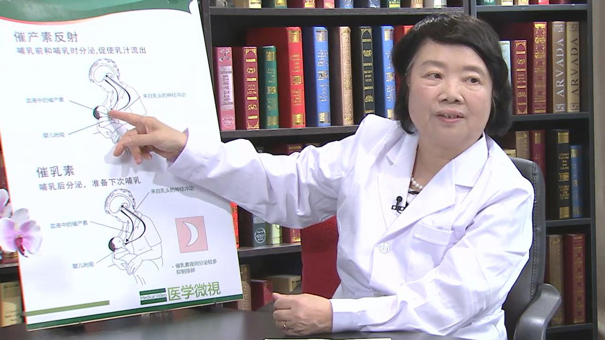

母乳喂养
========

戴耀华 主任医师
---------------

   1678425981500

世界卫生组织儿童卫生合作中心主任 研究员 博士生导师
享受国务院政府特殊津贴；

中华预防医学会儿童保健分会主任委员；中国妇幼保健协会常委兼儿童早期发展专业委员会主任委员；北京优生优育与妇幼保健协会副会长；世界卫生组织儿童和青少年卫生和发展专家执委会成员；《中国妇幼健康研究》副主编；《中国儿童保健杂志》副主任编委。

**主要成就：**

目前承担的科研课题主要有卫生部、世界卫生组织、联合国儿童基金会的合作科题，如“儿童疾病综合管理”“儿童喂养和营养”“儿童早期综合发展”及“儿童铅暴露防治”等，发表几十篇论文；
主编或参加编写了《儿童疾病综合管理》《儿童少年卫生与妇幼保健学》《儿童保健学》等10多部专著及多本科普读物。
