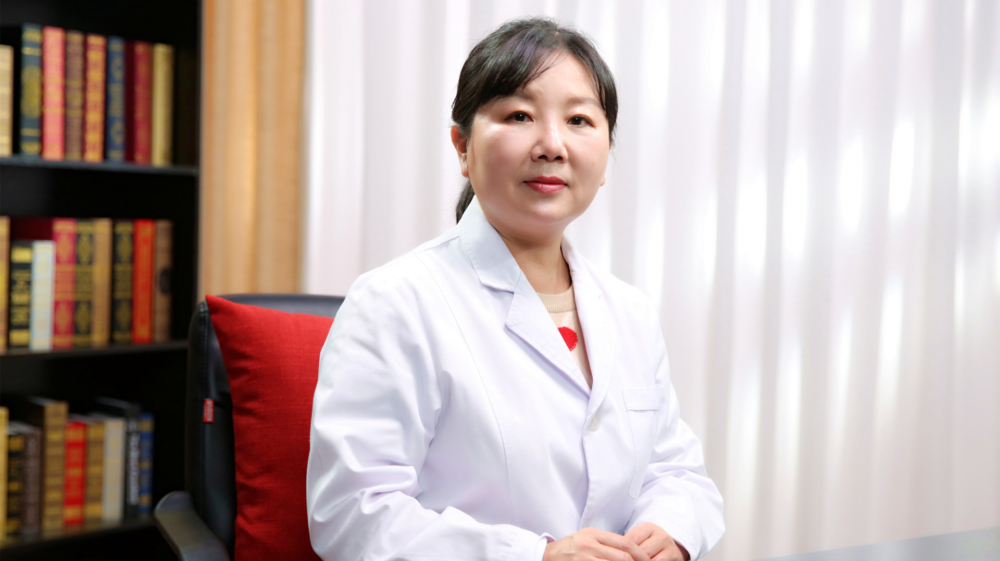

# 1.62 女性绝经后骨质疏松

---

## 孙丽芳 主任医师

北京积水潭医院妇产科 主任医师 院工会主席；

中国医师协会子宫内膜异位症专业委员会委员；中国研究型医院学会妇产科专业委员会委员；北京医学会妇产科学会委员；北京中西医结合学会围产医学专业委员会常务委员；北京女医师协会妇产科专业委员会常务委员；《中国妇产科临床杂志》等特邀审稿专家。

**学术成就：** 以第一作者及责任作者发表论文50余篇，其中SCI收录论文7篇；致力于妇科内分泌疾病、孕期和围绝经期骨质疏松的基础及临床研究，在研课题三项。

**专业特长：** 从事妇产科临床工作30余年，有丰富的临床经验。擅长于围绝经期骨质疏松症、妇科内分泌疾病、子宫肌瘤、子宫内膜异位症、卵巢肿瘤以及妇科恶性肿瘤等诊断与治疗，成功完成宫腹腔镜等微创手术数千例。

---

## 正常绝经年龄是多大？绝经后会出现哪些症状？

（采访）我们正常来说女性的绝经年龄是在哪个阶段？

正常的绝经年龄应该是在45岁到55岁之间，40岁之前绝经，我们称为卵巢功能早衰，但如果在55岁以后还没有绝经，我们就称为绝经延迟了，所以正常年龄应该在45岁到55岁之间是比较合适的。

（采访）就是说如果在45岁之前，可能是卵巢早衰，如果说到55岁之后还没有绝经，也可能是身体出现了问题，所以最好的阶段就是45岁到55岁。

对，其实40岁到45岁之间也算是一个正常年龄阶段，但是还是稍微显得绝经有点早。

（采访）当我们女性绝经之后身体会有哪些改变？

绝经后的症状其实分为三个阶段：

最早期就是刚绝经的时候，或者绝经后的一两年的时间，因为激素的波动会出现一些血管收缩的症状，我们称为说潮热，出汗，失眠，甚至有些会出现乏力等等症状，还有些人会出现心理的疾病，可能大家听说过更年期抑郁症等等这些疾病。

进而再发展下去就会出现一些泌尿生殖道的萎缩症状，比方说出现阴道干涩，性交痛等等情况。

再进一步发展，也就是持续的雌激素的降低，就会出现一些老年的退行性的改变，比方说骨质疏松，比方说骨关节痛，就大概有这么三个阶段。

（采访）既然绝经后会出现一系列的症状，可能还会伴随着某些疾病的产生，可不可以说既然月经来了，我们不让它走呢？

这是一个生理的过程，原则上人为地去干预并不一定很合适。

---

## 为什么绝经后容易出现骨质疏松？

（采访）日常生活中聊天的时候会发现，这个老太太去买个菜，骨折了，可能说上个楼，浇个花，骨折了，可能说她在以前的时候一点症状都没有，但是老了之后或绝经了之后，骨折的概率会增加呢？

是这样的，实际上就是绝经以后，我们雌激素缺乏是一个主要的原因，因为绝经以后，雌激素缺乏以后，会出现一系列的退行性的改变，就会出现一个很重要的疾病，就是骨质疏松。

实际上我们说骨骼结构的完整性，是源于骨形成和骨吸收的一个平衡。

在比较年轻的时候，比方说我们成年前，骨形成快于骨吸收，所以出现一个骨量逐渐的增加，最后出现一个骨量的峰值，当然这是一个非常好的情况。

到成年以后，一般来说是30岁以后，骨形成和骨吸收出现一个平衡状态，可以继续维持骨量，保持比较好的骨量。

随着年龄的增大，特别是绝经以后，雌激素的缺乏，那么骨量就会进一步的降低，为什么？因为是骨形成逐渐的减弱，骨吸收逐渐的增强，所以会出现一个骨形成和骨吸收的失平衡，这种失平衡就会导致骨量不断的降低。

同时雌激素还和骨的强度有关系，雌激素低了，骨强度就降低了，所以骨量降低，骨脆性又增加，那么最后结局就是骨质疏松，骨质疏松了再往后，当然就可能会出现骨折。

（采访）绝经跟骨质疏松，其实它们之间的一个纽带或一个桥梁，就是雌激素。就像我们盖房子的时候一样，如果说一个在建房子，一个在拆房子，如果说当拆房子的速度更快的时候，我们的骨头可能就会发生骨质疏松，或骨头的强度没有那么硬了。

对，您说的很对，实际上就像盖房子，如果盖得快，破坏得慢，当然骨越来越强，但如果盖得慢，拆得快，当然就出现坍塌的状态，所以就出现骨质疏松了。

（采访）在骨头这一方面，就是说雌激素它是起到一个平衡的作用，当雌激素降低的时候，这个平衡打破了，所以就会出现骨质疏松了。

对，您说得对。

---

## 女性绝经后出现骨质疏松的时间都一样吗？为什么有人早，有人晚？

（采访）我们知道每个人绝经大概的时间是在45岁到55岁之间，女性绝经之后，出现骨质疏松的时间是不是也是这个时间段？

应该是这样的，应该骨质疏松和绝经年龄有一定的关系，但是确实每个人的绝经年龄是不太一样的。

在2018年我们国家做了应该算是首次的骨质疏松的流行病学调查，就发现女性在40-49岁之间，也就是大概在绝经前期，骨量减少的发病率大概在1/3，这时候骨质疏松发病率是很低的。

但是到50岁以后，也就是我们比较多的骨质疏松的绝经的年龄，这个时候骨量减少率就达到了一半人，就是一半人出现了骨量低下，而1/3人出现了骨质疏松。

到了65岁以后，应该雌激素缺乏时间比较长的这种时候，女性骨质疏松发病率达到了一半，也就是说一半的65岁以上女性都有骨质疏松，所以骨质疏松是一个流行病。

（采访）根据您所说的，就是每个女性她在绝经之后一定会出现骨质疏松，只是出现的时间是不一样的。

应该可以这么说，当然程度也会不一样。

（采访）为什么每个绝经后的女性，她可能出现骨质疏松，有的会早一些，有的会晚一些？

对，确实有人早，有人晚，一方面和遗传因素有关系，一方面和生活质量，生活的习惯有关系。

这里我特别想给大家介绍一个骨矿积累的程度，我们正常人，30岁左右骨骼中的矿物含量就达到一个峰值，我们称为峰值骨量，峰值骨量越高，就表示我们人体中的“骨矿银行”储备是越高的，储备越高，将来发生骨质疏松的时间就会越晚，所以我们一定要重视30岁的“骨矿银行”的储备量，所以储备量越高越好。

当然“骨矿银行”的储备也和遗传有关系，60%-80%的遗传因素是在这里的，另外还有20%-40%实际上是和我们生活的习惯是有关系的.

（采访）您刚才提到的生活习惯，跟我们平时多吃一些钙片会不会有关系呢?

不完全和吃钙片有关系，这仅仅是一方面。其实我们就提到了骨质疏松的高危人群，什么样的人就容易得骨质疏松？我大概归纳一下有四类人：

第一类就是我们不可控制的，比方说绝经比较早，45岁之前绝经或者甚至40岁之前绝经，绝经越早，发生骨质疏松的危险性越高，所以属于高危人群。再一个就是家族中有骨质疏松发病的情况，比方说家族中有些人就因为骨质疏松出现了骨折。还有一种情况就是体格比较瘦小的，有些人特别刻意的去减肥，其实在年纪大以后，特别瘦弱的人更容易出现骨质疏松，这是第一类人

那么第二类人就是患有一些影响骨代谢的疾病，比方说风湿免疫性疾病，比方说消化道系统疾病，会影响钙的吸收，这是第二类。

第三类就是经常用一些影响骨代谢的药物，比方说有些人是因为疾病经常要用一些糖皮质激素，或者是有些人因为胃的一些问题，长期用一些抑制胃酸的药物，都会影响钙的吸收，这是第三类。

第四类就是和我们生活习惯有关系的，因为前面一些就是不可抗拒的，但生活习惯是我们可以调控的，是可以改变的，比方有些人不爱运动，不爱晒太阳，或者是特别爱抽烟，喝酒，还有一个就过量的饮咖啡，过量的饮一些碳酸饮料，这些都是不利于骨量的增加和骨质的积累的。

---

## 哪些女性绝经后容易出现骨质疏松？

（采访）哪些女性在绝经后容易出现骨质疏松？

我大概归纳一下有四类人：

第一类就是我们不可控制的，比方说绝经比较早，45岁之前绝经或者甚至40岁之前绝经，绝经越早，发生骨质疏松的危险性越高，所以属于高危人群。再一个就是家族中有骨质疏松发病的情况，比方说家族中有些人就因为骨质疏松出现了骨折。还有一种情况就是体格比较瘦小的，有些人特别刻意的去减肥，其实在年纪大以后，特别瘦弱的人更容易出现骨质疏松，这是第一类人

那么第二类人就是患有一些影响骨代谢的疾病，比方说风湿免疫性疾病，比方说消化道系统疾病，会影响钙的吸收，这是第二类。

第三类就是经常用一些影响骨代谢的药物，比方说有些人是因为疾病经常要用一些糖皮质激素，或者是有些人因为胃的一些问题，长期用一些抑制胃酸的药物，都会影响钙的吸收，这是第三类。

第四类就是和我们生活习惯有关系的，因为前面一些就是不可抗拒的，但生活习惯是我们可以调控的，是可以改变的，比方有些人不爱运动，不爱晒太阳，或者是特别爱抽烟，喝酒，还有一个就过量的饮咖啡，过量的饮一些碳酸饮料，这些都是不利于骨量的增加和骨质的积累的。

（采访）刚才您提到的这几类高危人群，是不是她们在绝经后会更早地出现骨质疏松呢？

是的，我们就特别强调这些人要尽早的去做一些相关的检查。

---

## 怀疑绝经后出现骨质疏松需要做哪些检查？

一般来说我们最常用的还是骨密度的检查，对于高危人群一定要稍微早一点做骨密度检查来进行干预，检查的方法有很多种，我们最常用的，算是金标准，就是骨密度的检查。

骨密度检查的方法，一般现在用的比较多的，或者说金标准就叫双能X线骨密度检查，叫DXA，这个检查它会给出一个T值，这个T值在正常情况下，比方说年轻人，T值都是正值的，但是随着年龄增大，骨量越来越减少，T值会慢慢的降低，最多可以到-1，所以正值到-1以上，这都算正常情况。

那么再往后就是从-1到-2.5之间，这个时候我们就称为骨量低下了，在50岁以后有一半人都会出现骨量低下，也就是骨密度值在-1到-2.5之间。

再往下，-2.5以下，我们就诊断为骨质疏松症了。

再往后，有些人既在-2.5以下，同时又合并了脆性骨折，所谓脆性骨折就是稍微一碰或没有什么外力，她就骨折了，这种情况下，我们这骨密度又在-2.5以下，我们就称为严重骨质疏松症。

我们测量骨密度的时候，一般测量好几个部位，一般是腰椎的腰1到腰4，还会测量髋关节，会测量股骨颈，这些部位测量都会给出一个T值，只要有一个T值在-2.5以下，我们就可以诊断骨质疏松了。

（采访）您刚才提到说测骨密度的时候是不同的部位，那是不是这几个部位更容易出现骨质疏松？

对，其实骨质疏松是全身性的，但这些部位是更容易表现出来的，特别是容易出现骨质疏松性骨折的。

刚才说到骨密度检查，最常用的是双能X线骨密度的检查，其实还有一些其他的办法，比方说我们叫定量CT检查，叫QCT检查，这个检查方法更精确，甚至将来真的得了骨质疏松，对判断药物的疗效是更有益一些。这个方法虽然很精确，但费用稍微高一些，而且辐射量也会稍微大一些。

还有一种方法叫超声骨密度检查，这个在很多社区医院或者一些社区科就用这种方法，这种方法好处是价格比较低廉，没有辐射，但是它是一种筛查办法，一般来说只能用于骨质疏松的一个大规模的人群筛查，或者是对于骨质疏松性骨折的一个危险评估的方法，所以它只是一个筛查办法，不能作为诊断骨质疏松的一个依据。

（采访）那对于想检查一下自己是不是出现了骨质疏松的人，去到医院会推荐说她做哪个检查？

我还是推荐做双能X线骨密度检查，特别是那些高危人群一定要做双能X线骨密度检查，当然如果有条件做个定量CT可能更好一些。

（采访）有没有说哪项检查能够帮助我们确诊骨质疏松？

骨质疏松实际上主要是通过骨密度检查就可以诊断，因为我们最怕的是骨质疏松形成的骨折，我们可以通过一些方法来检查骨质疏松性骨折的发生概率，或者评估危险性。

世界卫生组织推荐的一种方法叫FRAX的骨折风险的评估的工具，这种工具是通过12个变量，包括年龄，家庭情况，胖瘦体重的情况，家族中有没有骨折的发生史，自己曾经有没有发生过脆性骨折的，生活习惯，比方说抽烟，喝酒，还有骨密度的指标这些数值，来综合判断是不是容易得骨质疏松。

FRAX的骨折风险的评估的工具，一般可以来计算未来十年的骨质疏松性骨折和髋部骨折的发生概率，所以是一个很好的评估工具，但这个工具还是需要医生来去评估的。

（采访）那就是我们做一次检查就能够知道我们以后可能发生骨质疏松的一个概率是多少了。

对

---

## 治疗骨质疏松的药物有哪些？有哪些优缺点？需要注意什么？

（采访）针对女性绝经后出现的骨质疏松，常见的药物都有哪些？在服用药物的时候需要特别注意什么？

治疗骨质疏松药物非常多，但是归纳起来有那么几大类：

第一大类叫双膦酸盐类，比方我们常用的阿伦膦酸钠，还有我们现在用的非常广的，很多人都爱用的，就一年注射一次叫唑来膦酸，也是双膦酸盐类。

这类药物比较安全，效果也比较好，但是在用这个药物的时候，还会有一些注意事项：

第一个，口服双膦酸盐会出现一些胃肠道的反应，比方说会有上腹的疼痛，反酸，所以如果有溃疡病人，口服的双膦酸盐是慎用的，这是第一种。

第二种情况就是会出现一过性的流感样的症状，特别是首次口服或者首次应用静脉注射的话，会出现一过性的发烧，38度多，甚至会出现肌肉酸痛，像流感那种症状似的，这种情况一般用药以后，三天以后自己就可以缓解的，但如果症状比较重，我们就可以给用一些对症的药物，比方解热镇痛药，对症治疗一下，这是第二点。

第三点用双膦酸盐还要注意对肾脏的损害，因为这药是会影响肾脏功能的，所以在用药期间，一定要注意监测肾脏功能，如果原来就有肾功能不全的情况，尽量慎用这个药物。

前面都是比较轻的症状，第四个是比较重的，就是比较罕见的叫下颌骨坏死，听起来挺可怕的，这个往往是因为大剂量静脉注射双膦酸盐导致下颌骨坏死，或者是本身有严重的口腔疾病，应用这药物也可以导致下颌骨坏死，但是总体来说很罕见。

还有一种不好的情况就是叫非典型性的股骨骨折，都是因为长时间应用双膦酸盐才会导致这种情况，所以应用这个药物比方三年以后，有些人会出现大腿疼痛或者腹股沟这地方的疼痛，一定要注意有没有非典型性股骨骨折的这种情况，有这种情况赶快去治疗，停了药以后，这个风险就会降低的，这是咱们第一类药，叫双膦酸盐，是很常用的药物，是抑制骨吸收的。

那么第二类药物就是常说叫降钙素类的药物，降钙素类药物，比较常用的就是一种鼻吸的叫鲑降钙素，这药物特别好一点就是能解决疼痛，因为咱们知道骨质疏松特别容易出现骨折，特别容易出现椎体的骨折，而椎体骨折以后就出现特别严重的疼痛，怎么解决疼痛？这个药物解决疼痛的效果非常好，能比较快速的，比较有效的缓解骨质疏松引起的一些骨折的骨痛。

但是这个药物还有一点不太好的地方，如果长时间应用，比方应用时间超过六个月以上，就可能会增加恶性肿瘤发生的风险，所以我们推荐这个药物应用时间不要超过三个月，这是第二类药物。

第三类药物就是我们妇产科比较常用的激素替代治疗，特别在绝经早期，就是刚绝经的时候，出现了骨质疏松或是骨量低下，又有这些高危情况时候，我们就推荐应用雌激素的替代治疗。

但是用雌激素替代治疗，如果这个人还有子宫的话，一定加用孕激素来对抗它，因为怕有子宫内膜癌发生的风险。当然这个药物在短时间应用，比方应用五年之内，只要应用合理，肿瘤发生的风险还是非常低的，还是一个比较好的药物，当然它应用时间长了也有一个血栓发生的风险，这是第三类药物。

第四类药物叫选择性的雌激素受体调节剂，雷洛昔芬，这个药物特别好的一点是它本身不是雌激素，但它可以保持雌激素对骨骼的好处，所以可以提高骨量，提高骨密度，是非常好的，它同时对子宫内膜，对乳腺又没有任何作用，所以它不会增加癌症的风险，这方面是非常好的一个药物。

但不好的地方，第一如果刚绝经会出现一些更年期的症状，比方潮热，出汗症状，如果有这些症状的时候，要用这种选择性雌激素受体调节剂的话可能会加重症状，所以绝经早期不太建议用这个药物，当这些症状消失以后可以用这个药物，再一个可能会出现血栓的风险，这是第四类药物。

第五类药物就是甲状旁腺激素类药物，这个药物比较常用的就是特立帕肽，这个药物是一个典型的促进骨形成的代表性的药物，但应用时间一般也是在两年之内，基本是这样的。

第六类药物就是活性维生素D，比方说α-骨化醇或者骨化三醇，这个药物可以是提高骨密度，减少这种骨质疏松性骨折的风险，还是非常好的药物。

这个药物尽量不要给予大量的钙剂，因为它可能会出现一些高钙的情况，这个药物更多地应用于老年人，或者肾功能损害，肾功能不全的情况，用这个药物还是比较好的，而且往往这个药物是结合其他的抗骨质疏松药物是比较多的。

（采访）您刚才提到的这几大类的药物，一般是单独用药，还是会联合用药？

一般来说我们还是根据病人的情况决定，第一个年龄，第二骨质疏松严重程度，如果程度并不是很重，一般用一种药物就行，如果程度比较重，一般就建议联合应用，比方说激素类药物，可以结合双膦酸盐一块应用，或者活化的这种维生素D，可以和一些其他的降钙素类的药物合并应用，这样很严重的骨质疏松，就可以达到更好的治疗作用。

因为很多药物有一个用药时间，太长时间也不好，所以这些药物可以序贯治疗，先用这个药物，然后过一段时间，这个药物到时间了，我们可以换成另外一种药物来治疗，这些药物主要的都是治疗骨质疏松的。

刚才以上说的这些药物都是处方药，一定要在医生的指导下来使用，不要自己随便去应用，否则可能会出现一些不良的副作用的。

（采访）刚才您提到的这几类药物，我们可不可以在药店直接购买？

最好不要这样做，一定要到医院，由医生来诊断骨质疏松的程度，根据骨质疏松程度和适用药物，听从医生的指导来使用是最安全的。

---

## 药物能治好绝经后出现的骨质疏松吗？如何评估治疗效果呢？

（采访）药物能治好骨质疏松吗？

说完全治好，治疗到像年轻人那么好，大概不可能，但是改善症状没问题，而且还可以提高骨密度。

判断骨质疏松这些药物治疗效果，一般有三方面：

第一个就看骨密度，骨密度是不是维持一个比较好的状态，或是原来比较低的骨密度有所升高，这是第一点。

第二点就是看骨折的情况，有没有新发的骨折，或者是原来已经有骨折了，骨折有没有再进展。

第三点就是看一些骨转换标记物，也叫骨生化标记物，它可以描述骨形成和骨吸收的一些情况，骨转化标志物有所改善，那么就提示这个药物治疗是有效的。

（采访）是不是在用药期间都要定期去监测？不管是骨密度，还是骨折的倾向，还是骨转换标记物。

是的，但是因为骨质疏松的发病或者骨质疏松的治疗也是一个循序渐进的过程，不可能一蹴而就的，所以我们要给一个积累的时间，一般来说我们每年查一次就可以了，不用查特别勤，特别勤的话一看自己没改善，心理会有一些影响，所以我们更建议是一年查一次就可以了。

（采访）是不是这三个指标都要查一次？

最好是，都要评估一下。

---

## 为什么绝经后出现的骨质疏松被称为“隐匿的杀手”？该如何发现骨质疏松呢？

（采访）其实我们知道日常生活中，常常把骨质疏松称为“隐秘的杀手”，那是不是这位“沉默的杀手”，它在“作案”的时候一点征兆都没有？

是的，骨质疏松在早期是没有什么表现，很多人都是没有表现的，所以我们称为叫静悄悄的流行病。

随着病情的进展，随着疾病的进展，随着骨量不断的丢失，骨结构的破坏，就会逐渐出现一些症状，比方说会有骨痛，会出现脊柱的弯曲等等一些情况，再进一步发展就会出现骨折了。还有人在发生骨折以后，再检查才发现这个人有严重的骨质疏松。

所以从没症状到“杀手”，有时候真的是一个很缓慢，很隐匿的情况，所以我们经常把骨质疏松称为“隐匿的杀手”。

（采访）如果说只是比较轻的一些症状，患者也没有感觉很痛，我们该如何去发现骨质疏松？

其实第一点就是如果是高危人群，我们建议定时要做检查，比方说50岁以后，因为已经是到绝经年龄了，我们就建议每年做一次骨密度检查，哪怕今年做骨密度检查，骨密度还挺好的情况下，两年再做一次也可以。但如果骨密度已经在比较低的状态了，就建议每年要做一次，因为真正出现了骨量低下和骨质疏松的话，发生骨折的风险是非常高的，这是第一点。

第二点如果真的有持续的，慢性的腰背疼痛，我们也建议去做一些检查，因为这种检查是很有意义的，因为如果真的出现了一个很小的骨质疏松性骨折，就是椎体骨折的话，有时候可能都没有症状，或者只有轻微的疼痛，要发现的话，及时的去应用一些抗骨质疏松药的话，可能就不会进一步加重这种椎体骨折的情况。

---

## 绝经后出现的骨质疏松和老年性骨质疏松是一回事吗？如何鉴别原发性和继发性骨质疏松？

（采访）我们其实一提到骨质疏松，很多人会想到是老年病，女性绝经后出现的骨质疏松，跟我们所说的老年性的骨质疏松是不是一回事？

其实我们骨质疏松分为两大类：一大类叫原发性骨质疏松，另外一大类叫继发性骨质疏松。

原发性骨质疏松又分为三型：Ⅰ型就叫绝经后骨质疏松，它是表现在绝经后5-10年之内发生的骨质疏松，就称为绝经后骨质疏松。再一步发展叫老年性骨质疏松，它实际上一般是70岁以后才发生的骨质疏松症，我们才称为叫老年性骨质疏松。第Ⅲ型就是青壮年，因为特殊原因，我们叫特发性骨质疏松，一般分为这三种类型。

（采访）就只是说发生的时间是不一样的，但是导致的原因是不是都是一样的？

应该是，对于女性来说都是雌激素缺乏，然后慢慢导致一个退行性疾病。

（采访）我们容易把女性绝经后出现的骨质疏松，和哪些疾病相混淆？

其实骨质疏松诊断还是比较容易，通过骨密度检查就可以诊断出来是否有骨质疏松。但我们重要的鉴别就是，到底是原发性骨质疏松？还是继发性骨质疏松？

继发性骨质疏松实际上就是因为一些疾病，继发形成骨质疏松，比较常见的疾病是一些甲状旁腺的疾病，或者是一些风湿免疫性疾病，或者是一些胃肠道的疾病，影响骨的吸收，钙的吸收，还有就是经常用一些影响骨代谢的药物，这些药物也可以继发导致骨质疏松。怎么鉴别？

其实比较好的一个方法就是骨转换标志物的鉴别，正常情况就是所谓原发性骨质疏松，大多数女性的骨转换标志物的水平，应该在正常范围或者稍微的高一点。但如果出现过高，比方骨转换标志物水平非常高，那么就提示有可能有继发性骨质疏松，或者合并一些其他疾病，这时候就一定要抓紧来鉴别。

比方有一种疾病叫甲状旁腺功能亢进，它是因为甲状旁腺长了一些肿瘤，这肿瘤不论是良性，是恶性，都可以导致甲状旁腺功能亢进。这个病会导致血钙升高，同时又合并了骨质疏松，很奇怪，为什么？因为这个疾病是把骨头里的钙都转移到血里了，所以血钙很高，同时又发生骨质疏松了。我们通过骨转换标志物的检查，就能诊断发现血钙非常高，还有一些甲状旁腺激素水平也非常高，我们就可以发现这种疾病。

所以对于继发性骨质疏松，我们最重要的是继发性骨质疏松原发病的治疗，不把原发病治疗好了，那么骨质疏松也不可能得到一个很好的救治。

---

## 女性绝经后出现骨质疏松，可能导致哪些危害？

（采访）我们知道人体的骨头支持着身体，也能保证我们的正常行走，当绝经后出现骨质疏松可能会导致哪些危害呢？

其实骨质疏松最严重的危害就是影响生活质量，最重要的就是骨折，最常见的骨折部位就是椎体，当然椎体骨折了以后，首先是急性或慢性疼痛，疼痛是最主要的，同时慢慢脊柱就弯曲了，驼背，身高越来越矮，同时总弯曲会影响上楼，影响走路，甚至有些人就长期需要卧床，不卧床那就很难受，走路都受影响了，所以就严重影响生活质量了。

那么长期卧床就会带来一系列的消化系统，呼吸系统疾病，甚至出现血栓的发生，因为长期卧床很容易出现血栓，如果真的出现肺栓塞，甚至有生命的危险。所以骨质疏松最严重的并发症就是骨折。

（采访）您刚才提到说这个岁数大了，可能身高会变矮了，会有驼背，是不是有这些外形的特征就说明她现在正是处于一个骨质疏松的情况？

对，是这样的，如果出现了疼痛的情况，或出现了脊柱弯曲的情况，要检查的话基本都会有骨质疏松，往往都出现了潜在的，隐匿的骨质疏松性椎体的骨折的情况。

（采访）其实骨质疏松从字面上理解就是说我们骨头不结实了，一有外界的撞击可能会容易骨折，那么日常生活中有没有一些办法能够防止骨折，防止跌倒？

骨质疏松最严重并发症就是骨折，其实跌倒是骨折的诱发因素，所以现在大家都非常重视防跌倒，因为对于骨质疏松的病人，如果不跌倒的话，发生骨折的机会相对能少一点，但只要跌倒了，骨折基本上可能就在所难免了，所以防跌倒很重。

跌倒有两个危险因素，一个就是环境因素，一个就是自身的因素。

第一点环境因素，一般来说在老年人的家里，尤其有骨质疏松这种患者的家里，我们一定注意环境是不是很安全的，比方说卫生间是不是光线比较好？地面是不是湿滑？是不是有一些障碍物？卫生间有没有一些扶手？地毯是不是都卷边了，容易绊倒？这是一些环境因素，一定要注意检查，尤其有骨质疏松的老年人，家里环境是不是很安全的，这是第一点。

第二点就要注意自身的一些影响，因为老年人一般肌力是比较差了，同时塑性或者灵活性都受影响了，所以我们要通过一些运动，通过一些锻炼来提高她的肌力，提高柔韧性，对跌倒的发生是有预防作用的。

现在很多医院已经开设了跌倒门诊，非常重视跌倒这么一个因素，跌倒门诊通过一些工具来评估这个人是不是容易跌倒，通过评估得出的一些结论来预防，通过一些运动或方法来减少跌倒的这种可能性。所以大家如果有这种需要，可以到医院跌倒门诊就诊，来帮助改善这种情况。

---

## 女性绝经后出现骨质疏松，又合并慢病，用药时需要注意哪些事？

（采访）药物治疗是针对于女性绝经后骨质疏松的有效的治疗办法之一，如果说绝经后的女性她还合并一些其他的慢性疾病，比如说高血压，糖尿病，在吃着这些药的时候，又同时服用治疗骨质疏松的药物，它们之间会不会产生一些相互作用？

一般来说得骨质疏松的人都年纪相对比较大，容易合并一些慢病，比方高血压、糖尿病这些疾病，总的来说抗骨质疏松的药物和治疗高血压，治疗糖尿病，治疗高脂血症的药物，没有什么特别的冲突，应该是可以合并应用的。

但是在用药期间要注意几点：

第一个就是因为高血压病人特别容易发生血栓，所以一般要用一些抗凝药物，这些抗凝药物会加重骨质疏松，这是第一点。

第二点就是因为老年人特别容易合并一些胃部疾病，消化道系统疾病，容易反酸，会用一些抑制胃酸药物，有些抑制胃酸的药物会影响钙的吸收，所以有些老年人或者骨质疏松的病人，用抑制胃酸的药物时候一定要慎重，主要是这些问题。

---

## 所有绝经后女性都可以用激素替代治疗骨质疏松吗？哪些人要禁用或慎用？

（采访）您能给我们介绍一下什么是激素替代治疗吗？

激素替代治疗实际上是一个非常好的治疗骨质疏松的药物，是明确的既可以预防，又可以治疗骨质疏松的药物。

但主要用于绝经早期的女性，比如在绝经早期有一些高危因素，有潮热，出汗特别严重的症状，或者是一个高危人群，或者是家族有这种高危因素这种情况下，我们就比较推荐应用激素替代治疗，并不是所有人都要用，不是说绝经了就要用激素替代治疗，一定要有指征。

（采访）有没有说哪类人群是禁用或慎用激素替代治疗的？

是有的，因为用激素替代治疗，很多人就怕得肿瘤，所以如果有肿瘤可疑情况的，比方说不规则出血，或者乳腺、子宫这些地方有一些肿瘤的存在，是不建议应用激素替代治疗的，这是第一点。

第二点就是因为我们知道激素治疗是会增加血栓发生的风险的，如果这半年之内发生过血栓，不论是动脉或静脉的血栓性疾病，我们是不建议用的。

第三点就是所有激素的药物都是在肝脏代谢，从肾脏排出的，所以如果有肝肾功能不好的情况下是不建议应用激素替代治疗的，会加重肝肾的损害。

---

## 激素替代治疗绝经后出现的骨质疏松，会增加患癌风险吗？

（采访）当建议患者使用激素替代治疗时，有没有患者说医生我不想用激素替代治疗，一听到激素就感觉它的副作用很大，会有这样的患者吗？

非常非常多，每次我们会跟病人讲到用激素替代治疗时候，都要说很多的问题，其实大家最担心的就是肿瘤的问题。

因为我们激素替代治疗包括两种激素，一个是雌激素，一个是孕激素。雌激素是可以增加骨量的，是非常好的治疗骨质疏松的药物。但是比如有子宫的情况下，光用雌激素的话，就会使子宫内膜过度增生，甚至有发生子宫内膜癌的风险，所以用雌激素的同时，一定要用孕激素来对抗一下。如果合理应用孕激素的话，子宫内膜癌的发生情况基本是可以忽略的，这是第一种情况。

第二个情况大家害怕的就是乳腺癌，因为经国外大量的研究，包括国内的研究发现，如果用激素替代治疗，基本在五年之内发生乳腺癌的风险还是非常低的。导致乳腺癌的这种激素主要是孕激素，而且是长期应用孕激素，比方五年以上，这种风险会增加。

再一个就是孕激素种类的问题，天然孕激素发生乳腺癌的风险是非常低的，所以我们主张激素替代治疗，一定应用天然的雌激素和孕激素。

---

## 绝经后出现的骨质疏松，用药后症状缓解，可以停药吗？需要长期用药吗？

（采访）对于女性绝经后出现的骨质疏松，我们主要采用药物治疗，这个药物治疗是长期服用，还是说等患者的症状消失了就可以停用了？

是这样的，就是除了双膦酸盐以外，大多数药物只要停用了，效果立刻就消失了，基本是解除了，只有双膦酸盐应用一段时间以后，再停药的话，它的作用还可以维持一段时间，比方维持数年的时间，其他药物停用就没有效果。

（采访）我们在针对患者停药处理的时候，比如说骨密度检查也是很好的，骨折的风险也是很低的，症状也有所缓解了，您会考虑她的哪项指标来进行停药呢？

一般来说还是根据骨密度的情况，如果骨密度有改善了，这个症状也缓解了，也没有新发骨折的情况，目前也没有骨折的情况，骨转换标志物也是正常了，我们可以考虑停药。

但是如果仍然有骨折发生的风险，我们还是建议继续应用的，还得结合她有没有一些相关的药物副作用，如果副作用比较大，我们还是权衡利弊，看哪个更合适一些。

（采访）您是建议说长期服用治疗骨质疏松的药物是吗？

关键看她的情况，如果这个人确实有骨质疏松，我们就建议是要长期应用。

当然骨质疏松的每个药物都有使用时间的节点，比方从最早期开始说，刚绝经的时候，一般用雌激素替代治疗，比方她有很好的适应证，也没有什么禁忌证，我们就给她用激素替代治疗。

但应用比方五年以上，甚至十年的话，这种风险就增加了，不论是肿瘤，还是血栓的风险增加了，我们就希望给她换一种药物，所以雌激素替代一般有一个时间点，原则上不要超过60岁。

后面我们就可以用选择性雌激素受体调节剂，那个药物不增加肿瘤的风险，但是也有血栓发生的风险，所以可以在雌激素之后，我们可以用这个药物，应用时间也是不能太长，因为它确实有血栓发生风险，特别是60岁到70岁以后，原则上这种发生血栓风险的机会比较多的时候，我们就不建议应用这个药物了，就用一些其他的抗骨质疏松的药物。

很多抗骨质疏松药物是有它时间点的，比方说降钙素类的药物，如果用药超过六个月以后，有一些恶性肿瘤发生的风险，所以我们一般用三个月就可以了，主要是缓解疼痛。

还有一些甲状旁腺激素类药物，一般也就应用两年。

其实我们最常用的就是双膦酸盐，双膦酸盐这药物应用短时间，效果是很好的，安全性也是很好的。但应用时间长了，比方说口服的超过五年了，静脉注射的超过三年以后，我们就要评估了，评估到底这时候的骨折风险是怎么样的，如果风险还比较高的话，我们可以继续换用其他药物治疗，但骨折风险比较低的话，我们就建议停用这些药物，否则继续应用的话，就有可能增加下颌骨坏死，或者是非典型性股骨骨折的这种风险了。

所以所有药物它都有使用的时间段，我们一定要根据医生的嘱咐来掌握用药的时间，所有药物都不能说特别长期的应用。

（采访）其实我们知道对于这个药物治疗，它是有一段时间的，如果我们在用药期间，这个患者她没有按照医嘱有规律的去服药，对治疗骨质疏松或预防骨折风险的效果会不会有所降低？

关键是看她怎么没有规律应用，比方偶尔漏服应该影响不太大，但如果是今天吃一片，明天就忘吃了，就是特别紊乱地服用的话，肯定会影响疗效的，因为血药浓度总是不能达到一个很好的治疗水平的话，肯定会影响疗效的。

---

## 为什么天天吃钙片，绝经后还是出现了骨质疏松？

（采访）其实在绝大多数人的观念里认为说，只要补钙，只要吃钙片，就能够预防骨质疏松的产生，但是现实是哪怕吃了钙片，补了钙，还是会出现骨质疏松，这是为什么？

骨质疏松的发病是非常复杂的，简单的说，骨骼的一个完整性，实际上就是骨形成和骨吸收保持一个平衡的状态。骨质疏松就是因为这个平衡打破了，破骨细胞的作用强了，成骨细胞的作用弱了，骨吸收作用强了，速度快了，快于骨形成的速度就会出现骨量的减少，骨质的破坏，最后出现了骨质疏松。

钙就是一种基础的东西，就好比盖房，它只是砖，如果没有人去盖是不能解决问题的，所以我们比较建议的是在补钙的基础上有一个综合治疗，只有这种综合治疗，才能来提高骨密度，提高骨量，来减少骨折发生的风险。

---

## 如何预防绝经后出现骨质疏松，保证体内骨的含量？

（采访）我们在日常生活中，如何能够保证我们的骨吸收和骨形成是在一个平衡的水平？

这里有两方面的情况，一个要调整生活的方式，再一方面就把骨健康的基本的补充剂要做好。

那么调整生活方式有几点：

第一点就是一定要有一个均衡的饮食，均衡饮食包括富含钙的，低盐的，蛋白质含量比较适中的这么一个饮食，蛋白质过量或是盐含量很高的，高盐饮食都会影响钙的吸收，同时你始终要注意每天要摄入300毫升的牛奶或是相当量的奶制品，这是第一点。

第二点就是要有充足的日光来照射，充足的日照可以促进维生素D的合成，所以我们建议每周两次，每次30分钟的日光照射，当然如果日光照射不会出现日光灼伤的情况下，尽量不涂防晒霜，这样可以更加促进维生素D的合成。

第三点就是规律的运动，规律的运动一方面可以促进钙的吸收，同时还可以增强骨的强度，我们比较推荐的就是一方面可以增加肌力，同时还可以增加平衡性的一些运动，比方说慢跑，比方说行走，还有广场舞，跳舞，还有太极，瑜伽，打乒乓球都可以，最重要一点就是循序渐进，持之以恒，这是规律运动。

再有就是要限酒，戒烟限酒这是非常重要的，少量酒没问题，但大量酒肯定会影响钙的吸收，是肯定会有影响的。

再一方面就是一定要减少过量的咖啡和碳酸饮料摄入，因为这些都会影响钙的吸收。

最后一点就是一定要尽量的避免一些影响骨代谢的药物，因为这些药物肯定会加重骨质疏松的情况，这是调整生活方式。

再一方面就是骨健康基本的补充剂，经常说的钙和维生素D，这是骨健康最重要的两点，钙补充的是有一些标准的，一般成年人钙的每日补充量应该在800毫克，如果50岁以上的女性，我们建议补充的钙量要到1000毫克，甚至到1200毫克以上，这样才能保证她的钙的摄入，我们尽量是通过食物，饮食上来把钙摄入进去，但饮食上我们每天钙的摄入量，一般也就在400毫克，还有500-600毫克的差额，这差额主要靠钙剂来补充。

那么再一方面就是维生素D，维生素D是促进骨健康非常重要的一个元素，而且如果缺乏维生素D的话，会影响这些抗骨质疏松药物的正常疗效，所以一定要补充好维生素D。维生素D的补充也是有标准的，我们国家的居民维生素D缺乏的情况是非常普遍的，所以我们一定要注意补充维生素D。

正常成人每天的补充量是400个单位，65岁以上的女性，因为她的维生素D的吸收能力是降低的，所以每天要补充到600个单位，如果是真正治疗骨质松的时候，我们维生素D的补充量要到1000-1200个单位。

补充的维生素D合适不合适，我们可以通过血清中的25羟维生素D这个指标来监测，这样来调整维生素D补充的量。

---

## 药物治疗绝经后出现的骨质疏松，能恢复到什么程度？如何监测治疗效果呢？

（采访）通过药物治疗，通过改善饮食，能够让骨质疏松达到一个什么样的状态？能够恢复到一个什么样的水平？

如果想恢复到一个绝经前的水平，其实不太容易，但是如果长期治疗，或者有一个很好的生活方式的话，可能骨密度会逐渐增加，甚至T值已经不在-2.5以下了，可能到-1到-2.5之间，只是一个骨量低下的状态了，这种时候就比较好了，相对来说发生骨质疏松性骨折的风险就会降低了。

再一方面就是跌倒的预防，也可以减少骨质疏松性骨折的发生。

其实骨质疏松治疗，我们最终的目的就是不要出现骨质疏松性骨折。

（采访）我们知道针对女性绝经后出现的骨质疏松，主要有两种治疗方法，一是药物治疗，二就是改善日常的生活饮食习惯。如果说这个患者也吃了药，也改善了日常饮食习惯，如何能够知道骨质疏松的情况是怎么样的？如何去监测呢？

其实最重要的还是要知道自己有没有骨质疏松，或者有没有骨量低下。所以一方面就是自己对自己来监测，是不是高危人群？所谓高危人群就是曾经有没有这种脆性骨折？就是稍微一碰，稍微很轻的一个外力就骨折了，这是一个脆性骨折的病史。再一方面家里父母姐妹这些人有没有一些骨质疏松的这种骨折的病史，如果有这种情况的话，那就是高危人群，这些人特别要重视，要做骨密度检查。

再一方面有些人绝经特别早的，比方45岁之前就绝经的，特别容易发生骨质疏松，这些人要重视，要检查，检查的方法主要还是骨密度的检查。

当然如果有些症状，也是可能会提示是不是已经有骨质疏松的情况，比方说慢性的腰背疼痛，有些人老觉得腰背疼痛就是因为我老了，其实这种老实际上也是渐渐地说明可能骨质已经有点疏松了，所以如果出现一些慢性腰背疼痛的情况，要知道自己有可能是出现骨质疏松了，这时候一定要想到去检查。

---

## 植物雌激素，比如豆浆，可以预防和治疗绝经后出现的骨质疏松吗？

（采访）其实有时候我们听这个长辈在聊天的时候，也会说多补充一些植物雌激素，比如说多喝一些豆浆，能够预防女性绝经后出现骨质疏松的几率，是这样吗？

在豆浆中确实存在有一定的植物雌激素，但它存在量很小，也不可能喝大量的豆浆，所以补充雌激素量是非常低的，这是第一点。

第二点，植物雌激素确实可以改善或减轻更年期的症状，比方潮热，出汗的症状，有证据证明它是可以减轻的。但是植物雌激素对预防和治疗骨质疏松，目前没有证据，因为从医生角度来说，我们需要证据来证明这个药物确实有效，那植物雌激素没有证据来证明它可以预防和治疗骨质疏松。

（采访）所以说您是建议多喝豆浆，还是不建议多喝豆浆？

就是适量就行了。

---
