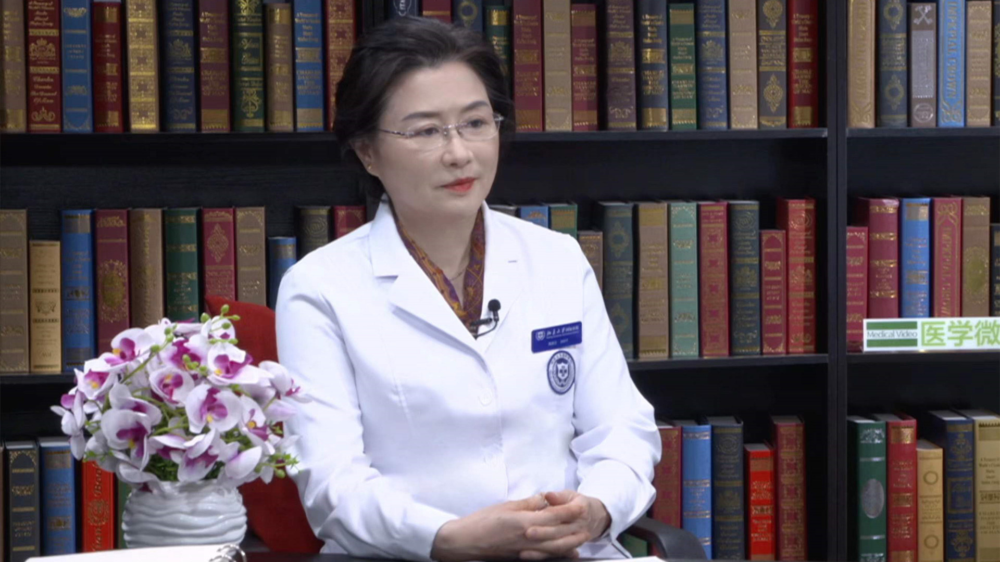

女性尿失禁
==========

高国 兰主任医师
---------------

   1678426599070

北京大学国际医院常务副院长 主任医师 教授 博士生导师；

享受国务院特殊津贴专家；中国抗癌协会第六
七届副理事长；中国老年学和老年医学学会副会长；中国老年学和老年医学学会妇科分会主任委员；中华医学会肿瘤学分会常务委员兼妇科肿瘤学组组长；中国抗癌协会妇科肿瘤专业委员会常务委员；中华医学会医疗鉴定专家组成员。

**主要成就：** 发表SCI
20余篇，核心期刊100余篇；出版学术专著15部，主编教材6部；从事妇产科临床教学工作30余年，培养硕士、博士35名；主持、参与完成国家自然科学基金4项，省部级课题12项，获省、厅级以上科研成果奖3项。

**专业特长：**
擅长妇产科各种常见病、疑难杂症和妇科肿瘤的诊治，特别擅长尿失禁治疗、宫颈癌的筛查和早期诊治。成功完成亚洲首例“渐冻人”孕妇和高位截瘫运动员剖宫产手术；开设国内首家妇科尿失禁专病门诊，重视各类盆底疾病的综合治疗，对盆底疾病的诊治积累了丰富的临床经验。
