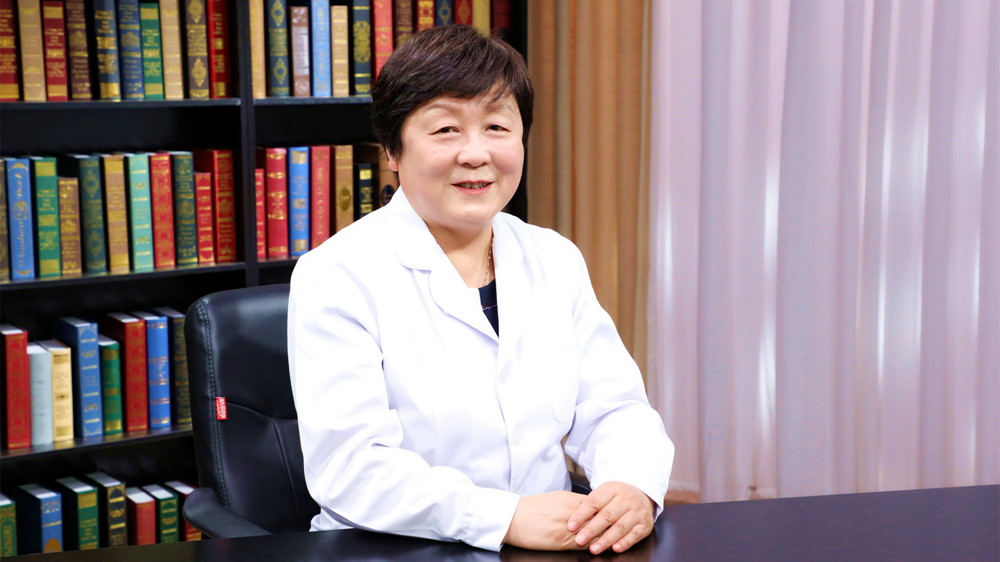

# 1.64 盆腔炎（附件炎）

---

## 廖秦平 主任医师

清华大学附属北京清华长庚医院妇儿部部长兼妇产科主任 主任医师 医学博士后 博士生导师；中

国医师协会妇产科医师分会副会长；中华医学会妇产科学分会感染疾病协作组组长；妇幼健康研究会生殖道感染专业委员会主任委员；中国医疗保健国际交流促进会生殖感染与微生态分会主任委员；北京女医师协会妇产科专业委员会主任委员；中华医学会妇科肿瘤学分会委员；中华预防医学会微生态学分会常委兼妇产科学组组长；《中国实用妇科与产科杂志》 常务编委；《实用妇产科杂志》常务编委；《中国微创外科杂志》 编委。

**主要成就：** 曾获北京市科学技术三等奖、教育部科技进步奖二等奖、全国妇幼健康科学技术奖科技成果奖二等奖，以及第五届“妇产科好医生·林巧稚杯”、德艺双馨“人民好医生”等荣誉，享受国务院政府特殊津贴；主持承担国家自然基金、科技部重大专项、卫生部行业基金重点项目等科研项目20余项；拥有国家发明专利4项；目前已指导毕业博士生80余名、硕士生多名、博士后出站人员3名，并指导多名研修生；近年来共发表SCI文章30余篇，中文文章300余篇。

**专业特长：** 擅长各种良恶性肿瘤诊治，牵头制定多项妇产科感染性疾病诊治指南。三十七来一直从事妇产科临床、教学及科研工作，在长期的临床工作中掌握了扎实的妇产科临床理论基础知识并且积累了丰富的临床经验。

---

## 附件炎是怎么回事？和盆腔炎是一回事吗？

（采访）首先请您给我们解释一下，附件炎是怎么回事？附件具体指的是哪？

首先来看看女性的盆腔解剖，我们知道女性和男性最重要的区别是因为她有一个为生殖而来的子宫，这是将来生育孩子的一个场所和来月经的一个器官，这是子宫，子宫两侧一边有一个输卵管，一侧有一个卵巢，输卵管和卵巢叫做子宫的附件，所以我们经常所说的附件炎，实际上就是指的子宫附件发炎了。其实我们现在不太提单纯的附件炎的问题，而主要是谈到盆腔炎，因为附件炎属于盆腔炎的一种。

什么是盆腔炎呢？就是在盆腔里面的器官，主要是子宫、输卵管、卵巢，以及周围盆腔的腹膜发炎了。可以是附件的炎症，可以是子宫内膜，子宫肌或子宫的浆膜面，也可能是盆腔里面各个脏器的腹膜发炎，所以叫盆腔炎。实际上附件炎属于盆腔炎的一部分。

（采访）附件炎一般单侧比较多，还是都是双侧的？

双侧、单侧都有。因为它是盆腔的一部分，所以感染的时候，如果只是局限在某一侧，就是单纯一侧的附件炎。如果基本是弥漫的，这时候常常双侧两侧都会有，而且常常不仅仅是附件的炎症，可能还有子宫肌炎，或者表面周围腹膜的一些炎症都可能有。

（采访）附件都是在我们盆腔里的，所以一旦有发炎的话，往往可能说不只是单纯的附件炎，而且说整个盆腔里面有很多地方都有可能发炎。

对，理解得非常好。

---

## 发热、腹痛、尿痛、性交痛会是急性盆腔炎（附件炎）吗？

（采访）如果是急性发作的附件炎，都会有哪些症状表现？

这个问题问的特别好，炎症从医学上来讲有两个大块症状，一个是全身的症状，比如发烧，一般有炎症会发烧，有白细胞增高，当然还有一些炎症的指标，比如C反应蛋白，就是CRP，还有PCT（降钙素原）等等，这些会升高，这是全身的反应。

还有局部的反应，我们经常说炎症的局部反应是什么，红、肿、热、痛、功能障碍。对于盆腔炎来讲，最主要的局部的反应就是肚子疼。急性炎症的时候可以非常疼，我们叫急腹痛。医生在检查的时候，做盆腔双合诊检查的时候，明显感觉到一挑宫颈的时候，子宫受到了触动以后都会疼，子宫举痛，然后还有压痛，甚至两侧附件区的增厚和压痛，因为局部肿了，所以摸起来是厚的，一摸是疼的，这是全身和局部的症状。

对于病人来讲，最主要来了就告诉你，大夫，我肚子疼、发烧，急性的炎症，另外有的病人会告诉你，会尿疼、性交痛，都可能会出现这些情况，因为盆腔炎会波及到泌尿系统。

（采访）有时候可能阴道炎，会有白带异常来提醒我们。

对。

（采访）附件炎会不会有白带的异常？
附件炎的话也可以有白带异常，也可以没有。因为百分之九十几的盆腔炎都是由下生殖道感染以后向上走造成的。

（采访）附件炎患者白带都会有什么样的表现？

急性盆腔炎的时候一般来讲，从宫颈都能看到一些稀脓样的这种白带，黄颜色的，甚至有的是绿颜色的这种脓性的白带，甚至有时候还带一些微微的像泡似的这样的，甚至还有一些异常的气味，比如有些腥臭味，这些都可能出现。

---

## 阴道炎会引起盆腔炎吗？

（采访）盆腔炎一般都是由下生殖道感染迁延上去的，会不会在发生盆腔炎之前先发生阴道炎？

会的。一般来讲的话都常常会有前期的一个阴道炎症，只不过炎症的轻和重不同，另外种类不一样，有的人能感觉到及时来就诊，及时就诊的话，常常可能就把炎症治好了，就没有上行感染。

但是有的时候有的人觉得拖一拖也许就好了，所以她也不来就诊，小病拖成大病，最后上行感染，出现了急性的盆腔炎，或者是慢性迁延不愈，造成盆腔炎症以后的后遗症状，经常肚子疼，一冷了就肚子疼。还有就是性交肚子疼，来月经的时候肚子疼，累了以后肚子疼，这些都可能会出现。

---

## 哪些不良卫生习惯会导致盆腔炎（附件炎）？

（采访）附件炎都是由什么原因引起的？

炎症肯定是跟感染相关，感染就要谈到性卫生的问题，绝大多数的这种感染与性卫生不良有关系。

我们经常教育病人，同时跟我们的医生也在说，在月经期尽量不查盆腔，告诉我们的病人月经期不要同房，因为这个时候阴道里面有很多的菌，平时子宫颈是闭合的，里头有一个黏液栓，黏液栓保证下生殖道的菌不能够上行。在月经期的时候，黏液栓由于来月经被打破了，所以黏液栓起不到一个防护的作用了。

另外在一些特殊的时期，比如刚生完孩子，还有刚人流完或者做完手术，宫颈黏液栓还没有好好形成的时候，不要去性交，因为这个时候特别容易把下面细菌带上来。盆腔炎病人常常由于生活知识不够，或者是卫生习惯不好。

还有一些病人，我们经常在门诊的时候碰到一些病人，她们说每天都要洗外阴吗？女同志你想有大便、小便，还有来月经等等，这么多的活动，然后有些女性会告诉我们，洗外阴平时还洗，月经期不能洗，说月经期洗要得病，其实月经期血是最好的细菌培养基。月经期不洗的话，这时候一些菌的繁殖会非常厉害，当然洗外阴我们不主张冲洗阴道。

所以卫生是非常重要的预防盆腔炎的一个措施。

---

## 产后感染会引起盆腔炎（附件炎）吗？

（采访）盆腔炎和分娩后或者流产后免疫力下降有没有关系？

有关系。盆腔炎的话，在分娩后有一段医学上叫股白肿，是什么呢？由于分娩造成细菌上行感染，甚至造成一条腿肿胀都非常厉害，那是非常严重的分娩后的一个并发症，跟分娩肯定是有关系的，解放以前都是自己生孩子，拿一把剪子一剪脐带就完了，其实这样特别容易得产褥感染。

现在主张到医院去生，为什么？要消毒，接生孩子的时候，阴道检查之前我们要冲洗，要消毒。接生的时候大夫，护士都要戴上手套，戴上口罩，戴上帽子，消毒产妇的产道，然后再接生，就是为了防止感染。

---

## 只要有性生活就容易得盆腔炎（附件炎）吗？

只要有性生活的女性，她得盆腔炎的几率就会增加了，为什么？

因为下生殖道打开了，百分之九十几的炎症都是从下生殖道上来的，所以如果没结婚的女性有性生活，其实更危险，没结婚之前的性交场合是不安全的，自己也害怕，男性和女性的准备工作，性交前的准备工作都做得不太好，所以这个时候反而容易感染。所以最好不要在没有准备的情况下性交，这时候的话容易感染。

---

## 阑尾炎会引起盆腔炎（附件炎）吗？

（采访）主任，如果得了阑尾炎，会不会有可能阑尾炎侵犯到附件，从而得了附件炎？

会的，这个问题问得好。成人这种情况比较少，最主要是小孩，经常是幼年时期，原发不孕的病人我们就要重视，或者经常看到病人检查时，右侧有一个大大的阑尾切口，我们要仔细问，因为小孩的阑尾炎也是跟老人一样，不太容易被发现，不像成年人这样容易被发现，一旦发现以后，常常形成了穿孔，周围脏器粘连，年龄小的时候阑尾如果要是穿孔，跟周围脏器粘连，常常跟这一侧的输卵管、卵巢是有关系的，跟右侧是有关系的，常常右侧的输卵管被感染以后就闭塞了。

所以幼年的阑尾炎，尤其阑尾脓肿、穿孔，我们要高度警惕右侧附件的炎症。另外万一左侧输卵管也有问题的话，常常会形成什么？形成不孕症。如果右侧输卵管受到阑尾炎的牵连，没有闭塞，而是变成狭窄了，将来成年以后容易形成宫外孕。

---

## 盆腔炎（附件炎）有哪些危害？会导致不孕吗？

（采访）附件炎都有哪些危害？会导致不孕不育吗？

附件炎应该说百分之九十几都是下行感染，然后上行造成的。感染的病原体有细菌，有病毒，另外还有一些我们叫非特异性感染的，尤其是衣原体和淋菌。这两个是很重要的盆腔炎感染的病原学微生物，这两个东西我们为什么很重视？因为是性传播感染。

所以一旦女性要发现盆腔炎，培养出来或者检查出来是衣原体和淋菌感染，要注意她的性伴要同时治疗，否则她好了以后，再跟这个性伴在一起，常常同时还会犯病。

另外输卵管如果受到侵犯，如果狭窄会造成宫外孕，闭塞会造成不孕症。另外一个如果要是子宫内膜炎症，就会形成什么？月经量过多，月经期肚子疼，这都可能会形成的，这是盆腔炎。

另外还有很厉害的盆腔炎，形成输卵管、卵巢的脓肿，脓肿是很厉害的，如果控制不好的话，还可以形成脓腔，甚至最严重会造成感染中毒性休克，这是需要手术治疗的。

刚才我说百分之九十几是从下往上走的，另外还有一部分是血行而来的，比如结核，盆腔结核，盆腔结核常常是由于全身的结核，然后到了生殖器，最早可能是子宫内膜，接着从宫角到两侧的输卵管上，所以经常原发不孕的这些病人，仔细问可能有一部分人会有盆腔结核病史，因为一有盆腔结核，一有输卵管结核，常常造成输卵管的闭塞，因为把内膜破坏了以后，粘连输卵管就闭塞了，这时候精子过不去了，卵子和精子碰不到一起，中间隔着一段粘连的东西，这个时候就是不孕症了。当然这个比例是特别小的。

（采访）如果是孕期的女性，她感染了附件炎的话，会不会导致胎儿发育异常，或者是直接流产？

早期的话会流产的，因为晚期的话胎儿占满了整个宫腔，所以病原体上不去了，基本就是在下生殖道和宫颈，但是很厉害的感染会造成胎膜早破，最后可以造成胎死宫内，或者是胎膜早破以后流产。

---

## 盆腔炎（附件炎）会导致月经不调吗？

（采访）附件炎患者会引起月经不调吗？

会的。附件炎的病人时间比较长了以后，会影响到卵巢的功能，会造成卵巢功能的失常，这时候就会影响月经了，可以造成月经量过多，早期是月经量过多，后期的话卵泡越来越少，可以造成月经不调，可以月经延长或者是好长时间不来月经，或者最后激素分泌量过少以后，可能造成月经过少。

另外一个如果要是子宫内膜炎症，就会形成什么？月经量过多，月经期肚子疼，这都可能会形成的。

（采访）我们把附件炎治好之后，月经是不是就能够恢复正常？

得看在什么时候治，已经形成了器质性损伤了，恢复不了的时候，治完以后可能不一定能恢复到正常，但是要早期积极治疗，能够恢复正常。

---

## 盆腔炎（附件炎）做B超能诊断吗？需要做哪些检查？

（采访）附件炎如果我们想要确诊的话，都需要做哪些检查呢？

附件炎好多病人认为做个B超就能够发现了，常常有一些病人说，大夫给我做个超声，我肚子疼看看是不是炎症其实这是个误区，大部分的盆腔炎症是不能够用超声来进行诊断的。

当然B超不是一点作用没有，当形成盆腔脓肿，包块的时候能看到，形成盆腔炎后遗症状的时候，我们也能看到，比如有粘连，形成了一团。还有积液，输卵管里面长条的积液也能够看到。

附件炎可以做血的检查，如果比较厉害的附件炎，可以造成白细胞升高，另外还可以体温升高。另外还有一些血的指标，比如C反应蛋白上升，另外还有PCT（降钙素原）的一些增加，就是这些指标发生了异常，这个时候我们要注意可能是炎症了。

但是炎症在哪？我们要定位，定位的话就是做盆腔检查。盆腔检查做双合诊或者三合诊的时候，感觉到了宫颈举痛，子宫压痛或者两侧附件的这种压痛，这时候我们考虑可能是盆腔炎症。最主要的是我们在病人就诊的时候，做一个盆腔的检查，看看子宫有没有压痛，附件区有没有压痛，这个是最重要的。

（采访）主任，怀疑附件炎的患者，她来医院就诊的时候会不会做分泌物的检查？

这个问题好。有些医院做，有些医院不做，像我们医院病人来了以后，凡是考虑到有炎性的这种疾病的时候，一定要做阴道分泌物检查。如果考虑是上生殖道或者宫颈的炎症，我们还会做宫颈分泌物检查，抹一张片子，然后染色，看看是什么样的菌。能看到革兰氏阳性菌还是阴性菌，通过功能学检查，可以分辨出来是需氧菌还是厌氧菌，这样的话能够帮助我们下一步治疗。

---

## 急性附件炎和急性阑尾炎怎么鉴别？

（采访）急性发作附件炎和急性阑尾炎怎么鉴别？

这也是很重要的。急性发作的附件炎和阑尾炎的鉴别，普通人阑尾都长在右侧，右下腹的地方，右侧的附件炎应该说需要和阑尾炎进行鉴别，左侧一般的不需要，除非这个人是右位的转位，阑尾长在左侧。

正常人的话，右侧的附件炎和右侧阑尾炎的区别，阑尾炎因为是消化道的一个炎性疾病，所以常常之前有什么？我们叫转移性右下腹痛，先是胃疼，胃疼很难受，最后转移到了右下腹，固定到了右下腹。

附件炎没有这个过程，常常附件炎有一个下生殖道感染，或者有一个宫腔操作，或者是有月经期同房等等，有一些诱因，各种各样诱因，然后出现右下腹痛，伴有脓性白带，这个时候我们考虑可能是附件炎症，就是盆腔炎，确切想了解的话，我们还应该在宫颈上做一个什么检查？治疗前做一个取样，做一下细菌的鉴定和培养，然后同时做个药敏，这样的话也为治疗打一个基础。

（采访）如果我们想做一些检查来区别阑尾炎和附件炎的话，我们可以做一个宫颈黏液的取样。

对，然后观察病人的疼痛情况。病人的阑尾相对来讲比盆腔炎的话稍微位置偏外偏高一点，这是附件，阑尾的位置一般在这儿，在肚脐和髂前上棘连线的外1/3的地方。做盆腔检查摸到子宫以后，在宫旁的位置上是附件。

（采访）就是在部位上也是有区别的。

也是有区别的，要做盆腔检查。当然现在的话超声是可以鉴别的，阑尾炎超声可以看到阑尾膨大，阑尾甚至里头有积液，肿胀都能看到。

---

## 为什么子宫内膜异位症患者常伴有盆腔炎？

其实子宫内膜异位症，我们在临床上就发现，血是最好的培养基，常常子宫内膜异位症的病人，都伴有一定的盆腔感染。为什么？因为子宫内膜异位症的病人，子宫内膜异位到了比如卵巢，在月经期也可以出现卵巢出血，形成一个越来越大的囊肿，叫巧克力囊肿，因为里面的血一开始是稀的，月经完了以后，慢慢把水分吸收了就稠了，越来越稠，就像巧克力一样的颜色和一样的内容物，所以我们管它叫巧克力囊肿。

卵巢上是这样，子宫肌层也可以，盆腔的各个部位也可以。这个血是出不来的，不像在子宫内膜，甚至在阴道就排出体外了，它出不来的。卵巢甚至由于有的时候出血会形成破裂，破裂流到盆腔里的这些血液，常常形成了很好的培养基。从物理上来讲，女性的盆腔其实跟外界是通的，阴道、宫颈、子宫、输卵管，进入盆腔，是通的。通的话某些时候可能有些菌就进入到了盆腔，再经过这么好的血液培养基的这样的一个培养，可以形成盆腔炎。所以巧克力囊肿的病人，经常同时是伴有盆腔炎症的。

现在还有一种学说，子宫内膜异位症，盆腔的内膜异位症，本身可能就是一种炎性的疾病。所以在治疗盆腔内膜异位症的时候，消炎应该说是没有错误的。

---

## 急性盆腔炎（附件炎）和宫外孕怎么鉴别？

（采访）附件炎和宫外孕要怎么鉴别？

附件炎和宫外孕确实临床是需要鉴别的。

急性的盆腔炎和宫外孕其中最简单的一个办法，查血看HCG（人绒毛膜促性腺激素）是阳性还是阴性，怀孕的话肯定有人绒毛膜促性腺激素，是一个阳性的，就是我们所谓的尿任免是阳性的。盆腔炎肯定不是一个妊娠性的疾病，所以是阴性的。

---

## 盆腔炎（附件炎）怎么治疗？急性和慢性在治疗上有什么不同吗？

（采访）急性和慢性在治疗上有什么不同吗？急性发作附件炎我们要怎样治疗？

急性发作附件炎谈到了治疗，我们在2008年的时候，在全国做过很大规模的一个流行病学调查，在流调当中，后来我们发现盆腔炎其实本身是一个多种微生物混合感染的疾病，既有需氧菌又有厌氧菌，还有一些非特异性感染，衣原体、淋菌，甚至包括一些生殖支原体等等。

这些混合感染决定了我们在治疗盆腔炎的时候，最好用这种广谱的抗菌素来进行治疗。如果用的只是覆盖需氧菌的，还要加上甲硝唑这类的覆盖厌氧菌的药物。如果要是之前做一个检查，查一下衣原体，查一下淋菌，查一下生殖支原体，这是最好了，如果它们要是阳性的话，还应该加上覆盖这些所谓叫非特异性感染或叫性传播感染的这些疾病的一些药物，比如阿奇霉素，还有一些比如说莫西沙星等等，用这些药物来覆盖，能够把这些需氧菌，厌氧菌，另外还有主要是一些非特异性感染的病原体全都覆盖掉。

盆腔炎的治疗是我们国家目前女性生殖道炎症当中唯一的一个治疗不足的疾病。生殖道的炎症我们一般用一周的疗程治疗就完了。现在很多地方，我们经常接收病人，这个病人就说前两天肚子疼，疼的特别厉害，输液输了三五天，肚子不疼了，不疼了我就停药了。

盆腔炎症，尤其像附件炎，很多分泌物是排不出来的，所以疗程要求长。国内外治疗盆腔炎的Guidelines，就是诊疗指南当中都提到，抗菌药物的治疗至少要14天，两周或两周以上。

而且我们中国盆腔炎的诊治指南里面还特别提到，用西药治疗两周或两周以上的时候，基本病情控制了以后，我们再用中药2-3个月，为什么？因为西药控制住了炎症的发展，把致病菌杀掉了。但是由于炎症有一些渗出，可以造成后期的一些
粘连，一些积水，这时候我们用一些中药把这些粘连分解开，积水吸收掉，减少后期的腹痛，减少后期宫外孕的发生，还有不孕症等等这些，这是我们中国治疗盆腔炎比较有特色的东西。

（采访）患者千万不要说吃了几天药，觉得症状缓解了就停药了。

对，这是很重要的。

（采访）如果是慢性发作的附件炎，我们应该怎么样去治疗？和急性有什么不同吗？

慢性发作的附件炎常常是由于前期的盆腔炎治疗不彻底造成的，或者是治疗完了以后没有加用一些辅助的治疗，然后形成了一些粘连，积水，一遇到来月经抵抗力低的时候，寒冷的时候，劳累的时候，甚至同房的时候，有时候出差环境改变等等这些，当她抵抗力下降的时候，这个时候她就会出现肚子疼了。常常病人来的时候就预示可能迁延不愈，这回又发作了。发作的点常常是比较重的，跟控制急性期一样，也是先用一个疗程，然后慢慢的再用一些中药，再控制就完了。

我们一般来讲用中药治疗要注意一下。中药的话有两种，一种治疗是针对于寒型的，我们应该用温经的这种，比如像桂枝茯苓丸这些，另外还有金刚藤可以进行治疗。如果要是盆腔炎刚完了不久，这个人是热型的体质，这时候我们可以用一些寒型的药物，比如像康妇消炎栓等等这些东西，这是我们中国古方纳法里面的张仲景的方子，可以用肛栓。但是总的来讲最好要辨一下型，辨完型以后，然后给病人再用这些药，这样的话效果会比较好。

（采访）发作比较严重的时候，我们赶紧先用西药控制一下。

对。

（采访）到后续没有发作的时候，我们也要记得再用一些中药。

对，就是一个疗程的西药治疗，再加上中药的治疗。

（采访）附件炎患者能选择物理治疗吗？

物理治疗也可以，刚才我讲了两型，一种寒型，一种是热型。热型常常是在亚急性阶段，亚急性阶段最好不要用这个方法。寒型可以用的，我们经常说抱个热水袋，在腰骶的地方，每天来治疗一下。现在的理疗还有一些其他的，比如说频谱仪等等这些，也可以有一些疗效，但是疗效并不是确切，每个人不同。

（采访）哪些附件炎患者需要手术来治疗？

盆腔炎大概90%都能够通过药物保守治疗来进行治愈或者是缓解症状。

什么样的盆腔炎需要手术？第一个特别急，病人来了以后，虽然没有包块，但是病人明显出现了感染中毒性休克这样一个表现，这是要需要手术的，手术干什么？开腹以后或者腹腔镜下，把腹腔内的一个是细菌洗掉，另外一个代谢的有毒的东西应该从腹腔内冲洗掉，然后我们再用大量的敏感的抗菌药物进行治疗，来把不好的状态，接近休克的状态纠正过来，这是第一个。

还有一种情况是什么？就是我们按照疗程，治疗了一个疗程，甚至比一个疗程还长，这个包块老消不掉，病人还老有点症状，老有点肚子疼，不舒服，或者月经的改变等等这些，这个时候我们可以考虑手术把病灶切除掉，解除这个隐患就完了。

（采访）手术方法是不是就是说有包块的，我们切包块，没包块的进行一下冲洗，把病菌什么的都给冲洗掉。

基本是这样。手术方式的话原来就是开腹，但是现在的话由于腹腔镜流行起来了，所以还有很多人用腹腔镜的方法，冲洗的方法其实还有一种叫双套管，以前我们就是一个管引流，现在两个管，一个管进水冲，在另一个管上可以流出来，所以现在医疗上不同的方法是越来越多了。

---

## 哪些盆腔炎（附件炎）患者需要手术治疗？

（采访）哪些附件炎患者需要手术来治疗？

盆腔炎大概90%都能够通过药物保守治疗来进行治愈或者是缓解症状。

什么样的盆腔炎需要手术？第一个特别急，病人来了以后，虽然没有包块，但是病人明显出现了感染中毒性休克这样一个表现，这是要需要手术的，手术干什么？开腹以后或者腹腔镜下，把腹腔内的一个是细菌洗掉，另外一个代谢的有毒的东西应该从腹腔内冲洗掉，然后我们再用大量的敏感的抗菌药物进行治疗，把接近休克的状态纠正过来，这是第一个。

还有一种情况是什么？就是我们按照疗程，治疗了一个疗程，甚至比一个疗程还长，这个包块老消不掉，病人还老有点症状，老有点肚子疼，不舒服，或者月经的改变等等这些，这个时候我们可以考虑手术把病灶切除掉，解除这个隐患就完了。

（采访）手术方法是不是就是说有包块的，我们切包块，没包块的进行一下冲洗，把病菌什么的都给冲洗掉。

基本是这样。手术方式的话原来就是开腹，但是现在的话由于腹腔镜流行起来了，所以还有很多人用腹腔镜的方法，冲洗的方法其实还有一种叫双套管，以前我们就是一个管引流，现在两个管，一个管进水冲，在另一个管上可以流出来，所以现在医疗上不同的方法是越来越多了。

---

## 为什么治疗盆腔炎（附件炎）中西药结合比较好？

（采访）主任，您简单的跟我们讲讲用中药和西药来治疗附件炎都有哪些优缺点？

中药、西药治疗盆腔炎还是有一定的区别的。尤其是急性期盆腔炎，我们一定要用点西药，至少一个疗程西药，为什么？因为盆腔炎的危害是很大的，重的可以死人的。另外长期会造成病人肚子疼，不舒服，还有可能会造成不孕不育的问题，生育年龄的女性。西药用在就是刚起病的时候，或者发现盆腔炎，赶快治疗一个疗程，能够疗效很确切的杀死这些病原微生物，起到一个什么作用？控制病情的一个作用。

中药的作用是什么？中药实际上就是帮助把炎性的一些东西给消散掉，用的时间要长一些，怎么也得两个月左右，所以两个药合起来，我们中国治疗盆腔炎的这个方法，应该说比西方的Guidelines（指南）其实应该优越一些。

---

## 严重盆腔炎（附件炎）要切除卵巢或输卵管吗？

（采访）会不会有的患者严重到要把附件就是我们的卵巢和输卵管都要切掉？

会，年轻女性有时候还真是输卵管脓肿，我们就会把输卵管切掉，尽量的保留卵巢，为什么？因为年轻女性卵巢是她的内分泌的一个器官，性激素的来源。所以我们还争取要留，但是如果真是一个大脓包，这个时候留着是没有意义的。

（采访）慢性发作附件炎患者，输卵管如果是粘连或者阻塞的话，我们应该怎样去治疗？

现在输卵管阻塞或者是粘连，治疗的话有很多种方法，其中有一个最直观，原来觉得特别有用的方法就是什么呢？我们叫输卵管镜，输卵管镜通过阴道、宫颈、子宫，然后两个宫角，然后进入输卵管，甚至有一些通输卵管小的像探针似的，导丝把输卵管通了。但是其实从理论上讲是通了，但是很快又闭塞了，为什么？

输卵管有输卵管的功能，不仅仅是个通道，输卵管黏膜还有很多的纤毛，纤毛是向一侧摆动的，如果纤毛已经被细菌破坏掉了，这时候既便是让通道通了，常常也没有功能，反而增加了宫外孕的机会。另外还有一些虽然用探针把它通了，但是通的我们经常说叫假道，就是另捅了一条道。虽然是有一条通道，但是没有输卵管黏膜的覆盖，最后还是闭死了。所以输卵管尽量要好好的保护它，而不是不通了以后我们去通它。

（采访）如果想要怀孕，为了妊娠怎么办？

要是没有功能就没有办法，最后就是切掉它做助孕。做助孕的时候，移植之前还要把输卵管切掉，为什么？因为输卵管积液倒流进入到子宫以后，这个水有点像毒水，会对胚胎有影响的。

---

## 盆腔炎（附件炎）能根治吗？

（采访）附件炎可以根治吗？

早期发现，彻底治疗都能治好。迁延不愈最后形成了慢性的反复发作的这样一个感染，就会有很多纤维结缔组织增生，就变得狭窄了，到一定时候就闭死了。

（采访）主任，如果是慢性发作的附件炎，还能不能根治？

大部分治不了像原来的样了，举个例子，皮肤哪破了，破了以后形成了一个瘢痕疙瘩，不能恢复到和原来的皮肤一样。

---

## 盆腔炎（附件炎）治疗期间，需要注意什么？

（采访）附件炎患者在治疗期间，都需要注意什么？

要遵医嘱，按时用药，另外还有一个，所有的人在治疗期间都应该注意什么？注意健康的生活。

经常我们现在门诊有好多年轻的孩子会形成各种炎症，仔细问问，半夜不睡觉，熬夜，半夜不睡觉玩手机，另外没有正常的饮食，没有一个健康的生活，所以她的身体没有抵抗力，没有很好的抵抗力。

炎症实际上说句实话，它是个良性的疾病，但是它是抵抗力下降以后造成的这样一个疾病。不太厉害的炎症，一般来讲身体是能够克服的，人是有抵抗力的，所以一定要有一个健康的生活，不能说因为年轻，所以我就拼命的透支，透支的是今后的生活，美好的生活就没有了。

（采访）附件炎患者在治疗期间能有性生活吗？

治疗期间最好不要有性生活。盆腔炎本身常常是多重感染，有可能还是一个性传播感染，治疗期间的话，不但不应该有性生活，连她的性伴都得应该进行治疗。

---
