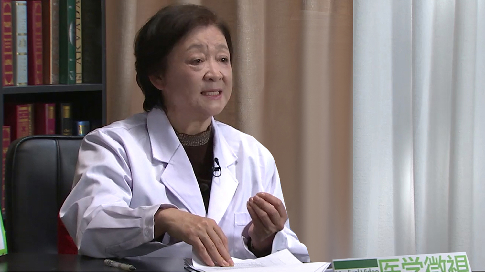

# 1.70 人乳头瘤病毒（HPV）感染

---

## 孙晓光 主任医师

北京协和医院妇产科主任医师；美国纽约大学博士后；《国际妇产科学杂志》编辑。

**主要成就：** 对反复流产有丰富的诊治经验，探索并制订了全面合理的反复流产检查程序，其应用静脉丙种球蛋白治疗不明原因反复流产的学术成果受到广泛关注；对宫颈癌前病变有深入研究，累积数千例阴道镜的经验，其学术水平紧跟国际前沿；曾获瑞士国际抗癌联盟奖学金、瑞士雀巢妇女儿童营养学奖学金各一项，获得首都医学科研发展基金两项；发表SCI文章6篇，中文学术文章30余篇。

---

## 宫颈癌是病毒引起的吗？

宫颈癌现在是唯一的一个肿瘤，它的病因非常明确，是由人乳头瘤病毒，我们简称就叫HPV，是由这个病毒引起的。目前我们已经知道，有90%以上的宫颈癌都是由这个病毒引起的，就是说它是一个病因最明确的肿瘤。

这个在不同的地区我们现在知道，是由不同的类型的HPV引起的，比方说国外它由主要的是HPV的16和18型引起的，这个16和18型就占据了宫颈癌病因的60%到70%这样的一个比例，其它的百分之二三十的病毒，是由其它的高危型病毒引起的。

在我们国家这个病毒的流行谱略有不同，应该是HPV51型、16型，还有58型是占主要的因素，就是引起这个宫颈癌。

---

## 什么是人乳头瘤病毒（HPV）？

这个HPV病毒，它英文叫Human papilloma virus，就是说很小很小的颗粒。

现在知道这个病毒是个50纳米，我们直观的想象，就是说一个毫米有多么大呢？一个毫米就是一个厘米的十分之一，把这个病毒排列起来的话，两万个病毒排列在一起，有一个毫米这么大，所以说它这个颗粒是非常非常小的。

现在已经发现的HPV是有200多种，就是说这个HPV它是一个大家庭，其中有200多个成员，现在已经认识到其中有40多个成员，就是跟性行为有关系，它是通过性的途径来传播的，另外100多类型跟这个性是没有关系，它通常是通过皮肤的传染，是这样子的。

现在这个HPV病毒有200多种，其中有40多种跟生殖方面有关系，生殖这方面的这40多种，我们还分为高危型和低危型。

---

## 人乳头瘤病毒（HPV）感染，引起宫颈癌是怎么被发现的？

在德国有一个学者，他是病毒学家叫豪森，他是在七十年代，就是1970年那个年代，他就开始研究HPV病毒，当时人们的观点，认为这个宫颈癌它主要是多个性伴侣、早婚早育、经济条件不好，或者是多产，跟这一类的人有关系，就是容易感染宫颈癌。

但是不知道为什么这些人她就容易得宫颈癌，豪森他敢于挑战当时的观点，他就立一个假设，就是这个宫颈癌是由HPV病毒引起的，当时有很多人都不相信这个论点，他要论证的，他既然要提出这个假设，他必须在这个宫颈癌的组织里，能够鉴别出有这个病毒的基因，所以他就做这些工作。

在八十年代的时候，就是1983年和1984年他就提出来了，就是从这个宫颈癌的组织里，提出来了HPV的16型和18型，所以就奠定了一个非常强有力的基础，就是说这个宫颈癌是由HPV病毒引起的，在2008年的时候，他因为这项伟大的发现，被授予诺贝尔奖，当时是跟艾滋病的发现者，有两名法国的艾滋病发现者，一同获得这个诺贝尔的生理学和医学奖。

豪森这个人是很了不得，他36岁的时候就在德国的大学当病毒学教授，晚年的时候人们称为他是一个快乐的老头，他花了三十多年的时间，他的学术成就被肯定，这是一个了不得的事情，为什么？就是说他的发现有什么伟大的意义呢？

我们想一下全世界如果有一百种肿瘤的话，有五个肿瘤是宫颈癌和肛门癌，还有阴茎癌，这些癌的话原因非常清楚，是HPV引起的，就是他解决了5%的肿瘤的病因问题，这是一个意义。

第二个意义就是说，因为这个HPV病毒，它的传播是伴性传染，所以凡是在这个世界当中，有50%到80%的家庭，都有性这个东西，所以说他这个发现的话，就是跟这个50%到80%的家庭都有关系。

第三个意义就是，现在知道有这么十四五种高危型病毒，引起女性的宫颈癌，所以就是因为这十四五种病毒，把这个全世界的HPV感染者，置放到一个宫颈癌的一个高危的一个位置，所以说也是非常非常重要的发现。

还有就是说现在知道99.7%的（宫颈）肿瘤，拿出来以后，几乎都可以发现HPV病毒，所以说这个广泛性、重要性和那个意义，是非常巨大的。

主要具体他做了哪些事情？一个是知道就是他搞明白，这个HPV诱导这个肿瘤发生的机制。

第二个就是说他知道就是200种病毒里，只有一部分引起癌，并不是说所有的。

再一个就是说他阐述明了，就是说这HPV是个慢的病毒，是一个持久发展的一个过程，不是说迅速的引起癌变，最重要的是因为他发现并且分离了HPV的基因，在这个基础上，人们研究成功了HPV疫苗，可以为大多数宫颈癌高危的人群，提供了保护作用，这是一个巨大的成就。

因为HPV疫苗的发现，现在就是说全世界每年有新病例50万，我们国家有13万人口，就是感染HPV病毒者，如果说这些病人，如果有了疫苗以后，她的这个宫颈癌的发生比例就大大的下降了，特别妇女的寿命就大大的提高了，而且国家因为这个来需要的负担，就大大的减轻了。

你看一个很浅显的例子，我就是1983年的时候大学毕业，我被分配到医科院的肿瘤医院专门治疗宫颈癌，那个时候我们接触到的宫颈癌，都是大肿瘤晚期，真的像一个大菜花一样的肿瘤，但是现在的年轻大夫，已经很少见到了，为什么呢？因为我们的这个预防措施，我们对宫颈癌的了解，然后我们都提前预防了。

所以说晚期（宫颈）癌就比较少见了，通常发生于那些不做癌前检查的筛查的病人，或者是住在很偏僻的地方，经济条件不好，医疗条件不好，这样的人群，偶尔能发现晚期的肿瘤。

---

## 人乳头瘤病毒（HPV）感染会引起哪些病？

我们现在明确，这个宫颈癌是伴性传染的，就是通过性行为来传染的，所以跟性行为有关系的器官有可能得癌。

比方说外阴，外阴我们知道有一半的肿瘤是HPV引起的，阴道癌是一个比较少见的肿瘤，它的百分之六七十是HPV引起的，宫颈癌的话90%是HPV引起的，这是女性。

还有一些男性呢，男性的阴茎癌，男性的肛门癌，而且现在明确这个喉癌、舌癌、口腔癌这都是性行为的器官，这些地方发生的癌跟HPV有很大的关系，所以HPV可以引起这些方面的癌。

但是我们知道还有一些也是伴性传播的病，它是低危型的，低危型的病毒以6型和11型为代表，它不引起癌，它们可以引起生殖器官的湿疣、扁平疣、乳头状瘤这些良性的病变。

---

## 人乳头瘤病毒（HPV）感染很常见吗？

这个HPV一句话，就非常普遍，在自然界当中是广泛的存在。

我们拿体检为例，你体检病人拿出100个妇女，可能会有15%左右的人发现她有HPV感染，在男性的外生殖器，就是阴茎、肛门、还有尿道，它的感染率是12%到18%，这就是一个比较常见的，比较普遍的了，而且研究表明，就是这一个女性在她的一生当中，有80%的可能性她感染了某种病毒，就是在生命的某一个节点上她感染病毒，所以说它是非常普遍的。

通常你感染了HPV病毒可能没有症状，你这个机体免疫力的作用下，这个HPV会自然消失，它的消失的平均的时间，是六到十四个月它就自然消失，就是有80%的都自然消失了。

还有一些它不消失，这个不消失的病毒，持续的在你身体里存在，现在认为就是定义为一年以上，我们叫做持续感染，持续感染它就更多的机会，来引起跟这个HPV有关系的癌症，但是你感染HPV病毒，多半都没有症状，就是属于病毒的携带者。

有一些感染了低危的病毒的人，他可能会出现一些湿疣，就是在生殖器表面、外阴、肛门周围，还有阴茎会出现一些小乳头样的东西，这个就是说是症状。

但是说实在的，只有很少的一部分人有症状，大部分人是没有症状的，所以有症状只是这个冰山上的一角，我们就是说看到的是少部分。

这个HPV病毒是非常非常常见，在我们国家还没有一个明确的数字，但是美国是有统计的，有一些很明确的数字，比方说有七千九百万美国人正在感染HPV，每年有一千四百多人新感染了HPV，还有就是说他们有三十多万人出现生殖道湿疣，还有每年发现一万一千例新的感染。

在我们国家的话，这个HPV它属于性病的一种，如果你有这个病的话，应该是上报的，但是我们国家这个统计，这个上报的系统没有那么完整，所以我们没有一个完整的数字，实际上的数字肯定不低于美国的，它会是一个很大的一个数字，你看我们国家每年有十三万新的宫颈癌病人，你没有得宫颈癌的病人，多有HPV感染的，都没有一个明确的数字，但是量是非常非常大的。

---

## 感染了人乳头瘤病毒（HPV）一定会引起宫颈癌吗？

这个事情是大家很关注的课题了，其实感染了HPV病毒，不一定就会得宫颈癌和其它的癌，只有小于5%的机会是得癌，你换了这个HPV病毒以后，就是80%的人经过一年都自然的消除了，有些人他不查，所以说他都不知道他感染过HPV，但是有一些病人他就得了癌症了。

哪些病人就是说你得癌症，需要有什么条件呢？就是说是高危型HPV感染，就是那十四五种高危型病毒感染，事实证明这个高危型病毒，就百分之八九十的宫颈癌，就是几乎90%以上的都是高危型病毒引起的，特别是有HPV16和18型，它可以引起宫颈癌的60%，就是说60%的宫颈癌由HPV16、18型引起的，就是说你这个条件就是说，你要有可能是高危型感染。

在我们国家主要的类型是51型、16型，还有一个58型，它是这么排列，它跟国外的感染谱不太一样，所以说第一个条件就是有高危型感染。
换句话说我这个低危型病毒就不能感染宫颈癌吗？有一些不太多的报道显示，低危型的病毒感染可能也会引起宫颈癌，就是说它不是绝对的，但是我们要心里边有数，就是说绝大多数的类型的宫颈癌，都是高危型病毒引起的，这是第一个条件，高危型。

第二个条件就是持续性，就是说你短期的HPV感染，不足以把宫颈的细胞转化为癌，需要一个长期的作用，通常就是一年以上了，也可能会有更多的时间，才能感染宫颈癌和其它的跟HPV有关系的肿瘤。

还有一个条件就是说机体免疫能力低下，免疫能力低下的这群人都是什么人？你平常我爱得病，我免疫力低下，这都不是典型的，典型的免疫能力低下，比方说艾滋病人，他的机体器官免疫能力被病毒摧毁了，所以他特别容易感染HPV病毒，感染了以后他也不容易消失，而且容易变成癌，这是免疫力低下。

还有一些免疫力低下的，比方说患了癌症的病人，通常他的免疫力是低下的，他有第一个癌可能会有第二个癌，也有报告说，一个人身上断断续续三个癌，就说明他机体免疫能力低下。

还有的得了癌的过程中打化疗，化疗的话可以非常强烈的伤害机体的免疫能力。

还有一些人，就是接受器官移植以后，他要打免疫抑制剂，所以说这种情况下他是一个免疫力低下。

还有一些人他有免疫方面的疾病像红斑狼疮，还有一些其它的免疫性疾病，他的免疫力是低下的。

当然还有一些不良的生活方式，吸烟这是一个明确的例子，它是损害机体的免疫力系统的。

所以说这些情况下，他患癌的可能性就大了。

---

## 人乳头瘤病毒（HPV）的传播途径是什么？

这HPV传染必须有传染源，这个传染源就是说，你跟这个携带有HPV的病毒的人，或者是他是携带者，或者他是疾病患者，你跟这样的人接触的话，他是就容易传播，所以说跟这个患有或携带HPV病毒的感染者进行性接触，这就是根本的传染源。

它的途径通过性接触，所以说它通过口腔的传染，就是接吻，它跟性器官接触，比方说肛交是很容易得HPV感染的，还有阴道的接触，都是容易接触的，所以说这些途径是感染HPV的途径，传染源是患病或者是携带者。

还有一些少量的研究提出这个HPV，可以经过母婴传播，这个是有些人在做研究的，可能是有的，但是没有足够的证据来支持它。

问说我握握手能不能传染，一般不会传染的，我接吻能不能传染，接吻能够传染HPV病毒，还有一些其它的途径，这个没有被证实。

---

## 哪些人容易感染人乳头瘤病毒（HPV）？

首先它应该是有一个性的活动，这种人是有传播的可能性，不论是什么样的性，正常的阴道性交，还有肛交，还有口交，这些行为能够传染HPV，一般的话认为一般处女是不容易传染HPV的。

另外一个就是多性伴侣，就是说你本人有好几个性伴侣，指不定哪个就是HPV感染者，或者是你只有一个性伴侣，可是你的性伴侣，他有很多个性伴侣，这种情况下，也可能传播HPV。

一个人他可以有性活动以后不久，他就会感染HPV，这个是很可能的，即便说一个人只有一个性伴侣，他也可能会传播HPV，对方可能是以前有过HPV，关键是说这些感染者，他没有任何症状，有的时候他自己都不知道，所以说你就不太好预防。

一个人他偶尔的同某一个人有过性的关系，很多年他都没有什么事，他忽然又得了HPV了，有的人我在临床上他就跟我叙述说，我很多年没有性关系了，我怎么会有得这个东西，事实上说是存在的，就是说你不知道这个HPV在你身体里潜伏多久，我们现在对这个HPV的自然的历史，它的自然的传播规律，都不是特别清楚的，所以说这些人都有可能感染HPV。

---

## 人乳头瘤病毒（HPV）感染后多长时间才可能引起宫颈癌？

这个也是一个很重要的问题。

临床上经常有些人慌慌张张的，从外地很远的地方来，说我体检我感染了病毒了，我好几天都没睡好觉了，我必须来见你大夫，我是不是很快就要得癌了，我都吓死了，我来后事都安排好了，这个就是说有很多病人不太了解这个情况，所以说就过度恐慌。

实际上就是说你感染了HPV的话，短期内是不会引起宫颈癌的，它需要一个漫长的过程，HPV它是一种慢病毒，你这个正常情况下，你就最初感染，在六到十四个月的时间里，可能机体的免疫能力上来了，就把这个HPV就清除了，所以说有大部分人都不会得宫颈癌。

但是真有那么一部分人持续感染，它在体内以后，感染的是高危型，高危型没有症状了，就是发生了宫颈癌前病变，一步一步一步一步的往前推，大约需要十年到十五年的时间，它就变成了宫颈癌了。

在这个漫长的阶段，都可以发现这个HPV感染和这个HPV引起的宫颈癌前病变，都可以在不同的节点上把它给阻断，使你不得宫颈癌，这就是一个宫颈癌的一个特殊的地方。

就是说我们现在的科学发达到这种程度，就是我们提前十五年、十年，我们就知道你可能将来要患宫颈癌，起码你有这个可能性，也有人已经达到了癌前病变了，将来向宫颈癌的发展的可能性非常非常高了，这个阶段的话，我们说她要有一个持续感染的一个过程，她要有一个癌前病变的一个漫长过程。

什么叫癌前病变呢？就是宫颈上皮内瘤变，换一句话叫CIN，它就是宫颈的表层上皮，很表浅的一层上皮，二十多层鳞状上皮，这层上皮当中有了癌细胞，它只要没有突破基底膜，没有进到宫颈实质的组织里，我们就叫做它是癌前病变，癌前病变分三个等级，CIN1、CIN2、CIN3。

1我们叫低级病变，2和3我们叫高级病变，现在研究的结果认为，到这个低级病变的基础上，仍然有可能会有一部分人自然消失，就是逆转，转成正常的，差不多50%多的人经过一年的时间，可以自然消失，但是另外那些百分之三四十的人可能不消失，可能持续的存在，待在那个低级病变的阶段上，也可能进展，到了高级病变，就是CIN2和3的阶段，它的逆转率很低了，它只有停在那儿，或者是往前走了。

所以我们现在筛查，严格上来讲其实是筛查有没有高级病变，我们发现了高度病变，我们把它给解决了，然后宫颈癌就给阻断了，所以说这个研究表明，就是说平均起来，你这上一个台阶，从1到2到3，到原位癌到癌，平均起来一个台阶有两到五年的时间，时间是非常漫长的。

但是我们不除外，有一些病毒感染者她的发生很快，发展很快，有一些二十多岁的人宫颈癌，这个我们临床上是经常见到的，可能她感染的特别高危型的，或者她的免疫能力特别低下的，这些情况都是有可能发生的。

总而言之宫颈感染以后，很快就得了宫颈癌了，这个一般都是没有，大多数的人都不是的，只有偶尔的，所以说不需要恐慌的。

---

## 感染人乳头瘤病毒（HPV）后会出现哪些症状？

临床上有很多病人过来说，我什么症状都没有，我怎么会有HPV感染呢，我说你就算得了癌，你都有可能什么症状都没有，等你有了症状的话都癌症晚期了。

所以说有些人就误区，说我没有症状我不需要检查，这是错误的，实际上HPV很长时间都没有症状，但是有些人是有症状的，都有什么样的症状呢？

一个就是我感染了低危型HPV病毒，我在外生殖器出现了一些乳头样的东西，疣状的东西，就像小乳头样的，小树枝样的，还有扁平的那种湿疣，都有可能就不同的表现，我们在临床上外阴还有大菜花样，长的跟菜花一样一样的，可是你做出病理检查不是癌，它就是HPV病毒。

所以说就是一种表现，就是有疣状物的表现，第二种表现就是说你得了癌了，比方说不同的癌它有不同的表现。

第一个症状就是说在生殖器周围，出现了乳头状瘤，或者是湿疣样的改变，这种改变人们得了这个以后很恐慌，我这是不是性病了，都急急忙忙的到性病门诊去看，到妇科门诊去看，到男科门诊去看，有些人就压根儿就不看，因为他觉得很不好意思，这种是令人恐慌的。

但实际上它是低危型HPV感染引起的，不值得恐慌，但是人们就是见到东西了他就恐慌了，所以说这是第一类，就是低危型HPV感染，出现的那些湿疣样的和乳头样的改变。

第二种类型就是高危型的病毒引起的症状，这个高危型它没有症状，它很长时间它都不出现症状，它真正的把你的器官变成癌了，这个时候来症状了，比方说宫颈的癌，早期的她就会有出血，同房出血，有些人很长时间不在乎这个事情，她说我一同房我就有一点点血，就耗着耗着，最后一到那儿，医院一看是宫颈癌。

还有一些其它的，有一些人干咳，有个别的咳血他也不在乎，但实际上喉癌，这个是后来发现的，因为我1983年的时候，那时候都没有意识，那时候看见喉科很多很多喉癌什么的，那时候也不明白原因，现在知道它是HPV引起的，为什么呢？它性传播，口交。

喉癌、舌癌这些是有症状的，真正的高危型病变引起来的症状，基本上都是比较晚的症状了，这个时候就恐慌有点来不及了，所以说就这两大症状，一个是良性的引起的湿疣样改变，一种是高危型的引起的癌的，发展到一定的阶段时候出现的症状，两大症状。

---

## 哪些人需要检测人乳头瘤病毒（HPV）？

HPV检测的问题，既然HPV这么广泛，跟这么多的人有关系，我们现在就是说很重要的一个题目摆在我们面前，我们怎么去发现它，我们怎么去检测它，我需要不需要检测。

这个其实老百姓都不知道的，现在就是美国的食品药品管理局，提出了几个要检测HPV的指征，就是说你每年你不是做防癌筛查，宫颈癌筛查什么的，如果TCT有问题了，你的那个细胞学报告是有问题的，不管你是什么问题，你需要做一个HPV检测，这是第一个适应证。

第二个适应证就是说女性，有性生活的女性，三十岁以上的建议跟这个TCT一起来做一个病毒的检测，还有一个就是说25岁以上的女性，她有性生活，她初次检查要做一个HPV检测，这是目前公认的HPV检测的一些指征。

但是还有一些人，尽管没有这些指征，也应该做HPV检查，什么样的人呢？一个是我表面上出现一些疣状物，乳头状物什么的，这种人一定要去做一个HPV检测，不管是男性还是女性，都要去做一个HPV检测，来看看你是不是感染了HPV了。

有人说我是湿疣，你不是说低危型的没关系吗，但是低危型的话，他往往得高危型的病毒感染的机率比没有得低危型的人要高，所以说你要去检测HPV。

还有一些的话，就是说我本身没有湿疣什么的，可是我的性伴侣有了，那你也得去做一个检测。

还有就是说出现了一些其它的问题，就是我老有出血，或者是我有其它的症状，我怀疑这个东西她就来检测。

我在临床，有一些女性她就来了，就很简单的就说，我就要查性病，你看看大夫，有多少性病能查，你都给我开上，我于是心里就知道了，她可能是有了她不太信任的性关系了，有怀疑的性关系，她心里头恐慌，她就来做HPV检测，这个也是可以的。

所以说就主要是这些指征。

---

## 检测人乳头瘤病毒（HPV）都有哪些方法？

都有什么样的方法来检测HPV呢？目前的话主要的在我们国家常用的方法有三种了，一种就是说，我要光检测我有没有高危型，就是高危型的检测，不同的试剂和各个厂家出的试剂不一样，检测的角度不一样，有的人就是专门做一个简单的检查，我就看看我有没有高危，没有高危我就算了，这是一种初步的检查了。

还有一种就是分型，就把每一个型，常见的那些型，高危型的十四五种，低危型的十来种，给你通过小刷子一刷，刷宫颈，刷尿道口，刷肛门，然后去查一下，就能够基本上给你分出来你是哪个型感染了，这是一种。

还有一种负荷量，病毒的负荷量，我们叫杂交捕获，这种是给你一个数值，就是说你感染病毒有多少病毒负荷量，白话就是多少拷贝了，我感染这个HPV多少程度了，现在就是说这三种检查。

目前还有一些检查是没有定论的，就是说不被官方来批准的那种，或者是说不太明确的那种，正在研究的那些，有一些争论，比方说目前我们知道，还没有一个检测方法，来发现你感染病毒多久了，就是说你是处在哪个阶段，你是潜伏阶段，还是说你是在病毒在使劲的繁殖阶段，还是说你有了症状的阶段，检测不出来，只知道你有或没有，不告诉你你感染了多久了。

所以说凡是初次检查到HPV感染的人，你应该想到有这个可能性，我备不住就是持续性感染了，我可能不是初次感染，除非你去年你查过，今年你又查，去年没事，今年有事了，你可能在一年内感染，如果你好长时间没查过，你就不知道你感染多久了，所以说这个是目前的一个问题，就是我们不知道感染在哪一个阶段了。

第二个就是说口咽部的HPV检测，现在还没有被正式的推出去，但是不除外有一些机构在做，这是口咽部的。

还有就是说男性HPV检查，这种是没有官方来正式推出的，但是有一些机构也是在做，并且也没有理论说他不应该做，是可以做的。

另外一个青少年，现在的研究不建议去给青少年去做这个HPV检测，有一些机构提出来对小于30岁的妇女，也不做检测，理由就是说HPV对青少年感染，通常都是一过性的过一段时间就好了，所以说这些东西，就这些情况，没有一个推荐必须得做的，就是上述这些情况。

---

## 感染了人乳头瘤病毒（HPV）怎么办？

感染了病毒首先第一得上大夫这儿来，作为一个病人说，我体检，我拿出单子来了，我感染了HPV了，大夫你看我怎么办。

大夫第一件事，我们要给她做一个细胞学检查，宫颈细胞学检查，就是看一下有没有细胞学的改变，就是说换句话说就是，病毒感染了有没有已经启动了癌的这件事件，就是说她的细胞有没有什么变化，用细胞学来检测。

通常也是用小刷子，我们最常做的是TCT，最简单的叫巴氏涂片，巴氏涂片有年头了，差不多四五十年了，现在还在用，巴氏涂片简单、便宜，二十块钱一份，一般体检的话，那种便宜的套餐都是巴氏涂片。

你要是贵一点的套餐，就是说的液基细胞，最常见的就是TCT，就是来做一个宫颈癌的筛查，就是有没有细胞已经改变了。

假如说TCT有问题了，病毒感染，我们下一步就开始启动了三阶梯的诊断，三阶梯诊断什么呢？发现有没有癌，发现你处在癌前病变的哪一个阶段，什么叫三阶梯诊断？就是细胞学涂片检查就是第一个阶梯，接下来阴道镜，接下来病理的活检，到病理活体组织检查，这个阶段我们叫金标准的诊断，就是能明确你到底有没有癌前病变，有没有癌。

所以说你感染者到我们这儿来的话，第一步要筛查一下有没有TCT的问题，如果她没有这个TCT的问题，那就观察，就是病毒感染，因为可能有些人病毒感染会很长时间，都不引起癌前病变，你就回去随诊观察。

在国外的话，我们建议就是说一年一次复查，但我们国家的病人都心情紧张，一般都等不到一年，有的时候她们半年，有的人三个月就来查，来查的话我们跟她讲说，你可能太近了，你再回去观察观察，她们多半都是心情紧张，坐卧不安，生活质量下降，还不如给她做一个。

就是说所以一般的检查，就是说观察，就是一年一次，但是我们现在通常实行都是半年一次，当然了就是说你通过这三阶梯诊断，你知道了有没有宫颈癌，有没有癌前病变，下一步你就该怎么治，明确完了以后，你有湿疣你就治湿疣，你有宫颈癌前病变，你就治宫颈癌前病变。

总而言之HPV感染，敲响了一个警钟，就是说你处在一个HPV感染的一个阶段，是处在一个将来变成癌的一个危险，这个位置，所以你就需要检视你的这个情况了，主要是你生活方式，包括性的方式，包括你日常的有没有感染的这个途径，还有你的抵抗力，就是免疫能力怎么样，所以说就是给你敲响一个警钟了，接下来怎么诊断，那就是大夫的事情。

---

## 人乳头瘤病毒（HPV）感染需要抗病毒治疗吗？

目前的话证据显示，就是专家一致的共同的意见，就是说HPV病毒，目前还没有治疗的方法，就是没有明确有效的方法来治疗病毒。

但是我们现在所能做的，就是对HPV引起的健康问题进行治疗，比方说他产生了湿疣，我们治疗湿疣，有癌前病变，我们治疗癌前病变，但是对病毒本身是没有一个特别有效的办法，目前来说这个是专家的共同的意见。

但是就是说一些研究正在不断的进行着，来探索免疫增强剂有没有用，中药有没有用什么的，这些也都是在研究的过程当中，如果就是说能治疗HPV病毒，如果你说这个病人宫颈有湿疣，我把这湿疣给治了，我通过物理的办法，比方说激光、电烧、冷冻、消融，我把她那个东西拿掉，或者是有宫颈有癌前病变了，就是HPV引起的，我给她切除了，这种情况下，病毒会随之而去。

因为病毒它是多半都是存在于病变的细胞的里面，它整合到细胞的DNA里面，它最常在宫颈的鳞柱交界的转化区的这一个区域里，或者是在湿疣的组织里，我把这些病变都连窝都端了，自然病毒就没有了。

单独的HPV感染，没有什么症状，没有什么体征，没有特别有效的办法，被证实了的特效药没有。

---

## 人乳头瘤病毒（HPV）感染什么情况下需要治疗？

出现了HPV引起的病变了，你需要治疗了。

比方说这个人感染了低危型HPV病毒，出现了在肛周，或者阴道周围出现一些小的乳头，小的湿疣，一个一个，摸着很害怕，这个时候需要治疗。

对这种湿疣的治疗，有很多种办法，有的是用药，就是那种腐蚀性很强的药，把它给腐蚀掉。

还有的用物理的疗法，就是我用激光，我用电烧，我用冷冻，给它拿掉的意思。

还有用小刀子给它一点一点的切，像我们孤零零的那种，你用什么方式都行，你用小剪刀把它剪下去都行，用刀子给它切掉也行，甚至用活检钳咬掉都行，就是这种有东西的，肉眼见到的东西把它拿掉，这是一种小的手术。

还有就是说宫颈感染了高危型病毒，我没有这些湿疣，我见不到，只是有癌前病变，我通过三阶梯诊断，我发现我是CIN第几个级别了，就根据这个不同的程度来进行治疗。

一般对于高度病变，就是我说的那种CIN2和3，那种高度病变，我们都要做不同程度的切除治疗，比方说做利普，就是那种环切，把宫颈挖掉一块，或者是我做一个锥切术，用刀子把它给挖下来，这种宫颈癌前病变需要治疗。

你要是说真正的得了癌了，那个治疗就是有一套措施了，这个就是做多么大的手术，什么时候做，什么方式，我是通过肚子开大口，我还是做腹腔镜，我淋巴结要不要清扫，这些都是医生完全根据你的个人情况来决定的，这手术通常就这几种方式。

你简单的癌前病变，可能在门诊就做了，像利普在门诊做是经常的，可是你要是严重了到宫颈重度病变了，就是3级了，你要做一个大的锥切，通常都要住院的。

你要真正得了宫颈（癌），哪怕是早期癌的话，你都需要做手术了，是一定要住院治疗的。

如果你要晚期的话手术都弄不了了，都必须要放疗、化疗了，那个时候就真正是癌了。

---

## 干扰素治疗人乳头瘤病毒（HPV）感染有效吗？

现在专家的共识是说，没有HPV特别有效的药物，但是不特别有效，那有一些东西是有一点效，干扰素就是处在这个阶段。

现在正在进行研究也不少了，现在市面上销售的干扰素很多种，α2b、α2a什么的，很多商品的名字五花八门，不同厂家出来的含有不同成分的干扰素，这些都是局部应用的，可能是有一定的效果。

我们思考一下，就是说你这个感染了HPV病毒，它可能是局部的免疫能力下降，那你给他补充一些干扰素，其实干扰素是某一种淋巴因子，它是对病毒可能有一定的抑制作用，所以说用一用应该是有一定的好处的。

另外研究一种干扰素，它叫咪喹莫特，这个咪喹莫特认为能够在局部刺激机体，对HPV的一个免疫反应，这个用的还是比较多的，它制成那种商品也是被应用的，实际上证明在我们临床实践证明，它有一定的效果，只是说没有那么特别的有效。

---

## 怎样应用人乳头瘤病毒（HPV）测定来筛查宫颈癌？

长期以来我们都应用细胞学来筛查宫颈癌，因为宫颈癌是这样一个肿瘤，就是说实际上它是一个表浅的肿瘤，它不是机体深在器官的肿瘤，就像乳腺癌一样。

因为宫颈癌你放了窥器一看就看见了，因为这样的位置的特点，使人们对这个宫颈癌的来龙去脉，以及它的癌变过程、发展过程，能够得到充分的了解，据此我们就研究出一系列来检查宫颈癌的一个筛查手段。

首当其冲的叫宫颈细胞学检查，宫颈癌的筛查最早直到现在一直在用的，就是细胞学检查，这是一个最主要的手段。

近些年随着HPV诱导宫颈癌的这个作用的认识以来，这个HPV检测加入到宫颈癌的筛查，作为一种手段之一，我多长时间做一次HPV检测，对什么样的人去做HPV检测，现在有一个初步的一个推荐。

第一就是说对21岁以下的有性生活的女性，我们不建议去做宫颈癌的筛查。

对21到29岁这个阶段，她就有感染HPV时间不长，她免疫力比较高，我们对这个病人，就这个阶段的病人，我们建议每三年做一次TCT的检查，但是不建议做HPV的检测，这是在30岁以下的。

从30岁到65岁的话，我们建议每三年做一次细胞学的检查，在这个基础上我们可以联合的做co-test两个一起测，HPV测，TCT测，就是联合测。

联合测如果没有什么事的话，甚至有的专家提出来说，我五年测一次，是从大的流行病学角度，从战略宏观的角度来考虑的，我又要最大限度的检测出宫颈癌，并且我花费的投入少，这就是经济和效益比了，这个是专家研究的问题，他们初步提出来说，我怎么又省又好，我两个东西一起测，我五年测一次，这是目前国际上专家的一部分的人的观点。

但是并没有被我们现实的人广泛的接受，我们现在还是经常是每年都做一次TCT，HPV我们有条件的话，我们就是随机的检测了，就是说国家还没有一个很明确的一个流程，就是说怎么治，怎么去做宫颈癌前病变的检测，就是这个HPV（检测）怎么去用，这个是需要大量样本的调查，需要有临床证据，国家最后来给你推出一个非常适合于我国特点的一个宫颈癌的检测流程，这些东西事实上就在探索当中。

对于65岁的人一般就不建议去做检测了，一般65岁以前一直正常，65岁以后通常就不检测了，为什么呢？因为65岁的人可能也有性的生活，她也会有性的行为的，但是因为HPV感染，她得宫颈癌的话，她需要一个漫长的时间，所以对65岁以上，就不建议去检测了，等她得癌了的话她年龄很大了，而且她性的行为不那么太频繁，也不会那么乱的，所以说对这一部分人，就是不太建议做检测了，这是我们目前做的。

从这些事情我们可以明白，HPV对30岁以内的人，除非她有什么症状，否则的话不是推荐每个人都检测的。

---

## 如何预防人乳头瘤病毒（HPV）感染？

这是一个更重要的问题，就是说既然HPV这么普遍，20%的人都能查出来，说我怎么预防它，你又说很多年我偶尔一次性生活我都能感染，你又说我很长时间都不出症状，我又不知道我新交了一个朋友，我怎么知道他感染不感染，我怎么保护我自己，这太重要了。

所以说每一个有性生活的人，特别是性活跃的人，特别是年轻的人，应该把这个问题，应该要有一个很深度的了解。

我们现在专家提出来了，就是说有四件事你要做，来预防这个病毒的感染，一个就是疫苗，就HPV疫苗，我们现在的话认为打这个疫苗，可以预防甚至达到90%的宫颈癌来找你。

所以说打这个疫苗是一个被证实了的，而且经过FDA，就是美国的食品药品管理局来批准的这个疫苗，并且证明它是安全有效的一个办法来预防HPV感染。但是这个疫苗对治疗是没有用的，就是说你已经感染了，它这个疫苗是没有用的。

我第二个防身的措施，我就是说避孕套，你不是说这个病毒是因为性的紧密的接触，皮肤黏膜的紧密接触，我戴避孕套行不行？

咱大家都知道避孕套，它不覆盖每一个区域，它只是覆盖重要的区域，它是为避孕来设置的，但是你在避孕套没有覆盖的地区，照样可以得HPV，所以说避孕套不能够提供完全的保护，但是可以提供70%的保护，所以说应用它是非常必要的。

第三个，我怎么去预防这个病毒感染呢？就是说对于21岁到65岁这个人群，我这个性的行为很活跃，那我要定期筛查，我要做宫颈防癌检查，间隔一定的时间，我要做HPV检查，起码亡羊补牢，尤为未晚，我发现我有HPV感染了，我发现我有宫颈的癌前病变了，我就可以采取进一步的措施，来阻断我的这个HPV引起的这个病，所以说对我们的人群来说，是非常有意义的。

因为宫颈从HPV感染一直到宫颈癌这个，是个漫长的阶段，我在这个中间任意一个阶段我发现了，我都可以我审视我过去的生活方式，我哪些地方可能我感染了这个病毒，我以后预防，我提高我自己的机体自身免疫能力的话，我争取用机体的免疫能力，把它给清除出去，或者是我已经感染了，我去积极的找大夫治疗，我把这个癌前病变进行阻断。所以这是非常重要非常重要的，这就是第三个手段，我积极的去筛查。

第四个阶段就是性关系简单化，就是我有一个可靠的性伴侣是唯一的，对方也是一个唯一的性传播，就是性行为的一个性关系，这样的话就可以在最大程度上避免，或者是减少HPV感染的机会，所以说就这四个手段，大家一定要牢记的。

---

## 感染了人乳头瘤病毒（HPV）可以要孩子吗？

现在国家放开二胎政策，很多人过去认为二胎无望，现在都跃跃欲试了，我临床40多岁来咨询的人很多，但是我们知道HPV感染很普遍，所以说在30岁以上的病人，正是一个感染的高发期，所以说有些人她就有HPV感染，然后她准备要小孩，她就很困惑了。

还有的人她根本就不知道她有HPV感染，她因为她要生二胎，她要孕前要检查，给她发现了HPV感染，所以说她就很恼火，本来我已经40多岁了，我想要一个孩子，我都是末班车了，我现在又有一个HPV感染，那我还要不要二胎了，很多的女性都遇到。

我现在就来回答这个问题，首先你单纯的HPV感染，不影响要孩子，实践医学研究证明，HPV感染就是说它不会引起胎儿的发育异常，不会引起畸胎，不会引起流产和早产，都不会的，孩子可以在宫内感染。因为研究显示，孩子的喉咙或者是羊水里，都可以发现HPV，但是进一步的研究表明，感染了HPV的孩子，通常半年左右，绝大部分消失，经过两年，几乎所有的孩子HPV感染都要消失掉，所以说也没有太大的影响，就是说你单纯的HPV感染，你是可以要孩子的。

问题就是说，你是不是单纯的HPV感染，所以说下一步，就是说我想要孩子，我事先没有检测HPV，没有HPV感染的历史，我怎么办？做TCT，就是宫颈癌前病变的筛查，就宫颈癌的筛查，你在孕前必须做一个TCT检查，现在做试管婴儿的提出一条，你必须做TCT，我给你费老大劲把你孩子种上了，然后你宫颈癌前病变那怎么办，所以说TCT是必须要检查的。

无论是感染了的和没有感染了的，必须做宫颈细胞学检查，然后你再考虑去要二胎，你找我来问我，我需要做什么检查，我要二胎了，那我给你很明确的说第一你做TCT，所以说对于那些无论有感染还是没有感染的病人，就是女性我必须做TCT，这是第二个问题。

第三个问题，就是说我事先已经感染了，而且我不知道多久感染的，我什么时候我这HPV才能消灭，它一直都不消灭了，我能不能要孩子，我总不能说我这HPV老也不消灭，我就老也不要孩子，对这一部分人怎么办？

建议就是说你除了基因检测HPV，检测TCT，这些初筛的手段以外，你是一个持续感染，你到我这儿来问说，我能不能怀孕，我必须确保你在怀孕这十个月，是怀胎十月当中，你不会发展成宫颈癌，所以说这个漫长的阶段，在这之前我要给你把关，说你现在有没有癌前病变，如果说你有癌前病变了，就是有CIN1、2、3，有了你就绝对不能要孩子，你必须得把这病治好了，尽管是你HPV治好了，你这些病治好了，你才能要孩子，所以我先得检测说，你没有癌前病变。

有没有癌前病变，我靠什么诊断？第一你做初筛，TCT、HPV，你TCT也有问题，我就要给你做阴道镜了，我在阴道镜下我涂上醋酸，我涂上碘，我看你这个不能除外有癌前病变，我要做活检的，就是简单的话就是之前搞明白，我虽然有HPV感染，我有没有HPV感染引起的病变，我没有病变，你可以怀孕了，这是孕前就这几种情况。

我怀孕了怎么办？有很多的人怀孕了，她提前她不做TCT检查，她之后做，怀了孕做，这个也是大夫要求的，虽然你之前没有做，但是你在初次产检的时候，你必须得做一个防癌检查，我得看看你现在有没有HPV引起的病变，你这孩子能不能怀下去，有很多人因为这个，做了终止妊娠。

作为大夫来讲，大夫要考虑，就是说你这个孩子处于什么阶段，就是孕多少周了，孕前是个什么样的情况，你现在的病变到什么程度，所以说你在孕后，你发现了HPV感染的话，必须做TCT检查，初筛看看你有没有癌前病变，如果你没有癌前病变，TCT是正常的，你可以去怀下去，然后密切的观察，如果说我TCT都有问题了，我要做阴道镜，必要的时候我要做活检，我看看你这个怀孕能不能进行下去，因为你刚刚是初期。

如果说我认为可以进行下去，你现在没有癌前病变的话，那你在孕中要密切的观察，就是间隔一定的时间做TCT，观察它的发展。

如果说你已经晚期了，你快要生了，你还有两三个月，或者三个月左右要生了，我即便是发现了癌前病变，我即便是CIN2，3高度病变，但是我可能还不至于说下一个令，说你不要这个孩子了，这个就完全根据个人的不同情况。

我们都知道李媛媛，那个电影明星，她不就是怀孕期间发现了宫颈癌，然后坚持要把这孩子生下来，然后威胁生命，所以说像你要是孕期间有了癌前病变的话，完全是根据个人得情况，你怀孕多久了，你感染的程度怎么样，换句话说，你能不能坚持生到孩子，不至于威胁你的生命，这是一个很难估计的事情，需要专家来会诊，需要做各种检查，才能定的一个问题，不能说凭口就说的问题，所以说这是一个复杂的情况了。

---

## 感染了人乳头瘤病毒（HPV）的孕妇必须剖宫产吗？

孕期有宫颈癌前病变了，我们要考虑根据情况来处理，这个生孩子能不能经过阴道分娩，有人提出这个问题来了，就是说实际上经过阴道分娩，这孩子有更多的机会感染口腔和喉的HPV感染。

因为经过产道、经过宫颈、经过阴道，建议就是说做剖宫产，但是也不是说完全的一定非得做剖宫产，这还得根据个人的情况了，就是说以剖宫产为多。

而且研究表明剖宫产的孩子，也可能感染HPV，它垂直传播，它可能在羊水里边，孩子的喉咙就有HPV了，但是不要紧，通常这个孩子会自然的消失的，HPV会自然消失的。

所以说这个分娩的方式，分娩以后能不能哺乳，这个HPV现在认为是不经过乳汁来传播的，所以患HPV感染的孕妇，就是产妇是可以哺乳的，这是关于怀孕方面的问题。

---

## 妻子感染了人乳头瘤病毒（HPV）丈夫也要做检查吗？

我一句话回答，就是女性感染了HPV，男性在有条件的情况下，应该去做一个HPV检测。

HPV感染通常都是在有了一些湿疣的改变，男性有了湿疣的改变，或女性的TCT异常，或者女性做HPV检测发现了HPV感染，但实际上就是说配偶，女性的配偶感染率也是很高的，但是男性他这个身体条件不同，第一他免疫力强壮，第二检测又遇到一些问题，就是说现在没有一个可靠的检测男性HPV感染的手段，但是不代表男性不感染。

男性实际上携带的很普遍的HPV感染，他是一个携带者，更多的是一个携带者，少数的是一个症状表现者，所以说男性在HPV感染的这个过程中，是起很重要的角色的，有很重要的地位的。

男性检查HPV有一些实际上的问题，一个问题就是说，国外有一些研究来检测男性HPV，从尿道口、阴茎表面这些地方，肛门来取标本，这个标本挺少的，不太容易取，所以阳性率稍微低了一些。

一般女性感染者，证实了的女性感染者，男性的阳性率就20%左右，就没有测出那么高来，也不代表他没有感染，这是一个问题。

第二个问题好多机构不做男性的检测，因为男性检测，需要阴茎口取东西，你要是检测这个，你妇科肯定不给你做，那你可能要到性病的部门去，可能是到男科的部门去，他能够给你取这个HPV这个标本来做检测。

另外一个对男性这个检测，确实没有女性做的多，另外一个还有一个问题就是三级甲医院那么忙，一般都不太提供这个检测，但是有一些医院可以检测，我觉得有条件的话，是应该检测的。

---

## 男性感染人乳头瘤病毒（HPV）会引起哪些疾病？

男性感染HPV病毒有他的表现，首先就是说，感染低危型病毒他会出现生殖器疣，生殖器乳头状瘤，他表现在阴茎这个地方、肛门周围、口腔有一些小的瘤子的改变，人们很容易发现，见了这个应该去检测，因为可能是低危引起的，但是他可能同时伴有高危，这是第一个表现。
第二个表现就是癌的表现，你感染久了，高危型病毒感染，可能得口腔癌，可能得舌癌，可能得喉癌，可能得肛门癌，可能得阴茎癌，这些癌的话可能在早期没有表现，但是到了一定的阶段，它一定会有表现。

所以你喉癌咳嗽，咳血这些，或者是你口腔癌，你自己都能觉得能发现出血，你阴茎癌的话，表面的现象，肛门有什么病变，都有症状的，有出血什么的，或者有肿块，这些都是很明确的表现，但是你长期的没有症状的HPV感染大有人在。

我们说HPV可以长期的存在一个人身体上，不表现症状，但是等它表现症状的话，可能会也一个很长的阶段，你都不知道什么时候感染了这些病毒，但是你现在有症状出来了。

你配偶有问题了，女性HPV有问题了，男性也应该去有一个警惕，自我检测，到医院去检测，总而言之应该是提起注意，HPV像一个警钟，就是不论哪一方发现了HPV的话，对你的整个的家庭的生活方式，它给你提醒了一个警钟。

---

## 男性人乳头瘤病毒（HPV）感染的疾病怎么治疗？

HPV病毒没有特效的治疗办法，对男性也是一样的，目前没有证据证明有强有力的办法。

我们所能治的就是说男性有了症状了，比方说有湿疣了我们去掉湿疣，我们用药物，我们用切除的办法，我们用物理的冷冻消融的办法，我们把它去掉了，这是一个治疗方法。

第二个你得了癌就治癌，所以说没有特效的办法，HPV男性一旦感染了这个东西，首先你是要看看，你怎么样的感染了，切断你这个进一步的传染源，不代表说你感染了16型，我就不再感染别的型了，你感染了一个不太厉害的，比方说我感染了一个52型，不是那么第一（高危）的，但是你将来就有可能感染HPV16、18。

有些女性到这儿来一查，三个、四个感染，同时感染，男性就不可能吗？也可能，所以说你发现了你的配偶有感染了的话，那你就要注意，你也要注意你的生活方式的审视，然后把你自己放到一个比较安全的一个位置，就是避免那些不必要的一些传染源，很重要的一件事。

疫苗、戴避孕套，简单的性关系、不吸烟，包括不吸烟、不喝酒、锻炼身体、提高免疫能力，都很重要的。

---

## 人乳头瘤病毒（HPV）感染者和性伴侣要共同注意什么？

这个就是说你感染了HPV，有症状了，有一些湿疣或者发现一些TCT的不正常，就是细胞学的不正常，对这个健康意味着什么。

如果你出现了一些明显的症状了，你有咳血，你有肛门出血，大便出血，你有湿疣，你要立刻到医院去进行治疗，因为这些已经可能会威胁你的生命和健康了，所以说你必须要去，不管你怎么样，什么样的条件，你都应该去。

第二个就是说，如果你的性伴侣有了，你也要去做检查，除了检查HPV以外，你还要检查其它的性病，因为我们这个性病对人类的健康是损害很大的。

我们在临床看到有一些人HPV感染，然后他还有病菌感染，他还有支原体感染，他还有TORCH感染，就是那个风疹病毒，我说你这个重要的这个性传播疾病你都得了，所以说你有一个HPV感染，你还得要去查查其它的病，看看你是不是在一个健康的生活方式，这对你影响是很大的，它不光影响你的日常的生活，它确实时时威胁你的生命。

如果你得癌了，它就是威胁你的生命，如果你感染其它的病了，比方说支原体什么的，淋病什么的，它可能会影响你的生殖问题，你的生育问题，你能不能怀孕，有些人不孕生出的孩子是畸形的，这影响不影响你？都影响的，不管是你发现HPV，还是你爱人发现HPV，你要同时做其它的性病的检查，这是影响健康的。

第三个你得了病以后，你就别性生活了，起码你要停止一段时间，你让它恢复，现在的研究没有证明说，我把那个生殖器疣和湿疣拿掉，我多长时间才不能够传染HPV，没有这个研究，所以说是一个挺头疼的问题，所以说戴避孕套，总戴避孕套，永远戴避孕套，只要你有性生活。

---

## 为什么人乳头瘤病毒（HPV）感染引起宫颈癌这个发现的意义很重大？

HPV发现到现在已经有四十多年了，从二十世纪七十年代就开始研究以至于到现在，经过被理论上证实，这是一个人类历史上相当大的一个发现，是一个伟大的发现，是一个非常重要的一个发现，因为什么呢？

因为这个宫颈癌是严重的威胁了女性健康的，在我们国家这个宫颈癌是排在首列的，就是前三个肿瘤之一，在国外它是第二，第一是乳腺癌，第二是宫颈癌，在我们国家宫颈癌更普遍。

过去我们认为宫颈癌主要是一个穷病，它往往发生在那些经济条件不好的，性关系紊乱的，卫生状况不好的，多产、早育、多伴侣的这种环境下发展。

现在我们明确它是经过病毒，有一个媒介来传导的，所以说这是一个很大的发现，在我们国家每年有13万的宫颈癌的发生率，这是一个很高的发生率，平均的话每十万人就十几个到二十个，在高发的地方像山西、河南这些是高发的宫颈癌地区，可以达到十万人当中有上百个人来发生宫颈癌，是一个很高发的，进一步说明HPV分布的一个特殊性。

这个宫颈癌通过HPV病毒的发现，我们现在已经能够在宫颈癌发生之前很多年，有足够的机会来发现它，来消灭它，这是一个非常非常大的贡献，使很多的以前本来可以要得宫颈癌的病人，就是在之前就给阻断了，保证了这个妇女的健康，可以说在极大程度上，提高了妇女的健康。

关于这方面的研究还在继续，很多未知的东西也在继续的研究，比方说HPV它的传播的特点，它是有几个阶段，它有没有潜伏期，它潜伏期是怎么样的，它的量和它的形，这个在宫颈癌的致癌方面有什么样的不同，有什么样的重要意义，这些都是在研究当中，对HPV的病毒的特效的办法，或者是有效的办法，还在进一步的开拓和挖掘的过程中，有很多的工作需要做，让我们大家共同关注宫颈癌，共同关注HPV这个病毒。

---
