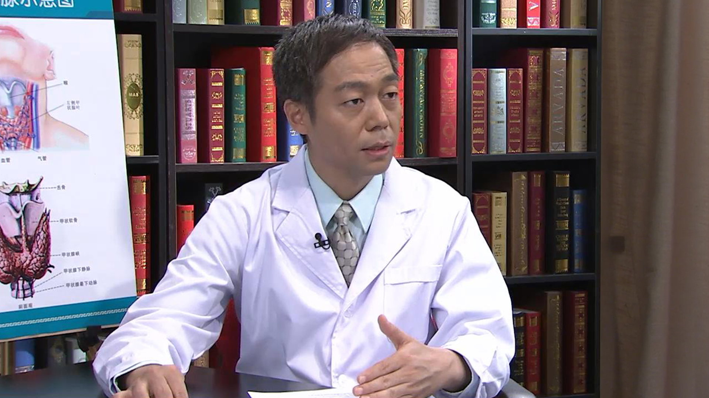

# 1.71 妊娠甲状腺疾病

---

## 杨兆军 主任医师

中日友好医院内分泌科主任医师 教授；

中华糖尿病学会流行病学组委员；《中华糖尿病杂志》编委；《中国糖尿病杂志-基层医生版》编委 ；Diabetes research and clinical practice杂志（中文版）编委；《中华医学》审稿人；《药物不良反应杂志》审稿人。

**主要成就：** 北京科技进步一等奖；首届中国胰岛素分泌研究组新星奖；2012年北京优秀中青年医师奖；参加多项省部级课题和国际多中心研究，在《糖尿病研究和临床实践》《中华内分泌代谢杂志》《中华医学》European Heart Journal，Circulation，PLOS ONE，Horm Metab Res等国内外核心医学期刊上发表论文50余篇，参编内分泌专著4部。

---

## 妊娠期间甲状腺可能会得哪些病？

这是一个大家非常关注的问题，尤其现在放开二胎，更应该有这些关注。

妊娠期，甲状腺的疾病都是可以得的。我们常规的内分泌的这些疾病，主要三个方面，一个是甲状腺功能减退，一个是甲状腺功能亢进，还有甲状腺的结节，主要分为三个方面的内容。
在这些疾病中，可能大家比较关心的可能是甲状腺功能减退，在一些有条件的地方，都常规的进行甲状腺激素的筛查。

特别是现在要怀二胎以后，年龄都是35岁甚至40岁，所以她做产前检查经常会发现一些甲状腺功能的异常，实际上很大一部分，可能都属于甲状腺功能减退，或者比较轻的甲状腺功能减退，我们叫亚临床甲状腺功能减退。

---

## 哪些女性怀孕前最好做下甲状腺的筛查？

首先甲状腺疾病与遗传有一些关系。
包括甲状腺疾病家族史，一般老百姓听说家族史就意味只是母亲、父亲，实际上并不是这样，包括你的兄弟姐妹，包括姨，如果这些人有过甲状腺疾病，比如说甲亢或者甲减，有这种病史的人，我们觉得你是一个高危人群，这是需要做筛查的。

第二个，如果你在以前曾经检查，发现过甲状腺功能的异常，或者发现过甲状腺结节，或者是有过甲状腺抗体阳性——甲状腺抗体一般的病人可能不知道，实际上我们一般做甲状腺功能检查，甲功七项有两项是甲状腺抗体，有甲状腺抗体阳性的这种病人——或者是在你的平时生活中经常有怕冷，或者是特别怕热、心慌，有这些甲亢或甲减的一些症状要找医生去判断，有没有可能是甲状腺功能的一个疾病，需不需要做进一步的检查。

另外，在外观比如照镜子发现甲状腺有肿大，甲状腺实际上就是在我们颈前部，就像一个蝴蝶，就像我们图上看的这一样，是一个蝴蝶形的结构，当它肿大以后，你在吞咽或者是在照镜子会发现它上下移动，就会发现明显的鼓出一个包，这种情况我们可能要做一些检查。

特别是孕妇她在以前有过不明原因的胎停育，或者是不明原因的流产，或者是早产这种病史，我觉得也是一个（危险因素）。我们再次怀孕的时候，她应该做甲状腺功能的一些筛查。
还有一些甲状腺疾病是属于地方性的疾病，比如说已知这个地方它是一个缺碘的地区，比如说山区它可能接触到海产品比较少，或者已经明确知道是缺碘的地区，这些情况在怀孕之前，都应该最好做一个甲状腺疾病的一个筛查。

一般来说我们在怀孕之前三个月以内，做甲状腺疾病的一个筛查，我认为都是可以的，因为如果发现异常及时调整，这个也是很好的。

---

## 怀孕后甲状腺相关激素的水平怎么变化的？

这是一个非常专业的一个问题，因为我们知道怀孕以后，我们体内的不仅仅是甲状腺激素，我们实际上所有的激素都适应妊娠的特殊的生理需求，我们体内的激素都会发生很大的一个改变。

对甲状腺疾病来说甲状腺激素实际上分为几个，大家说的甲状腺机能，比如说T3、T4就是甲状腺激素，还有脑垂体分泌的激素我们叫TSH，叫促甲状腺激素，实际上最重要的，可能最敏感的一个指标，我们一般是指什么？就是TSH。

首先我们知道在怀孕之前，我们怎么知道这个人怀孕，停经了，过了月经期，该来月经她没来，到医院去做个尿的检查，实际上我们查她尿的HCG叫绒毛膜促性腺激素，或者测血的绒毛膜促性腺激素，这个激素在怀孕之前它可能就是只有5，只有6个单位，在怀孕以后随着孕周的增加，它会成倍的增加，甚至怀孕七八周可以到高峰，可以到几万甚至十几万的一个水平，升高了上万倍。

这种情况下由于这个激素的改变，它会引起我们体内其它激素的改变，包括甲状腺激素，我们TSH的水平在妊娠早期由于HCG的增高，它会刺激甲状腺激素的分泌，并且引起甲状腺球蛋白的一个改变，它会导致什么呢？

TSH从最开始的正常水平，它会有一个逐渐下降的过程，甚至低于正常，到了妊娠八周以后，这个TSH会逐渐逐渐回到一个相对正常的水平，即使是这种情况下它也比一般的没怀孕的时候TSH水平要低，TSH水平是逐渐先下降，后逐渐回到正常的状态，这是我们说垂体分泌的促激素。

另外一种还有一个叫甲状腺真正分泌的激素，我们叫T3、T4，就是老百姓常说的甲状腺激素，由于这个激素分泌出来以后，绝大部分的激素就跟我们这个仓库一样，它在血中要和一种蛋白，甲状腺球蛋白，绝大部分都和甲状腺球蛋白结合在一起，还有一部分和白蛋白结合在一起在血中运输，这个时候是没有生理功能的，这个激素是在仓库里放着呢，只有FT3、FT4游离的这个激素，它才真正起到激素的一个作用。

但是由于在怀孕的时候，由于这个HCG的作用，还有雌激素的作用，我们体内的甲状腺结合球蛋白增加，也就是我的仓库大了，这个时候你要测激素水平的时候，测甲状腺激素水平的时候，你会发现T4它随着孕周的增加，是逐渐逐渐增高的，甚至会高于什么呢，高于妊娠之前的两倍，甚至三倍有的都可以。

所以在有些怀孕早期的时候，有的做甲状腺激素水平会发现什么？TSH比正常低，同时T3、T4高于正常，我们一般正常值的一个水平，感觉像是一个甲亢，但实际上并不一定是甲亢，所以它的激素的改变总的说，TSH值下降然后再升高，甲状腺激素的水平就是T4，它是随着孕周的增加是逐渐升高，一般到了妊娠差不多12到14周以后，相对达到一个比较稳定的一个水平，但是它也会比妊娠之前平均要高差不多一倍到两倍左右的增高。

---

## 甲状腺疾病筛查一般需要做哪些检查？

一般说主要分为两个方面，一个是形态学的检查，第二个是激素水平的测定。

形态学筛查我们最简单也无创的方法，就是做甲状腺的超声，甲状腺超声就是用高敏的探头，看看甲状腺里面有没有结节或有没有甲状腺肿大，甲状腺血流的情况，这个是一般的主要是看形态，但它并不能代表我的功能是怎么样的，因为甲状腺功能亢进或甲状腺功能减退，它的甲状腺都可以肿大，也可以甲状腺功能正常，这主要是看甲状腺有没有所谓的长结节，有没有长东西，有没有长肿物。

更重要的是要看看激素水平的测定，就看看有没有甲亢，有没有甲减，功能是不是非常正常的一个状态，我们只要抽血就可以，一般我们就做一个甲功五项，同时可以做一个甲状腺抗体，就是我们最重要的就是甲状腺过氧化物酶抗体，叫TPO抗体，一般我们是做抽血做两项的检查，做一个甲状腺超声作为一个筛查来说，我认为应该是比较全面的一个筛查了。

---

## 怀孕后如何早点发现甲状腺功能异常？

在有条件的话只要怀孕或怀孕早期，我都做一个检查，我觉得就肯定能够发现，如果要是说没有这种条件，不可能做到普查，只要怀孕就做这些检查。

我觉得在一些高危人群，有家族史的或者以前曾经有过甲状腺疾病，或以前怀孕过程中有过异常妊娠史，比如有过胎停育的情况，还有发现甲状腺有肿大的，或者是有一些心慌，不明原因的心慌或者出汗，或者不明原因的体重消瘦。

有这些甲亢或甲减的临床症状，我们叫高风险的人群，进行甲状腺激素的检查，我们就查一个TSH，或者就查一个TPO抗体，我想做这两项也是可以及时发现有没有甲状腺功能异常的。

---

## 怀孕期间筛查甲状腺功能哪些检查不能做？

因为甲状腺疾病的筛查有很多的方法，比如说我们还有些核素的方法，叫引入一些放射性同位素，比如说我们做甲状腺的同位素扫描或甲状腺吸碘率，这些是在怀孕期间我们是绝对禁忌的。

因为这些同位素可能通过胎盘到胎儿的体内，引起不良的反应，所以在怀孕期间所有与核医学，或者与放射有关的这些检查，我们是尽量的不做，特别是在早期，这种同位素的检查我们是绝对禁忌的。

如果从形态学的评估来说，我们一般可以做一个甲状腺彩超，因为彩超对于妊娠是没有任何的影响的，对胎儿也没有任何的影响，也没有放射线，它只是声波，所以做形态学的判断，我们可以做这个。

第二个就是一个体外的试验，我们抽一管血，进行甲状腺激素的一个测定，基本上就是这两项就可以。

---

## 为什么孕期发生甲状腺疾病的几率会增大？

这也是一个比较复杂的问题，因为我们现在发现在我们门诊来就诊的孕妇越来越多，我觉得有两个方面。

一个是可能真的是发病率确实是增加了，与我们的生活环境（有关），有些流行病学调查发现，可能与我们碘的摄入量是不是有关系，比如是不是加碘加多了，这与我们的生活环境有关系的，包括我们说的污染，或者是我们的饮食的一些结构，这些可能有关系。

第二点真正导致疾病增加的，包括我们甲状腺疾病，它与我们的情绪，与我们的紧张是有关系的，因为现在人生活压力也非常大，各种情绪的一些应激，也可能是导致这种疾病高发的一个原因。

另外一个方面我们现在判断的病人，很多的原因是什么？是因为她以前不知道，因为怀孕以后她做一些检查，发现了很多（疾病），都是把它诊断出来了。

所以这种疾病的增多，包括甲状腺结节的增多，都是诊断出来的，比如以前做查体都不做超声，现在做查体都常规做超声，如果用超声来检查至少50%的人都可以发现有结节，但你不做你可能不知道。

所以我们觉得发现周围的甲状腺疾病越来越多，实际上与我们的检查手段的一个提高，与及时的进行筛查可能也有关系。

---

## 妊娠期得了甲状腺疾病孕妇和胎儿会有哪些影响？

这个也是大家关心的问题，实际上这个与甲状腺疾病严重程度是有关系的，总的来说甲状腺疾病对于胎儿和对母体可能都是有一定的影响，可能与你的疾病的严重程度有关。

如果是比较轻的甲状腺功能异常，比如说亚临床甲减，多半来说可能影响不太大，但是总的说它可能会导致什么？对胎儿来说比如甲亢的病人，它可能会导致胎儿发育不良，宫内发育不良，或者是我们叫足月小样儿，就是长得非常的瘦。

第二个这个胎儿可能在发育过程中可能因为其它的原因，出现宫内死胎或胎停育，流产或者早产，对孩子来说都是发生率都是增加的。不管是甲状腺功能亢进还是甲状腺功能减退，基本上这种女性在怀孕过程中，胎停育以及流产的机会，要比非甲状腺疾病要高三到五倍的增高。

第二个因为甲状腺疾病是一个自身免疫病，像甲亢的病人母体中会产生一种抗体，我们叫TRAb，就是甲状腺激素受体的抗体，它可以刺激甲状腺的一个增生，让甲状腺激素分泌增多，同样这个抗体它也可以通过胎盘到达胎儿体内，如果没有很好的控制的话，也可以引起胎儿或者新生儿的甲状腺功能亢进，所以我们说可以引起新生儿的甲亢，这是对孩子的影响。

对母体的影响同样也是，甲亢或甲减，同样对母体可能会有一些损害，比如她可能体重下降，有心慌，增加心衰或者是先兆子痫，以及妊娠性高血压，所有这些并发症的发生也比那种没有甲状腺疾病的女性要多得多。

---

## 妊娠期出现的甲亢都需要治疗吗？

这也是两个方面来说，一个是在妊娠期发现甲亢有两种，一种是真正的是自身免疫系统的甲亢，自身免疫系统疾病引起的甲亢，我们最常见的就是Graves甲亢，她体内产生抗体，这种抗体会导致她甲状腺增生，甲状腺激素分泌增多，这种是一种情况。这种情况一般来说她需要用药物，在妊娠期我们需要服药来进行治疗。

另外一种所谓的就是说妊娠相关的甲亢，它这种甲亢是由于与妊娠相关的，比如在一些妊娠早孕反应非常明显的这种女性，我们叫妊娠剧吐，恶心吐非常明显，这时候你做甲状腺功能检查，有的人可以出现什么？T3、T4增高、TSH下降，我们叫出现甲亢的一个表现，并且可以有甲亢的一些表现，这种多半来说是一过性的。

这种妊娠相关的甲亢现在一般认为，可能与过高的HCG有关系，绒毛膜促性腺激素，它分泌太高了，它可以刺激甲状腺激素的一个分泌的增多，这种甲亢一般来说不需要特别的治疗，它一般经过了12、14周以后，随着HCG的下降它多半自己能够缓解，这是第二种情况。

还有是甲状腺炎，一般来说在妊娠期发现比如说亚甲炎，这种出现的甲亢一般也是一过性的，多半来说我们只要观察就可以。

---

## 女性甲亢患者还能怀孕吗？

最主要就是她的甲状腺功能要回到一个正常的水平，比如我们做T3、T4和TSH的水平，它能回到一个正常的水平。

第二个如果在甲亢治疗过程中，经常可能有些人在服用抗甲状腺药的过程，她出现药物性的甲减，这时候往往我们会给她加一个优甲乐，就是加一个甲状腺激素，一方面把她甲状腺功能控制正常，另外一方面要给她补充一点甲状腺激素。

所以在怀孕之前一般我们建议，就是把这个补的这个甲状腺激素停掉，也就是说有可能她的抗甲状腺药物需要减少，减到一个更小的用量，同时把她补充的甲状腺激素停掉，同时再做甲状腺功能，T3、T4和TSH的正常水平，基本上这些情况她应该就可以怀孕。

---

## 妊娠对甲状腺疾病会产生哪些影响？

这也是一个非常重要的问题，这是相互影响的。一个是甲状腺疾病可能会影响妊娠，同时妊娠对甲状腺疾病可能是有一些影响的。
主要是由于妊娠期间其它激素一些改变，可能会对甲状腺功能会产生一些影响，一般说来比如甲亢，一般来说它在妊娠的前半程，在前面的15到20周，一般甲亢的病人可能甲亢有可能会加重。

主要是因为我们的HCG水平增高以后，它会刺激甲状腺激素的一个分泌，但是到了妊娠的后半期，也就是到了15到20周以后，甲亢是一个自身免疫病，因为在怀孕的话，胎儿对于母体来说是一个异物，我们机体的免疫会发生降调节，就是说她免疫功能变得相对不太活跃，既然胎儿能在她体内很好两个相融的话，她的免疫功能会做出妥协，就是要下降，下降以后这些自身免疫病也会相对的缓解。

所以到了妊娠差不多15到20周以后，后半程的话一般对于甲状腺疾病来说，像甲亢的病人她是倾向于缓解，并不是说一定是加重的。

对于甲减，如果是以前得过甲减的病人，她在怀孕之前也在吃药，甲状腺功能都正常，但是在怀孕以后，也是由于我们的HCG或雌激素的一个改变，导致甲状腺仓库会增大，就是我们说的甲状腺结合球蛋白增加，这有可能会导致什么？她的药物量需要增加，就是她吃优甲乐以前可能吃一片，在怀孕以后她的药量，可能随着孕周的增加她可能需要逐步的增加。

具体增加多少要根据每个月到医院去检查的激素水平，由医生建议她要加比如说四分之一片，还是半片，它替代的甲状腺激素量有可能需要增加。

第三个还有妊娠结束以后，对甲状腺疾病可能也会有些影响，我们还是一样，因为在妊娠的时候像自身免疫病是倾向于缓解，但一旦这个孩子分娩以后，这个母体的免疫功能又开始活跃，又开始回到正常的状态，所以一些自身免疫病有可能会加重，同样的像这种甲状腺炎，引起的甲状腺的功能的减退也好，功能亢进也好，它可能会加重，甚至在没有甲状腺功能疾病的这种孕妇，她分娩以后在一年以内，也是容易发生，我们叫产后甲状腺炎。

所以就是说可能妊娠对于甲状腺疾病，确实会产生影响，如果已经有这种甲状腺疾病的女性的话，她在妊娠期间应该定期的，我们一般是四到六周到医院做一个定期随访。

---

## 甲减患者在妊娠期也要坚持服药吗？

首先说治疗甲减的药就是优甲乐，它实际上和我们体内的T4甲状腺激素是一样的，只是人工合成的，它对我们的肝功和肾功能没有任何的要求，她只要正常的服用，合适的剂量，她的妊娠对胎儿都没有任何的影响。

相反如果是甲减的病人如果你不服这个药物，特别在早期胎儿的甲状腺还没有开始发育，他的甲状腺激素的水平完全是与她母体的激素水平是相关的，但是这个激素水平对于孩子的神经系统的发育，以及对他的智力的发育都是非常重要的，如果激素不足会导致这个孩子神经系统发育的一些迟滞，以及智力方面的异常，所以更应该要服用甲状腺激素。

所以对于甲状腺激素来说，只要合适的一个剂量，它是没有任何的影响，并且对孩子的神经性的发育是有益的，这是治疗甲减的药物。

---

## 女性甲亢患者怀孕后怎么用药？

治疗甲亢的药物我们分为两种，国际上有两种类型的药物，一种叫甲巯咪唑，就是我们常说的他巴唑或赛治，另外一种叫丙基硫氧嘧啶，这两种药物的话总的说来，对妊娠来说都是属于B级用药，B级用药基本上还是安全的。

但是一般来说在怀孕以后，我们首选的是丙硫氧嘧啶，因为这个药物基本上很少通过胎盘，对胎儿不会产生明显的一个影响。赛治的话就是我们说甲巯咪唑这个药物的话，它会比丙嘧通过胎盘要多一些，也有文献报道或有些病例报道，发现用这个药以后会出现胎儿的头皮发育的一个异常，就是新生儿的头皮缺损，当然还有一些其它的少见的一些情况。

所以一般我们就尽量的避免使用甲巯咪唑，如果是甲亢的病人他必须要用药物来维持甲状腺功能正常，我们首选丙嘧，特别在妊娠的早期。
但是另外一个方面，因为不同的药物都有对母体会产生影响，包括丙嘧它容易引起肝功能的异常，引起白细胞下降，如果这个孕妇在孕期服用这个药物出现了肝功能异常和白细胞下降，她没有办法，她也可以服用甲巯咪唑这个药物，总的来说它的不良反应，对胎儿的影响有可能潜在性会大，但如果实在是不能服丙嘧的话，也可以服用甲巯咪唑，在监测的情况下，我认为应该是没问题的。

---

## 亚临床甲减患者在妊娠期需要治疗吗？

（亚临床甲减）实际上就是一个比较轻的甲状腺功能减退，常规的理解来说就是这样，我们所说的亚临床甲减是什么意思呢？

反应甲状腺功能的话有几种激素，一种是TSH，我们叫促甲状腺激素，第二个是T3、T4，所谓的临床甲减是什么？这个患者TSH的水平增高，超过正常，同时T3或T4已经低于正常，这些激素都有改变的，我们叫临床甲减了。

亚临床甲减是什么？还是比较轻的一个甲减，它只是表现TSH水平的增高，超过正常，但是T3、T4还在正常代偿的状态，就还在完全正常的水平，所以它表现非常轻的一个表现。

这种亚临床甲减在怀孕过程中是不是要治疗，它对于后代的影响会不会有明显的影响，不同的研究目前看结果并不是完全一样，有些研究认为亚临床甲减可能也与后代的，出生以后孩子的智力也有一定的关系。

所以有的人建议在孕期对于亚临床甲减，也应该少量的替代甲状腺素，因为这个药物它是非常安全，也不会有不良的反应，替代可以带来好处，但是目前来说还没有证据证实，对于亚临床甲减的患者，并且TPO是阴性的患者，替代优甲乐她一定能得到好处，所以目前不同的医生或不同的医院，不同的国家，在掌握这个替代的时候可能也是不一样的。

比如在美国他是建议如果是TPO阳性的亚临床甲减，就是有个抗体阳性的亚临床甲减，我们肯定要用优甲乐来进行治疗，把TSH控制到正常。对于TPO阴性的TSH增高的亚临床甲减，可以替代也可以不替代，但是鉴于这个药物对于母体和婴儿都没有不良的影响，并且替代有可能得到好处，所以可以建议，如果对一些女性的话她如果愿意，她可以服用这个药物。

---

## 妊娠期得了弥漫性甲状腺肿伴甲亢会有哪些危害？

这是我们最常见的一种类型的甲亢，有的也把它叫做TRAb阳性的这种甲亢，我们叫Graves病，这种主要有两个方面的影响。

一个是对母体的影响来说，如果是没有很好的控制的话，母亲在怀孕过程中她可能会出现消瘦，出现心慌，出现心衰的表现或妊娠期的先兆子痫，这些都发生会明显的增加。

另外就是说对于胎儿的影响也是非常显而易见的，主要是什么呢？因为它是高代谢的疾病，这个激素升高以后，一个是TRAb这个抗体，可以到达胎儿的体内，胎儿的甲状腺的增生，甚至发生新生儿的甲亢都可以，所以它可以引起新生儿甲亢。

另外由于母体的一般状况代谢增强，营养物质的一些异常，会引起胎儿的在宫内发育的异常，宫内发育迟缓，或者是孩子出生以后他的体重非常非常小，还有一些先天的一些异常的情况，另外就是在早期的话如果没有控制的话，这种胎停育或者是宫内死胎，或者这种流产的这种机会是增加的。

---

## 妊娠期的甲亢怎么办？

一般来说，因为我们治疗甲亢有三种治疗的方式，一个是药物治疗，第二个是放射性同位素，第三个是手术。

首先对于孕妇来说第二种治疗方法，放射性同位素我们是绝对不考虑的，是绝对禁忌的，我们就不用管它，剩下还有一个是药物和手术。

一般说来在妊娠的早期出现的这种甲亢，或者在以前就得的甲亢，在怀孕了她仍然没有控制，这是我们首选的治疗还是药物治疗，首选是丙硫氧嘧啶，我们的原则是什么呢？用一个尽量小的一个用量，就是用尽量小的一个抗甲状腺药物，来维持她甲状腺功能接近正常的一个水平，这个甲状腺激素水平可以在正常上限都是可以，同时在治疗过程中我们不要加优甲乐，因为什么？如果你要加优甲乐说明什么，你的抗甲状腺药物是用的量非常大的，所以我们注意这两点。

第二个关于手术的问题，如果这个患者她在治疗过程中，这个药物治疗效果非常差，或者是在治疗过程中她发生的药物的不良反应，比如吃这个药物出现肝功能异常，或者出现白细胞下降，或出现过敏反应，导致她不能使用这个药物，她应该考虑手术治疗，一般手术的时机我们一般选择在妊娠的中期进行手术。

关于这个手术的话，当然不同的治疗方式可能各有优缺点，手术实际上把甲状腺大部分切掉，相当于把你产生这个激素的机器减少了，你甲状腺激素可以恢复正常，另外一个方面手术毕竟是一种创伤，因为我们甲状腺颈部的这个地方，除了我们甲状腺以外还有很重要的神经和血管，所以手术的并发症它有可能会出现。

比如万一要（损伤）到喉返神经可以出现声音嘶哑，或者损伤到甲状旁腺可以引起低钙抽搐、甲状旁腺功能减退。虽然这种手术出现这种几率非常非常低，因为手术的技术的提高，这种手术风险非常低，但是还是偶尔可以看得到，有这种并发症的这种出现。
第二个手术的话也是凭经验，把甲状腺大部分切除，我切少了可能还是亢进，切多了有可能会出现甲状腺功能减退，所以也有这样的一个问题。

还有手术毕竟是一个麻醉，还有一些麻醉的风险，所以我觉得它可能也有一些弊病。

一般来说我们觉得在孕期，如果先用药物治疗能够控制，没有并发症，所谓的并发症就出现药物的不良反应，一般我们是首选的是药物的一个治疗，用一个非常小的剂量维持它甲状腺激素正常，或者哪怕甲状腺激素在正常偏高的水平，基本上都是可以的。

---

## 甲亢的女性哺乳期服药的同时哺乳对婴儿有影响吗？

这个是大家很关心的问题，首先的回答是肯定的，肯定可以哺乳，没问题。

一般的话在哺乳期间也是，因为这两种药物，我们说一个是甲巯咪唑，还有一个是丙硫氧嘧啶，这两个药物丙嘧在乳汁中监测到的含量是更低的，乳汁的穿透率更低的，甲巯咪唑会高一些，但是目前来看，我们觉得这两个药物，实际上在哺乳期间都是可以用，我们一般首选的药物还是丙硫氧嘧啶，包括我们的指南还是首选丙硫氧嘧啶。

它的原则也是用一个尽量小的用量，一般来说这个药物，丙硫氧嘧啶一天在150毫克，就是一天在小于三片的情况下，小于等于三片的情况下，一般对于孩子的甲状腺功能没有明显的影响，一般她在给孩子哺乳以后她马上吃上这个药，下一次哺乳的时间离这个有三四个小时，一般大部分指南是这样建议的。

如果这个人她对于丙嘧不能耐受，我认为这个甲亢又需要治疗，也是可以考虑用另外一个药物，就是甲巯咪唑也是可以的，原则说也是一样，我们用一个很小的剂量。

---

## 妊娠期得了甲状腺疾病的患者产后该怎么用药？

一般来说如果这个患者是在孕期发现了亚临床甲减，如果她孕前没有吃甲状腺药物的，一般我们建议她分娩以后就可以把这个药停掉，但停掉以后过四周到八周之间，或者四到六周的时候，就是停掉四到六周以后她再做个甲状腺功能的检查，如果甲状腺功能正常了就说明什么？她甲状腺功能恢复正常，我们继续停药就没问题。

另外一种情况是什么？这个患者有甲减，在怀孕之前就有甲减，一直在吃这个药，在怀孕以后这个药物她需要增加的，在分娩以后，我们把她的药可以恢复到她怀孕之前的一个用量，比如她怀孕之前用的是一片，在怀孕以后她加到了一片半或者加到了两片，孩子出生以后她可以把药先恢复到她的以前的一个用量，孕前的用量，比如说一天一片，也是一样，四到六周以后去医院做检查，看看是不是合适，如果合适她继续服用，这是甲减的一个情况。

甲亢也是，甲亢的话还是和平时一样的治疗的情况，还是按照规律，每四到六周她可能做甲状腺功能的检查，让医生来判断这个药物是不是减量，还是继续服用，还是可以停药，一般来说产后我们觉得四到六周复查，不能随便停药的，特别甲亢的治疗，也是要持续治疗一段时间。

---

## 妊娠甲状腺疾病患者应注意哪些问题？

首先我们得坚持服药，如果她是甲减的病人，还是甲亢的病人，该用什么药物我们都要她坚持服用，一般的人认为是药三分毒，对孩子可能会有不良的影响，所以就不敢去服用了，这是不对的。

因为我们觉得在这些药物，只要在医生指导下，特别是优甲乐这个药物，它实际上对胎儿没有什么不良的影响，对于甲减的患者的话服用（药物），对胎儿和对母体都是有好处的，所以找到一个合适的剂量要坚持服用。

第二个就要定期的监测，你不能说服用药物，我什么时候吃，这个量，不去检查，因为在不同的时期，激素的我们控制的水平是不一样的，所以要遵从医嘱，比如四到六周左右，要到医院去做甲状腺功能检查，我们调整甲状腺激素的一个用量，或者调整抗甲状腺药物的用量，第二个是监测。

第三个就是饮食方面也是要注意的，一般来说没有什么很特别的，主要是适量的碘的摄入，可能是比较重要的，不能过多也不能过少。

对于碘的摄入，一般我们说甲亢以后，可能要低碘饮食，就让他限制碘的摄入，到孕妇以后她也是限制碘的摄入，我们在门诊看到有的甲亢的女性，她怀孕以后，仍然用无碘盐，她怕甲亢复发了，高碘怕甲状腺复发，这是一种情况。

还有的一般老百姓认为我甲状腺疾病，大脖子病，以前都是加碘，多吃海带，多吃紫菜，实际上两个极端的情况都存在。

实际上我们觉得总的说来适量的碘的摄入是正确的，你不能过多也不能过少，对于甲亢来说合并了这种妊娠的甲亢的女性来说，她碘的摄入量我们觉得也不能少，因为在怀孕期间我们碘的需要量，是比非怀孕是要明显增加的，所以对于甲亢来说，她在怀孕之前可能是低碘饮食，怀孕以后她的碘应该恢复到正常，甚至还要增加。

如何来判断你的碘的摄入量是多还是少？一般我们要做一个定量的检测的话，可以做个尿碘的检查，我们反应你的饮食中碘的摄入量是不是合适的，我们可以测晨起的尿的碘的含量，这是世界卫生组织公认的一个判断你的碘的营养状况的一个指标。

一般来说在怀孕期间我们要求她尿碘的排出是多少呢？一般我们要到150到250个微克每升可以的，这是一个非常抽象的概念。

这种情况我们一般怎么来给你建议，一般我们说怀孕以后你应该还是用正常的碘盐，我认为是必需的，还是应该吃正常的碘盐就可以，是不是要额外的再补充更多的碘，这时候我觉得你在普通碘盐的情况下，你可以去做一个尿碘的监测，这个医院都可以做，看看你尿碘的排出是不是在我说的这个范围，150到200甚至250微克每升，如果在这个范围说明你每天碘的摄入量是合适的，你继续这样饮食就可以。

总的说来我觉得不能说在怀孕，你还要限制碘的摄入，有的甚至无碘盐，因为当你碘不足的时候，胎儿的甲状腺激素从哪儿合成，因为碘是我们合成甲状腺激素非常重要的一个原料，当你原料不足的时候，胎儿甲状腺会肿大，甲状腺激素也会减少，母体的甲状腺激素也是合成不足的。

所以我说碘是要适量，不能过多也不能过少，它的一个最科学的方法是测尿碘的测定，看含你的尿碘是不是在要求的水平。

（采访）在生活上需要保持一个很好的心情，很好的状态。

当然这些对所有的疾病都应该是这样，对于甲状腺疾病来说，我认为更应该是这样，因为甲状腺疾病它是一个与遗传有关的自身免疫系统的疾病，是自身免疫紊乱导致的，现在很多人认为情绪紧张、焦虑，是诱发自身免疫紊乱非常重要的因素。

---

## 孕期如何判断碘的摄入量是否合适？

如何来判断你的碘的摄入量是多还是少？一般我们要做一个定量的检测的话，可以做个尿碘的检查，我们反应你的饮食中碘的摄入量是不是合适的，我们可以测晨起的尿的碘的含量，这是世界卫生组织公认的一个判断你的碘的营养状况的一个指标，一般来说在怀孕期间，我们要求她尿碘的排出是多少呢？一般我们要到150到250个微克每升可以的，这是一个非常抽象的概念。

这种情况我们一般怎么来给你建议？一般我们说怀孕以后你应该还是用正常的碘盐，我认为是必需的，还是应该吃正常的碘盐就可以，是不是要额外的再补充更多的碘？这时候我觉得你在普通碘盐的情况下，你可以去做一个尿碘的监测，这个医院都可以做，看看你尿碘的排出是不是在我说的这个范围，150到200甚至250微克每升。如果在这个范围说明你每天碘的摄入量是合适的，你继续这样饮食就可以。

总的说来我觉得不能说在怀孕你还要限制碘的摄入，有的甚至无碘盐，因为当你碘不足的时候，胎儿的甲状腺激素从哪儿合成，因为碘是我们合成甲状腺激素非常重要的一个原料，当你原料不足的时候胎儿甲状腺会肿大，甲状腺激素也会减少，母体的甲状腺激素也是合成不足的。

所以我说碘是要适量，不能过多也不能过少，它的一个最科学的方法是测尿碘的测定，看含你的尿碘是不是在要求的水平。

---

## 如何预防甲状腺疾病的发生？

谈到预防这方面，也是要看看是什么样的疾病，总的说来可能对很多疾病来说，可能预防是更重要的，但是对甲状腺疾病来说，一个是从它的发病原因来说，因为这种自身免疫系统疾病，可能是与人们的情绪紧张是有关系的，所以当你发现有些异常要及时调整自己的心态，保持一个平和的心态，可能是一个防止这个疾病加重的一个非常重要的因素。

第二个我们说饮食中的正常的饮食，比如一些碘的摄入了，包括现在发现有一些食物中有一些致甲状腺肿的一些物质，当然现在还不是很肯定，但是我想如果有这方面的风险，比如说我家族中是一个甲状腺疾病高风险的人群，对碘的摄入量这些方面，我们觉得可能也是要注意。

第三个预防来说，你说有什么药物来预防，目前还做不到，但是我想可能另外及时的去医院检查，及时发现一些异常，轻度的异常，我们就可以马上进行治疗，这可能比较重要的。

---

## 甲状腺疾病会遗传吗？

因为说到遗传大家可能会害怕，我们说这个人长的像爸爸，长的像妈妈，实际上是一种遗传，我们叫做表情可以遗传到下一代，同样我们的疾病也是我们的一种表现形式，因为我们母亲和父亲会有一半的染色体会给到后代。

所以甲状腺疾病的易感性有50%的几率，比如母亲有这个易感基因，有50%的几率会给到后代，但是甲状腺疾病还不是传统意义上说的遗传性的疾病，它是我们叫遗传易感，它与遗传有一定相关的一个疾病，甲状腺疾病的后代比其他的没有甲状腺疾病的这种家庭的后代，更容易发生甲状腺方面的异常，所以我们说他是有一定的遗传易感性的。但是并不是说母亲有孩子一定会有，所以也不用过度担心。

第二个有些人说，怀孕过程中得了甲亢或者得了甲减，我的孩子是不是要一出生就要去做这种检查，在目前来说不管你是有没有甲状腺疾病的这种母亲和父亲，孩子出生以后都要常规的要采集足跟血，测定甲状腺TSH的水平，如果这个有异常需要做进一步检查，如果没有异常我们觉得不需要再做进一步的检查。

---

## 妊娠期甲状腺疾病有哪些认识误区？

比如说她有甲状腺疾病，甲亢也好甲减也好，怀孕以后她不敢再服用药了，这是不对的。

第二个在怀孕期间发生的甲亢和甲减在治疗过程中，她可能治疗一段时间甲状腺功能正常，马上停药，非常担心甲状腺药物会对胎儿，会对自己产生不良的影响，实际上相反，在怀孕过程中这个药物一般来说是要持续使用的，这是第二个。

第三个对碘的一个误区，对于碘的摄入，一般我们说甲亢，甲亢以后可能要低碘饮食，就让他限制碘的摄入，到孕妇以后她也是限制碘的摄入，我们在门诊看到有的甲亢的女性，她怀孕以后仍然用无碘盐，她怕甲亢复发了，高碘怕甲状腺复发，这是一种情况。

还有的一般老百姓认为，我甲状腺疾病，大脖子病，以前都是加碘，多吃海带多吃紫菜，实际上两个极端的情况都存在。

实际上我们觉得总的说来，适量的碘的摄入是正确的，你不能过多也不能过少，对于甲亢来说，合并了这种妊娠的甲亢的女性来说，她碘的摄入量，我们觉得也不能少，因为在怀孕期间，我们碘的需要量，是比非怀孕是要明显增加的，所以对于甲亢来说，她在怀孕之前可能是低碘饮食，怀孕以后她的碘应该恢复到正常，甚至还要增加。

---

## 甲状腺对人体到底有哪些功能？

甲状腺是我们体内最大的一个内分泌腺体，我们体内常规的内分泌都是指什么呢？比如脑垂体、甲状腺、肾上腺，还有我们的性腺，在这些腺体中最大的腺体是我们甲状腺，它也是最表浅的一个腺体。

我们从这个图可以看看，甲状腺在我们的颈前部，就是在甲状软骨的下方，一般在气管的旁，呈蝴蝶形的形状，一般分为左右两叶，中间是一个颊部，有的少数人有个中间叶，就是这个地方凸出一块，这个是解剖变异的一种情况。

一般这种甲状腺的大小，超声来测定的话，长径一般在4.5（cm）左右，正常人一般甲状腺的厚度是2到2.5厘米，所以一般我们做超声或者做肉眼上来看，或者是摸的时候，甲状腺肿大我们就可以看到这个地方，我们可以摸到有凸出的一个异常的一个组织，会比较明显。

我们做超声的检查，看看这些是不是有扩大，如果有大的话从客观上，我们就可以判定这个人有甲状腺肿大，另外甲状腺正常情况下，回声也是非常均匀的，它可以在炎症情况下，它可以出现甲状腺的回声不均匀，有的叫弥漫性的病变，比如甲状腺炎的时候，可以有这种情况。

另外还有最常见的甲状腺结节，甲状腺局限性的回声不均匀的情况，就会出现一个超声的一个结节，但实际上甲状腺结节来说，它并不是一个疾病的一个诊断，它只是超声上的一种形态，这种结节可以是恶性的，也可以是良性的这种情况。

第二个你说的甲状腺的功能，实际上甲状腺是我们非常重要的功能，因为它能分泌甲状腺激素，所谓的激素是什么？每天都要分泌很少量，它能调节我们代谢非常重要的一种物质，这种从传统意义上来说，经典的甲状腺激素第一个是调节代谢，我不吃饭我晚上睡觉的情况下，我的细胞，我的身体也会燃烧我们的热量，我们叫基础代谢。

所以当甲亢的时候基础代谢率会增加，它产热会增加，所以甲亢的时候他吃的很多，他还要消瘦或者体重不长，与这个有关系，一个是调节代谢非常重要的一种激素。

第二个它对我们生长发育是非常重要的，听说过一个呆小病，是先天的甲状腺激素的一个合成的异常，这个孩子在母体或甲状腺的一个解剖的异常，不能合并甲状腺激素，由于甲状腺激素对我们的神经系统的一个作用，它可以促进脑细胞的一个发育，智力的一个发育，同时也是我们身体长高非常重要的激素。

所以如果这个孩子在母体内就出现甲状腺功能减退，甲状腺激素分泌不足，或者是一些甲状腺激素结构的异常，它没有甲状腺激素的话，这个孩子长不高，不单长不高，他还有什么？出现智力的异常，我们叫呆小病，又呆又小，所以它是非常重要的一种激素。

如果在青春发育期，这个甲状腺激素，它也是我们促进身高非常重要的激素，如果甲状腺功能不足的人，即使你生长激素是正常的，这个孩子可能也不高，所以它是对生长发育也是非常重要的。另外可能对一些免疫的调节可能都有作用。

所以它是一个非常重要的一个激素。

---

## 患有甲状腺结节的女性可以怀孕吗？

肯定可以怀孕。

但首先我们知道，对一个有甲状腺结节的人来说，我们应该怎么来处理是非常重要的，因为现在我们查体都要做甲状腺超声，实际上在查体中，用超声来做检查的话，在健康查体中至少有50%到60%的人，都可能会发现有甲状腺结节，所以是非常非常普遍的。

即使我们用手去摸，医生用手去摸发现结节，大的结节这种发现的概率，一般文献报道是8%到10%的，都可以发现大的结节，这种结节能不能怀孕呢，或者要不要进一步的处理呢？

因为发现结节以后，我们首先要评判一下甲状腺功能是不是正常的，如果甲状腺功能正常，我们看看你甲状腺在超声上表现的形态，有没有所谓的恶性的表现，因为一般甲状腺的这种结节中，大概有4%到5%的结节是属于恶性病变，就是甲状腺癌，也就是绝大部分都是良性的。

如果功能正常又是良性的病变，我们可以定期随诊，一般我们建议你半年，在发现结节的两年左右，每半年做个超声，看看是不是变化，就主要看看有没有进行性的长大或长的比较快，要不要做进一步的检查，超声随诊。

如果是怀疑它是恶性的，比如超声上有哪些恶性表现，比如超声的表现的话，如果是个低回声结节，这个结节边界不清楚，非常不规则，还有这个甲状腺结节里面有一些点状钙化，就是沙粒样钙化，一般会叫强回声光点，有弥漫性强回声光点，或者是这个结节它在观察过程中长得非常快，还有就是甲状腺结节因为血流非常的丰富和紊乱。

如果有这些中的两三种那就说明什么？这个结节我们要高度怀疑它是恶性的，这种情况下要到医院去，我们在超声引导下做一个病理活检，就是做一个穿刺，穿出一部分细胞做病理的检查，有的时候我们还可以做一些基因突变的一些检查，来明确这个结节是良性还是恶性。

如果穿出来是恶性的结节那手术，如果是良性的结节我们继续随诊就可以，对于如果是功能正常的话，又是个良性结节，我们觉得你就正常怀孕就可以，不需要服用任何的药物。

---
