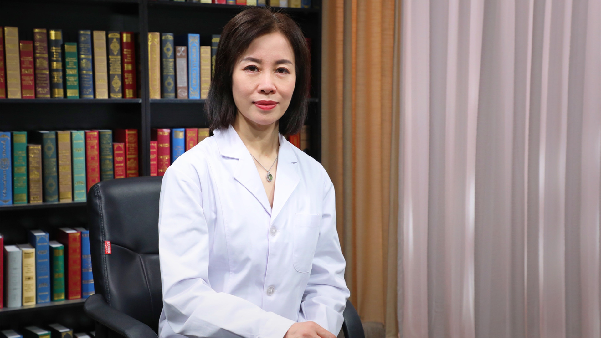

妊娠剧吐的中医调理治疗
======================

何军琴 主任医师
---------------

   1678427106171

首都医科大学附属北京妇产医院中医科主任 主任医师 教授；

中西医结合学会妇科及围产医学分会副主任委员；中国妇幼保健协会中医和中西医结合分会副主任委员；中华中医药学会妇科分会
生殖医学分会委员；中华中医药学会亚健康分会 治未病分会
精准医学分会常务委员。

**主要成就：**
主持参与国家自然基金、北京市自然基金、首特项目、首发基金等课题20余项；参编著作5部，国家精品工程教材1部，核心期刊发表论文30余篇。

**专业特长：**
主要从事中西医结合生殖内分泌领域的临床、教学、科研工作；擅长诊治反复自然流产、不孕不育、卵巢早衰、异位妊娠、盆腔炎性疾病、痛经、子宫内膜异位症、月经不调、妇科肿瘤放化疗术后调理等。
