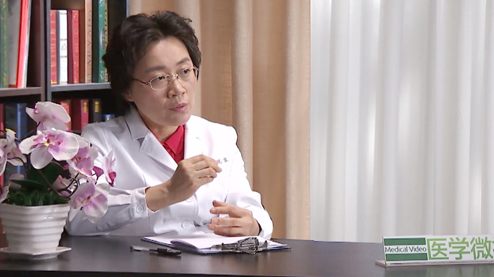

妊娠期糖尿病
============

杨慧霞 主任医师
---------------

   1678427222472

北京大学第一医院妇产科主任 主任医师 博士生导师；

北京大学妇产科学系主任；中华医学会围产医学分会前任主任委员兼围产营养与代谢学组组长；中华医学会妇产科学分会常务委员兼全国产科学组组长；中国医师协会妇产科医师分会常务委员兼母胎医学专业委员会副主任委员；中华预防医学会生命早期发育与成年疾病防控专委会主任委员；妇幼健康研究会母胎医学专业委员会主任委员；北京医学会围产医学专业分会侯任主任委员；国际妇产科联盟（FIGO）母胎医学专家委员会委员；国际健康与疾病发育起源（DOHaD）理事。

**主要成就**
：主编以及主译12部专业书籍；《中国实用妇科与产科杂志》《现代妇产科杂志》等杂志编委及常务编委；承担多项国际和国家自然科学基金以及北京市等多项基金，已经发表中、英文专业论文近600篇；2011年《妊娠期糖尿病母儿诊治策略及其推广应用》荣获中华医学科技奖二等奖；2011年《妊娠合并糖尿病规范化诊治及其对母儿结局的影响》获国家教育部科学技术进步奖二等奖；2013年荣获中华预防医学会科技奖二等奖；2014年荣获华夏医学科技进步二等奖；2014年荣获中国科学技术协会全国优秀科技工作者；2015年荣获第四届中国女医师协会五洲女子科技奖；2015年荣获中国妇女发展基金会颁发百姓身边优秀妇幼人。
