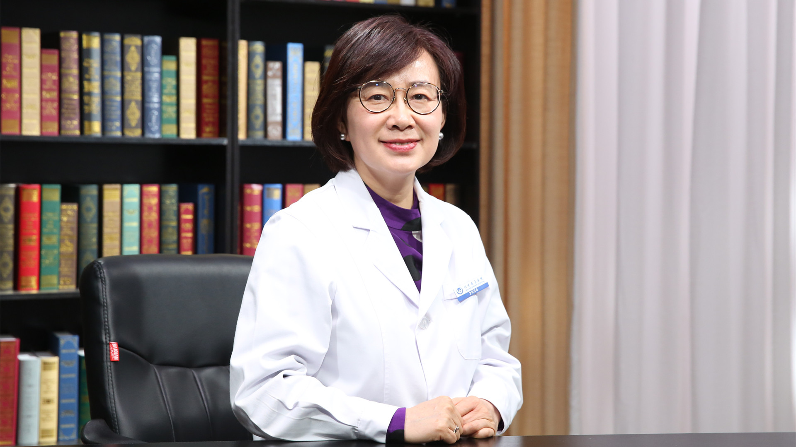

# 1.86 胎儿心脏病多学科会诊

---

## 何怡华 主任医师

首都医科大学附属北京安贞医院胎儿心脏病母胎医学会诊中心负责人 主任医师 博士生导师 ；

“胎儿心脏病母胎医学”北京市重点实验室负责人 ；北京市胎儿心脏病母胎医学国际合作基地负责人 ；十三五国家重点研发计划专项首席专家； 中国妇幼保健协会第一届胎儿心脏病防治专业委员会主任委员 ；中国医师协会医学遗传医师分会妇幼保健专业委员会第一届委员会副主任委员 。

**主要成就：** 2013年8月倡导并正式成立了国内首家“胎儿心脏病母胎医学会诊中心”；发表核心期刊文章180余篇， SCI文章50余篇，国际会议发言25余次。

**专业特长：** 擅长胎儿超声心动图、成人心脏超声（冠心病、瓣膜病、心肌病、先天性心脏病等）、经食道三维超声心动图、负荷超声心动图；胎儿心脏病产前产后一体化管理；胎儿心脏病遗传学发病机制和影像智能诊断。

---

## 中国出生缺陷面临最大的挑战是什么？

（采访）有数据表明，全世界每年大约有500万出生缺陷的婴儿出生，也就是说平均每五六分钟就有一个，在我国您觉得出生缺陷面临最大的挑战是什么？

我国出生缺陷面临最大的挑战，我认为就是人口基数大，去年出生缺陷人口是1700万，出生缺陷比例比较高，很大的人口基数上出生缺陷的基数也很大。

另外很关键的一个问题，就是现在目前医疗水平非均质化，这是我们面临很大的一个挑战，基于这么大的一个基数，医疗水平的非均质化，导致很多基层的一些出生缺陷不能被及时检出。

再有出生缺陷从预防到出生救治，中间链条没有很好的打通。

这是我们面临的三个很重要的挑战。

（采访）其实很多基层地区医疗条件不太够，像胎儿如果有缺陷的话，现在的水平其实在孕期就已经可以检查出来，也有可能孕妈妈们意识不够，所以并没有去进行这些检查。

是的，一个就是广大的家庭可能对出生缺陷的防控意识和怎么去防控不太了解，再有比较先进的医疗技术，并没有很好的达到基层医院，也是我们现在逐渐推广的很重要的工作。

---

## 出生缺陷目前发病率最高的是哪种疾病？

（采访）哪种疾病是目前出生缺陷发病率比较高的？

目前无论是世界还是中国，出生缺陷最高发的是先天性心脏病，达到了1%，数据统计是8-12‰。一百个新生儿当中就会有一个先天性心脏病，发病比率是很高的。

（采访）除了先天性心脏病，还有哪些其他的出生缺陷？

其他的出生缺陷实际上在前几年比较严重的，比如神经系统、消化系统、泌尿系统疾病、多指、兔唇，但是实际上这些出生缺陷神经系统疾病是比较高发的，随着一级预防所有的预防水平提高，实际上出生缺陷在下降，下降到第六位了。

但是先天性心脏病十年一直是持续上升的一个状态，排在第二位，第三位的就是多指和兔唇，实际上多指和兔唇致残率和致死率远低于先天性心脏病。

---

## 胎儿心脏病包括哪些？能预防吗？

（采访）胎儿心脏病包括哪些？

胎儿心脏病包括结构性异常和非结构性异常，结构性异常比较熟悉的一个称呼叫先天性心脏病，非结构异常包括比如心律失常，心脏肿瘤，这些疾病都叫非结构性异常，大体上分结构异常和非结构异常。

（采访）先天性心脏病致死率和致残率高吗？

先天性心脏病的致残率和致死率是很高的，先天性心脏病20%-30%预后是不良的，致死性和致残性是很高的。也有一部分随着现在医疗技术发展，出生之后治疗效果是好的。

（采访）导致胎儿心脏病的原因都有哪些？

目前医学发展的现状，先天性心脏病没有一对一的病因学的发现。

先天心脏病比如污染或者孕早期感染，或者是自身免疫性疾病，这些可能都是先天心脏病的高危因素。但是并没有说吸烟或者孕期感染，胎儿一定会得先天心脏病。

先天性心脏病叫多基因遗传病，多基因病，既受外界环境的影响，又受遗传背景的影响。外界环境当中一些因素可能并不是单因素作用，也可能是多因素作用，所以说现在的一级预防就是病因学研究，在先天性心脏病发病研究过程中还属于一个热点，还是一个没有定型或者已知的状态，也正是现在没有办法从一级预防有效控制出生缺陷的发生。

像神经管畸形几年前曾经是第一位，但是在孕期补充叶酸，可以很明显的降低神经管畸形出生缺陷，相当于一级预防，在孕前和孕早期进行相应干预，可以把出生缺陷率降低。现在先天性心脏病面临的问题，没有很明确的病因学，所以没有办法进行好的一级预防，导致现在先天性心脏病居高不下。

但是我们有一个很好的切入点，就是二级预防，所谓二级预防就是怀孕之后进行及早的超声检测，遗传学检测，及其围产期管理出生救治，希望通过这种方法来进行有效的先天性心脏病出生缺陷的防控。

---

## 胎儿心脏病和遗传有关吗？如何确诊？

（采访）胎儿心脏病和遗传有没有关系？怎样确诊？

胎儿心脏病其中一部分和遗传相关，随着现在医学研究的不断进展，尤其在出生缺陷领域，产前遗传学诊断，发现胎儿期心脏疾病合并遗传疾病比例明显要高。

比如成人心脏病20%是由于遗传疾病导致的，但是先天性心脏病，胎儿心脏病高达40%是由遗传引起的。

所以反过来给广大的无论是孕妇还是医疗工作者都有一个提示，在产前发现心脏结构异常，或者心律异常，无论是结构异常或非结构异常心脏病，都应该有意识的进行遗传学的检测，尤其集中在几个高发病种，比如锥干系统异常、异构、心内膜垫缺损、结节性硬化、心脏肿瘤、心律失常，这些都应该建议进行遗传学检测。

当然遗传学检测有很多手段，相对比较专业，医生会根据病变建议不同层面的遗传学检测，比如核心异常的检查，微缺失，微重复的检查，及其点突变的检查，都会有相应适合的遗传学检测手段。

---

## 胎儿心脏病为什么要进行遗传学检测？目的是什么？

（采访）遗传学检测的目的是什么？可以确定是跟遗传有关是吗？

遗传学检测实际上是非常重要的，一个是明确完善产前诊断，比如胎儿患有法洛氏四联症，法洛氏四联症可以手术矫治的，心脏结构异常通过手术矫治，可以获得很好的预后，很好的结局，很好的生活质量。

但是如果合并了遗传，因为遗传综合征引起的心脏改变，心脏结构改变，出生之后尽管手术效果很好，但是这个孩子会面临生长发育障碍，智力障碍，其他系统的一些畸形逐渐显示出来，会严重影响孩子的生活质量。

遗传学检测最主要的目的就是在产前完善遗传学检查，它是一个诊断，比如结构异常只是诊断中的一个表现，通过遗传学检测获得一个完整的检查。

因为很多遗传综合征在胎儿期，比如神经系统发育障碍或者是生长发育受限，没有到出生不体现，没有办法了解胎儿神经系统的一个认知功能，是很难去诊断的，所以通过遗传学检测来获得一个完整的诊断。

第二个作用遗传学诊断可以帮助判断预后，比如生长发育障碍，神经系统智力发育障碍，预后通过遗传学检测都可以提供出来，尽管现在不表现，但是因为携带了致病基因，未来就会表现，出生之后几年或者几个月逐渐会出现这种情况，这是第二个作用。

第三个作用在产前进行明确的遗传学诊断，尤其进行扩大家系的遗传学检查，了解遗传方式，遗传疾病的种类，如果是家族显性遗传或者隐性遗传，致病基因是来自父母的，来自父或者来自母，这个时候下一胎生育的时候，可以进行生育前的一个指导。

比如对家族显性遗传，往往下一代携带这种致病基因的比例高达50%，是基于大人群的50%，可能放在一个家庭里，第一胎是，第二胎是，第三胎还是，每一胎如果都有问题的话，对家庭影响是非常严重的。

所以随着现在医疗技术的发展，比如辅助生殖受孕的开展推广，实际上对这种遗传疾病，尤其家族显性的遗传疾病，明确致病基因的，可以通过孕前挑胚胎，进行辅助生殖受孕，获得一个正常的胎儿。

所以从这几个方面来说，产前发现心脏异常，进行细化的评估，进行更深一步的遗传学检测，实际上可以让家庭更大的获益。

（采访）可不可以简单的理解为有遗传背景的胎儿心脏病，会比其他胎儿心脏病更严重？

是的，因为往往合并了遗传背景的疾病，它是一个遗传综合征，心脏只是遗传综合征的其中一个表现。

其他的这些表现，尽管在胎儿期没有看到或者是不容易被检查出来，但是不等于出生之后不表现出来。所以表现出来之后存在着不仅有心脏问题，还会有其他多系统问题，最严重的可能是神经系统和生长发育障碍，会严重影响患儿的生存质量。

---

## 胎儿心脏病如何早期诊断？

（采访）胎儿心脏病是如何进行早期诊断的？

实际上在胎儿期的诊断从我的理念包括三个大方面：

第一大方面就要进行胎儿心脏结构异常的诊断。

第二个方面要进行胎儿心脏相关遗传学检查。

第三个方面引起胎儿心脏异常的母体疾病的检查，比如自身免疫性疾病，这些母体疾病都可以通过胎盘抗体达到胎儿心脏，影响胎儿心脏异常。

所以在产前要进行三大方面检查，这三大方面从实验室角度，比如自身免疫性抗体，母体疾病和遗传都可以提早到早孕期，对于高危人群就可以进行，因为只需要抽母体外周血就可以进行检查。

所以一旦锁定了这部分人群，是一个高危人群，就可以提早到早孕期检查，比如发现怀孕就可以进行检查。

对于结构异常的检查也分为高危人群和非高危人群，比如对于高危人群，我们就要提早检查，最早可以提早到孕12周，就是说经阴道进行超声检查，进行胎儿心脏的结构检查，经腹B超可以提早到孕14周，但是这个时候往往都是看一些特别重大的畸形，比如人有四个心腔，可能在孕14周的时候，如果发现了只有单心室，少了一个心腔，或者是一个心室不发育这种情况，只有一个大动脉，对高危人群这种严重畸形在早孕期可以检查出来。

但是一些细小的细微的结构异常，在孕14周是很难被发现的并且一些细微的结构异常未来也不会太影响生存质量，出生之后可以进行手术矫治。

所以对于早孕期的检查，我们最主要的是关注重大畸形，对于高危人群重大畸形的检出。

对于常规的心脏结构异常检查，一般是在孕24周，到26周，到28周这样的一个状态，孕24、26、28周都可以，因为中国人个头比较小，西方规定是20-24周。

因为胎儿心脏超声隔着妈妈的肚子，再隔着胎儿的胸廓，再看胎儿的心脏，孕20周的时候，胎儿心脏几乎指甲盖这么大，所以稍微孕周大一些的时候，我们观察的会更清楚，如果是一个普筛的情况下，孕24周是最好的一个阶段，筛出来之后可以确定有问题还是没有问题。

孕28周之后，实际上引产就算新生儿围产期的死亡率了。所以在孕24周检出来之后，整个家庭和医疗单位都可以有一个时间段来进行决策，进行处理，是一个比较合理的时间。

（采访）常规的胎儿心脏超声检查，一般在孕24周左右就可以了，是最佳的时间，但是如果是一些高危人群，在孕早期14周左右就可以检查出来。

对，超声孕14周就可以检查出来。

对于高危人群，对于一些高危的遗传疾病，比如第一胎就有遗传疾病，进行了家系检查，发现是来自父母的，但是又没有办法进行辅助生殖受孕，或者是没有选择辅助生殖受孕，这个时候我们就要提早进行遗传学检测，这个时候遗传学检测及其母体疾病的检测可以放在早孕期。

（采访）胎儿心脏超声可以确诊吗？还需要做其他的检查吗？

胎儿心脏超声实际上是胎儿心脏病目前最有效的一个检查方法，几乎百分之九十八九的疾病都可以通过胎儿超声检测出来。

当然如果合并遗传疾病，同时会进行相关遗传学检测。但是对于结构异常、心肌病变、心律失常，百分之八九十的这种疾病都可以在胎儿期检测出来。

---

## 胎儿心脏病早期诊断对家庭有什么益处？

（采访）胎儿心脏病早期诊断，对整个家庭有什么益处？

对一些疾病，尤其是高危人群，如果能够早期诊断，家庭可以有更充分的时间进行决策。

比如一个预后不良的心脏病，出生之后即使做了手术或者是几期手术之后，依然不可以达到双心室循环，什么样的动物是单心室，像青蛙、鱼，即使经过复杂的手术，也不能达到正常人类双心室循环，未来的寿命和生存质量会比较差，往往家庭可能选择不要这个胎儿，不要这个胎儿就要做引产。

所以如果早期进行了明确诊断对重大畸形的检出还是比较具有优势的。

如果对一些重大畸形在早期检测出来，家庭知情的情况下决定引产，对母体的伤害是最小的。如果等到二十七八周了之后才被确诊出来，这个时候实际上相当于生产，相当于生产一个孩子一样，这个时候对母体的创伤就会比较大，胎儿越大的时候，本身胎儿会有一些感知能力了，这个时候再去做引产，从伦理和人文上可能也不是非常好。

再有早期诊断的时候，早期进行结构诊断的时候，可能给临床更充分的时间进行其他方面的一个检测，比如早期发现心脏占位或是肿瘤，这个时候就要建议进行遗传检测。

进行遗传检测实际上是有周期的，比如抽血之后进行基因测序，测序之后还要进行生物学信息分析，临床标注，最后才出报告，还是要有一个周期的，越早进行其他完善检查的空间越大，最后明确诊断出来的时候，给家庭决策的时间段也会越早，对母体和胎儿的伤害也会越小。

---

## 为什么要开展胎儿心脏病多学科会诊？如何开展？

（采访）为什么要开展胎儿心脏病多学科会诊？是怎么开展的？

胎儿心脏病实际上从发生到发展，本身疾病链接了多学科，比如从受孕开始，怀孕期间，到出生，需要什么样的学科参与。

受孕的时候如果是辅助生殖受孕，可能需要产科，遗传学来参与，在产前进行明确诊断的话，包括影像科对结构的诊断，及其遗传学的诊断，还有对母体疾病的一个诊断，比如自身免疫性疾病，就是风湿免疫科，还有产科。

到围产期，快出生的时候，产前条件的评估，孕妇的管理及其产程的监测，需要产科大夫参与。

诊断之后，出生之后参与治疗的有小儿心内科，小儿心外科，实际上在产前已经介入了，因为明确诊断之后，能不能进行治疗，怎么治疗，什么时间治疗，这个时候家属都会问到，也都希望直接来面对这些医生，了解孩子未来的治疗方案，产前就建立一个临床治疗路径，甚至有的胎儿在出生即刻在产房就需要干预，所有的与疾病相关的多学科医生，在产前会组建一个团队，进行产前产后的一体化管理。

最主要的原因是疾病的需求，因为这个疾病覆盖了孕前到产前，到围产期，及其出生后所有的过程，如果在不同环节都进行了很好的干预和阻断，胎儿心脏病这种出生缺陷，我们就会很好地控制。

尽管我们现在一级预防没有很好的办法，但是如果我们从不同的环节合力来应对出生缺陷，依然能够达到很好的效果。

---

## 哪些孕妇需要做胎儿心脏超声检查？

（采访）胎儿心脏超声并不是孕期常规检查，不是每个孕妈妈都必须要做的。您建议什么样的孕妇，重点去注意一下胎儿心脏超声？

您这个问题问得非常好。

实际上现在胎儿心脏超声在我国并不是一个常规必查项，胎儿心脏专项检查不是一个必查项，只是针对一些高危人群，产前筛查单位或产前诊断单位建议进行这样一个专项检查。

现在更普遍的一个检查叫筛查，大排畸，一旦怀孕之后要建档，一定孕周之后，对孩子从头到脚都要进行排畸，因为心脏是一个立体的，在筛查过程当中，可能只是去打四腔心的切面，及其流出道切面，相对比较局限，但是对于一些高危人群，建议进行专项检查。

专项检查针对心脏，无论是立体结构，还是发出来的一些大血管，都要进行详细的评估，什么样的孕妇要着重注意胎儿心脏检查，包括两个大方面，一个是孕妇的因素，一个是胎儿的因素。

母体因素包括哪些？比如孕妈妈有糖尿病，有苯丙酮尿症，有自身免疫性疾病，在孕早期的时候有过感染，比如风疹病毒感染，或者感冒，病毒感染，还有服用过一些致畸药物，比如非甾体类抗炎药，高血压ACEI类药物，还有比如家庭一代亲属有过先天性心脏病，也算高危人群，或者家庭有家族遗传性疾病也算高危人群，总体来说大致包括这些方面。

另一方面胎儿本身的一些因素，什么样的因素作为高危因素？比如胎儿大排畸过程当中，发现了胎儿心脏有问题，筛查心脏有问题，到底什么问题，肯定不是很全面，但是怀疑心脏有问题做个专项检查。

再有就是心外结构异常，比如肠管有问题，肝脏有问题，或者是胸腔有问题，这些心外畸形也要进行心脏检查，因为往往一些其他器官的畸形，是一个遗传综合征，在心脏也会有表现，胎儿的遗传综合征比如在胎儿检查的时候，各个脏器的一个组合，或者是面容的异常，或者是手型各方面的一个异常，怀疑遗传综合症，这时候也是一个高危因素，要建议进行胎儿心脏专项检查。

还有胎儿静脉系统的异常，比如单脐静脉，单脐动脉，还有NT，超声软指标异常。

（采访）需要重点关注胎儿超声检查的，第一方面看孕早期是不是有过感染，或者本身家里有没有遗传背景，第二主要关注胎儿，如果是在大排畸的时候，怀疑心脏有问题，或者是其他脏器有什么问题了，再做一个心脏专项检查，去确诊一下。

对的，要关注母体因素和胎儿因素。

---

## 产检发现胎儿左心室强光点，需要进一步做胎儿心脏超声检查吗？

胎儿心脏心室强光点，现在的医学检索和医疗现状，并不把胎儿心室强光点作为高危因素，作为胎儿心脏专项检查的指标。

但是既往更多的医院或者是孕妇可能会焦虑，左心室强光点一报出来之后，到我们医院转会诊的这种孕妇，经常说当地医院说心脏有问题，所以过来了，几个晚上都没有睡觉，很焦虑。

实际上焦虑对于孕妇来说也是非常大的一个易患因素，精神压力实际上对胎儿心脏发育是不利的，实际上我们现在观察到既往的文献报道，左室强光点可能是在西方和心脏病有一定的关联，尤其和遗传综合征。但是在我们东方人群当中，这种比例是非常低的，现在已经不建议作为胎儿心脏专项检查的超声软指标。

---

## 发现胎儿心脏异常就要引产吗？

（采访）是不是在胎儿期如果发现了心脏有异常，就一定要引产？

不是的。

实际上中国出生缺陷的防控确实经历了几个阶段，最早的时候，产前推广了超声检查之后，发现了大量心脏异常，那个时候无论从医疗角度，还是社会的发展，或者是家庭的认知，更多选择不要这个胎儿，发现了异常选择不要。

但是随着现在整个社会对胎儿的认定，把他认定为一个生命，胎儿就是一个生命，这是随着社会发展，人文发展观念的一个变化。

还有一些现状，尽管放开二胎之后，比如去年整个生育率是下降的。

再有就是医疗技术的发展，使得现在对很多先天性心脏病，治疗是有手段的，治疗效果是好的。

从医学方面更推倡产前诊断细化，危险分层诊断，什么叫进行细化，危险分层诊断？诊断出先天性心脏病之后，综合母体疾病，遗传疾病和结构异常的程度、分类和程度来判断手术效果好还是不好，区分预后。

当然好与不好，这是两个大方面的很粗略的分，在医学上可以根据肺动脉的发育程度，或者根据室间隔缺损和肺动脉的距离，根据一些细节我们能判断出来。

出生之后手术效果怎么样，做完手术之后生存质量怎么样，这个时候把这些信息都告诉这个家庭，多学科协作，根据影像诊断、遗传诊断、母体诊断，出生之后参与救治的学科，小儿心内科，小儿心外科共同给他一个咨询，明确诊断，预后的咨询，救治的方案，这个时候家庭来选择这个孩子要还是不要。

当然要与不要，一方面是医学上预后好与不好，另一方面就是家庭对孩子的期望，比如很简单的先天性心脏病，像室间隔缺损，出生之后做手术的成功率达到了99.99%，做完手术之后，除了留一道疤之外，和正常的孩子没有什么太大的差别，基本上生存质量和正常孩子差不多。

但是有的家庭就不接受，有的家庭就说我要一个完美的孩子，不希望出生之后要经历手术或者怎么样，总之对这种生命的期望每个家庭是不一样的，但是我们会极力去劝阻，保留这个孩子，他是一个生命，但是这个决定也是由家庭来决定，尽管是一个预后很好的疾病，选择不要也是家庭的问题。

尽管是非常复杂的一个疾病，比如遗传综合征合并心脏改变，我们也碰到了，随着现在信仰的不同，宗教信仰的不同，或者对生命的这种态度，有的家庭尽管是复杂的遗传综合征，也选择保留，这是家庭的态度，尊重每个个体的选择。

我们的任务就是要把诊断尽量的细化和准确，之后治疗方案尽量的全面、详实，提供给家庭，提供了最准确详实的诊断和咨询后，家庭才有可能做一个更合理的决定。

（采访）随着医疗条件的发展，其实很多的先天性心脏病，即使在孕期检查出来了，但是出生之后经过有效的治疗，还是可以跟正常孩子一样健康成长的，没有必要一检查出来立马选择引产。

是的，总结非常到位，这也是现在整个医疗界呼吁的一个问题。

由于小儿心内，小儿心外医疗技术的发展，比如举个例子，完全性大动脉转位，只有当两个流出道匹配的时候，宽度各方面匹配的时候，既往认为是一个非常复杂的先天性心脏病，但是现在手术成功率已经达到了95%以上，生存质量也很好。

我相信随着医疗技术的逐渐发展，更多的疾病可以达到解剖矫治的程度，使患者获得很好的一个结局和预后，家庭、产前筛查诊断单位、治疗单位，进行信息共享，进行宣传，让更多的人认识到在现在的医疗技术情况下，胎儿是可以保留的。

---

## 胎儿心脏病可以预防吗？

（采访）胎儿心脏病有没有有效方法可以预防？

实际上整个疾病的预防，大的概念来讲，包括三级预防，三级预防就是一级预防，二级预防，三级预防。

一级预防实际上就是病因学预防，先天性心脏病现在并没有明确的一对一的预防措施，所以才使得先天性心脏病高居榜首十多年，所以只有少部分比如已经明确致病的这种遗传疾病，可以一级预防，孕前进行阻断，通过挑胚胎，辅助生殖受孕的方法来阻断遗传疾病引起的心脏改变。

但大部分先天性心脏病或胎儿心脏病没有办法进行一级预防，只是朴实性的一些概念，比如少吸烟，包括配偶少吸烟，最近自己的一篇文章单中心的一个数据调查，配偶吸烟会严重影响胎儿心脏的发生发展，心脏病的发生。

所以对一些朴实性的大家要了解，比如戒烟戒酒，包括配偶戒烟戒酒，避免孕早期感染，避免污染物的接触，比如新装修的房子，结婚了新装修一套房子住进去之后怀孕了，这些都要尽量避免，可能会整体的减少疾病发生。

先天性心脏病是一个多基因病，可能是多个因素共同作用产生的结果，去除了这个因素不一定没有这个结果，所以现在对于一级预防并不是一个很明确的状态，并不像神经管畸形，叶酸的服用能明显减少神经管畸形的出现，所以现在一级预防手段并不多，最主要的现在对于先天性心脏病的预防叫二级预防。

所谓二级预防，怀孕之后要进行及早的全面的产前诊断，产前超声的筛查，怀孕之后对于高危人群进行胎儿心脏的专项检查，对于低危人群进行大排畸，这样的话就会及时检出一部分预后非常不良的这种畸形，由家庭来决定要与不要。

筛出这部分重要的畸形，可能很多家庭就不要了，可能对一些可以治疗的畸形，我们最主要的一个作用在产前二级预防的时候，可以给他建立出生救治路径，避免出生之后，不知道有先天性心脏病，错失手术良机。

错过手术时间窗之后，比如本身应该在新生儿期做手术，但是到两三岁才来做，这个时候可能已经不能做手术了，或者尽管做了手术效果也不好。

所以这叫二级预防，二级预防在产前及早进行明确诊断。

三级预防就是已经生下来了，这个时候及早诊断，及早干预，会减少并发症，尽管做了手术，但是早和晚，合适与不合适的时间窗，可能对孩子结果完全不一样。

所以三级预防就是当出现症状之后，要尽早的合理的时间窗进行干预。

所以先天性心脏病怎么预防？从一级预防、二级预防、三级预防，一级预防的手段少，不明确，二级预防是重点，要在产前进行及早诊断，建立出生救治路径和合理的预后咨询，围产期管理，三级预防尽管为时已晚，但是也是很好的一个补救措施，生下来就要管他，要及早去管，这就是整个三级预防，重点是二级预防，就是产前诊断。

---

## 婴儿出生患有先天性心脏病，目前治疗效果如何？能像正常孩子一样吗？

（采访）目前出生的婴儿，心脏病治疗现状如何？

先天性心脏病由于现在医疗技术的发展，很多既往认为复杂的先天性心脏病都可以进行治疗，确切说百分之六七十的疾病都可以治疗，当然治疗的效果，手术成功率是不同的。

但是对于一些简单的，手术效果比较好的，大家可能要有所认识，比如像一些轻度的瓣膜狭窄，或者是关闭不全，室间隔缺损，房间隔缺损，胎儿期生理通道疾病，这些预后都是非常好的，出生之后都可以通过手术矫治，或者是自然的愈合，获得很好的一个结局。

既往认为一些复杂的疾病，比如法洛氏四联症，或者是完全性大动脉转位，现在实际上也可以获得很好的治疗效果，实际上大家有一个理念上的更新就可以了，对于每一个疾病怎么样去治疗，手术成功率是多少，什么时间去治疗，应该去专业的机构进行评估。

什么样的专业机构，具有先天性心脏病手术矫治能力的医院，大的三甲医院进行评估，不同中心手术成功率也不太一样。

今年国家卫计委妇幼司出生缺陷处会专门制订指南或者是行业规范，会有几级的这种路径，比如从筛查单位到产前诊断单位，到胎儿心脏病母胎会诊中心，到救治单位，通过筛查诊断完之后，进行综合的评估和救治，都会有很合理很好的医疗流程和路径提供给患者。

最主要的对于患者来说要有一个概念，并不是所有的先天性心脏病都是不能生存的，检查出来就要引产，而是要进行详细的诊断，合理的预后咨询，出生救治的一个路径，来综合的判断预后好还是不好，再决定要与不要，百分之六七十的疾病都可以通过出生之后的干预，有效的干预，获得一个相对比较好的结局。

（采访）其实现在很多先天性心脏病出生之后得到及时的救治，还是有良好的预后的。这些患有先天性心脏病的孩子，及时做了手术之后，手术之后的预后怎么样？能不能像正常孩子一样健康成长？

先天性心脏病根据细化分型有上千种，比如举一个最简单的例子，像法洛氏四联症，肺动脉发育不同的一个状态，可能决定了手术的难易程度，可能会决定手术之后的发育的状态。

像右室双出也一样，不同的细化的分型和流出道的发育状态，都会决定手术的难易程度和未来生存的质量，所以也不能一概而论，要到中心进行细化的评估，来获得个体的预后的一个状态。

---

## 胎儿患有严重心脏畸形，出生时会有生命危险吗？需要心内科医生参与分娩吗？

（采访）胎儿如果患有心脏畸形，会不会一出生就有生命危险？生产的时候需不需要心内科医生也参与分娩过程？

是的。

现在更多的家庭选择保留胎儿，因为现在中国不孕不育的比例是很高的，同时珍贵儿也很多，比如很多的胎儿都是通过辅助生殖受孕获得的，所以叫珍贵儿，所以尽管有一些复杂的畸形，也选择保留孩子。

这样的话就会出现一些情况，我们要注意的，什么样的疾病在出生的时候要进行格外的关注，或是出生救治路径的建立，应运而生有一个概念叫产房模式，对一些疾病要建立出生救治路径，要进行产房的一些干预。

什么样的疾病？这些疾病往往都是叫导管依赖性的疾病，动脉导管依赖性疾病，既往有一些患儿出生之后，一些医院可能对这个疾病不认识，孩子一出生之后就出现了紫绀，一看紫了之后就给他吸氧，结果一吸氧之后病情更重了，实际上是一个复杂畸形，依靠动脉导管生存的。

动脉导管使得混合血或者是不富含氧气的血液，进入了体循环，就会出现发绀，发绀就是紫，嘴唇紫或者是手指紫这种情况，出现这种情况的时候，产科可能会给他吸氧，反而导致了生命通道关闭，所以最主要的要意识到在产前要进行评估，哪些疾病是动脉导管依赖性疾病。

胎儿是很神奇的，生存叫胎盘循环，尽管是非常复杂的畸形，但是大部分都能生存，最主要他是依靠母体的胎盘循环，所以在胎儿期无论多复杂的畸形，都可以生存，但是一旦在出生即刻脱离了母体，建立自己的肺循环，肺张开了，这个时候很多疾病就没有办法生存，必须依靠动脉导管的通道，但是动脉导管通道往往在出生之后就要关闭，这个时候实际上医疗机构就应该采取特定的方法，用药或者是介入，使得这种通道保持开放。

无论用什么手段，最关键的问题在产前知道是不是存在这种疾病。在产前比如一些疾病，无论是肺循环依赖的动脉导管疾病，还是体循环依赖的动脉导管疾病。

举个例子，比如完全性的肺静脉异位引流，室间隔完整的主动脉弓离断，大动脉转位，这些实际上都是导管依赖性的疾病复杂畸形，在出生之后即刻就要通过医疗干预保持动脉导管开放，尽早进行手术干预，矫正畸形，建立正常的循环路径，所以产前诊断导管依赖性的复杂疾病的明确诊断，诊断之后和新生儿内科和新生儿外科共同制订出生救治方案。

有的疾病需要在分娩即刻由多学科参与，产科肯定在，小儿心内科参与的比如肺动脉闭锁，室间隔完整的肺动脉闭锁，可以即刻通过球囊将肺动脉打开，这是小儿心内参与的一个疾病。

小儿心外参与的一些疾病，比如完全性大动脉转位，这些都需要进行评估，多学科参与，产房模式的一个干预，这样如果我们各个环节都做得很好，患儿就可以获得一个很好的结局。

（采访）最主要的还是能够在产前先明确诊断，生产之后立马就有方案去实施，如果没有明确检查，可能就会错过最佳的救治时间。

对，如果没有明确的检查，更多的产前诊断和生产是在妇幼保健机构，但是对于心脏病的救治是在大的三甲医院或者是专科医院，心脏特色的专科医院进行救治，所以应该建立信息对等的机制，使得产前诊断让救治单位的人员知道，或者救治人员的单位参与到产前诊断的过程当中，这样会让整个围产期管理非常顺畅。

---

## 胎儿患有心脏病还能自然分娩吗？

（采访）如果已经检查出来胎儿有严重的心脏畸形，还可以选择自然生产吗？

其实胎儿心脏病并不影响，或者是并不决定生产方式，因为在母体里是一个胎盘循环，胎儿基本上都是可以生存的，不会受什么影响。

真正影响生产方式的要评估产科条件，比如前置胎盘或者一些什么情况，不适合自然分娩，适合剖宫产。

但是本身胎儿心脏疾病并不决定生产方式，本身患了一个室间隔缺损，或者患了大动脉转位，是不是室间隔缺损就可以自然分娩，大动脉转位不可以自然分娩，没有这个区别，决定分娩方式的是产科条件，而不是这个疾病。

---

## 婴儿出生患有先天性心脏病，治疗时机是什么时候？

（采访）如果是在出生的时候患有先天性心脏病，最佳治疗时机是什么时候？

先天性心脏病或者叫胎儿心脏病，实际上细分来说上千种，所以很难说疾病的治疗时机，但是会分为几类，复杂疾病或者可能尽管不复杂，手术并不复杂，但是由于循环通路或者血流动力学改变，导致出生即刻救治。

比如举个例子，完全性肺静脉异位引流，实际上做手术很简单，但是因为回到左心的血都回到右心了，出生之后必须即刻进行手术，从血流动力学改变分为几大类，需要进行产时手术的，需要进行新生儿期手术的和需要进行择期手术的。

所谓择期手术就是不急，从获益来说，比如孩子公斤体重越大，相对做手术的风险越小，所以这种疾病就可以等到七八岁，但是越大也许畸形的存在会影响生长发育，所以等到六七岁或七八岁公斤体重也够了，手术也比较安全，这个时候做手术叫择期手术。

所以总体上分为产时手术，出生即刻，如果不做手术的话，也许就有生命危险，血流动血不稳定。

再有新生儿期手术，手术尽快在新生儿期做，避免影响以后的生长发育，之后择期手术，不太影响生长发育，但是不做手术，可能会远期对他有些影响，矫治大体分为这几个手术时机。

当然随着现在的医疗技术发展，还有一种手术叫宫内干预，如果这种疾病不在宫内及时干预，出生之后可能是非常严重的畸形，主动脉瓣狭窄或者是肺动脉瓣狭窄，不干预的话未来就会影响心室发育，在宫内进行及早的干预，心室的发育可能就会比较好。出生之后再去做一个手术，就会获得比不在宫内干预好得多的结局。

所以总结来说手术时机包括宫内干预，产时手术，新生儿期和择期手术，不同的阶段。

（采访）所以选择哪个时机来手术，关键还是看这个孩子他得的是哪一种先天性疾病？

对，要进行细化的评估来判断。

---

## 先天性心脏病会影响孩子生长发育吗？

（采访）先天性疾病对孩子的生长发育会有影响吗？

会的。

从产前尤其最近开展了遗传学研究之后，发现先天性心脏病很大比例会合并神经系统异常，这种遗传背景的致病因素，同时关联了心和脑，所以出生之后会影响生长发育和智力障碍。

同时一些先天性心脏病由于血流动力学，血供应大脑的少了，在胎儿期大脑发育也受到影响，出生之后认知功能也会减低，在国际上也有报道。

所以总体来说先天性心脏病，生长发育和神经系统障碍是存在的，并且在出生之后，由于不同类型的先天性心脏病，会导致供应大脑和供应体循环发育的血流减少，也会影响生长发育障碍。

但不是所有的先天性心脏病都会影响生长发育障碍，或者神经系统，也是根据不同的疾病，不同的血流动力学改变，我们要个体化评估。

---

## 什么是胎儿心脏病母胎医学？有什么意义？

（采访）什么是胎儿心脏病母胎医学？

母胎医学的概念实际上是近几年新发展起来的新兴的一个学科，由于疾病发生发展的链条上，链接多学科，这个多学科实际上是相互关联，相互作用的。

从个体来说胎儿和母体，可想而知是互生互存互相影响的一个状态，又集合了比如影像学对胎儿的观察，遗传学对母体疾病和带给胎儿的一些影响，对胎儿的生长发育未来治疗的新生儿内科，新生儿外科，对整个疾病预后和治疗干预，甚至是宫内干预的一个参与度。

所以说母胎医学的概念就是多学科，针对胎儿疾病链条上的多学科的共同决策，共同管理的一个学科概念。

（采访）安贞医院在2013年成立了胎儿心脏母胎医学多会诊中心，您能介绍一下会诊中心成立的意义吗？

这个工作安贞医院开展的是非常早的，开展过程当中遇到了一些瓶颈，我2008年从国外留学回来的时候和院长谈到，那个时候在国外就有一站式服务的概念，我当时感觉非常好，回来谈到说我们要能成立一个这样的学科来管理胎儿心脏就好了。

随着工作的开展，做胎儿心脏产前诊断，诊断之后给孕妇一个咨询，我就专门派一个学生带着她去小儿心内科，小儿心外科及其产科，这个时候小儿心外科当时主任非常支持这个工作，但是最后开展了一段时间之后，这个工作发现有一些瓶颈，比如小儿心外科的预后咨询更倾向于这部分病人都能做手术，各个学科咨询的结果是割裂的，或者是不一致的。

最主要的原因就是他从这个角度看结构异常，而他从这个角度看结构异常，孕妇做完了胎儿心脏的检查之后，拿到这个报告，她去咨询产科，而产科又不了解现在中心治疗水平到什么程度，不同中心都不太一样，小儿心内，小儿心外又不了解母体疾病对胎儿心脏是什么样的一个影响，各个学科都是割裂的。

我又去跟院里反映这个情况的时候，院里非常支持，说我们成立一个母胎医学会诊中心，所以当时安贞医院在院长和主管部门的支持下，在全国是第一家成立胎儿心脏母胎医学会诊中心，由我来负责，因为最主要我是一个入口单位，入口学科，所有的疾病的筛查，管理资料的随诊，甚至是遗传学的检测都在我们这个学科，之后整合这个学科，之后把所有的疾病的随访的结果再都回馈到各个学科。

到现在这个学科从2013年到2019年已经五六年的时间，在我们医院已经作为一个品牌学科了，在我们今年人才大会上，属于一个亮点学科。

实际上现在也开展多学科协作了，给患者服务的效果已经很显而易见，作为学科的一个典范，无论是在医院里来进行介绍和推广，在全国我们开展了多学科协作之后，相继上海、广州、西安几个大省市也都分别开展了多学科协作胎儿心脏母胎医学模式，我觉得非常喜闻乐见，开展这个工作能让更多的患者受益，更多的医疗单位认可医疗模式，其实是非常好的。

这种医疗模式可以给不同区域的患者带来更好的这种帮助，作为最早开展胎儿心脏母胎医学工作的单位，感觉还是很有价值的，因为上海、广州这些单位都是，还有西安都是到我们医院做了参观之后回去成立的学科。

（采访）会诊中心其实最大的好处能够把这些多科室汇集到一起，然后给病人提供一个最佳的诊疗方案，不会出现孕妈妈拿到检查报告之后，去产科咨询是一种结果，但是到心内科、心外科可能又是另外的一种结果。

对，是的。

实际上多学科母胎医学医疗模式对患者来说就是一站式服务，只要来到这一站之后，就能获得包括母体疾病的问题，遗传疾病的问题，未来治疗的一些方案，所有的这些这一站都可以获得详细的信息，并且这个信息是各个学科整合了不同角度的，作了综合讨论之后，是一个完整的，没有矛盾的一个结果，应该是最好的一个医疗方案给到患者，这是一方面对患者。

另一方面对我们医疗团队来说是一个共同学习和成长的过程，这五年实际上对我们，无论对小儿心内，对小儿心外，对超声，对遗传，都是拓宽视野，胎儿心脏各个角度的医疗知识的学习和成长，让我们可以有更好的医疗知识再服务于患者，都是非常有帮助的。

---

## 如何在中国推进胎儿先天性心脏病的预防和诊治工作？

（采访）如何在中国推进胎儿先天性心脏病的预防和诊治工作？

胎儿心脏病实际上出生缺陷的防控近几年已经上升到国家战略层面了，像习近平主席也谈到了健康中国，李克强总理也谈到了，关注妇女和儿童是国家意志，所以从国家政府层面对出生缺陷也是非常重视的。

专门有国家卫计委妇幼司，及其出生缺陷处，他们都在积极的推动，从政策层面上积极推动，尤其是最高发的先天性心脏病的防治，今年有一些规范和指南也会相继出台，政策方面的一个推动其实是非常重要的。

再一个从医疗方面，医疗方面我们也看到既往我们是一个横段面的大畸形的筛查，现在我们针对高发的出生缺陷先天性心脏病进行单病种的管理，单病种的管理从孕前到产前，到出生之后，各个阶段从一级预防、二级预防、三级预防，都有人员来进行参与和阻断，并且组成了多学科会诊团队，甚至未来会不会形成这种专业来进行这种疾病的一个多学科防治，这是从医疗方面。

当然手段会有很多，我们的挑战就是非均质化非常严重，有一些基层地区，对这种疾病的认识和检查能力还是比较弱的，包括未来研发AI，就是智能诊断，智能指控，及其一个实时教学，依赖于现代的手段实时教学的开展，智控体系的开展，实施会诊的开展，让非均质化的医疗水平都变成均质化，用人工智能的方法解决一些低水平地区的医疗水平，专家水平的提高，非均质化的低水平的医疗水平通过人工智能达到一个专家水平，这是一些手段，一些方法。

网络的铺设，包括现在国家的一些项目的支持，比如十三五，提倡全链条的出生缺陷的一个管理，这都体现了从医疗方面政府方面的一个推广。

再有一个非常重要的就是科普，科普也是我们十三五很重视的一个内容，让广大的孕妇和家庭了解怎样在产前避免一些易患因素，怎样早期诊断，这个疾病如何配合医生进行出生救治，医患共决策，让把出生缺陷能够降低到，尽量降低致死性的出生缺陷的发生，减少出生缺陷的死亡率，提高新生儿的生存质量，是医生和患者共同的愿望。

---

## 目前在胎儿心脏病产前诊断领域，有什么新进展吗？

（采访）目前在胎儿先天性心脏病产前诊断领域，您能给我们介绍一下，有没有什么研究的新进展，或者是技术上的新进步吗？

产前诊断主要是几大块，影像结构诊断、遗传诊断和母体疾病的诊断，实际上在各个角度都有一些新的进展，包括影像诊断，各种医疗仪器的分辨能力。

比如最早出现电视的时候，可能看影都不太清楚，慢慢现在电视看得越来越清晰，超声仪器也是一样的，不断的发展，检查的技术对疾病的判断能力也越来越高，这是一方面。

最主要的进展就是在遗传方面，大家肯定也都知道精准医疗，所谓精准医疗最先提出来的在遗传诊断这方面，我们现在遗传诊断不局限于原来的这种唐筛，唐筛是很粗略的，覆盖疾病种类很少的一个筛查，诊断的假阳性率比较高。

现在也有这种微缺失，微重复层面的检测，点突变的检测，所谓二代测序应用在产前诊断，但是从应用到临床或者是给临床预后咨询，实际上也带来很大的一个挑战，因为未知的东西太多，能够给家庭准确可靠的信息，需要遗传工作者，遗传测序医疗厂厂家及其临床大夫，产前工作者，共同努力，不断探索，未来可能会给到产前诊断更多很准确的信息。

产前诊断技术主要是基于医疗仪器不断的发展，再一个就是精准医疗遗传学的诊断，这是很大的产前诊断的发展。

---

## 目前胎儿心脏病的检出率高吗？

（采访）胎儿心脏病检出率和准确率高吗？

胎儿心脏病检出率其实分两大块，这个疾病的理想状态，比如像在我们这样的一个中心，实际上百分之九十七八可以在产前检测出来。

但是也有一部分检测不出来，检测不出来的原因，因为各个医院的仪器条件不一样，胎儿的体位的原因，还是畸形微小，结构太小了，所以可以导致检测不出来。

还有一类疾病在胎儿期是发生发展的，在出生之后才体现出来，在胎儿期尤其是中早孕的时候不体现出来，如果只是在某一个时间段进行检测，之后没有再进行检测，可能发现不了。

还有一些疾病是可以自愈的，胎儿期有出生之后就没有了。希望更多的医疗工作者或者是孕妇的家庭有所了解，对这些疾病检测不出来也是在所难免的，但是反过来说这些疾病往往都不会严重影响预后，这种疾病往往出生之后可以进行治疗的，治疗之后可以接近于正常人的这种生存质量。

实际上是不是所有的疾病查出来都要引产，对这种很轻度的疾病，在产前可能诊断很困难，索性生下来之后，及早进行筛查，及早进行干预就可以了，对于有一些微小畸形，这是一个方面。

对于重大畸形，几乎99%以上的产前诊断率，除非胎儿位置特别不好，几乎看不见，前置胎盘都看不见，几乎百分之九十几的几率都是可以检测出来的，小的畸形有的漏诊误诊在所难免。

另外一个方面，由于对这个疾病的认识程度，导致一些基层医院检出准确率是比较低的，美国和英国普遍的检出率可能也就50%，它是整体的平均的一个检出率50%，说明一些基层医院拉了一些大的中心的后腿，一些基层医院没有检测出来。

当然在中国可能这种情况更严重，当然我们中心整个的检出率，我们有出生后对列的一个对照，我们的检出率98%，但是有一些医院的检出率可能只到了4%-11%，我们国内的文献报道，当然还有一些医院没有开展这个工作就更谈不到检出率了。

所以我们现在在推几项工作，一个就是在推教学，无论是进修还是会议，大家可能都知道在最近几年产前诊断的会议非常频繁，几乎每个周末都出去推广我们的技术。

再有我们在开发软件，人工智能的软件，可能通过短期培训，很难让更多的基层医院达到这种安贞医院或者是一些大的产前诊断中心的诊断水平，但是可以通过人工智能诊断的方法达到这个水平，只要会操作了之后，对疾病的认识和诊断水平通过人工智能来解决，我们在不断的加紧研发人工智能诊断，希望早日能够来普及，让更多的基层的患者享受到这种医疗服务。

---
