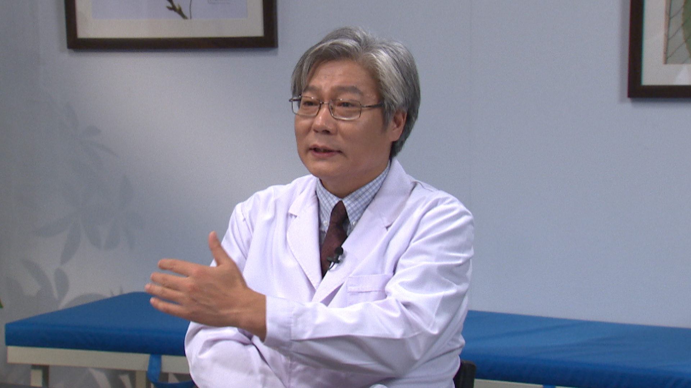

# 1.91 围绝经期综合征

---

## 李怡 主任医师

北京医院中医科主任医师 博士生导师；

中华中医药学会老年医学分会常务委员兼副秘书长；中国中西医结合学会糖尿病分会委员；北京中医药学会老年医学分会主任委员；中央保健局保健专家；北京首届群众喜爱的中青年名医。

**主要成就：** 主持参与多项国家、部级课题的研究，在国内外发表学术论文40余篇，参加编写医学书籍6部。

**专业特长：** 擅长中西医结合诊治糖尿病、代谢综合征、高血压病等。

---

## 围绝经期综合征

（采访）观众朋友们大家好，欢迎您收看《医学微视》，今天我们的科普话题是围绝经期综合征，很荣幸地请到了两位专家做客我们的节目现场，为我们从中西医两个不同的角度科普这个话题，分别是吕秋波主任和李怡主任。

首先我们就要知道什么是围绝经期综合征，那吕主任您能给我们先从西医的角度来说一下吗？

吕秋波主任：围绝经期综合征俗称就是大家更加熟悉的更年期综合征，它的原因主要是卵巢功能衰退，所以使得雌激素波动或者最后完全没有，所引起的一系列的植物神经紊乱，还有一些躯体方面的症状，这一组症状群，我们称为围绝经期综合征。

那么围绝经期一般发生在多大年龄呢？

我们经过统计，绝经的年龄一般都是在50岁左右，所以她在绝经之前，就可能会表现一些围绝经期的症状，大概从45岁到55岁，这是最常见的。

围绝经期表现的时间大概是2年左右，当然有些人有可能会长达10年，这是围绝经期综合征它的一个概况，中医也是有一个时间。

李怡主任：中医是这样，我们不叫围绝经期，叫绝经前后诸症，各种表现，还有一个叫断经前后诸症。

中医最早的古书，最经典的《黄帝内经》里面，《上古天真论》就有这么一种描述，就把女子以七为基数，到七七四十九岁的时候，女性会出现什么生理现象呢？就是叫“任脉虚，太冲脉衰少，天癸竭”，就是月经没有了，“地道不通”就是没有月经了，“故形坏而无子”就是不能怀孕了，就是到了这个阶段。

（采访）两位专家从中西医的角度，为我们阐述了什么是围绝经期综合征，接下来就要好好来了解一下，围绝经期综合征都有哪些具体的症状呢？

吕秋波主任：因为雌激素的变化，还有进一步的雌激素减少，它主要引起精神方面症状，比如说心情不好、烦躁、抑郁等等这一系列的表现。

躯体上最常见的有可能是出汗，这种出汗是比较有特点的，叫潮热，什么叫潮热呢？

就是也没有觉得环境有明显的变化，但是自己一阵突然的满头大汗，然后过一段时间，大概几分钟突然汗就没有了，这叫潮热，就跟潮水似的，来得快，去得也快。

躯体症状还包括一些生殖道的萎缩，泌尿系统的萎缩等等这一系列的表现。

另外一个比较有明显标志的就是内分泌的症状，尤其是生殖内分泌，比如说月经开始紊乱，有些人可能月经慢慢变得稀少，最后不来月经。

真正的绝经就是从最后一次不来月经一年以上，叫绝经，在这之前有可能都会出现月经的改变，最主要的是表现在这些方面。

（采访）这个可能还是需要有一个循序渐进的过程。

吕秋波主任：有可能一开始出现月经不正常，过一段时间，半年甚至一年又挺好的，这也是常见的。

但是它从总的趋势来说就是往衰退的方向发展，所以它是一个动态的过程，有可能会一年到两年的样子。

（采访）李主任，从中医的角度会有什么具体症状呢？

李怡主任：在这个阶段，一些医学古籍当中叫脏躁，五脏六腑的脏，躁动的躁，就是这个时期比较躁动，喜怒无常，胸闷喜叹息。

还有一种叫什么？百合病，百合病是怎么描述的呢？

它叫欲吃不能吃，就是想吃不能吃，想睡又睡不着，想走又走不了，如寒无寒，如热无热，她觉得冷，但是其实不冷，她觉得热，其实也不烧，所以她有很多躯体的自觉症状，但是真去做检查，可能没有任何器质性的病变。

还有一些出汗多，叫汗证。

还有情绪，精神心理方面的表现，叫郁证。

还有就是心慌的，可能就把它放在心悸这个章节。

这是中医对围绝经期综合征的一个认识。

（采访）两位专家描述得非常形象生动，那么围绝经期综合征，到底会给患者带来什么样的危害呢？

吕秋波主任：围绝经期其实是女性所有的变化中，一个必然经过的过程，其实它的危害应该是比较少的。

当然衰老是不可抗拒的，所以卵巢功能的衰老，它带来的就是雌激素的减少，那么雌激素减少以后就会引起来一些症状，这些症状随着时间的延长也会缓解，但是有个别的人会比较严重。

雌激素在身体各个器官有很多受体，包括在心血管方面也会受到雌激素的一些保护，一旦雌激素没有了以后，心血管疾病的发病率会增加。

在泌尿生殖道方面，就是泌尿系统跟生殖道系统都有很多的雌激素受体，会受到雌激素的一些保护，如果说雌激素明显减低以后，生殖道左右的器官是会有萎缩的，包括子宫萎缩，阴道萎缩，膀胱黏膜萎缩，所以会出现相应的症状，比如说老年性阴道炎，性生活不满意，性生活疼痛，尿频，泌尿系容易感染等等。

另外还有一个就是骨的代谢，因为骨的代谢也是会受到雌激素的保护，雌激素减少以后，她的钙会流失得比较多，容易出现骨质疏松等等，这都是一些比较明显的症状，中医这方面可能也会有一些比较典型的表现。

李怡主任：总体来说，其实到这个年龄段，可能就出现了很多的不和谐，就是互相之间的协调功能差了、乱了，这样出现了一系列的问题，其实就是说跟肾虚有关系，肾虚可能更好理解，肾虚是一个，还有肝郁是一个，这是比较核心的内容。

（采访）我们知其然，更要知其所以然，那么引起围绝经期综合征的病因都有哪些呢？

吕秋波主任：围绝经期综合征的病因，从西医的角度讲就在于她的卵巢功能衰退，雌激素减少。

（采访）从中医的角度，不知道您怎么看待这个问题？

李怡主任：这跟年龄相关的，主要是肾气不足，冲任二脉虚少，出现天癸，月经时有时无，或者量逐渐减少这一系列的问题。

总体来说还是跟肾气不足有关系。肝郁气滞，肝郁化火，肝郁脾虚等等一系列肝郁的病因病机，跟情志方面还是有一定关系的。

（采访）我们知道中西医在做检查的时候，方法是非常不一样的。那么诊断围绝经期综合征，从西医的角度都会做哪些检查项目呢？

吕秋波主任：在化验方面经常会有几个指标，比如说促卵泡素，英文是FSH，在围绝经期它会明显的升高。

另外还有一个值就是雌激素跟孕激素，雌激素的英文标志就叫E2，孕激素英文是P，它在围绝经期应该来说是要下降的，尤其到了没有排卵的阶段，孕激素这个值有时候会很低，说明卵巢功能逐渐地衰退了。

还有一个值叫促黄体生成素，就是LH，这个值一般来说也是升高的，它跟FSH指标基本上是同步的。

还有从妇科检查来看，雌激素减少以后，生殖道的器官会表现一个萎缩的状况，检查的时候发现她的子宫会变小，阴道会萎缩等等。

（采访）中医都讲究望闻问切，对于这个病，您一般是怎么给她们做诊断的呢？

李怡主任：现代中医也有现代中医妇科，妇科也是中医的一个优势学科，也有很多吕主任说的那些西医方面的专科检查。

除此以外，中医更多的是从整体来判断疾病，就是通过中医的手段，望闻问切诊断。

中医更多的是给她辩证，是个什么证，是哪虚，阴虚还是阳虚，还是阴阳都虚。肝郁的话，是单纯的肝郁气滞，还是肝郁脾虚，还是肝郁化火等等。

除了一个疾病的诊断以外，中医更多的是要辨个证，属于什么证。中医讲的就是个体化，同一个病在不同的人身上，可能表现就完全不一致，我们所谓有“同病异治，异病同治”之说，就是不同的人得了同样的病，临床表现是不一致的。

（采访）从西医的角度通常都会采取哪些治疗原则和方法呢？

吕秋波主任：从西医的角度，首先你就要好好地认识它，就是了解更年期，其实它是人一生中一个自然的变化过程。

另外可以去到医院检查，去咨询医生，给你评估一下，你是属于什么状态，需不需要去治疗。

更年期的治疗主要是以激素治疗为主要方案，激素治疗会有一个随诊跟监测的问题，获益应该是多的。

但是也有一些危害，可能会引起其它的并发症，所以一定要在医生的严密监测下去选择一个适合你个人的方案去治疗，就是说医生要给你评估，看看你有没有其它的一些不适合治疗的疾病，比如说我们最常见的乳腺增生，增生特别厉害的，但是轻度的增生也是可以治的。

激素治疗也是有一个年龄的推荐，就是进入围绝经期以后，到绝经10年之内，应该来说都是可以用。平均的绝经年龄是50岁，那你到65岁，也是绝经10年多了，所以我们一般不再建议她治疗。

所以激素替代治疗更年期，她一定要在医生的监控下用药，不要自己随便去买点药，然后吃了以后也不知道怎么去随诊，这样容易会出问题。

我们也可以给大家稍微提醒一下，就是说有子宫的妇女吃雌激素的时候，不单纯是要吃雌激素，一定要吃孕激素，要搭配着吃来保护子宫内膜。

（采访）激素没有绝对的好与坏，主要是衡量它给你身体带来的是好处多，还是坏处多。

吕秋波主任：对，就是要权衡利与弊。

李怡主任：我们说望闻问切是一个辨证的过程，辨出证来以后，法随证出，方法就有了，比方说肾虚也好，肝郁也好，只要是把这个证辨对了，相应的法都有了，你就可以用补肾的方法，滋补肝肾，疏肝理气，这些方法就有了。当然还有一部分是瘀血，可以活血化瘀。

不同的证采取不同的治法，那它的方药有选择，比方说肾虚的，不管是阴虚、阳虚，还是阴阳都虚，一般我们都采取的是以地黄类的药为主，偏阳虚的患者用金匮肾气丸，偏阴虚的患者直接用六味地黄丸，有点燥热的患者就用点知柏地黄丸，反正离不了六味地黄丸这个方子。

当然肝郁，一般用的就是逍遥散派生出的一系列组方，逍遥散也是宋代的《太平惠民和剂局方》一个很有名的方子，治妇科病是非常常用的。

现在临床上经常用的，比方说红花逍遥片，它就是在逍遥散的基础上又加了两味药，红花、皂角刺，比方说有乳腺增生的患者可能不太适合用激素，可能用这个药就非常好，就是对症治疗，效果就比较好。

当然还有其它一些逍遥散系列的方子，这都是以疏肝理气、健脾和血为主的一系列方药，还有活血化瘀的一系列方药。

当然还有一些饮食的调护，家人的关心，同情理解，给她进行疏导，这个很重要的。这一系列的方法，不是一个单纯药物能解决的问题。

（采访）两位专家从中西医的不同角度，讲了讲围绝经期综合征的治疗，都提到了主要的治疗方法就是药物，那么治疗围绝经期综合征的药物有哪些呢？

吕秋波主任：我们都知道围绝经期综合征，从西医角度就是全身的雌激素减少了，所以我们就要给她适量地补充雌激素，让她体内的雌激素有一定的水平，这样就可以明显地减少一些症状，比如说像植物神经比较紊乱的患者，潮热出汗、睡眠不好，雌激素用了以后，还是有很明显的效果的。

但是雌激素对子宫内膜，甚至对乳腺，都是有一定的副作用的，长期服用雌激素刺激子宫内膜，容易引起子宫内膜的增生，甚至癌变。对于乳腺也是一样，它都会有一些刺激的作用，所以在用的过程中，我们要注意这个问题。

（采访）李主任，您也提到了很多经典的中药方，您能再给我们具体说说有哪些吗？

李怡主任：像地黄丸系列的，逍遥散系列的，这是治疗围绝经期前后这些病症的常用方剂，当然还是要根据患者不同的表现，要从整体观念出发，要辨证施治。

围绝经期比较早的这个阶段，一般还是肝系的表现比较多，就是跟情志相关的临床症状可能更多一些，这个时段可能采取的就是逍遥散系列的多一些，疏肝理气、健脾和血养血，或者活血化瘀，比方说红花逍遥片，活血化瘀力量强，乳腺有症状的话，可能是更好的一个选择，这是在早期这个阶段。

一般到吕主任说的那个阶段，可能持续的时间比较长，有的甚至到十年。像晚一点的时段，更多表现出来的是肾虚的症状，可能是肾系的这些药物选择就更多一些，大概就是这样。

（采访）中西医虽然用不同的方法和不同的药物来治疗围绝经期综合征，但都是殊途同归，为了患者最后达到一个良好的效果。

李怡主任：就是帮助她顺利安全地度过这个阶段，避免引发其它的一些疾病，或者导致其它的一些问题。

（采访）中医药在治疗围绝经期综合征方面，您觉得有哪些优势呢？

李怡主任：不光是围绝经期，治其它的疾病都是有共同的优势。优势就是中医的特点：整体观念。

围绝经期综合征不光是一个妇科专科的病，也不是一个局部器官的问题，或者一个靶点、一个指标的异常，它可能是在你整体内环境失衡的基础上，表现在某一个局部，某一个器官，某一个靶点。

中医的优势就是要从整体考虑，你不能光考虑一个局部的问题，一个靶点的问题，这是它的优势之一。

第二个优势叫辨证施治，不是说千人一方，它是一人一方，就是叫个体化，从中医角度上说就叫辨证施治。

（采访）听了两位专家的讲述，我觉得中西医都各有优势和特色，所以我们非常期待中西医结合治疗围绝经期综合征，两位专家能自由地谈谈这方面的畅想吗？

吕秋波主任：从中医来说，我觉得它是一个比较长久的、全方位的调节各方面都可能会有好处。但是我觉得它作用有可能会稍微慢一点，比较持续。

中药的调节，我觉得还有一些优势，就是它没有对其它靶器官造成一些危害，比如说你用中药以后，它对子宫内膜没有明显的影响，她不需要再去用孕激素。

孕激素在这个方案里边，最主要是保护内膜，但是它有缺点的，不是说光保护内膜，没有缺点。它对心血管，还有对乳腺是有危害作用的，另外它对乳腺的增生，对乳腺癌的发病率是稍微有些提高的。

所以作为中药来说，我觉得它有可能不太存在这个危害，因为你吃中药的时候不需要用孕激素，所以说它就没有这方面的一些副作用，所以我觉得这两者可以结合起来。

如果说这个患者比较偏向于中医，其实用中医完全是可以的。如果说觉得我现在吃中药不太习惯，又比较苦，还得去熬，比较麻烦，就吃几片西药也是可以的，我觉得这两个不相矛盾，但是它们确实各有优势，主要是看患者自己的要求。

（采访）李主任，您有什么样的展望呢？

李怡主任：医这一行，我有一个观点，这是大医学的观点，我不喜欢分得那么清楚，把中医、西医分得那么清楚。

因为任何一个医学都不是完美的，它都有它的缺陷，包括咱们自己的传统医学和国外的传统医学，包括现代医学，它都有不完美的地方，所以就需要去优势互补，都各有所长、各有所短，两者结合、融合，可能是最好的一个办法，这样是对病患是有利的。

---
