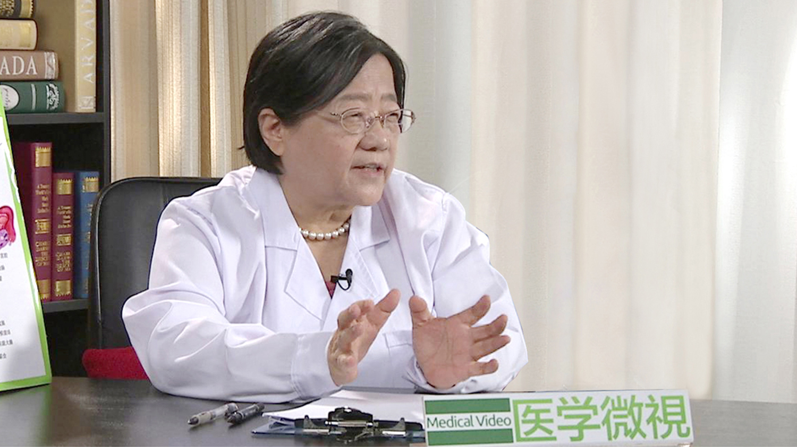

# 1.103 月经不调//牛建昭教授

## 牛建昭 主任医师

主任医师 教授 博士生导师；国家级名老中医；

享受国务院政府特殊津贴专家；世界中医联合会妇科专业委员会常务理事；北京中医药大学原副校长；笫五批全国老中医学术经验继承指导老师。

**专业特长：** 从事临床、教学、科研45年，擅长治疗和调理月经不调、痛经、闭经、崩漏带下、不孕不育、卵巢早衰、内分泌失调、妊娠产后病、生殖道炎症、更年期综合症、多囊卵巢综合症、子宫肌瘤、子宫内膜异位症、乳腺或卵巢肿块、泌尿系统感染、西医治疗（试管婴儿、妇科手术或放疗、化疗）前后调理、性欲低下、心理障碍等妇科疑难杂症。

**主要成就：** 主编出版学术著作14部，获发明专利5项，省部级科研奖8项。

**学术思想：** 牛建眧教授认为：女子以血为本。脾为后天之本，主运化为气血生化之源、孕育之泉；肾为先天之本，主生殖，受五脏六腑之精而藏之，为孕育之根；肝藏血、主疏泄；心主血，主神志，心肝脾肾四脏与女子的经、带、胎、产、杂病密切相关。王冰注《内经》云：“肝藏血，心行之，人动则血运于诸经，人静则血归于肝脏“故诊治妇科病当以调心肝脾肾四脏为要,尤以调肝为先。《黄帝内经》“心主神明,主明则下安”，“主动则五脏六腑皆摇”，因此，她主張寓心理疏导于药物治疗之中，打开心结才能“治病求本”。

在临床诊疗中，她以西辨病、以中辨证论治、中西参合。本着继承中医、发展中医的思想与时俱进，运用中医四诊望、闻、问、切为法，八纲阴、阳、表、里、寒、热、虚、实辨证为纲，同时将现代先进的诊疗技术，作为中医望诊、切诊方法的延伸和发展，实现中医的现代化；综合诊查资料，鎖定中医診疗切入点,在中医理论指导下,做到诊疗的个体化：体现中医的诊疗特色。她根据年龄、月经周期中冲任气血盛衰生理变化的特点，顺势、顺期、顺季实施“一轴（肾-天癸-冲任-胞宫）四期（经后期、经间期、经前期、经行期 ）”为核心的治疗方案，均取得良效。她主张用药平和柔缓、安全味佳，在中药治疗为主同时还指导患者食疗，药食互补。
