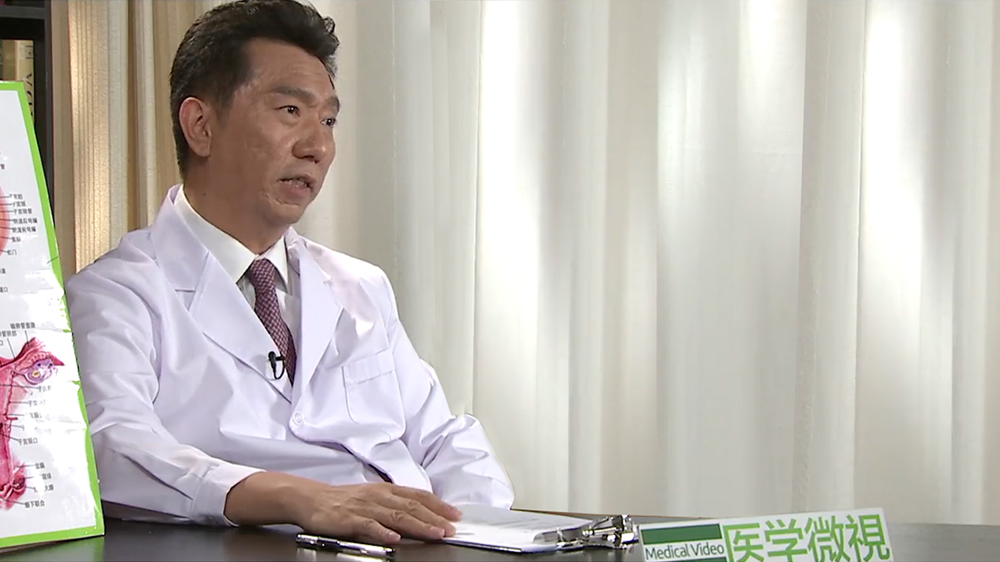

# 1.104 月经过多

---

## 田秦杰 主任医师

北京协和医院妇产科主任医师 教授 博士研究生导师；

美国宾夕法尼亚大学博士后；中华医学会妇产科分会妇科内分泌学组委员兼秘书；全国卫生产业企业管理协会妇幼健康产业分会副会长；全国卫生产业企业管理协会妇幼健康产业分会生殖外科与输卵管学组副组长；白求恩-妇科内分泌专项基金委员会副主任委员；北京市外国医师在京短期行医资格评审专家；国际妇科内分泌协会（ISGE，欧洲）和国际绝经协会（IMS）会员；《生殖医学杂志》副主编；《中国计划生育学杂志》副主任委员；《中国计划生育和妇产科》杂志常务编委；《实用妇产科杂志》《中国实用医学杂志》《临床药物治疗杂志》《中国妇产科网》编委；2008年北京第29届奥运会在奥运会历史上首次设立运动员性别鉴定实验室，担任性别检察官。

**主要成就：** 在国内外核心期刊发表论文100多篇，参与编写曹泽毅主编《中华妇产科学》第一、二、三版；作为副主编，与郎景和院士编写《青少年妇科学》《女性健康全书》《新婚必读全书》；作为副主编，编写《实用女性生殖内分泌学》和《绝经与健康》专著；作为“性发育异常的临床与基础研究”的主要参加者之一获得1996年度卫生部科技进步奖一等奖及1997年国家科技进步奖三等奖。

**专业特长：** 擅长妇科内分泌专业，包括性发育异常；性早熟；月经紊乱；多囊卵巢综合征；闭经；不育的诊断处理；宫腔镜、腹腔镜手术；更年期治疗；绝经后激素替代治疗等。
