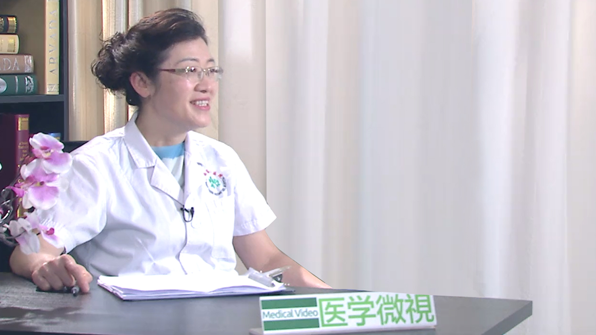

# 1.108 孕期营养

---

## 刘兴会 主任医师

四川大学华西第二医院产科主任 围产实验室副主任 主任医师 博/硕士生导师；

中华医学会围产医学专业委员会副主任委员；中华医学会妇产科学分会产科学组 副组长；中华医学会妇产科学分会妊娠期高血压疾病学组 委员；中华医学会围产医学分会新生儿复苏学组 委员；中华预防医学会出生缺陷预防与控制专委会；妊娠期疾病与出生缺陷防控专业学组 组长；中国妇幼保健协会围产营养与代谢专委会 委员；中华医学会感染病学分会产科感染与肝病学组 委员；中国DOHaD联盟专家委员会 委员；《中华妇幼临床医学杂志（电子版）》 副总编辑；《妇产与遗传（电子版）》第一届副主编；《中华妇产科杂志》第十届编委；《中国实用妇科与产科杂志》第七届常务编委，第八届常务编委；《实用妇产科杂志》第五届常务编委；《现代妇产科进展》第五届编委；《中华围产医学杂志》第三届编委；《中华产科急救电子杂志》第一届编委；《西部医学》第四届编委；《中国全科医学》审稿专家；中华医学会科技奖第三届评审委员会 委员；四川省学术技术带头人；四川省医学会围产医学专业委员会 主任委员；四川省妇产科质量控制中心 副主任委员；四川省有突出贡献的优秀专家（第十一批）；四川省卫生厅学术技术 带头人；成都市产科急救专家组组长；四川省及成都市医疗事故鉴定专家组 专家。

**主要成就：** 从事产科工作近30年，致力于产科及围产医学的临床及科研工作，对产科并发症、合并症及胎儿宫内发育状况、孕期营养和体重管理有深入的研究。已在国内外医学杂志上发表论文204篇，SCI、Medline收录56篇。主编《难产》、《实用产科手术学》、《助产理论与实践》等专著9部；参编专著22部。获得实用新型专利技术3项。负责及参加了国家十五、十一五攻关课题、国家自然科学基金、国家科技支撑计划及四川省科技厅重大课题等多项科研课题，已培养及指导博士、硕士研究生近30名。在全国参与制定了产科多项医疗规范和指南，并执笔撰写了《产后出血预防与处理指南（2014）》、《产后出血预防与处理指南（草案）》，并参与撰写了国内10余项产科指南；连续十年作为负责人承担了国家继续教育项目《产科临床的热点与实用问题学术讲座》、《产科急症评估与程序处理》，对产科临床治疗处理规范、产科危急重症的处理、产科适宜技术及高级生命支持等技术进行了广泛的培训和巡回讲座。

**专业特长：** 擅长产科并发症、合并症的治疗及胎儿宫内发育状况、孕期营养和体重管理。
