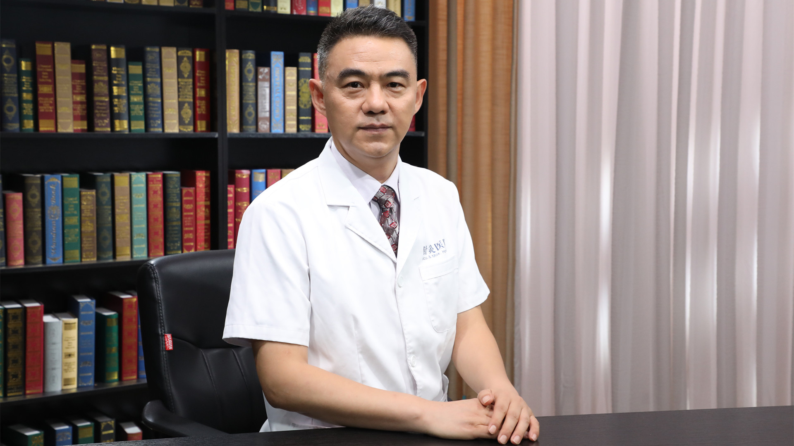

# 1.112 针灸防治卵巢早衰

---

## 房繄恭 主任医师

中国中医科学院针灸医院副院长 主任医师 博士生导师 博士后合作导师；

岐黄学者；中国中医科学院中青年名中医；国医大师刘敏如传承弟子；中国针灸学会妇科生殖专业委员会第一任主任委员 艾灸分会副主任委员；世界中联中医药国际化品牌研究专业委员会副会长；世界针灸学会联合会 中国针灸学会卵巢早衰（POI)专家工作室创建人。

**主要成就：** 在国内建立了60余家卵巢早衰工作室和专病门诊；国家十三五重点研发计划课题、十二五科技支撑计划课题、国家自然科学基金等课题负责人；主编、参编学术专著6部；发表学术论文60余篇。

**专业特长：** 熟练掌握针灸、正骨、浮针等技术。对卵巢低反应、卵巢功能减退、早发性卵巢功能不全、薄型子宫内膜、反复移植失败、反复胎停、男性少弱畸形精子症等不孕不育；压力性尿失禁（漏尿）、慢性盆腔痛、便秘、性功能障碍等盆底功能障碍；颈椎病、腰痛、膝关节痛；过敏性鼻炎等疾病的治疗具有丰富经验。
