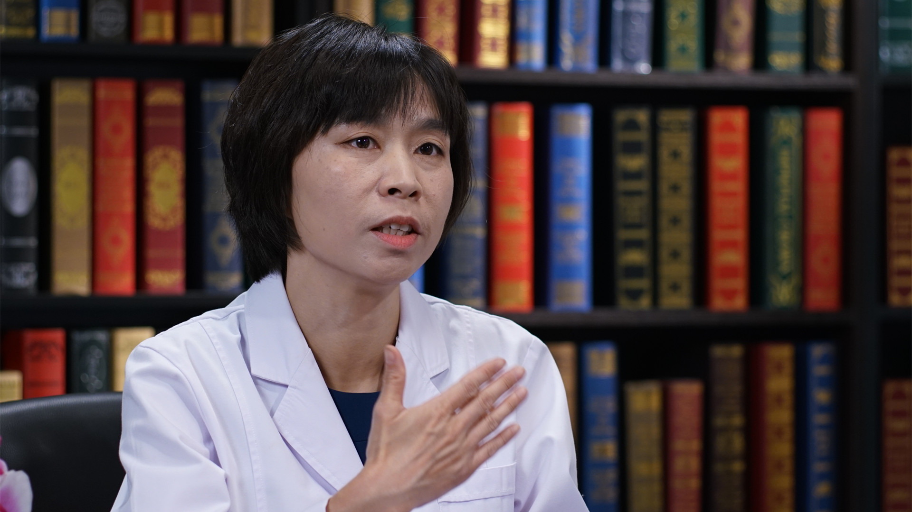

# 1.116 中医治疗乳痛

---

## 张董晓 主任医师

首都医科大学附属北京中医医院乳腺科 主任医师 硕士生导师；

中华中医药学会外科分会常委；中国中医药研究促进会乳腺病分会副主任委员；北京乳腺病防治学会预防与保健专业委员会常委；《中国中西医结合杂志》（英文版）审稿专家；中华中医药学会科技奖励评审专家。

**主要成就：** 主持国家自然科学基金青年项目、面上项目、北京市自然科学基金、北京市卫生局局基金等多项乳腺疾病研究课题；在乳腺疾病教学方面荣获优秀教师等多项荣誉称号，受邀赴新加坡等地进行讲学；发表专业论文40篇，主编并参编专著8部。

**专业特长：** 从事乳腺疾病的临床、教学及科研工作，在中西医结合治疗乳腺疾病方面具有一定建树，开展系列科学研究。
