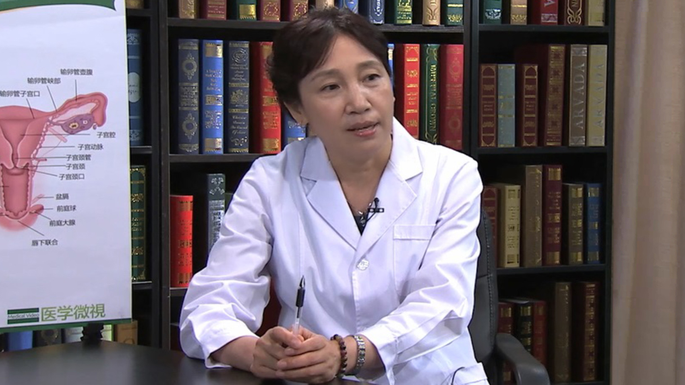

# 1.119 子宫内膜癌

---

## 周友珍 主任医师

首都医科大学附属北京世纪坛医院妇产科教学主任 妇科副主任；

妇儿党支部纪委书记 主任医师 研究生导师；妇幼保健协会妇幼微创分会妇科学组委员；中国整形美容协会女性生殖整复分会理事；中国老年学与老年医学学会妇科分会委员；世界中医药学会联合会盆底专业委员会理事。

**主要成就：** 国家科研成果2项，教育部科研成果1项；获铁道部科技进步二等奖2项，三等奖1项；获院级科研成果及新技术奖5项；在国内外医学杂志上发表论文及综述40余篇；主编著作2部，副主编3部，参编11部。

**专业特长：** 从事妇产科临床工作30余年，擅长各种妇科恶性肿瘤手术，如卵巢癌分期术，肿瘤细胞减灭术，宫颈癌、子宫内膜癌广泛子宫切除术，筋膜外子宫切除，盆腔淋巴结清扫术，腹主动脉旁淋巴结切除术。

---

## 子宫内膜癌是怎么回事？

**（问题）****子宫内膜癌是怎么回事？**

> 子宫内膜癌顾名思义，就是发生在子宫内膜的，一个上皮性的恶性肿瘤，子宫内膜癌我们又称子宫体癌，为什么？子宫内膜在子宫体的中间，所以我们称为子宫体癌。

> 正常在我们月经周期，就是说使我们这个大脑皮层，丘脑下部和垂体卵巢轴，这个轴的调节，调节我们的月经，这个成一个周期性的改变，在月经的整个周期，都有雌激素的分泌，使子宫内膜增生变厚，子宫内膜如果它是无序的生长。

> 比如没有孕激素的拮抗，它就发生了过度的增生，子宫内膜增生通常分三种情况，一种是单纯性增生，另外一种是复杂性增生，还有一种是不典型增生。

> 但是在我们前面的两种，比如说单纯性增生和复杂性增生，它是属于我们叫良性病变，属于是功能性子宫出血的范畴，就是我们通常所说的月经不调，或者月经紊乱引起的。

> 不典型增生就属于是癌前病变了，属于子宫内膜的癌前病变，这个它已经是不属于我们，功能性子宫出血的范畴了，所有的子宫内膜的增生，都是需要治疗的，因为子宫内膜增生有可能导致癌变。

> 比如说单纯性增生，它的子宫内膜的癌变率1%，复杂性增生的癌变率可以到3%，如果是不典型增生它发生，子宫内膜癌的几率达到了10%和15%。

> 子宫内膜癌它是我们女性，生殖系统当中三大癌症之一，它的发病率是在欧美国家，是发病率第一位的，居于宫颈癌和卵巢癌之上，但是在我们国家总体的发病率，是居于宫颈癌之后是第二位。

> 但是随着人民生活水平的提高，社会经济的发展，子宫内膜癌的发病率在逐年的上升，呈现年轻化的趋势，在上海和北京的一些大城市。2014年的统计子宫内膜癌的发病率，已经与宫颈癌持平了，子宫内膜癌高发的年龄主要有两个年龄段，一个是发生在四十岁左右，一个是在绝经以后。

---

## 诱发子宫内膜癌的高危因素有哪些？

**（问题）诱发子宫内膜癌的高危因素有哪些？**

> 子宫内膜癌有一些比较高危的因素，子宫内膜癌的发生，主要是长期的雌激素的刺激，使子宫内膜无序的增生引起的，所以有一些疾病，比如说内源性的雌激素水平的增高，就可以导致子宫内膜癌。

> 比如说有多囊卵巢综合征，这是一个很常见的一个疾病，它主要是因为不排卵，不排卵的话长期没有孕激素的拮抗，只有雌激素的刺激也可以导致。

> 另外有一些就是卵巢的功能性的肿瘤，比如说卵泡膜细胞瘤和颗粒细胞瘤，这两种肿瘤，它是可以分泌雌激素的，所以它也会导致雌激素水平的增高，诱发子宫内膜癌。

> 第二个就是说由于，外源性的一些雌激素的补充，比如说乳腺癌患者她需要，长期口服三苯氧胺，三苯氧胺这个药它是一个，微弱的雌激素活性的一个药物，它可以导致子宫内膜的增生，可以引起诱发子宫内膜癌。

> 另外一些比如说更年期，绝经以后的女性用药做激素替代，替代治疗激素替代不规范，长期的使用雌激素没有使用孕激素，这样也可以是一个高危因素。

> 另外比如说还有一些体质的因素，比如说糖尿病高血压还有肥胖，这我们俗称是子宫内膜癌的三联征，这也是子宫内膜癌的高危因素。

> 另外还有一些比如说初潮来的很早的，或者是晚绝经的这些女性，晚绝经什么叫晚绝经，因为正常的绝经年龄，是四十岁到五十四岁这个期间，如果是绝经越晚，比如晚于五十五还没有绝经，我们叫绝经延迟。

> 对于这些绝经延迟的女性来说，她虽然还有月经，体内还有雌激素的水平的分泌，但是卵泡已经几乎耗竭，她的排卵的质量几乎是不排卵，或者排完卵之后，这个卵的质量差不能成熟，这样它就不能分泌更多的孕激素。

> 所以这样就没有孕激素的拮抗，只是一个单纯的雌激素的，长期的作用于子宫内膜，这样它就容易导致子宫内膜癌，另外可能有一些遗传因素。

---

## 不孕不育也会诱发子宫内膜癌的发生吗？

**（问题）不孕不育也会诱发子宫内膜癌的发生吗？**

> 不孕不育和子宫内膜癌，是有一定的关系，在我们讲这个话题之前，我们先了解一下，讲一下这个卵巢的功能，卵巢的功能有两个功能，第一个是生殖功能，是要产生卵子完成生育。

> 第二个就是有内分泌的功能，它可以分泌三种激素，比如说主要的是雌激素和孕激素，还有少量的雄激素，雌激素的功能是子宫内膜增生，呈增殖期的改变，就是说子宫内膜变厚。

> 孕激素的功能它就是，使子宫内膜分泌期的改变，子宫内膜脱落，只是在排卵以后才产生雌激素，由黄体产生雌激素和孕激素，所以如果它不排卵的话，它就没有雌激素产生。

> 因为这个不排卵引起的不孕不育，她长期的没有孕激素的拮抗，有雌激素的增生引起子宫内膜的增生，就可能诱发子宫内膜癌。有研究流行病学调查已经发现，有过生育的生育过一次的女性，比没有完成过生育的，患子宫内膜癌的几率要低。

---

## 哪些女性易得子宫内膜癌？

**（问题）哪些女性易得子宫内膜癌？**

> 首先就是说有些高危因素的那些女性，比如说肥胖，肥胖的患者容易得子宫内膜癌，因为肥胖了以后她脂肪比较多，脂肪可以通过酶的代谢转化为雌激素，这样使体内的雌激素活性增加。

> 另外一个就是说糖尿病，也是个高危因素，她发病的几率比没有糖尿病的患者，发病的几率要高好几倍，具体的病因还不是特别的清楚。

> 另外一个就是高血压，高血压的病人也是说她的，子宫内膜癌的患病率要高于，没有高血压的患者，还有一些比如说初潮来的很早，或者绝经晚的这些女性，她也是属于一个内源性的，雌激素的活性比较增高。

> 因为正常的绝经年龄，是四十岁到五十四岁这个期间，如果是绝经越晚，比如晚于五十五还没有绝经，我们叫绝经延迟，对于这些绝经延迟的女性来说，她虽然是还有月经，体内还有雌激素的水平的分泌，但是她已经几乎卵泡已经几乎耗竭。

> 她的排卵的质量几乎是不排卵，或者排完卵之后，这个卵的质量差不能成熟，这样它就不能分泌更多的孕激素，所以这样就没有孕激素的拮抗，只是一个单纯的雌激素的，长期的作用于子宫内膜，这样它就容易导致子宫内膜癌。

> 另外就是说有一些疾病的患者，比如说多囊卵巢综合征，还有一个卵巢的功能性的肿瘤，比如说颗粒细胞瘤，或者卵泡膜细胞瘤，分泌雌激素这样导致，内源性的雌激素的活性比较高。

> 另外如果说绝经以后，长期进行激素替代，不是很规范的激素替代，没有通过孕激素拮抗，或者激素的量比较大，或者说是子宫内膜癌的患者，她口服三苯氧胺这样也可以，这些患者都是可以导致子宫内膜癌。

---

## 围绝经期为什么要警惕子宫内膜癌的发生？

**（问题）围绝经期为什么要警惕子宫内膜癌的发生？**

> 围绝经期就是女性，在绝经前和后的一段时间，我们统称为围绝经期，就是平均我们讲女性的绝经年龄，是四十岁到五十四岁之间，就是四十岁之前绝经，我们叫卵巢功能早衰属于异常了。

> 如果只要你满了四十岁以后绝经，在医学上就属于是正常的范围，但是平均的绝经年龄是五十岁左右，这个属于正常的，每个人根据个人的体质，还有遗传因素这些都有关系，就绝经的年龄的迟早跟这都有关系。

> 因为围绝经期的女性在这个阶段，由于她长期有不排卵，或者说排完卵以后卵的质量不好，这个孕激素水平是缺乏的，她长期受一个雌激素的作用，使子宫内膜增生，往往这个期间可能就容易月经紊乱，出现了异常的子宫出血。

> 比如说月经周期的延长，甚至说停经几个月不来月经，或者突然再来大出血，这个时候的女性往往，就以为自己是更年期了，觉得自己月经乱了，没有引起重视也没有去就诊，也没有去做B超了解子宫内膜。

> 这样时间长了以后，就可能导致可能已经是，子宫内膜的病变了，同时还有一部分患者，比如说子宫内膜癌，有25%的女性子宫内膜癌患者，发生在围绝经期的患者，就是四十岁左右发生的。

---

## 子宫内膜癌是如何分期的？

**（问题）子宫内膜癌是如何分期的？**

> 子宫内膜癌有两种分期，第一个是临床分期，就在手术之前的临床分期，它分Ⅰ期Ⅱ期Ⅲ期Ⅳ期，Ⅰ期就是说这个病变，发生在子宫腔里边我们叫Ⅰ期，根据宫腔的大小。

> 比如说大于八个厘米和小于八个厘米，分为Ⅰ期a或者是Ⅰ期b，如果这个子宫内膜癌蔓延到子宫颈了，侵犯宫颈了我们就叫Ⅱ期，但现在Ⅱ期的分期，我们以前是通过分段诊刮，在宫颈管这边诊刮，找到癌细胞就叫Ⅱ期了。

> 但现在的国际的指南规定，就说是只有这个肿瘤，侵犯了宫颈的间质，不是说宫颈的粘膜，侵犯宫颈的间质，才能够诊断是Ⅱ期，第Ⅲ期是我们已经，超出了子宫的范围了，到了宫旁比如说附件了，盆腔的器官了甚至直肠输卵管等等，这些我们就叫是Ⅲ期。

> 到远处（转移）比如说肺，远处胸腹腔积液胸腔积液，到了远处的转移我们就叫Ⅳ期，但是临床分期我们大部分，一个通过分段诊刮，另外一个主要通过影像学，磁共振或者是阴道B超，另外还有PET-CT等等。

> 通过影像学检查来进行临床分期，临床分期的目的是为了，要做一些我们定手术方案，定我们的治疗的方案，但是我们真正临床用的比较多的话，就叫手术病理分期。

> 是为了通过做手术以后，切除了各种的器官，来进行临床分期，通过这个手术病理分期，决定我们手术以后的治疗的方案，需不需要有后续的治疗，或者说是观察。

---

## 子宫内膜癌不同分期都有哪些症状？

**（问题）子宫内膜癌不同分期都有哪些症状？**

> 子宫内膜癌的期别的不一样，这个临床的症状是不一样的，在极早期的时候是没有任何症状，随着病情的进展，当然早期可能最常见的症状，是异常的阴道的出血。

> 比如说绝经以后的女性，她会出现绝经后的阴道出血，如果围绝经期的女性，她可能有的表现为月经的紊乱，所以阴道出血应该是最早期的症状，其次是异常的阴道排液。

> 比如说她可能会主诉，阴道的分泌物增多，会有一些白色的或者淡黄色的，或者带血性的分泌物，这也是一个比较常见的症状。

> 如果说这个病情的延长，肿瘤侵犯到宫颈了宫颈管堵塞，或者感染积脓宫腔积脓，可以出现子宫的痉挛性的疼痛，下腹的坠痛，如果肿瘤再进一步扩散，到周围的器官了，到盆壁到盆腔压迫神经，还可以出现疼痛。

> 如果到了极晚期以后的话，比如说转移到远处转移，出现胸水腹水，甚至可以出现腹胀腹痛，不想吃饭纳差，甚至有疼痛压迫的疼痛，所以就是不同的期别，它的临床的表现还是不一样。

---

## 怀疑是子宫内膜癌时需要做哪些检查？

**（问题）怀疑是子宫内膜癌时需要做哪些检查？**

> 子宫内膜癌最早期的，极早期是没有任何症状的，但是随着病程的延长，早期可以出现，最常见的是异常的阴道出血，比如说围绝经期的女性，她有月经出现月经的紊乱。

> 如果是绝经的女性，她会出现绝经后的阴道出血，这是最常见的症状，另外还有一部分出现，阴道的异常的排液，比如说阴道分泌物增多，有黄色的或带血性的分泌物，这也是一个比较常见的症状。

> 如果有这些症状的，首先就要及时去医院就诊，不能说自己以为是自己更年期了，或者说是阴道炎了，自己随便买点药或者吃了就算了。所以这种情况一定要首先及时就诊，做一个阴道B超，了解一下子宫内膜的情况，子宫内膜的厚薄，宫腔里有没有异常的赘生物等等。

> 另外一个如果是有这些症状，大夫肯定会根据情况，来决定需不需要做分段诊刮，就是诊断性刮宫，取出子宫内膜来去送病理，这样就能够排除或者是确定，有没有子宫内膜的病变。

> 如果我们的病理，诊刮的病理出来就是，一个子宫内膜癌，那我们还都进一步的检查，要做临床分期，要决定我们的治疗方式，或者手术范围，这样就需要做影像学的检查。

> 最常用的是磁共振盆腔的核磁检查，了解一下子宫内膜的厚薄，子宫的肌层有没有侵犯，子宫的浆膜面是不是完整的，附件区有没有肿物，还有宫颈有没有受侵犯，这样来帮助我们进行临床分期。

> 另外我们还可以采一些肿瘤标志物，比如说C125这是一个癌胚抗原，大家都很比较熟悉的是一个，卵巢上皮癌的一个癌胚抗原。

> 但是当子宫内膜癌的话，中晚期有的也会引起C125的增高，另外比如说我们还要了解一下，有没有远处的转移，比如说有没有肺的转移，可以做肺CT检查。

---

## 子宫内膜癌应如何与其他疾病区分开？

**（问题）子宫内膜癌应如何与其他疾病区分开？**

> 子宫内膜癌的一些鉴别，根据它的子宫内膜癌的临床症状来，跟一些相关的疾病相鉴别，比如说异常的阴道出血，或异常的阴道排液的，这些相关的疾病。

> 在良性的疾病当中，首先比如说我们要考虑的是，功能失调性子宫出血，就是围绝经期的一个月经紊乱，25%的患者当中肯定有子宫内膜癌，我们要进行分段诊刮进行鉴别。

> 第二个就是说有子宫内膜的增生，也是表现为她有月经紊乱异常出血，我们要通过分段诊刮。

> 第三个就是说有粘膜下子宫肌瘤，或者说是有子宫内膜的息肉，这一部分的患者她也是，表现为月经量过多，甚至月经周期的改变淋漓不尽，或者是月经周期的延长。

> 一个是通过分段诊刮，通过宫腔镜的检查，取出组织物送病理来进行鉴别，这是一些良性的疾病，比如说还有一些恶性的疾病，比如说宫颈癌，它的典型的表现宫颈癌，是接触性出血，跟子宫内膜癌的出血还不一样。

> 子宫内膜癌的出血一般来说是，少量的暗红色的出血，宫颈癌的鳞癌跟子宫内膜癌，是可以通过病理诊刮鉴别的，但是宫颈的腺癌和子宫内膜癌，往往又是难以鉴别。

> 比如说究竟是子宫内膜癌，转移到宫颈了，还是说宫颈原发的腺癌，有的时候我们通过，我们的组织病理学上，通过免疫组织化学检查，才能鉴别开来，通过临床上有时候难以鉴别。

> 还有一个比如说输卵管癌，输卵管癌典型的症状，就是说阵发性的阴道排液，就是一阵一阵阵发性阴道排液，比如说跟我们子宫内膜癌的，异常排液有可能相混淆，但是这种情况下。

> 比如说输卵管癌它的子宫里面，宫腔的内膜是正常的，宫腔里没有团块或者异常的组织物，但是往往在宫旁可以发现有肿物，有一个实心的肿物，并且有丰富的血流信号，C125还会增高。

> 当然有的时候在我们难以鉴别诊断，通过宫腔镜的诊刮，宫腔子宫内膜血是阴性的，可是这个宫旁还有这些症状，我们就要通过腹腔镜的探查，看看附件或者是输卵管有没有肿瘤。

---

## 哪些子宫内膜癌患者可以保留生育功能？

**（问题）哪些子宫内膜癌患者可以保留生育功能？**

> 这个问题是一个很好的问题，子宫内膜癌原则上来说，都应该选全子宫双附件切除，但是因为这个子宫内膜癌，发病的年轻化，就是有相当一部分患者发病的时候，在四十岁左右或四十岁之前，这些人可能因为绝经比较晚。

> 结婚比较晚，或者说现在是二胎政策的开放，可能有相当一部分女性想生二胎了，但是可能发现有子宫内膜癌了，但对于这部分患者来说，我们要根据一定的情况，有一定的选择。

> 有一部分病人是可以，保留她的生育功能的，什么情况下呢，比如说第一首先是要四十岁之前，四十岁以后我们是不考虑了，另外她有强烈的要去，保留她的生育功能要求，我们经过充分的沟通，有这个强烈的要求。

> 第三个一定是子宫内膜的腺癌，不是一些特殊类型的，比如说浆液性乳头状的腺癌，或者说透明细胞癌或者说癌肉瘤，这些肿瘤都是恶性程度相当高的，这样是不能保留。

> 子宫内膜样腺癌而且是高分化的，这样是可以考虑的，还有一个它的临床的期别比较早，所以Ⅰ期a什么叫Ⅰ期a，就是子宫病变只局限于子宫内膜，子宫的肌层是完整的。

> 而且病变病灶比较小小于两厘米，这样的话就是有保留生育功能的条件，当然这个还是跟，生殖中心的大夫沟通，她没有其它的不孕的因素。

> 比如说输卵管的因素，甚至是男方的因素，没有其它的不孕的因素。而且这个病人她自己，要有很好的随访条件，还要有很好的依从性，要定期的来口服激素的治疗，定期的来复查。

> 另外就是我们通过一些其它的检查，发现她没有其它远处的转移，就分期比较早没有远处的转移，还有没有遗传的因素，相关的子宫内膜癌。

---

## 子宫内膜癌转移途径有哪些？

**（问题）子宫内膜癌转移途径有哪些？**

> 子宫内膜癌的转移，跟其它的恶性肿瘤一样，都是有三大途径，第一个就是说直接的蔓延传播，比如说子宫内膜它在宫体，它可以向宫颈蔓延，通过输卵管到宫旁，这是最常见的一个子宫直接蔓延。

> 另外一个很主要就是说淋巴转移，通过淋巴结淋巴管转移，比如我们盆腔的淋巴有宫旁淋巴结，还有髂内淋巴结有髂外淋巴结，还有腹股沟深巴结，还有腹主动脉旁淋巴结。

> 由于它病变的部位不一样，子宫内膜癌可以通过这些，淋巴管向这些淋巴结转移，所以我们子宫内膜癌在治疗，做手术的时候是应该按照规范，做分期的时候应该做淋巴结的清扫。

---

## 子宫内膜癌患者在什么情况下需要做化疗？

**（问题）子宫内膜癌患者在什么情况下需要做化疗？**

> 子宫内膜癌的化疗，其实在很多年以前是有争议的，但是近些年的发展研究，子宫内膜癌的话化疗也作为我们，子宫内膜癌的一个比较重要的，一个辅助治疗的方法，它适用于哪些患者。

> 比如说一个是晚期的，远处转移的晚期的患者，我们要先进行化疗，我们叫新辅助化疗，先化疗完了以后让肿瘤缩小，再考虑是不是进行手术，或者是放疗这是一种。

> 另外一个复发的患者，就是说治疗以后重新再复发了，这一部分患者大部分我们选择化疗，还有一部分是早期的，有高危因素的这些要进行化疗。

> 什么情况下有高危因素，比如说它是一个，特殊类型的病理类型，比如说我们说有透明细胞癌，或者说是一个低分化的癌，或者说是一个癌肉瘤，甚至是一个浆液性乳头状的腺癌，这些特殊病理类型是属于要化疗。

> 另外一个就是说它的期别，比如说期别比较晚，还有一个就是说我们听过，淋巴结手术以后淋巴脉管有侵犯，有肿瘤细胞的侵犯了，病变比较大肿瘤的病灶侵犯，大于肌层的二分之一，这些情况下我们都是需要做化疗。

---

## 子宫内膜癌患者都需要做手术吗？

**（问题）子宫内膜癌患者都需要做手术吗？**

> 子宫内膜癌的治疗，我们还是主要的治疗方法，是以手术为主，再辅助其它的一些化疗放疗，或者激素治疗，子宫内膜癌的手术的范围，就根据病人的发病的年龄，根据她一般的情况能不能来做手术。

> 还要根据她的肿瘤期别的早晚，有没有生育要求来决定，比如说Ⅰ期a的早期的患者，对于一个子宫内膜癌，Ⅰ期的子宫内膜癌的患者，我们一般来说，我们做手术的方式是，全子宫加双附件切除，这是标准的术式。

> 如果有高危因素的话，先盆腔淋巴结的清扫，或者是腹主动脉淋巴结的活检，我们统称为子宫内膜癌分期术，子宫内膜癌的治疗，因为子宫内膜癌在发现，80%已经属于早期的子宫内膜癌。

> 什么是早期？，我们按照国际的分期是，Ⅰ期Ⅱ期属于早期，Ⅲ期Ⅳ期是属于晚期的，对于早期的子宫内膜癌，我们要行子宫内膜癌的分期术，就是说分期术的手术的范围。

> 比如包括标准的全子宫，加上双附件的切除，另外还有盆腔淋巴结的清扫，盆腔淋巴结就包括髂内髂外，还有腹股沟深还有闭孔，还有髂总淋巴结。

> 另外还要做腹主动脉旁淋巴结的活检，这是我们Ⅰ期的，对于是Ⅱ期以上Ⅱ期的患者，要不要做盆腔淋巴结的清扫，一直还是一个有争议的，就是说有一部分认为，做了盆腔淋巴结的清扫，甚至腹主动脉淋巴结的切除以后。

> 这个手术很大，手术的并发症比较多，可能对于病人的预后，可能恢复是有些影响，因为子宫内膜癌，比如说Ⅰ期a的，或者说是一个高分化的子宫内膜癌，它的淋巴结的转移不是很常见，所以有一部分还是有争议的。

> 但是目前就说是跟指南来决定，做盆腔淋巴结的清扫，各期做盆腔淋巴结的清扫都是对的，都是可以的，但是对于晚期的患者来说，比如说Ⅲ期Ⅳ期需不需要手术，甚至是Ⅳ期b的患者需不需要手术。

> 现在就是目前的观点，还是说尽量的需要手术，可以先做新辅助化疗让肿瘤缩小，再手术或者说先做放疗，放疗（肿瘤）缩小以后，再做一个姑息性的手术治疗。

> 目前用的比如说Ⅳ期b的患者，我们仅仅是切除子宫和双附件，切除原发灶，这样就可以降低肿瘤的负荷，还有一个切除双附件以后，降低激素水平的分泌，这样子对它疾病的恢复是有好处的。另外一个就是说，可以减少因为子宫腔里，大的癌灶的脱落引起大出血，所以手术是子宫内膜癌治疗的，一个主要的方式。

---

## 子宫内膜癌的手术就是单纯的将子宫切除吗？

**（问题）子宫内膜癌的手术就是单纯的将子宫切除吗？**

> 不是的子宫内膜癌的手术，我们要是做规范的手术，叫子宫内膜癌分期术，我们做手术的方式是，全子宫加双附件切除，这是标准的术式。

> 如果有高危因素的话，先盆腔淋巴结的清扫，或者是腹主动脉淋巴结的活检，我们统称为子宫内膜癌分期术，双附件就包括输卵管和卵巢，包括盆腔的淋巴结各种的淋巴结，包括腹主动脉旁淋巴结的清扫，这是规范的手术。

> 当然根据病人的年龄，根据它的分期的早晚，还有根据病人的一般情况的，等等不一样，可能选择手术的范围是不一样的。比如说一个很早期的子宫内膜癌患者，她又很年轻是个Ⅰ期a，是个高分化的，她要完成生育功能，我们可以保留卵巢，可以保留她的生理功能。

> 比如说保留卵巢分泌激素，这样保留她的生理功能，当然这个要跟病人充分的沟通，因为她保留的卵巢分泌雌激素，就肯定对复发还是有一定的影响。但是就是说对于没有生育要求的，年龄四十岁以上的，那么我们还是要做规范的手术。

---

## 子宫内膜癌患者术前需要做哪些准备？

**（问题）子宫内膜癌患者术前需要做哪些准备？**

> 术前的准备，比如说首先要做心理准备，要接受这个做手术这个治疗，因为这个手术是治病。另外一个要跟医生充分的沟通，家属和自己跟医生充分的沟通，了解一下这个病情什么样，做什么样的手术，手术当中手术以后，可能出现什么样的并发症，或者说有些注意事项等等，这要进行充分的沟通。

> 第二个肯定要进行阴道准备，术前三天要进行阴道冲洗，第三个就要进行肠道的准备，因为这个手术比较大，肠道我们要进行清理，常常口服比如说甘露醇，或者是口服一些福静清等等，一些清洗肠道的药把肠道排空。

> 第二天早上要进行灌肠，用一千毫升的盐水进行灌肠，总之要达到清洁灌肠，这样预防一个是手术以后，她排便排气肯定恢复得好。另外手术当中，如果比如说肿瘤的侵犯，万一有肠壁的损伤，或者需要切除肠管什么的，这样就可以手术一次完成，另外就是手术之前可能要，抽血要备血备皮等等的。

> 一些常规的术前准备，在术前她还需要再化疗吗？早期的子宫癌患者是不需要化疗，比如说对一些晚期的，有远处转移的胸腹水的，手术根本做不了的就可能术前要化疗，我们叫新辅助化疗。

> 但这个化疗就是说我们一般来说，是化疗两到三个疗程，不是说长期化疗两到三个疗程，当她远处的病灶控制以后，有手术的条件了我们就进行手术，如果说没有手术的条件，那我们就可以改用放疗。

---

## 子宫内膜癌患者术后在饮食上应注意哪些问题？

**（问题）子宫内膜癌患者术后在饮食上应注意哪些问题？**

> 我们一般是会术后六个小时就可以进水，全麻醒了就可以进水，十二个小时以后如果没有肠道的损伤，可以进少量的流食，比如米汤等等一些。

> 因为这是一个比较大的手术，手术以后一个就是胃肠功能的恢复，就是排气，排气的话可能有的需要48小时，甚至72小时要排气，肯定会出现一些腹胀腹痛的情况，所以这个时候，比如我们要多活动勤翻身，这样一个是可以刺激肠蠕动。

> 另外有的喜欢喝一些萝卜汤，也可以促进排气，当然如果说几天都排气不了的话，还有一些药物，比如说我们可以打一些新斯的明，还可以喝一些四磨汤，中药中成药，这些都是促进胃肠功能恢复的。

> 当排气以后胃肠功能恢复了，我们就可以进半流的饮食，比如说面片馄钝鸡蛋羹，鸡汤鱼汤等等这些半流的，带汤带水的半流的饮食，也可以吃一些水果，或者是牛奶等等，当有大便了就可以进普食了，就跟术前一样什么都能吃了。

---

## 子宫内膜癌患者术后如何预防血栓的形成？

**（问题）子宫内膜癌患者术后如何预防血栓的形成？**

> 手术以后我们要注意预防血栓，这是非常重要的，一个就是说手术比较大长期卧床，还有一个手术当中的失血，这样都是一些容易导致，血栓的一些高危因素。

> 尤其年龄比较大的，肿瘤和高龄都是血栓的高危因素，所以我为了预防，我们就说是手术之前可以穿弹力袜，手术以后还可以穿上弹力袜，可以做上气压驱动，进行下肢血管的气压驱动。

> 术后二十四小时我们，常规的要打抗凝剂，打速避凝这样预防它的血栓，因为这个血栓如果发生以后，下肢静脉血栓发生以后，最可怕的一个并发症，就怕栓子脱落到肺引起肺栓塞，肺栓塞是致命的。

---

## 子宫内膜癌患者术后伤口疼痛怎么办？

**（问题）子宫内膜癌患者术后伤口疼痛怎么办？**

> 术后的伤口的疼痛的问题，如果腹腔镜（手术）的，它只有四个眼，一般是伤口疼痛比较轻，如果是开腹的手术尤其是纵切口。

> 因为切口很长十几公分，这样可能术后的伤口疼痛比较厉害，手术以后我们可以备镇痛泵，这个镇痛泵它只是减痛，它不是完全的无痛，疼痛每个人的情况，她的疼痛的阈值不一样，可能忍受程度不一样。

> 如果备了镇痛泵以后，还是觉得疼痛很厉害受不了，影响她的休息睡眠可以再打止疼针，打杜冷丁打强痛定等等，或者吃止疼药都可以。

> 总之就是说要顺利的休息好，这样度过这个危险期，术后72小时危险期围手术期，度过72小时这个围手术期。

> 另外就是手术以后我们，要注意自己心情的调整，就是因为手术以后，家属应该多陪伴多开导，保持心情舒畅，这个对疾病的恢复也是非常重要的，还有就是要配合医生的治疗。

---

## 子宫内膜癌治疗后会复发吗？复发了怎么办？

**（问题）子宫内膜癌治疗后会复发吗？复发了怎么办？**

> 只要是恶性肿瘤都有可能复发，但是子宫内膜的癌前病变，我们经过治疗，比如说切除子宫可以达到治愈的。但是如果是子宫内膜癌的话，随着它的临床分期的不一样，它的细胞的分化程度的不一样，还有它的病的年龄等等，它可能复发的发生率不一样。

> 我们就说复发以后，怎么治疗，我们最常见还是要化疗，化疗是复发以后最常见的一个方法，另外还有激素治疗，我们根据复发的病灶的多少，或者部位不一样还可以选择手术。

> 如果是一个孤立的复发灶，我们可以选择切除，如果是一个多发的或者远处的转移，那么就选择化疗，比如说有肝的转移，单纯是肝的转移也可以，行肝动脉的栓塞化疗，还可以行肝动脉的射频治疗。肝射频的治疗这些都是一个，复发以后的治疗方法，另外一个还有一些中医中药的治疗，还有免疫治疗等等都是有效的。

---

## 子宫内膜癌如何预防？

**（问题）子宫内膜癌如何预防？**

> 我们了解子宫内膜癌的高危因素，我们就可以预防子宫内膜癌，比如说首先我们肥胖高血压糖尿病，这些是子宫内膜癌的高危因素。

> 首先我们就要改变我们的生活习惯，就是减少高糖高脂的饮食，少吃油炸的食物，另外一个多运动减重，控制体重控制血压，控制血脂等等这些，都是可以帮助我们，减少子宫内膜癌的发生。

> 另外一个就是说，我们要如果是晚绝经，或者更年期发生了月经异常的，异常阴道出血，或者异常阴道排液的，应该及时的去找医生就诊，进行B超的检查。

> 如果发现有异常进行刮宫，进行病理学诊断，第三个就是说我们要，积极的治疗癌前病变，比如说不典型的子宫内膜增生，积极的治疗癌前病变，积极的治疗子宫内膜的增生。

> 比如说不典型增生癌前病变，这样的话减少子宫内膜癌的发生，第四个就是说严格的，掌握雌激素的应用的适应症。

> 因为现在有很多的女性，越来越都讲究生活质量，在绝经以后等于是，口服雌激素来做替代，这个时候在医生的指导下，规范的使用雌激素，同时就是要用孕激素拮抗，不能单纯的用雌激素。

> 另外不能自行的口服，一些雌激素的保健品，比如说大豆异黄酮，大家肯定都以为大豆，肯定就说是天然的食品，肯定是多吃是没有问题的。实际上这也是一个误区，它因为有很多的天然的雌激素，这样可以长期的吃的话，可以引起子宫内膜的增生，甚至发生子宫内膜癌。

---

## 出现哪些情况就要警惕子宫内膜癌？

**（问题）出现哪些情况就要警惕子宫内膜癌？**

> 子宫内膜癌最早期，是没有任何症状的，是不能发现的，但是随着疾病的进展，它可能会有一些蛛丝马迹的表现。比如说不规则的阴道出血，月经的紊乱，或者说是绝经以后有少量的出血，甚至是少量的粉色的分泌物，甚至是有一些异常的阴道排液，这些都是子宫内膜癌的。

> 早期的临床表现，当我们出现这些症状的时候，就应该及时去就诊不要耽误，这样就能够早期的发现，就诊以后的话大夫会给你做B超，甚至做核磁。

> 同时可能会给你做一个宫腔镜的检查，加子宫内膜的分段诊刮，子宫内膜的诊刮，宫腔镜检查加子宫内膜的诊刮，取出子宫内膜送病理检查，这样可以早期确诊。

---

## 子宫内膜癌能根治吗？

**（问题）子宫内膜癌能根治吗？**

> 我们恶性肿瘤都不能叫根治，都叫临床治愈是五年不复发，就叫临床治愈了，但是早期的子宫内膜癌，就说子宫内膜癌跟其它肿瘤相比，它的预后还是比较好的。

> 对于子宫内膜癌来说有75%的患者，在发现的时候是早期，比如说Ⅰ期和Ⅱ期，它的五年存活率是比较高的，可以达到74%到91%，早期的患者她的预后是比较好。

> 对于Ⅲ期的子宫内膜癌患者，她的五年存活率能够达到57%到66%。

> 对于Ⅳ期的患者，五年的存活率还能达到20%到26%，所以它的整个总的来说，子宫内膜癌的预后，是好于其它的恶性肿瘤。

---

## 子宫内膜癌在认识和治疗上有哪些误区？

**（问题）子宫内膜癌在认识和治疗上有哪些误区？**

> 对于子宫癌的治疗，和其它肿瘤一样，可能都存在一些误区，第一个是恐惧症恐癌症，一听到说癌症了就觉得活不了了，就觉得自己什么事也不想干了，也拒绝治疗了。

> 当然这个肯定是不对的，子宫内膜癌的话，它因为70%发现都是早期，预且预后还比较好，即便是晚期五年存活率，还能达到将近30%，这都是非常可观的，所以还是要积极的配合治疗。

> 另外一个就是说是过度的治疗，有一部分子宫内膜癌的患者，甚至可能自己买一些其它的药物，比如说保健品，或者其它的抗肿瘤的药物，就听信一些传说，什么土方子都去试去，这样也是不科学的。患了疾病以后还是要到正规的医院，请正规的肿瘤大夫进行规范的治疗，这样才能够达到一定的，起到最好的效果。

> 另外还有一些误区，比如说认识上的误区，甚至就说是不治疗不管，比如发生了异常的阴道出血，或者异常的阴道排液，长期不去看，就以为是自己是正常的更年期了，或者是正常的吃什么东西了引起的。以为是阴道炎了，不去就诊不去治疗，这样久而久之就耽误了疾病的治疗，或者有相当一部分病人，她是因为做完刮宫以后，已经诊断为子宫内膜的增生了。

> 可能大夫就跟她开了孕激素治疗的药了，她就以为这是激素，吃了可能会长胖了可能不好，就拒绝治疗，过一段时间过几个月以后，可能又大出血又来了，这样的话也是属于，治疗上认识上的一个误区。

> 子宫内膜增生是需要治疗的，可以肯定的说是需要治疗的，还有一些比如说自己，就说吃一些保健品，带雌激素的保健品，还有一些比如说，吃一些雌激素的药物，但是不规范的去定期的检查子宫内膜，这样有可能也会耽误治疗。

---

## 子宫内膜癌患者应如何随访和复查？

**（问题）子宫内膜癌患者应如何随访和复查？**

> 子宫内膜癌是恶性肿瘤，我们只要是恶性肿瘤，就应该终生的随访，我们就说手术以后的前两年之内，我们基本上就说是，三个月到半年复查一次，一般最好三个月复查一次。

> 两年以后到三年这期间，我们一般半年查一次，三年到五年这期间，可能半年到一年查一次，五年以后每年查一次一直到终身，但是检查一些什么样的项目，比如说常规的大夫给她做妇科检查，盆腔的检查，还要做阴道的细胞学的涂片，找癌细胞。

> 另外还要做一些抽血，查一些肿瘤标志物，还有做阴道的B超了解一下盆腔的情况，必要的时候要做盆腔的核磁，还有就是说看远处有没有转移，我们一年要做一次肺部的CT，肺CT以便早期发现有没有转移灶，这些都是要常规的检查的。

---

## 治疗子宫内膜癌的药物有哪些？

**（问题）治疗子宫内膜癌的药物有哪些？**

> 子宫内膜癌的药物，治疗分化疗和激素治疗，化疗就是说目前也是一个，重要的一个辅助治疗的方法，最常见的比较标准的，规定的化疗药物，就是说常用的是紫杉醇，加铂类加卡铂，这是称为一线的治疗方案。

> 因为它的化疗它的副反应比较轻，治疗效果还很好这是一线，另外一个还有是吡柔比星，但是因为这个方案副反应比较重，它比起我们这个紫杉醇，加卡铂这个TC方案来的话，它的疗效稍微要好一些。

> 但是副反应重所以一般来说，现在临床上大家普遍选择的，或是公认的就是说TC方案，紫杉醇加卡铂这是最常用的，这是化疗。但还有其它的一些药物，比如说阿霉素还有顺铂，甚至有脂质体霉素，多西紫杉醇等等，这些都有一定的效果。

> 另外就是说对于一些晚期的患者，我们还可以加上靶向治疗，比如说贝伐单抗合并化疗药，是联合应用，这样也会提高疗效，还有就是药物还有一个就是激素治疗。

> 孕激素治疗这个是我们子宫内膜癌，特有的一个药物治疗的方法，孕激素治疗的话一个是分为两种，一个是口服大剂量的孕激素，比如说甲羟孕酮甲地孕酮等等。

> 另外还可以用肌注己酸孕酮，还有就是说如果有子宫的女性，我们通过药物保守治疗的话，可以子宫里面上一个曼月乐的环，这个环是定期的释放孕激素的，这样可以导致子宫内膜的萎缩，积极的治疗这个子宫内膜癌。

> 其它的还有一些，比如说像一些抗雌激素的药物，激素治疗主要是用于一些，比如说年轻的早期的子宫内膜癌患者，需要保留生育功能，她可以口服大剂量的孕激素。

> 也可以子宫里面上一个，带有激素的孕激素的环，我们叫曼月乐的环，这样是有良好的挺好的治疗作用，另外一个就是对于一些晚期的，或者复发的患者不能耐受手术的，也可以加用一些孕激素治疗。

---

## 治疗子宫内膜癌的药物都有哪些副作用？

**（问题）治疗子宫内膜癌的药物都有哪些副作用？**

> 是药三分毒药物在治疗疾病，杀死肿瘤细胞的同时，它也会有一些相应的副反应，比如说首先说化疗药，化疗药它就是一个化学药物，它通过口服或者静脉（注射），达到我们体内以后，通过药物去杀死一些肿瘤细胞。

> 但是它在杀死肿瘤细胞的同时，对我们正常的细胞也会，有一定的杀伤作用，比如说她长期的，就是用化疗药的患者，典型的副反应比如消化道的反应，用完以后会恶心呕吐，纳差不想吃饭，这样影响她的食欲，这是一个最常见的化疗药的反应。

> 如果发生这些情况以后，首先要解除紧张的情绪，不要太恐惧了，另外一个就是要多吃，一些清淡的饮食少量多餐，吃一些（易）消化的食物。

> 另外可以吃一些止吐的药，比如口服的维生素B6，或者说用一些静脉的，或者肌注的一些治疗止吐的药物，比如说5-羟色胺受体的阻滞剂等等。

> 另外就是说第二个反应，就是骨髓抑制，大家都知道化疗以后杀白细胞了，白细胞降低了，那这个时候就是我们可以，通过一些升白细胞的药物，口服的或者说是皮下注射的药物，来保证血液的白细胞，能够让我们坚持化疗。

> 如果白细胞降低的话，我们当然最主要的是说容易感染，容易感冒发烧，这是我们白细胞降低以后，因为没有抵抗力了，最常见的一个副作用，这时候我们就要预防感冒。

> 如果白细胞特低的话，我们就要戴口罩，甚至要注意房间里，都要用紫外线消毒，另外同时我们要口服一些，预防性用一些抗生素，来预防感染等等。

> 第三个比如说脱发，很多化疗的患者在之前可能脱发了，这也是一个副反应，所以我们在化疗之前买一个假发，或者是帽子便于我们出去，但是在停完化疗药以后，头发会慢慢的长起来，这个副反应是可逆的。

---

## 子宫内膜癌患者术后还需要化疗吗？

**（问题）子宫内膜癌患者术后还需要化疗吗？**

> 一部分患者术后是需要化疗的，比如说对一个早期的患者，有些高危因素的是需要化疗，哪些高危因素，比如说低分化细胞分化程度很低。

> 另外一个有一些，特殊类型的子宫内膜癌，比如说透明细胞癌，比如说浆液性乳头状腺癌，比如说癌肉瘤这些是需要化疗，另外比如说还有一些，比如说有淋巴脉管瘤虽然是阳性的，就是说在淋巴管循环里面，找到了瘤细胞。

> 另外还有就是说有一些，比如说肿瘤侵犯深肌层，大于二分之一的，这些也需要化疗，还有一些肿瘤的病灶比较大的，放射比较广的也是需要化疗的。

> 另外对于一些晚期的患者，比如说Ⅱ期Ⅲ期甚至是Ⅳ期，做完手术以后我们也是需要化疗，当然对这些患者我们就要，采用一种叫夹心疗法，什么叫夹心疗法，就像夹心饼干一样。

> 什么叫夹心疗法，就是说先手术以后，我们进行打一次全身，一到两次的全身打一次的全身化疗，打完化疗以后再进行放疗，但这个放疗期间，我们可以进行用化疗药，进行放疗增敏。

> 等放疗结束以后，重新再进行化疗，大化疗再打两到三个疗程，这样治疗就结束了，当然在这个放疗期间，我们一般说一周用一次增敏，用顺铂去增敏，就增强放疗的效果我们叫放疗增敏。

---
