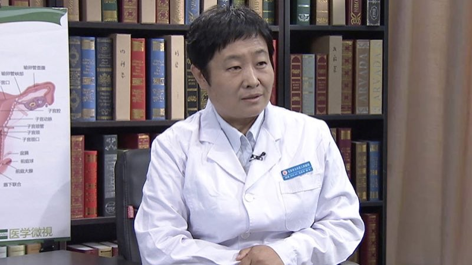

# 1.122 子宫脱垂

## 马秀华 主任医师

北京市大兴区人民医院院长 主任医师 研究生导师；

首都医科大学妇产科学系系务委员会委员；中国医师协会肿瘤防治规范化培训工作委员会常务委员；北京医学教育协会第五届理事会理事；北京市住院医师规范化培训全科医学科专科委员会委员；《中国医刊》杂志编辑委员会编委；北京市大兴区危重孕产妇救治中心主任及专家组组长；北京市大兴卫生首席专家。

**主要成就：** 2011年获第六届宋庆龄儿科医学奖；2014年获大兴区科学技术进步奖三等奖；2014年获大兴区科学技术奖软科学奖三等奖（两项）；2015年获大兴区科学技术奖软科学奖一等奖；以第一作者/通讯作者发表论文十余篇。

**专业特长：** 在妇产科临床一线工作三十年，始终坚持全心全意为患者服务的宗旨，率先开展妇科内镜检查和治疗、介入治疗，拓展阴式子宫切除术手术指征，简化子宫切除的手术步骤。作为重点学科带头人，提出“大妇产科”的概念。
