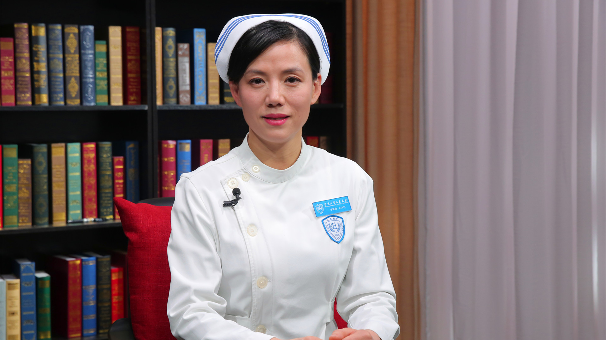

# 产褥期护理

## 李晓丹 副主任护师

北京大学人民医院护理部副主任 副主任护师 硕士生导师 医学硕士；

中华护理学会妇科专业委员会副主任委员；中国妇幼保健协会助产士分会助产教育专业学组常务委员；中国研究型医院学会妇产科学专业委员会母乳喂养研究与指导学组组长；中国留学人才发展基金会 母婴健康发展公益专项基金“喂爱工程”专家。

**主要成就：** 发表妇女健康及母婴保健相关论文20余篇，申请相关课题5项；致力于妇产科疾病围术期快速康复及母婴保健的研究，系列研究申请多项课题，获得多项基金的支持。

**专业特长：** 擅长妇产科围术期快速康复措施的实施、盆底肌锻炼及母乳喂养相关技巧，尤其对母乳喂养的规范有深入的研究。

## 产褥期就是“坐月子”吗？

（采访）产褥期指的是什么？跟我们说的月子期有什么不一样？

产褥期主要是指胎盘娩出以后，全身的各个器官，除了乳腺以外，恢复到正常未孕状态的一段时间，我们称为产褥期。

一般情况下产褥期是6周，为什么是6周时间？产褥期非常重要的一个器官的恢复就是子宫，子宫其实在产褥期的恢复过程当中，主要是指肌纤维的一个缩腹。肌纤维缩腹不仅仅是肌细胞数目的减少，更多的是一些蛋白要从肌细胞当中分解排出，这个过程一般情况下需要6周时间。

刚刚分娩结束以后，子宫位于脐下1-2指，有点硬硬的，能摸得到，大概是1000克左右。但是产后一周以后子宫就变为了500克，它的位置是在耻骨联合上2-3横指的地方，我们从体表是可以摸得到的。在产后6周的时候，子宫就回到了盆腔，恢复到了正常的50-70克。

所以产褥期，这段时间也是子宫和全身的各个器官恢复的一个过程。我们老百姓经常说坐月子大概一个月的时间，其实也是符合产褥期这个概念的，所以这个时间是相一致的。

（采访）所以其实坐月子和产褥期都是一样，要等到身体大概6周左右，完全的恢复到产前的一个状态。

对。

## 剖宫产或顺产后，产褥期（坐月子）怎样保持卫生，避免感染？

（采访）为什么说在产褥期要特别注意护理卫生？

产褥期我们应该先提到一个概念，我们经常叫产褥感染。产褥感染主要是指在产褥期的时候，生殖器官受到病原体的感染而引起的全身或局部的一个感染，其实这个感染的发生率还是非常高的，达到了6%左右，而产褥感染也是引起产妇死亡的主要原因之一。

引起产褥感染的一个非常重要的因素，就是个人的卫生护理不当，包括比如不能很好的去及时更换内衣内裤，不能很好的及时更换床单位等等，包括过早的性行为，可能都是引起产褥感染的一个非常重要的因素，所以我们提倡在产褥期的时候要格外注意自己个人的卫生。

（采访）如果像剖宫产有刀口，顺产可能也会有侧切，也会有撕裂的伤口，这些伤口会不会更容易感染？

在产褥期的时候其实我们应该注意什么？第一个对于剖宫产的产妇来说，回到家里边一定要观察剖宫产伤口上面的敷料是否干燥、清洁，一般情况下回到家中以后，剖宫产大概7天左右的时候伤口就应该愈合了。如果伤口到达7天以上的时候没愈合，甚至有一些疼痛、渗血、渗液，甚至流脓，要及时去医院就医。如果一旦发现了，比如说由于汗渍等其他原因，怀疑敷料有污染，就要及时给予更换，这是第一点。

第二点，产妇也要做好自我的观察和护理，比如说我们要看一下自己的伤口，首先体验一下疼痛感是否有增加，这是第一点。第二点我们可能也要知道有没有肿胀程度的发生，最后一点就是我们要看一下伤口是否有渗出液，比如渗血、渗液和流脓这种现象，如果一旦出现了，我们要及时就医，这是对于剖宫产来说。

对于顺产的女性来说，顺产结束以后大概2-3天的时间，这个时间段经常会有很多妈妈说，会有会阴的轻度肿胀，但是没有关系，随着时间的延长肿胀会逐渐恢复。在这个过程当中额外要注意的是什么？一个是要注意勤更换内衣、内裤，勤更换卫生巾，保持会阴部分的干燥、清洁。另外一点，在这个过程当中尽量减少盆浴，在产后的42天之内不要进行盆浴，洗澡的时候可以进行淋浴。

同时我们可能要观察一下恶露的一些发生情况，比如说我们要看一下恶露的颜色、性质以及量，尤其要注意下恶露的气味，不是腥味而是一种臭味，要及时就医，然后要观察一下是否有宫内感染或者是产后感染的发生。

（采访）剖宫产在七天之内敷料要不要更换？

不需要，七天之内是不需要进行频繁的伤口敷料的更换的，一旦发生伤口敷料，比如渗透了或者是可疑有污染的情况下，这种情况是可以进行更换的，但更换的过程当中，还是建议要到医院或者是社区卫生服务站，然后找专门的医护人员进行伤口敷料的更换。

## 剖宫产后怎样促进排气？

（采访）像剖宫产的女性是不是在剖宫产后是需要排气的？多久会排气？

我们提倡在剖宫产结束以后，在第二天的时候就可以下床逐步进行活动了。随着活动量的增加，慢慢的胃肠蠕动就会增加，逐渐就可以排气了。

（采访）如果一直没有排气怎么办？

如果没有排气首先我们要找一下原因，也就是说什么原因导致没有排气，我们要排除。比如要问一下产妇的表现和感觉，比如是否有严重的腹胀、腹痛这种现象的发生，排除一下是否有肠梗阻的发生，如果没有建议多下床走一走，可以喝一点点水，促进胃肠蠕动，加快排气。

现在有这种先进的研究方法说咀嚼口腔糖，也可以有助于术后胃肠蠕动的改善，所以对于产妇妈妈来说，在术后也可以咀嚼口香糖来帮助进一步的排气。

（采访）剖宫产可以在第二天就下床走动走动，也能帮助胃肠蠕动，能够帮她排气，嚼口香糖也有帮助。

对。

## 顺产后，产褥期（坐月子）怎样护理会阴部？出现水肿、侧切伤口，需要用药吗？

（采访）对于顺产的女性，在产褥期应该怎么样护理会阴部？

顺产的女性一般情况下在产后2-3天的时候可能会出现轻度、中度或者是重度的会阴部水肿，但是没有关系，这个水肿一般情况下是会随着产后时间的延长会逐渐减轻，水肿不用担心。

顺产结束以后，建议要及时更换卫生巾，及时更换内裤，保持会阴部的一个干燥，这一点是非常重要的，也是预防产褥期感染的一个非常重要的因素。同时在洗澡的过程当中，我们不建议盆浴，可以采用淋浴的方式来保持会阴部的清洁和干燥。

（采访）您提到会阴部会出现水肿，可能会有疼痛的现象，需不需要用一些药物？

一般大部分的女性，随着机体的恢复，水肿会逐渐减轻。当然有的时候可以用一些干预，比如说我们可以用一些硫酸镁来进行湿敷，让她尽快恢复到正常的状态，如果水肿比较严重的情况下，我们可以采用。

（采访）像顺产有侧切、撕裂，需不需要用一些药物？

一般情况下不需要，我们强调还是让她自然很快的进行恢复。但是如果一般情况下如果出现了这种会阴或者是侧切伤口的感染，我们才给予更多的干预。

（采访）一般像这种伤口多久能够愈合？

一般情况下，在产后3-5天左右基本上处于比较好的状态了，如果3-5天以后还是没有愈合，或者是更严重了，一定要到医院过来看医生。

（采访）有的妈妈会担心有伤口，正常的大小便会不会对伤口有一个感染？

因为我们强调在产褥期的时候，我们的妈妈还是要注意自己的个人卫生。小便和大便结束以后，还是建议我们的妈妈要进行一部分的清洁，但一定要注意在清洁过程当中不要污染了会阴部，尤其是在大便结束以后千万不要污染了会阴部，产后妈妈是可以进行一部分清洁的，可以清洗。

（采访）是不是用清水清洗一下就可以？

可以。

## 产褥期（坐月子）可以洗澡、洗头、刷牙、剪指甲吗？需要注意什么？

（采访）可能大家都知道，传统坐月子的习惯不能洗澡，不能洗头，不能刷牙，但是冬天可能还好，夏天可能就很难忍受了，到底产后能不能够洗澡、洗头、刷牙，还有剪指甲？

其实在孕期的时候体内蓄积了大量的体液，产后一周的时候体液会随着皮肤、汗腺进行排泄，我们经常叫做褥汗。褥汗一般情况下是在睡眠的时候比较明显，醒来的时候会出现大汗淋漓的这种感觉。其实对于产妇来说，她是非常不舒适的，尤其出完汗以后，皮肤会出现黏黏的状态，非常不舒适，尤其我们还强调一点要预防产后的产褥感染，所以我们建议我们的妈妈在产后是可以进行洗头和洗澡的。

但是在洗头和洗澡的过程当中，我们还是要强调一下，一定要注意保暖，也就是把室温调到一个舒适的温度，洗完澡、洗完头以后一定要擦干之后再从浴室出来，让我们的妈妈既感到舒适又非常安全，这是洗头和洗澡。

对于产后妈妈的刷牙，首先第一点，刷牙可以让产后妈妈口气比较清新，口腔也比较清洁，也增加她的食欲，促进身心的健康。但在刷牙的过程当中我们还是要强调，尤其是合并血液系统疾病，还有一部分妈妈可能会出现牙龈出血的情况，产后妈妈一定要注意选择软的牙刷，如果选择软的牙刷还是不能解决或者是不能缓解牙龈出血，可以选择漱口液来进行口腔的清洁。

对于剪指甲来说，因为我们要照顾宝宝，我们都知道新生儿宝宝的皮肤是比较稚嫩的，所以我们妈妈在照顾宝宝的过程当中要勤修剪指甲，以防止指甲会给宝宝的皮肤带来伤害，同时其实修剪指甲对于产后妈妈是没有任何影响的。

（采访）对于洗澡、洗头这个问题，只要保证浴室或者房间的温度适合，不要洗完澡可能马上会受凉，这种情况下是完全没有问题的。

对。

（采访）我们建议产后几天再去洗澡？

一般情况下，如果天比较热的时候，尤其是顺产的妈妈，顺产的妈妈在天气比较热的情况下，或者是汗液比较多的情况下，一周左右就可以了，没有问题的。一周以后随着产后时间的延长，洗澡和洗头的频率也可以增加。对于剖宫产的妈妈来说，因为腹部是有伤口的，在保护好伤口的前提下，也是可以在5-7天进行洗澡的，是没有问题的。

（采访）但是洗澡还是建议是要淋浴的，不要说是泡澡。

对。我们建议所有的产后妈妈在产后42天之内都要进行淋浴，不要进行盆浴和泡澡。

## 产褥期（坐月子）可以开空调吗？要特别注意什么？

（采访）如果是夏天比较热的时候，产褥期的女性能不能够开空调？

我们都知道其实高温对于一个人来说，在气温比较高的情况下，我们可能会出现这种大汗，汗液大量从皮肤排出，一个是可以造成产后妈妈的脱水，导致电解质的紊乱。另外一点，高温造成了产后妈妈情绪的烦躁，所以其实我们建议产后的妈妈要处于一种非常舒适的环境当中进行休息，一般情况下的室温建议应该是在25-27℃左右，也就是这个温度是可以的。就像北京来说，有的时候气温高达38℃，在这种情况下，建议屋子里边还是要开空调来降低气温。

在开空调的过程当中应该注意什么？强调一下不能直吹，也就是说我们控制室温可以通过空气流动的这种方式，比如说产后的妈妈在这个房间中，我们可以将客厅的空调打开，将冷空气引到这个卧室当中，就强调不要直吹就可以。

（采访）25-27℃这个温度其实是比较适合的，我们就注意开空调的时候不要直吹新妈妈就可以了。

是的。

## 产褥期（坐月子）应该怎么吃？可以吃过凉的食物吗？

（采访）夏天很热的时候，可能大家都会想吃个冰淇淋、吃点冰的西瓜，对于产褥期的女性可不可以？

对于产褥期的妈妈来说，饮食应该注意哪些？第一个就是要保证足够的热量，也就是说让妈妈的饮食要丰富，吃足够的蛋白质，比如说像鸡蛋、牛奶，还有肉类，包括鸡肉、鱼肉等等，要补充大量蛋白质和热量，然后以供妈妈产生更多的母乳。

另外一点，我们也强调在产褥期的时候要补充大量的蔬菜和水果，因为维生素对于妈妈来说也是非常重要的，可以吃一些比如说苹果、香蕉、葡萄都可以，蔬菜、芹菜、黄瓜都是可以的。

在吃水果和蔬菜的时候一定要注意什么？常温就可以了，不需要用热水烫，也不需要去煮，只要在常温的情况下，不是过凉就可以。因为如果过度用热水去烫和煮，会丧失一些维生素和一些矿物质，使得水果的营养就流失了，所以在吃的过程当中也要注意。

（采访）常温的蔬菜水果其实是可以吃的，没有问题的。

但是我们还是要强调，其实对于产后的妈妈来说，因为由于在生产过程当中大量的体力消耗，以及在孕期的时候实际上妈妈的胃口并不是很好，所以产后恢复是需要一段时间的。这段时间之内我们是建议妈妈不要吃过凉的食物，比如说像您刚才提到的冰棍、过凉的饮料，我们都是不建议妈妈去吃的，但是正常的水果，正常的蔬菜，在室温情况下是可以进行时食用的。

## 产褥期（坐月子）可以上网、看电视、看书吗？时间多久为宜？

（采访）产褥期的妈妈们可不可以上网、看电视、看书，这种活动？

大家其实都知道产后的妈妈，经历了长达十个月的时间孕育宝宝，还要经历分娩的这种非常痛苦、焦虑，产后妈妈角色转变过程当中，还有一个非常重要的角色就是照顾宝宝，所以我们的妈妈实际上是非常辛苦的。

同时在产后随着分娩的结束，妈妈体内的雌激素和孕激素会急剧的下降，在一周左右的时候，将恢复到正常的这种状态。所以无论是外因还是内因，都会导致我们的妈妈有的时候会产生一部分的情绪低落，比如说她会出现这种突然间的焦急或者是焦虑，或者过分担心宝宝的一些情况，其实都是她心理状态的一个改变。

所以我们建议，要通过不同的途径来帮助妈妈去分担或者减少她的这种不良情绪的发生。一般情况下，在产后我们是允许妈妈通过适当的途径去减轻她的压力的。比如说像您刚才提到的，上上网、看看电视、看看书，允许是允许，但是我们有要求，对于妈妈来说，每一次上网、看电视的时间不要超过一个小时，以不引起妈妈疲劳为主，这样既可以让她有一个很好的心理疏导的一个途径，又可以保持很好的休息状态，这样更有利于产后妈妈的恢复。

（采访）产后妈妈一定要注意休息，在休息的同时可以适当的比如上网、看电视，也能帮助调节一下心情，但是注意不要疲劳。

对。

## 产褥期（坐月子）就该卧床休息吗？

（采访）有的人觉得产褥期的妈妈应该少动，要卧床休息，这样的做法对吗？

一般情况下其实分娩结束6个小时以后，自然分娩的妈妈就可以下地走动了。下床走动有几点好处，首先第一点，通过活动可以让产后妈妈的恶露更顺利地排出体外，这是第一点。防止由于恶露的排出不畅而引起的产褥感染，这是第一点。

第二点，我们都知道其实产后的妈妈是属于血栓高发的人群之一，也就是说在产后的时候我们对于妈妈来说也要预防血栓的发生，预防血栓发生一个非常好也非常简便的方法就是下床活动。每次下床活动的时间尽量控制在半个小时左右，尤其在产后妈妈如果觉得疲劳了、累了，都可以上床进行更好的休息。

我们还是建议要多下床活动，一是让恶露更顺利地排出来，第二点预防血栓的发生。第三点其实在产后多下床活动还有一点就是可以促进胃肠的蠕动，让胃肠更好地蠕动，胃肠蠕动了以后食欲就会增加，产后妈妈的摄入量就会增加，对于妈妈的恢复也非常好，所以我们建议其实在产后的时候是可以下床活动，以不引起产妇疲劳为主。

（采访）产褥期内的妈妈下地活动，能不能去户外走走，活动活动？

我们中国一般情况下老百姓强调坐月子期间是不能出去活动的，但实际上在国际来说，更多的女性是可以外出活动的，其实随着理念的更新，产后的妈妈实际上在做好保暖，不要着凉的情况下，是可以适当的进行一部分的户外活动的。

（采访）前提就不要过久的活动引起疲劳就可以了。

对。

## 产后恶露多久排完？要特别关注恶露的什么情况？

（采访）产后进行下地活动，有一大部分原因可以帮助排恶露，恶露到底是什么？

恶露指的是在子宫复旧的过程当中，一些坏死的蜕膜组织，还有一部分血液，还有一部分少量的胎膜，经阴道排出。

在排恶露的过程当中其实分为三种类型，第一种叫做血性恶露，血性恶露更多的是以红颜色，还有坏死的蜕膜组织等为主，一般情况下血性恶露持续的时间大概在3-4天左右。

经历了3-4天的血性恶露就逐步转为我们叫做浆液恶露，浆液恶露的颜色大概是粉色的或者是淡红色的恶露，淡红色恶露主要持续的时间大概在7-10天左右，主要也是以坏死的蜕膜组织，非常少量的一些血液，还有一些宫腔的粘液，还有渗出液，还有少量的细菌。

浆液恶露紧接着就是白色恶露，白色恶露其实顾名思义颜色就是白色的，持续的时间也大概在2-3周左右。白色恶露主要有一些比如说宫腔的一些渗液，还有一些白细胞，还有一些细菌为主。

一共加在一起，恶露持续时间大概是4-6周，这个是整个排恶露的过程。

（采访）如果在产褥期恶露排的过多怎么办？

一般情况下我们强调，对产后产妇的健康教育过程当中，我们一定教会她回家要会观察恶露的颜色、性质和量，看看量是否增加了。如果一旦出现恶露增加或者是恶露的气味改变，提示会有宫腔感染的可能，所以让妈妈一定注意观察一下恶露量的多少以及气味如何，以便于及时观察是否有宫腔感染，是否有产褥感染的危险，及时就医。

（采访）在产褥期会排恶露，妈妈们能不能够用内置棉条？

内置棉条我们还是不建议的，甚至说不允许的，因为我们是通过很多的方法和手段，包括多下床走动来促进恶露的排出，因为如果一旦放置棉条，恶露将不会排出来。恶露当中实际上还有一部分是细菌，如果不能很好地排出体外，就会引起宫腔内膜的感染，最后造成产褥期的感染。

我们强调在产褥期的时候，一是要注意会阴部的清洁、干燥，注意个人卫生，另外一点就是要保持恶露排出的通畅，所以内置棉条是不能用的。

（采访）在排出恶露之后妈妈们需不需要对会阴部进行清理？

我们现在强调是应该每日进行会阴部的清洁，因为恶露的排出就像女性月经一样，它是一个非常连续的过程，相当于没有固定的时间去排出恶露的，所以建议产妇每天进行会阴部的清洁，保持个人的清洁卫生。

## 为什么产后要及时排尿？

（采访）为什么产后要及时排尿？

其实对于产后的妈妈来说，产后的排尿其实要预防尿潴留的发生，什么是尿潴留？尿潴留一旦发生以后，其实会对膀胱造成很大的影响，因为尿液在膀胱中蓄积，大于正常的容量，比如说800甚至1000毫升以上的时候，对整个膀胱的影响是非常大的。

所以在产后的时候第一点及时排尿是为了防止尿潴留的发生，因为一旦发生了尿潴留以后，可能要通过一些方法去解决尿潴留的并发症，比如说可以让产妇听听流水声刺激刺激，通过温水冲洗刺激排尿，如果不改善的情况下，我们可能应用一些药物，甚至可能会重新留置尿管，去缓解尿潴留的并发症。

所以让妈妈及时排尿，第一点是为了防止尿潴留的发生。另外一点也是非常重要的一点，膀胱位于子宫的前方，如果过大的一个膀胱，尿潴留的膀胱，就会影响到子宫的进一步收缩，产后子宫的收缩有利于更好的止血，来预防产后出血的发生，也就是说如果过大的膀胱可能会造成宫缩乏力，甚至子宫收缩不明显，会造成产后出血，所以及时排空膀胱，目的有两个，最直接的目的是为了防止尿潴留的发生，间接的目的是为了预防产后出血的发生。

## 产褥期（坐月子）为什么会出现尿失禁？该怎么办？

（采访）产褥期出现尿失禁是怎么回事？

产褥期的尿失禁，主要是因为在生产的过程当中，比如说第二产程的延长，或者是在生产的过程当中使用了助产的一些器械，或者是由于胎儿的胎头过大，对会阴部的肌肉有一个过度牵拉，使盆底的肌肉受伤，最后引起了产妇尿液不自主地、控制不了地从尿道流出，这个就是产后的尿失禁。

产后的尿失禁其实发生率也大概是在20%左右，也就是说在一百个人当中可能约有20%的产妇有不同程度的尿失禁，但是大家也不用过度担心，随着产后时间的延长，我们尿失禁也会逐渐改善，所以不用过度担心，会慢慢进行恢复的。

（采访）如果在产褥期妈妈们出现了尿失禁该怎么办？

建议所有产后42天的女性都要进行常规的规律的产检。在产检的过程当中，医生就会评估一下盆底的情况，如果出现了盆底肌肉损伤，或者是出现了这种尿失禁的现象，我们会根据产后妈妈盆底的情况制定一个会帮助产后妈妈恢复盆底肌的一个方案，去帮助产后妈妈恢复盆底肌。

一般情况下都包括哪几种方法？第一种是电刺激，通过电刺激的方式去刺激肌肉和细胞的本体感觉，唤醒肌肉和细胞的状态，让肌肉参与更多的锻炼的过程。另外一种就是我们经常叫生物反馈，通过医院的这种仪器反馈给产妇，进行更好的盆底肌的锻炼。所以我们强调，在产后的妈妈来说，产后42天的复查还是非常重要的，要按照医生的要求，常规的规律的到医院进行检查。

（采访）在产后42天复查的时候查些什么呢？

一般情况下产后的检查主要看一下伤口的恢复情况，如果剖宫产会看一下伤口恢复了没有，如果是顺产的女性，我们可能也要看一下会阴部是否恢复正常，同时我们也要询问一下产后妈妈在这42天当中恶露的情况。同时我们还要看一下乳房，看看母乳喂养的一个情况，产后42天主要复查的内容就包括这几点。

## 产褥期（坐月子）为什么会便秘？怎样预防？

（采访）如果产褥期的妈妈出现了便秘的情况，有没有办法可以预防？

其实产后的1-2天，很多妈妈可能会出现便秘的这种状况。便秘的主要原因可能跟胃肠蠕动减慢有关系。另外一点，产后的妈妈可能更多的时候会出现大汗淋漓，导致水分减少。还有一点，可能跟产后的妈妈饮食摄入量比较少可能有关系。

所以我们知道了原因之后，我们就有很好的预防对策了。第一点，我们要进行合理的水分的补充，保证体内所需要的正常的摄入量。第二点，我们要进行很好的膳食纤维的摄入，包括建议多食一些蔬菜，粗纤维的蔬菜，多吃一些水果来保证大便的通畅。

## 产褥期（坐月子）腰疼是怎么回事？怎样预防？

（采访）产褥期出现腰疼的情况是正常的吗？出现腰疼了怎么办？

应该说是有一部分妈妈可能会出现，尤其是顺产的妈妈可能会出现，突然间生产结束以后腰疼、背疼。产生的一个很大的原因就是因为在生产的过程当中，我们都知道顺产的时候，妈妈要用力才能将宝宝分娩出来，在用力的过程当中，有的妈妈可能不会使力气，有的时候可能会造成腰背部的酸疼，这是第一点。

第二点也可能跟分娩有关系，因为在分娩的过程当中宝宝的胎头，在对会阴部的挤压的过程当中，也会造成骶骨、尾骨的摆动，同时也会影响到肌肉的牵拉，所以造成一部分腰部的疼痛，其实腰背部的疼痛随着产后时间的延长会逐渐减轻。

由于产科的原因所造成的腰背部的疼痛，恢复起来相对来说用的时间比较短。在母乳喂养过程当中我们要注意哪些？因为母乳喂养时间是比较长的，在母乳喂养过程当中一定要注意妈妈的姿势，比如说母乳喂养的时候，在坐姿的时候，在后背部可以帮妈妈放一个靠垫，保护妈妈的腰部，当然我们也可以选择侧卧位去进行母乳喂养，这是第二点。

还有一点，其实我们也经常说，很多妈妈的腰疼可能也与钙质摄入不足有关系，所以在产后的时候我们还是强调我们的妈妈要适量进行钙质的补充。在饮食方面可以多吃一些含钙比较高的食物，比如说一些虾皮，还有一些其他的食物来补充钙质。同时我们也强调产后的妈妈其实是可以通过晒太阳的方式，增加钙质的摄入。

所以在产后的时候虽然会有腰疼，但是我们通过合理的方法去护理，我们会进行很好的预防的。

（采访）所以产后出现腰疼很有可能一个是因为生产过程中的损伤，这种恢复时间是比较短的，比较要注意的就是在哺乳期间一定要选择好这个姿势，然后有一个舒服的姿势，不要产生腰痛的这样的情况，还有一个就是可以适当补钙，晒晒太阳。

对。

## 产褥期（坐月子）怎样护理乳房？得了急性乳腺炎，按摩乳房管用吗？

（采访）产褥期的妈妈们应该怎么样护理好她们的乳房？

随着分娩的结束，我们非常提倡母乳喂养，早吸吮、早开奶、早接触，三早。

在母乳喂养的过程当中，我们强调非常重要的一点就是要让宝宝有效地吸吮，及时排空乳房，来预防一些乳腺炎的发生，这是一点。第二点，在母乳喂养之前的时候，要进行一些清洁，在清洁乳头的过程当中强调用清水就可以，不要用一些消毒用品，比如说酒精，刺激性比较强的物品来进行乳头的消毒。

在母乳喂养结束以后，我们的妈妈可以轻轻地挤出一滴到两滴的乳汁，均匀涂抹在乳头的周围，起到表面保护的一个作用。

以上几点对于妈妈来说非常重要，还有非常重要的一点，就是在日常生活护理当中，一定要选择棉质的、比较舒适的、比较软的、有一定支撑力的内衣，而且要起到支撑的作用，同时要勤更换内衣，保持清洁。

（采访）您提到及时排空乳房，能够有效防止乳腺炎的发生，如果出现了急性的乳腺炎该怎么办？

如果一旦出现了急性的乳腺炎，我们的妈妈也不用着急，一般情况下，通过宝宝频繁有效地吸吮，排空了乳汁以后，乳腺炎就会缓解。如果宝宝不能有效和及时地去吸吮乳房，我们可以采用手动挤奶的方式和利用一些电动吸奶器，利用器具来进行乳汁的排空，一般情况下只要乳汁一排空，乳腺炎就会缓解。如果乳腺炎不缓解的情况下，一定要及时就医。

（采访）网上有一些说要对乳房进行按摩，也能减轻乳腺炎的疼痛，这样的做法对吗？

乳房的按摩其实主要目的就是为了使乳汁更好地排出，根本目的就是为了排出乳汁，因为乳汁淤积是造成乳腺炎的一个根本原因，所以如果说有效的按摩，非常正规的按摩是没有问题的。但是强调一下，因为现在按摩的人也比较多，我们强调一定是经过正规培训的，这种按摩师是可以进行相应的按摩的。

## 产褥期（坐月子）可以多喝大补的汤、多吃鸡蛋吗？

（采访）可能很多产褥期的妈妈家里人都会给她做很多大补的汤，多喝汤，这样的做法对吗？

在分娩刚刚结束的时候，产妇的食欲并不是很好，我们都知道大量体力的消耗，再加上产后的妈妈还是处于非常疲劳的状态的，所以可能要在产后一到两天之内，家里人给做了很多大补的汤，可能我们的妈妈也没有食欲去吃，这段时间我们还是以清淡、有营养，包括蛋白质高的饮食就可以了，容易消化的。

在产后2-3天左右的时间，我们的妈妈就会进入一个生理性乳胀期，在这一段时间之内，我们还是强调一定少喝水、少喝汤，为什么？如果喝的水和汤过多，会加重乳房的肿胀，会给产妇带来痛苦，不利于乳房很好的去缓解。这段时间一定注意，生理性乳胀期一定少喝水，少喝汤。

当生理性乳胀期过了以后，乳腺导管打开了，乳汁开始逐渐产生了，我们的妈妈会感觉到乳汁每一天都会增加。随着乳汁的增加，我们的妈妈就可以进食一些汤了。

但是我们也强调在进食汤的时候是有一定讲究的，比如说鸡汤、鱼汤，还有猪蹄汤，一定是去了上面那一层油脂，一定要喝到大量的蛋白。同时在喝汤的同时不仅喝汤还要吃肉，因为肉当中含有的蛋白质可能要比汤中还要多，喝汤其实一是可以补充蛋白质，二是可以补充水分，有利于乳汁更多的产生，补充妈妈体内所需要的一些营养。

所以肉和汤要同时进食，撇去上面那层油，当然非常简便的一种方法，就是我们的妈妈可以拿一根吸管扎到汤的底部，吸着喝，这样表层的一些油脂就留下来了。

（采访）所以在产褥期是可以喝汤的，但是要注意在头几天有生理性乳胀期的时候，不要喝太多的汤，也不要喝太多的水，过了这个时期就可以喝一些汤，但是注意不要喝面上的浮油，同时也要吃一些肉。

对。

（采访）有的妈妈在产褥期的时候，一天吃两三个鸡蛋，吃这么多的鸡蛋，这么长的时间，这样做法可以吗？

在产后吃鸡蛋，其实为了补充体内所需要的蛋白，2-3个是可以的，像您刚才说的2-3个都是不多的，但是我所知道的是，可能家里的一些老人可能会每天要求产后妈妈吃10个左右，这个是比较多的。

因为鸡蛋是可以补充体内所需要的一些蛋白质，但是补充蛋白质还可以有其他的一些途径，包括我们现在生活条件好了，我们可以吃一些鸡肉、鱼肉，我们可以吃一些牛肉、猪肉等等肉之类的去补充蛋白，因为不同种类的饮食，会增加她们的食欲感，如果同一类饮食，可能会造成产后妈妈对食物的厌倦。

（采访）在产褥期建议妈妈们进行少食多餐吗？

可以。因为在产褥期，尤其在产后的早期，我们的妈妈的食欲并不是很好的情况下，但是为了保障妈妈体内所需要的一些蛋白质、水分以及维生素，等等所必需的一些物质，我们建议如果在食欲不好的情况下可以分餐，每一餐可以少量，但是可以多吃几次。

## 产褥期（坐月子）多吃大枣、多喝红糖水好吗？

（采访）在产褥期的妈妈们多吃大枣，多喝红糖水这样的做法对吗？

我们都知道其实大枣有补血的功效，红糖水还有活血化瘀、驱寒、补血等等，产后一周左右的时间，我们可以通过喝红糖水这种方式，去让产后妈妈达到一定中医上我们所强调的驱寒、活血化瘀，有利于恶露的排出，同时我们还可以补充一些糖分。

但是随着产后时间的延长，我们并不建议每天都要喝红糖水、吃大枣，因为红糖水一个是糖分增加，对于妈妈来说血糖影响也比较大。另外一点其实我们有的妈妈在产后的时候并不能很好的进行口腔护理的时候，对牙齿的损害也相对来说是比较大的，所以在产后的时候我们并不建议产后妈妈长时间的去吃大枣，喝红糖水，可以有所选择。在喝红糖水的过程当中，一定要注意自己牙齿的保护，注意自己血糖的控制。

## 产褥期（坐月子）一点盐都不能吃吗？

（采访）有的人会说在产褥期，妈妈是不能够吃盐的，这样对吗？

其实我们正常人的生理是需要盐来维持的，钠是人体电解质非常重要的一个离子，钠存在于盐当中，所以我们正常人来说是需要盐来维持正常的生理状态的。

所以其实对于我们产妇来说，吃一定的盐还是有必要的，也就是在产后的时候要吃少量的盐，但为什么说少量不能多？就是因为我们在孕期的时候，我们的妈妈体内蓄积了大量的液体，我们要通过产后这段时间排泄出去，我们都知道钠有一个作用，有潴留水分的一个作用，所以又不能食用太多盐，如果太多了，就会加重钠水潴留的这个风险。

所以产后来说既不能不吃盐，又不能吃太多，所以建议产妇以什么程度为准，以平时盐摄入量的稍微少一些为准，就是一定要有，但是不能过多。

（采访）正常可能少量的、适量的摄入一些，也有助于我们维持生理功能的。
对。

## 产褥期（坐月子）可以使用腹带吗？需要注意什么？

（采访）产褥期的妈妈们需不需要用束腹、束裤？什么时候用最好？

我们一般说剖宫产结束以后，我们建议妈妈还是要用一个腹带，为什么要用腹带？帮助妈妈在下床的时候减轻伤口的疼痛，也减少剖宫产伤口裂开的风险，其实腹带是有一定作用的。

随着伤口逐渐愈合，腹带其实就可以不用了，但是因为现在我们很多的妈妈可能想尽早恢复到孕前的形体状态，我们也强调其实在分娩结束以后是可以用腹带的，但不建议过紧。如果过紧可能会影响到整个脏器的血液循环，所以我们强调是可以用的，但是强调不要过紧，而且在夜间的时候不提倡使用。也就是说我们在使用过程当中一定是有所选择时间段，再一个就是要注意不要过紧。

（采访）腹带一个是帮助剖宫产的妈妈更快的恢复伤口，对于想尽快恢复身材的妈妈也是可以用的，但是就注意晚上不要用，不要用的过紧。

对。

## 产后多久可以进行性生活？多久开始避孕？

（采访）产后妈妈们多久可以进行性生活？

一般情况下我们经常说是产后42天复查以后，没有其他的情况就可以恢复性生活了，为什么？

跟我们经常提到的一个概念有关系，叫产后的复旧，也就是在产后复旧过程当中，子宫是需要一段时间去恢复到未孕状态的。子宫刚刚分娩结束以后，大小大概是1000克，在脐下大概1-2横指处可以摸到。在产后一周左右子宫的大小就恢复到了孕12周左右的大小，大概在500克左右，在耻骨联合上方可以摸到。在产后的6周子宫才会恢复到正常的状态，所以产后42天与产后子宫的恢复时间是吻合的，只有在所有的器官恢复了以后，才能恢复性生活，以防止产后感染的一个发生。

（采访）产后应该什么时候开始避孕？

对于产后如果没有母乳喂养的妈妈来说，一般情况下产后的10周左右的时间就会恢复排卵。如果有母乳喂养的妈妈，一般情况下产后4个月到6个月，这是平均时间，恢复排卵，也就是要来月经了。

但是也有的妈妈可能到产后一年可能才会排卵，也就是说这个时间是不定的，我们并不知道什么时候能排卵。所以在产后42天可以恢复性生活以后就要避孕，在避孕的过程当中，我们也强调要使用器具进行避孕，不能使用药物进行避孕。

## 高龄产妇产后抑郁风险高，产褥期（坐月子）需要注意什么？

（采访）高龄产妇在产褥期有没有需要特别注意的地方？

我们都知道产后妈妈的体力和精力会逐渐恢复。但对于高龄的妈妈来说，体力和精力的恢复的时间相对来说是比较长的。所对于高龄的妈妈我们要注意，一是要保证她的休息，因为生产过程对于女性来说是一个很大的体力的挑战，让妈妈一定有充分的时间去休息。建议妈妈一定要跟宝宝同吃同睡，什么叫同吃同睡？实际上在产后恢复这段时间之内，妈妈大部分的精力都放在了宝宝身上，同吃就是宝宝吃的时候，你也可以吃，宝宝睡的时候你一定要睡，因为我们并不知道宝宝什么时候就会出现哭闹，需要妈妈照顾，所以同吃同睡，是可以有效的保证妈妈，包括产后高龄的妈妈进行很好的休息，这是一点。

另外一点也有很多的研究，提示其实年龄越大的女性，发生产后抑郁或者是产后压抑风险是越高的。所以针对产后高龄的妈妈，我们可能要额外关注她的心理变化，包括比如说我们要看看她是否有情绪方面的一些波动，包括有没有没有任何原因的哭泣，可能有的时候会有这种比如说发脾气，甚至有的时候很失望这种现象，所以对于高龄的妈妈来说，可能我们更要注意一个是她的休息我们要保证，另外一点就是要注意她的心理变化。

## 产褥期（坐月子）可以减肥吗？

（采访）可能很多妈妈会觉得在怀孕期间长胖了，生产完之后就想尽快恢复以前的身材，在产褥期能不能够开始减肥？

我们一般情况下其实在产褥期的时候不建议过早或者是过快的进行减肥，原因就是因为我们都知道其实我们妈妈在生产结束以后，我们有非常重要的一个任务，要进行母乳喂养。本身母乳喂养就是一个减肥的过程，可以帮助我们的妈妈进行很好的塑形，因为母乳喂养要消耗大量的热量，如果均衡饮食，再坚持母乳喂养，一般情况下不用刻意减肥，就可以达到一个很好的恢复效果。

所以在产后的这段时间之内，应该是产褥期，我们不建议妈妈进行减肥，因为我们还要保证母乳当中的成分，因为我们母乳当中有大量的糖、蛋白质、脂肪，都需要通过妈妈饮食摄入来补充，所以我们要保证足够饮食摄入的情况下，坚持母乳喂养，就会保持很好的身材。

## 产褥期（坐月子）可以搬东西、跳绳、跑步吗？

（采访）产褥期的妈妈们能不能够进行一些运动？

产褥期的妈妈是可以进行轻微的运动的，包括比如说行走都可以的，包括少量的家务是可以做的，但我们不提倡做更多的体力性的家务，包括比如说搬东西，使腹压增加的劳动是不提倡的，因为腹压的增加可能会造成盆底功能障碍这种疾病的产生，所以早期的活动当中我们可以建议一些轻微的走路，进行少量的家务活动是没有问题。

但是我们在产后的时候可能还要强调一点，不建议、不提倡过早的进行腹肌的锻炼，还有包括跳绳，这种增加腹部压力的运动，因为在产后的时候存在盆底功能障碍性疾病的风险，为了让盆底肌能更好的恢复，所以在产后早期的时候，我们要减少腹压增加的运动，来进行更好的盆底肌的保护。

（采访）是不是像跑步、跳舞这种活动量比较大的都不建议做？

跑步还好，跳舞也还好，一般情况下我们不建议比如跳绳，还有一些负重比较重的器械性的练习，我们是不建议的。

## 哪些原因会引起产后抑郁？家属应该怎样做？

（采访）如果产褥期的妈妈出现情绪低落，或者有产后的一些抑郁，这种情况怎么办？

因为我们妈妈经过了大概十个月左右的孕期，经过分娩，分娩其实对于妈妈来说是很有挑战的，结束以后我们的妈妈是处于这种比较疲劳的状态，本身情绪就不是很好，再加上随着分娩结束以后，体内的雌激素还有孕激素的水平会急剧下降，没有激素的支持以后，本身就会造成情绪的非常低落。

疲劳再加上激素的问题，同时可能还有一些角色的转变，比如说我们的家庭，原来是以妈妈为中心，现在变成了以宝宝为中心，大家更多的视觉转移到了新生儿上，妈妈也会存在这种失落的感觉。

同时可能还有一些环境的影响，比如说我们经常说过热，还有妈妈可能在产后的时候会出现这种大汗，个人需要清洁，家里边人可能会有一些观念，认为不能洗澡等等一些原因，可能都会造成产后妈妈情绪的低落。

一般情况下都表现在什么地方？妈妈的表现是突然间的对这个事物不感兴趣了。还有的妈妈可能会有不明原因的哭泣，甚至非常严重的，有的妈妈可能会考虑到轻生等等。我们知道了原因，知道了表现以后，我们就知道如何去帮助我们的妈妈顺利度过这段时间。

第一点，从环境角度来说，我们要让妈妈处于清洁、舒适，气温也比较舒适的环境，要好好休息，我们提供给妈妈更多的帮助，可以帮助妈妈带宝宝等等，让她有更长的时间好好的休息，身体休息。同时我们的家庭，我们的爸爸们，还有双方的父母，要提供一些更多的关怀去关心产妇。我想以上几点措施都可以帮助我们的妈妈顺利度过产后情绪低落的这段时间。

（采访）如果有的妈妈产后抑郁的情绪比较严重，这种情况下是不是就应该要去寻求一些专业的帮助了？

如果轻微的情绪低落，包括哭泣，我们可以通过家庭关怀的方式，或者是改变一些以往的观念，会帮助妈妈很好的去缓解她的情绪，减轻她压抑的感觉，是可以缓解的。但一旦如果我们的妈妈出现了反复轻生的想法，或者是有其他一些冲动的举动，我们还是建议一定要去专门的门诊去看一下是否有产后抑郁的发生。

（采访）所以也在这里要告诉这个家属，还有老公们一定要注意产妇的心情，一定要多多观察，多多陪伴她们。

对，情绪的变化非常重要。

## 产后阴道松弛、子宫脱垂，怎样进行盆底肌功能锻炼？

（采访）有的产后的妈妈觉得有阴道松弛，有子宫脱垂，膀胱脱垂这种情况，应该怎么办？

如果经过门诊判断，有轻微的或者是有一定的阴道松弛，包括子宫的脱垂，前壁脱垂，后壁脱垂，等等这种现象的发生，我们可以有非常简便的一些方法能帮助产后妈妈进一步去恢复。这个方法相对来说非常简单，我们叫做盆底肌功能锻炼，也就是通过收缩肛门周围的肌肉，让盆底的肌肉进行一个很好的锻炼和恢复的过程。

如何去做？一般情况下盆底肌功能锻炼，我们首先第一点要找到盆底肌，也就是说我们要知道盆底肌到底在哪。盆底肌实际上就是在肛门，以肛门和会阴为中心的，盆底的这一块肌群。老百姓其实最简便的一种方法我们叫做抑制排气，因为这个肌肉跟普通的骨骼肌肉是不一样的，比如说握拳头或者是动动肌肉，我们都知道肌肉在什么地方，而盆底肌基本上是看不见的，所以我们只能通过这种感觉教给大家，比如抑制排气。

什么叫抑制排气？就是老百姓经常说叫憋住，别放屁，就是这个概念，有了这个概念，有了这感觉以后，就找到了正确的盆底肌肉。

找到了盆底肌肉以后怎么进行锻炼？分两种方法，一种叫快速收缩、快速放松，我们叫快收、快放，主要的目的是为了锻炼盆底肌肉的一个强度，也就是如果一旦出现了尿失禁以后，通过非常迅速的收缩盆底肌肉，起到关闭尿道的作用，抑制尿失禁的发生。这个主要是收缩盆底肛门周围的肌肉，收缩一秒钟、放松一秒钟，这是为一组收缩、放松、收缩、放松。如果连续能达到5组，我们视为盆底肌是非常好的，是没有问题的，如果达不到，3组及以下，就要去医院看一下，是不是出现了盆底肌肉的一个障碍。当然这个锻炼可以循序渐进，比如说刚开始只能做1到2组，后期能做3组，再后期能做4组，证明盆底肌肉在逐步加强，这是一种方法。

另外一种方法我们叫做慢收、慢放，什么叫慢收、慢放？也就是缓慢的收缩，收缩1、2、3、4、5，能数到5为一次。放松1、2、3、4、5，为一次收缩5和放松5，加在一起叫一组，连续达到5次以上，这样起到一个非常好的锻炼的作用。这个锻炼其实实际上是锻炼盆底的Ⅰ类肌纤维。

Ⅰ类肌纤维主要的一个作用是什么？起到了一个支撑的作用，也就是说盆底的器官处于正常位置，是需要Ⅰ类肌纤维去支撑它的，如果Ⅰ类肌纤维一旦受损，就会出现比如脱垂，因为它的支持功能降低了，器官就从正常的位置降到了其他位置，所以快速收缩和缓慢收缩可以交替进行。一天我们如果按照次数来说，我们要达到100多次，最好达到150次为好，如果按照时间来算，一次大家可以做10分钟左右，一天做3次，但这样是很难达到的，因为虽然盆底肌功能锻炼非常简单，但是也是非常容易疲劳的，我们建议以不疲劳为主，因为如果一旦出现肌肉的疲劳，其实实际上对于肌肉的恢复来说也不是很好，所以以不疲劳为主。

我们建议随时随地可以做，比如说我们的妈妈在照顾宝宝的时候可以做，在看电视的时候可以做，躺在床上的时候也可以做，随时随地甚至在交谈说话过程当中都可以做，所以以不疲劳为主就可以。

（采访）所以我们还是可以去医院正规地做一个检查，看看到底是不是有盆底肌的松弛的问题，然后再用正规的锻炼的方法，循序渐进的来锻炼盆底肌的肌肉。

对。

## 产后怎样选择内衣？

（采访）有的妈妈可能在产后觉得不穿内衣会比较舒服，在产后到底要不要穿内衣？穿什么样的内衣比较好？

产后我们还是建议妈妈要穿一些比较柔软，让妈妈觉得比较舒服的一些内衣，要起到一定支撑的作用，所以在内衣的选择方面，以棉质的比较柔软的为主。

为什么要建议妈妈穿内衣？穿内衣可以很好的预防产后或者母乳喂养结束后乳房脱垂，这个是非常重要的。另外一点，在母乳喂养期间，乳房的重量相对来说比非孕期的时候要重的，通过内衣的这种加固的方式会使得产后的妈妈舒适度会增加。
