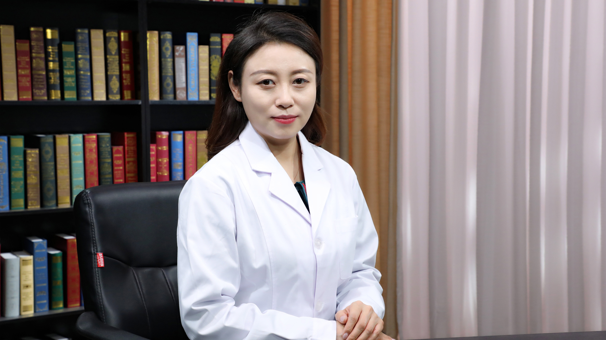

# 超声引导下消融治疗子宫腺肌病

## 张巍 主任医师

首都医科大学附属北京天坛医院超声科副主任 主任医师 硕士生导师 副教授 美国哈佛大学博士后；

中国医师协会介入医师分会超声介入专业委员会副主任委员；中国医师协会超声医师分会青年委员会副主任委员；中国老年医学学会超声医学分会副会长；中国医疗保健国际交流促进会超声医学分会常务委员。

**主要成就** ：主持国家自然科学基金面上项目、青年项目等多项国家级及省部级课题；发表SCI各类文章20余篇；参与编写《乳腺、甲状腺介入性超声学》《中国浅表器官超声检查指南》《中国介入超声临床应用指南》《超声医学》研究生规范化教材等多部行业指南和书籍；荣获“中国优秀青年超声医师”、 “国之名医·青年新锐”称号。

**专业特长** ：擅长腹部浅表系统超声诊断与介入性治疗。
