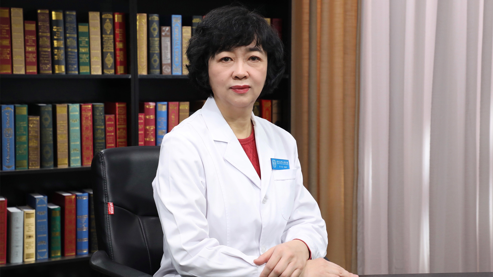

风湿病与妊娠
============

苏茵 主任医师
-------------

   1678365305367

北京大学人民医院风湿免疫科副主任 主任医师 教授 博士生导师；

中华医学会风湿病学分会常务委员；北京医学会风湿病学分会第七届委员会候任主任委员；中国医师协会风湿免疫科专科医师分会常务委员；中国研究型医院学会风湿免疫病学专业委员会副主任委员；中国医疗保健国际交流促进会风湿免疫病学分会常务委员；中国老年保健医学研究会风湿免疫病学分会第一届委员会副主任委员；全国卫生产业企业管理协会风湿病与分子免疫分会副会长；海峡两岸医药卫生交流协会风湿免疫病学专业委员会常务委员。

**主要成就：** 以第一作者和通讯作者在 *ARD 、Front
Immunol、Lupus、CLINICAL IMMUNOLOGY*
等相关杂志发表多篇SCI论文，主编或参编风湿免疫病相关专著30部；《中华内科杂志》《中华风湿病学杂志》《中华临床免疫和变态反应杂志》《ARD中文版》《BMJ中文版》编委，《医学参考报•风湿病频道》副编委；承担国家及省部级12项课题，基金总数超过1600万；参与获得高等学校科学研究优秀成果奖一等奖（科技进步奖）等12项。

**专业特长：**
长期从事风湿免疫病的临床诊治，主要研究方向为类风湿关节炎、系统性红斑狼疮、干燥综合征等自身免疫病的发病机制及免疫治疗；对常见风湿病及疑难病例的诊断和治疗具有丰富的临床经验，包括类风湿关节炎、系统性红斑狼疮、系统性血管炎、脊柱关节炎、银屑病关节炎、系统性硬化/硬皮病、抗磷脂综合征、骨关节炎及痛风等。
