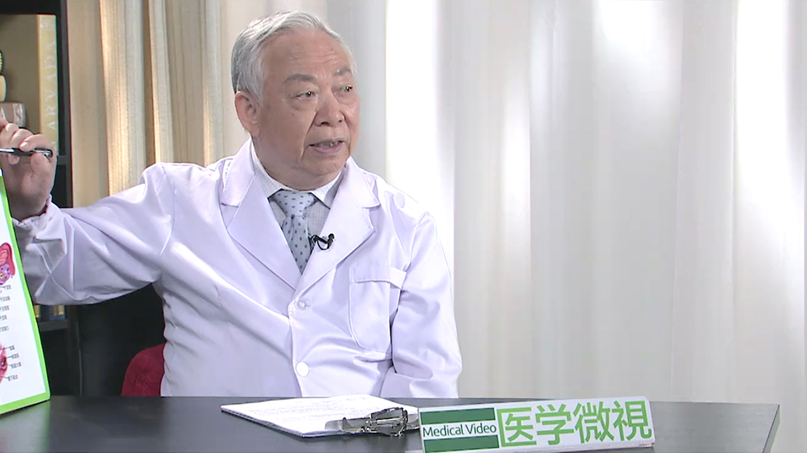

宫颈癌//曹泽毅教授
==================

曹泽毅 主任医师
---------------

   1678366198540

曾任卫生部副部长；曾任中华医学会常务副会长；

曾任中华医学会妇产科分会、妇科肿瘤学分会
主任委员；曾任华西医科大学校长；中国医科大学航空总医院名誉院长；北京大学第一附属医院妇产科名誉主任；香港大学、香港中文大学名誉教授；国际妇科肿瘤学会会员；瑞士妇产科学会名誉会员；美国哈佛大学医学院客座教授；美国M.D.Anderson肿瘤医院客座教授；《中华妇产科杂志》名誉总编辑；《国际妇科肿瘤杂志》资深编辑。

**主要成就：**
从医50余年，共培养了32名博士、硕士及2名博士后；主要科研领域是妇产科学、妇科肿瘤学；自1961年开始进行子宫颈癌的研究和临床诊断治疗，特别是广泛手术和淋巴转移的治疗方法；1982年首次报道女性生殖系统生理和肿瘤病理雌、孕激素受体结果；1996年首次报道通过以腹膜后间隙作为给药的途径进行淋巴结癌转移化疗；1999年主编的《中华妇产科学》获2001年全国优秀图书二等奖，《妇科肿瘤学》获2000年北京市科技进步二等奖；主编包括高等教材、妇产科参考书等专著10余部专著。

**专业特长：**
擅长妇科疑难病和妇科肿瘤，特别是宫颈癌的早期诊断、手术治疗与预防，对晚期、复发性宫颈癌的手术治疗有丰富的经验;各种妇科肿瘤手术和经阴道手术。
