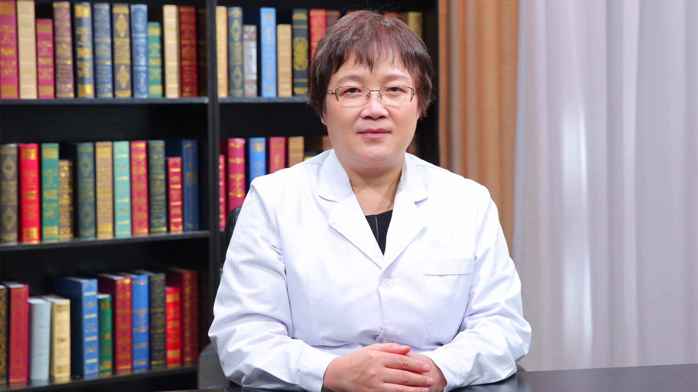

卵巢储备功能降低
================

沈浣 主任医师
-------------

   1678424445428

北京大学人民医院生殖医学中心主任 主任医师 博士生导师；

中华医学会生殖医学分会常委；中华医学会生殖医学分会临床学组副组长；中国性学会女性生殖医学分会主任委员；北京妇产学会会长；北京妇产学会京津冀生殖医学分会主任委员；中国优生学会生殖医学与生殖伦理学分会副主任委员。

**主要成就：**
在胚胎干细胞基础研究、生殖环境毒理、子宫内膜容受性等方面进行了深入的研究，发表SCI核心期刊论文50余篇，包括《Cell》《Stem
cell》等顶尖杂志。

**专业特长：**
作为北京大学人民医院生殖中心创始人，擅长不孕症、复发流产、人类辅助生殖技术、高龄女性及肿瘤患者保留生育功能的治疗。同时在生殖中心管理及质量控制等方面也有独到的造诣。
