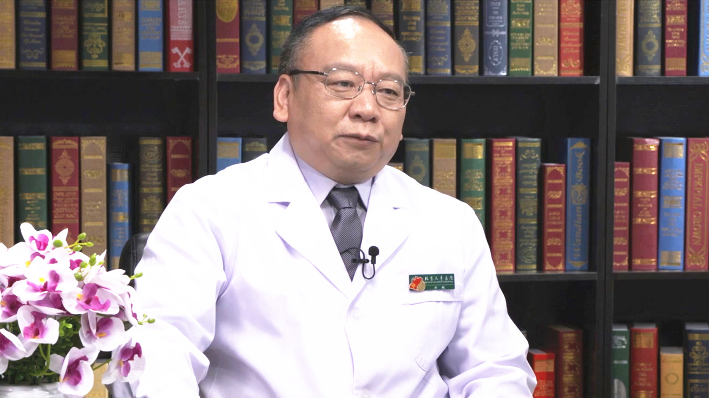

# 2.3 白化病

---

## 李巍 主任医师

首都医科大学附属北京儿童医院医学遗传中心主任 教授 博士生导师；

北京市儿科研究所副所长；中国细胞生物学学会理事兼细胞器生物学分会副会长；中国医疗保健国际交流促进会出生缺陷精准医学分会副主委兼秘书长。

**主要成就** ：发表SCI论文70篇，总影响因子约440，被引用3600多次；主编或副主编《医学遗传学（第3版）》《生物信息学导论》《遗传咨询》《产前遗传病诊断》等专著；主持中国遗传咨询网的科普和在线遗传咨询。

**专业特长：** 主要研究囊泡运输障碍导致的遗传代谢疾病的病理机制。

---

## 毛发、肤色偏白是白化病吗？白化病分为哪些类型？

（采访）主任您好，日常生活中我们可能会在街上碰到这样子的人，比如说他们的肤色和发色比正常人群要浅，甚至有一些头发可能呈现白色，那是不是这样的就是白化病？

对，白化病它相对来说在人群中如果是他不染发或者是说不戴假发是很容易看出来的，比较远的距离就能够看到他的毛发的颜色，包括眉毛，还有就是肤色，稍微近一点的时候就能够看到，他明显比我们一般正常的肤色要偏白。

（采访）导致白化病的原因是什么？（白化病）是遗传病吗？

对，主要是基因的突变，就是控制一些色素生成的那些基因，它发生了突变。

（采访）那么白化病分为哪些类型？各有什么不同？

一种的话就是看它累及的一些部位。大部分我们讲的白化病就是全身性的，包括毛发、皮肤整个全身都是白色，我们这种的话我们叫眼皮肤白化病，眼睛、皮肤就都累及的。

另外一种的话现在也有不少，只有眼睛，一般是家长有时候看怎么看到虹膜的颜色好像比较淡，或者开始也不太注意，有时候到了眼科做完一个眼科眼底检查的时候，发现他的视网膜的色素少，这一种的话它主要表现在眼睛上面，我们叫眼白化病。按照这个部位来讲的话，我们就一般分这两类。

另外的话还有一些白化病，现在就是说除了表现出色素以外，有一些类型的白化病，它会累及到一些其他系统，就像心血管那些，包括肠道，包括血液，甚至神经系统，累及到多个系统的我们叫综合征型的白化病。如果没有累及的我们叫单纯型的白化病。

所以就是分类的话大概有两种。一种根据累及的部位我们叫眼皮肤白化病和眼白化病，另外一种就叫综合征型白化病和非综合征型白化病，或者叫单纯型白化病，就是这样。

（采访）我国白化病的发病率高吗？

我们中国的人群跟西方包括不同人种里面调查的差不多，大概都是1/17000左右。因为这个病的话主要是隐性遗传，所以按照这个推的话，65个人里面就有1个他可能携带了白化病的基因，如果正好在人群里面婚配的时候，他两个碰到一起，就有可能生一个白化病的孩子。

---

## 导致白化病的原因是什么？是遗传吗？

（采访）导致白化病的原因是什么？白化病是遗传病吗？

对，主要是基因的突变，就是控制一些色素生成的那些基因，它发生了突变。

（采访）主任您讲到基因突变，它是怎么样导致白化病的发生呢？

基因突变它从本质上来讲，因为我们机体里面每一个基因都有自己特定的一个功能，比如说产生一个蛋白，那么这个蛋白它再执行一些功能。像我们这里具体来讲，这些蛋白就是来为了产生色素，它需要好多个基因在一起来工作，最后的话色素就能够正常地产生。

当你有一个基因突变了，那么它这条通路里面可能就少那么一个蛋白的功能，然后色素的产生通路就阻断了，所以这色素就产生不了。就是基因突变导致蛋白的功能缺失，然后就引起了色素产生的缺乏。我们产生色素的地方的话就是有一条通路，但是还有一个场所。通路里面的每个蛋白，任何一个蛋白它要是突变了的话，它也会产生白化病。

但是这个场所比如我要到某一个地方具体的来把大家放到一起来完成这么一个功能的时候，这个场所要是有问题，因为我们讲的场所就是在色素细胞里面的一种叫黑素小体，专门一个特殊的位置，然后它这里产生色素，如果这个地方它因为一些特殊的原因，它组装不起来，也会导致白化病。

（采访）其实基因突变不管是在黑色素产生的通路，还是它的场所，它都会导致白化病的发生？

现在我们主要是分这两类。但最近还有一种情况就是在比较大的压力下面有的时候他也会得白化病，小时候看过电影叫《白毛女》，可能就是一夜白了头发的，这种是属于大的压力，就是细胞它感受这种压力以后，在压力下的时候，它也会影响到色素的产生。

我们现在认为可能还有一种新的类型。这类当然它的最根本原因上有些也是跟这些基因的一些功能有关，但是可能它不像是刚才说的这两类，那一类的话可能是一种稍微特别的一种类型，就是我们经常讲的一夜白头。

（采访）后天获得的这种可能不是说是遗传基因导致的，可能是后天的压力导致它这个基因可能有新的突变或者改变这样子。

对，就是在这种条件下，有一些它也是涉及到有一部分是基因的突变，有一部分是它的功能在一些特定的条件下发挥不出来，然后也会导致这种现象的发生。

---

## 白化病是如何遗传给孩子的？健康人和白化病患者生育的宝宝会得白化病吗？

（采访）白化病是遗传病，它的遗传率有多高？

我们从现在所知道的来讲，算遗传率的话，主要是看它的遗传方式。遗传方式我们一般来讲的话，一般我们人的话就是23对染色体，1-22是常染色体，XY叫我们叫性染色体。就取决于这个基因，如果是在常染色体上，我们叫常染色体遗传。如果在性染色体上我们叫性连锁遗传。

这个遗传有显性和隐性。每一个基因都是一对，如果显性的话，一对里面的有一个基因它坏了，那就会出现这个现象，我们叫显性遗传。如果隐性遗传的话，就这一对两个基因都得同时坏掉，它这个时候才能表现出这些症状出来。所以按照这样分的话，我们分常染色体显性、常染色体隐性、X连锁显性、X连锁隐性，还有一个Y连锁遗传。所以这样的话一般我们按遗传方式分为这几类。

现在我们知道的白化病主要是常染色体隐性和X连锁隐性遗传。所以也就是说如果是按常染色体隐性遗传来推它的发生概率的话，夫妇同时都携带一个坏了的基因，他传给孩子，也就是生一个白化病孩子的概率是1/4，就是我们讲的25%。

但如果是一个X连锁的一般就是女性，比如说X连锁她不表现症状，但是两条X上面坏了一个。如果这个坏了一个的话，她传给男孩了，这个男孩就得病。那么这个概率的话是50%。如果是她生女孩的话，这个女孩不会发病，她传下去的概率也是50%，但是她跟她妈妈一样，只是携带，她不发病。

（采访）所以白化病主要是通过常染色体隐性基因和X连锁隐性遗传？

对。目前所知道的就是这两种方式。

（采访）主任，白化病的基因有可能是常染色体的隐性基因，如果是一个看起来正常的人和一个白化病的患者，他们生下的小孩会不会一定就是白化病？

就是说一个白化病的跟一个看起来正常的会不会生白化病的孩子，他这个情况是这样，这个白化病肯定是两个基因都坏了，然后取决于另外看起来正常的，如果他是携带者，他们这一对夫妇生的孩子的，有一半可能将来就会是白化病，有一半就是一个携带者。

如果是看起来正常的这个人的话，是没有携带白化病的基因，就是跟白化病患者本人同样类型的白化病基因，他的孩子就不用担心，最多也就是携带者。

---

## 白化病患者除了全身发白，还有哪些典型症状呢？

（采访）白化病患者他会有哪些典型的症状呢？

主要表现出毛发，包括我们眉毛、头发，还有皮肤，另外近看的话，我们眼睛虹膜的颜色，如果你再用眼科来做检查的时候，还有看到视网膜，它这个颜色里面都是有色素的，这些色素减低。

有的就是说只要表现出来的话，有一些人的话头发很白，全部白掉了，就是说生下来就这样。有一些稍微就是说还有一点色素，有点发黄，甚至还有个别的发红，就是这个颜色它会不太一样，但是它都会总的来说我们叫变淡。
包括肤色也是。

眼睛有的时候看起来有点像蓝色，或者是说灰色，对于来看白化病的话很容易鉴别出来，因为咱们黄皮肤、黑头发，但是在白种人里面也能看得出来，但是就要更细看一点。我们在国外也见过白人里面患白化病的，他肤色上面来讲，本来他就白，他的毛发的颜色本身就淡，但是他可能相对来说看起来还是不太健康的那种白色。

（采访）您提到眼睛就是视网膜它的色素也会减少，对他的眼睛的视力会不会有影响呢？

眼睛的色素减少的话，他会表现出来一种是畏光，因为在阳光直射下来以后，他色素少的时候，他就有一种畏光。

第二种的话，他是伴随着我们黄斑区感光的地方，有些视神经的细胞，他那个地方发育的不太好。发育不好，现在为止还不知道什么原因。

所以一种是色素减退，一种是黄斑区的发育不良，然后导致他的视力减退。所以大部分的白化病的孩子，就我们接诊过的那些孩子的话，多数可能都还不到0.1，有部分会好一些，轻重会不太一样，有的是可能0.5、0.8，大部分就是不到0.1，也可以说是一种先天性的视觉的减退那种。

（采访）所以白化病患者他主要的症状就是全身的肤色、发色的发白，然后他眼睛的颜色也会比正常人淡很多，他视力大部分都不到0.1？

对，还有一个就是你仔细看他，他要是走到你跟前的时候，你看到他的眼睛，我们多数看到的就水平震颤，我们讲就是他的眼球，他不自觉地，不是他自己要这么转，他不自主地就左右来回转，这个也会影响他注视一些东西，在视力上面也会影响他看东西。

我们自己也可以试，眼睛来回转，你肯定就是不能注视一个东西，你可能看不清图像，这也是可能影响视力的一个方面。

（采访）来回转他不能固定视线在某一个东西上面？

对。

---

## 什么是综合征型白化病？有哪些特征性症状？

我们有一类型的白化病叫综合征型白化病。它是两个捷克的医生，最早报道就用他那个名字Hermansky-Pudlak综合征，这一类的话一个表现就是他会有出血的倾向。我们有一个病人，他当时皮肤有个囊肿，做了个小手术，结果就止血很难止得住，压迫止血，压迫了好几个小时。包括有的时候可能是拔个牙，你要不知道的话可能会出血。

如果是临床上来了一个肤色很淡的人要特别注意，如果他是属于综合征型的情况的话，他可能会伴有出血的倾向。另外有一部分他可能会随着年纪增大的时候，他会伴有肺纤维化，可能多数的因为这个原因可能导致肺功能的呼吸衰竭，有的是到了中年的时候发生的比较早，他整个肺的纤维化就等于变硬了。然后影响他的呼吸功能。

我们讲的有一种叫最严重的，我们叫致死型的。就到了中年，一般三五十岁的时候，有的时候可能因为功能衰竭了以后会引起患者的死亡；还有一部分的话会导致这些心肌的肥大，肠道的一些炎症，就这一类的，这些就是伴有其他系统，就除了色素以外其他的症状。这一类我们叫综合症型的白化病。

比较多的就是从我们讲的大类来讲，就刚才说的Hermansky-Pudlak综合征，简称我们讲HPS。另外还有一个也是另外两个医生的这名字命名的，叫Chediak-Higashi综合征，我们简称叫CHS。

另一个综合征的话，除了我们刚才讲的眼白化病的那些症状以外，它一个很重要的就是他的免疫功能不太好，往往伴有一些免疫缺陷，就这些患者的话，他会经常容易发生反复的感染，这一类的我们叫综合征型白化病。目前主要是大类来讲有这两大类，但是它里头又分几个不同的亚型。

（采访）您提到综合征型的白化病，其实它是除了色素的问题，它还会伴有其他的可能器官的问题，您也提到主要是分为HPS还有CHS这两种大类型，但底下还有分不同的亚型？

对，尤其是HPS，到现在为止，我们明确的基因是有十个亚型，这十个亚型其中当时有四个亚型，是当时我自己在美国的时候我们鉴定出来的，在人群里面发现，在国际上是最先报道的这四个不同的亚型。

---

## 如何诊断白化病？需要做哪些检查？

（采访）白化病的患者应该怎么样来确诊？需要做什么样的检查呢？

我们一般根据色素的判断，看他的毛发的颜色、皮肤的颜色、虹膜的颜色，这个我们直接这样去看就能看到。但是为了深入一点的话，或者是做细一点的检查，我们一般这一类的要做诊断的时候，我们要做一个眼底的检查。

眼底的话就是看它的视网膜的色素是不是正常，第二点的话我们一般要做一个眼的光学相干断层扫描，我们简称叫OCT，这样一个实验的话，扫过去以后，在正常的情况下，能够看到黄斑的时候有一个凹陷。但是这些白化病的病人他就是个平的，看不到凹陷程度，这个指标是我们一个经常要用到的，作为眼白化病的一个诊断的指标。

另外一个就是眼球震颤，眼球症状这个虽然你可以描述，但是你要更精确的去描述，它有个机器叫眼震仪，就可以看。根据他来回转动出一个这样的波形出来，就像我们做其他的那些脑电图或者心电图，根据它波形分析，它属于正常还是不正常。眼科里面这种检查对诊断白化病来讲是要做的。

另外的话就是我们涉及到综合征型白化病的，因为它涉及到其他的系统。所以这一类的话就是说我们一般根据他自己主诉的一些方面，比如说他有比如肠道或者是呼吸或者是神经方面的一些症状的时候，当他有这些描述的时候，我们可能一方面有一些针对性的检查。

另外当我们有时做出来了基因，做出基因的时候，我们反过来再去跟他的一些临床的症状，就是说因为每一个亚型它不同的基因突变，它可能会出现的一些症状不完全一样。这个时候的话，我们可能就要有针对性的去检查，比如说相关的这些组织器官里面有没有一些病变。

最典型的一个就是HPS综合征型的白化病。一般我们在临床诊断的话，我们必须要做的一个就是要抽他的血去检查血小板，我们用电子显微镜去看，他的血小板里面的话就是有一种特殊的致密颗粒缺失，这是我们诊断的一个金指标。

有这个了，基本上就对于这种综合征型的白化病也就可以下个诊断。再结合刚才讲其他的一些症状，色素的一些表现、基因，然后我们把这些加在一起，对于白化病能够进行诊断。

（采访）白化病的患者是不是就需要做基因检测？

如果从临床来讲的话，最多就是给你描述说头发白一点，浅黄一点，灰一点，从分型来讲的话，也只能是说一点程度上的分型，现在因为亚型多，非综合征型的知道的基因有6个，综合征型的话有11个，还有一个就是眼白化病的，眼皮肤白化病有17个基因，有一个眼白化病的基因，所以加在一起是18个。

所以按照这样的来讲的话，就是我们现在在临床上的话，你要把这个去描述清楚，很难对应出来。它在临床表现可以是完全一样，但是坏掉的基因可能是不一样的。所以现在来讲就是我们在诊断白化病，目前国内外基本上还是以基因作为一个主要的分型的依据，然后说白化病那是哪一种类型，大概也都基本上按照这样来做它的一个诊断。

---

## 白化病需要与哪些疾病区分开？与白癜风有什么不同？

（采访）白化病需要跟哪些疾病鉴别呢？

白化病现在最容易问的就是说白化病跟白癜风有什么区别？临床上从诊断上来讲，我们要做鉴别，从老百姓我们一般来讲，他也会经常关注，就是我到底是白化病，还是白癜风。

这两个实际上区别起来的话，可能从发生的原因上，现在白化病主要是基因的突变。这个白癜风现在一般认为的主要原因是它的免疫，因为免疫的因素引起的就是白癜风。

但是在另外一个层面一个很大的区别就是白化病人一般生下来，甚至实际上就是说我们有时候在做诊断的时候，尤其是有些做产前诊断的时候，当我们用基因可能还不好下判断的时候，我们用胎儿镜，就是它到了一定的层面，长到一定大小的时候，他已经等于长出头发的时候，如果用胎儿镜就可以看到他的头发都已经是不正常了，就是白了。

也就是说生下来的时候，他只要有头发看到在皮肤它就已经是很白了。所以这一类的话就是我们白化病等于生下来就有。

白癜风一般都是随着年龄有一些比较早的，也有个好几岁就可以出现，但多数是青少年以后，大家现在一般认为是可能主要是一个免疫性的损伤，破坏了这些产生色素的细胞，然后是表现出某一块出现了一些白斑。

但是如果是说他出现的皮损范围很大，他表现看起来就是有个别的那些白癜风的人看起来全身也都白了，属于他的受损的面积会很大，这一类的话就是说也容易被误认为是白化病，现在主要是跟这个来区别。

另外有一类的话，我们可能有时会看到，也是一生下来就会出现一些局部的白斑，典型的有一些就像有一种叫额前白，额部这里有一块皮肤，就是额部的皮肤，还有他上面那些头发白的，其他地方都很正常。但是这个也是生下来就基本上也比较稳定，它也不会长大，也很难缩小，比较稳定的一种，大的一个范围，叫皮肤白斑病。

有的里面它又分了几种，也是不同的亚型，有一种叫斑驳病，斑驳病基本上就是以局部的一些白斑为主。

另外还有一种的话我们也是一种叫综合征，有一种叫Waardenburg综合征的。这一类的话往往就是说他还有表现面容上有点不太正常。

另外还有一些听力，有的部分还伴有先天性的巨结肠。这一类的就是说也是。但是他表现出来的话，就是说以很局部的一个白斑的点，这些它的原因也是基因突变。只是我们一般讲的白化病的这一类的话是我们前面一直在描述的这几种。所以如说从鉴别诊断来讲的话，我们有的时候一个是白癜风，一个是这种皮肤白斑病可以做一些，从归类上来讲，把它分的分成不同的类型。

（采访）其实白化病最主要就是跟白癜风和皮肤白斑病进行区别？

对。

（采访）但是白化病它是一个先天的基因突变导致的全身性的这样子的一个发白，白癜风可能就是后天由于免疫功能的缺失或者下降导致的，皮肤白斑病他虽然也是先天的，但是他表现的通常是局部的一个这样的症状。

对。受累的部位比较小。

---

## 白化病应如何治疗？可以根治吗？

（采访）白化病可以治疗吗？

白化病跟所有的那些遗传病一样，就是说到现在为止的话，根治是很难的。你要根治的话，就是等于要修复它坏了的基因。但是修复坏了的基因的话，从根源上来讲，也就是说从胚胎这个层面上，你给它修复，可能才能达到它的目的。

等他已经发育成人了，各个器官都已经发育完成，你要一个个去修复的话，像这种大面积的去修复比较难。可以针对性的，比如说我要把眼睛的视网膜的色素做一些恢复，或者像有些综合征型的白化病里面，我要针对他出血这个倾向去进行根治。

这个情况下因为现在在技术上发展已经有结合干细胞结合基因的治疗，按照这两个方案的话结合在一起的时候，现在在动物身上是开始在尝试做这种修复性的有针对性的某一种特殊的症状，来给他进行一些基因水平的这种修复。如果它效率能够达到的话，是可以达到一定层面上或者至少在这种局部的区域里面是可以达到根治的目的，因为我把这个坏的基因都已经修复好了。

除此以外的话，实际上现在用的基本上还是对症治疗。对症治疗的话，眼睛如果是说震颤比较厉害，他会因为这个影响视力的话，你可以做一个眼科的小手术，不让它来回的晃悠，所以它能够一定程度地注视，这样他会视力有所改善。但这个也是在一定的年龄内里面，可能相对到了一定的年龄的时候可能效果差一点。

还有人问就是说我这个视力弱了，我戴眼镜行不行？大家知道像这种是先天性的这种，不像我们近视眼那种，你可以通过矫正，它是因为整个视神经这条通路，它感受到这个视觉的通路有问题，所以你戴眼镜这种所谓我们叫助视的设备的话，可能效果也不太明显。有些个别的觉得说感觉稍微好一点。

但总体上来讲，我们最主要的话，他的皮肤因为色素少，他出去晒太阳的话，他就容易被晒伤。他没有抵御紫外的能力，所以他晒一段时间以后，他就容易皮肤发红，甚至产生日光性的皮肤炎。

这样的话我们一般建议像这种出去的话，他就穿长袖，穿那种深色一点的，让他不要接触太多的照射，然后戴上眼镜，因为他畏光，也刺激他的眼睛，很难受，所以实际上我们讲白化病，民间讲白化病，实际上也有个相对比较浪漫的一个名字叫月亮的孩子。

为什么？它就是白天如果是太阳这个光线下面很难受，就是又怕晒、又畏光。但是如果在月光下，他没问题，所以他晚上出来，我们叫月亮的孩子。

所以，首先是避免光线的过度照射，第二个的话如果是受到了照射损伤以后，你对症处理一下。视力这个方面，就是有一定的眼科方面做一些干预，但大部分都是稍微改善一点症状，因为它所有的遗传病都差不多，就是根治很难，多数还是对症治疗，我哪里有不舒服。

比如说我有综合征型白化病刚才讲的，如果有可能会导致出血，很难止血，你肯定要给他用点药，尤其是他必须要拔个牙或者做个手术，如果你不给他做这个处理的话，你可能手术下去又止不住血，你可能手术还没做，你这里血都已经出完了。

所以这个情况下要给他用点药，使他的出血的症状能够控制住，然后才能再去做这个手术。我们讲的这一类基本上都是根据他出现的一些症状，然后我们对症治疗。

（采访）其实对白化病目前来说是没有治疗的办法，也是不能根治的。但是在动物实验上我们已经有了一些进展。目前对于白化病的患者可能就是一些对症治疗，比如说对他的眼部的视力或者他眼球的震颤做一些治疗，或者说您提到的综合征型的白化病对其他的器官进行一些对症的治疗。

对。

（采访）对白化病患者视力的治疗，能够让他的视力跟正常人一样吗？

很难。现在看到的，因为刚才讲这个视力它除了色素，大家可能研究的比较多的，色素减少的原因大家还容易理解。但是实际上真正对白化病的病人到现在为止没有解释的就是黄斑的视神经发育不良为什么导致它，到现在为止好像还没有一个明确的说法。即使说你知道他可能恢复它一定的色素，但是完全恢复他的视力现在还是很难的。

---

## 白化病患者在日常生活中需要注意什么？被晒伤了怎么办？

（采访）白化病的患者最主要是出门的时候要注意防晒，那么白化病的患者可以涂防晒霜吗？

对，如果是白天他必须要出去，我们一般建议他用一些SPF指数高一点的抵抗，因为他本身自己皮肤上面色素很少或者没有，你就用一些指数高一点的防晒霜，相对比药可能会好，会有一些一定的作用。

（采访）是不是还是主要使用物理的防晒方法？

对，就是让他穿长袖，不要穿短袖，不要在外面长时间，一般都是这样的建议。

（采访）如果白化病的患者就是长时间的在日晒下被晒伤了之后怎么办呢？

根据晒伤的程度，有的时候可能就是轻度一点有红，有的是说晒得比较严重，我们有的时候也叫日光性的皮肤炎。这个一般来讲根据他晒伤的程度，最好的还是建议到皮肤科去，他根据晒的面积、轻重的程度，可能要涂一些霜，或者说如果你疼痛的很严重晒疼了，可能会用一些药膏给你缓解一下疼痛。

有一些已经引起了皮肤的炎症，可能还要就是说再加一些其他的药膏。所以这个的话一般到这个情况下，如果是就明显自己觉得是已经晒伤了，建议是到皮肤科去做一些专科方面做干预的治疗，缓解一下他的一些炎症或者是疼痛这一类的。

（采访）白化病患者，他日常可以化妆，可以用化妆品吗？

这个没有太大的关系，这个是跟我们正常人一样。

（采访）白化病的患者，他在日常生活在饮食上有没有需要注意的地方？

饮食也没有什么特别需要的，因为基本上他正常的按照生活的规律跟我们正常人一样，不涉及到什么哪些东西不能吃或者怎么样的，目前来讲就是说注意防晒，避免强光刺激以外，饮食和其他层面上都跟我们正常人一样。

（采访）所以白化病患者其实生活是饮食跟正常人都一样，只不过是他出门的时候要特别注意防晒？

对。

---

## 白化病会传染吗？

（采访）白化病会不会传染呢？

不会。因为这是一个基因的突变，我们一般讲传染是属于一些病原的角度，这个我们有时容易混淆，有时候传染和遗传都叫传，遗传它是上一代传到下一代叫遗传，父母把坏的基因传给他，这是叫遗传，但这个不叫传染。

传染一般是说我们一家人及之间，比如说有个病原，一些传染病，比如说我们到了冬天感冒，感冒的病原，在一个办公室，大家可能互相传染。我们讲的传染，从这个层面上来讲，白化病没有，不会是说我跟一个白化病患者在一起，结果我也被传染上白化病，这个不会。

---

## 白化病能预防吗？

（采访）白化病能不能够预防？

因为他是基因的变化，基因突变了。基因突变这种事件的话，主要是遗传下来的，也就是说你要说预防的话，我不从父母遗传坏的基因，理论上它是可以，是属于预防白化病的发生。

如果从这个层面，首先要明确家庭里面，因为有18个白化病的基因，到现在为止已经知道，当然从人群里面来讲，应该还不止这样，我们现在从研究的角度，还在找一些新的白化病的致病基因。

那就像现在知道的这18个，一个家里面不会说是都出现，比如说这一个家里面，他只要出现某一个，你先明确这家里面是哪一个基因可能有突变，就是夫妇双方知道他基因的问题。

如果自己不能够把遗传的模式或者这种方式都很清楚的话，现在医院里面都有个遗传咨询这样的门诊，你可以去咨询这些专科的专家，然后问清楚就是说我这个情况是不是遗传，遗传的概率，然后明确是哪一种类型，这些类型里面将来可能是什么样的一些表现或者是一些后果，这个是他需要做一个全面的了解。

只要你这个基因明确了，夫妇双方又已经都明确是哪一个基因，比如说这个人坏了这一个，另外一方坏的另外一个，然后当她怀孕了以后，一般来讲的话，大家现在比较多的话就是在16-20周取羊水，羊水里面的话，我们分离出胎儿上面的来源的细胞，然后去做一个基因的检测，然后就可以判断到底是怎么遗传的。

就是说一般要得病的话，就是要夫妇双方两个坏了的都遗传到他身上，他才会犯病，遗传了一个，就是夫妇双方的某一个他不会犯病。还有一种情况就是两个都不遗传。我们也见到过一些这样的例子，就是本来夫妇都带了一个坏的，一个好的，两个人正好把那个好的就给这个孩子，所以他就不用再担心什么。

所以我们从基因的检查结果，我们把这些情况，完全正常，还是携带了一个，还是说携带了两个，这种情况都能够分析得出来，根据这个情况，我们给这对夫妇你自己再决定。

如果是刚才说的，我要避免再这样遗传下去的话，他根据这个结果的话不想让孩子出生。我们现在讲的预防的话，就从预防他出生这个角度看，可以说用产前诊断这个方法。

（采访）所以预防可以在比如说妈妈怀孕的孕中期，就大概16-20周，她做一个羊水的检查，看一下孩子是否携带了不好的基因？

对。

---

## 什么情况下需要做白化病的优生预防？

（采访）什么情况下需要做优生预防？

因为有些亚型的后果，甚至到了中年他都致死，这种来讲的话，就是属于严重型的。现在我们这个遗传病的角度来讲，对于那种严重类型的话，尤其是生过一个这样的孩子，他肯定不愿意再生一个，这是一种情况。

对于那种相对轻一点的话，取决于这个家庭，他们夫妇自己的生育计划。他觉得可能他对这个病了解，他也知道可能孩子生下来以后，将来皮肤毛发会白，视力会弱，但是他觉得我可能好不容易有这个孩子，我就是知道了，我可能也愿意让他生下来。

所以医生这个角度只是告诉他们这个孩子是哪一种情况，完全正常，还是说携带，还是说患病，你自己再来做一个取舍。我们也会告诉你是哪一种不同的亚型，他这种亚型将来的后果，就是说多少岁的时候，可能会有一个什么样的情况。我们从医生角度把这些信息尽量告诉给他，然后他们自己再来做一个决定。现在所有的产前诊断都基本上是按照这样一个流程，要不要这个孩子，都是由夫妇自己来决定，医生只是告诉他们信息。

（采访）对白化病患者产前检查，医生会让父母双方明确孩子可能以后是个什么样子的情况，但其实决定权还是在父母手里？

对。

---

## 我国对白化病的研究进展是怎么样的？

（采访）我国对白化病的研究的进展是怎么样的？

白化病现在世界各地加在一起，已经知道有18个基因，在我们现在接诊过的这些白化病中，可能95%左右是这18个基因导致的，基本上都能给它分分类，要么是这个，要么是这个。

也就是说现在我们手上的话还有大概5%的新的白化病基因，就是你查完这18个基因还没有突变，但是他表现临床诊断也可以诊断出白化病，也就是说现在一个研究的角度来讲，就是要利用这些资源来发现一些新的白化病基因，也就是这18个以外的别的白化病基因，所以这是从我们现在做研究的角度来讲，这是一个方向。

在过去这18个基因里面，我们中国人实际上贡献了一个，当时是一个中国的家庭到了我们这边，来了以后的话，我们通过基因的分析，找到了一个新的我们现在叫OCA6的这样一个基因。这个基因是在我们中国人里面，由我们中国的研究组在国际上首先报道，我们报道完了以后，后来法国它们有一个组，他很快在他的群体里面用基因去做他们的一些筛查，他们也找到好多个病人。

到现在为止，我们在中国人里面，因为后面我们还发现了其他几例，就是说这一个的话是在我们中国人里面发现新的一个白化病的基因，这是一个方面。

另外一个方面，研究的话，一个方向就是要研究它的机制。就是说为什么基因突变会导致白化病的发生，要么是它产生色素的途径，要么就是产生色素的场所。最近我们还发现一些基因突变以后，在细胞里面它产生色素的这样一个过程，它要受一些其他因素的影响，比如说压力的这种影响，在这个层面上的话，可能现在我们也在关注。

第三个研究的趋势就是我们现在在动物身上去做，能不能把坏了的基因，我给它修复掉。如果将来这些方法又很安全，也效果也很好，有可能会逐步会用到治疗患者的身上来。

---

## 两个白化病的患者生出的小孩就一定是白化病患者吗？

（采访）如果是两个白化病的患者，是不是生出的小孩就一定是白化病了？

一般在白化病的群体里面，大家可能最担心的是这个问题，觉得两个白化病的一对夫妇一定是生一个白化病孩子。

但这个里面就是我们现在讲的基因诊断它的作用就在这个地方，通过基因诊断它分成已经知道的18种亚型，只要不是同一种亚型的，这对夫妇之间理论上都不会生白化病的孩子。如果是同一型的，肯定是一个白化病的孩子，就是这样的。

（采访）如果这两个白化病的患者，他不是同一个亚型，他可能就会生出一个正常的孩子？

对。我们有这样的例子，这对夫妇，我们做出一个是OCA1型，另外一方是OCA4型，结果这孩子在产前我们就已经判断出来是没有问题，生下来以后他肯定是携带者，他表现是正常的。

---

## 孕期如何检查胎儿是否患有白化病？通过试管婴儿可以生下不得白化病的宝宝吗？

（采访）产前诊断，可以看出这个孩子是不是正常，有没有坏的基因，但是这个时候妈妈已经是怀孕了，有没有更早的办法？

这个也是一个很好的问题，现在也经常会有，包括有些家庭里面他生了一个白化病患儿以后，他有25%的概率还会再生。我们碰到过有个家庭生第二胎、第三胎，甚至第四胎，他都是白化病。当然我们讲的概率是个数学上的概率，但是对于实际发生来讲的话，这样看起来好像是连生四胎。

如果我们从产前诊断的角度，一般是16-20周或者是四五个月的时候取羊水，但这个时候毕竟是已经经历过一个怀孕的过程，如果诊断出来了以后，她可能不想要，要选择去流产的话，可能毕竟还是有一个怀孕的过程。我们做白化病的产前诊断的话，这个是我们常用的一个节点。

但是如果是说白化病还有5%的基因没查出来，但是这个家庭里面可能已经有白化病人了，像这一类人的话，基因都不知道的话，应该再往后挪一点。有时候20-24、25周的阶段，她羊水比较多的情况下，现在有一个胎儿镜的方法，进去以后就用镜子去看胎儿的头发，如果是白色的，可能判断可能他是个白化病。这个等于是对羊水检查的一个补充，这种情况下我们也会用。但是这个技术相对来说操作起来难度会更大一些，得到一些比较有条件的医院去做。

另外一个问题，试管婴儿技术应用的话，实际上是可以借助这种辅助生殖的技术手段，我们现在一般讲叫第三代试管婴儿。第一代、第二代是我们为了解决不孕不育，用不同的方式去做第三代试管婴儿的技术，实际上通俗一点就是选择胎儿，它是用遗传学的方法。

如果是说用体外试管婴儿的方法，同时可以得到好多个胚胎，得到好多个胚胎的时候，我们用遗传学的方法一个一个去检查，每一个去检查完了以后的话，挑没有问题的，然后再把他移植回去，让他发育成一个正常的，就这个来讲可以更早的来保证这个胎儿是没有问题。

所以这个技术的话，现在因为国内试管婴儿的技术开展的也比较普及，现在如果是对于这些家庭来讲，这是一个选择。

---
