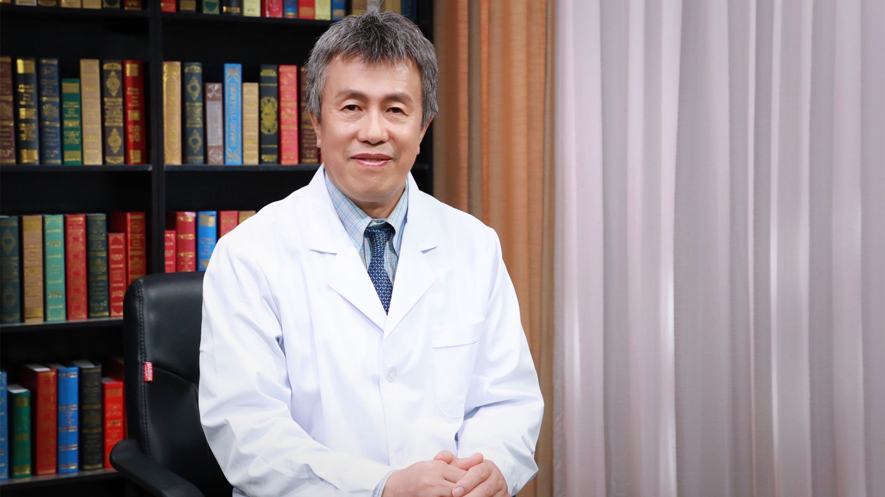

# 2.11 胆总管囊肿

---

## 李龙 主任医师

首都儿科研究所附属儿童医院新生儿外科主任 普通外科主任 主任医师 教授 博士生导师；

国家卫生健康委员会小儿内镜外科专家委员会主任委员；国际小儿腔镜外科学会亚洲区主席；*Pediatric Surgery International *杂志编委；《中国微创外科杂志》副主编。

**主要成就：** 发表SCI论文140余篇，累计影响因子300多分；获得国家科技进步二等奖、北京市科技进步二等奖、中华医学奖、华夏医学奖等奖项；承担国家“十一五”科技支撑计划课题、卫生行业专项和北京市科技攻关等重大课题。

**专业特长：** 擅长胆总管囊肿、胆道闭锁、肛门闭锁、巨结肠、门脉高压、肝母细胞瘤和神经母细胞瘤等儿童疑难复杂疾病的诊断和治疗，尤其是对儿童肝胆畸形和肛肠畸形有深入研究。

---

## 胆总管囊肿（先天性胆管扩张症）是怎么回事？

（采访）主任，先天性胆总管囊肿就是孩子的胆管肿起来了吗？

胆总管囊肿也就是胆道扩张成球状，所以看起来像一个囊肿一样，所以一般老百姓就把它称之为先天性胆总管囊肿。实际从根本上来讲，它是胆道的扩张，扩张成球状或者梭形，不同程度的扩张，对外观的一种描述，叫胆总管囊肿，又叫胆道扩张。

（采访）胆总管囊肿实际上并不是多长了一个囊肿，而是胆总管扩张成了像囊肿一样的东西。

是这样的。

（采访）主任，正常的胆管形态是什么样的？

正常的胆道系统“肝胆相依”，肝胆是连在一起的，胆道属于肝脏的排泄系统，就好像楼房建筑的下水道一样，把肝脏代谢的解毒物质，通过胆道，刚开始是毛细的、细小的胆管，逐渐汇合成比较粗的胆管，最后汇合到肝外，形成一个总的，所有肝管的聚集地，就叫胆总管。它就像河流的细小分支，最后汇合成大分支，最后汇合成江，汇入大海，是一样的机制。

（采访）这个胆总管就是连接着肝脏，承接着肝脏排泄废物的一个总分支。

对。肝脏的代谢物质，比如有一些胆汁酸、胆红素，还有一些排泄的有毒物质，经过肝代谢之后，都经过这个“下水道”，经过胆道系统排泄到肠道。

（采访）主任，先天性的胆总管囊肿的发病率高吗？

胆总管囊肿发病率很高，是最常见的胆道畸形。

这个病有个特点，白种人和黑种人的发病率很低，基本是1/10万；黄种人的发病率较高，在中国，我们亚洲人基本上1/5000-1/3000，我们国家每年有1.5万-2万胆总管囊肿的新生儿出生，所以我们国家的发病率还是很高的，是小儿外科医生经常治疗的常见疾病。

---

## 胆总管囊肿（先天性胆管扩张症）是什么原因造成的？

（采访）主任，先天性的胆总管囊肿是什么原因造成的？

首先它是先天性的，在胎儿发育过程中形成的：

第一个原因就是胆道梗阻，胆道梗阻之后，胆汁排泄不畅，导致梗阻近端的胆道扩张。就像一个气球一样，如果你吹了气之后，不把口扎上的话，它不会形成这种球状的、囊肿样的外观，所以第一个原因就是胆道远端或者说胆总管远端的梗阻。

第二个原因就是胆道壁薄弱，像个气球一样，大家想象一下，如果壁不薄、没有弹性的话，是硬的，比如铁管，你吹的话，再大的压力，它也不会变成球状，所以第二个原因就是胆道壁薄弱，这种薄弱往往在胎儿发育过程中的早期，如果这个时候胆道造成梗阻，形成压力之后，很容易就会造成薄弱的胆道形成囊肿状的扩张。

第三个原因，也是大家近几年才意识到的胰胆合流异常。正常情况下，胆总管和胰管都汇合在十二指肠腔里面，所以胆汁直接排泄到十二指肠，胰液也直接排泄到十二指肠肠腔里面，二者之间井水不犯河水。

但是如果二者提前汇合了，汇合成一个腔道，变成一个“河道”了，这个时候胰液和胆汁就会混合在一起，胰液就会流到胆道里面，胆汁也会反流到胰管里面。这样它的流量就会增加，流量增加之后就会使胆道扩张，同时因为胰液里面有很多酶，蛋白酶、脂肪酶、淀粉酶等等，它对胆道壁有一个消化作用，这样就使薄弱的胆道壁“雪上加霜”，进一步形成胆道的扩张。

为什么胆总管囊肿的病人会合并有胰胆合流异常？再往前推的话，就是在胚胎的早期，胆总管“发源”，就像树分叉一样，“发源”的这个地点靠远了，离胃或者胎儿的口远，就导致了胆道被拉长，形成了胰胆合流异常这种情况。

（采访）先天性胆总管囊肿的主要原因之一就是它的远端有梗阻，远端梗阻是什么原因导致的？

第一个原因就是在发育过程中，它是不均匀的，有扩张的地方，也有狭窄的地方，但是狭窄是发生在之前的，狭窄最常见的部位就是胆总管的远端，和胰管交接的这个地方，这是狭窄最常见的地方。

第二个原因就是胆总管和肝总管，在肝门交接的这个地方，容易出现狭窄环，为什么这两个地方容易出现狭窄环呢？现在的研究基本就是说，还是与胚胎早期肝脏发育，向消化道的远端起源，就使胆总管变长。

肝脏，我们都知道，如果这个起点远了，而肝脏最后要定位在膈下，它的距离就会变长，那就是说在胎儿早期的时候，胆道就要受到牵拉，越向远、越牵拉，就像口香糖一样，娇嫩的胆道，受到牵拉之后，在拉力的作用下，导致它粗细不均，所以在接口的地方，就是胆总管和胰管交接的地方，这是一个薄弱的地方，受到牵拉最容易导致狭窄。

再一个就是胆总管和肝总管交接的地方，受到牵拉也容易导致狭窄。所以它的根本原因还是肝芽发生的部位太远了，导致胆道受到牵拉变长、变细，粗细不均导致的。

（采访）主任，胆总管囊肿和遗传有没有关系？

这个病目前来讲，经过国内外小儿外科医生的共同努力，一直试图探索它的遗传基因，但是一直没有找到。

从临床表现来看，它的遗传特性并不强，因为好多比如父母有胆总管囊肿，而他生的孩子是健康的，或者这个孩子表现为胆总管囊肿，他的父母都是正常的，所以在这种情况下，从遗传学的角度来看，它没有遗传性，但是为什么黄种人比白种人多呢？可能还是与我们的基因结构有一定的关系，但是这个原因目前还没有明确。

（采访）胆总管囊肿和基因有一定关系，但是它并不是一个遗传病。

对，可以这么理解。

（采访）主任，胆总管囊肿的原因有可能是胆管的远端有梗阻，或者是胆管本身长得太薄弱，或者是胆液和胰液可能提前汇合，流量有点太多。放到每一个病人个体身上，是三种原因都有，还是说可能只是其中一种原因？

这三种原因，如果同时都有，这三个严重的因素叠加在一起，就会导致严重的扩张。从临床表现来讲就是囊肿特别大，在胎儿时期，很早的时期，就可以表现出来。

如果这三个因素当中有两个因素，那它的表现就是比较轻型的。比如胆总管远端梗阻的程度严重，胎儿时期就会表现出囊肿，甚至巨大的囊肿，在婴儿的时候，出生之后就表现出症状了。

如果远端梗阻比较轻，不是很严重，胆总管扩张的直径就不会那么大，可能在成人阶段，或者在青少年阶段，在接近长到成人这个时期才被发现。

所以现在胆总管囊肿，大约20%左右是在成人中发现的，80%左右是在小孩或胎儿发现的，而35%是在新生儿出生之前，或者出生后1个月之内发现的。这就是你刚才提到的这三个因素，胆总管囊肿严重程度与是否同时叠加在一起有关系。

（采访）就是说放到每一个患者身上可能三个因素都有，但也有可能只是有其中一个。

对。

---

## 胆总管囊肿（先天性胆管扩张症）和遗传有关吗？

（采访）主任，胆总管囊肿和遗传有没有关系？

这个病目前来讲，经过国内外小儿外科医生的共同努力，一直试图探索它的遗传基因，但是一直没有找到。

从临床表现来看，它的遗传特性并不强，因为好多比如父母有胆总管囊肿，而他生的孩子是健康的，或者这个孩子表现为胆总管囊肿，他的父母都是正常的，所以在这种情况下，从遗传学的角度来看，它没有遗传性，但是为什么黄种人比白种人多呢？可能还是与我们的基因结构有一定的关系，但是这个原因目前还没有明确。

（采访）就是和基因有一定关系，但是它并不是一个遗传病。

对，可以这么理解。

---

## 胆总管囊肿（先天性胆管扩张症）有哪些症状？

（采访）主任，胆总管囊肿都会有哪些表现？

胆总管囊肿的表现，首先表现的是胆道梗阻，梗阻越严重，他的表现越重，发病越早，最早的时候，在胎儿期就可以发现，现在在常规产前检查的时候，相当多的胆总管囊肿，可以在胎儿时期通过超声诊断出来。

我见到最早的是12周，因为12周的胎儿，器官刚刚形成，前3个月是最关键的时期，这个时间肝脏开始分泌胆汁，有胆流了，如果有严重梗阻，胆道扩张的话，在做超声的时候就可以被发现。最严重的在胎儿就能发现，目前从我们的临床治疗来看，大约有30%来就诊的病例，是在胎儿时期诊断的，在胎儿时期诊断的特点，就是随着胎龄的增加，囊肿越来越大。

再一个诊断的阶段就是在3-5岁，学龄期间，孩子表现为腹痛，还有大约20%左右，在成人的时候反反复复地腹痛，最后发现胆道扩张不是很明显，但是胰胆合流异常明显，表现是胆囊炎而被发现的，所以在不同的年龄阶段，他的临床表现不一样。

胎儿时期表现的主要是超声下囊肿扩张；在婴幼儿时期早期的表现，是胆道梗阻严重，黄疸，第二是腹部包块，第三是腹痛，这是在比较小的孩子；在学龄阶段的孩子，主要表现是腹痛，这个时候的孩子能说会道了，胆总管囊肿形成的腹痛，是他描述的第一个主要症状，然后进一步检查发现他有腹部包块，再严重的就会出现黄疸；而在成人阶段，首先表现的是腹痛、胆囊炎，甚至是恶变而被发现。

---

## 产检查出胎儿有胆总管囊肿（先天性胆管扩张症），会影响胎儿生命吗？

（采访）严重的胆总管囊肿，在胎儿时期就能够通过超声看出来吗？

对。梗阻越严重，他的表现越重，发病越早，最早的时候，在胎儿期就可以发现，现在在常规产前检查的时候，相当多的胆总管囊肿，可以在胎儿时期通过超声诊断出来。

我见到最早的是12周，因为12周的胎儿，器官刚刚形成，前3个月是最关键的时期，这个时间肝脏开始分泌胆汁，有胆流了，如果有严重梗阻，胆道扩张的话，在做超声的时候就可以被发现。

（采访）一般严重到这种程度的话，他还能够安全地出生吗？

因为胆道系统在胎儿时期，它发挥的功能不影响孩子的健康，不影响胎儿的生命，比如影响到胎儿的心脏了，就会导致胎儿终止生命，出现危及胎儿生命的情况。

而胆总管囊肿的时候，由于胎儿不吃东西，没有吃奶，没有靠消化道、胆道来吸收营养，所以不影响孩子的健康。

但是随着囊肿增大会影响肝脏的功能，所以有些在出生之前，就表现出肝脏损伤，甚至肝硬化的情况，出生之后表现为严重的黄疸，肝硬化，甚至有腹水、穿孔的情况，出生之后治疗，在这个时间，如果诊断或者治疗不及时会危及生命，而且产前这一段时间，胎儿的生命是靠母亲的胎盘来维持的，所以不影响胎儿的生命。

（采访）所以在产前如果诊断出来了，也只是能够给我们提前提个醒，并不能有什么措施去给他处理一下。

对，产前诊断非常关键，让我们能够早诊断、早治疗，避免严重并发症的发生。

如果没有产前诊断的话，相当多的孩子，会在导致严重后果的时候才被发现，比如已经出现了肝硬化，胆总管穿孔，甚至呕吐，影响到孩子的生长发育才会发现，那就晚了，所以产前诊断胆总管囊肿，具有非常重要的意义。

---

## 胆总管囊肿（先天性胆管扩张症）引起的腹痛有什么特点？

（采访）主任，胆总管囊肿引起的腹痛有什么特点？

它的特点就是在新生儿的时候，在1岁之内，孩子还不会描述的时候，他的表现是什么？

哭闹，通过哭闹来表达自己不舒服的感觉，所以要引起家长的注意。

第二是呕吐，孩子腹痛、不舒服，他吃奶的时候，就会影响到胃肠道的功能，导致孩子呕吐。

第三个它的表现就是营养不良，吃奶吃得少，孩子该增加体重，长不上去，这都是他的日常表现，他的症状。

而在大一点的孩子，1岁以后自己能描述的时候，这种腹痛叫间歇性腹痛，吃着吃着奶就不吃了，肚子疼，过一会儿又好了。特别是在吃多了的时候，或者吃得油腻了，比如3-5岁的孩子，吃肉吃多了，吃东西吃撑着了，诱发了腹痛，这是持续性腹痛，这个时候如果我们到医院检查，会发现他的淀粉酶增高，肝功能有异常，是这种表现。

而在成人时候的腹痛，是间歇性的腹痛，右上腹疼痛，常常他是胆囊痛，不是胆总管区域疼痛，是胆囊区域不舒服，常常被误诊为胆囊炎，实际上胆囊炎的病根是胆总管囊肿，但表现在胆囊上。再有，在成人的表现就是胆囊息肉，或者是胆囊癌，这个时候被发现之后，进一步深入检查发现，是胆总管囊肿，胰胆合流异常引起的这种情况。

（采访）主任，通常是因为胆总管囊肿压迫了胃肠道，所以才会有呕吐的表现吗？

是两个机制：一个是直接压迫，因为胆总管的前面就是十二指肠，就是胃的出口，如果这个地方受压，胃肯定排泄不畅会导致呕吐；第二个就是胆道扩张，疼痛之后有个胆胃反射，胆道梗阻的时候导致胃肠道的逆蠕动，这种情况也会导致呕吐。所以两个因素同时存在。

（采访）主任，像大一点的孩子，或者成年人，会有这种恶心、呕吐的表现吗？

有，大的孩子他会描述的，不舒服，上腹部疼痛、恶心，吃多了之后就吐，特别是吃了油腻的食物，吃得油腻之后马上就表现为胰腺炎，然后就会呕吐，甚至几天都不会好。

---

## 胆总管囊肿（先天性胆管扩张症）患儿的腹部能摸到包块吗？

（采访）主任，胆总管囊肿引起的腹部包块有什么特点？

腹部包块在胎儿时期，就是在肝门，肝的下面出现一个囊肿，一个液性的暗区，这个包块的特点是随着胎龄的增加，逐渐增大，在出生之前，我们见过10多厘米的，而在12周的时候，这个时候的表现是很小的囊肿，就是指甲盖那么大，但是随着胎龄的增加，囊肿越长越大，直径呈直线上升，就怀疑它是胆总管囊肿。

出生之后胆总管囊肿的表现，如果父母观察比较仔细一点，会在右上腹摸到一个包块，像一个鸡蛋大一样，稍微能活动，摸的时候，孩子有不舒服的感觉，如果再仔细摸，它有轻微地变形，比较软，像一个没有充满气的气球一样。但当孩子腹痛的时候，腹痛就说明胆总管远端已经梗阻了，这个时候囊肿内的压力增高，你再摸这个囊肿的时候，发硬，并且有疼痛的表现，这是小孩子的表现。

对成人来讲，一般来讲都是梭形扩张的，胆总管囊肿扩张的直径比较小，你摸的话，摸不出来，只表现为深压痛，深压的时候，右上腹有疼痛，压的同时吸气，这个时候胆囊受到挤压之后，有不舒服的感觉，腹部包块的表现就不明显了，而是表现为右上腹深部的压痛，和肌紧张、不舒服。

（采访）就是说小一点的孩子可以摸到这个包块，但是大一点孩子和成人是摸不到的。

对，常常摸不到。

（采访）主任，您说在胎儿时期，这个囊肿就有可能随着月龄的增加，然后慢慢地长得特别大，出生之后，这个特别大的包块会变小吗？

不会变小，出生之后常常是突然变大，为什么？出生之前，孩子不吃奶，没有消化道的刺激，胆汁的分泌和胃液的分泌，消化液的分泌，没有受到食物的刺激，所以它的流量很小。

但是出生之后，一旦吃奶之后，消化道或者肝脏开始发挥功能的时候，胆流量会迅速增加，一增加之后，胆总管远端的梗阻并没有解除，那就是“雪上加霜”，会使胆总管内的压力迅速增加，胆总管的直径增加，一般出生吃奶之后，会增加1-2厘米，所以这个阶段是很危险的。

---

## 胎儿患有胆总管囊肿（先天性胆管扩张症），出生后囊肿会变小消失吗？

腹部包块在胎儿时期，就是在肝门，肝的下面出现一个囊肿，一个液性的暗区。

这个包块的特点是随着胎龄的增加，逐渐增大，在出生之前，我们见过10多厘米的，而在12周的时候，这个时候的表现是很小的囊肿，就是指甲盖那么大，但是随着胎龄的增加，囊肿越长越大，直径呈直线上升，就怀疑它是胆总管囊肿。

（采访）主任，您说在胎儿时期，这个囊肿就有可能随着月龄的增加，然后慢慢地长得特别大，出生之后，这个特别大的包块会变小吗？

不会变小，出生之后常常是突然变大，为什么？出生之前，孩子不吃奶，没有消化道的刺激，胆汁的分泌和胃液的分泌，消化液的分泌，没有受到食物的刺激，所以它的流量很小。

但是出生之后，一旦吃奶之后，消化道或者肝脏开始发挥功能的时候，胆流量会迅速增加，一增加之后，胆总管远端的梗阻并没有解除，那就是“雪上加霜”，会使胆总管内的压力迅速增加，胆总管的直径增加，一般出生吃奶之后，会增加1-2厘米，所以这个阶段是很危险的。

---

## 胆总管囊肿（先天性胆管扩张症）引起的黄疸和生理性黄疸怎么区分？

（采访）主任，胆总管囊肿引起的黄疸和生理性的黄疸应该怎么区分？

这个问题非常好，正常情况下，孩子出生之后都有生理性黄疸：

首先第一点，病史不一样，胆总管囊肿引起的黄疸，在胎儿的时候，产前检查胆道就有异常，而正常的孩子，胆道是正常的，看不出有扩张的改变，就是新生儿产前的病史不一样。

第二，黄疸的程度也不一样，中医来讲生理性黄疸，正常的黄疸叫“阳黄”，孩子看着很鲜，脸和眼睛微微发黄，而胆总管囊肿是胆道梗阻，中医讲叫“阴黄”，孩子看着黑黄黑黄的，“小金人”，黑黄黑黄的，这个黄色程度不一样。

第三个，持续时间不一样，生理性黄疸一般2周，自然地越来越淡，就退去了，就不太黄了。而胆总管囊肿引起的黄疸，没有手术，没有得到治疗，会越来越严重，黄疸越来越加重，特别是出生2周以后，黄疸还不退的话，大多数都是病理性黄疸，需要尽快到医院治疗。

还有最后一个，正常的生理性黄疸的孩子，大便是黄色的，金黄的，和正常颜色是一样的，尿也是清亮的。而胆总管囊肿，黄疸同时并发有什么？因为胆总管梗阻了，胆汁不能流到肠腔去，所以大便是白色的，陶土便，甚至是白便，尿是黄的，孩子哭闹的时候，泪水都是黄色的，这个很严重。

所以概括一句话来讲，黄疸程度不一样，胆总管囊肿引起的黄疸程度非常严重，持续时间非常长，而生理性黄疸2周之内就退去了，是淡黄。

（采访）主任，也就是说胆总管囊肿引起的黄疸是持续存在的，而且越来越严重。

对。

---

## 什么原因会导致胎儿胆道梗阻，从而引起胆总管囊肿（先天性胆管扩张症）？

（采访）先天性胆总管囊肿的主要原因之一就是它的远端有梗阻，远端梗阻是什么原因导致的？

第一个原因就是在发育过程中，它是不均匀的，有扩张的地方，也有狭窄的地方，但是狭窄是发生在之前的，狭窄最常见的部位就是胆总管的远端，和胰管交接的这个地方，这是狭窄最常见的地方。

第二个原因就是胆总管和肝总管，在肝门交接的这个地方，容易出现狭窄环，为什么这两个地方容易出现狭窄环呢？

现在的研究基本就是说，还是与胚胎早期肝脏发育，向消化道的远端起源，就使胆总管变长，肝脏，我们都知道，如果这个起点远了，而肝脏最后要定位在膈下，它的距离就会变长，那就是说在胎儿早期的时候，胆道就要受到牵拉，越向远、越牵拉，就像口香糖一样，娇嫩的胆道受到牵拉之后，在拉力的作用下导致它粗细不均，所以在接口的地方，就是胆总管和胰管交接的地方，这是一个薄弱的地方，受到牵拉最容易导致狭窄。

再一个就是胆总管和肝总管交接的地方，受到牵拉也容易导致狭窄。所以它的根本原因，还是肝芽发生的部位太远了，导致胆道受到牵拉变长、变细，粗细不均导致的。

（采访）所以我们简单理解，还是说在胎儿早期，发育的时候就没长好。

对，是这样的。

---

## 成人和小孩胆总管囊肿（先天性胆管扩张症）表现出的黄疸有什么不同？

（采访）主任，胆总管囊肿引起的黄疸，在大孩子和成人身上会发生吗？

婴幼儿的表现是持续的、进展性的黄疸。

而在学龄前，稍微大一点的孩子，表现为间断性黄疸，他的黄疸与发生的症状是吻合的，疼痛越严重，就是在发病期的囊肿直径越大，这个时候表现为黄疸越重，为什么？就是因为胆道远端梗阻了，水肿也好，结石也好，导致胆道远端梗阻之后，这个时候疼痛发作，同时伴有黄疸，当远端的梗阻稍微缓解了，比如水肿缓解了，结石移位之后或者排出来之后，黄疸也相应地缓解了，这种表现是间断的。

而在成人时期又不一样，成人的黄疸，常常与第一肿瘤有关系，反反复复地腹痛，胆总管囊肿没有得到及时治疗，异常的胆管壁出现了恶变，肿瘤导致了梗阻，造成黄疸。

再有，在成人阶段，胆总管囊肿特别容易形成结石，结石长在什么地方呢？长在胆总管和胰管汇合的共同管道里面，所以一旦形成结石之后，就会造成梗阻，成人的表现会出现腹痛、黄疸，结石排出之后，或者又退到胆总管囊肿的腔内了，远端梗阻解除的话，黄疸就消退了，所以表现是间断性腹痛，同时伴有结石或者肿瘤。

（采访）主任，成人胆总管囊肿患者的黄疸和肿瘤有关系，为什么会长肿瘤呢？

胆总管囊肿如果不及时治疗，最后他的终结是死亡，小的孩子死于穿孔、肝硬化，而成人来讲就是肿瘤，为什么？

就是胰液有消化作用，对胆道壁会产生消化性损伤，因为胆道壁也是蛋白，胰液有蛋白酶、脂肪酶、弹力纤维酶等等，这些作用在胆管上皮，会使胆管上皮产生炎症、损伤、溃疡，在炎症刺激下，胆管上皮经过日积月累，最后就会形成恶变、恶化，恶变之后形成肿瘤。

肿瘤的特点也是不受限制地生长，由小变大，最后把胆总管远端的管腔完全堵塞，形成胆道梗阻引起黄疸，所以如果不治疗，胆总管囊肿最后的结局，到成人之后，最后就是胆管癌。

（采访）也就是说这个肿瘤是长在胆总管上的。

对。

---

## 确诊胆总管囊肿（先天性胆管扩张症）需要做哪些检查？

（采访）主任，我们如果怀疑是先天性的胆总管囊肿，都需要做什么检查才能够确诊？

怀疑胆总管囊肿：

首先对父母来讲要提高警惕，增加胆道畸形、胆总管囊肿可能发生的意识，所以要有这个知识，一旦孩子反反复复腹痛，生长发育落后，长得不快，吃饭少了，呕吐，甚至有黄疸的情况、不舒服，赶快到医院检查。对于父母来讲心要细，在洗澡的时候，要用手在孩子腹部仔细摸一摸，检查一下，如果发现哪个地方变硬了，有包块了，有疙瘩了，及时到医院去诊断治疗。

所以相当多胆总管囊肿的孩子，是妈妈心细，早期诊断出来的。而那些比如在卫生条件不太好的偏远地区，常常使这个诊断被耽误了，我在新疆和内蒙古都见过，十几岁的孩子，胆总管囊肿才被发现，而那个时候，孩子的生长发育就会受到影响。所以最好的医生是爸爸妈妈，对孩子的关心能早期发现问题。

一旦父母怀疑孩子有胆总管囊肿，赶快就近到医院做超声，最简单的检查就是超声，现在很普遍，通过超声扫一下，就能看出来胆总管囊肿是否存在，它的诊断率是100%的，所以最简单易行、无创伤、无痛苦的检查，就是B超。

进一步检查，看它的严重程度，可以做肝功能检查，如果转氨酶也高，胆红素也高，说明梗阻非常严重。如果白蛋白低了，说明肝脏已经存在损害，甚至肝硬化的改变。在手术之前，我们医生要了解胆总管囊肿详细的病理改变，来指导手术的具体操作。

所以我们还要进一步做增强CT，或者核磁共振检查，来看看胆总管详细的解剖结构。每个孩子都有个体差异，是不一样的，对于外科医生来讲，个体差异的特点，对指导我们手术非常关键。

还有在手术当中，我建议外科医生都要做一个胆道造影，胆道造影比核磁共振和CT看得更准确，对指导手术的帮助更大。

（采访）主任，是不是我们在最开始的时候，其实做一个B超就能够确诊了。

对，B超基本上能确诊，如果超声科医生有经验的话，诊断率是100%的。

---

## 胆总管囊肿（先天性胆管扩张症）要和哪些疾病区分开？

（采访）主任，先天性的胆总管囊肿需要和哪些疾病进行鉴别？

先天性胆总管囊肿，需要鉴别的疾病有这么几种：

第一个就是肝囊肿，肝脏的囊肿长在肝脏的边缘，或者肝实质内，超声一看也是一个液性的暗区，看起来也像一个囊状的结构，这个时候需要和胆总管囊肿鉴别，它的鉴别点在于：

第一是部位，离肝门稍微远一点，靠左侧、靠右侧或者靠上等等，在肝实质里面。

第二个，这个囊肿没有胆管和它相通，壁非常光滑，和胆道并不相连，是一个孤立性的结构，这是肝囊肿。

第三个，肝囊肿常常不会造成胆道梗阻，它只是肝内的一部分，不影响肝功能，也不影响胆汁的排泄，因为它没有占在胆流的“河道”上，所以基本上没有症状，是偶然发现的，在胎儿期的时候做产前超声一看有个囊肿，这个需要和胆总管囊肿进行鉴别，所以第一个就是肝囊肿。

第二个就是肝门周围的肿瘤，比如畸胎瘤，这也是先天的，正好长在肝门这个地方，需要和胆总管囊肿鉴别，畸胎瘤的特点就是它里面的结构比较复杂，不但有水、液性的物质，而且还有实性的，甚至有骨骼等等，这样也可以鉴别开来。

再有就是胃、十二指肠周围胃壁上的囊肿，凸向肝门，看起来像胆总管囊肿似的，这个叫肠道的重复畸形，这个地方形成一个胃囊肿、十二指肠囊肿，它的特点也是一个光滑的内壁，这个内壁不与胆道相通，另外不引起胆道梗阻的症状，没有黄疸，没有肝功能损害，它的根儿长在胃上，仔细看能看到这个囊肿和胃壁或者肠道共壁。

第四个就是胰腺的囊肿，因为胆总管的一部分长在胰头里面，胰头这个地方如果有囊肿，特别是学龄的前孩子比较淘气，容易受外伤，腹部受到外伤以后导致胰腺损伤形成假性囊肿，这个时候需要和胆总管囊肿鉴别。它的特点也是一样，胰腺的腹痛，胰腺炎的表现，再有就是外伤史，还有囊肿的形态也是一样的，内壁光滑，与胆道没有关系，肝功能不受影响。

所以胆总管囊肿要和这么几个病相鉴别。

---

## 胆总管囊肿（先天性胆管扩张症）的孩子长到成人后会有什么症状或特点？

成人常常因为胆道扩张不明显，在生长发育过程中，没有影响到发育或者一些生命指标的改变，所以他长到成人了，所以他的梗阻一般都不是很严重，症状表现比较轻。但到成人的时候，这个时候已经出现恶变、癌变，他的症状就比较明显了。

首先从症状上来讲，这一段时间持续腹痛，症状越来越重，体重下降，本来以前挺胖的，突然变瘦了；另外食欲下降、消瘦，这就要高度怀疑肿瘤的可能。

第二点，从CT或者核磁上来看，胆道和胰管显像的时候，能发现胰胆合流异常，胆总管和胰管汇合在十二指肠壁外，形成了很长一个共同管。

第三个表现就是影像学，我们能够看到胆道系统内充盈缺损，有肿物出现，特别是胆囊里面有息肉样的改变，越长越大，这个时候我们就要高度怀疑，这是胰胆合流异常，胆总管囊肿导致的胆道系统的肿瘤，要尽快手术治疗。

（采访）主任，先天性的胆总管囊肿如果没有及时治疗，到了成人之后一定会癌变吗？

是这样的。大量的研究证据表明，如果不做手术的话，过了15岁之后，每10年恶变可能的发生率提高10个百分点，就是说15-25岁的恶变率是10%，25-35岁的恶变率变成20%了，照这个速度发展下去，一般来讲中年的时候，大多数都表现为胆管癌，这是必然的，很少有胰胆合流异常、胆总管囊肿的患者能活到七老八十。

---

## 胆总管囊肿（先天性胆管扩张症）不及时治疗有哪些风险？会导致长不高吗？

（采访）主任，先天性的胆总管囊肿如果治疗不及时，会有什么样的风险呢？

胆总管囊肿如果治疗不及时，并发症很严重、很多。

首先第一就是穿孔，像个气球似的，由于你没有及时把气放了，越吹越大，孩子因为生长，他的胆汁量越来越大，所以这个病越来越严重，最后就崩了、破了，破了之后导致胆道穿孔，胆汁性腹膜炎，非常严重，孩子如果治疗不及时，诊断不及时的话，很快就会休克死亡，所以胆道穿孔，这是第一个严重的并发症。

这个穿孔常常发生在3岁以内，80%穿孔的孩子发生在3岁以内，为什么呢？因为壁薄。第二个，年龄越小，症状越重，囊肿直径越大，所以在这种情况下，孩子小，胆管壁比较薄，而压力又比较大，囊肿直径比较大，特别容易穿孔，所以胆总管囊肿一旦诊断，要当机立断尽快手术，第一个并发症就是穿孔。

第二个并发症就是结石，因为胆总管囊肿，胆汁淤积，胰胆合流异常，在胆汁里面反反复复地淤积之后，胆汁的成分就会析出来，变成结晶，形成结石，结石越长越多，会加重胆总管囊肿梗阻的病变，因为结石塞到梗阻远端的口上了，造成胆道梗阻，那就会导致症状加重，疼痛、腹痛。

第三个常见的并发症就是营养不良，比如胆总管囊肿的孩子食欲不好，营养吸收不好，食欲不好，再加上反反复复地呕吐，所以这个孩子长得比较瘦小，在班级里面常常是在前几排，又瘦又小。

家长说家里的生活条件也挺好，不缺吃的，什么营养都吃，但吃不了多少，吃完之后不吸收，不长个儿，这是一个影响孩子健康非常严重的问题，并且这个手术如果做晚了，错过了孩子的生长期，将来也长不起来了，按照父母的身高，孩子应该长1.8米，通过遗传来推测计算的话，结果最后也就1.5米或1.6米，所以要早做手术。

最后一个严重的并发症就是恶变，不治疗早晚要恶变，最后以恶变为终结。大量的研究证据表明，如果不做手术的话，过了15岁之后，每10年恶变可能的发生率提高10个百分点，就是说15-25岁的恶变率是10%，25-35岁的恶变率变成20%了，照这个速度发展下去，一般来讲中年的时候，大多数都表现为胆管癌，这是必然的，很少有胰胆合流异常、胆总管囊肿的患者能活到七老八十。

所以这四种并发症、四个问题，胆总管囊肿不及时治疗的问题，都是非常严重的问题，这就要求我们必须要早诊断、早治疗。

（采访）主任，在您实际的临床诊治当中，发生这四种并发症的几率大吗？

每天都见。

穿孔的，现在病房里面就有两个穿孔的孩子，还不到3个月，治疗晚了，就穿孔了；结石，就是大一点的孩子，胆道梗阻结石的都有；从这些孩子就诊的情况来看，手术之前基本上生长发育没有一个达标的，大多数都是又瘦又小，面黄肌瘦。

（采访）所以还是希望家长能够提高警惕，尽早发现、赶紧就医。

对，还有一个早发现、早手术的意义在于，国外有过研究，同样是胆总管囊肿做手术了，年龄越小做手术，将来长到成人，癌变的发生率越低，做晚了，虽然手术也做了，10多岁才做，最后恶变的发生率高。所以这也是影响孩子健康的一个方面，要早做手术。

---

## 胆总管囊肿（先天性胆管扩张症）会破裂吗？会危及生命吗？

（采访）主任，先天性的胆总管囊肿如果严重到一定程度会破裂吗？

会，胆总管囊肿破裂就是指穿孔，像个气球似的，由于你没有及时把气放了，越吹越大，孩子因为生长，他的胆汁量越来越大，所以这个病越来越严重，最后就崩了、破了，目前从我们的研究来讲，我们在国内外第一个提出的，穿孔分三个严重程度，或者三个类型：

早期的穿孔就是在壁内，壁内穿孔，就是胆汁还没有流到腹腔造成泛发性腹膜炎，这个时候孩子的腹痛是轻微的，是比较早期的。

第二个叫局限性穿孔，穿孔之后被周围组织包裹了，包裹性穿孔，胆汁也没有流到腹腔。

第三个就是严重的穿孔，破了，所有的胆汁都流到腹腔，胆汁有很强的刺激作用，导致泛发性腹膜炎，孩子脱水、休克、高烧、感染，治疗不及时的话，很快就会导致休克死亡，所以穿孔是非常严重的并发症，也是一个急症，它常常表现在3岁以内。

（采访）破裂发生的原因就是拖的时间太长，没有治疗吗？

对，穿孔的因素有两点：

第一点，远端严重的梗阻，胆总管囊肿病人有梗阻，有轻中重，不同的程度，严重的梗阻造成胆道完全不通畅了，胆汁流不出去了，而肝脏还在源源不断地分泌胆汁，你想一下结局是什么？它没地儿去，最后就把胆道崩破了，造成穿孔，第一个就是梗阻。

第二个就是胆道壁薄，这种壁薄与年龄有关系，同时与炎症也有关系，比如治疗不及时，胆总管里面发炎，长结石了，这样就使胆道壁变薄，变得薄弱了，这个时候梗阻加上薄弱，治疗不及时就会造成穿孔，所以穿孔都是治疗不及时，耽误了病情造成的结局。

---

## 胆总管囊肿（先天性胆管扩张症）怎么治疗？需要切掉胆囊吗？

（采访）主任，我们怎么治疗先天性的胆总管囊肿？

先天性胆总管囊肿的病根在胆总管，这个疾病是胆总管远端梗阻造成胆道扩张，所以我们在治疗的时候，一定要去除病因。

目前来讲，最安全可靠的治疗方法，效果最好的，就叫做胆总管切除，彻底切除，做肝管-空肠吻合手术，首先胆总管囊肿要去除病根，胆总管囊肿进行切除，胆总管切除之后，这一段胆汁引流中断了怎么办？我们就用空肠，用健康的空肠代替胆总管进行吻合，将胆汁直接引流到肠道去。一个替代手术，目前这个手术效果是最好的，安全可靠。

（采访）胆总管切除了，会对正常的生理功能有什么影响？

这个没有影响，只能是对孩子的健康起到好的作用，因为胆总管囊肿如果不治疗的话，会直接影响到孩子的肝脏功能，肝脏硬化，肝功能损害，所以把它彻底切除，使肝脏的功能，肝内胆管的功能更好，去除致病的因素。

普通老百姓常常有顾虑，把胆切除了，是不是切除了中医讲的胆，孩子没有胆了，以后怎么生活、健康怎么保障？实际上中医讲的胆和西医讲的胆，现在我提的胆总管囊肿，还不是一回事，胆总管只是胆道系统的一小部分，外面的胆总管部分，而肝内的毛细胆管，那些细小的胆管，汇合到比较大的初级胆管，变成左右胆管，到肝总管，做完这个手术后，这些胆管毫发无损。

所以把胆总管和胆囊切除之后，对孩子的健康没有影响，对胆总管囊肿这种疾病的孩子来讲，只是起到治疗的作用，不会影响孩子将来的健康。

（采访）就是胆囊也要一起切掉。

胆囊和胆总管是连在一起的，把胆总管切除之后，胆囊就不起作用了，留着它只是个祸害，将来它要发炎、恶变，所以做这个手术一个重要的环节，就是把胆总管和连同胆囊一并切除，彻底地去除病因。

（采访）主任，胆囊和胆总管的切除手术算是一个根治手术，除了这个手术，还有其他的治疗方法吗？

胆总管囊肿，从这个病的治疗来看，它有几个阶段，以前我们对它的认识不足，因为这个手术特别难。

胆总管走在肝十二指肠韧带里面，但是在这一个韧带里面，有三个重要的器官，门静脉、肝动脉、胆总管，还不算淋巴，就相当于三股电线，捆绑在一个鞘里面一样，所以当胆总管囊肿扩张的时候，肝动脉和门静脉压迫，产生炎症之后，粘连就会非常严重，所以在做囊肿切除的时候非常危险，如果经验不多，在早年的时候，死亡率非常高，它也是小儿外科手术难度最大，最危险的手术之一。

为什么？就是在你切除囊肿的过程当中，常常就把紧密粘连的门静脉，像纸一样给碰破了，一旦碰破了，它是大血管，就会造成术中大出血死亡，肝动脉碰破了也是有问题的。

另外它的远端在胰腺里面，所以胆总管囊肿切除是一个难度最大的，最危险的手术，过去为了减少这个手术的难度、危险性，有时候囊肿就不切了，就做囊肿和十二指肠的吻合，就近吻合了，那个时候，我们的认识不太深入，以为有远端梗阻，把梗阻解除了，胆汁流到肠管里，跨过远端的狭窄段不就好了么，后来发现不行，囊肿不切不行。

第一，这个囊肿太大了，里面会发炎，细菌进去之后导致胆管炎；第二，囊肿就会恶变，所以做完手术一两年之后，我们见过有胆管癌发生的情况，我们通过这些教训才总结出来，囊肿必须要彻底切除，囊肿切除，这是第一个，我们认识的一个阶段。

第二个，能不能不做空肠吻合？就近不是有胃和十二指肠嘛，做胃或者十二指肠的吻合行不行呢？后来发现也不好，为什么？胃中的食物直接可以反流到胆管，十二指肠里面有胃液、胰液，也可以直接反流到胆管，所以太近了，直接把肝管和十二指肠吻合，行不通，效果不好，并发症多，胃酸反流到胆总管、肝内，造成顽固性腹痛，孩子痛不欲生，后来这个手术也被废弃了。

现在通过这么多的探索，最后人们就确定了肝管-空肠吻合术，即Roux-Y氏吻合术，是最安全、最可靠、效果最好的手术术式。

（采访）所以我们现在首选的，效果最好的就是胆总管囊肿、胆囊的切除术。

对，经过200年，人们不断地探索，最后总结出来的。

---

## 腹腔镜手术治疗胆总管囊肿（先天性胆管扩张症）有哪些优势？

（采访）主任，相比较于普通的开刀手术，胆总管囊肿的孩子做腹腔镜手术都有哪些优势呢？

现在最佳的手术，你提的这个问题非常好，就是腹腔镜下胆总管囊肿切除术，肝管-空肠吻合手术，它目前是世界上最先进的，最安全、最可靠的手术，为什么我们要用腹腔镜做这么大的手术？

就是因为传统的、以前的开放手术损伤太大，腹部要切一个很大的切口，20cm，你想象一个小孩，腹壁一共有多宽？切口要20cm，基本上整个腹部全切开了，需要这么一个切口，没有这么一个大切口的话，暴露不清楚，囊肿切除不安全，特别是囊肿后壁和门静脉看不清楚，所以为了增加手术的安全性，把手术安全地做下来，需要做个大切口。

大切口，首先腹壁损伤非常大，我们是为了救命才做手术，但对孩子的一生都有影响，不说他的运动、不说他腹壁的力量受多大影响，单纯从外观来讲，一个小女孩的身上一辈子要留这么大一个伤口，并且这个伤口随着孩子生长也要延长，她就觉得自己以前得过病，不如别人，所以在她今后的生活当中，会对她的心理产生不良影响，有阴影。父母一看到那个切口就会更心疼，每次看到孩子身上有这么大个疤，始终觉得内疚，所以对父母，对孩子生理和心理上都有影响。

再有，这么大的切口，到腹腔里面，对胃、肠、肝、胆的干扰非常大，所以导致孩子恢复非常慢，出血也多，所以那个时候手术不精准、比较粗，没有办法，为什么？就是为了救命，所以救命为先，那个时候还不考虑孩子将来的心理发育，他的生活质量等等。

而现在医学发展了，让我们能用腹腔镜来做这个手术，腹腔镜为什么可以取代传统的开放手术？

第一点就是它没有切口，腹腔镜是微型摄像头，它的直径也就像筷子那么粗，插到腹腔之后看得很清楚，就把这手术做下来了。

第二，腹腔镜还有一个优点，就是它有放大作用，使我们眼睛看到的这个视野放大了，放大之后就相当于把一个小孩放大成成人了，血管、精细的解剖结构，显示得一清二楚，让我们手术做得更精准，比如囊肿的后壁和门静脉粘连很紧密，肉眼下看不到它的层次，就以为它粘到一起了，手术当中很容易损伤，但是放大10倍以后，就让我们看到更精细的结构了，精准手术避免损伤。

还有一个特殊的优点，因为囊肿在肝门的下方，腹腔镜正好是从下，从肚脐部往上看，看着肝门，暴露得非常好，因为我们做常规手术，是从前往后看，有囊肿在那儿挡着，这样从下往上看，可以直接看到囊肿的后壁，看到最危险的地方，就是囊肿后壁与门静脉相邻的部位，这样避免损伤，手术做得更精细了。

所以概括来讲，腹腔镜做这个手术，第一，创伤小了，第二，更安全，第三，让我们做得更准确了，第四，提高了孩子的生活质量，恢复快。

传统的开放手术，那么大的切口，一个星期之后才能下地，才能吃东西，现在做完腹腔镜手术之后，腹壁基本上完好无损，做完两三天就可以下地了，五天就可以回家了，所以上学的话，不像过去在家得养一两个月，现在出院之后，第二天就可以到学校去上学。

（采访）现在用的手术方法基本上都是腹腔镜吗？

首选是腹腔镜，腹腔镜如果不行的话，再考虑传统开放手术的方法。

---

## 胆总管囊肿（先天性胆管扩张症）手术后有哪些并发症？

（采访）主任，先天性胆总管囊肿的孩子做了手术之后会有什么并发症？

因为胆总管囊肿手术是最大的手术之一，也是最难的手术之一，所以它相应的并发症也比较多。

手术后早期的并发症，最常见的，第一就是胆瘘，做完肝总管和空肠吻合之后，这个时候容易形成胆汁的瘘，放腹腔引流管的话，看到腹腔里面有胆汁出现，这也是一个比较严重的并发症，因为胆汁刺激腹腔，导致腹痛、发烧，甚至感染，如果长时间不愈合的话，会形成胆瘘，所以有一部分需要再手术来治疗。

第二就是出血，胆总管周围都是大血管，所以在胆总管切除的时候，特别巨大的胆总管囊肿，囊肿血管床比较大，术后出现渗血、出血的并发症就比较多。

第三个就是肠梗阻，因为在手术过程当中，我们要截取空肠，做空肠袢来代替胆道，所以一部分形成黏连，肠粘连就可能出现肠梗阻的表现，甚至有肠瘘的可能，但是肠黏连梗阻在腹腔镜这个时代，发生率越来越低，以前开大口的时候，开放手术发生率比较高，这是近期的并发症。

远期并发症，最主要的就是吻合口狭窄。吻合口狭窄造成胆道梗阻，因为胆道和空肠是不同的组织进行吻合，所以随着年龄增加，一部分有可能出现胆道梗阻，胆道梗阻从我们几千例病例当中来看，发生率是1.7%，不到2%，国外有时候是2%，有的高达5%，所以这个也是难以避免的一个并发症。

再有就是结石，胆道系统的结石、胆管炎，结石常常和胆管炎并行，胆道发炎之后，胆汁沉淀之后就容易形成结石，进而发生胆管炎等等这些情况。

再远期的并发症就是肝功能不良，由于初次手术的时间太晚了，孩子已经出现肝功能损害了，有些是不可逆的。随着年龄增加，肝硬化还在进展，这个时候，肝硬化一系列的并发症就出来了，像门脉高压、脾功能亢进等等，有一部分有这种情况。但近几年，随着手术年龄的提前，这种并发症越来越少。

再远期，就是做完这个手术要定期随访，就是因为有恶变的风险，随着年龄增加，恶变的风险一直存在，但恶变的风险与手术年龄有关系，越早手术，恶变的风险越小。

不管怎么说，这样的病人不是做完手术就一劳永逸了，我建议每年做一次检查，无论到什么年龄，都要定期到医院进行检查，一个是检查超声，一个是检查肝功能。

（采访）主任，这些近期并发症的发生率高吗？

近期并发症，总的来讲发生率是有的，与手术难度、孩子病理改变的严重程度有关系，像出血、胆瘘、肠梗阻的并发症都有，从我们中心来讲，目前治疗的经验很多，这些并发症加在一起大概有2%-3%，这样的近期并发症。

---

## 胆总管囊肿（先天性胆管扩张症）手术后出现胆瘘、出血、肠梗阻怎么处理？

（采访）主任，先天性胆总管囊肿的孩子做了手术之后，会有什么并发症？

因为胆总管囊肿手术是最大的手术之一，也是最难的手术之一，所以它相应的并发症也比较多。手术后早期的并发症，最常见的，第一就是胆瘘，做完肝总管和空肠吻合之后，这个时候容易形成胆汁的瘘，放腹腔引流管的话，看到腹腔里面有胆汁出现，这也是一个比较严重的并发症，因为胆汁刺激腹腔，导致腹痛、发烧，甚至感染，如果长时间不愈合的话，会形成胆瘘，所以有一部分需要再手术来治疗。

第二就是出血，胆总管周围都是大血管，所以在胆总管切除的时候，特别巨大的胆总管囊肿，囊肿血管床比较大，术后出现渗血、出血的并发症就比较多。

第三个就是肠梗阻，因为在手术过程当中，我们要截取空肠，做空肠袢来代替胆道，所以一部分形成黏连，肠粘连就可能出现肠梗阻的表现，甚至有肠瘘的可能，但是肠黏连梗阻在腹腔镜这个时代，发生率越来越低，以前开大口的时候，开放手术发生率比较高，这是近期的并发症。

（采访）主任，这些并发症发生之后，我们还能再做手术，再处理吗？

一旦严重并发症出现，从我们的经验来看，还要早治疗，早做手术、早解决，因为这种并发症很少能够自愈，自愈的非常少。比如胆瘘这个并发症，它自己愈合的可能性只占20%，80%常常需要再次手术，把这些病因去除。

胆瘘的并发症，原因有这么几个：第一，吻合口瘘，比如从针眼处漏胆汁，或者针距，从两针之间漏胆汁这种情况也有，或者胆管壁条件不好；还有就是异位的胆管，胆管有先天的变异，肝总管不是一个，可能还有一个小的，我们在手术当中遗漏了，术后导致持续漏胆汁的这种情况，这就需要手术来治疗。

比如术后出血，小的渗血，我们都可以通过止血药来治疗，但有些比较大的，比如周围有些大的血管，能叫上名的，胆囊动脉、十二指肠上动脉，甚至是肝动脉如果损伤的话，当机立断要尽快手术，否则的话，孩子容易进展为失血性休克。

肠梗阻也是一样，有些甚至出现因为肠套叠导致的肠梗阻，都需要手术来解决。

---

## 手术治疗胆总管囊肿（先天性胆管扩张症）的最佳时机是什么时候？

（采访）主任，先天性胆总管囊肿是一经确诊就要立马做手术吗？能不能等孩子大一点再做手术？

以前对这个病的认识不够深刻，所以常常是等孩子稍微大一点，抵抗力强了再做手术，所以过去医生和家长都有这种误解，从现在的研究来看，胆总管囊肿是个急症，是个急性或者亚急性的疾病，有一系列严重的问题，所以在这几种情况下，一旦发现就应该尽快手术。

第一，胎儿早期发现的，孕3个月，早期，孕3个月、孕4个月的时候发现的，一般都是比较严重的胆总管囊肿，在产前的时候囊肿就很大了，出生之后，囊肿进一步增大，并且合并有黄疸，肝功能有异常的时候，这种情况赶快做手术，越早越好，因为这个孩子如果不做手术，等待他的就是穿孔，进一步严重的并发症。

第二个，对于学龄前的孩子，如果发现胆总管囊肿，有腹痛，这个时候验肝功能，转氨酶增高，胆红素增高的话，这也毫无疑问，马上做手术。

对于成人来讲，发现胰胆合流异常，有黄疸，并且怀疑胆道内有肿物，胆道系统肿物，无论是发生在胆囊，还是胆总管，都应该尽快手术。

只有一种情况可以稍微等一等、缓一缓，但是观察的时间也不要太长，就是孩子是偶然发现的，比如入园体检，做超声发现孩子胆总管扩张，胰胆合流异常，但是没有任何症状，孩子营养发育都很好，吃饭也很好，从来不说腹痛，特别是验了肝功能之后，所有的指标都正常，这个时候可以稍微等一等，但也不要超过3个月。因为胆总管囊肿暂时没有症状，但不等于过几个月之后也没有症状，没有严重的后果，因为这个病的后续问题太多了。所以目前国内外普遍的观点都这么认为，基本上是一致的，胆总管囊肿一旦发现要尽快手术。

---

## 腹腔镜手术治疗胆总管囊肿（先天性胆管扩张症），在什么情况下需要中转开腹？

（采访）主任，先天性胆总管囊肿的孩子都能做腹腔镜手术吗？哪些孩子是需要开刀的呢？

胆总管囊肿的第一选择，首选术式是腹腔镜，腹腔镜治疗胆总管囊肿，这是最佳手术，95%-98%，一般的中心都能用腹腔镜完成这个手术，有些孩子用腹腔镜做不下来，在手术当中遇到了困难，需要中转开放手术的，有这么几种情况。

第一，与医生的水平有关系，因为我们国家小儿外科发展不均衡，有的地区，腹腔镜手术经验多，治疗胆总管囊肿的经验多，腹腔镜的完成率就高，有些地区，医学不太发达，胆总管囊肿的病人不是很多，这样的中心经验不多，对腹腔镜和胆总管囊肿这个技术的掌握，就不是太成熟，这个时候在手术当中，也不能强求必须要做腹腔镜，这与医生的能力有关系，医生经验多，首选是腹腔镜治疗胆总管囊肿，在手术当中如果遇到下面几种问题，就需要中转开放手术了。

第一个问题就是手术当中出血，渗血比较多，因为渗血是胆总管囊肿常见的问题，为什么？因为胆道梗阻，肝功能不良，大量的、主要的凝血因子都是肝脏产生的，所以肝功能不好的时候，凝血机制不好，常常导致术中渗血，如果渗血比较多，孩子小，本身总的血容量就不多，所以我们做这个手术的前提是无血，没有大出血，如果一旦渗血比较多，难以控制的时候，尽早中转开放手术，这是第一。

第二点，术中发现胆总管囊肿，有一些没有想到的异常改变，比如我们看到穿孔了，周围炎症非常重，解剖层次不清楚，或者是有异位的胆管，腹腔镜很难处理。再有一个就是造成了副损伤，比如手术当中意外地损伤了胰腺，损伤了胰管，损伤了十二指肠，损伤了肝脏等等，这种情况使手术变得复杂，这个时候也需要及时中转开放手术。

还有一种情况就是二次手术的，第一回做过手术了，做完之后又出现新的问题，需要再次做腹腔镜手术，这个时候常常腹腔粘连比较严重，需要做开放手术。但是不管怎么说，都可以先做腹腔镜试一试，腹腔镜如果遇到困难，及时中转开放手术是可以的。

---

## 腹腔镜手术治疗胆总管囊肿（先天性胆管扩张症）前，要做哪些准备？

（采访）主任，胆总管囊肿的孩子在做腹腔镜手术之前，都需要做哪些准备？

首先，胆总管囊肿的孩子常常营养不好，特别是长时间胆道的梗阻，导致肝功能不好，凝血机制不好，如果术前不把这些异常的指标矫正好，直接会影响手术的效果和手术的安全性。所以手术之前要查肝功能，如果肝功能指标有异常，尽早让它恢复正常。

因为我们的研究发现，与手术当中渗血密切相关的一个指标，叫纤维蛋白原，如果小于1g/L，手术当中必然出现渗血，因为它是参与凝血非常重要的一个因子，所以在手术前要把它提到2g/L以上，保证手术的安全。另外一个就是肝功能不良，比如有低蛋白、营养不良，最好及时矫正，这是第一个。

第二，手术之前要做超声、核磁或者增强CT检查，让医生准确地了解胆总管囊肿，每个个体不同的病理改变，设计一个完整的、安全可靠的手术策略，这个也很重要。

再有一点，手术前的术前准备，我们要进行洗肠，清空肠道，避免手术当中腹胀，影响腹腔镜的操作，占据空间。

还有最后一点，比较大的孩子在心理上，要跟家长及时沟通，得到病人和家长的配合，对手术的成功，术后的愈合也是非常关键的一步。

（采访）主任，在术前需要给予抗生素的治疗吗？

抗生素一般是在手术的当天，在手术之前4个小时，我们常规给一剂广谱的抗生素，预防手术当中或手术后发生感染。

（采访）主任，术前需要禁食、禁水多长时间？

手术前禁水4个小时，禁食6个小时，这是一般情况。如果有急诊，也可以打破这个界限。

---

## 腹腔镜手术治疗胆总管囊肿（先天性胆管扩张症）是怎么做的？需要多长时间？

（采访）先天性胆总管囊肿的腹腔镜手术，具体是怎么做的呢？

胆总管囊肿的手术包括三个关键的环节，第一个环节是囊肿切除，第二个环节是做空肠和空肠的吻合，这是第二个环节，第三个环节是做肝管和空肠的吻合，最难的、最危险的在于第一个环节，它与手术当中的并发症，和手术后短期内的并发症有关系。

囊肿切除，因为囊肿长在肝门处，恰恰长在人体解剖最复杂，最关键的区域，过去都认为是手术的禁区，因为这个位置有胆总管、门静脉、肝动脉，还有胰腺、十二指肠，在囊肿切除过程中，最容易造成周围器官的损伤。

比如一旦损伤了门静脉，造成术中大出血，甚至有生命危险，损伤肝动脉也会导致术中、术后出血，胰腺的损伤会出现术后胰瘘，十二指肠损伤的话，那就是出现十二指肠瘘，肠瘘等等一系列的问题，所以从整个手术评估来讲，这是最难的一部分。

再一个，最精细的一部分就是第三部分，肝管和空肠的吻合。从人体解剖结构来讲，空肠比较长，是最长的，对小孩来讲，比如1岁左右，他有3米多的空肠，空肠很富裕，这样我们就有足够的材料，代替胆总管切除的这个胆道。

具体怎么做呢？就是在空肠的近端10cm左右，把它截断了，然后把截断的空肠上提到肝门和肝总管吻合，就是胆总管囊肿切除以后，和这个肝总管的残端进行端端吻合，或者端侧吻合。

空肠的连续性怎么办呢？把空肠近端10cm截断的部位，再和上提的空肠袢远端吻合，本来空肠是连续的，我们把这儿截断之后，上提到肝脏吻合，这个断端再和空肠做吻合，看起来就像个Y一样，所以叫Y形吻合，胆汁通过空肠袢流到肠道，食物不受影响，通过空肠袢流到远端的空肠里，一般来讲小孩取15-25cm的空肠，这样对孩子的营养吸收没有什么影响。

所以这三个步骤，最难的最危险的是第一个，囊肿切除。最精细的，涉及到远期效果的，是第三个，肝管-空肠吻合。这一关与术后远期的并发症有关系，如果吻合不确切，早些就会出现胆瘘，远期来讲就会出现吻合口的狭窄，胆管和空肠吻合口狭窄会导致胆道梗阻，进一步发生胆管炎和结石。空肠和空肠的Y形吻合，相对来讲比较容易一些，比较安全，并发症少。

（采访）主任，这个手术需要多长时间？

手术时间取决于几个因素，总的来讲平均时间是三个小时，这和国内各个中心有关系，有的中心平均时间是五个小时，有的中心是一个半到两个小时。第一与医生的技术、经验有关系。第二与病人的条件有关。

病人的条件，第一，与年龄有关系，年龄越小，手术时间越短，年龄越大，手术难度越大，时间越长。因为年龄越小，囊肿与周围组织黏连相对轻一点，另外囊肿可能相对要小一点，这样的话，容易切除。

第二，与病变的严重程度有关系，如果年龄比较大了，囊肿与周围的炎症反反复复，非常严重，粘连非常紧密，在游离过程中要花时间，渗血的可能性比较大，手术时间就要长。

再有一个，如果他有合并有变异，就是异常改变，有副肝管、副胆管，再穿孔过，甚至是在穿孔当中，这就增加了手术的难度，使手术时间延长。所以与这么几个因素有关系。

---

## 腹腔镜手术治疗胆总管囊肿（先天性胆管扩张症）需要打几个孔？

（采访）主任，手术用腹腔镜做，我们要打几个孔？

目前有两种方式：

一个叫传统的腹腔镜四孔技术，四个孔，就是在肚脐，脐窝部一个孔，右上腹放两个孔，左上腹一个孔，三个医生配合，一个是扶镜子的医生，用肚脐这个孔放腹腔镜，右上腹这两个孔是术者左手和右手各一个孔，左侧腹这个是助手，用一个5mm的器械，3mm的器械也可以，这么四个孔。

现在这个技术发展到一个孔，在脐窝部做一个切口，大约是2-3cm的切口，正好在脐窝里面，这一个孔就把整个手术完成了，所以一个孔的好处就是，做完手术之后基本上看不出任何痕迹，因为这个瘢痕缩到脐窝，脐窝本身就是一个先天的、天然的瘢痕，是出生以后断脐带的地方，所以这个时候，基本上叫无痕迹、无瘢痕技术，就是单孔。

所以现在一般国内比较好的，经验比较多的中心，都做一个孔的，但是做得最多的还是四孔技术。

---

## 胆总管囊肿（先天性胆管扩张症）腹腔镜手术后多久能出院、去上学？

（采访）主任，我们知道胆总管囊肿的手术，我们又要切除，又要重新吻合，多久之后，这些伤口才能长好呢？

这个手术基本上来讲，最常见的并发症，就是伤口长没长好，3天之内见分晓，3天之内如果没有出现胆瘘和出血的情况，没有出现肠梗阻，那就恢复了，这个手术就达到目的了，所以一般来讲，3天是一个节点。

过了3天之后就能吃能喝了，所有的引流管都撤掉了，孩子可以下地活动，就恢复了。出院一般是5天，拔了引流管，再观察2天之后就可以回家，早一点的，可以4天出院。

做完手术1个星期，基本可以恢复上学，上幼儿园，问题都不大了，因为腹壁没有损伤，孩子疼痛很轻，所有的操作都在腹腔镜下完成，损伤非常小，所以孩子恢复也比较快，目前来讲正常情况下1个星期就可以彻底恢复。

---

## 胆总管囊肿（先天性胆管扩张症）手术后用吃保肝药、利胆药吗？

（采访）主任，胆总管囊肿的孩子做一次手术就能治好吗？术后还需要再吃药吗？

大多数胆总管囊肿一次手术就能彻底治好，以后一般很少再出现问题，但是在什么情况下要吃药呢？

在手术之前，孩子的肝功能就不好，梗阻严重，有黄疸的情况，有肝功能不良的情况，这个时候做完手术之后，转氨酶常常还是高的，所以为了促进孩子手术后的快速康复，我们有必要给孩子吃一些保肝和利胆的药，使损害的肝功能尽快恢复，一般需要吃1-2个月的药，基本上就能恢复正常。

---

## 胆总管囊肿（先天性胆管扩张症）手术后要多久复查一次？

（采访）主任，胆总管囊肿的孩子做了手术之后，多久回医院复查一次？

这个病的治疗不是一劳永逸的，有些并发症发生在术后的几年之后，所以这样的孩子还是需要定期随访的。

一般半年随访一次，年龄大的也可以一年随访一次，根据医生的要求来随访，但是绝对不能以后再也不去医院了，就不管了，那不行，必须要到医院定期检查，特别是到成人阶段，每年要做一次体检。

（采访）主任，回医院复查都会查哪些内容呢？

复查有这么几项内容：

第一，验肝功能，因为胆总管囊肿，损害的是肝功能，以后出现了并发症，也表现为肝功能异常，所以要验肝功能，包括转氨酶、胆红素、胆汁酸，还有白蛋白等等，能够反映肝功能的指标，这是必不可少的检查内容。

第二个就是超声，做个超声的检查，看吻合口的情况，肝内胆管的情况，还有肝脏质地的情况，如果有问题，肝内胆管会有扩张，另外肝内胆管里面会有结石，这样的情况，需要早发现、早治疗、早解决。

任何类型的胆总管囊肿，术后都难以100%避免并发症的发生，所以无论在任何中心，任何人做这个手术，术后的并发症都是在所难免的，所以必须要密切观察，所以观察、复查，就是预防并发症最好的途径。

（采访）主任，像刚做完手术，刚出院的时候，需要几天回来复查一次？

刚做完手术一般是1个月，从手术后出院的那天算起，1个月的时候回来做常规的检查，验肝功能，做B超，还有血常规，甚至还要造影检查，看有没有反流等等这些情况。如果1个月的检查指标都正常，那我们就再过3个月检查一次，以后就是半年复查一次。

---

## 胆总管囊肿（先天性胆管扩张症）手术后，在饮食上要特殊注意什么？

（采访）主任，做了胆总管囊肿的手术之后，在饮食上要注意什么吗？

在饮食上主要是要养成一个好的习惯，做这个手术之后，因为空肠代替了胆道，胆汁直接流到空肠里面，空肠里的食物有可能也流到胆道里面，所以第一个习惯要注意，不能暴饮暴食，每次不能吃得太饱、太多，八分饱，可以少食多餐，目的就是不给这个空肠袢，胆道吸收增加压力。

第二个习惯，就是在睡觉前一个小时，最好是不吃不喝。因为胆总管囊肿切除，肝管-空肠的吻合手术，最大的一个缺点，就是去除了胆道防反流的机制。

正常情况下，胆总管远端和十二指肠交接的部位有个肌肉，有个“把门”的肌肉叫Oddi括约肌，把胆总管囊肿切除之后，这个括约肌就不起作用了，等于胆道里面没有这个“把门”的“卫士”，所以肠道的，比如细菌、食物，有可能反流到胆道里面。

为了避免这个反流导致并发症的发生，我们要养成一个习惯，避免食物向上反流到胆道，我们站起来、走路，胆汁在重力的作用下是往下流的，当我们平躺的时候，食物最容易发生逆流，所以养成的好习惯，就是睡觉之前不吃东西，不吃不喝，平时不要吃太饱。

其他来讲，饮食，做什么运动，对这个手术都没有影响，和正常人一样，这是最好的，因为有些病人做完手术之后，他是运动员，还会参加国内，甚至国际上的大型比赛，也不受影响。

（采访）也没有什么需要忌口的食物吗？

没有，不需要忌口。

---

## 胆总管囊肿（先天性胆管扩张症）能根治吗？

（采访）主任，先天性的胆总管囊肿可以根治吗？

这个病可以根治，只要把病根去了，就是把胆总管囊肿切除，这样把病根去了，就可以达到根治的目的。

目前来讲，最安全可靠的治疗方法，效果最好的，就叫做胆总管切除，彻底切除，做肝管-空肠吻合手术，首先胆总管囊肿要去除病根，把胆总管囊肿进行切除。胆总管切除之后，这一段胆汁引流中断了怎么办？我们就用空肠，用健康的空肠代替胆总管进行吻合，将胆汁直接引流到肠道去。

目前这个手术效果是最好的，安全可靠。但是如果治晚了，最后表现为肝硬化，有些肝硬化是难以逆转的，会有一些并发症的问题。

（采访）所以我们还是要早一些治疗。

早治疗，对。

（采访）主任，胆总管囊肿做了手术之后还会复发吗？

不会复发，这个病如果治好了，定期复查没有问题，不会复发。

因为囊肿彻底切除了，不像肿瘤切除后可能还会再长，我们做的手术如果做到位了，囊肿都要彻底切除，复发指的不是胆总管囊肿的复发，就是有一些并发症可能出现。

比如吻合口狭窄、胆管炎、结石，甚至肠梗阻、肠黏连等等这些情况，属于它的并发症，不属于复发，将来有恶变的风险，我们要定期复查，但囊肿不会再长了。

（采访）胆总管和胆囊已经都切除了，它不可能再复发，要出现也是并发症的出现。

对，并发症可能会出现。

---

## 胆总管囊肿（先天性胆管扩张症）会癌变吗？

（采访）主任，先天性胆总管囊肿容易癌变吗？

胆总管囊肿最后如果不治疗，最后必然恶变，发生胆管癌，这是因为它的机制决定的，胰液反流到胆总管，刺激胆总管囊壁、内膜，必然最后导致恶变的改变。

大量的研究证据表明，如果不做手术的话，过了15岁之后，每10年恶变可能的发生率提高10个百分点，就是说15-25岁的恶变率是10%，25-35岁的恶变率变成20%了，照这个速度发展下去，一般来讲中年的时候，大多数都表现为胆管癌，这是必然的，很少有胰胆合流异常、胆总管囊肿的患者能活到七老八十。

---

## 产检能查出胎儿胆总管囊肿（先天性胆管扩张症）吗？

（采访）产检的时候能查出来胎儿胆总管囊肿吗？

产检的时候完全可以查出来，通过常规的产前超声就可以明确胆总管囊肿的早期诊断。

它的表现非常典型，就是肝门下出现一个液性的、囊肿样的改变，也就是胆道扩张，这个改变随着胎龄的增加，直径逐渐增大。胆总管远端梗阻的程度严重，胎儿时期就表现出囊肿，甚至巨大的囊肿，在婴儿的时候，出生之后就表现出症状了。

如果远端梗阻比较轻，不是很严重，胆总管扩张的直径就不会那么大，可能在成人阶段，或者在青少年阶段，在接近长到成人这个时期才被发现，所以现在胆总管囊肿，大约20%左右是在成人中发现的，80%左右是在小孩或胎儿发现的，而35%是在新生儿出生之前，或者出生后1个月之内发现的。

最早的，从我们的病例当中看，孕12周就发现肝门部有胆总管囊肿改变的病例，所以做正规的产前检查，基本上100%都能达到确诊的目的。

（采访）在胎儿时期发现胆总管囊肿，等孩子出生之后有机会自己愈合吗？

自己愈合是不能的，因为这个病因没有去除，出生之后，胆总管囊肿的严重程度，只能是越来越重，所以应该尽早治疗，没有自愈的可能。唯一有效的治疗方法，就是手术切除胆总管囊肿，做肝管和空肠的吻合手术。

（采访）自己长是长不好的，只能及时手术干预。

对。

---

## 胆总管

（采访）主任，正常的胆管形态是什么样的？

正常的胆道系统“肝胆相依”，肝胆是连在一起的。

胆道属于肝脏的排泄系统，就好像楼房建筑的下水道一样，把肝脏代谢的解毒物质，通过胆道，刚开始是毛细的、细小的胆管，逐渐汇合成比较粗的胆管，最后汇合到肝外，形成一个总的，所有肝管的聚集地，就叫胆总管。它就像河流的细小分支，最后汇合成大分支，最后汇合成江，汇入大海，是一样的机制。

（采访）这个胆总管就是连接着肝脏，承接着肝脏排泄废物的一个总分支。

对。肝脏的代谢物质，比如有一些胆汁酸、胆红素，还有一些排泄的有毒物质，经过肝代谢之后，都经过这个“下水道”，经过胆道系统排泄到肠道。

---

## 胆总管囊肿（先天性胆管扩张症）为什么会引起呕吐？

（采访）主任，通常是因为胆总管囊肿压迫了胃肠道，所以才会有呕吐的表现吗？

两个机制：

一个是直接压迫，因为胆总管的前面就是十二指肠，就是胃的出口，如果这个地方受压，胃肯定排泄不畅会导致呕吐；

第二个就是胆道扩张，疼痛之后有个胆胃反射，胆道梗阻的时候导致胃肠道的逆蠕动，这种情况也会导致呕吐。

所以两个因素同时存在。

大的孩子他会描述的，不舒服，上腹部疼痛、恶心，吃多了之后就吐，特别是吃了油腻的食物，吃得油腻之后马上就表现为胰腺炎，然后就会呕吐，甚至几天都不会好。

---

## 产检查出胎儿患有胆总管囊肿（先天性胆管扩张症），囊肿会逐渐长大吗？

腹部包块在胎儿时期，就是在肝门，肝的下面出现一个囊肿，一个液性的暗区。

这个包块的特点是随着胎龄增加逐渐增大，在出生之前，我们见过10多厘米的，而在12周的时候，这个时候的表现是很小的囊肿，就是指甲盖那么大，但是随着胎龄的增加，囊肿越长越大，直径呈直线上升，

出生之后常常是突然变大，为什么？出生之前，孩子不吃奶，没有消化道的刺激，胆汁的分泌和胃液的分泌，消化液的分泌，没有受到食物的刺激，所以它的流量很小。

但是出生之后，一旦吃奶之后，消化道或者肝脏开始发挥功能的时候，胆流量会迅速增加，一增加之后，胆总管远端的梗阻并没有解除，那就是“雪上加霜”，会使胆总管内的压力迅速增加，胆总管的直径增加，一般出生吃奶之后，会增加1-2厘米，所以这个阶段是很危险的。

---

## 胆总管囊肿（先天性胆管扩张症）和肝囊肿有什么不同？

肝脏的囊肿长在肝脏的边缘，或者肝实质内，超声一看也是一个液性的暗区，看起来也像一个囊状的结构，这个时候需要和胆总管囊肿鉴别，鉴别点在于：

第一是部位，离肝门稍微远一点，靠左侧、靠右侧或者靠上等等，在肝实质里面。

第二个，这个囊肿没有胆管和它相通，壁非常光滑，和胆道并不相连，是一个孤立性的结构，这是肝囊肿。

第三个，肝囊肿常常不会造成胆道梗阻，它只是肝内的一部分，不影响肝功能，也不影响胆汁的排泄，因为它没有占在胆流的“河道”上，所以基本上没有症状，是偶然发现的，在胎儿期的时候做产前超声一看有个囊肿，这个需要和胆总管囊肿进行鉴别。

---

## 胆总管囊肿（先天性胆管扩张症）肝管-空肠吻合术

（采访）主任，怎么治疗先天性的胆总管囊肿？

先天性胆总管囊肿的病根在胆总管，这个疾病是胆总管远端梗阻造成胆道扩张，所以我们在治疗的时候，一定要去除病因。

目前来讲，现在最佳的手术，就是腹腔镜下胆总管囊肿切除术，肝管-空肠吻合手术，目前是世界上最先进的，最安全、最可靠的手术。

首先胆总管囊肿要去除病根，胆总管囊肿进行切除，胆总管切除之后，这一段胆汁引流中断了怎么办？就用空肠，用健康的空肠代替胆总管进行吻合，将胆汁直接引流到肠道去。

囊肿切除，因为囊肿长在肝门处，恰恰长在人体解剖最复杂，最关键的区域，过去都认为是手术的禁区，因为这个位置有胆总管、门静脉、肝动脉，还有胰腺、十二指肠，在囊肿切除过程中，最容易造成周围器官的损伤。

比如一旦损伤了门静脉，造成术中大出血，甚至有生命危险，损伤肝动脉也会导致术中、术后出血，胰腺的损伤会出现术后胰瘘，十二指肠损伤出现十二指肠瘘，等等一系列的问题，所以从整个手术评估来讲，这是最难的一部分。

再一个，肝管和空肠的吻合。从人体解剖结构来讲，空肠比较长，是最长的，对小孩来讲，比如1岁左右，他有3米多的空肠，空肠很富裕，这样我们就有足够的材料，代替胆总管切除的这个胆道。

具体怎么做？就是在空肠的近端10cm左右，把它截断了，然后把截断的空肠上提到肝门和肝总管吻合，就是胆总管囊肿切除以后，和这个肝总管的残端进行端端吻合，或者端侧吻合。

空肠的连续性怎么办呢？把空肠近端10cm截断的部位，再和上提的空肠袢远端吻合，本来空肠是连续的，我们把这儿截断之后，上提到肝脏吻合，这个断端再和空肠做吻合，看起来就像个Y一样，所以叫Y形吻合。胆汁通过空肠袢流到肠道，食物不受影响，通过空肠袢流到远端的空肠里，一般来讲小孩取15-25cm的空肠，这样对孩子的营养吸收没有什么影响。

所以这三个步骤，最难的最危险的是第一个，囊肿切除。最精细的，涉及到远期效果的，是第三个，肝管-空肠吻合，这一关与术后远期的并发症有关系，如果吻合不确切，早期就会出现胆瘘，远期来讲就会出现吻合口的狭窄，胆管和空肠吻合口狭窄会导致胆道梗阻，进一步发生胆管炎和结石。空肠和空肠的Y形吻合，相对来讲比较容易一些，比较安全，并发症少。

（采访）主任，这个手术需要多长时间？

手术时间取决于几个因素，总的来讲平均时间是三个小时，这和国内各个中心有关系，有的中心平均时间是五个小时，有的中心是一个半到两个小时。第一与医生的技术、经验有关系。第二与病人的条件有关。

（采访）胆总管切除了，会对正常的生理功能有什么影响？

这个没有影响，只能是对孩子的健康起到好的作用，因为胆总管囊肿如果不治疗的话，会直接影响到孩子的肝脏功能，肝脏硬化，肝功能损害。

胆总管只是胆道系统的一小部分，外面的胆总管部分，而肝内的毛细胆管，那些细小的胆管，汇合到比较大的初级胆管，变成左右胆管，到肝总管，做完这个手术后，这些胆管毫发无损。

所以把胆总管和胆囊切除之后，对孩子的健康没有影响，对胆总管囊肿这种疾病的孩子来讲，只是起到治疗的作用，不会影响孩子将来的健康。

（采访）就是胆囊也要一起切掉。

胆囊和胆总管是连在一起的，把胆总管切除之后，胆囊就不起作用了，留着它只是个祸害，将来它要发炎、恶变，所以做这个手术一个重要的环节，就是把胆总管和连同胆囊一并切除，彻底地去除病因。

（采访）现在用的手术方法基本上都是腹腔镜吗？

首选是腹腔镜，腹腔镜如果不行的话，再考虑传统开放手术的方法。

（采访）主任，手术用腹腔镜做，我们要打几个孔？

目前有两种方式：

一个叫传统的腹腔镜四孔技术，就是在肚脐，脐窝部一个孔，右上腹放两个孔，左上腹一个孔。

现在这个技术发展到一个孔，在脐窝部做一个切口，大约是2-3cm的切口，这一个孔就把整个手术完成了，做完手术之后基本上看不出任何痕迹，因为这个瘢痕缩到脐窝，脐窝本身就是一个先天的、天然的瘢痕，是出生以后断脐带的地方。

所以现在一般国内比较好的，经验比较多的中心，都做一个孔的，但是做得最多的还是四孔技术。

（采访）主任，我们知道胆总管囊肿的手术，我们又要切除，又要重新吻合，多久之后，这些伤口才能长好呢？

这个手术基本上来讲，最常见的并发症，就是伤口长没长好，3天之内见分晓，3天之内如果没有出现胆瘘和出血的情况，没有出现肠梗阻，那就恢复了，这个手术就达到目的了，所以一般来讲，3天是一个节点。

过了3天之后就能吃能喝了，所有的引流管都撤掉了，孩子可以下地活动，就恢复了。出院一般是5天，拔了引流管，再观察2天之后就可以回家，早一点的，可以4天出院。

做完手术1个星期，基本可以恢复上学，上幼儿园，问题都不大了，因为腹壁没有损伤，孩子疼痛很轻，所有的操作都在腹腔镜下完成，损伤非常小，所以孩子恢复也比较快，目前来讲正常情况下1个星期就可以彻底恢复。

（采访）主任，先天性的胆总管囊肿可以根治吗？

这个病可以根治，只要把病根去了，就是把胆总管囊肿切除，这样把病根去了，就可以达到根治的目的。

但是如果治晚了，最后表现为肝硬化，有些肝硬化是难以逆转的，会有一些并发症的问题。

（采访）所以我们还是要早一些治疗。

早治疗。

---
