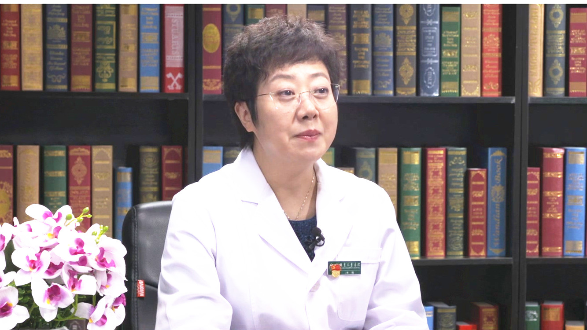

# 2.12 倒睫

---

## 李莉 主任医师

首都医科大学附属北京儿童医院眼科主任 主任医师 硕士生导师；

中华医学会眼科学分会眼视光学组委员；中国医师协会眼科医师分会斜视与小儿眼科专业委员会委员；中国医师协会青春期眼保健学组组长；北京医师协会眼科分会小儿眼科学组主任委员；北京医学会眼科学分会常务委员。

**主要成就：** 发表国家级核心期刊论文20余篇，SCI论文5篇；获得省部级项目2项，局级项目2项支持。

**专业特长：** 致力于儿童白内障术后视觉功能康复的临床研究以及婴幼儿特发性眼球震颤的基础与临床研究。擅长儿童屈光不正、斜视、弱视，儿童眼球震颤及复杂斜视的诊断与治疗，擅长青少年近视防控、儿童白内障术后视功能康复，尤其对婴幼儿特发性眼球震颤的基础与临床研究更加深入。

---

## 正常的睫毛是怎样的？什么是倒睫？

（采访）您能不能跟我们讲一下正常的睫毛是什么样子，他有什么样的作用？

说到正常睫毛，先说一下眼睑大概的解剖情况。正常人的眼睑是分前唇和后唇，靠近皮肤面外边叫前唇，靠近结膜面里面就叫后唇，睫毛主要是生长在前唇，眼睑的前唇上，是向上向外有一个轻微的弯曲，大概正常是2-3排左右，睫毛对人体来说应该起到很重要的作用，它可以避光，可以起到遮挡灰尘的作用，还可以阻止外界的一些异物进入到眼内，特别是还有美容的作用，长长的上翘的睫毛是可以带来非常美的效果的。

（采访）也就是说睫毛的作用其实还是非常重要的，那倒睫是什么？

倒睫主要就是指睫毛的方向是一个异常的生长，它就可以接触到眼球了，比如擦伤角膜、结膜，这就属于一种异常的情况。

（采访）我们正常睫毛应该是向上向外的，那倒睫是不是就。

向内生长。

---

## 倒睫好发于哪些人群？原因是什么？

（采访）那倒睫比较好发于哪类人？

倒睫也有遗传的因素，比如父母都有倒睫的，孩子出生可能倒睫的几率就会高一些。还有就是在儿童、婴幼儿，可以因为肥胖、脂肪，包括整个眼轮匝肌都比较肥厚，引起的睫毛向内生长。另外也可以由于炎症、外伤，这些瘢痕引起的眼睑内翻，睫毛向内生长，这些都是发生的原因。有先天性的，也有后天性的原因，先天性主要是因为生长方向整个就是异常，出生就这样，还可以伴有内眦的赘皮，眼睑发育的异常，如果是先天性的，往往很难自己自愈的，如果是由于外伤、瘢痕性炎症造成的，这就是后天性的。

（采访）那引起倒睫的原因，也就是说有可能是先天性的本身生长的问题，也有可能是后天由于瘢痕的这些问题，那它主要就是说除了有儿童比较好发于这些的话，我们成年人也会有吗？

成人也会有，外伤、瘢痕可能对于成人来说出现的几率高一些，特别是在过去，在五六十年代，我国沙眼疾病比较严重，到老年的时候，由于眼睑结膜的瘢痕造成的睑内翻，这样的病人是很多的，当然现在沙眼控制的很好，由于沙眼引起的瘢痕性的睑内翻病人现在是越来越少了。

---

## 倒睫会引发哪些症状？

（采访）倒睫的主要症状是有哪些？

出现倒睫，轻度的有可能是没有症状的，自己也没有感觉，严重的就会擦伤到角膜，也就是黑眼仁最外面这层透明的膜，这层角膜是富含有神经的，所以睫毛经常擦伤角膜会带来什么？眼睛会怕光，也就是常说的畏光，刺激性的还会有流眼泪，就会有异物感，就感觉眼睛里面进东西了一样，再严重的就可能会造成角膜的溃疡，甚至是有角膜的新生血管，还会有角膜的白斑，如果是形成角膜白斑，特别是在瞳孔区，就会影响视力，这就是引起的非常严重的并发症。

（采访）那这些并发症是随着时间的推移才会有的吗？

对，特别严重的并发症，一定是长期的反复刺激角膜。上皮如果被擦伤了，防线就被破坏掉了，抵抗能力相对来讲就下降，特别容易继发一些感染。正常的眼睛里面也是有正常的菌群，当抵抗力下降的时候，就是一个易感染的因素，就容易出现角膜炎。

---

## 如何诊断倒睫？倒睫应与哪些疾病相区分开？

（采访）在医院中我们是如何诊断倒睫的？

其实诊断倒睫并不困难，眼科做检查的一个仪器设备叫裂隙灯，通过它来放大的去照眼前节的部位，就明显的可以看到睫毛的生长方向。如果睫毛向内生长，就会擦伤角膜，角膜会有一些点染，用荧光素去染色，就会发现上皮已经不完整了，通过裂隙灯的检查，其实是不难做出诊断的。

（采访）所以倒睫的诊断其实还是挺容易的，只要我们及时去医院？

对。

（采访）倒睫有没有就是说他这些症状其实与很多的那些眼部炎症都是差不多的，有没有哪些症状和倒睫比较容易混淆的？

确实是也有。比如角膜炎，结膜炎的孩子也会伴有眼部的充血、畏光、流泪、异物感的症状，还有青光眼的孩子由于眼压高，角膜也会有水肿，继而也会表现出畏光、流泪的症状，如果通过仔细的去问病史以及眼睛的详细检查，是能够做出正确的诊断和鉴别诊断的。

但是也有一部分孩子是同时伴有角膜炎，结膜炎，甚至青光眼，也会伴有倒睫的现象，可能是几种疾病都有的。如果一个青光眼的孩子，会有很高的眼压，这样的患者是需要做手术的，如果伴有严重的倒睫，是需要先把倒睫解决了，同时再解决高眼压的问题。很多疾病都是要根据具体的情况来做一些具体的治疗措施，或者方案。

---

## 倒睫如果不治疗会有什么危害吗？

（采访）倒睫如果我们长期不治疗的话有什么危害？

如果是轻微的倒睫，或者是孩子的年龄比较小，比如婴幼儿的睫毛本身是比较细，扫到角膜也不会造成非常严重的后果，可以建议家长去观察，因为这部分孩子不会有什么明显的症状。如果是比较严重的，已经严重的擦伤了角膜上皮了，还是要到医院，让医生给一个正确的建议和解决的办法。

（采访）所以孩子如果年龄比较小的话，家长还是比较注意观察一下她这个表现，如果不严重的话可以继续再观察，如果严重的话还是要及时就医。

对。

---

## 倒睫可以自己拔掉吗？

（采访）有的人会说倒睫不就是往里面长了几根睫毛吗？有什么大不了的，自己拔掉就行，这个说法对吗？

如果睫毛一整排的生长方向都是异常的，当然是不能拔掉的，一排睫毛都拔掉了，孩子就变成秃睫了，睫毛所应该起到的作用也就失去了，另外也影响美观。如果整个睫毛生长方向大部分都是正常的，只是有几根异常的睫毛是向内生长，是可以考虑做一个睫毛根部毛囊的破坏手术，也可以做电解的手术，让异常生长的不再生长，但是拔掉一般还是不建议，因为把睫毛拔掉了，毛囊没有破坏，还会长出新的睫毛，长出来新的睫毛有的时候会更粗大，对角膜的影响可能更严重。还有就是没有拔干净，或者是去剪睫毛，剩的短而粗的睫毛对角膜的损伤可能是会更严重。

（采访）所以睫毛如果出现倒睫的话，我们最好还是不要自己剪掉或者拔掉。

对，还是要到医院，让医生给建议应该如何去处理。

---

## 倒睫可以自愈吗？

（采访）有的人可能觉得倒睫万一做了手术之后会很丑，会变秃，那倒睫他能自愈吗？

一般倒睫是很难自愈的，如果小的婴幼儿由于肥胖造成的，或者由于鼻梁还没有发育好，眼睑也还没有发育好，有一个非常轻微的内眦赘皮，随着年龄的增长，鼻梁的发育，或者肥胖得到了改善，是可以自愈的。但大多数情况下，如果是睫毛完全的生长方向异常，这个是很难自愈的。

（采访）所以如果只是有少数的几根的话，可能就是说那些肥胖儿童随着慢慢长大，他会慢慢的就是自愈？

有所改善。

---

## 一旦发现倒睫就要治疗吗？可以保守治疗吗？

（采访）一旦发现倒睫就要治疗吗？

如果轻微的倒睫没有造成损害，或者孩子没有什么症状，又年龄偏小，这样的孩子可以去观察。如果是非常严重的，已经引起了角膜上皮的擦伤，甚至是已经引起了感染这些严重的并发症，那一定要治疗。

（采访）如果就是说症状比较轻的话，是可以保守治疗的吗？

对，观察就是一个保守的治疗。

---

## 倒睫在什么情况下需要手术治疗？手术方法有哪些？

（采访）倒睫在什么情况下是需要手术治疗的？

如果擦伤角膜非常严重，孩子出现明显怕光，经常去揉眼睛，眼睛反复红，甚至是已经引起了感染，那一定要及早的去手术。

（采访）倒睫的手术治疗有哪些方法？

倒睫的手术简单的有下睑缝线的方法，还有做皮肤切开，眼轮匝肌的切除、睑板的楔形切除、睑板切断，另外还有一些线状刀去做睑板的手术。具体选择哪一种术式，应该还是由医生根据孩子不同的情况去选择。

（采访）这些手术的目的是什么？就是不再让睫毛继续生长了吗？

当然不是。如果是睫毛生长方向异常，做手术是要把异常的方向，通过手术矫正，达到一个正常的方向。如果只是几根睫毛生长方向异常，通过手术是把生长异常的毛囊它破坏掉，让它不再生长了，手术的方式选择还是要根据患者不同的病情去选择的。

（采访）可能有的患者就是说就算我是整排的生长异常，但是我也不想动手术，我把这整排睫毛都给做那种毛囊手术给它拔掉，如果没有睫毛的话会有什么影响吗？

没有睫毛，孩子就是一个秃睫。想象一下没有睫毛的人看着是不是很怪异，从外观上来讲，就不符合正常人的状态。另外就是睫毛没有了，没有了正常的生理功能，灰尘、异物进到眼睛里没有保护，对孩子的眼睛可以说伤害是更大的，我想家长是不会选择这种方式的。

---

## 儿童倒睫的治疗原则是什么？

（采访）儿童倒睫治疗有什么原则？

有保守治疗和手术治疗，对于轻微的年龄小的孩子，是可以保守观察，基本上3-5岁，如果孩子倒睫没有一点改善，还是仍然很严重，就建议手术治疗了。

（采访）哪种手术治疗对儿童来讲会更安全有效？

手术的安全性，这几种手术方式应该说都是很安全的，要看哪一种效果，可能对孩子是更佳的选择。缝线和皮肤眼轮匝肌切除手术，这两种方式应该是比较多的，虽然缝线的方法对孩子来说损伤小，但是复发的几率相对来讲可能会高一点。

---

## 儿童倒睫手术是全麻还是局麻？会复发吗？

（采访）这些手术都是局麻还是全麻？

大多数孩子手术应该都是在全麻状态下去做的，当然也有一些大龄的孩子，如果能配合，也可以考虑做局麻的手术。家长可能一说手术会非常的担心，担心手术是不是全麻做，全麻手术会不会出现意外，做完手术以后是不是一定就完全好了？需不需要再做二次手术？这些问题是家长非常担心的。

任何手术都会存在一些意外的情况，特别是像全麻，当然现在的麻醉技术越来越先进了，出现麻醉意外的几率是比较低的，但是并不是说不能发生，是有这种可能性的。另外就是做完手术以后，会存在比如欠矫一点，或者过矫一点，如果在正常范围，做完了手术，还轻微的有一点倒睫，但对孩子并没有特别大的影响，或者略微有一点过矫，这是不需要再做手术的。如果欠矫的很多，孩子又复发了，或者是严重的过矫由内翻变成外翻了，这样就需要再做二次手术去解决。

---

## 倒睫术前需要做哪些准备？

（采访）倒睫手术术前需要做哪些准备吗？

全麻手术，要完成所有全麻的术前检查，包括血液的化验、心电图、胸片，都是要完善的。另外就是在做手术之前，眼部不能有感染，比如现在患有急性结膜炎或者过敏性结膜炎了，就要把手术往后推，什么时候炎症好了，眼睛不红了，再考虑做倒睫的手术。

---

## 倒睫术后会有哪些并发症吗？

（采访）倒睫手术术后会有哪些并发症吗？

并发症可能比较常出现过度的矫正，就是过矫了，比如眼睛是内翻的，做完了之后外翻了。这种情况一般早期是做一个轻度的过矫，轻度的过矫随着时间的延长，是可以慢慢自愈的。还有一些孩子可能真正的过矫了，是这种情况还会伴有一些流泪，结膜充血的并发症，真正的过矫，可能需要再通过手术去解决。

---

## 倒睫术后发现眼睛露白更明显了，是怎么回事？

因为出现倒睫，孩子睫毛向内倒，整个眼睑的状态不是正常的表现，会把白眼仁，就是巩膜部分有一部分遮盖，做了手术之后，可能就会显得露白明显一些，如果是真正异常的露白严重，也是要通过手术去解决。

---

## 下眼睑倒睫术后会出现双眼皮或留疤吗？

如果只是做下睑的缝线，是不会出现双眼皮的，如果做下睑皮肤切开，在睑缘的位置会有一个小瘢痕，随着孩子的恢复，瘢痕也不会很明显。出现双眼皮，是因为上睑有提上睑肌，提上睑肌的纤维是在上睑皮肤的下面，当眼睑抬起来就会形成双眼皮，下睑是没有提上睑肌的，所以不会出现双眼皮，只不过会有一个小小的皮肤皱褶，这个皱褶慢慢会恢复。

（采访）也就是说术后他慢慢的其实还是不影响我们日常生活的。

不影响生活是肯定的。大家主要担心的是外观，这种外观的影响应该说是很小的。

（采访）下眼睑的倒睫手术做完之后会留疤吗？

如果是缝线方法是没有瘢痕的。如果切开，瘢痕应该说也是很整齐很细的，除非孩子是瘢痕体质，可能就会比较明显。

---

## 如果只有一只眼睛有倒睫，做完手术后会变成大小眼吗？

（采访）如果只有一只眼睛有倒睫，那做完手术之后会不会出现大小眼的情况呢？

双眼不对称的情况是会有，其实正常人即便不做手术，也可能会存在着两只眼睛不是很对称，也就是大小眼，当然如果一只眼睛做手术，这种现象表现的会更明显一些。所以如果孩子双眼都有倒睫，或者一只眼睛重一只眼轻，就会建议家长选择双眼同时手术。

（采访）如果就是说一只眼睛有倒睫，另一只眼睛没有，没有倒睫的眼睛可以做手术吗？

没有倒睫肯定是不做的，但只做一只眼睛会考虑到和对侧眼尽量保持对称。如果将来双眼真的是存在着，特别是上睑的倒睫存在着非常明显的不对称，可能就会要考虑到做整形手术了。

---

## 倒睫术后多久可以恢复？如何进行复查？

（采访）倒睫手术术后多久可以恢复？

倒睫手术后一般是十天到两周左右拆线，这个也是因人而异，如果觉得孩子可能手术以后看着有点过矫，也可能在七天左右就拆线了，一般整个的瘢痕恢复差不多一个月左右。

（采访）做这个手术需要住院吗？术后多久才能出院？

倒睫的手术相对来讲不是特别复杂的手术，大多数的孩子可以是走一日住院的，当天做完手术当天就出院了，第二天需要来医院复查，换药，以后隔一天来换一次药，一般拆线之后一个月还需要再复查一下，要看一下孩子倒睫手术的效果，看看睫毛有没有复发，继续又向内倒了没有，另外还要看角膜的形态，角膜有没有点染。

（采访）复查的时候需要做哪些检查，这些检查的目的是什么？

术后第一天让患儿来复查，主要看一下创口是不是洁净的，有没有感染的倾向，在拆了线之后，再来复查，要看睫毛的方向是不是达到预期的效果，还要看角膜还有没有点染，这都是需要观察的内容。通过裂隙灯的检查就可以看到睫毛的方向，包括角膜的形态，角膜有没有点染，都是可以做到的。

---

## 倒睫术后患者需要注意哪些？

（采访）倒睫手术之后患者需要注意什么呢？

倒睫手术之后，最重要的就是要注意创口不要感染。做手术，特别是做切口的，一定要注意创口不要继发感染，要点一些抗生素的眼药水预防感染。在皮肤的表面，让患儿涂一些抗生素的眼药膏，第一天换了药之后，隔一天还是要到医院来进行换药的，在拆线之前，医生是要密切观察手术后的状态，也避免感染一些并发症的出现。

（采访）在饮食上有没有什么忌口呢？

饮食上一般两周之内不吃辛辣刺激的食物，要吃一些非常有营养的，特别是含有大量维生素，维C的食品，对孩子整个的恢复是非常好的。

（采访）如果是我们成年人做了手术之后，术后多久可以化妆？

一般要在术后一个月后才可以化妆。

（采访）就是要等伤口彻底痊愈了之后？

对。

---

## 孩子如果一直眨眼、揉眼，会跟睫毛有关系吗？

（采访）孩子如果一直眨眼、揉眼，跟睫毛有关系吗？

来就诊的孩子年龄比较小，不太会表述，经常是家长发现了孩子眨眼睛、揉眼睛的症状，带到医院进行检查。它的原因呢？倒睫应该是很重要的一个原因，其他的也可能会引起眨眼睛、揉眼睛，比如其他的结膜炎、过敏，特别是还有像青光眼，眼压高的孩子，也会以眨眼睛、揉眼睛来就诊。通过检查之后，是可以明确孩子是不是存在着睫毛生长方向的异常，也就是倒睫。

睫毛如果向内生长，就会扎向眼球，会和眼球有接触。倒睫如果是比较轻微的，对孩子来说没有什么症状，就可以去观察，如果是擦伤角膜已经很严重了，看到角膜上皮有很多的点染，医生通过检查是能够发现的，就应该建议孩子在一定的年龄去手术解决。

---

## 倒睫手术后眼皮会肿吗？

（采访）有的人在做双眼皮的整形手术的时候，术后很长一段时间双眼皮都是一个非常肿的状态，倒睫手术做完之后会不会也比较的肿？

做完手术以后可能会有轻度的整个的皮肤创口，结膜有轻度的充血、水肿。现在的手术基本上都是在显微镜下去做，操作步骤是很轻柔的。另外缝线，做皮肤切口缝线用的线也都是可吸收的，而且是显微缝线，一般用是8-0的线，比头发丝还细，所以现在做完手术以后，孩子术后的反应还是比较轻的。

---
