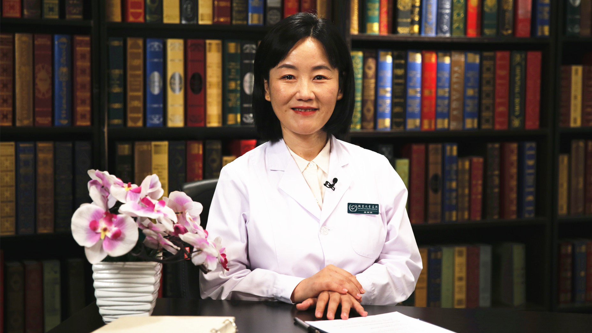

# 2.13 低出生体重儿

---

## 黑明燕 主任医师

首都医科大学附属北京儿童医院新生儿科主任 主任医师 博士生导师；

首都医科大学高级医学专业引进人才；中华医学会儿科学分会儿童保健学组委员；中国医师协会新生儿分会新生儿伦理与沟通委员会副主任委员；中国医师协会新生儿科医师分会委员 ；北京医学会儿科学分会委员及新生儿学组委员 。

**主要成就：** 发表SCI论文10余篇；主持国家自然科学基金面上项目、美国中华医学基金年会公开竞标课题等国家级及省部级项目6项。

**专业特长 ：** 致力于新生儿缺氧缺血性脑损伤发病机制研究及早产儿神经保护策略研究。擅长新生儿危急重症、新生儿缺氧缺血性脑病、极低出生体重儿、早产儿、新生儿呼吸窘迫综合征的治疗，及新生儿重症监护病房的家庭参与式综合管理等。

---

## 为什么低出生体重儿越来越多了？能预防吗？

（采访）大部分新生儿出生体重是在一个合理的范围之内的，合理范围是多少至多少？

中国的新生儿是2.5公斤到4公斤，是正常的体重范围，低于2.5公斤就认为体重低了，超过4公斤可能就觉得多了，叫巨大儿。在正常体重范围内认为是比较合适，这是针对足月儿。

（采访）小于2.5公斤的就是低出生体重儿，是吗？

对。

（采访）低出生体重儿的发生率高吗？

还挺高的，尤其现在二胎放开之后，妈妈年龄普遍比较大了，身体状态也没有原来那么好，胎盘功能也会差一些，孩子出生体重就会偏低一点，现在逐渐来说有更加升高的一个趋势了。

（采访）主要是由于高龄产妇，可能对胎儿低体重会有影响。

总体还是因为妈妈的身体状态，高龄产妇妈妈身体出现异常状态的几率高，胎盘的功能相对就更差一点，低出生体重的发生率就会高一点。

（采访）还是要根据妈妈的一些身体状态，可能会影响新生儿的体重标准。

对，孩子在妈妈体内长的好与不好，跟妈妈的胎盘功能直接相关，胎盘功能和妈妈身体的疾病状态直接相关。

（采访）胎盘功能好不好前期做产检会不会发现？

会，胎儿B超来评估胎盘功能，每一个产科B超的报告上都会给一个胎盘功能的定量的评估，有分级，每个级别里面又分为A还是B，这样来划分胎盘好还是不好。

（采访）低出生体重儿可以预防吗？

可以可以，也可以说不可以，为什么？妈妈的状态好与不好，有她特异的体质，如果本身存在一些疾病，比如高血压、糖尿病，只要怀孕就会出现异常状态的，可能不好说一定能预防到，只能取决于妈妈的异常状态，产科医生给她调整的情况好与不好来定了。其他有一些是，比如妈妈特别不能吃，或者有顾虑，已经发现胎儿好像偏小，可是也不愿意到医院评估的，这种可以预防。

---

## 低出生体重儿一生下来就要放到保温箱吗？

（采访）低出生体重儿是不是一生下来就要放到保温箱？

不是，通常来说2公斤以上的孩子，基本上都不放保温箱，也不到新生儿科去。但出生时评估一下，阿氏评分情况好不好，反应好不好，吸吮能力强不强，能不能自己吃，大概会看一下血糖情况好不好，因为低出生体重儿容易发生低血糖，而低血糖是要到新生儿科处理的疾病，是个急症。所以大概会评估一下他的状态，2公斤以上基本上只要情况好，稳定，自己也能吃，吸吮反射还行，就回妈妈身边，有妈妈来带着。

（采访）小于2公斤的就要放到保温箱。

2公斤以下的，基本上早期会放到保温箱，看一下体温的状态。

（采访）保温箱的主要作用是什么？

维持新生儿的体温，新生儿本身对周围环境体温调节会出问题，不像我们能这么好的维持身体的体温恒定，新生儿随着环境温度体温变化会比较大，而保温箱是在一个合适的湿度下，保证一个恒定的温度，在这种情况下，新生儿的体温因为环境温度的影响导致的体温波动才最小。同时新生儿在保温箱里面可以不需要包裹太多，孩子会不会出生后出现其他的问题，吐了，呼吸不好，呼吸很费力，或者一些小的肢体的抽动，穿的少一点，包裹的少一点，我们观察的更仔细，不容易漏，也起到这个作用。

（采访）更方便看诊。

对，更方便医护人员的观察。

---

## 低出生体重儿最值得注意的并发症是什么？

（采访）低出生体重儿最值得注意的并发症是什么？

低血糖。新生儿低血糖性脑损伤对于新生儿来说非常可怕，比缺氧窒息有的时候导致的不可逆损伤来的还猛。因为低出生体重孩子身体的糖原的储备非常少，身体没有什么糖分的储备，一旦发生血糖的异常会非常顽固，就要靠医护人员静脉输注，有效的有创操作手法来纠正低血糖。

低血糖症状上来说，有些孩子明显，有些孩子不明显，临床上也叫无症状性低血糖，血糖很低可是孩子看起来像普通的睡觉的表现，所以脑损伤一旦发生非常可怕。所以低出生体重由于身体中糖分的储备上，对于新生儿这一部分孩子来说，最大的问题就在血糖的监测，一旦发生血糖不好的话，要么及时喂奶再评估，要么就是发现血糖低到一个危险值的时候输液，按照医学上的要求，输入一定量的葡萄糖，再测血糖的水平，一定保证身体处在一个稳定的血糖的数值范围内，这样才能够使得脑子发生低血糖的几率少，脑损伤的几率减下来。

（采访）是不是新生儿都会监测血糖？

每一个新生儿至少监测一次，如果有高危因素，体重偏低，或者分娩过程不顺利，或者妈妈本身有糖尿病，存在血糖代谢异常，这一部分孩子可能就会密一点的监测，比如两个小时连续监测几次，再稍微拉长一点，再监测几次，都正常才能停止，看有没有高危因素了。

（采访）低血糖可能有的孩子会表现出一些症状，可能有的孩子完全没有症状。

对，低血糖最早期的表现孩子比较激惹，可能有点抖，下巴颏抖，肌张力异常，看起来不对劲。有些孩子会有点闹，因为不舒服了。有一些孩子表现脸色不好，不那么红润了，不那么红扑扑了。有一些比较严重，可能呼吸节律比较不对劲，可能快，有一些慢下来了，慢起来更危险。所以低血糖的表现非常多，跟大人发生低血糖总体的表现是差不多的，但没那么容易出现。

（采访）医生监测低出生体重儿的血糖是用仪器监测，还是通过观察症状来监测？

有高危因素的一定是扎一滴血，用血糖试纸去测的，床旁测，有高危因素一定是通过这种方法取血的，外周指血的方法，来测一个血糖数值，连测一次、两次、三次，根据血糖的状态，根据有没有高危因素，高危因素有几个方面来判断，来决定血糖监测的频率和次数。可能没有任何高危因素的，孩子吃奶也行，出生以后比如两个小时该喂奶了，测一个血糖正常，后面就不再监测了。

（采访）高危因素都有哪些？

妈妈血糖异常，比如妈妈本身就存在低血糖的状态，或妈妈有糖尿病，一怀孕血糖就不稳定。还有体重低，孩子身体储备少。还有孩子有感染，我们怀疑妈妈有感染，怀疑孩子可能会同时存在感染，因为感染的时候会消耗身体中间的血糖，消耗的多。还有出生的时候不太顺利，有一点点小难产，有点缺氧，这个会消耗身体中的糖，身体中糖的代谢也会不稳定。有这些高危因素，相对我们可能就会重视一些，监测就会多。另外还有一些早产儿，因为提前出生了，身体对糖的代谢出问题的几率更大，体重更小，这种监测也很密。

（采访）低血糖可能会引起孩子脑神经方面的问题。

低血糖最大的问题就是低血糖脑病，低血糖脑损伤，脑子依赖糖分非常大，几分钟之后脑子就会不可逆损伤。所以低血糖脑损伤对于新生儿来说，目前是高度重视的一个疾病，一旦发现低血糖脑损伤的，新生儿低血糖一发生，在新生儿科要求短期内迅速完全纠正。新生儿低血糖在新生儿重症监护病房是急症，对于新生儿低血糖的处理，专业上是有流程的，按照标准流程一步一步往下走，一定要做到的是短期内迅速完全纠正血糖异常。

（采访）低出生体重儿如果发生低血糖，可以通过急救马上把孩子的低血糖拉回到正常值。

绝大部分可以，但有些顽固性低血糖不行，本身糖的异常状态，对所有的治疗都无反应，医学上就有这样的病人，但我们要做到的是，只要能对治疗有反应的，一定是短期内叫重拳出击，把低血糖状态扭转、逆转，这个是可以逆转的。

---

## 低出生体重儿在重症监护病房时，还能吃母乳吗？

（采访）低出生体重儿在监护病房是不是只能输营养液不能吃奶？

不是，现在强调母乳喂养，如果孩子吸吮状态还行，肠道功能影响不大，医学上有一句话，如果孩子肠道是好的，就喂他，这个就是新生儿重症病房里面的理想状态，呼吸不好也好，心跳不好也好，脑子有损伤也好，还是体重小，体温不行也好，只要医护人员评估他肠道功能是好的，哪怕插一个留置胃管也要喂，肠内喂养，母乳喂养是首当其冲的，一定不要这个孩子的肠道功能被废掉了。

因为新生儿如果没有食物刺激肠道，小肠绒毛、胃里面的胃黏膜的功能短期内很快就会有点萎缩，反而造成后面的喂养出问题，肠内喂养建立不起来，孩子后面治疗麻烦会很多，所以现在肠内喂养是新生儿重症监护病房里面非常重大的一个方面，新生儿哪怕情况不好，只要肠子好，就喂这个孩子，可以吃，母乳喂养是最佳的一个食物，最合适的一个食物。

（采访）如果低出生体重儿进了重症监护病房，可以把妈妈挤出来的奶送进去给孩子吃吗？

可以，现在每一个重症监护病房其实都跟妈妈是这样交代的，有奶是最好，而且会交代初乳的量就是少，看起来只有两三毫升，一点点，好多家长都觉得这哪里是奶，给扔了。初乳非常宝贵，它是一个药物，不是一个食物了，对于生病的新生儿，比药物还珍贵的一种治疗的手段。

医生护士都会鼓励妈妈，定期的三个小时吸一次奶，或者用吸奶器把奶吸出来，及时送到病房来，我们都会随时接收，接收之后尽量给孩子新鲜的母奶，如果孩子当时已经刚刚吃过或者还不需要吃，可能会放到冰箱里，甚至冻存起来，留着以后用，现在每一个新生儿重症监护病房都有这样的一个手段。

有一些医院可能母奶量大的时候，比如25毫升之内病房随时接，每一餐25毫升之内，如果宝宝一餐吃到五六十毫升，量大了，送到配奶间，医院有统一收奶的地方，再由配奶间的工作人员定时定期的把每一个孩子的奶再批量的送到病房来，用这样的方法，但肯定是鼓励家长这么做的，而且对新生儿病情的康复都有好处。

（采访）其实不管是普通病房还是重症病房，只要孩子的胃肠道功能是正常的，我们都建议母乳喂养。

非常对，而且这个是一定要大大提倡的。

---

## 为什么低出生体重儿发生黄疸的几率相对较高？

因为低出生体重儿相对身体脏器功能的发育状态相对会更差一点，脏器功能包括肝脏功能，而我们肝脏功能是代谢胆红素，黄疸的原因是因为体内胆红素水平高了，跟肝脏功能有很明显的影响，跟身体中间白蛋白的储备也很有关系。低出生体重儿肝脏功能会相对更差一点，代谢胆红素的能力就会更不足，白蛋白的储备少，对胆红素代谢会比别的孩子要差一点。

（采访）因为低出生体重儿肝脏功能有点问题，对于胆红素的代谢可能不如足月的要好，所以出黄疸要多一些。

黄疸的产生其实是四个方面，第一个破碎的红细胞是胆红素的来源，新生儿红细胞普遍比成年人容易破。低出生体重儿如果有宫内异常状态的话，红细胞的量就会更多，这是第一个，产生的来源会多。

胆红素的代谢部位在肝脏，低出生体重儿也许做化验不会出现肝功能酶指标的异常，但是肝脏功能对胆红素的代谢能力普遍要比足月儿差一点，而肝脏代谢胆红素的过程中，还有白蛋白起很重要的作用，白蛋白让胆红素被结合起来，被结合起来被代谢的几率才好，排出身体才更顺畅。而低出生体重儿身体白蛋白少，瘦小白蛋白指标就会差一些，结合胆红素的量就会少，被结合的也会少一点。

新生儿还有一个肝肠循环，低出生体重儿往往肠道功能也不太好，大便在肠子里潴留的时间长一点，肝肠循环就会多一点，所以产生的多，运输的程度少一点，肝脏代谢能力又不足，再加上有一点肝肠循环，所以低出生体重儿这四个方面导致发生黄疸的几率就会多一些。

---

## 低出生体重儿出院后，家长应特别注意哪些事？

（采访）低出生体重儿出院以后需要特别注意哪些事情？

保暖，好好喂养，观察一下孩子有没有其他异常状况的出现，低出生体重儿发生异常状态，并发症多一些，比如心功能不好，比如喂养困难，比如肠道可能发炎的机会会多一些，吐奶的机会多一些，其实就这几个。

（采访）这些都是家长需要注意的。

对。

（采访）低出生体重儿容易出现智力下降吗？

不容易，这个没有任何关联性。

（采访）孩子的体重跟智力是完全没有等同关系的。

没有。

（采访）低出生体重儿长大之后，抵抗力较其他孩子要低一些吗？

不会的，低出生体重只是说明身体中体脂量，软组织、肌肉、骨骼分量，营养方面的关联大一点，跟本身的体质、免疫功能没有太明显的关联，没有说一定就会不好。

（采访）也不用过度担心。

对。

---

## 低出生体重儿容易出现贫血吗？

（采访）低出生体重儿容易贫血吗？

低出生体重儿不比别的的孩子更容易贫血，不见得，低出生体重和早产可能是不同的一个概念。我们现在说的贫血，基本上就是和营养性贫血基本上是画等号的，低出生体重只要月份是足的，在孕晚期三个月从妈妈体内储备的这些铁，造血原料差不太多的。早产儿最容易发生贫血，因为提前出生了，身体没有充分的从胎盘获取铁，没有造血原料储备的时间，早产儿会缺乏。

（采访）如果早产儿出现了贫血该如何治疗？

首先还是评估贫血对身体影响大与否，如果是普通的情况，总体孩子状态还行，补充造血原料，让身体有一个好的原材料能够去造血。其次评估一下孩子本身骨髓的造血功能，很简单，做一个手指血加一个网织红细胞的指标就行，就像平时做血常规一样。网织红细胞在相对高一点的程度，提示身体骨髓造血能力不错，这种情况是我们愿意看到的，有贫血没关系，肠道功能还行，通过肠道喂养补充一点造血原料，骨髓是在好好的造着血的，接下去等待。

在这个过程中间好好的护理他，不要让他出现消耗血色素的疾病发生，比如感染了，比如不小心失血了，不要再发生这些情况，再等待一段时间自然会纠正的。

（采访）贫血是不是一生下来就会进行监测？

贫血不是常规监测的方面，血常规只是所有新生儿到儿科来之后，我们要做的一个常规的化验，不是针对新生儿，所有年龄阶段的孩子，包括大人住院也会做一个血常规，血常规中间包括贫血的指标，包括白细胞的指标，感染的指标，血小板的止血细胞的指标，并不是针对低出生体重儿，也不仅仅是针对新生儿的。

---

## 新生儿出现哪些情况需要进重症监护病房？

（采访）新生儿出现什么情况需要住进重症病房？

有好几种情况，第一个是早产，月份太小了，早产了，妈妈怎么护理他，可能存活几率会小。临床上一般是以37孕周为一个早产的划界，还要看体重有没有达到正常，能不能吃奶，自己维持体温的情况等等来看。在临床上，我们以34周为一个真正早，叫真早产儿，34周以下的孩子我们都会到重症监护病房先观察一下，因为这部分孩子出现医学状态的几率会高，不监测可能会漏，就会错失一些及早发现的时机。

然后围产期窒息，出生状态不好，孩子有体温异常，发烧了，或者体温低，体温低比发烧医学上来说严重程度可能更大。还有明确的孩子呼吸不好，自然状态下不能维持自己的有效的呼吸，身体有缺氧或者发绀出现。另外我们发现孩子血压、心率不对劲，还有一些可能产伤或者骨折，颅骨骨折，一个大血包，血肿等等，有异常的围产期的状态发生，基本上就是呼吸、心跳、明显的腹胀、体温不对劲、体重过小、月份过小、感染发生，还有不明原因发生抽筋，抽搐，还有低血糖，这几类孩子会在重症监护病房待着。

（采访）您刚才所说的围产期是多少周呢？

围产期在国际上现在有四种定义，我们国家采用的定义还是指妊娠满28周，在妈妈肚子里已经将近七个月了，28周到出生以后七天叫围产期。但是目前欧美国家，包括日本，围产期都提的非常前，妊娠满20周就已经划入到围产期范围内了。根据各个国家的定义不同，这是医学上的一个专业词汇。但围产期基本上我们家长能理解，怀孕到了中晚期之后，到出生后的早期叫围产期。

---

## 新生儿普通病房和重症病房有什么不同？

（采访）新生儿普通病房和重症病房有什么不同？

重症病房仪器设备多，首先看到的好像工厂厂房似的，可能看不见病人，病人因为小，仪器设备很多。

第二个医护人员的专业程度，对急救能力、监护程度，专业知识水平的考量更多，普通新生儿科的医生护士可能还需要经过进一步的训练，才能到新生儿重症监护病房。

第三个就是这一部分病人病情相对更重，发生危险的几率更高。重症监护病房和普通病房的区别在这，疾病的病种上有一点点小的区别，体重更小，总体的生命体征，心跳、呼吸、血压更不好，出其他明显异常状态的几率就会更高，看着就蔫蔫的，可能重症监护病房里走进去之后，满眼都是仪器设备，医护人员配比会高一些，而重症监护病房的孩子相对来说都会比较安静，而进入普通病房，可能就会看到医护人员没有那么紧张了，人员配备少一点儿，孩子哭的几率会多一些，因为这部分孩子总体状态好一些，反应哭闹的程度都会多一些。

（采访）孩子如果进了重症病房，家长是不是不能进去？

目前是这样的。目前我们在尝试对于小早产儿稳定之后，虽然稳定了，可是还需要在重症监护病房里待着，因为体重还太小，出危险的几率还太大的时候，这个时候我们尝试让家长每天定时的过来，相对长一点时间在床旁陪陪孩子，正在尝试做，中国也处在转变阶段，我们叫家庭参与，以家庭为中心，其实都是这个意思，让家长多陪伴孩子，抱一抱，同时也了解孩子的状态，学一学怎么护理孩子。

现在我们处在努力做这个过程中，但总体其他的孩子家长还是不能陪的，只针对这一部分早产儿，稳定一些了，没有太多的医学要干预的措施，但是还需要在重症监护病房住相当长的时间，我们认为家长的陪伴非常重要，因为对他的生长发育很重要。这部分孩子两三个月，才能长到出重症监护病房标准的时候，完全缺失家长的陪伴，对于后续的生长发育是不利的，我们现在在努力改变这个状态，但也不能保证24小时的陪伴，也不能保证随时来随时就能赔，也是按照医务人员的指导，在固定的时间，每天只能短期的稍微陪一陪，但大家在朝这个方向努力，肯定是个好的方向，国外基本上是可以随时陪的，鼓励陪伴。

---

## 新生儿重症监护病房，门是关着的，家长不能进去，医护人员每天都在做什么？

（采访）新生儿进了重症病房，家长非常担心孩子每天被医护人员照顾的好不好，病情发展的怎么样了，医护人员每天都要做哪些事情？

重症监护病房基本上每日工作流程是这样的，八点钟上班，八点之前小医生会来把病人看一看，每天的尿量，吃了多少奶，撒了多少尿，昨天液体给了多少，登记好，然后交班。

交班所有的医护人员在病房里集中起来，昨天收了多少个病人，现在还有多少病人比较重，这些病人有些什么情况，下一班要注意的，然后床旁交接，上级医生带着手下的医生，从头到尾每一个病人捋一遍，这个病人怎么样，昨天有些什么情况，是新收的还是原来的，如果是老病人，有些什么病情变化，然后再是手下的年轻医生再把处方什么都改一改，孩子的状态检查检查，开今天的处方。到十点多钟，上级医生带着查特殊的病人，叫上级医生查房，也许是主任查房，也许是主治查房，根据病房的工作安排，每周固定的时间有固定的工作状态。

护士们做的就是床旁交接班，每一个护士会被指派护理某几个区域的几个病人，然后这几个病人护士们要做的就是洗澡、换尿片、登记生命体征、换药，看一看输液针是否通畅，这些地方皮肤有没有破损等等，工作状态就是这样。

所以上午基本上到了十一二点之前，医护人员和护士们做的都是这样一些工作，工作状态就是这样，上级医生会有上级医生的责任，重的病人到底好与不好，今天的治疗要怎么调整，因为上级医生要做决策，而住院医生，管床医生，他们要做的是把所有病人的化验单的结果汇报给上级医生，上级医生做的一些指示要去执行，联系会诊，做各种检查，开化验单，然后要把病历写清楚，记录好。护士们要做的是床旁的治疗和护理，所以在上午的时候都会非常忙碌。

在这个过程中间就会导致家长和医护之间可能就会有矛盾了，因为家长会很着急，恨不得一上班就有一个人坐到这儿，随时给你汇报，是这种心理。但是医护人就会觉得现在的重点在孩子上，要先完成我的工作，把孩子弄好，然后看时间的安排，再来跟你沟通病情，所以永远都会有这个矛盾出现，因为只要把新生儿重症监护病房的门关着，家长在外头，医护人员在里面，这个现象就会存在，这个是毫无疑问，没有办法的。

所以还是很希望家长理解，我们的工作状态是这样的。而其实我们医护人员也是普通人，也希望自己手上的病人平稳，这个病人才会按照我的计划恢复的好，最后好好的把孩子交给家长，家长的心情我们也是理解的，但是家长如果为了自己，满足他的焦虑的心情的平复，打扰医护人员在上午最宝贵的治疗的时间，做决策的时间，频繁的要求沟通，这样可能就会对孩子的治疗反而没什么好处，给医护人员一些空间，工作的时间，因为我们现在还做不到，随时另外安排一个人给你去做这种电话沟通，或者是病情的交待，做不到这一点，现在人手都紧张，所以家长、医护人员之间的理解要摆在前面。

孩子稳定的时候，医疗上是有制度的，每天要跟家长进行沟通的，沟通的可能很短，说话很短说明孩子情况好，我们现在入院的时候告知非常详细了，孩子现在是什么诊断，要做些什么检查，大约可能会住院多长时间，有个范围，如果顺利的话大约会花多少钱，都会交代得一清二楚，然后要签字的，按照最开始交代的时候，顺利的完成住院的过程，顺利出院，家长理解到了就好了。

病房的管理非常严格，新生儿科的疑难杂症相对比其他科室少，孩子的生存能力低，出问题之后变化太快，会使得我们缺乏一个有效治疗的时间，时间紧迫感在新生儿重症监护病房特别突出，所以我们重症监护病房的医生就会这样，把孩子尽快的最大程度地稳定下来，然后跟家长交代的很详细，新生儿重症监护病房是目前我们国家儿科医学中发展进步最快的学科，跟国际接轨是最快的一个专业。

（采访）其实一提到重症病房，给大家的第一印象就是这个病比较危急，而且随时可能有不好的情况出现。

所以叫重症监护。

（采访）每天上午8点到12点这个时间段，其实是医生做决策的时间。

最重要的一个时间，因为这个点上级医生也都来了，大家讨论病情，重症监护病房是一个团队作战，有一组医生在那里把关，所以到上午的时候是人员最齐全的时候，下午只有值班的人员为主了，所以这个学科团队作战在上午的时候是最宝贵的时候，也最能有效的保证今天的治疗，大致不会出问题。

（采访）是不是在上午的时间段，不管是临床医生，住院医生，主治医生，都会对患儿进行一些评估？

对，每一个都会，管床医生，住院医做他自己的事，上级医生一定要心里有数，病人今天好与不好，大概能不能出院，要不要做其他的检查。护士们也一样，输液针好不好，决定今天这一天药好不好进去，要不然今天又得再扎一个针，所以上午是非常关键的，在重症监控病房里面。

（采访）建议家长朋友不要在上午这个时间段去打扰医护人员。

是。

（采访）如果家长还是因为放心不下，又不能见到孩子，又想知道孩子此时此刻的病情是怎样的，您建议什么时候去咨询医生？

可能最好的一个时间就是下午的时候，或者跟医生约一个时候，看能不能下午坐下来详细的问一问，自己也做一些准备，现在想一个问题，过10分钟又想一个问题，又打一电话，刚才忘问了，孩子今天拉了多少尿，也经常有这种家长，或者是妈妈问了之后回家，两口子又不说，爷爷奶奶又打一道电话，七大姑八大姨又来一电话，家里人都关心，就要避免这种情况，跟医生约一个有效的时间，自己也把问题记录一下，家人之间也相互沟通一下，别无谓的造成医疗的无效沟通，无用功的发生，别造成这种浪费。

（采访）其实医护人员也能够体谅家长担心孩子，前期的时候做一些准备，想问的问题列一个表，还有跟家属也沟通好，说今天打电话沟通，你们有什么问题都提出来。

对。

（采访）除了这些家长需要注意的地方，还有哪些家长可以去做的吗？

家长可以去做的事，其实是要平静，一个是心里不要太着急了，毕竟已经在医院，过多的担忧，其实没有用。另外一个就是在哪就诊，就相信医生，治疗效果不好不能说都是医生治不好，也可能病情太重，还是相信一下医生。第三个不要有病乱投医，可能过多的咨询别人，别人指手画脚的时候，反而使疾病出偏差，先安下心，相信医生，不要有病乱投医。

---
