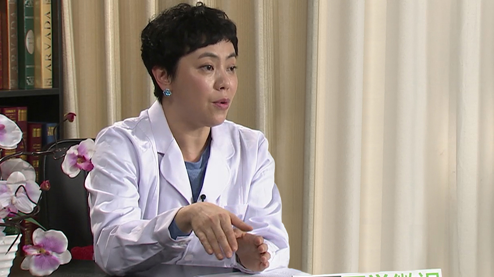

# 2.14 儿童白血病舒缓治疗

---

## 周翾 主任医师

首都医科大学附属北京儿童医院血液肿瘤中心知名专家 主任医师；

中华医学会儿科学分会血液学组儿童舒缓治疗亚专业组组长。

**主要成就：** 近五年以第一作者及通讯作者在国内核心期刊发表文章十余篇；主持局级科研项目一项，并以主要参加者参与国家级课题，2011年获得首都医科大学学生实践创新能力培养项目课题，2010年获北京市卫生局十百千人才“百”人才，2012年获北京市优秀中青年医师称号。

**专业特长：** 擅长包括儿童白血病在内的各类血液系统疾病的诊治，目前研究方向为儿童舒缓治疗，对治疗中的病人进行疼痛等症状管理，对患儿及家长给予心理疏导，并举办各种志愿者活动，从而提高病人的生存质量。

---

## 儿童白血病是怎么回事？

**儿童白血病是怎么回事？**

我这里面讲的就是儿童白血病，那儿童白血病和成人还是不太一样的，什么叫白血病？

我们曾经有一个孩子，他说他的同学就问他，说什么叫白血病？是不是你的血就变白了，叫白血病，但其实不是这样。

大家能够了解的，比如说我是胃癌、肺癌，大家就觉得是某一个地方长的不好的东西，那白血病实际上就是骨髓里面的细胞，它出现了恶性的增生，那我们正常的细胞，它是有一个生长的过程的，它从一个原始的，到幼稚的细胞，再到分化成熟这么一个过程。

那如果这个人得了白血病的话，原始和幼稚的细胞，它就不分化成熟了，它老在自己的那个阶段，它不会凋亡，那么这样的话，骨髓里的这种细胞就会越来越多，那就像其它的癌症一样，它就从我的骨髓里面释放出去了，就可以通过我的血液循环，就到全身各个地方，那这个我们在中文就翻译成为叫白血病，英文叫leukaemia，实际上它是骨髓里面的细胞恶性增生，造成的一种恶性疾病。

儿童白血病它的发病率大概是在十万分之三到五左右，也就是说实际上它还是一个相对比较少见的一个疾病，但是现在也不停的来有人问，是不是现在我们发病率越来越高了？

但是到目前为止，应该还没有一个非常官方权威的统计的数据告诉我们说，儿童白血病的发病率增高了，只是我们好像见到的病人越来越多了，那我想这个可能还是会有一些其它的原因，那是不是真的有发病的增加，这个我们不能够有确切地知道，但是至少现在随着我们宣传的越来越多，大家对白血病的了解也越来越多了，再随着我们医疗水平的进步，更多的病人被诊断出来。

还有一个非常重要的，就是我们更多的病人可以被治疗，那当然还有现在很多国家的政策，可以帮助我们患有儿童白血病的病人，去可以得到治疗，所以更多的病人，他选择了治疗，大家可能也就觉得，是不是我们周围的白血病的发病率增高了？

但目前我们更官方的一个数据，仍然是以十万分之三到五，作为我们的一个数据，儿童白血病，最常见的年龄是二到五岁，也就是学龄前这个阶段，特别小的，比如说小于一岁的，或者是很大的，比如大于十岁的，这种在儿童白血病里相对比较少见。那我们就是也因此会根据他的年龄，会把病人分成不同的危险程度。

---

## 儿童白血病都有哪些类型？

**儿童白血病都有哪些类型？**

儿童白血病里面最常见的就是急性白血病，那它也会有一部分的慢性白血病，大概发生率只在2%左右，所以儿童白血病一说都是急性白血病。

所以我们家长就会问，说我是不是把孩子病给耽误了，那其实应该不会耽误，因为它的病程大概就在两到三个月左右，那基本上家长都会发现的，可能会觉得孩子食欲不太好，没劲，有点发烧，或者有出血的这些表现，脸色也不好等等，那么大概在一两个月左右的时候，大家都会有察觉的，那可能一查血常规，就会发现有一些血象的异常，那我们再做一个骨穿，就可以把这个疾病诊断清楚了。

儿童急性白血病里，它还分成两大部分，一部分叫儿童急性淋巴细胞白血病，还一部分，我们现在叫做儿童髓性白血病，在以前我们为了好区别，好理解，可能我们叫急性非淋巴细胞白血病，现在我们更正规的叫法叫做急性髓性白血病，所以就是两个，儿童的急性白血病里头，分成急性淋巴细胞白血病，和急性髓性白血病两大类。

更常见的，大概占了80%左右的是急性淋巴细胞白血病，急性淋巴细胞白血病里头，还根据它的细胞的不同，我们还分成T淋巴细胞表型的，和B淋巴细胞表型的。

---

## 儿童白血病治好的生存率怎么样？

**儿童白血病治好的生存率怎么样？**

那很多人更关心的说，我的孩子得了这个白血病，他能不能好起来？那所以我们跟家长说，那我们要看不同的疾病了。

如果他是急性淋巴细胞白血病，那么到目前为止，全世界最优秀的治疗中心，急性淋巴细胞白血病的长期无病生存率，已经达到了80-90%，甚至在标危的病人，都可以达到100%的生存率。那在我们国家，大部分的比较优秀的中心，都可以达到80%左右的长期生存率了。

那如果是急性髓性白血病的话，他的生存率会比急性淋巴细胞白血病稍微低一些，那大概在50%到60%，我们是北京儿童医院的血液肿瘤中心，我们的急性髓性白血病的长期生存率，也能够达到60%以上了，所以这也是一个医学发展进步。

那有更多的病人，当被确诊了之后，也来选择治疗，所以当病人被确诊为急性白血病，尤其是急性淋巴细胞白血病的时候，我们首先跟家长说的是，你的孩子有非常大的机会，可以被治好，所以要有信心去治疗，不要轻易放弃，那么这也是以前，很多时候我们也觉得很痛心的，家长可能因为各种各样的原因，说反正孩子得了这个病，那我就不选择治疗了。

所以现在我们更多的是跟家长说，80%的机会都可能好，一定要努力，这个孩子很有可能会长大成人，跟我们一样，成为一个健康的有用的人，这是儿童白血病的一个基本的概况。

---

## 什么是儿童白血病的舒缓治疗？

**什么是儿童白血病的舒缓治疗？**

很多人都会在问，什么是舒缓治疗？

那实际上它是来自于我们的一个英文的翻译，它的这个说法叫PalliativeCare，我们翻译成为叫做姑息治疗，临终关怀或者缓和医疗，那大家一听说临终关怀，或者是姑息治疗，好像曾经听说过，但是一说到舒缓治疗，实际上也是现在我们从PalliativeCare翻译过来的，那我们从字面上来看，那它就不是一个简单的只对病人进行临终关怀的这样一个工作了，那从字面上就有舒和缓，实际上就是要让我们的病人，在整个儿童血液肿瘤治疗的过程当中，更加的舒适，减少他的痛苦，让我们的病人生存质量更高，那么这是最简单的一句话。

实际上作为世界卫生组织对于儿童舒缓治疗，是有一个明确的定义的。当这个病人被诊断为可能不被治愈的疾病时，比如说白血病，白血病虽然我们现在的治愈率很高，但仍然有可能不被治愈，那还有很多的儿童的恶性的实体瘤的存在，那么这些疾病，当你被诊断的时候，我们就应该有一个跨学科的团队，对这个病人，以及他的家庭，进行生理上面的，心理上的，以及家庭和社会上的全方面的一个关怀。

那大家又会在想，这和我们的肿瘤治疗到底有什么关系吗？那肿瘤治疗跟大家讲一下，比如说你来到医院里面，医生告诉你说，他诊断了这个疾病，那我们下面就要给他做化疗，或者做放疗，或者做移植等等，这些是我们肿瘤治疗的一个过程，这时候我们的舒缓治疗是在哪儿，舒缓治疗是缠绕在整个的我们的肿瘤治疗过程当中的，无论这个病人是不是可以被治愈，或者不会被治愈，我们舒缓治疗的团队，都在这个病人的身边。

因为我们的肿瘤医生可能更多的就是治疗这个疾病，但是在治疗疾病过程当中，病人不可避免的会经历很多的痛苦，这个痛苦来自于生理上的痛苦。

比如说我们做各种操作，扎针的操作，骨穿的操作，腰穿的操作。还有就是我们化疗过程当中，最常见的口腔溃疡。我们的一个孩子说，在我治疗的过程当中，我的嘴里面全部都是溃疡，实际上这个病人可能不止嘴里面有溃疡，他可能整个消化道都是糜烂的，所以这种痛苦，以前就只能让病人忍受着。

那现在我们不希望病人在治疗过程当中，还要忍受疼痛，那所以我们要给他很好的镇痛治疗，那这个病人的躯体上面有疼痛，但是整个家庭，当一个孩子被诊断为恶性疾病的时候，对一个家庭的打击，就是一个摧毁式的打击，你可以想象一个家庭里面，说你的孩子得了这种疾病的时候，几乎每一个家长都会说，我当时的感觉就是天塌下来了，这就是几乎每一个家长所说的话。

所以我们要对这个家庭也要进行安慰，怎么能够让他们更快的从这个过程当中，让他的这种痛苦能够减缓。我们可以让病人的家长的这种抑郁的状态能够减轻，那么这也是我们舒缓团队可以帮助他们的。

当然如果这个病人，不可以被治愈的话，在临终那一段时间，我们也有我们的舒缓治疗团队，能够帮助这个病人完成他最后的心愿，可以解除他在最后那一段时间的痛苦，那么给家庭以最后的安慰。也就是说，我们整个的这个过程，就是要让我们的病人在治疗过程当中有尊严，在他离去的时候依然是有尊严的，所以这实际上就是我们舒缓治疗，整个的一个基本的过程。

（舒缓治疗）我们专业的活动，就是三部分，第一部分叫做疼痛和症状管理，第二部分就是心理疏导，心理疏导包括家长和孩子的心理疏导，第三部分我们专业工作，就是临终关怀，第四部分就是我们一些由志愿者来完成的，就是公益活动了。

---

## 白血病儿童舒缓治疗中的疼痛管理该怎么做？

**白血病儿童舒缓治疗中的疼痛管理该怎么做？**

（舒缓治疗）第一部分工作，就是疼痛和症状管理，我老说一句话，就是我们的教授就在说，叫做nopaincontrol,oncare,就是如果你不能够把病人的疼痛控制住的话，就不要再谈什么舒缓了。

我们自己也可以想一下，其实我们每个人多多少少都会有一些疼痛的经历，不管是轻度的还是重度的疼痛的经历都会有，那我们的病人在整个的治疗过程当中，他的疼痛是一定会发生的。

我们就是给我们医院的病人做了一个横断面的调查，就是在这一天，我们去调查我们所有肿瘤治疗的病人，他的这个疼痛的发生率，那会发现有60%以上的病人，都会有疼痛存在，而这60%以上，又有接近80%的病人，是中到重度的疼痛。

我们把疼痛有一个评分，他是从0分一直到10分，0分就是一点疼痛都没有，但是如果是4分以上的话，就是进入到中度到重度疼痛了，所以就是有60%的病人有疼痛。而这些病人里头，又大部分都是中到重度的疼痛，中到重度的疼痛，就是需要我们去处理的，不是说你忍忍，过一会儿就过去了，就没有关系了。

但是这么多的病人里面，只有很少数的病人会接受到我们的疼痛的治疗，所以实际上每天有很多很多的病人都在忍受疼痛。

那你想，如果你身边的一个人，你很亲的一个人，他被疼痛折磨着，你作为他的家属在他旁边，你的心一定也被折磨着，所以就是一个疼痛带来的，不光是一个躯体上的问题，它还带来了很多的家庭的问题，会为家长造成很多的抑郁和焦虑的这样一种状态。而且它对这个治疗，也是会有影响的，因为我们儿童白血病，他在治疗过程当中，有很多有创操作。

比如说像骨穿，可能一段时间就要复查，腰穿也是，那么在我们想象当中的，就是目前来讲，大多数医院里面所执行的，都是这个小朋友过来，可能几个医生把他放到治疗床上，爸爸妈妈都在外面，孩子就哭啊喊啊，爸爸妈妈就在窗户外面，把耳朵贴在门外面，就听自己的孩子是不是在哭，是不是在叫，就想从门缝里看看我的孩子现在怎么样。

实际上如果一个孩子，真的比较小，他很闹的时候，可能会有几个医生来帮助，就是控制他，不能让他动，保持一个我们适宜操作的一个体位，所以你可以想象，在那个过程当中，对孩子造成有多大的恐惧。

所以现在我们的舒缓治疗，就是希望可以减轻孩子这样的痛苦，那我们怎么减轻，我们可以有很多方法。比如说我们可以用家长来陪伴，现在我们如果不能够保证我们每一个病人，都是在睡眠状态下进行这种操作的话，我们至少可以保证我们的家长来陪伴，当有家长陪伴的时候，他很快他就会安静下来。

其实你自己就可以想象，当别人把你叫到一个小黑屋，你什么都不知道，突然在你后背上扎一针，那种恐惧感，绝对比你的疼痛要多得多的多。所以在这个时候，我们会想很多的方法，包括局部的镇痛药物，那么这些都是我们减少他疼痛的一些方法。还有病人出现了像口腔溃疡疼痛的时候，我们及时给予他这种镇痛的药物，那么都可以很有效的缓解病人的这种疼痛，那么这属于疼痛症状管理。

---

## 为什么白血病儿童及家长需要进行心理疏导？

**为什么白血病儿童及家长的需要进行心理疏导？**

（舒缓治疗）第二部分我们的工作，就是属于叫心理疏导，这个心理疏导，除了病人之外，我们现在更加关注的是我们家长的心理问题，有一些人就会问，说这么小的孩子会有心理问题吗？

不管多小的孩子，都有心理问题，当然心理问题，会出现更明显的，是我们青少年，因为他已经不同一个普通的孩子，他也跟正常的成人是不一样的，那你们不能把一个十几岁的孩子，当做一个成年人来看，也不能把他当做一个小孩子来看待，所以这个时候是需要一些很特殊的，就是适合他们的心理疏导的方式出现。

还有就是对家长，我们专门做过一些家长的心理量表的测评，我们就是通过软件分析了以后，正常人会有一个水平，比如说他正常这个分值是在2分以下，还有就是像抑郁、焦虑、担忧等等，那么这些每一个都有分值，只要他超过2分就是异常的，就会发现我们所有的家长，他的总分，最后我们把他平均下来，他的总分是超过2分的。

也就是说在当一个家庭，说他的一个孩子得了恶性疾病的时候，家长们的这种心理状态是不正常的，那其中哪一个，哪几个评分是最高的？第一项就是抑郁，也就是说我们大部分的家长，都会有一个抑郁的状态，那还有就是焦虑。剩下就会有一些其它的一些社会上的问题。那我们就是通过我们心理医生的心理疏导，对这些病人的家长进行疏导。

我们的心理医生说了，他们原本都是正常人，原本都有自己的工作，都有自己的生活，当接受到这个打击的时候，他们只是一种应激反应，而不是真正的心理异常，这就好像比如说像汶川地震，这种大地震灾后的时候，这时候的这些灾民们，他们是一种心理的异常，所以是应激的反应，所以需要心理医生介入，你不能把他当做一个说，本来就是心理不正常，他不是这样的，所以需要我们是解除他这种应激状态。

比如我们心理医生举个例子，就好像是茶杯，这个茶杯不同的大小，我们往里头倒水的时候，你会倒不同量的水，有一些人可能他的承受能力很差，他就像那个很小的杯子，我只需要倒一点点水，它就溢出来了，这时候他的心理应激状态就出来了，所以我们的心理医生，对他们更多的是，让他们去发泄，让他们去在他们自己同样的处境的家长面前，去说出自己的担忧，说出自己的那种痛苦。

所以我们现在主要做的是家长的心理小组的活动，也就是说我们一次大概六到八名家长，把他们作为一个小组，由心理医生带领下，给他们一些问题，那么家长们之间，也会有一些帮助。那么通过一期大概是五次到六次的活动以后，我们再给家长去做评分，会发现他们的总分就有一个明显的下降，已经进入到正常的水平，那其他像焦虑这些水平也都下降，唯一的就是抑郁仍然还存在。也就是说我们的这个家长，他可能在整个的治疗过程当中，他的抑郁只能减轻，让他完全降到正常几乎是不太可能的。

我们就有家长说，当孩子诊断了这个病的时候，他觉得就是天塌下来了，他说我不知道这是个什么病，我只在电视剧里头看到，我也不知道他会怎么样，我就知道这个病就是一个死，所以我现在就好像是坐着火车，开到了一个黑洞里面一样，我不知道前途是什么样子的，这就是家长最真实的一种想法；

而且他们还会说，自从我的孩子被诊断了这个病，我的头顶上就像有一把剑悬着，它可能随时都会掉下来，所以他的这种抑郁和焦虑这种状态，可能真的要伴随他很长很长时间，甚至当病人停药了之后，我们家长回来复查的时候，一个家长就跟我说，说我每一次到北京去复查，就像是等着宣判一样，说当我得知这一次我的检查的结果是正常的时候，我就觉得，老天爷又放过了我这一次，就是说他（的抑郁）可能要维持很久很久。

当然如果这一个人总是在这种抑郁状态下的话，那他就不能够维持他一个非常正常的生活了，那他可能也不能很好的去配合我们的医生治疗，现在我们的这心理医生，他就很强大的，他原本是一个精神科的医生，他有很好的医生背景，所以可以通过他在访谈之下，就会判断出有一些病人，已经进入到了抑郁症的状态。

我们家长就说，在这一个月之内，他不吃不喝，一个月体重下降了30斤，后来我们的心理医生说，你现在已经是一个很明确的一个抑郁症的状态，已经不是简单的抑郁状态了。所以就建议他迅速的开始吃抗抑郁的药，我们现在有很多家长，接受这种抗抑郁治疗，可能很快，大概两周左右就可以恢复，就可以恢复到一个相对正常的水平。

像很多我们见到这种在应激状态下的例子，我们有一个家长，在刚刚得知他的孩子得病的时候，他会整夜整夜的在病房里面转圈，他就是不停，他的孩子哭闹，他就会拼命的打他，就是他根本控制不了。别人都说你的孩子得病了，你怎么还会打他，他根本就控制不了自己，大家就会觉得像发了疯一样，就是他在应激状态下的时候，会有很多人会有不同的表现。

我们的心理医生做心理疏导，就是希望他们能够尽快的脱离这种状态，能够更好的带领孩子一起往前走。

---

## 白血病儿童舒缓治疗中的临终关怀该如何做？

**白血病儿童舒缓治疗中的临终关怀该如何做？**

（舒缓治疗）第三部分工作，就是我们大家觉得不愿意提，非常沉重，但仍然是我们非常重要的一部分工作，就是临终关怀，不管我们现在我们的儿童白血病，或者是儿童的恶性实体瘤，它的治疗的效果有多好，仍然会有一部分孩子会进入到临终那个状态，就总有不可治愈的病人的出现。

那当这种病人出现的时候，在以往是什么样子，我们的医生是希望他不要再在医院里面接受更进一步的治疗，因为这种治疗对他来讲已经是没有意义了，但是家长，第一，他不愿意放弃，你会跟他说，你的孩子已经没有治疗的意义了，你把孩子带走吧，他说哪怕有1%的希望，我都要争取，我觉得这是每一个父母，他心里面的真实的感受。

另外，他也会觉得，如果我把孩子带出这家医院以后，就不会再有一个医生，或者是一家医院，再愿意管我们了。如果我的孩子在最后的那种状态的时候，他出现了任何的问题，我该怎么办？我不知道怎么办了。所以往往这个时候，家长就会很纠结，他心里可能已经清楚孩子不可以治疗，但他不愿意离开医院，他觉得我在这儿，至少还有人管我，还有一线希望。

所以这个时候我们的临终（关怀），我们的舒缓治疗团队，负责临终关怀这部分的医生和护士出现的时候，对他们来讲就有很大的帮助，他们会帮助我们的肿瘤医生，向我们的家长讲解孩子的不可治愈性，让他能够更早期地接受我们疾病的不可治愈，那么他就会有问题，如果我回去了，我该怎么办？

这时候我们的舒缓治疗团队，就会为他提供我们的随访的医生和护士，也会提供在当地的志愿者和社会，也就是说无论你走到哪儿，至少都会有人去一直在跟随着你，在指导你，如何去帮病人止痛。那么当你有困难的时候，你应该怎么去处理。孩子最后可能会发生什么样的情况，当他发生这个情况的时候，我应该怎么办，都会有人去指导你。

而且我一般跟家长谈的时候，都会跟他说，你现在选择的并不是叫放弃治疗，因为以前我们都叫放弃治疗，家长一听，说我放弃他了，我就觉得对不起孩子，我觉得我还有经济实力，也许还有其它的方式，如果我走了，别人会怎么说，你不给你孩子治疗了，那我说你并不是叫放弃治疗，而是你选择了另一种治疗方式，我们叫舒缓治疗。

如果一个终点一定会在这儿的话，那你愿意你的孩子会经历很多的痛苦走到这个终点，还是希望他很平静的，没有痛苦的，有尊严地走到这个终点呢？

那么家长往往都会说，我希望我的孩子可以没有痛苦，能够很安静地离开我，所以这个时候家长就更愿意选择我们的舒缓治疗，他更愿意让自己的孩子，更加的没有痛苦，那这时候家长的这个心结就打开了，其实很多的时候我们的家长在最后的痛苦，是来自于他当时的那个选择，他就会说，当时是不是妈妈没有治疗你，才让你不可以疾病好起来，她会觉得很后悔。

所以我们想要做的，就是一定不要让家长后悔，当他有这种后悔的情绪的时候，可能会带给他一辈子的痛苦，所以我们反反复复地让他们从内心来接受，他们反反复复就会问我们说，医生，他是真的没有治疗的方法了吧？我现在这个选择是正确的吧？那我就会对他说，你给孩子一个很平静的结尾，难道是不对的吗？

所以家长们很愿意，可以很平静地把孩子带走，就是说我们希望在家中，可以让孩子减少一些医疗上的这种痛苦，比如说如果你现在要到医院去，那医院必定要给你做检查，那一定又有扎针的，这些有操作的存在，所以我们是指导家长，希望只要不是到万不得已的状态下，尽量的是在家中去陪伴他。在走之前，我们也会教家长，如何去判断他的疼痛，我们也会给他带上镇痛的药物，所以我们就是希望孩子在最后的时刻，能够尽量减少疼痛。

还有我们现在还会有志愿者，我们还跟其它的基金会合作，他们有专门的安宁陪护队，来陪护我们的这些病人和家长，他们有更多的资源，满足孩子最后的心愿，我们一般也会指导我们的家长，你可以去问一问你的孩子，更喜欢什么？他想要去哪里？他想要有什么样的心愿等等，可以帮助这个孩子完成她最后的心愿。

因为完成了这个心愿，孩子应该也是带着笑离开的，我想她的爸爸妈妈，也给孩子留下了珍贵的影像，也留下了一个美好的记忆，也觉得我在最后那一刻，完成了我孩子的心愿，应该也是对他们一个家庭，是一个非常非常大的安慰，所以这也是我们临终关怀里面非常重要的一部分。

---

## 白血病儿童的镇痛治疗会不会有很多副作用？

**白血病儿童的镇痛治疗会不会有很多副作用？**

这就是我们现在开展整个儿童的镇痛治疗里头，非常困难的一部分，比如说如果，我跟你说吗啡这个药的话，你首先想到的是什么呢？

几乎所有人都会先想到的就是成瘾的问题，那不论是孩子，还是这个家长，甚至我们的医务人员，一提到这个，我们的家长更多的一听到说，这不就是毒品吗？

觉得好像鸦片一样，所以现在我们实际上儿童的镇痛面临着很多的困难，对于医务人员，和我们的家长和患儿，我们就是在大力的做培训和宣传。可能每隔一段时间，我们要给我们的医务人员做疼痛的培训。我们还有一段时间，我们要给家长做宣教，我们要让患儿也明白。当他们理解到这个镇痛对他们来讲，他们的副作用发生率是很低很低，而且是在我们的控制之下的时候，他们就可以主动的要求使用这种镇痛的药物。

如果他们想要用的时候，医生不给也是不可以的，所以我们对医生的培训，是我们现在最重要的，要让医生们了解，比如说大家很担心的成瘾的问题，那我们就在说成瘾，有包括生理上的成瘾，和心理上的成瘾，那么现在我们不叫成瘾了，我们叫做这种依赖性，那么什么才是真正的成瘾，就是心理上的成瘾，那么这种心理上的成瘾，才是吸食毒品之后，不可以戒毒的这个原因了。

但是我们这个医用吗啡，它会出现成瘾性的这种可能性，是在0。03%，也就是说只有一万个病人里面，才有可能有三个左右的病人会发生成瘾。而这种成瘾是怎么发生的，是大剂量静脉应用的时候才有可能发生。所以我们短期之内小量的，或者是口服的应用，是不可能出现成瘾这种反应的。

那后面就是有其它的一些小的副作用，都是我们可以控制的，比如说医用阿片类的这种镇痛药物，它可能90%的病人都会出现便秘，但是出现这种便秘的时候，我们可以有药物来解决它，那还有病人会出现尿潴留，或者身上瘙痒等等，这些我们都可以是很轻微的，跟他的剧烈疼痛相比，都是可以耐受的副作用，那经过这种培训之后，我们自己的这个镇痛的水平，也是在有提高的。

所以你就能够看出有更多的孩子，他已经接受镇痛治疗了，虽然现在眼前还会有很多很多的困难，但是大家随着我们的培训，我们的宣传越来越多，那我想儿童的镇痛的困难也会越来越少，大家也会逐渐开始有理念，有这种意念，要给我们的儿童来进行镇痛治疗了。

---

## 儿童白血病都是由哪些原因引起的？

**儿童白血病都是由哪些原因引起的？**

白血病（的原因）吧，其实这也是很多家长，就是不管是他刚得病，还是到最后，他都愿意问的，因为他还在想，我家里的那个孩子，或者我再要一个孩子会不会有问题，实际上白血病，为什么到现在，还不能够叫做完全治愈，是因为对于它这个疾病的产生因素，还不是很明确，但是会有一些因素，可能对它有影响。

比如说基因的改变，而基因改变，实际上是一个最根本的，也就是说现在我们无论是淋巴细胞白血病，还是髓性白血病，都可以找到它异常的那个基因，就都可以知道，不管这个是哪一个病人，都一定能找到，他一定会有一个基因发生了改变，但是什么原因引起来这种基因突变？

可能有环境因素，这种环境因素，很多人在想，是不是我们家的装修就有问题，所以才会导致了他的这个。实际上就告诉大家，到目前为止，还没有一篇真正的非常科学的依据告诉说，就是因为你们家装修的问题，造成了孩子白血病。到目前为止，还没有一篇这样的科学的论文。

所以我们只能说环境，一定是有环境因素，但具体是哪一个，谁也不是很清晰，当然你居住的环境越好，肯定对他的身体肯定是有好处的，那还有就是病毒感染，那病毒感染并不是说，我们这个感染本身，说这个病毒怎么样了，而是因为这个病毒感染，可能会引起来他的某一些基因的改变，然后才造成了他的这种情况；

还有就是放射性，放射性是一个非常明确的，但是要有足够的量，比如说我们以前看的那个电视剧叫《血疑》，里面那个幸子就是无意当中，接受到了大剂量的一个放射，这个放射病是可以引起白血病，那有的时候像核泄露事故等等，那么这些人，是很容易得白血病的，就骨髓其实它是很脆弱，它很容易受到打击，经过这种照射了之后，基因发生改变，那么就会出现了这种细胞的异常。

所以大概就是这几方面的问题，但具体到每一个人，他是什么样的，这个谁也说不清楚了。

---

## 儿童白血病都有哪些症状？

**儿童白血病都有哪些症状？**

（白血病的）症状，一般家长发现的时候，通常都是觉得孩子脸色不太好了，他觉得有点发黄，或者有点发白，还有他就会觉得孩子没劲了。

比如说妈妈就会说，这一两个月，他就老想让我抱，我让他出去玩，他又不想去玩，发现食欲不太好，还有一些孩子，就是间断的断断续续的发烧，可能烧了几天好了，过几天又发烧了，那么其实真正的像我们电视里头老演的，突然流鼻血，说你就是白血病吧，其实这样反倒比较少见，挺少见说这孩子是反复流鼻血发现了说是白血病的，比较少，倒是我前面说的这几个症状，可能是更常见的。

所以其实它比较隐匿，起病会比较隐匿，一般来讲都会觉得，血色素非常低的时候，家长会看到脸色真的特别不好，或者说他反反复复老发烧，家长就会去查血常规，一查，发现血常规的异常了，那么这个时候，通常是他发现的。

---

## 儿童急性白血病和慢性白血病怎么区分？

**儿童急性白血病和慢性白血病怎么区分？**

儿童大部分都是急性白血病，你区分急性慢性，其实就是一个病程的问题。

我们急性的病程，从它开始有那么一点苗头，到我们真正能够发现它，大概是两到三个月，但慢性白血病，它的起病就很隐匿，可能病程很长了，比如说这个病人，可能一开始就是白细胞稍微高一些，或者一开始血小板稍微高一些，可能等到肝脾都已经非常大了，家长才会发现他的异常。

但儿童的慢性白血病只有一种，叫做慢性粒细胞白血病，它只占我们儿童白血病里头的2%左右，其他白血病都是病程很短的一个，起病很急，就是一下你就会发现，他有发烧，又有脸色不好，又流鼻血等等，就这种症状，他是在一个比较短期之内发生的。

---

## 儿童白血病哪种类型治疗效果好一些？

**儿童白血病哪种类型治疗效果好一些？**

就是急性里头不是两个类型吗，一个是急性淋巴细胞白血病，一个是急性髓细胞白血病。

那现在整体治疗效果最好的，应该是急性淋巴细胞白血病，那绝大部分的好的血液肿瘤中心，儿童的急性淋巴细胞白血病的治愈率都在80%以上了，即使是不太好的，应该也有70%左右，但是在髓细胞白血病，（治愈率）大概就是在50-60%，相对会差一些。

---

## 儿童白血病的主要治疗方法是化疗吗？

**儿童白血病的主要治疗方法是化疗吗？**

对。

儿童的白血病，就是跟成人会有一个很大的不同。

成人如果得了急性白血病的话，总体的预后都会比较差，所以化疗的效果不是很好，那他就主要的方式，可能是在移植上面。

而我们的儿童的急性白血病，它的治疗的方式，最主要就是化疗，化疗就是要做化学药物治疗，实际上就是通过静脉、口服，或者其它的途径，把药物进入到你体内，来杀灭这些幼稚细胞，那么这个就是我们的治疗方式，这是儿童急性白血病最主要的治疗方式。

---

## 怎样判断儿童白血病是否治愈？

**怎样判断儿童白血病是否治愈？**

其实白血病不是骨髓里面的不好的细胞嘛，所以我们确诊是要通过骨穿的，通过骨髓穿刺，我们看看骨髓里面的细胞，有没有变成好的细胞，所以我们是有一个指标的。

我就以急性淋巴细胞（白血病）来举例，如果他的幼稚细胞大于30%，我们就诊断急性淋巴细胞白血病了，那么等我们通过药物了之后，我们会定期的给他复查骨穿，我们再把骨髓细胞抽出来之后，发现他的幼稚细胞已经越来越少了，当它小于5%以下的时候，这个我们现在就叫完全缓解，就是说我们肉眼看不到幼稚细胞了。

但是作为恶性疾病来讲，我们都不太会说叫治愈，所以你看我们一直都在说叫做长期生存率，如果是达到五年以上的长期生存率，那么这个病人再出现反复的机会已经非常非常低了，那大家又说，我是不是就治好了？

我们临床上就讲，就说是治愈了吧，因为你跟家长说很多的太专业的名词，他也不懂，他只想我的孩子，现在也不需要治疗了，我现在也长大成人了，也很好了，那就是，我们就叫临床治愈，但实际上我们真正科学的说法，还是叫无事件，或者无病生存率。

---

## 儿童白血病治疗会留下后遗症吗？

**儿童白血病治疗后会留下后遗症吗？**

如果是单纯的化疗来讲的话，实际上他非常长期的所谓叫后遗症，实际上都是我们治疗过程当中的一些，大多数是药物引起来的；

那还有一些，当然是他本病，如果单纯化疗的话，它引起长期的这种远期的副作用，还是相对比较少的，反倒是现在的一些，我们越来越减少的放疗，它会有一些比较远期的副作用；

比如说如果我们经过头颅放疗之后，特别远期，比如十年之后，有可能会继发脑部的肿瘤；

比如说它还有一些长在，除了白血病之外的其他的肿瘤，他可能是长在纵隔的，我们经过胸部的照射之后；

再长远的，等到他成人的时候，比如女性，有可能会，乳腺癌的发生率有可能会增高，还有他经历过化疗以后，如果他的化疗非常强大，而且它原来可能就对心脏会有影响这种化疗药物，也可能他以后发生心脏疾患的机会，可能会比别人大一些。

但是现在对于这种特别长期的他的远期副作用的这种的研究，应该说在中国，可能还非常非常的少，主要还是在美国，在进行的相对比较多一些，我们的数据可能也更多的是来自于国外的这些数据。

---

## 儿童白血病治疗过程中必须注意哪些事？

**儿童白血病治疗过程中必须注意哪些事？**

当你越来越接触到这些人群的时候，你会知道他面临着很多很多的困难，所以就是说最常见的。

家长都会说，比如说我现在强化疗已经结束了，我现在大部分时间可以在家了，那我怎么办？我离开了医生，我都不知道该怎么办了。

从我的角度上来看，首先你还是要把自己的孩子当做正常人来看待，你越把他当做正常人来看待，你的做事的方式就不会更极端了，那所谓极端，就是因为我们要经常跟病人的家长说，你要注意卫生，那这卫生里头，包括你尽量不要让孩子去这种人口密集的室内的场所，因为他免疫功能是差的；

第二要注意食物的卫生，这种食物的卫生，就是要包括你的食材要新鲜，你的烹饪的方法要卫生，还有你的器具要卫生，孩子在吃的时候，还要洗干净你的手，那么这些就是说，当你跟他说的时候，他会非常注意。

但是如果你老把他当做一个病孩子看，有一些家长就会走到一个特别极端的一个地方，就会说我的孩子连睡觉的时候，在家里面睡觉的时候，还要给孩子戴着口罩，我说如果你已经离开医院这个环境，家里面就是他一个人的话，你可以自己试试，你们戴着口罩，经常的在外面可能走一会儿，稍微气喘吁吁一下，你就觉得喘不过气来了，你就不想戴，你再想，如果你晚上睡觉的时候，还戴着口罩的话，一定是一个轻度缺氧的这么一个状态。

所以我们要跟他说，你还是首先要把你自己的孩子当做正常孩子来看待，这样你才能有一个相对比较正常的心态，不能太过分。

所以我们只是说，尽量不要去人口密集的室内场所，但是如果室外，如果空气也比较好，天气也比较好，你避开人很多的时候，带着孩子们去室外活动的话，是一个非常好的一个，帮助他建立免疫系统的一个很好的方式，同时也可以让孩子和他的同龄人，和这个周围身边的人，就是学习交往。

因为我们的心理医生老在说，我们的这个孩子们，实际上他在治疗过程当中，你不让他交往，他会缺失掉的，在他正是心理发育最重要的一个阶段，他缺失了，你们都不知道他长大以后的问题，是出现在他这个阶段的。

我们医生现在就是说，他接触的一个大学生，他会发现他对别人的这个情感，他不太好理解，比如说一个女孩子，只是对她好，她就觉得她是喜欢我，我要去追她去，他就老去追人家女孩，结果人家女孩子根本就是有男朋友了，但是他就觉得很茫然，他说既然你有男朋友，你为什么还那样对我，但实际上人家只是对他好而已。

后来到心理医生这儿来，心理医生就一追溯，原来是他五岁到十岁这个期间一直在治疗，正好是一个情感的一个培养的这么一个阶段，他缺失了，所以他就分不清楚这种情感的给予，哪一样是正常的，同学之间的友好，哪一样是这种爱情的这种友好，他是分不清楚的。

所以在这个期间，我们很鼓励我们的孩子做一些户外的社交的活动，尤其是他已经结束了强化疗了之后，我们都很鼓励孩子们该上幼儿园去上幼儿园，该上学去上学。那当然，就是卫生这部分，也是需要家长能够认识到的，能够让他的饮食更加的卫生健康，是很重要的。

但至于说我能吃什么，不能吃什么，我说这中国的饮食这么的博大精深，你很难说你这个可以吃，那个不可以吃，就掌握好原则就可以了，只要他是卫生的，能够保证他的营养的，可以好消化的，就让他吃就没有问题了。

其实这是家长最担心的，就是说我回去应该怎么办，所以我说一个原则，你要尽量把他当做正常人来看待，但是你要注意其他的几个方面就可以了。

其实我们家长还说，我宁愿在这儿，因为周围的人都是我认识的人，大家都有共同的经历，我一回到我原来工作的地方，可能又有很多人又要再问我，你的孩子怎么样，她每说一遍就是揭一遍伤疤，所以有很多家长很恐惧回到他原来的那个环境里面去，希望他能够，所以有些家长就选择了换工作，或者让孩子换学校，这也是一些选择，我觉得就是看家长自己怎么去调整自己了。

---

## 白血病儿童的家长该如何度过心理难关？

**白血病儿童的家长该如何度过心理难关？**

就是说家长都会有这么一个过程，就是在他刚刚诊断的时候，他会觉得天塌下来了，整个就崩溃掉了。然后慢慢慢慢，他就开始配合医生的治疗，他熟悉了这个治疗了之后，稍微能够稳定一些的时候，他就开始想，他能不能治好。然后发现越来越好了，他就开始就很开心了。

等到开始又要进入到下一个阶段，就是说他不再需要老来医院的时候，他又开始恐惧焦虑了，就是说我又要离开医院了，孩子有问题了怎么办，我应该怎么办等等，那么等到所有治疗全部都结束了以后，又是一个坎儿，他又会觉得我的孩子要进入到社会了，我也要重新回到这种生活了，我怎么去适应我今后的这种生活。

所以现在我们的心理医生，会把家长的这个心理的这种状态，心路历程，其实了解得很清晰。所以在每一个阶段，其实都是需要我们的心理医生，或者说需要他们的有相同经历的人互相鼓励去帮助的，其实我们现在就是在各个阶段，我们更多的是在他强烈化疗的这个阶段里面，有心理医生的介入，去了解每一个家长他的想法，针对他自己不同的情况，给予他一些疏导。

包括当孩子得病了之后，整个家庭的变化，其实有很多的家庭，就是父母之间的关系，突然就变得非常差了，以前孩子好的时候，大家觉得怎么都能将就，现在孩子一不好，就有很多的实际问题出现。

比如说我怎么选择治疗，钱由谁来出，由谁来照顾孩子，或者妈妈就觉得，就是我在照顾孩子，爸爸整天都不在，就是在逃避怎么怎么样，或者夫妻之间的这种矛盾就经常会出现，所以这都是我们白血病的患儿家长，他面临的特别实际的问题。

你要是说咱们只能说大部分的家长，是可以自己度过这个难关的，但是仍然有一小部分家长，可能真的他度不过去。那这一小部分，就是需要我们的心理医生，还有我们的志愿者，或者我们的社会来帮助他去做调试的，当然你说能度过这些难关的家长，是不是就不需要我们的心理支持了吗？其实他仍然需要。

当你给他多一些关爱，他有相同经历的家长们在一起的时候，他们互相讨论，互相鼓励，也是一个非常好的方法。也就是说也许他可能需要一个月才能度过，但可能我缩短了他的时间，他可能十天就已经接受了这个现实，尤其是他看到了那些已经治好的病人的家长，他的信心又增加了。

所以我们就是，有各种各样的方式，希望能够家长们能够尽快度过自己心理的每一个这种难关，但是你要说怎么具体的去做，这就是一个很专业的问题了，这是由心理医生来做。

---

## 舒缓治疗对儿童白血病的治愈率有帮助吗？

**舒缓治疗对儿童白血病的治愈率有帮助吗？**

我觉得可能对治愈率，应该主要还是要靠我们的肿瘤医生来做治疗，我个人认为对治愈率应该是不会有太大的帮助。

为什么说就是在你肿瘤治疗已经达到一定很高水平的时候，比如说80%的病人都能好，但我可以让这些病人在治疗的过程当中，减少痛苦。

也就是说，原来我们是活下去，现在我们是叫活得好，原来我只能让你活，让你活着就不错了，现在我可以既让你活，而且还让你活得更好，像正常人一样，实际上是一个辅助治疗。

---

## 儿童白血病治疗不同阶段卫生上需要注意什么？

**儿童白血病治疗不同阶段卫生上需要注意什么？**

这个我们就要分不同阶段，看你是哪个阶段出院了，实际上现在大部分的医院，这个病人在，只有在强化疗的时候在医院里面，其他的时候都是在家里，所以我们就把以急性白血病为例的话，可以分为几个阶段，第一个阶段，就是叫做强化疗阶段，那么第二个阶段，就是维持治疗，主要在家的阶段，第三个阶段就是停药之后，那么这三个阶段，你肯定注意事项是不太一样的。

如果我们都以卫生举例的话，在强化疗阶段，你回家，确实要非常注意，尤其是你回家的时候，经常会有白细胞只剩下一百两百的时候，他又容易出血，也非常容易感染，那在这个时候，我觉得你好好的把器具消毒，尽量减少人员来看他，每一次只要他吃东西之前，清洁双手，所以我们反复地跟家长强调，清洁双手，要比你戴口罩更有用。

如果你家里有人，有感冒了，尽量跟他隔离，因为这个期间的孩子，确实还是很脆弱，他是很容易有感染的，那么如果是你维持期间的时候，那时候已经没有强化疗了，病人都可以慢慢都可以重新，我去上学，上幼儿园了，在这个阶段，你要比其他的同龄的正常的孩子，相对注意就可以了。

因为他的免疫功能已经有一定程度的提高，比他强化疗的时候，肯定要提高很多了，但仍然是免疫力相对比较低的，尽量不要去人口密集的室内场所，我们的食物器具，就尽可能卫生，强调好好洗手，就可以了。

但是也用不着，家长就说，他从来没有在外面吃过一顿饭，我只要去外面吃，都会单独给他做，有很多家长都是这样的，单独拿一个饭盒，带着宝宝出去，跟大家一起聚会，宝宝吃自己的，弄得我们孩子自己，现在都非常紧张，我们一起出去的时候，就很小的五岁的孩子，他眼巴巴的看着你吃的东西，但他绝不吃一口，因为他就是从家长给他的教育，他自己也很在意自己，他也担心自己吃了这个会怎么样。

所以我们有的就是说，一晚上一晚上做恶梦，老觉得这个东西他过来了，要抓我了，我要死了，实际上就是家长过度紧张了。

那么找我们的心理医生看了之后，心理医生给他解答，他之后就说，阿姨已经说了，这个是没有问题的。就是他的恐惧来源于哪儿，是来源于他的父母，过度的紧张焦虑，所以在中间维持的这个阶段的时候，你就没有必要说，太像我们之前（强）化疗的那一个阶段一样，尽可能要让他开始向正常的生活去迈进了。

等到他已经停药了，那个时候我们的注意就更要减少了，就是尽可能的说，正常孩子应该怎么样，我就怎么样，只是对他相对注意一些就可以了，因为他毕竟要走向社会，你要给他这些接触，你不可能等到他都停药了之后，说等他长大成人了，说在外面一次没吃过饭，我不敢吃怎么怎么样，这种也是不现实的，没有社交了，你还希望他要成为一个社会上的人。

所以在不同的阶段，你的注意的程度肯定是要下降的，但是不能说不注意，就在他完全没有停药之前，总还是需要有一些注意的。

---

## 白血病儿童该如何进行心理疏导？

**白血病儿童该如何进行心理疏导？**

我现在自己认为，就是说对于大孩子，更好的是由我们这种专业的医生，来跟他谈病情的情况，这样他会很信任，他会很有信心。如果是由家长来告诉他的话，他们通常都会说你在骗我，因为家长肯定会跟他说，医生说你没事儿，你能治好，但是大孩子通常他就会觉得，你可能就是在骗我。

所以在这个时候，我认为是由我们的专业的肿瘤医生，跟他去谈，你的疾病实际上是什么样子，他为什么会这样，我们可能会要怎么样的治疗，你可能会遇到什么样的情况，但是我认为，你会治好的，所以不管他真的怎么样，我觉得还是要给孩子以信心，他就会很有信心的去配合你的治疗。

我的一个病人就是这样，当时他是个大男孩，在出现问题的时候，他还跟我说，他说阿姨，你先给我几天，我回家去中考，等我中考回来再来，那时候还是很开朗的一个男孩，后来回来以后，但是觉得他的病情不好，是需要做移植的。

他爸爸就说，我要告诉我儿子，他要做移植，后来妈妈说，我了解我儿子，你不能告诉他。后来在某一天，突然我就发现这个孩子就把自己蒙在被子里，不吃不动不喝，什么都不做，你问他什么他也不说，后来我说这个孩子怎么这样了，他说就是他爸爸跟他说了，你的病是这个这个样子的，你要去做移植，但是移植怎么样，我不知道，你自己上网看吧。

结果孩子一在网上查，全是那个特别恐怖的状态，因为肯定人家上网说的都没说什么好的，所以他一下就崩溃了，那后来经过了十几天，我一看，就是那天一复查骨穿，真的是奇迹般的他缓解了，我就特别高兴，就是第一时间冲进去告诉他妈妈，我说他缓解了，他原来蒙着被子在旁边躺着，突然就坐起来，妈妈，明天我们是不是可以回家了，就一下这个孩子就变了。

所以你看到这种心理作用，对大孩子是非常非常有影响的，你不要小看它。而从那个孩子我就觉得，所有的这种病情介绍，是应该由我们医生来说的。

但是对于特别小年龄的孩子，他可能对一些专业的问题，他不是特别理解，那这个时候我觉得心理医生，社工，或者志愿者，包括我们现在的医疗辅导师，对他来讲就更有作用了。他可以用他更好理解的这种语言，来告诉他你将要面对什么样的情况。

比如刚才说的那个孩子，他说他自己特别害怕，他晚上做恶梦，他会死，那心理医生就过来了，他了解了他为什么会有这样的情况，知道他的根源在哪儿，跟他说了之后，那个孩子第二天就非常好，睡觉就已经很好了，他就不害怕了，他说那个阿姨已经说了，这个是没关系的。但是我们心理医生是会很敏锐，他会发现问题的根源在哪儿，所以同时也对他妈妈进行心理疏导，让他妈妈也要了解应该是怎么做。

毕竟我本人不是心理专业的，我不能说很专业，我只能从我的临床上经验来看，对于不同的病人，要采取不同的方式，对我们的每一个孩子，你去尊重他的意愿，他如果很想了解疾病的情况的话，你去跟他说清楚，我觉得这个效果可能会更好。

---

## 骨髓移植是怎么回事？

**骨髓移植怎么回事？**

骨髓移植实际上就是说，大家常说的，大白话我们叫骨髓移植，按照我们自己的专业的术语，我们叫造血干细胞移植，还有人老说的，跟器官移植有关系吗，跟器官移植是完全不一样，因为他的问题是出现在骨髓，所以我们要换的就是他骨髓里面的造血细胞，所以我们叫造血干细胞移植，而造血干细胞来源于哪儿？

它可以来源于骨髓，也可以来源于外周血，还可以来源于脐带血，所以它包含了骨髓移植在里面，为什么老叫骨髓移植，是因为最早的移植，就是从骨髓里头取的造血干细胞，移植进去的，现在随着我们技术的发展，更多的是采用外周血干细胞了，所以这是一个不同。

那它的很简单的意思就是说，我们儿童白血病里面，可能只有很少一部分的病人里面，会进入到移植这个过程，那移植是怎么回事，就是我自己的这个骨髓造血，总是造出不好的细胞来，那现在我就想办法把别人的细胞，给你放到你自己的骨髓里边去，让它再长出来的就是好的细胞，最简单就是这么一个意思。

但是我怎么能让我的骨髓能够接受别人的这种细胞，会需要经过很多的处理，我们可能会经历大量的化疗，大剂量的放疗等等，就把好像说我把这个屋子腾空了一样，让新的家具搬进来，那家具搬进来之后，可能还会有排异或者排斥反应的出现，那么就还有其它的药物，所以基本上大概是这么一个意思吧，用别人的细胞来代替你自己的造血细胞。

---

## 儿童白血病的治疗周期大概多长？

**儿童白血病的治疗周期大概多长？**

如果是急性淋巴细胞白血病，我们现在治疗周期大概是这样，从你第一天诊断开始到结束，如果是男孩子大概是两年半的时间，女孩大概是两年左右的时间，所以基本上就是在这一个水平，那有一些方案，可能会稍微长一些。

但是再过长来讲的话，也没有什么意义了，你说我维持到，甚至有人说我一直用药四年到五年，没有用，你用了这些，只能再增加副作用，但不会增加他的长期生存了，所以我们现在疗程大概是在两年半左右吧。

咱们说有几个阶段，强化疗阶段，但也不是天天在医院，你是要老反复返院的，这个时间大概有半年到一年的时间，所以基本上他都会在医院要住，这也是为什么在儿童医院旁边，全都是家长在租住，那当然有一些你是住在本市的就很方便了。

这个你可能也许两三天你就要回到医院来，或者有的时间长的，一个星期你再回到医院来等等，这个是要反反复复住院的，那后面大概会有一年多的时间，全部都是维持治疗的时间，维持治疗，就基本上是在家中了，你可能只是定期地回到医院来做一些操作就可以了。

---

## 儿童白血病跟遗传因素有关系吗？

**儿童白血病跟遗传因素有关系吗？**

白血病可以是先天白血病，我们有生下来一个月之内诊断的，但一般都没有遗传性。

就不是说我家里头有了这个白血病，我下面一个还会是，我下一代还会是白血病，这种几乎不会发生。

我们只能说一个肿瘤的发生，它是有遗传因素在。比如你这家里有好多的肿瘤病人，他可能再获得肿瘤性疾病的机会，也许会比别人大一些，但他一定不是从上面传下来的。

---

## 儿童白血病治愈后长大可以结婚生子吗？

**儿童白血病治愈后长大可以结婚生子吗？**

因为我们医院是从二十世纪七十年代开始治疗的，那个时候是儿童的，他有会有长大成人的了，他就有结婚，就遇到这种情况，有一些是他不敢告诉对方他得了这个病，但是他自己心里很打鼓，他就是说我的下一代会不会有问题，还有一些他告诉了对方，但是他自己不敢要孩子，所以这也是整个社会上的误解。

为什么很多我们的家长，就不希望学校，或者他周围的人能知道，知道我的孩子得的这个病，他也是因为我们现在社会上对它的认知度不高，所以为什么我们也在说，这个白血病它不是一个遗传性疾病，当你已经在儿童期的时候治好了，你长大了之后，再去生育，一样可以是一个很好的孩子，所以我们是要让大家能够知道，我们的孩子们治好了，就是一个正常的人，而不是一个有缺陷的人。

所以这个还是需要很多很多的呼吁，就是宣传，才能知道，是因为现在治疗白血病越来越好了，我们只能是说我们医院因为治疗了都是几千例的病人了，他们再生孩子的，都很好，那我觉得在国外也一样是很好，他们做这些做得非常好。你从二十世纪七十年代到现在，如果活下来的病人的话，也都三四十岁，所以也都很多人都面临，但实际上我们现在生下来的很多孩子都是非常好的，有很多也都结婚生孩子，都非常好。

---

## 白血病患儿想进行舒缓治疗，在哪里可以找到？

**白血病患儿想进行舒缓治疗，在哪里可以找到？**

想要做舒缓治疗在哪里可以找到？

实际上现在真正成立团队的，我们医院（北京儿童医院）相对，我觉得会比较成熟一些，就是他的人员构成会比较成熟，那在上海，有上海儿童医疗中心，实际上他们是非常早，就已经开始给病人做舒缓治疗了。

所以我们现在是这样，如果病人确实有这种需求的话，那可以先跟我们联系，我们来看我们有没有合作的中心，或者是我们在当地有没有志愿者可以帮助他们，实际上我们现在更想做的，就是利用我们的基金会，来在各家医院都帮助他们去成立这个舒缓治疗的团队，哪怕只有一名社工，哪怕只有一名护士，可能都会有很大的帮助。

所以到目前为止，可能只能在北京、上海和郑州，可能能找到我们真正的团队存在，那么其他的，就是还需要我们去慢慢的推广，但如果确实有病人，或者是有医院有这种需求的话，可以先跟我们联系，我们可以再看看，在我们现有的能力下，能不能帮助他们安排。

---
