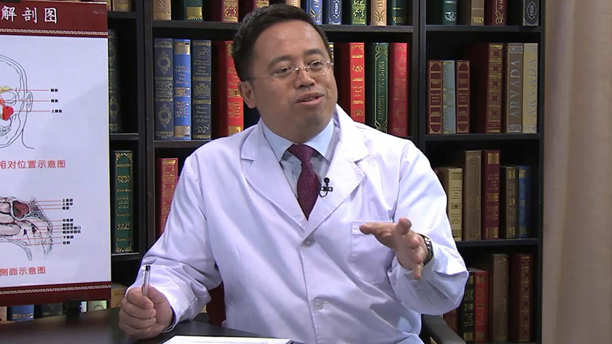

# 2.15 儿童鼻炎

---

## 谷庆隆 主任医师

首都儿科研究所附属儿童医院副院长 耳鼻喉科主任；

主任医师 硕士研究生导师；中华医学会儿科分会耳鼻咽喉学组副组长；中华医学会变态反应分会小儿学组副组长；中国医师学会儿科分会耳鼻咽喉学组副组长；北京医学会耳鼻咽喉头颈外科分会委员。

**主要成就** ：近5年申请课题5项，发表论文30余篇。

**专业特长：** 擅长儿童耳鼻咽喉头颈外科的常见疾病的诊治，包括儿童过敏性鼻炎、鼻窦炎、儿童鼾症及阻塞性睡眠呼吸暂停综合征（打鼾）的诊治等。擅长儿童功能性鼻内窥镜手术、扁桃体及腺样体切除术、气管切开术、气管及食道异物取出术、支撑喉镜下的显微外科手术等。

---
