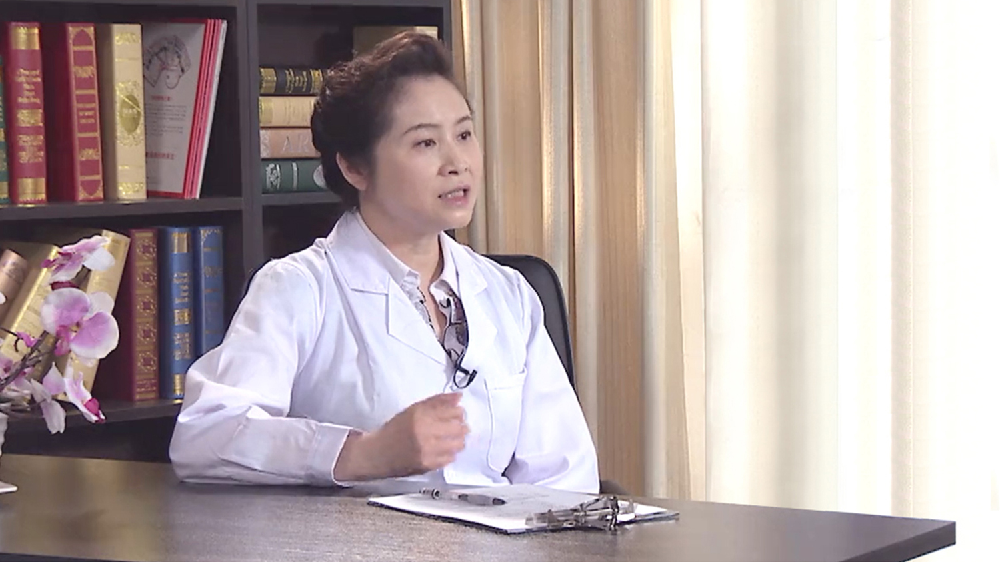

# 2.17 儿童补钙

---

## 张峰 主任医师

首都医科大学附属北京儿童医院 儿童保健中心 主任医师 特级专家；

中华医学会儿科分会儿童保健学组成员兼秘书长；中国优生科学协会理事；中国优生科学协会小儿营养专业委员会委员；北京医学会健康管理学分会委员会委员（2015年起）；妇幼健康研究会儿童早期发展专业委员会委员；全国心系系列活动专家委员会主任委员；全国“心系妇儿-家庭教育空中课堂”项目专家委员会委员；北京市健康科普专家；北京市“阳光长城”慢病防治微博科普专家；北京市计划生育协会理事；曾任首都医科大学附属北京儿童医院 儿童保健中心主任、北京预防医学会儿童保健专业委员会委员、北京市体检质量控制和改进中心专业委员会委员、北京健康管理协会理事。

**主要成就：** 在国家核心期刊上发表论文数十篇；参与20余本专业及科普书籍的撰写工作，共约170万字；撰写科普文章百余篇；为多家国内知名育儿杂志及网站的御用专家。

**专业特长：** 擅长小儿生长发育，婴幼儿喂养，儿童营养，免疫接种，构音障碍与口吃，婴幼儿日常护理以及健康教育等与儿童保健有关的内容。

---
