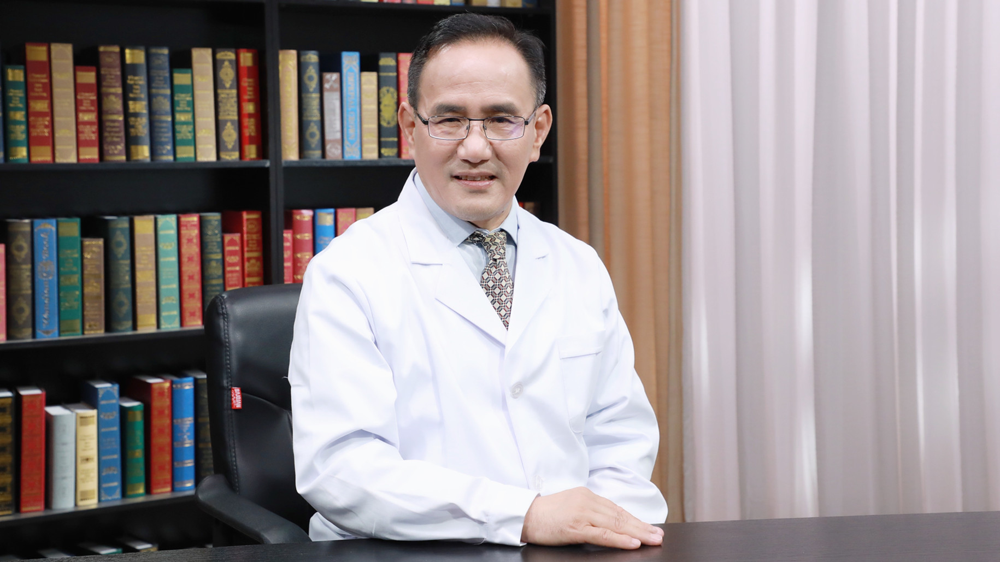

# 2.20 儿童肺功能检查

---

## 刘传合 主任医师

首都儿科研究所附属儿童医院变态反应科 哮喘防治中心与肺功能室主任 主任医师 博士生导师；

中华医学会儿科学分会呼吸学组肺功能协作组组长；中华医学会变态反应分会特异性免疫诊断与治疗学组副组长；中华医学会呼吸病学分会肺功能学组委员；中国医师协会变态反应医师分会委员；中国医师协会儿科医师分会儿童过敏学组副组长；《中华儿科杂志》《临床儿科杂志》《中华临床免疫和变态反应杂志》编委。

**主要成就：** 曾在澳大利亚阿德莱德大学妇儿医院进行博士后研究，在美国印第安纳州儿童医院进修儿童肺功能测定技术；承担了教育部留学归国基金、首都发展基金联合攻关项目、卫生部公益性行业科研专项、北京市医管局儿童过敏重点学科建设项目等；参与了GINA、ARIA在我国的推广，儿童防治哮喘指南、肺功能指南等的制定。

**专业特长：** 在儿童哮喘、慢性咳嗽、鼻炎、食物过敏、呼吸系统疾病的诊治方面积累了丰富经验。

---

## 儿童肺功能检查有哪几种方法？怎么选择？

（采访）首先您给我们介绍一下，什么是肺功能检测？

肺功能检测，其实字面理解就是肺的功能的检测。

肺是用来进行气体交换的一个器官，吸进外界的氧气，呼出二氧化碳，这是气体从外部进入肺泡的过程。

其实肺还有一个功能，氧气或者外边的空气进入到肺泡，还要进入到血液里边，肺还有一个功能就是换气。肺部一般有气管、支气管，细支气管，肺泡，还有里边很多的血管，血管和气管之间，或者和肺泡之间，有一个结构叫肺间质，它有一层隔膜，氧气必须得从这个肺泡里边进入到血液当中，或者是二氧化碳必须从血液中进入到肺泡。然后从气道呼出来，是这么一个过程。

肺功能检查设置也是这么两大部分，一个是看气体（二氧化碳）从肺泡呼出来，以及外界的氧气进入到肺泡。另一个气体交换，气体（氧气）从肺泡到血液，这一段过程，就是一个弥散功能。

儿童肺功能检测和成人有些不同，但有些也是从成人延续过来的，成年人有的项目能直接在儿童用。比方像已经上学的孩子，他的理解力和操作能力都和成人接近了，能够进行，就用成人的一些办法。有些太小的孩子，临床上像学龄前儿童，幼儿园的孩子，甚至婴幼儿，就得用儿科特有的肺功能检测方法，有些一样，有些不太一样。

在儿科有几种肺功能检查方法。对年长儿童，比方五六岁以上的学龄儿童，就用传统用力呼吸肺功能检查，用力呼吸肺功能检查就是让孩子含着口器，用力吸气，呼气，描绘出一个肺活量（FVC）和吸气、呼吸的流量关系图，叫流量-容积曲线（F-V曲线）图。这就是常规肺功能检查的一个过程，要求孩子吸气、呼气，标准动作规范操作3次就够了。当然有质量控制，有些具体的达标要求。

另外一种就是脉冲震荡肺功能检查，对孩子要求比较少，不要求孩子要用力吸气、呼气，只要求孩子含着一个口器，肺功能口器和后边测定系统连接，含着口器平静呼吸一分钟就可以了。相对来说对孩子的要求比较低，操作过程也比较短。因为学龄前儿童操作不了刚才说的用力呼气肺功能检查，他做不好，这个很多孩子能完成，可以通过这个检查看孩子肺功能损伤情况。

有时候医生可能这两种检查都做，看哪种检查孩子做得更好一些，哪种的价值更大一些。所以在学龄期前经常让孩子这两种检查都做，如果孩子能做好用力呼吸肺功能检查，价值会更大一些。如果做不好，能把脉冲震荡肺功能检查做好，从技术角度来说也能提供很大的价值。

另一个是潮气呼吸肺功能检查，就是针对婴幼儿的，因为不像大孩子，可以用力呼气、吸气，需要理解，需要一个动作。学龄前儿童虽然对他的要求不是那么高，但是至少得含着口器，不能松，不能漏气，还得坚持一分钟，婴幼儿做不到。所以婴幼儿需要镇静，让他在睡眠状态下完成，通常需要口服一定量的水合氯醛让他睡眠，睡眠以后把一个面罩和后边的肺功能检测系统连接起来，在平静呼吸状态下，看他的肺功能情况，这是潮气呼吸肺功能检查。

每次描绘吸气、呼气，平静地吸气，呼吸，一次描绘20个平静呼吸波，描绘5次，最后取一个均值。所以和大孩子的情况不太一样。这个方法相对来说敏感性，特异度，不如大孩子做的那种肺功能检查，因为特殊情况，只能选择这种肺功能检查，在很多情况下也能给临床医生提供一些参考。

---

## 儿童在什么情况下需要做肺功能检查？

（采访）主任，儿童一般在什么情况下，需要做肺功能检测？

一般情况下在儿科门诊，在呼吸门诊或者哮喘门诊，还有少数医院成立的变态反应科门诊。变态反应科门诊大部分也是看儿童哮喘，喘息，或者是食物过敏的，或者是皮肤过敏的等等，这些哮喘的孩子，喘息的孩子，无论是看变态反应科门诊，哮喘门诊，或者呼吸门诊，如果孩子来了以后明显喘，一般是要做的。

另外有些孩子可能有肺炎，肺炎可能不是一般说的支气管肺炎，着凉了，感染了，或者是一般的病毒性肺炎，这种一般不做肺功能检测。但是如果是喘的孩子，因为喘的孩子很多是慢性疾病。再就是复杂的疾病，了解了病人的病史，也做了相应的体格检查，或者做了血常规、胸片检查，还是不太明确孩子的疾病是什么，可能就要对他的肺功能做一个评估。

基本上是这些常见的喘息性疾病用得最多，尤其是哮喘用得是最多的。

---

## 儿童哮喘是怎么回事？长大后自己能好吗？

（采访）主任，儿童哮喘是怎么回事？

儿童哮喘首先是一个呼吸性疾病，同时也是一个过敏性疾病，也是一个变态反应性疾病。其实这些年儿童哮喘显著增多了，哮喘实际上像高血压，像糖尿病等等这些疾病似的，与经济水平提高或者生活方式改变，或者生活水平提高等等，与很多因素有关系。感染性疾病总体来说是少了，非感染性疾病多了，非感染性疾病里面很突出的就是哮喘。

哮喘不是细菌、病毒引起来的，大部分是有明显的过敏体质，一旦接触过敏原，导致孩子咳嗽、喘、胸闷、憋气，出现这些情况。有些孩子或者家长会告诉医生孩子喘气可能带着那种哨音，这是最典型的，有时候医生在门诊一听，听到肺里有喘鸣音，有些明显的家长有时候能听到，尤其在夜间安静的时候。另外喘在夜里往往比较突出，所以夜间比较明显。不明显的，家长说孩子根本不喘，就是咳嗽，大夫一听诊孩子喘，所以是慢性气道炎症性疾病，更多的是过敏性炎症性疾病。

这个病不好的地方是慢性的，一旦诊断属于慢性疾病，靠长期管理，长期治疗，预防控制发作。虽然不是一个完全能治愈的疾病，如果早期明确诊断，早期干预，随着孩子生长发育，免疫功能完善，好多孩子大了以后基本没问题，大概有一半以上，或者2/3的孩子到成年应该问题不大。当然还有1/3的孩子到了成年还是会留下一些，延续到成人，所以这个疾病一定要积极治疗，不要忽略。

（采访）主任，儿童哮喘更多的是孩子有过敏体质，是不是一生下来就会有哮喘？

在门诊我们碰到很多家长也经常提问这个问题。首先它不是一个遗传病，也不是一个先天性疾病，哮喘都是生后逐渐患上的一个疾病。哮喘的孩子大部分起病于5岁以前，有一半以上，有些孩子起病很早，但是诊断未必那么早。

这些年对于哮喘的认识提高了，以前大家对这个疾病的认识还不是那么充分，有些医生可能不会那么早下诊断。也有些家长对这个疾病有些忽略，觉得孩子有点咳嗽，有点喘息，犯病的时候有点着急，发作完以后正常了，又没事了，有时候也会产生忽略。

所以各种各样的因素造成了哮喘诊断不及时，治疗有时候也不到位，所以会造成一部分孩子后期可能时间更长一些，或者是预后相对差一些。

（采访）主任，有的家长会不会觉得等孩子大一点儿了，体质好一点儿了，哮喘就能自愈？

好多家长会这样问。儿童哮喘发病很多，发病很早，相当一部分孩子并不是特别重，一说哮喘有些家长不太接受，认为孩子只是咳嗽，只是有点喘息，不像电影演的喘气喘不上来，还要用喷的药物，吸入才能缓解。一般的患者或者一般的父母，不是医学领域的，很多对哮喘的印象还停留在咱们刚才说的那种情况下。

哮喘的定义，哮喘是一个异质性疾病，什么叫异质性？这个病多种多样，有轻的，有重的，有这种表现，那种表现的。发病机制其实也有很多不同，有些是明显过敏，有些孩子可能并不明显，有些是到了特定环境，接触特定的东西就喘起来，有的孩子可能感冒以后才这样。所以这个病从轻到重，从临床表现上各种各样都有。

所以回到刚才说的这个问题上，家长问的时候，可以根据病人的病史，体检情况，做一些辅助检测，做一个综合评估，孩子大概是轻是重，这个孩子以后可能会好一些，但是好多都是在变的。所以作为家长，甚至医生，不能说这个孩子大了能好，有相当一部分孩子，有1/3的孩子还是不行，这些孩子有些甚至经过治疗，甚至有些还是很积极的治疗，到后期还不行。

所以每个病人可能还得根据自己的情况，积极治疗，尽力给他一个更好的治疗管理，争取不影响孩子的生活、学习，让他和正常孩子一样生长，也不影响他以后的就业，或者以后的生活等等，达到一个最好的结局，这是应该有的正确认识。

（采访）不管孩子哮喘是轻还是重，建议要及时干预，及时治疗，以后的生活质量才会更好。

一个是提高孩子的生活质量，另一方面能改善预后。目前有些文献，尤其国外的文献也有这样的报道了，认为孩子治疗与不治疗结局好像是一样的，其实这只是个别的报道。哮喘这种疾病，从轻到重，各种各样的情况都有，有些孩子经过治疗以后，结局会不一样的，至少从临床经验感觉是这样的。

---

## 哮喘患儿的肺功能有哪些特点？治疗后能恢复吗？

（采访）主任，哮喘孩子，他的肺功能会有什么样的变化？

哮喘孩子的肺功能还是很有特点的。哮喘的定义，哮喘是慢性气道炎症，气道炎症造成孩子的气道反应性增高，或者有慢性炎症，同时气道反应性增高。在这个基础上，一旦受到各种各样的刺激，造成气道收缩，气道黏液分泌，或者气道壁肿胀等等，造成气道阻塞，就会影响通气。

通气包括从外界吸入气体，还有从肺里呼出气体都受影响，病人表现为喘息、气短，或者呼吸困难，就很明显了，顺理成章病人就产生这种相对症状。这种情况其实测肺功能，最常用的是用力呼吸肺功能检查，叫流量-容积曲线（F-V曲线），因为气道阻塞，吸气吸不进那么多，呼气也同样呼不出来，比较容易测到。

哮喘患者的肺功能，体检（听诊）可以听到哮鸣音，有些病人可能哮鸣音也没有了，因为吸气几乎吸不进去，也呼不出气体了，比较危急的状态，但是也有轻的病人肺部听诊没问题。

另外从肺功能的角度来说，是一个气流阻塞，同时呼气表现得更明显。

另外还有一个特点，气道阻塞它是可逆的，不像有些疾病造成的气道压迫或者气道损伤，对肺功能的影响是不可逆的，哮喘引起的气道阻塞，气道平滑肌收缩，经过药物治疗，或者病情比较轻，缓解以后肺功能还是能恢复的，至少恢复到发作前的水平。所以哮喘是气道阻塞性疾病，是可逆性的气道阻塞。

哮喘患者的肺功能，主要从这两方面，看气道有没有阻塞，看气道阻塞是不是可逆的。另外看气道反应性高不高，哮喘病人几乎100%气道反应性会增高，当然气道反应性增高不都是哮喘，应该是有这么个情况。

---

## 儿童哮喘需要和什么病区分开？

（采访）主任，儿童哮喘需要和哪些疾病去鉴别？

儿童哮喘需要鉴别的疾病可能还是这些造成喘息，造成呼吸困难的疾病。

比方有时候像儿科早期儿童毛细支气管炎比较多，有些毛细支气管炎第一次喘，通常不诊断为哮喘，但是有些孩子后期断断续续喘起来。什么情况下诊断哮喘，需要医生来掌握，一般孩子以前没有气道病史，不会诊断为哮喘，一般是呼吸道感染，或者是上呼吸道感染，或者就是支气管炎。需要鉴别的就是咳嗽变异性哮喘，只咳嗽，所以和这些需要鉴别。

再一个就是肺炎，肺炎有些症状不太明显，有些有明显的发热，有着凉病史，或者听诊听见肺泡，水泡音，比较好诊断，或者医生给病人拍一个胸片，看到有肺炎，这些需要鉴别诊断。

另外还有些儿科比较少的疾病，就是闭塞性支气管炎。孩子得了一场肺炎以后总是喘，有些特别像哮喘，也需要鉴别诊断。

这些是感染性疾病，还有一些所谓的非感染性疾病，比如气管异物，气管不小心卡了东西，比如笔帽或者是花生呛到气管去了，家长看到的情况下，就是明显的一个气管异物，很多情况是家长不知道，或者是孩子自己也忽略了，他也不知道什么时候不小心吸到气管里了，病史不太清楚，体检也不太明显，这些需要鉴别，会造成喘，而且喘的时间会长，如果不明确诊断，进一步治疗就是一个问题。

还有一些胃食管反流也会造成咳嗽，一反酸就刺激气道，刺激咽部造成咳嗽。

还有一些比较少见的，像这些年儿科已经诊断比较多的，西方国家比较多的肺囊性纤维化，还有纤毛不动综合征之类的，还有比较少见的气管软化，或者是气道畸形，有些是先天的气道没长好，也会喘。当然有些特别重的，一生下来可能就表现出来，有些不是那么重，到了一定的年龄阶段或者到了某个时机表现出来了，这是一部分。

另外还有一些不是呼吸系统疾病，影响了肺脏，或者有心脏这方面的疾病，也表现喘。

甚至还有一些心理方面的疾病，像过度呼气综合征，有些孩子有，成人可能也有。有些孩子比较紧张，或者心理压力比较大，在某些情况下喘气特别快，特别急。我们偶尔也会在门诊碰到，家长说孩子喘得很重，甚至去急诊，孩子喘，但孩子看起来脸色红润，口唇也没紫绀，一听肺部也没问题，做肺功能检查完全正常，所以这个肯定不是哮喘。

所以有时候一个很客观的检查，能帮助医生明确这个疾病。虽然有时候可能诊断不了这个疾病，但能肯定不是这个疾病。有时候在诊断上意义还是比较大的。

（采访）主任，儿童哮喘和其他一些比如肺炎，或者您提到的一些心脏病，一些心理的问题引起的喘息，通过肺功能检测是可以区分开的，还是需要一些辅助手段？

因为疾病的诊断或者鉴别诊断是从各个方面进行，有时候一听病史肯定是哮喘，或者不是哮喘，就很明确。有些家长带着孩子来看病，说不清病史，但是医生一听诊，一体检，孩子80%、90%就是哮喘。家长如果提供不了太多病史，或者提供的病史不太特异，或者医生体检也没发现什么，这时候需要做客观检查了。

这些客观检查就是实验室检查，医院那么多检查先进行什么检查？在提供病史的基础上，首先考虑是哮喘，还是肺炎，还是心脏方面的问题，或者是情绪方面的，心理方面的问题，总会有线索，所以有时候病史很重要。

医生通过病史能判断孩子大概是什么病，所以还得根据具体情况。像喘息是不是一听诊是很典型的哮鸣音，孩子以前没有什么其他疾病，不做肺功能也能明确诊断了，做肺功能检查就是更明确一下，或者进一步评估一下孩子，除了他说的症状还有体格检查发现的喘鸣音的情况，喘息的情况，还可以从肺功能角度来看一下，肺功能损伤的轻重程度。

所以根据具体情况，像咳嗽变异性哮喘，咳嗽变异性哮喘是比较轻的哮喘，大部分孩子做肺功能检查问题不大，基本是正常的。一部分孩子肺功能可能稍微有一点低，有点差，极个别孩子肺功能有很明显的问题，这种诊断就比较明确了。所以还得根据病人初步的病史，初步的体格检查，先选择进行哪方面的检查。

当然像血常规这类的，无论是哪种疾病，到了医院基本上都要做的，提供一个基本的线索。比方孩子要有过敏或者感染，就像肺炎似的，有时候可能白细胞增高了。像医院细菌性肺炎，或者是病毒感染，淋巴细胞增高，或者有CRP（C-反应蛋白）增高等等，这些有时候基本上就不考虑哮喘。因为哮喘大部分情况不是感染性疾病，但是感染也会造成哮喘。

所以哮喘的孩子也得看他，这次发作是因为着凉，因为呼吸道感染引发的，还是接触过敏原，或者受到化学、物理刺激，没感染就不会有发热，不会有这种炎症性疾病，所以有时候查血常规可能不是看白细胞，也不看CRP，可能是要看看嗜酸性粒细胞，过敏方面的改变。

（采访）主任，儿童做肺功能检测，一方面是可以帮诊断疾病，一方面也可以排除一些疾病，还要根据孩子的病史，一些症状，医生再去判断，再辅助一些其他检查。

是这样的。

---

## 哮喘患儿做肺功能检查有什么作用和意义？

肺功能检查对最典型的疾病比方哮喘，它的价值在哪里？

一个是帮助诊断。还有比方气道畸形的，肺功能也有问题，但肺功能改变跟哮喘不一样，所以起到鉴别诊断的作用。或者有些喘是间质性疾病，间质性肺病肺功能也是损伤的，但肺功能损伤和哮喘也不太一样，间质性肺病不是可逆的，甚至不是气道阻塞，它是间质性疾病，这是鉴别诊断。

另外就是病情评估。还有孩子治疗效果好不好，一方面从病人反映的，咳嗽、喘缓解了，肺部医生听诊哮鸣音也少了，或者没有了。肺功能恢复了多少，所以也是治疗效果的反应。

另外哮喘这些慢性疾病需要长期随诊，有些家长带孩子来了以后，说孩子最近不咳嗽，不喘，什么问题都没有，甚至还爬山，也没发现什么问题，孩子也很正常，一测肺功能不行，也有这种情况。

所以对哮喘的孩子，通常建议无论哮喘发作不发作，3个月，最多半年一定要来查一下肺功能，有时候能帮助发现一些隐匿的情况。当然这种情况比较少，但是发现一个就对病人很有意义。

及时进行干预治疗，否则时间长了，可能就纠正不回来了，可能比较难纠正，或者是肺功能一直比较低，活动很好，这种孩子一旦接触过敏原，或者接触量比较多，或者受的刺激比较大，或者感染比较重，哮喘发作会很重，如果治疗不及时，有时候可能比较危险。

肺功能检查对哮喘的价值，从疾病开始诊断到后期管理，都有所体现，都能用得上，做肺功能检查的目的是什么？是为了诊断，是为了评估，还是为了后期做好监测，或者后期孩子哮喘不发作，肺功能水平怎么样，如果孩子的肺功能一直往下走，需要找找原因。

---

## 肺功能检查能对哮喘患儿的病情进行分级吗？

（采访）主任，儿童肺功能检测，能对哮喘的病情，严重程度进行判断、分级吗？

能，纯粹从肺功能角度，有一个所谓的诊断标准，肺功能某些指标到了什么水平，下降到什么水平就是有问题了。

还有一个就是轻重度分级，轻度肺功能目前常用的是流量-容积曲线（F-V曲线），比方最重要的一个指标就是一秒量（FEV1），目前根据一秒量下降水平有个分度，有一个比较老的标准，国外、国内用了很多年的标准，比较简单。

比方一秒量占预计值的80%以上认为是正常，小于80%就认为有问题，60%-80%之间算轻度肺功能损伤，40%-60%之间是中度的肺功能损伤，40%以下是比较重的肺功能损伤。

美国胸科协会和欧洲胸科协会10多年前推出一个更细的诊断标准，诊断标准就是分级标准，有点不太好记忆，和临床的病情符合度可能更高一些，但是分得太多了，有时候不便于医生记忆，所以很多医生还是习惯用老的标准，初步判断一下，给病人，给医生一个粗略的判断，肺功能损伤是重的，是轻的，是特别重的。

更多的费用是一方面，再就是轻度和重度的划分界限。比方FEV1占预计值的79%，属于轻度肺功能损伤，但是61%也属于轻度的，跨度其实很大。应该有分度，但是更重要的是具体的水平，对一个病人来说，他在哪个水平上。

如果划分属于轻度的，其实和中度已经离得很近了。因为分度都是人为的，都是从某个角度大概分了一个级别或者一个类别。但是对一个具体的病人来说，可能要看具体的值在哪儿，这是最重要的。

---

## 哮喘患儿在什么情况下不适合做肺功能检查？

（采访）主任，哮喘孩子哪些情况下是不适合做肺功能检查的？

不是说哮喘孩子不能做肺功能检查，孩子如果存在其他问题，好多检测都有适应证、禁忌证。

如果从对哮喘的诊断、鉴别和管理的角度应该都做，但是如果孩子比方有中耳炎，需要用力吸气、呼气，可能就不能做。或者孩子像成人有血管疾病，或者是心脏疾病的，原则上用力吸气、呼气会受影响，比方像比较少的潜在的血管瘤，或者有呼吸道感染，就是感染性比较强的疾病，有时候急性期期不建议做，急性期过去以后还是要做的。

所以看病人具体的情况，所以对哮喘这个疾病来说，不能说哪些病人不能做，只是哪些情况下可能不太适合做，不存在这些情况，刚才说的那些肺功能检测的禁忌证，应该进行检测。孩子现在是哮喘发作了，还是哮喘比较稳定，还是后期这几年都不犯了，要看看肺功能水平怎么样，应该是这么个情况。

---

## 孩子几岁可以做肺功能检查？有年龄限制吗？

（采访）主任，肺功能检测有没有年龄限制？

肺功能检测从儿科来说，上限没有年龄限制，但是太小的孩子，比如像1岁以下的孩子，诊断哮喘的比较少，半岁以内基本上不诊断哮喘，因为1岁以内的的孩子大部分都是毛细支气管炎，或先天性疾病造成喘的比较多一些，或者是肺炎比较多一些。

当然1岁以下不能说不诊断，半岁以内诊断比较少，哮喘是一个慢性疾病，还没到疾病完全形成的程度，肺功能检查从哮喘的角度来说，一般1岁以上就可以进行了。1岁以下有些病人高度考虑哮喘，比方6个月到1岁，高度怀疑孩子可能有哮喘，也可以做，做婴儿适用的潮气肺功能检查。

另外就是肺功能检测，目前从肺功能技术来说，国家技术水平提高，诊断水平提高，另外妇产这一块整个水平提高，现在早产儿比较多，早产的孩子有好多肺发育不良的，新生儿科的医生，还有呼吸专业的医生，甚至急救科的医生，对这一块新生儿也有这方面的研究，就是想看看这些孩子他的肺功能损伤到了什么程度，什么情况，对当时的疾病评估，还有后期的恢复，还有长期预后也想做一个了解，也能进行这方面检测，纯粹从肺功能检测技术角度出发。

其实在国外早就有报道，这些年国内也有对新生儿进行肺功检测的报道，如果从整个检测技术角度来说其实是没有年龄限制的，患者只要有肺部疾病，肺部疾病影响肺功能，不存在禁忌证就可以检测，检测采用的技术不一样，想了解的情况不一样。

---

## 哮喘患儿做肺功能检查前需要注意什么？用停药吗？

（采访）主任，有哮喘的孩子在做肺功能检测之前需要准备什么？

哮喘孩子做肺功能检查之前，不单是哮喘的孩子，所有孩子做肺功能检查之前都应该注意这些，不要吃太饱。另外要休息一会儿，在检测前一般安静待一会儿。

有些哮喘孩子用着治疗哮喘的药物，一般要告诉病人，在这之前，尤其肺功能检查里边有个支气管舒张试验，做这个检查之前不能用支气管舒张剂，用了支气管舒张剂，气道本来有阻塞，用了以后就扩张开了，或者气道阻塞就不那么明显了，这时候做肺功能检查就不太容易发现问题，或者做支气管舒张试验，因为已经用过药，支气管在很大程度上已经舒张开了，再做舒张试验就很难发现问题了，这是从药物方面。

另外做运动激发试验，还有很多其他的药物也要停掉，影响激发试验的，像吸入激素一般要提前3天停掉，或者抗白三烯药物，笼统地讲一般让病人提前3天停药，从药理角度这个药作用多长时间，那个药作用多长时间，比如短效的药当天停就可以，或者停四五个小时就可以，这是从药理角度，病人有时候记不得那么准，所以有时候笼统地告诉病人做肺功能检查至少当天早上不吸药。

最近的指南提出，长效支气管舒张剂前天晚上也不应该用，彻底消除药物对肺功能的影响，这时候做出的检测可能更准确，更能反映问题。

当然还有一个问题，我们要了解不用药的情况下，肺功能的情况，有时候是为了诊断，有时候是为了病情评估，或者是看他病情控制情况怎么样，有些情况就想看孩子用药的情况下肺功能怎么样，要出于这种目的，药就不一定要非要停。

所以看具体的病人，医生具体的考量在哪里。一般来说肺功能检测，孩子感冒期间，尤其是传染性比较强的，先不要做了，肺功能检测总体要求相对来说不是太多，就是药物这方面要求多一些。

（采访）对于药物停不停用，看肺功能检测的目的是什么。

对，一般要建议病人停药。尤其到后期准备给病人减量了，要停药了，这些情况肯定建议病人不用药，看肺功能情况怎么样，挺好的话可能停药更准确一些，或者是更放心一些。

---

## 孩子做肺功能检查不配合怎么办？

（采访）主任，做肺功能检测的时候，孩子不配合怎么办？

孩子不配合，就看孩子不配合的原因在哪里。

有些孩子比方就是理解能力不行，有时候做不好，其实不是不配合的问题，因为做肺功能检查是让孩子用力吸气，呼气，叫他操作，叫他能完全理解，能够完成一些动作。比方用力呼吸肺功能检查，可能有时候孩子一进医院就紧张，他就不高兴。很多是情绪性的问题。

要从家长的角度，医生的角度，或者从技术员的角度，给孩子更多的安慰，讲解。很多孩子到医院是怕扎针，怕输液。常用的肺功能检查就是用力吸气、呼气，而且里边还有一些动画引导他怎么做，对孩子是一个无创性操作，应该对孩子没什么影响。如果孩子了解以后，孩子可能就配合，所以看具体不配合的原因是什么。

当然有些孩子可能理解能力差一些，或者他的动作能力差一些，有时候他能听懂，有时候动作总是跟不上，可能这次做不了，过两三个月以后可能就能做了。

前两天我们还看到一个孩子，用力呼吸肺功能检查，刚3岁的时候做了一个，检查做得不是太理想，没太多参考价值，因为这个病人是定期随诊的，肺功能每次检查都不一样。第4次肺功能检查就非常漂亮了。

有时候在肺功能检查室，前面孩子在做的时候，就让后边的孩子看着，其实孩子的模仿能力，学习能力，大部分还是很强的。当然还得看每个医院肺功能室的具体情况，如果能在外边有录像，有视频，让孩子先了解了解，大人先了解了解，孩子就能配合好。

所以好多看什么情况，因为主观原因造成的，从主观上找原因，如果是客观的原因，孩子理解能力差一些，或者理解能力没问题，动作能力差一些，这个不能着急，也不能太勉强。

我们也碰到过，医生开了肺功能检查单子，孩子有点情绪问题，或者有点哭闹，家长非要坚持做，觉得检查做不了，好像医生就不能诊断，或者下一步就没法治疗，非要坚持做。所以希望患者或者家长能理解一方面检测是比较重要，但是有时候也不能太勉强，有时候这孩子情绪过不去，这次可能不能进行，等下次来了以后就可以做了。

（采访）孩子不能配合，可能孩子比较小，理解不了，或者动作跟不上，或者有些孩子可能比较紧张、害怕，配合不了，家长或者医生需要引导一下，安抚一下他。

对，是这样的。

---

## 儿童做用力呼吸肺功能检查一般需要多长时间？

（采访）主任，儿童做肺功能检测一般需要多长时间？

肺功能检测用得最多的，比方像流量-容积曲线（F-V曲线），其实就是让孩子用力吸气，呼气，一个动作，做得好就吹出一个流量-容积曲线（F-V曲线），做3次就完事，快的可能5分钟、10分钟就完事了。

当然有些孩子做不好，一次做不好，两次做不好，可能时间比较长了，有些10分钟甚至15分钟都做不了。

---

## 儿童做肺功能检查，做支气管舒张试验时要注意什么？

支气管舒张试验就是孩子做一次肺功能检查，中间要吸一次药，吸支气管舒张剂，把气道扩开后，再看肺功能能恢复多少。需要病人做一次肺功能检查后，然后做雾化，雾化一般10分钟到一刻钟，再去做第二次肺功能检查，不要着急，不能吸完药马上就做，马上就做有时候气道达不到充分扩张。

支气管舒张剂，是比较常用的药，也是时间比较长的药，大部分支气管舒张剂没什么副作用，个别孩子可能对支气管舒张剂有点敏感，个别的有手抖，就是肌肉震颤。雾化的支气管舒张剂其实不良反应很少，口服的可能多一些，孩子应该没什么特别注意的，就是做舒张试验的时候，对药物吸入时间有要求，有时间上的要求。

---

## 儿童肺功能检查报告单怎么看？主要看哪些指标？

（采访）主任，儿童做肺功能检测之后，报告单应该怎么看？主要看哪些指标？

首先看报告单的内容是什么，无论是哪一种肺功能检测报告单，都有基本的信息，病人的姓名、年龄、住址，甚至有些可能留上联系电话，以防万一用到。

第二部分就是这些图，还有一部分就是数据，不同的肺功能检测技术不太一样。最后就是一个检测结果的描述，这是技术员或者医生，肺功能室的医生做的，最后给出一个结论来。

孩子通过做肺功能检查，初步判断是哪种情况，所以有几块内容，作为医生，一般来说对肺功能比较熟悉的医生一看这个图，比方流量-容积曲线（F-V曲线）图，一看图就知道肺功能问题大概在哪里，当然需要了解具体的情况，可能还要看数据。最后的结论，肺功能室的技术员或者是医生做一个初步的结果的描述，或者做一个初步的结论。

这个结论纯粹从肺功能角度来说，就像放射科拍胸片或者做CT，是从放射科的角度，从影像学的角度给出一个图片结论，但是作为医生可能还要考虑病人具体是什么病，结合肺功能再看一下，最后这个肺功能它的价值在哪里，帮助发现哪些问题。

所以两个角度，一个是肺功能室给出一个报告来，作为医生一定要结合临床，不能只看结果的描述，或者看这个结论，因为肺功能检查在儿科相对比较专业，开展的时间也比较短，很多临床医生对肺功能检查这一块了解得还不是那么深入，看结果一定要注意结合病情。

作为家长，其实肺功能检查报告就像心电图，它是专业性很强的，家长就想知道肺功能到底怎么样，一般了解大概的情况就就可以了。不需要了解这个值是多少，那个是值多少，轻度的、中度的、重度的，大概了解一下就可以了，医生有时间他会给你讲解，只能做一个大概的了解。

（采访）主任，从医生的角度比较关注的指标有哪些？

比较关注的指标得看是做的哪个肺功能检测项目。

最常用的流量-容积曲线（F-V曲线），流量-容积曲线提供很多指标，有所谓的一秒量（FEV1），还有一秒率（FEV1/FVC），还有肺活量（FVC），还有小气道的指标，还有峰流速（PEF），这几个指标上都是比较重要的，当然一秒量和一秒率对诊断喘息性疾病，比方像哮喘，改变最明显，比较特异。

但是如果孩子是慢性肺病，间质性肺病，问题主要不是出现在气道上，更多的时候出现在肺间质这块，这个时候可能影响肺活量，肺活量可能更重要一些。所以作为常识来说，一般来说一秒量、一秒率主要是反映气道阻塞情况，还有峰流速也是反应气道阻塞的指标。

脉冲震荡肺功能检查里边参数也很多，主要是看总的阻抗，或者看总的气道阻力，或者看电抗值，主要是看这几个参数。另外就是潮气肺功能检查，里边主要看达峰时间比（tPTEF/TE），达峰容积比（(VPEF/VE），看潮气量（TV），看呼吸频率，或者是看吸呼比，主要看这几个指标。

---

## 孩子做肺功能检查，什么情况下需要做支气管舒张试验？

（采访）主任，什么情况下要做支气管舒张试验？

这个问题其实是每个临床医生必须要掌握的。

舒张试验的目的是看气道有没有阻塞，阻塞是不是可逆的，所以这种情况应该是病人发病的时候做，肺功能有问题做舒张试验，用舒张剂把气道打开，再看肺功能有没有改善。

所以前提就是病人有哮喘发作，哮喘发作可能病人有咳嗽，有喘息，或者是病人没咳嗽，没喘息，但是肺功能不好，所以肺功能有问题就做舒张试验。

---

## 孩子做肺功能检查，什么情况下需要做支气管激发试验？

（采访）主任，什么情况下做支气管激发试验？

激发试验的原理，是给病人一定的刺激，看肺功能改变情况。所以不能说有病的时候，再给药物刺激或者运动刺激。应该是在哮喘缓解期或者是慢性持续期进行激发试验。

另外就是病人有咳嗽，有喘息，有这些症状，怀疑哮喘，但是临床医生体检的时候没发现什么问题，做肺功能检查也正常，这种情况下做激发试验。

通常用得最多的是药物激发，还有一种就是运动激发，给一定的运动量，一定的时间逐渐增加。药物也是这样，先给一个低剂量，再给高剂量，按照程序这么走下来。有哮喘的孩子药物激发基本上都能阳性，就能明确诊断。

运动激发相对来说阳性率低一些，阳性率低一些是什么意思？有些有哮喘，做了以后结果还是阴性的，还是不能确诊，咱们刚才说是在非急性发作期，就是慢性缓解期，为了明确诊断，病人是初诊来的。

另外病人控制一段时间，用了一段时间药物，孩子哮喘很稳定了，想停药，或者有些医生准备给患者减量，肺功能也正常，这时候再做一个激发试验，看气道反应性，气道反应性是不是比治疗前好一些了。或者经过治疗，经过半年或者1年治疗，或者至少3个月治疗，气道反应也低了，这时候减药、停药可能就更放心，更好一些。

激发试验用于指导药物治疗这一方面做得还是比较少，因为激发试验做起来比较比较费时，好多医院进行不了激发试验，所以激发试验用得相对少一些。再就是有些医院或者医生对激发试验了解还不够，另外有些家长对激发试验有误解，认为给孩子刺激，本来孩子有病再刺激，不是很了解这个过程，可能有些疑问，存在一些问题，各个方面问题造成的。

---

## 孩子做肺功能检查，支气管舒张试验阳性，可以诊断为哮喘吗？

（采访）主任，支气管舒张试验结果阳性，这个代表了什么？

舒张试验阳性，结合病史基本上诊断哮喘了，但不是100%的。

有些其他疾病，比方像国外CF（囊性纤维变性）比较多，国内也有，也会有气道的炎症，气道一旦有炎症，可能刺激平滑肌收缩，有气道阻塞，或者像闭塞性支气管炎，它是气道的一个炎症，也能造成气道反应性增高，甚至造成平滑肌收缩，或者有分泌物造成气道阻塞，这时候做舒张试验也有可能是阳性的，所以不是100%的。

但是如果结合比较典型的病史，再加上舒张试验阳性，基本上就明确诊断了。

---

## 孩子做肺功能检查，支气管激发试验阳性，可以诊断为哮喘吗？

（采访）激发试验结果阳性，代表什么？

气道激发试验，哮喘的孩子基本上99%都有气道反应性增高。所以激发试验是帮助明确诊断的工具。

有些孩子有明显的喘息，说得很清楚，体检很明确，这种情况下通常用不着做激发试验。

对不典型的，病史不太清楚的，或者病情比较轻的，体检也没发现什么阳性体征，以及病人的肺功能也正常，这种做激发试验，药物激发阳性率很高，运动激发相对低一些。

但是从另一个角度来说，阳性也不是都是哮喘，因为有些呼吸道感染以后，气道反应性会高，一般是过一段时间，比方过一个月再做，或者肺炎之后，刚刚得肺炎还在恢复期，这时候气道反应性也是高的。

另外有些鼻炎的孩子，鼻炎很常见，比哮喘更常见。所以有些孩子因为鼻涕往后流，鼻炎发作的时候流鼻涕，鼻涕可以往前面流，也可以往嗓子里边流，所以有些孩子会清嗓子，甚至咳嗽，有时候不太好分辨。这种情况下，有好多孩子气道反应也高，高的比例还挺大的。

有鼻炎的孩子，怀疑哮喘的，做了气道激发试验，即便是阳性，有时候这个诊断还不好下，当然这种情况相对来说比较少一些。

---

## 婴幼儿做潮气呼吸肺功能检查使用的镇静剂，对孩子有影响吗？

（采访）主任，有的家长觉得孩子这么小，婴幼儿要做肺功能检测，要给他镇静，会不会对孩子有什么影响？

这是很多家长担心的问题，觉得是药三分毒。

目前用的镇静剂或者睡眠药，这个药其实不光是做肺功能检查用，比方做CT，婴幼儿要待很长时间，也同样用这种药，还有临床上很多检测，也需要孩子在睡眠状态下完成，不能太哭闹，太哭闹操作没法做。

做肺功能检查和做CT用的药物是一样的，就是口服水合氯醛，有的地方也可以灌肠使用，因为水合氯醛口感不是那么好。有些孩子可能拒服，或者吃了以后就吐掉了，这种情况可能需要重新吃药，如果孩子再吃还吐，这个时候短期内一般吐得不太多可以再吃一点，叫他充分睡眠，因为睡眠要有一段时间，时间太短完成不了。

这个药物其实是非常安全的，一个很老的，很传统的药物，安全性其实家长都不用太担心，没问题，当然因为口感不好，孩子哭闹造成呕吐，绝对不能造成呛咳，一呛咳会造成孩子相应的问题，这个药物本身其实没问题。

镇静药用完以后，有些孩子可能做的期间就醒了，有些孩子就做不下去了，有些孩子可能做完了以后还不醒。这时候一般孩子醒了以后，看孩子没问题了，让孩子再离开。因为担心有些孩子在睡眠状态，比方像做潮气肺功能检查，不要刚吃饱饭来做，因为孩子一用力吸气、呼气，或者小不点孩子刚镇静以后，造成咳嗽、呕吐，这些方面的问题。

所以婴幼儿做潮气肺功能检查，一般是要求孩子醒来以后，看着完全正常，基本正常了再离开。

---

## 孩子哮喘已经控制住了，为什么还要做肺功能检查？

（采访）主任，有的家长可能会有疑问，孩子做过肺功能检测，现在孩子的症状也控制好了，为什么还要再做一次肺功能检测？

这个问题的确是很多家长常问的一个问题。孩子哮喘控制了，为什么要做肺功能检查，有这么几个层面。

肺功能一方面是用于诊断，另一方面用于病情评估。对哮喘的治疗目的要达到没有咳嗽，不喘，肺部听诊也没有啰音，另外还要达到肺功能正常，没有症状。

肺部听诊没有哮鸣音，但是肺功能未必正常，有一部分孩子正常，有一部分孩子肺功能可能不好，或者很明显的不好。有些患者没咳嗽，没喘，甚至运动也不受影响，看起来很好，但肺功能差的还比较多。所以这种情况应该积极地进一步干预，寻找原因，明确诊断，尽量让孩子肺功能达到正常，主要是这么一个考量。

另外有肺功能不是一成不变的，就像哮喘这个疾病本身的特点就是，遇到刺激，遇到呼吸道感染，或者遇到过敏原，哮喘发作起来，肺功能也是跟着变化的。哮喘一发作肺功差了，哮喘不发作肺功能可能是正常的。

当然也有刚才说的，肺功能还是不好，存在这个问题，需要管控好临床表现，还要了解肺功能的情况。因为症状在变，肺功能也在变，有时候能保持一致，有时候脱离这种情况。有些孩子症状很明显，但是肺功能正常，或者有些孩子症状不太明显，肺功能有问题。

根据这个情况，需要定期查肺功能，比方有些孩子有鼻炎，到了过敏季节鼻炎症状很明显。家长说孩子没咳嗽，只是有点清嗓子，一查肺功能也有问题，所以这时候需要做肺功能检测，看肺功能有没有问题，在不在正常水平上。

可能家长的概念觉得肺功能检测做一次就够了，就像血常规检查一样，上次做过血常规，为什么这次还做血常规。同样一次感冒发烧，开始发烧的时候做了一次血常规检查，到了第3天或者过了5天或者一星期，又要查血常规。

其实症状在变，病的体征在变，肺功能，其他的指标也在变。如果医生想了解得更清楚，想了解更进一步的信息，更准确地把握疾病，还是需要做检测。

---

## 哮喘患儿多久应该做一次肺功能检查？

（采访）主任，哮喘的孩子建议定期做肺功能检测，一般隔多久做一次？

这个取决于孩子的病情情况，如果是急性期，哮喘发作明显，很重的哮喘发作，这时候大部分孩子症状很重，肺部听诊也很重，做的肺功能也很差，这种孩子有时候第3天或者第2天，还要求病人再来。

目的就是看他恢复的情况怎么样，所以有时候这些特别重的孩子，住院的孩子，一般第2天都想看一下肺功能，一方面正常缓解下看肺功能改变情况，在门诊像这种重的，一般第3天或第5天，最多一个星期以后一定要回来，回来以后一定还要查查这个问题，看症状和体征的恢复情况，还要看肺功能恢复情况。

如果这个孩子病情比较稳定，一般像急性期发作过去以后，经过三五天或者一个星期基本上控制了，一般要求病人1个月来一次，看后期恢复情况怎么样。如果孩子病情特别稳定，一般3个月就够了。长期用药或者是未用药，要求病人定期复诊，病情很稳定的情况下，一般建议病人3个月查一次肺功能应该就可以了。

---

## 哮喘患儿做肺功能检查前治疗哮喘的药物要停用多久？

有些哮喘孩子用着治疗哮喘的药物，一般要告诉病人，在这之前，尤其肺功能检查里边有个支气管舒张试验，做这个检查之前不能用支气管舒张剂，用了支气管舒张剂，气道本来有阻塞，用了以后就扩张开了，或者气道阻塞就不那么明显了，这时候做肺功能检查就不太容易发现问题，或者做支气管舒张试验，因为已经用过药，支气管在很大程度上已经舒张开了，再做舒张试验就很难发现问题了。

另外做运动激发试验，影响激发试验的，像吸入激素一般要提前3天停掉，或者抗白三烯药物，笼统地讲一般让病人提前3天停药，从药理角度这个药作用多长时间，那个药作用多长时间，比如短效的药当天停就可以，或者停四五个小时就可以，这是从药理角度，病人有时候记不得那么准，所以有时候笼统地告诉病人做肺功能检查至少当天早上不吸药。

最近的指南提出，长效支气管舒张剂前天晚上也不应该用，彻底消除药物对肺功能的影响，这时候做出的检测可能更准确，更能反映问题。

当然还有一个问题，我们要了解不用药的情况下，肺功能的情况，有时候是为了诊断，有时候是为了病情评估，或者是看他病情控制情况怎么样，有些情况就想看孩子用药的情况下肺功能怎么样，要出于这种目的，药就不一定要非要停。

一般要建议病人停药，尤其到后期准备给病人减量了，要停药了，这些情况肯定建议病人不用药，看肺功能情况怎么样，挺好的话可能停药更准确一些，或者是更放心一些。

---
