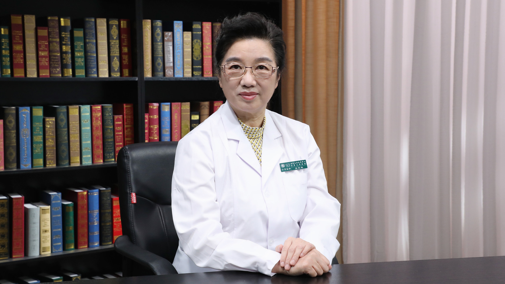

# 2.21 儿童分泌性中耳炎

---

## 张亚梅 主任医师

首都医科大学附属北京儿童医院耳鼻咽喉头颈外科主任医师 教授 硕士生导师；

中华医学会儿科学分会耳鼻咽喉学组组长；亚太地区小儿耳鼻咽喉协作组中国成员；《中华耳鼻咽喉头颈外科杂志》《临床耳鼻咽喉头颈外科杂志》《中国耳鼻咽喉头颈外科杂志》等杂志编委。

**主要成就：** 《实用小儿耳鼻咽喉科学》第一版主编；2020 年被中国医师学会耳鼻咽喉头颈外科分会授予“资深名医奖”。

**专业特长：** 从事小儿耳鼻咽喉工作30余年，对儿童睡眠呼吸障碍的诊治、小儿上呼吸道急症具有丰富的经验；在儿童分泌性中耳炎、变应性鼻炎、鼻-鼻窦炎方面也有较深入的研究。

---

## 儿童分泌性中耳炎是怎么回事？常见吗？

（采访）主任，儿童分泌性中耳炎是怎么回事？

实际上分泌性中耳炎就是中耳腔里边有积液，所以叫分泌性中耳炎。我们知道中耳腔里边基本上是空的，里边有听小骨，里面有积液以后就会带来一系列问题。

（采访）儿童分泌性中耳炎在临床中比较多见吗？

其实是非常常见的。小孩有人统计过，大约90%的孩子在学龄前，可能都得过一次分泌性中耳炎，怎么能够到90%那么多，几乎每人都得过，实际上有时候因为没有特别的症状，或者孩子他不会主诉，不会说出来，所以就没有发现。大孩子就会明显说出来，说耳朵发闷，听不清楚东西，他就会跟家长说。

实际上我们真正检出率，真正检查出来的，大约有2%-30%的，实际上得的人很多。特别是一岁以内可以达到50%，两岁以内可以达到60%，越小的孩子得的几率越大。

（采访）这个病在儿童当中还是比较常见的。

对，非常常见。

（采访）主任，儿童分泌性中耳炎通常是单耳发病，还是两个耳朵都会发病？

都有，有的是单耳，有的是双耳。因为左右耳朵是完全分开的，整个鼻咽部的感染，可以往两边，可以往一侧，所以两侧耳朵都可能会出现的。

（采访）都可能出现感染的可能。

对，都会出现，可以双耳同时出现分泌性中耳炎，也可以是单耳出现，当然一侧出现好了以后，另外一只耳朵又出现症状了，这种都是可以遇到的。

---

## 儿童为什么容易得分泌性中耳炎？

（采访）为什么儿童容易得分泌性中耳炎？

有几个因素：

首先一个是解剖因素。我们知道鼻子跟耳朵之间有一个管，叫咽鼓管，这个咽鼓管儿童的特点是比较宽、短、平，水平位，所以有时候口咽部或鼻咽部的一些感染很容易过去。另外一个，给小年龄的孩子喂奶的时候，孩子平卧位喂奶，有的时候孩子一呛奶，奶汁通过咽鼓管可能一下子就呛过去了，所以出现这种中耳炎。

当然还有一个就是上呼吸道感染。上呼吸道感染在儿童是非常常见的，上呼吸道感染通过鼻子、鼻咽部，通过咽鼓管进到耳朵。儿童跟成人不一样的地方，是小孩他的解剖特点，还有反复容易呼吸道感染，成人呼吸道感染少，小孩多，所以儿童特别容易得中耳炎，就是这个道理。

当然还有一种情况，比较少见一点的，有些先天性疾病的孩子，比如腭裂的孩子，颚部肌肉断裂，造成咽鼓管周围肌肉受到一些影响，所以整个咽鼓管老是呈开放状态，容易出现分泌性中耳炎，腭裂患儿分泌性中耳炎的发病率是很高的。当然还有像其他的，比如唐氏综合征等等，这些人群叫做高危人群。

---

## 孩子感冒容易诱发分泌性中耳炎吗？

（采访）主任，感冒会诱发儿童分泌性中耳炎吗？

其实是非常容易的，这是非常重要的一个诱发因素。

小孩有时候都是感冒以后，特别是急性中耳炎，急性中耳炎常常都是在感冒以后1-2周出现，出现耳朵的症状，不见得是在感冒最重的时候出现，基本上感冒最重的阶段过去了，一下子耳朵突然疼了，特别是夜里睡觉时忽然特别疼，这种是典型的急性中耳炎的表现。

（采访）所以感冒特别容易诱发中耳炎。

对。

（采访）感冒之后诱发的中耳炎是由于病毒感染引起的，还是其他因素引起的？

实际上病毒和细菌都会。原来的时候觉得中耳积液，或者说分泌性中耳炎，好像是无菌性的。现在研究，实际上在中耳的积液里边，已经分离出来有细菌，还有病毒，病原菌通过咽鼓管进到中耳，病毒、细菌可以感染过去。

---

## 儿童分泌性中耳炎有什么症状？

（采访）主任，儿童分泌性中耳炎都有哪些症状和表现？

要分大孩子、小孩子。大孩子会明显说出来，说耳朵发闷，听不清楚东西，他就会跟家长说。

有的家长细心一点的会发现，原来跟他小声说话，在他旁边轻轻讲故事，孩子都听得清清楚楚，但是现在孩子老说，你说什么，再说一遍，老是让家长重复。

另外一个，孩子表现为说话打岔，你说去干什么，他马上说的是另外一个问题，对答不符合，这是一个比较突出的表现。因为有的孩子说不出来是听力不好，表现出来的是，老在问你在说什么，你说什么。也有的时候家长叫他，从后边叫他，他不理，这都提示孩子听力出现问题了。

当然还有一些孩子可能有点头晕，特别是有的孩子感冒以后，急性分泌性中耳炎的时候，可能就会出现有点晕，有的孩子鼻塞，他就老觉得耳朵不舒服，老觉得耳朵好像响，老觉得有东西响，所以有的时候孩子的主诉就说我耳朵响，听不清楚说话，这些主诉比较多一些。

（采访）有的孩子可能表达不清楚自己耳朵听不见，但是当出现耳朵响或者耳朵发闷这种情况，家长就要引起注意了。

对。实际上真能说出耳朵闷、耳朵响，还是稍微大点的孩子。有些小孩子家长要去发现，就要注意跟他说话，比如用过去同样大小的声音，孩子反应不灵敏了，这就给家长提示，可能听力出现问题了。

（采访）婴幼儿出现哪些症状怀疑是分泌性中耳炎？

年龄特别小的孩子，一个也是呼他反应不是特别敏感，叫好几声才转过头来，这是一种。

还有一种，有时候小孩子老使劲拍打耳朵或者脑袋，老觉得这个地方不舒服。有些孩子是因为有耳屎，痒，你用棉棍给他擦一擦，他觉得很舒服。但有的孩子可能就是老拍脑袋，觉得耳朵不舒服，这个也提醒家长要注意，因为有些问题要到医院里，由医生来检查，才能够最后明确诊断。

（采访）像这种情况，家长是不是也不可以随意帮自己的孩子挖耳朵？

我们其实真的不太建议家长老给孩子掏耳屎，医学上叫耵聍。因为掏了以后，第一，外耳道感觉神经很多，有时候镊子一下碰到外耳道壁，会很疼，忽然一动可能就不知道捅哪去了，容易造成外耳道损伤和鼓膜损伤。

有时候在临床上也经常碰到耳朵损伤的，就是家长给掏耳朵掏的，特别是如果把鼓膜捅破了，可能还会继发化脓性中耳炎，太得不偿失了。

（采访）所以如果孩子耳朵出现问题，还是尽量到医院去处理。

对。因为越是小的孩子耳朵眼儿越窄，其实医生处理起来都非常谨慎，作为家长，我是觉得没有特别的情况，不要老去给他掏耳朵。

---

## 儿童分泌性中耳炎有什么危害？

（采访）主任，儿童分泌性中耳炎都有哪些危害？

这里边有几个问题，一个是分泌性中耳炎，如果分泌液不吸收，后续会造成粘连性中耳炎。

什么叫粘连性中耳炎？鼓膜越来越内陷，内陷以后中耳腔很小以后，可能就贴在一块了，粘起来了，这个时候听骨链的运动就会受到特别大的影响。

我们知道中耳腔里有三块听小骨，这三块听小骨它们是联动的，声波传进来以后，三块小听骨也随着动，然后传到内耳，内耳再传到大脑，这是声波传导的过程。但是粘连性中耳炎动度就很差了，非常不好处理，所以这个是它的最不好的一个危害。

当然像后期还有可能出现胆脂瘤，耳硬化等等，这些都有可能。

最大的一个危害就是听力下降，这也是我们对于儿童分泌性中耳炎为什么那么关注的原因。因为小孩听力不好，认知就会受到很大的影响，因为他听不清楚，不见得是听不见，是听不清楚，时间长了以后就没兴趣了。

我们见到一些小朋友，比如上学，老师可能留了作业，因为到后期的时候，老师可能说话累了，声音小一点，他可能就没记住，听不见，听不清楚，他就没有记住，没记住回家都不知道家庭作业留的是什么。

另外一个，他跟同学说话，他有时候老听不清楚人家说什么，跟人家回答的问题老有打岔的，时间长了以后，别的小朋友笑话他，或者时间长了以后他没兴趣了，整个的认知也受到很大影响。

所以这是我们特别要关注分泌性中耳炎的原因。

（采访）既然分泌性中耳炎会导致听力下降，发展到最后会不会变成耳聋？

会。耳聋分轻度、中度、重度，另外分传导性耳聋和感音神经性耳聋。像分泌性中耳炎，一般还是以轻中度的传导性耳聋为主要表现。

（采访）儿童分泌性中耳炎经过治疗之后，听力可以恢复正常吗？

对，经过治疗是可以恢复的，大多数孩子是可以自愈的。有一些孩子不能自愈的时候，我们必须要给予一些干预治疗。

（采访）所以一旦确诊分泌性中耳炎，就要带孩子抓紧治疗，避免产生不好的后果。

对，一定是听从医生的指导，定期复查，如果医生认为不是太好的话，有的时候可能就要采取一些其他的医疗干预，包括药物，包括手术治疗等等。

---

## 诊断儿童分泌性中耳炎需要做哪些检查？

（采访）主任，诊断儿童分泌性中耳炎，都需要做哪些检查？

其实最常见的，第一是声导抗检查，中耳积液是咽鼓管功能不好造成的，声导抗就是反应咽鼓管功能的检查。当然这里边它分几种图形，检查的技术员会写出A型，或者写B型，或者C型，这是三个基本图形，A型是正常的，B型是最不好的，说明咽鼓管功能不好，一般反应有分泌性中耳炎。还有就是C型，C型介于两个之间，也可能是恢复期的，也可能就是咽鼓管功能不太好的时候，这是声导抗检查。

还有一个叫纯音测听，纯音测听需要孩子配合，听见了要示意一下，这样来测他的听力，一般五六岁的孩子才能配合好，才能准确。

再小一点的孩子可以做行为测听，行为测听比如三岁多的孩子，就跟玩游戏似的，在玩游戏的时候，突然那边传出一个声音，他要听见了眼神就会过去，这时候技术员就知道，那个声音的频率他能听见，相对来讲也是需要一定的配合度。

当然如果太小的孩子，一般就要做脑干诱发电位，让他睡着以后做，一般要吃一点镇静药，睡得很安静了再去做。这个相对来讲比较准，因为不需要配合，这些都是我们一般做的一些检查。

（采访）主任，需不需要做耳镜或者是耳部CT？

一般耳窥镜检查孩子来就诊的时候，医生直接就看了，一般耳窥镜都是放大镜，一眼能够看得清楚。

CT是这样，当怀疑有些什么特殊的情况，或者治疗结果不是特别好的时候做，不是所有的孩子都要去做CT的，因为耳CT相对来讲，小孩子需要吃镇静药才能做，大孩子可以配合的就直接做了，但是不到非做不可的时候，我们一般不太愿意给孩子做CT，因为毕竟要吃X线，射线量是比较大的。

（采访）所以怀疑有其他特殊疾病的时候才需要做耳部CT。

对，或者治疗的时候不太顺利，治疗以后应该是比较明显的好了，或者经过手术也好或者怎么样治疗也好，需要鉴别其他疾病的时候，这时候一定要做CT，能够看到中耳腔和内耳有没有问题。

---

## 儿童分泌性中耳炎需要和哪些疾病区分开？

（采访）主任，儿童分泌性中耳炎，都需要和哪些疾病进行鉴别？

分泌性中耳炎，它是中耳有积液，积液没有流出来，首先要跟什么疾病鉴别？要跟化脓性中耳炎鉴别。化脓性中耳炎就是中耳腔有脓了，流出来了，一般这个时候鼓膜常常是穿孔的，一定要有孔，不然脓流不出来。所以有时候看到孩子突然间耳朵流脓了，可能是化脓性中耳炎，这是一个。

再一个要跟，像中耳先天畸形鉴别，也表现的是传导性耳聋，而且所有的听力检查也是不正常的，但是不一定是积液的原因，可能是先天听骨链缺失或者听骨链畸形等等导致，一般来讲有经验的医生，有疑问的时候一般通过CT鉴别。

当然还有像与感音神经性耳聋鉴别，不是因为中耳有积液，是因为内耳或者听神经有问题，而出现听力下降。当然感音神经性耳聋常常听力损失比较厉害，分泌性中耳炎听力损失一般来讲，在26-40dB之间，大多数是在这个范围内。如果听力损失到了七八十分贝的时候，就要怀疑有没有感音神经性耳聋，所以一定要鉴别开。如果是感音神经性耳聋，像手术治疗就意义就不大了，不是说做鼓膜切开，把积液引流出来就能解决问题了，所以在治疗之前就要进行鉴别。

还有一个病需要鉴别一下，就是粘连性中耳炎。粘连性中耳炎其实是分泌性中耳炎比较后遗的一个病，是因为中耳腔里边的积液越来越少，越来越稠，最后鼓膜内陷，贴到了中耳腔的内壁上去了，从检查来看，能够看到里边的听小骨，能够看出鼓膜突出来，一般来讲在后期的治疗上比较困难，所以一定不要到了那种程度再去治，因为那个时候做鼓膜的手术治疗，就有一定的难度了。

（采访）通过检查可以和这些疾病鉴别开吗？

大部分能鉴别出来，做听力检查的时候就分出来了，是感音神经性耳聋，还是传导性耳聋，每个检查都有它的目的。比如声导抗检查，就是要看咽鼓管的功能，如果是神经性耳聋，声导抗检查一般是正常的，医生在临床工作当中就会鉴别开。

---

## 儿童分泌性中耳炎为什么要查听力和咽鼓管功能？

（采访）主任，儿童分泌性中耳炎，为什么要做听力检查？能起到什么作用？

我们知道鼻子跟耳朵之间有一个管，叫咽鼓管，这个咽鼓管儿童的特点是比较宽、短、平，水平位，有时候口咽部或鼻咽部的一些感染很容易过去。

分泌性中耳炎主要是中耳腔有积液，因为积液是这种胶冻一样的东西，特别黏稠，就限制了听骨链的运动，所以造成听力下降。

其实我们做听力检查的目的有两个，一个是看看咽鼓管的功能怎么样。第二个要看听力损失到什么程度，是什么类型的耳聋。检查项目里面，比如声导抗检查，声导抗检查是看什么的？是看咽鼓管功能的，像纯音测听，像脑干诱发电位，还有像行为测听，都是看听力到了什么程度，是属于什么类型的耳聋，每个检查的目的和适用的孩子的年龄是不一样的。

（采访）所以每个检查都有检查的目的，还要针对孩子的年龄。

对。

---

## 儿童分泌性中耳炎可以先观察不干预治疗吗？

（采访）儿童分泌性中耳炎，这个病可以自愈吗？

可以自愈，其实大多数都是可以自愈的，有时候家长发现孩子听力有点下降，叫他有时候回答不那么快了，特别着急，想尽一切办法，用各种各样的药，其实有的时候不需要这样焦虑。

如果孩子没有伴随症状，所谓伴随症状，就是没有鼻塞，也没有呼吸道感染的迹象，也没有过敏性鼻炎，我们可以等，所以一般复查都是三周以后，不要那么频繁去查。

有的很不得一星期一查，一星期一查没有必要。不是急性感染的时候，不要一星期一查，频繁做这些检查，短期可能看不出来变化，一般3-4周做一次复查。

当然也有的孩子，比如伴随其他鼻子的问题，过敏的问题，可以两周来看一下。还有一种就是急性分泌性中耳炎，可以两周或者三周来看一下。

总之，第一，不要太短时间复查，可能太短的时间变化不大，但是一定要找医生复查。有的家长觉得好了，知道是怎么回事了，连看都不看了，实际上孩子的听力还是有问题的，有的时候就会延误治疗。

所以一般来讲要观察三个月，如果三个月以后听力还是不行，还是不恢复，这种情况就要考虑外科干预治疗了，外科手术。

---

## 儿童分泌性中耳炎怎么治疗？

（采访）主任，儿童分泌性中耳炎治疗方法有哪些？

一般来讲首先是药物治疗，因为分泌性中耳炎主要是中耳有积液，所以我们要找积液的原因，积液的原因是因为咽鼓管不通，有的人是因为有急性鼻炎或者有过敏性鼻炎，有的人是因为呼吸道感染以后，造成咽鼓管堵塞，这样的是需要给予治疗的。

药物治疗里边，像治疗过敏性鼻炎的抗过敏药，还有像减充血剂，鼻塞的时候用，没有鼻塞不建议用。另外一个就是黏液促排剂，对于分泌性中耳炎是有帮助的。有些孩子如果伴随急性细菌性感染，那时候就要用一些抗生素了，所以抗生素一定是有指征才用，这是药物治疗。

如果没有这些症状，只是中耳有积液，我们也可以等待，叫等待观察，一般等待三个月左右，三个月以后如果还不好，就要考虑外科手术治疗了。

所以治疗实际上是分三个等级的，不过真正手术的病人还是少数的。

---

## 治疗儿童分泌性中耳炎的药物有哪些？

（采访）主任，儿童分泌性中耳炎在药物治疗过程中，这些药是口服的比较多，还是大多都是外用的？

因为分泌性中耳炎主要是中耳有积液，所以我们要找积液的原因，积液的原因是因为咽鼓管不通，有的人是因为有急性鼻炎或者有过敏性鼻炎，有的人是因为呼吸道感染以后，造成咽鼓管堵塞，这样的是需要给予治疗的。

比如中耳炎跟呼吸道感染有关系，如果是细菌感染就要使用抗生素。

另外一个就是鼻塞特别厉害的时候，可能就要用一些缓解鼻塞的药，叫减充血剂，因为鼻塞很厉害，造成咽鼓管负压状态特别严重，这时候鼻子一定要通畅，这是一个。

再有一个，如果孩子有过敏性鼻炎，过敏性鼻炎这个时候就要用抗组胺药来去治疗过敏性鼻炎，同时对耳朵会有些帮助。

当然还有一种叫黏液稀化促排剂，因为我们知道中耳积液，积液不是像水似的，它是非常黏稠的，像胶冻一样的，像这个时候用一点黏液促排剂，稀化剂，稀化了以后积液容易吸收，容易排出去。

解决鼻子的问题，一般是局部用药，局部喷药，喷鼻子的一些药，像减充血剂，像鼻喷激素都是这样。像黏液促排剂都是口服的，抗生素也都建议口服，不建议静脉输注，或者肌肉注射，口服就可以了。

（采访）如果是鼻子问题引起的分泌性中耳炎，我们可以用鼻喷剂，能起到一个缓解的作用。

对。

（采访）主任，药物治疗儿童分泌性中耳炎，要多久时间能见效？

不一样，在于原发病，比如有过敏性鼻炎，如果是季节性过敏性鼻炎，可能要两三个月，花粉季可能要两三个月。如果是急性鼻炎，可能时间会短一点，治疗可能一两周，两周左右就差不多了，但是耳朵不一定那么快恢复。

---

## 儿童腺样体肥大引起的分泌性中耳炎，怎么治疗？

（采访）主任，腺样体肥大引起的儿童分泌性中耳炎，这种情况应该怎么治疗？

小孩有一个病叫做腺样体肥大，腺样体长在哪儿？长在鼻咽部，恰恰咽鼓管的鼓口在耳朵里，咽鼓管咽口在鼻咽腔里。腺样体肥大把咽口给堵了，堵住以后咽鼓管也不通，也是造成分泌性中耳炎的原因，这也是一个很大的问题。

因为小孩的发育特点，就在这个年龄阶段，出现了腺样体肥大，把咽口堵塞以后导致分泌性中耳炎。成人很少有腺样体肥大这个病，这也是我们要特别关注的。

如果保守治疗效果不好，可能需要把腺样体切掉，不能让它老堵塞，因为老堵塞是复发性分泌性中耳炎的一个很重要的原因。同时要做鼓膜切开，然后把里边的积液吸出来，因为完全让它自己吸收，有的就很困难了，因为积液都是胶冻一样的东西，很难吸出来，再干就变成粘连性中耳炎了。所以一定要先把它吸出来，吸出来以后一般放一个通风管，症状就会好很多，听力就会明显提高。

当然也有一种情况，孩子反复急性中耳炎，但是中耳腔里边没有积液，但是有炎症，也可以光做腺样体手术，耳朵不一定动，所以做不做鼓膜切开置管，关键看中耳腔里有没有积液，有没有听力下降，这是很重要的。

---

## 儿童分泌性中耳炎手术治疗方法有哪些？

（采访）主任，儿童分泌性中耳炎手术方式有哪些？

分泌性中耳炎有两类手术：

一个如果有腺样体肥大，要把腺样体切掉。腺样体堵后鼻孔起码堵了2/3以上，做鼻咽镜检查就能够看到，第一鼻孔堵塞，第二把咽鼓管咽口堵塞了。如果有中耳有积液肯定是腺样体切了以后，把积液吸出来，鼓膜搁上通风管，听力一下就能提高。

当然也有一种情况，孩子反复急性中耳炎，但是中耳腔里边没有积液，但是有炎症，也可以光做腺样体的手术，耳朵不一定动，所以做不做鼓膜切开置管，关键是看中耳腔里有没有积液，有没有听力下降，这是很重要的。

还有一种手术方法就是鼓膜切开置管。

有的人觉得鼓膜穿刺比较好，实际上鼓膜穿刺对小孩来讲，还是受到一定的限制，其实中耳积液穿刺，成人在门诊就可以做了，上一点局麻药就穿刺了，穿完以后积液一流出来，听力马上就觉得见好。

但是小孩很难配合，第一，拿针在门诊穿刺，小孩他是很害怕的，他不能配合，这样容易引起一些副损伤，这个很难做到。第二，穿刺最大的一个问题，它只是一个很细的很小的针眼儿，如果里边是这种胶冻样的积液，吸不出来，可能吸出来一点有点改善，但是穿刺眼很快长上以后，还是会出现分泌性中耳炎。

所以一般对儿童来讲，还是推荐在全麻下，让他安安静静的把鼓膜切开，把里面的积液吸出来，再放上通风管，相对来讲这是一个比较能解决问题的手术。

---

## 咽鼓管吹张是怎么治疗儿童分泌性中耳炎的？效果好吗？

（采访）主任，咽鼓管吹张属于手术治疗吗？

不是，可以在门诊治疗，不属于手术。

其实咽鼓管吹张也是一种治疗方式，通过波氏球，压住一个鼻孔，一个鼻孔拿波氏球给他鼓气，一般我们都是让孩子喝口水，含着一口水，咽的时候拿波氏球压一下，气一下子就穿到咽鼓管，这样咽鼓管就吹开了，有的时候里边有一点粘连，一吹就吹开了，一下子耳闷的情况就会好转很多。

（采访）用这个方法治疗分泌性中耳炎要治疗多久？

一般也是2-4周。

但是治疗一定要注意什么问题，一个是当有急性中耳炎的时候不要做。还有当有鼻窦炎，鼻腔里有很多鼻涕的时候不要做，因为这时候吹的话容易把鼻涕吹过去。还有当有呼吸道感染的时候不做，因为这种压力的情况下，会把一些感染通过咽鼓管吹到中耳腔里去。

所以这些情况下都不建议做。

（采访）所以并不是所有的儿童分泌性中耳炎都适合做咽鼓管吹张。

对。

（采访）医生判断适不适合做。

对。而且咽鼓管吹张小孩子做不了，配合不了，都是大孩子才能配合的，能够真正配合的才能做。

（采访）咽鼓管吹张相较于其他治疗方法，是不是效果会比较好一些？

对一些大孩子，配合好的，因为咽鼓管吹开以后，一下就觉得耳闷好转了，但是也可能很快又粘上了。所以为什么要做2-4周，也是解释这个原因。

---

## 儿童分泌性中耳炎什么情况下需要做鼓膜置管？效果好吗？

（采访）主任，儿童分泌性中耳炎在什么情况下需要做鼓膜置管？

一般来讲病史超过三个月了，这时候听力还是不好，而且中耳确实有积液，一般我们用耳窥镜能看出来鼓膜的象限，可以看出来有些积液，鼓膜膨隆的或者内陷等等，检查也都符合，就要做鼓膜的切开置管。

这个手术应该说不是特别复杂，鼓膜分四个象限，一般来讲做鼓膜切开的地方，位置都是在后下象限和前下象限，因为这两个地方空间比较大，切开以后吸出积液再放上置管，比较容易放。

（采访）做鼓膜置管的目的是什么？是为了以后不再有积液产生吗？

第一，是要把里边的积液吸出来。分泌性中耳炎主要是中耳腔有积液，得把积液吸出来，因为积液是这种胶冻一样的东西，特别黏稠，必须吸出来，要不然中耳积液限制了听骨链的运动，所以造成听力下降。

当把积液吸出来的时候，大多数孩子听力一下就提高了。鼓膜切开以后，大多数情况下要放一个通风管，就是让咽鼓管通畅。

怎么理解？大家想如果坐飞机，飞机起飞和降落的时候，耳朵一下子闷的难受，可能一张嘴一下子就通了，实际上就是中耳腔和外界的大气压平衡了，通了就平衡了，如果没通老觉得耳朵非常闷，分泌性中耳炎的耳闷，就是这种表现，就是这种感觉。

（采访）所以做完鼓膜置管之后，就能立刻感觉到耳朵听力上升。

如果确实是分泌性中耳炎，没有其他问题，一般来讲是立竿见影，做完以后听力马上就提高。

（采访）鼓膜置管需要打麻醉吗？

要的，一般要全麻下做，因为小孩耳道很窄，做鼓膜切开、吸引、置管，都得要孩子安静的情况下做，因为他很难配合，所以这种情况都是要全麻下做的。

---

## 儿童分泌性中耳炎鼓膜置管后多久能取出？

（采访）儿童分泌性中耳炎，放置的鼓膜置管要在耳朵里放多长时间？

我们现在还是建议放一年，尤其是现在新的指南，特别建议放一年。因为有很多的临床数据表示，放的时间短以后，把这个通风管拿出来以后鼓膜很快长上了，可能又会出现分泌性中耳炎，有可能要二次手术。

所以现在的指南建议分泌性中耳炎的通风管要放一年，放一年以后再取出来。但是有一些孩子，比如像腭裂的孩子，因为腭裂孩子发生分泌性中耳炎的几率是特别大的，也许置管的时间更长一点，可能一年半再取。

（采访）取出来之后，就能保证儿童分泌性中耳炎不会再复发了吗？

不能保证。但是大多数因为后续的治疗，咽鼓管功能好了以后，特别是解剖的这种形态，随着年龄增长会有改变的。所以慢慢的话，因为年龄越大，孩子发病的几率就越小，实际上鼓膜置管帮他度过了这段时间，就会好很多。

（采访）如果之前做过鼓膜置管，或者其他手术了，复发之后还需要再次手术治疗吗？

需要。一旦又出现了分泌性中耳炎，引起听力下降，保守治疗效果不好，可能还得要做，所以我见到做两次鼓膜置管，有做三次的都有，当然不是比例很大，确实有做那么多次的。

---

## 儿童分泌性中耳炎取鼓膜置管需要麻醉吗？

（采访）取鼓膜置管也要打麻醉吗？

看放的什么管，有一种叫T型管，T型管因为带着一个小屁股，在耳道里边，医生能够看得见，拿镊子夹着，在门诊就能取了。

但是有一些像哑铃型管，没有这种小屁股，这种小头的话，在门诊取，对于特别小的孩子就比较困难，可能也得麻醉下取。但是像这种哑铃型的或者纽扣型的管，有的自己可以慢慢脱出来，像这样的根本也不需要再去额外去取了。

（采访）到一定时间自己会脱落出来。

对，有一些人是，不是所有的人。

---

## 儿童分泌性中耳炎鼓膜置管后，管会脱落吗？

（采访）鼓膜置管会不会出现提前脱落的情况？

也有可能出现这种情况。所以我们现在置管的时候，不同的病人，根据病史，我们会选择不同的管。

T型管相对来讲放置的时间比较长，不太容易脱落。像纽扣型的，哑铃型的那种管，脱落的机会就大一些，长着长着就自己脱出来了。

（采访）具体选哪个类型的管还是要由医生来判断。

比如像有些腭裂的孩子，或者反复中耳炎的，等等这种情况，有明显的鼻炎，比较厉害，时间比较长的，这时候就选择T型管，尽量让它时间长一点，不要很快就脱出来了。

---

## 儿童分泌性中耳炎做鼓膜置管会有什么并发症吗？

（采访）主任，儿童分泌性中耳炎，做鼓膜置管会不会出现什么并发症？

手术并发症就是出血，有的时候因为耳道或者是中耳腔里出血，但是这种出血一般不会太多，少量出血，这是一个。

当然手术以后像有些感染了，因为等于是外界跟中耳腔直接相通了，有些细菌、病毒，脏东西就通过这个管进到中耳腔里去了，就会继发感染，造成化脓性中耳炎，这是比较常见的并发症。

（采访）如果出现这些并发症，我们要把置管取出来吗？

不要取管，这个时候按照化脓性中耳炎治疗，比如耳朵里滴一点抗生素的滴耳剂，也可以口服一些抗生素，慢慢就好了，这个管不一定要拿出来。当然也有的孩子脓特别多，比较严重的化脓性中耳炎，有的时候管就自己脱出来了，也有这种情况。

---

## 治疗儿童分泌性中耳炎，鼓膜激光打孔、鼓膜置管、鼓膜穿刺，有什么不同？

（采访）主任，治疗儿童分泌性中耳炎有三种外科干预方式，有激光打孔、鼓膜置管、鼓膜穿刺，这三种外科干预方式有什么不同？

这问题问得特别好，很多家长也这样问我们，实际上这三个确实有很大的不同。

先说鼓膜穿刺，就是拿一根针在鼓膜上穿一下，然后拿空针吸一下，把里边的液体尽可能吸出来。但是中耳积液常常都是胶冻样的，有时候拿一根针穿一个小孔，很多这种胶冻样的东西是吸不出来的，但是也能起点作用，可能一下觉得耳闷胀感会好很多，但是这个孔，这个穿刺针眼很快就会长上，因为很小，会很快长上，长上以后就会再复发，分泌性中耳炎又出现了，所以是很容易复发的。

第二个就是激光打孔，激光打孔是用激光仪给鼓膜打一孔，打一个孔以后，里边的积液就流出来了，也可以吸出来，这个是比较简单的一个方法，不是拿刀来切，而且激光特别快，好处是比鼓膜穿刺的孔留的时间长，相对来讲对分泌性中耳炎的治疗相对彻底一点，但是也很快就能长上。

当然常用的还是鼓膜切开置管，鼓膜切开以后把积液吸出来，再放一个通风管，通风管放的时间长一点，这样对分泌性中耳炎的治疗相对比较彻底一点。

（采访）所以这三种方式来说，还是鼓膜置管这个方法，复发的可能性会降低一点，效果会更好一些。

对，是的。

---

## 儿童分泌性中耳炎鼓膜置管后，要注意什么？

（采访）儿童分泌性中耳炎做了鼓膜置管后，有没有什么要注意的地方？

其实鼓膜置管以后，其实好多家长都问，耳朵里有个异物，有个东西在那儿，会很疼，能不能运动。其实这个管非常软，没什么感觉，所以参加运动，干什么都不影响。

但是有一条要特别注意，耳朵不能够进水，因为管放在那儿，外耳道跟中耳是通着的，进水以后脏水可以进到中耳腔里去，引起中耳继发感染，可能会出现化脓这些问题。如果反复老进脏水的话，就会反反复复引起化脓性中耳炎，对今后听力的影响也比较大。

（采访）如果在置管过程中耳朵进水了，引起了发炎，这种情况需要把置管拿出来吗？

不需要拿，如果出现了继发感染，把耳朵的脓吸完以后，滴抗生素的滴耳剂，然后再口服一点抗生素，控制感染就可以了，不需要把通风管拿出来。

---

## 儿童分泌性中耳炎鼓膜置管取出后，鼓膜多久能长好？

（采访）主任，鼓膜置管取出来之后，切开的孔多长时间能够恢复？

一般一个月，有的时候长一点，有的时候短一点，但是每个人的情况不一样。如果孔小可能长得快一点，孔要大一点，或者有过继发感染，恢复时间会长一点，但是一般一个月左右。

（采访）把置管拿出来以后，在恢复过程中是不是也不能沾水？

对，是的。因为孔毕竟在那放着，就算小孔，如果有脏水进去的话，也会带到中耳腔里去的。

（采访）所以尽量还是要避免耳朵沾水。

对，是的。

---

## 儿童分泌性中耳炎鼓膜置管期间，需要定期复查吗？

（采访）主任，儿童分泌性中耳炎在置管期间还需要定期复查吗？

这个是一定要复查的。

第一，要监测听力提高了没有，一般术后一两周就应该查一下，一定要每三个月查一次，要监测听力怎么样，差不多一年都挺好的，耳朵里边很干净，听力也很好，那时候就可以把置管拿出来了。

但是有一些孩子，比如像腭裂的孩子，因为腭裂，孩子发生分泌性中耳炎的几率是特别大的，也许置管时间更长一点，可能一年半再取。

---

## 儿童分泌性中耳炎什么情况下需要切除腺样体？

（采访）主任，儿童分泌性中耳炎在什么情况下需要切除腺样体？

主要就是看腺样体的大小，还有一个要看腺样体有没有压迫咽鼓管的咽口，这是很重要的。

这种情况一般建议用鼻咽镜检查，只有鼻咽镜检查，才能看到咽鼓管口咽口，有没有被周围的腺样体压迫。有人说照一个鼻咽部侧位片，我觉得看不出来，一般我们是鼻咽镜检查。

还有一种情况，就是孩子打鼾很厉害，腺样体堵塞后鼻孔，起码堵2/3，鼻咽镜检查就能够看到，第一，鼻孔堵塞，第二，把咽鼓管咽口堵塞了，这种情况一定要同时做鼓膜切开置管，因为一次麻醉，就同时做。

（采访）把腺样体切除之后，儿童分泌性中耳炎是不是就能立刻好了？

如果中耳有积液，腺样体切了以后，积液吸出来，搁上通风管听力一下就能提高。

当然也有一种情况，反复急性中耳炎，但是中耳腔里边没有积液，但是有炎症，也可以光做腺样体的手术，耳朵不一定动，所以做不做鼓膜切开置管，关键是看中耳腔里有没有积液，有没有听力下降，这是很重要的。

所以孩子有分泌性中耳炎也好，有急性中耳炎也好，有腺样体肥大也好，这几个都要检查一下，看看它们之间的关系是什么样，来再决定做什么手术。

（采访）还是要根据具体耳内的情况来决定，看需不需要做。

对。

---

## 儿童分泌性中耳炎能治好吗？容易复发吗？

（采访）主任，儿童分泌性中耳炎，这个病可以彻底治愈吗？

分泌性中耳炎是可以的，大家要有信心，因为分泌性中耳炎就是中耳腔有积液，只要把积液引流出来，听力就会提高，完全可以愈合，完全治好，这个一定要有信心。

（采访）治好之后会不会容易再复发？

容易的，分年龄。

比如比较小的孩子得了以后，因为可能不断的呼吸道感染，儿童咽鼓管的解剖的特点比较宽、短、平，这次鼓膜置管以后，鼓膜长上了，有可能出现咽鼓管功能不好，又出现分泌性中耳炎，完全是可能出现的。所以现在为什么通风管，置的通风管时间要长一点，也是这个原因，就是减少术后再复发。

---

## 儿童分泌性中耳炎鼓膜置管取出后又复发了，还能再做一次吗？

（采访）之前做过鼓膜置管，置管取出后复发了，还需要再次手术治疗吗？

需要。一旦又出现了分泌性中耳炎，引起听力下降，保守治疗效果不好，可能还得要做，所以我见到有做两次鼓膜置管，做三次的都有，当然比例不是很大，确实有做那么多次的。

（采访）可能会有二次手术的概率。

会的。

---

## 儿童分泌性中耳炎激光鼓膜打孔是怎么做的？效果好吗？

（采访）主任，儿童分泌性中耳炎激光鼓膜打孔术，这个手术是怎么做的？

激光打孔其实相对比较简单，激光点在鼓膜上深度是可以控制的，激光把鼓膜点一下以后就成一个孔，一般也是在鼓膜前下象限或者后下象限打一孔，跟切开一样，但是这个孔是圆的，这样里边东西可以流出来，能够缓解症状。

（采访）做激光打孔需要打麻醉吗？

分情况。有的地方门诊做就可以了，主要是也不拿刀，就是一个激光点，光纤打孔，小孩保险一点还是在麻醉下，孩子安安静静的做，相对来讲副损伤会小，因为孩子清醒的时候，在你身上哭闹，蹦，很难够能够把手术做得那么精准。

（采访）激光打孔相对来说效果怎么样？

对于这种比较短期的，或者说不太严重的，效果还是挺好的，因为简单，打一下就完了。不像鼓膜切开置管要几个步骤，这个就很简单，激光打一孔，有东西流出来一吸就可以了。

（采访）所以儿童分泌性中耳炎症状比较轻的，可以选择这个方式。

对，前提是医院要有专门做鼓膜激光打孔的设备。

---

## 孩子患有分泌性中耳炎，日常生活和饮食要注意什么？

（采访）主任，孩子患有分泌性中耳炎，在日常生活中，还有饮食上，有没有什么要注意的地方？

在饮食上我觉得其实是通用的。

第一，孩子不要吃太多油腻的东西。作为儿科医生，现在我们看到的更多的都是肥胖的孩子，吃得都太好了，有的孩子不吃菜，光吃肉，有时候看到这个孩子长得很强壮，也很胖胖乎乎的，但是家长说老得病，老呼吸道感染，再一问，他一次可能吃很多肉，有个小凉风一来就发烧什么的，所以在饮食上还是要清淡一点，多样化一点，不要吃太多的肉食，这个我觉得平常要注意一些。

还有一个要注意，孩子零食不要吃太多了，看到有的孩子家里备太多的零食，对全身健康也不太好。

总之，分泌性中耳炎跟解剖因素，跟呼吸道感染因素，是密切相关的。如果想少得分泌性中耳炎，前提还是要少感冒。有些小年龄的孩子，要特别注意喂养方式，比如喂奶，尽量不平躺着喂，孩子半坐位、半卧位喂奶，喂母乳也是希望孩子的头高一点，不要太平坦。再有一个，有的孩子特别容易呛，要特别注意，尤其容易呛的孩子，一定要更加小心体位的问题了。

（采访）所以针对较小的孩子，我们要注意喂养的体位，针对大一点的孩子要注意饮食均衡，还有健康的生活习惯。

对，是的。

---

## 孩子出现哪些症状要警惕分泌性中耳炎？

因为分泌性中耳炎跟鼻子是相关的，所以像这样的孩子注意，第一，有鼻炎及时治疗，特别是有过敏性鼻炎。

另外一个小孩睡觉打呼噜，这个问题其实现在已经引起很多家长重视了，打呼噜可能有腺样体肥大的问题。过去大家都认为小孩睡觉打呼噜是睡得香，因为他爷爷睡觉也打呼噜，他爸爸也打，都觉得打起呼噜来是睡得很香，认为不是问题。但是现在已经看到，小孩是不应该打呼噜的，睡觉应该是安安静静的，不折腾，不张嘴，不打鼾，如果这个孩子一段时间老在打呼噜，睡觉来回翻身，就要注意有没有腺样体肥大的问题。

腺样体肥大有可能引起分泌性中耳炎，腺样体压迫了咽鼓管咽口，引起分泌性中耳炎，所以这些我们就要注意。

还有一个，我觉得作为家长一定要注意到，孩子听力的改变，因为有很多孩子都已经好几个月了，有的是半年了，听力下降家长都没太发现。别人告诉他，或者他觉得怎么跟孩子说话费劲，说话老打岔，或者是小声说，过去他反应非常灵敏，但是现在不灵敏了，我们就要重视。

当然也有一种情况，你在后边试着叫他的时候，你叫他，他不理你。有时候我也跟家长说，你要想测试他的听力，第一，要站在他的背后，不让他看见你，因为看见你的口型，有的时候他就能猜出来。第二，你说的事儿，比如你想叫他，一定是他非常感兴趣的事儿，他才理你。比如男孩子喜欢车，喜欢奥特曼，这时候你说我有奥特曼，你要不要？他马上听见，说我要，他很快反应过来，说明他的听力问题不大。如果有的孩子，你说去洗手去，吃饭去，他有时候不一定理你，他不感兴趣，所以他不理你，不见得是听力有问题。

如果我们测试，通过这种方式测试觉得有问题的话，一定要到医院找专科医生鉴别一下。

（采访）总的来说，家长要给予孩子更多的关注，一旦孩子出现听力下降，或者是睡觉打鼾，这些不同寻常的情况，就要到医院检查一下，看看有没有什么问题。

对，是的。

---

## 儿童分泌性中耳炎鼓膜置管取出后，还需要去医院复查吗？

（采访）主任，儿童分泌性中耳炎，治好之后还需要去医院复查吗？

比如置管期间应该是三个月一查，管拔掉以后也得复查，一般也是两三个月查一下，看看穿孔的地方，就是置管孔长没长上，如果长上一般都挺好，进点水也无所谓，如果没有长上，还得特别要注意这些事情。

（采访）所以鼓膜置管取出后也要定期到医院复查。

对。

---

## 孩子患有分泌性中耳炎能游泳吗？能坐飞机吗？

（采访）主任，儿童分泌性中耳炎患者，在患病期间可以游泳吗？

患病期间如果做了鼓膜置管，已经切开引流了，尽量不要去游泳了。因为游泳池的水不干净的话，可以通过管进到中耳腔里。如果是在恢复期，没有置管，鼓膜是完整的可以游泳，但建议不要去跳水，因为跳水压力让耳朵很不舒服。

还有一个问题我觉得也要提醒一下，当知道孩子有分泌性中耳炎，或者有急性中耳炎等等，这时候尽可能不坐飞机，因为飞机起飞、降落对耳朵很不舒服，有的孩子得了中耳炎，这个期间坐飞机，起飞降落时耳朵会特别难受。

（采访）坐飞机会加重分泌性中耳炎的症状吗？

会。飞行员和空姐，他们的职业病就是分泌性中耳炎，就是因为飞机起飞、降落，咽鼓管不太通以后导致。

---

## 怎么预防儿童分泌性中耳炎？

（采访）主任，儿童怎么预防分泌性中耳炎？

预防分泌性中耳炎，一个是小年龄的孩子，比如喂奶的孩子，喂的时候体位很重要，一定要让孩子头高位或者半卧位，半坐位，比较好一点。有时候呛奶奶汁可以通过咽鼓管溢到中耳腔里头去。

大一点的孩子注意不要感冒，感冒时通过咽鼓管会感染到中耳腔里去，引起中耳积液，引起分泌性中耳炎。

还有就是有鼻炎的，现在有些孩子，像过敏性鼻炎很厉害，过敏性鼻炎鼻塞严重的时候，也会出现耳朵发闷，不舒服，咽鼓管功能障碍。

还有一个情况就是腺样体肥大，有的孩子出现打鼾、憋气，睡眠特别不安宁，这时候我们也要注意，大约20%腺样体肥大的孩子会出现分泌性中耳炎，因为腺样体组织压迫了咽鼓管咽口，造成咽鼓管不通，而出现中耳腔积液。

（采访）所以孩子如果出现以上情况，家长就要格外注意，看看孩子是不是有中耳炎的趋势了。

对，是的。

---
